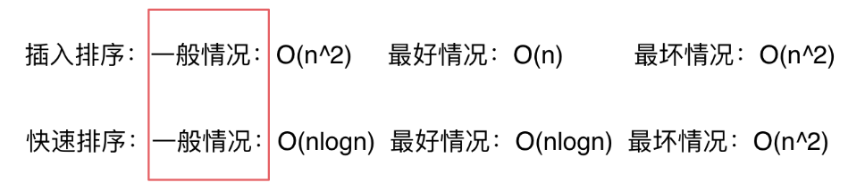
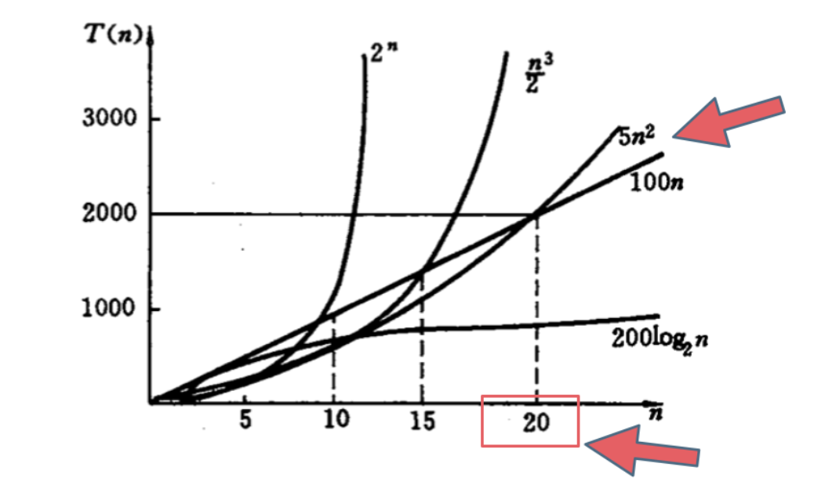
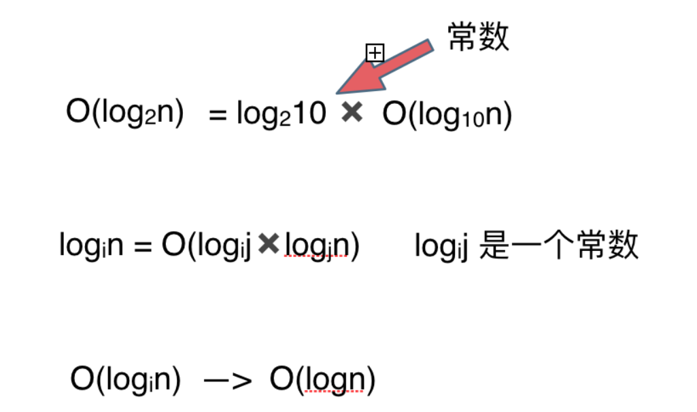
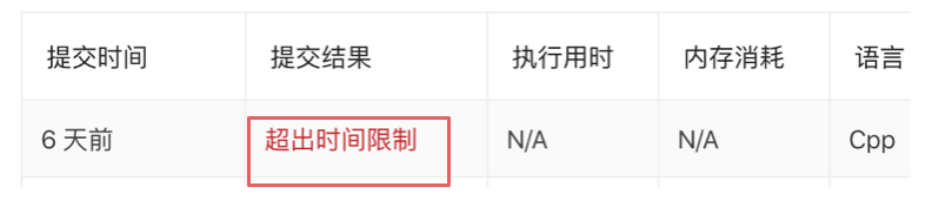

# cpp_data_structure 

* 代码随想录 https://programmercarl.com/

* 一个有非常简明例子的cpp网站：https://en.cppreference.com/w/

--------------------------------------------------------------------------------

# 算法性能分析

--------------------------------------------------------------------------------

## 时间复杂度

## _1_Time_Complexity.md
--------------------------------------------------------------------------------

### 1. 时间复杂度分析

> 本篇从如下六点进行分析：
> * 究竟什么是时间复杂度
> * 什么是大O
> * 不同数据规模的差异
> * 复杂表达式的化简
> * O(log n)中的log是以什么为底？
> * 举一个例子
> 

####  1.1 究竟什么是时间复杂度

> 时间复杂度是一个函数，它<font color="red">定性</font>描述该算法的运行时间, 用来方便开发者估算出程序运行的大致时间。<br>
> 通常将 **算法的操作单元数量** 来代表程序消耗的时间，这里默认CPU的每个单元运行消耗的时间都是相同的。<br>
> 假设算法的问题规模为n，那么操作单元数量便用函数$f(n)$来表示，随着数据规模n的增大，算法执行时间的增长率和$f(n)$的增长率相同，这称作为<font color="yellow">算法的渐近时间复杂度，简称时间复杂度，记为$O(f(n))$。</font><br>
> <font color="yellow">一般地，n为循环次数，$f(n)$为n次循环中执行的语句数量。</font><br>
> 

#### 1.2 什么是大O
> 什么是大O?
> > **算法导论给出的解释**：大O用来表示上界的，当用它作为算法的<font color="red">最坏情况</font>运行时间的上界，即对<font color="red">任意输入数据形式</font>的运行时间的上界。<br>
> 
> 怎么理解“最坏”？
> > 例1：插入排序
> > 插入排序的时间复杂度我们都说是 $O(n^2)$ , 但 $O(n^2)$ 是最坏的情况。输入数据的形式对程序运算时间是有很大影响的，在数据本来有序的情况下，插入排序的时间复杂度是$O(n)$，但如果数据是逆序的话，插入排序的时间复杂度就是 $O(n^2)$，也就对于所有输入情况来说，最坏是$O(n^2) $的时间复杂度，所以称插入排序的时间复杂度为$O(n^2)$。
> > 例2：快速排序
> > 我们知道快速排序是$O(nlogn)$。但是当数据本来有序情况下，快速排序的时间复杂度是$O(n^2)$ 的，所以严格从大O的定义来讲，快速排序的时间复杂度应该是$O(n^2)$。
> > 但是我们依然说快速排序是$O(nlogn)$的时间复杂度，这个就是业内的一个默认规定，这里说的$O$代表的就是一般情况，而不是严格的上界。<br>
> > 
> 如图所示：
> > <div align=center>
> > 
> > </div>
> 
> **我们主要关心的还是一般情况，而不是严格的上界**。
> **面试中说道算法的时间复杂度是多少指的都是一般情况**。
> 但是如果面试官和我们深入探讨一个算法的实现以及性能的时候，就要时刻想着数据用例的不一样，时间复杂度也是不同的，这一点是一定要注意的。
> 

#### 1.3 不同数据规模的差异
> 如下图中可以看出不同算法的时间复杂度在不同数据输入规模下的差异。
> > <div align=center>
> > 
> > </div>
> 
> 时间复杂度，用于估算出程序运行的大致时间，简化后的时间复杂度忽略了常数项和变量的常系数。**只有当数据规模够大时，进行时间复杂度的估算比较才有意义**。
> 如果数据规模很小，常数项 和 k次变量的常系数都会影响运行时间
> 例1：如果数据规模很小，用 $O(n^2)$ 的算法比 $O(n)$ 的更合适（在有常数项的时候）。
> 例2：如果数据规模很小，k次项变量的常系数也要考虑。例如上图中 $O(5n^2)$ 和 $O(100n)$ 对比，在$n<20$时， 很明显 $O(5n^2)$ 是更优的，所花费的时间也是最少的。<br>
> 
> **大O就是数据量级突破一个点且数据量级非常大的情况下所表现出的时间复杂度，这个数据量也就是常数项和变量的常系数已经不起决定性作用的数据量**。
> 例如上图中20就是那个点，n只要大于20 变量的系数 已经不起决定性作用了。即尽管$O(100n)$的系数是100，远大于$O(5n^2)$ 的系数5，但是数量级突破后，变量的系数已起不到决定性作用。 <br>
> 
> **所以我们说的时间复杂度都是省略常数项和变量常系数的，是因为一般情况下都是默认数据规模足够的大**
> 基于这样的事实，给出的算法时间复杂的的一个排行如下所示：
> <font color="yellow"> $O(1)常数阶 < O(logn)对数阶 < O(n)线性阶 < O(nlogn)线性对数阶 < O(n^2)平方阶 < O(n^3)立方阶 < O(2^n)指数阶$ </font>
> 
> 注：
> 1. O(1)是常量，即n增大时，时间复杂度不会变化
> 2. 但是也要注意大常数，如果这个常数非常大，例如10^7 ，10^9 ，那么常数就是不得不考虑的因素了。
> 

#### 1.4 复杂表达式的化简
> 有时候, 我们计算时间复杂度, 发现不是一个简单的O(n) 或者O(n^2)， 而是一个复杂的表达式，例如：
> ```c++
> O(2*n^2 + 10*n + 1000) 
> ```
> 那这里如何描述这个算法的时间复杂度呢，**简化法**:
> 去掉运行时间中的加法常数项 （因为常数项并不会因为n的增大而增加计算机的操作次数）.
> ```c++
> O(2*n^2 + 10*n)
> ```
> 去掉变量的常系数（上文中已经详细讲过为什么可以去掉变量的常系数的原因）。
> ```c++
> O(n^2 + n)
> ``` 
> 只保留保留最高项，去掉数量级小一级的n （因为n^2 的数据规模远大于n），最终简化为：
> ```c++
> O(n^2)
> ```
> 如果这一步理解有困难，那也可以做提取n的操作，变成O(n(n+1)) ，省略加法常数项后也就别变成了：
> ```c++
> O(n^2)
> ```
> 所以最后我们说：这个算法的算法时间复杂度是O(n^2) 。
> 也可以用另一种简化的思路，其实当n大于40的时候， 这个复杂度会恒小于O(3 × n^2)， O(2 × n^2 + 10 × n + 1000) < O(3 × n^2)，所以说最后省略掉常数项系数最终时间复杂度也是O(n^2)。
>

#### 1.5 O(logn)中的log是以什么为底？
> 平时说这个算法的时间复杂度是logn的，那么一定是log 以2为底n的对数么？
> 其实不然，也可以是以10为底n的对数，也可以是以20为底n的对数，但我们统一说 logn，也就是忽略底数的描述。
> 为什么可以这么做呢？如下图所示：
> > <div align=center>
> > 
> > </div>
> 假如有两个算法的时间复杂度，分别是log以2为底n的对数和log以10为底n的对数，那么这里如果还记得高中数学的话，应该不难理解以2为底n的对数 = 以2为底10的对数 * 以10为底n的对数。
> 而以2为底10的对数是一个常数，在上文已经讲述了我们计算时间复杂度是忽略变量常系数的。
> 抽象一下就是在时间复杂度的计算过程中，log以i为底n的对数等于log 以j为底n的对数，所以忽略了i，直接说是logn。
> 这样就应该不难理解为什么忽略底数了。
>

#### 1.6 举一个例子
> 
> 通过这道面试题目，来分析一下时间复杂度。
> 题目描述：找出n个字符串中相同的两个字符串（假设这里只有两个相同的字符串）。
> 
> 如果是暴力枚举的话，时间复杂度是多少呢，是O(n^2)么？
> 
> 这里一些同学会忽略了字符串比较的时间消耗，这里并不像int 型数字做比较那么简单，除了n^2 次的遍历次数外，字符串比较依然要消耗m次操作（m也就是字母串的长度），所以时间复杂度是O(m × n × n)。
> 
> 接下来再想一下其他解题思路。
> 
> 先排对n个字符串按字典序来排序，排序后n个字符串就是有序的，意味着两个相同的字符串就是挨在一起，然后在遍历一遍n个字符串，这样就找到两个相同的字符串了。
> 
> 那看看这种算法的时间复杂度，快速排序时间复杂度为O(nlogn)，依然要考虑字符串的长度是m，那么快速排序每次的比较都要有m次的字符比较的操作，就是O(m × n × log n) 。
> 
> 之后还要遍历一遍这n个字符串找出两个相同的字符串，别忘了遍历的时候依然要比较字符串，所以总共的时间复杂度是 O(m × n × logn + n × m)。
> 
> 我们对O(m × n × log n + n × m) 进行简化操作，把m × n提取出来变成 O(m × n × (logn + 1))，再省略常数项最后的时间复杂度是 O(m × n × log n)。
> 
> 最后很明显O(m × n × logn) 要优于O(m × n × n)！
> 
> 所以先把字符串集合排序再遍历一遍找到两个相同字符串的方法要比直接暴力枚举的方式更快。
> 
> 这就是我们通过分析两种算法的时间复杂度得来的。
> 
> 当然这不是这道题目的最优解, 博客仅仅是用这道题目来讲解一下时间复杂度。
>

#### 总结
> 本篇讲解了什么是时间复杂度，复杂度是用来干什么，以及数据规模对时间复杂度的影响。
> 
> 还讲解了被大多数同学忽略的大O的定义以及log究竟是以谁为底的问题。
> 
> 再分析了如何简化复杂的时间复杂度，最后举一个具体的例子，把本篇的内容串起来。
>

--------------------------------------------------------------------------------

### 2. 算法为什么会超时

> 一些同学可能对计算机运行的速度还没有概念，就是感觉计算机运行速度应该会很快，那么在leetcode上做算法题目的时候为什么会超时呢？<br>
> 计算机究竟1s可以执行多少次操作呢？ 接下来探讨一下这个问题。
>

#### 2.1 超时是怎么回事
> > <div align=center>
> > 
> > </div>
> 大家在leetcode上练习算法的时候应该都遇到过一种错误是“超时”。
> 
> 也就是说程序运行的时间超过了规定的时间，**一般OJ（online judge）的超时时间就是1s，也就是用例数据输入后最多要1s内得到结果**，暂时还不清楚leetcode的判题规则，下文为了方便讲解，暂定超时时间就是1s。
> 
> 如果写出了一个$O(n)$的算法 ，其实可以估算出来n是多大的时候算法的执行时间就会超过1s了。
> 
> **如果n的规模已经足够让$O(n)$的算法运行时间超过了1s，就应该考虑log(n)的解法了**。
>

#### 2.2 从硬件配置看计算机的性能
> 计算机的运算速度主要看CPU的配置，以2015年MacPro为例，CPU配置：2.7 GHz Dual-Core Intel Core i5
> 
> 也就是 2.7 GHz 奔腾双核，i5处理器，GHz是指什么呢，1Hz = 1/s，1Hz 是CPU的一次脉冲（可以理解为一次改变状态，也叫时钟周期），称之为为赫兹，那么1GHz等于多少赫兹呢
> * 1GHz（兆赫）= 1000MHz（兆赫）
> * 1MHz（兆赫）= 1百万赫兹
> 
> 所以 1GHz = 10亿Hz，表示CPU可以一秒脉冲10亿次（有10亿个时钟周期），这里不要简单理解一个时钟周期就是一次CPU运算。
> 
> 例如1 + 2 = 3，cpu要执行四次才能完整这个操作，步骤一：把1放入寄存机，步骤二：把2放入寄存器，步骤三：做加法，步骤四：保存3。
> 
> 而且计算机的cpu也不会只运行我们自己写的程序上，同时cpu也要执行计算机的各种进程任务等等，我们的程序仅仅是其中的一个进程而已。
> 
> 所以我们的程序在计算机上究竟1s真正能执行多少次操作呢？
> 

#### 2.3 做个测试实验
> 在写测试程序测1s内处理多大数量级数据的时候，有三点需要注意：
> 
> * CPU执行每条指令所需的时间实际上并不相同，例如CPU执行加法和乘法操作的耗时实际上都是不一样的。
> * 现在大多计算机系统的内存管理都有缓存技术，所以频繁访问相同地址的数据和访问不相邻元素所需的时间也是不同的。
> * 计算机同时运行多个程序，每个程序里还有不同的进程线程在抢占资源。
>
> 尽管有很多因素影响，但是还是可以对自己程序的运行时间有一个大体的评估的。
>
> 引用算法4里面的一段话：
> * 火箭科学家需要大致知道一枚试射火箭的着陆点是在大海里还是在城市中；
> * 医学研究者需要知道一次药物测试是会杀死还是会治愈实验对象；
>
> 所以**任何开发计算机程序员的软件工程师都应该能够估计这个程序的运行时间是一秒钟还是一年**。
> 这个是最基本的，所以以上误差就不算事了。
>
> 以下以C++代码为例：
> 
> 测试硬件：联想 Y9000X 2019 ，CPU配置：2.6 GHz 6-Core Intel(R) Core(TM) i7-9750H
> 
> 实现三个函数，时间复杂度分别是 $O(n)$ , $O(n^2)$, $O(n\log n)$，使用加法运算来统一测试。
>
> * CMake组织文件结构
> ```cmake
> # .../cpp_data_structure/CMakeLists.txt
> 
> # 最小版本，可以通过cmake --version查看
> cmake_minimum_required(VERSION 3.5.1)
> 
> # 项目名称，建议大写
> project(CPP_DATA_STRUCTURE)
>
> # 支持c++11
> set(CMAKE_CXX_STANDARD 11)
>
> # 添加头文件路径
> include_directories(
>     ${PROJECT_SOURCE_DIR}/    # 使用绝对路径有好处, 不用担心当前CMakeLists.txt和include相对路径关系
>     ${PROJECT_SOURCE_DIR}/include/Algorithm_Performance_Analysis
> )
>
> # 生成可执行文件
> # 把./src目录下的所有源文件都添加到SRC_LIST源列表变量里面去
> aux_source_directory(./src SRC_LIST)                            
> # 把./src/Algorithm_Performance_Analysis目录下的所有源文件都添加到SRC_LIST_1源列表变量里面去
> aux_source_directory(./src/Algorithm_Performance_Analysis SRC_LIST_1)    
> # 生成可执行文件命令，第一个参数是生成可执行文件的名称main，后面的参数是源文件/源文件列表
> add_executable(main main.cpp ${SRC_LIST} ${SRC_LIST_1}) 
> 
> # 指定生成可执行文件的输出目录
> set(EXECUTABLE_OUTPUT_PATH ${PROJECT_SOURCE_DIR}/out)  # 使用绝对路径最好
>
> # 设置编译时的选项，如O2优化，开启警告,使用的C++标准等
> set(CMAKE_CXX_FLAGS "${CMAKE_CXX_FLAGS} -Wall")
> 
> # 调试时使用该项
> set(CMAKE_BUILD_TYPE Debug)
> ```
>
> * 头文件，声明函数
> ```c++
> // .../cpp_data_structure/include/Algorithm_Performance_Analysis/compare_time_complexity.h
>
> #ifndef COMPARE_TIME_CONPLEXITY_H    // 防止头文件的重复包含和编译
> #define COMPARE_TIME_CONPLEXITY_H
> 
> void compare_time_function1(long long n);
> void compare_time_function2(long long n);
> void compare_time_function3(long long n);
>
> #endif
> ```
>
> * 源文件，函数实现
> ```c++
> // .../cpp_data_structure/src/Algorithm_Performance_Analysis/compare_time_complexity.cpp
> 
> #include "compare_time_complexity.h"
> 
> // O(n)
> void compare_time_function1(long long n) {
>     long long k = 0;
>     for (long long i = 0; i < n; i++) {
>         k++;
>     }
> }
> // O(n^2)
> void compare_time_function2(long long n) {
>     long long k = 0;
>     for (long long i = 0; i < n; i++) {
>         for (long j = 0; j < n; j++) {
>             k++;
>         }
>     }
> }
> // O(nlogn)
> void compare_time_function3(long long n) {
>     long long k = 0;
>     for (long long i = 0; i < n; i++) {
>         for (long long j = 1; j < n; j = j*2) { // 注意这里j=1
>             k++;
>         }
>     }
> }
> /*
> 为什么第三个是O(nlogn)？
> 第一层：1，2，3，…，n运行n次，时间复杂度是n
> 第二层：1，2，4，8，…，n。运行次数设为x，即1*2x=n时停止，得x=log2n，忽略底数，运行x=logn次，时间复杂度是logn
> 所以第三个算法的时间复杂度是nlogn。
> */
> ```
>
> * main.cpp
> ```c++
> // .../cpp_data_structure/main.cpp
> 
> #include <iostream>   
> using namespace std;
>
> #include <cstdlib>    // 在windows系统下，用语句system("pause"); ,控制台不会输出后马上消失。
> #include <unistd.h>   // 在Linux系统下，用语句pause(); ,控制台不会输出后马上消失。
> 
> #include <chrono>
> #include <thread>
> using namespace chrono;
> 
> #include "compare_time_complexity.h"
>
> 
> int main()
> {
>     long long n; // 数据规模
>     while (1) {
>         cout << "O(n)算法 ";
>         // cout << "O(n^2)算法 ";
>         // cout << "O(nlogn)算法 ";
> 
>         cout << "输入n：";
>         cin >> n;
> 
>         milliseconds start_time = duration_cast<milliseconds >(
>             system_clock::now().time_since_epoch()
>         );
> 
>         compare_time_function1(n);
>         // compare_time_function2(n);
>         // compare_time_function3(n);
> 
>         milliseconds end_time = duration_cast<milliseconds >(
>             system_clock::now().time_since_epoch()
>         );
> 
>         cout << "耗时:" << milliseconds(end_time).count() - milliseconds(start_time).count()
>             <<" ms"<< endl;
>     }
> 
>     cout << endl;
>     pause(); // Linux中用pause(); Windows中用system("pause"); 
>     return 0;
> }
> ```
>
> 编译运行, 注释不同的函数调用，比较运行时间
> ```c++
> // 运行func1，注释func2和func3
> O(n)算法 输入n：100000000
> 耗时:188 ms
> O(n)算法 输入n：1000000000
> 耗时:1878 ms
> O(n)算法 输入n：500000000
> 耗时:944 ms
> ```
> ```c++
> // 运行func2，注释func1和func3
> O(n^2)算法 输入n：1000
> 耗时:2 ms
> O(n^2)算法 输入n：10000
> 耗时:189 ms
> O(n^2)算法 输入n：20000
> 耗时:756 ms
> O(n^2)算法 输入n：25000
> 耗时:1192 ms
> O(n^2)算法 输入n：22500
> 耗时:955 ms
> ```
> ```c++
> // 运行func3，注释func1和func2
> O(nlogn)算法 输入n：1000000
> 耗时:48 ms
> O(nlogn)算法 输入n：10000000
> 耗时:506 ms
> O(nlogn)算法 输入n：20000000
> 耗时:995 ms
> ```
> ```c++
> O(n)的算法，1s内大概计算机可以运行 5 * (10^8)次计算。
> O(n^2)的算法，1s内大概计算机可以运行 22500次计算，即5 * (10^8)开根号。
> O(nlogn)的算法，1s内大概计算机可以运行 2 * (10^7)次计算。比 O(n)少一个数量级。
> ```
#### 总结
> 本文详细分析了在leetcode上做题程序为什么会有超时，以及从硬件配置上大体知道CPU的执行速度，然后亲自做一个实验来看看$O(n)$的算法，跑一秒钟，这个n究竟是做大，最后给出不同时间复杂度，一秒内可以运算出来的n的大小。

--------------------------------------------------------------------------------


