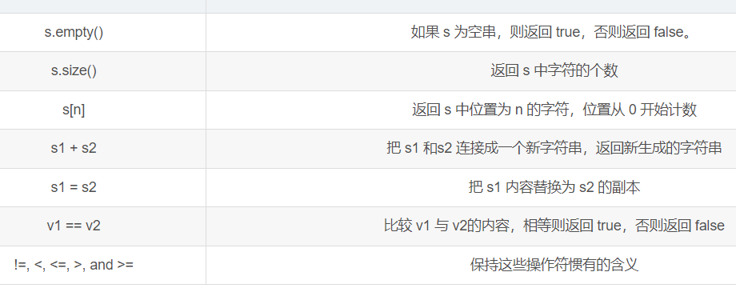
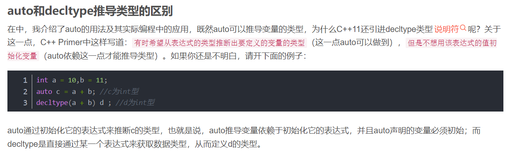

# cpp_data_structure 

* 代码随想录 https://programmercarl.com/

* 一个有非常简明例子的cpp网站：https://en.cppreference.com/w/
  <br> 例如，查看std::vector的assign的用法：https://en.cppreference.com/w/cpp/container/vector/assign
  <br> 三种方式通过一个例子完美解释了，还夹带lambda干货。

--------------------------------------------------------------------------------

```c++
// STL（标准模板库） 
#include <array>               // std::array                                    容器
#include <vector>              // std::vector                                   容器
#include <list>                // std::list                                     容器
#include <stack>               // std::stack                                    容器适配器
#include <queue>               // std::queue          std::priority_queue       容器适配器
#include <deque>               // std::deque                                    容器
#include <string>              // std::string                                   容器
#include <map>                 // std::map            std::multimap             容器   
#include <set>                 // std::set            std::multiset             容器
#include <unordered_map>       // std::unordered_map  std::unordered_multimap   容器
#include <unordered_set>       // std::unordered_set  std::unordered_multiset   容器

// 与STL 容器有关的头文件
// <algorithm>是标准模版库（STL）中最重要的头文件之一，提供了大量基于迭代器的非成员模板函数。
#include <algorithm>   // remove()、remove_if()、find_if()、sort、...
// https://blog.csdn.net/szplzx1314/article/details/120644640

#include <iterator> // next() prev() distance() advance()
```

--------------------------------------------------------------------------------

# STL container 容器

--------------------------------------------------------------------------------

## std::string 字符串

## _6_STL_String.md

--------------------------------------------------------------------------------

### C 风格字符串

#### 定义C字符串

> 在C语言中，
> 
> 我们都是用字符数组 `char ch[]` 来定义字符串。
> 
> ```c++
> char site[7] = {'R', 'U', 'N', 'O', 'O', 'B', '\0'};
> 
> char site[] = "RUNOOB";
> ```
> 

#### 操作C字符串

> 通过`#include <cstring>` 来使用很多函数，例如
> 
> ```c++
> #include <cstring> 
> strlen()、strcat()、strcpy()、strcmp()、
> strstr()、strchr()、
> isupper()、islower()、toupper()、tolower()
> ```
> 
> 具体例子如下：
> 
> ```c++
> // -------------strstr()和strncpy()----------------------
>   
> char str[] = "This is a simple string";
> char *pch;
> pch = strstr(str, "simple");
> if (pch != NULL)
>  	strncpy(pch, "sample", 6);   
>   // simple换成sample。 显示This is a sample string
> puts(str);
> ```
> 
> ```c++	
> // -------------strcpy()和strncpy()----------------------
> char src[40];
> char dest[12] = "123456789a0";  //只能11个字符，再多就报错
> 
> // memset(dest, '\0', sizeof(dest));   
>       // void *memset(void *s, int c, size_t n);   
>       // s指向要填充的内存块。    c是要被设置的值。  n是要被设置该值的字符数。 
>       // 返回类型是一个指向存储区s的指针。
> // memset是一个初始化函数，作用是将某一块内存中的全部设置为指定的值。 
> cout << "sizeof(dest):\t" << sizeof(dest) <<endl;
> cout << "dest:\t" << dest <<endl;
> cout << endl;	
> 
> strcpy(src, "This is runoob.com");
> cout << "src:\t" << src <<endl;	
> cout << endl;	
>
> strncpy(dest, src, 10);
> cout << "sizeof(dest):\t" << sizeof(dest) <<endl;
> cout << "dest:\t" << dest <<endl;
> cout << endl;	
>
> printf("最终的目标字符串： %s\n", dest);
> ```
> 
> ```c++	
> // -------------islower()和isupper()----------------------------
> 
> int var1 = 'Q';
> int var2 = 'q';
>    
> if( islower(var1) ) {
>     printf("var1 = |%c| 是小写字母\n", var1 );
> } else {
>     printf("var1 = |%c| 不是小写字母\n", var1 );
> }
> 
> if( isupper(var2) ) {
>     printf("var2 = |%c| 是大写字母\n", var2 );
> } else {
>     printf("var2 = |%c| 不是大写字母\n", var2 );
> }
> ```
> 
> ```c++	
> // ---------------tolower()和toupper()------------------------------
> int i;
> char str_1[] = "runoob";
> char str_2[] = "RUNOOB";
> 	
> cout << "str_1:\t" << str_1 << endl;
> cout << "str_2:\t" << str_2 << endl;
> 
> i = 0;
> cout << "After toupper() str_1:\t";	
> while(str_1[i]) {
>     putchar (toupper(str_1[i]));
>     i++;
> }
> cout << endl;
>     
> i = 0;
> cout << "After tolower() str_2:\t";	
> while(str_2[i]) {
>      putchar (tolower(str_2[i]));
>      i++;
> }
> cout << endl;
> ```
> 
> ```c++	
> // -------------------strlen()--------------------------------------
>
> char site_1[7] = {'R', 'U', 'N', 'O', 'O', 'B', '\0'};
> char site_2[7] = {'R', 'U', 'N', 'O', 'O', 'B', '0'};
> 
> cout << "strlen(site_1):\t" << strlen(site_1) << endl;
> cout << "strlen(site_2):\t" << strlen(site_2) << endl;	
> ```   
>

### C++ 引入的 `string` 类类型

<https://blog.csdn.net/weixin_43744293/article/details/118299233>

>
> <font color="yellow"> 
>
> `vector<char>` 和 `string` 有什么区别呢？
>
> 其实在基本操作上没有区别，但是 `string`提供更多的字符串处理的相关接口，例如`string` 重载了`+`，而`vector`却没有。
>
> 所以想处理字符串，我们还是会定义一个`string`类型
>
> </font>
>
> 


#### 简介

> `C` 中需要`<cstring>`中的函数来操作的，在`C++`中都很简单
> 
> `C++` 标准库提供了 `std::string` 类，支持上述所有的操作，另外还增加了其他更多的功能。
> 
> ```c++
> #include <string> 
> 
> string str1 = "runoob";
> string str2 = "google";
> string str3;
> int  len ;
>  
> // 复制 str1 到 str3
> str3 = str1;
> cout << "str3 : " << str3 << endl;
> 
> // 连接 str1 和 str2
> str3 = str1 + str2;
> cout << "str1 + str2 : " << str3 << endl;
> 
> // 连接后，str3 的总长度
> len = str3.size();
> cout << "str3.size() :  " << len << endl;
> ```
> 运行结果如下：
> ```c++
> str3 : runoob
> str1 + str2 : runoobgoogle
> str3.size() :  12
> ```
> 


#### `string` 对象的定义和初始化

> 
> 定义及初始化，例子如下：
> 
> ```c++
> string s1; // 默认构造函数 s1 为空串
> string s2(s1); // 将 s2 初始化为 s1 的一个副本
> string s2 = s1; // 等价于s2(s1)
> string s3("value"); // 将 s3 初始化为一个字符串字面值副本
> string s3 = "value"; // // 等价于s3("value")
> string s4(n,'c'); // 将 s4 初始化为字符 ‘c’ 的 n 个副本
> ```
> 
> <font color="yellow"> PS：因为历史原因以及为了与 `C` 语言兼容，字符串字面值"`value`"与标准库 `string` 类型不是同一种类型。这一点很容易引起混乱，编程时一定要注意区分字符串字面值和 `string` 数据类型的使用，这很重要。 </font>
>
> 查看变量类型，例子如下：
> 
> ```c++
> #include <typeinfo>   // 查看变量类型 typeid(变量名).name()
> 
> char ch[] = "value";
> string s("value");
> 
> cout<< "typeid(\"value\").name() = " << typeid("value").name() << setw(20) <<"表示:char[6]" << endl;
> cout<< "typeid(\'v\').name()     = " << typeid('v').name()     << setw(20) <<"表示:char" << endl;
> 
> cout<< "typeid(ch).name()      = "   << typeid(ch).name()      << setw(20) <<"表示:char[6]" << endl;
> cout<< "typeid(ch[0]).name()   = "   << typeid(ch[0]).name()   << setw(20) <<"表示:char" << endl;
> 
> cout<< "typeid(s).name()       = "   << typeid(s).name()       << setw(20) <<"表示:string" << endl;
> cout<< "typeid(s[0]).name()    = "   << typeid(s[0]).name()    << setw(20) <<"表示:char" << endl;
> ```
> 
> 运行结果：
> 
> ```c++
> typeid("value").name() = A6_c      表示:char[6]
> typeid('v').name()     = c         表示:char
> typeid(ch).name()      = A6_c      表示:char[6]
> typeid(ch[0]).name()   = c         表示:char
> typeid(s).name()       = NSt7__cxx1112basic_stringIcSt11char_traitsIcESaIcEEE       表示:string
> typeid(s[0]).name()    = c         表示:char
> ```
> 

#### `string` 对象的读写

* **1. 用`cin`获取键盘输入的值**
> 
> 用法很简单，和`int`、`double`等内置类型的cin一样使用。
> 
> <font color="yellow"> 不过需要说明一点：string对象会自动忽略开头的空白（既空格、换行符、制表符等），并从第一个真正的字符开始读入，直到遇到下一处空白 </font>
> 
> ```c++
> string s;		//定义一个空字符串
> cin >> s;		//从标准输入读取 string 并将读入的串存储在 s 中
> cout << s << endl;	
> ```
> 编译并运行：
> ```c++
> Hello world!  // 键盘输入
> Hello         // 显示输出
> ```
> 
> 忽略了输入`Hello world`前的空白。从`H`开始读取字符，在`o`后面遇到了一处空白，此时不再读取后面的字符。
> 
> <font color="yellow"> 注意，`world`其实还在缓冲区内，如果再用`cin`读取，你无法从键盘输入，会直接读到`world`。 </font>
> 


* **2. 使用 `getline` 读取整行文本**
> 
> 另外还有一个有用的 `string IO` 操作：`getline`。
> 
> 这个函数接受两个参数：一个输入流对象和一个 `string` 对象。
> 
> `getline` 函数从输入流的下一行读取，并保存读取的内容到不包括换行符。
> 
> <font color="yellow"> 和输入操作符不一样的是，`getline` 并不忽略行开头的换行符。只要 `getline` 遇到换行符，即便它是输入的第一个字符，`getline` 也将停止读入并返回。如果第一个字符就是换行符，则 `string` 参数将被置为空 `string`。 </font>
> 
> `getline`的函数格式：`getline(cin,string对象)`
> 
> ```c++
> string line;
> getline(cin, line);
> cout << line << endl;
> ```
> 编译并运行：
> ```c++
> Hello world!  // 键盘输入
> Hello world!  // 显示输出
> ```
> 
> 由于 `line` 不含换行符，若要逐行输出需要自行添加。照常，我们用 `endl` 来输出一个换行符并刷新输出缓冲区。
> 由于 `getline` 函数返回时丢弃换行符，换行符将不会存储在 `string` 对象中
>
> 


* **3. 读入未知数目的 `string` 对象**
>
> 和内置类型的输入操作一样，`strin`g 的输入操作符也会返回所读的数据流。因此，可以把输入操作作为判断条件。下面的程序将从标准输入读取一组 `string` 对象，然后在标准输出上逐行输出：
> 
> ```c++
> string word;
> while (cin >> word){
>     cout << word << endl;
> }    
> ```
> 编译并运行：
> ```c++
> Hello world!  // 键盘输入
> Hello         // 显示输出
> world!
> ```
> 
> 上例中，用输入操作符来读取 `string` 对象。该操作符返回所读的 `istream` 对象，并在读取结束后，作为 `while` 的判断条件。如果输入流是有效的，即还未到达文件尾且未遇到无效输入，则执行 `while` 循环体，并将读取到的字符串输出到标准输出。如果到达了文件尾，则跳出 `while` 循环。
> 

* **4. 读入未知行数的 string 对象**
> 
> `getline` 函数将 `istream` 参数作为返回值，和输入操作符一样也把它用作判断条件。例如，重写前面那段程序，把每行输出一个单词改为每次输出一行文本：
> 
> ```c++
> string line;
> while (getline(cin, line)){
>     cout << line << endl;
> }
> ```
> 


#### `string` 对象的操作

> 
> <div align=center>
> 
> </div>
> 
>
> **1. 比较`string`的大小**
>>
>> <font color="yellow"> 实际上，是逐位比较 </font>
>> 
>> 例1：
>> ```c++
>> string str = "Hello";
>> string phrase = "Hello ";
>> ```
>> 
>> 尽管两者的前面对应的字符都一样，但是phrase长度长（多一个空格），所以phrase>str。
>> 
>> 例2：
>> ```c++
>> string str2 = "Hello";
>> string phrase2 = "Hi ";
>> ```
>>
>> 这种情况比较的是第一个相异字符，根据字符值比较大小，因为i的字符值>e的字符值，所以`phrase2 > str2`。
>> 
>> 总结：
>> 看上面两种情况，实际上可以都看成是一个一个字符比较。对于第一种，`str`最后为空，而`phrase`为空格，空格字符值不为负，所以`phrase > str`。
>> 
> 
> 
> **2. 两个string对象相加**
>>
>> ```c++
>> string str = "Hello,";
>> string phrase = "world ";
>> 
>> string s = str + phrase;
>> str += phrase;//相当于str = str + phrase
>> 
>> cout << s << endl;
>> cout << str << endl;
>> ```
>> 编译运行
>> ```c++
>> Hello,world 
>> Hello,world 
>> ```
>
> **3. `string`对象加上一个字符（或字符串）字面值**
>>
>> 首先问一个问题：
>> <font color="green"> 因为历史原因以及为了与 `C` 语言兼容，字符串字面值"value"与标准库 string 类型不是同一种类型。</font>
>>
>> <font color="yellow"> 那为什么`string`对象可以加上字符或字符串字面值？</font>
>>
>> <font color="yellow"> 因为它们可以自动转换为`string`类型。</font>
>> 
>> 下面看例子：
>> ```c++
>> string str = "Hello";
>> string phrase = "world";
>> 
>> string s = str + ','+ phrase+ '\n';
>> cout << s ;
>> ```
>> 编译运行
>> ```c++
>> Hello,world 
>> ```
>
> **判断下面的加法是否正确？**
>> ```c++
>> string str = "Hello";
>> ```
>> ```c++
>> (1)string s2 = str + "," + "world";
>> (2)string s3 = "Hello" + "," + str;
>> ```
>> 答案：`(1)`正确；`(2)`错误
>> <font color="yellow"> 当`string`对象和字符或字符串字面值相加时，必须确保+号的两侧的运算对象至少有一个`string`。</font> 
>> `(1)` `str + “,”`会返回一个`string`类，然后`+str`时又会返回一个string类
>> `(2)` `"Hello" + ","`因为都不知`string`类，都是字符串值，不能使用“`+`”运算符。
>> 

#### 如何获取和处理string中的每个字符

> **从一个例子开始**
>> ```c++
>> string s = "Hello world!";
>> cout << s[0] << endl;
>> cout << s[s.size()-1] << endl;
>> 
>> cout << s << endl;
>> s[0] = 'h';
>> cout << s << endl;
>> ```
>> 运行结果
>> ```c++
>> H
>> !
>> Hello world!
>> hello world!
>> ```
>
> **1. 使用下标运算符[ ]遍历整个string对象：**
>>
>> ```c++
>> string s = "Hello world!";
>> for (decltype(s.size()) index = 0; index != s.size(); index++){
>> 	cout << s[index] << ",";
>> }
>> cout<<endl;
>> ```
>> 运行结果
>> ```c++
>> H,e,l,l,o, ,w,o,r,l,d,!,
>> ```
>> 这里把`index`的类型声明为`s.size()`的返回类型：`string::size_type`，它是无符号类型。当然你也可以用其他类型，但是请注意，下标值不能超过`string.size()-1`,否则会产生不可预知的结果。
>> 
>> `decltype`使用可参考：[有auto为什么还要decltype ?详解decltype的用法](https://blog.csdn.net/weixin_43744293/article/details/117988589)
>> 
>> <div align=center>
>> 
>> </div>
>> 
>> * `auto`通过初始化它的表达式来推断变量的类型，即`auto`声明的变量**必须初始化**。
>> * `decltype`是直接通过某一个表达式来获取数据类型，**不需要进行初始化**。
>> 
>> 我们想要将`index`的类型与`s.size()`相同，但是`auto`会把`index`的初始值设定为`size`的值，这时候我们需要用`decltype`。
>
> **2.使用迭代器遍历**
>>
>> ```c++
>> string s = "Hello world!";
>> for (auto i = s.begin(); i != s.end(); i++) {
>>     cout << *i  << ",";
>> }
>> cout << endl;
>> ```
>> 运行结果
>> ```c++
>> H,e,l,l,o, ,w,o,r,l,d,!,
>> ```
>
> **3.使用基于范围的for语句遍历**
>> 基于范围的for语句是`C++11`新提供的一种语句，其语法形式是
>> ```c++ 
>> for (declaration : expression)
>>     statement
>> ```
>> 其中
>> `expression`部分是一个对象，必须是一个序列，这些类型的共同特点是拥有能返回迭代器的`begin`和`end`成员。
>> `declaration` 部分负责定义一个变量，该变量将被用于访问序列中的基础元素。每次迭代，`declaration`部分的变量会被初始化为`expression`部分的下一个元素值。确保类型相容最简单的办法是使用`auto`类型说明符。
>> 
>> 这样看上去还不明白的话，请看下面的例子，通过例子就可以很好理解：
>>
>> ```c++
>> string str("some string");
>> for (auto c : str)
>> 	cout << c << ",";
>> cout << endl;
>> ```
>> `c`就是`declaration`；`str`就是`expression`；`cout << c << “,”;`就是`statement`。
>> 
>> `for`循环把`c`和`str`联系起来了。此例中，通过`auto`关键字让编译器推断`c`的类型，`c`这里的类型实际上推断出的是`char`类型，`c`每次的值都是`str`中的一个字符，
>> 
>> 上述代码的运行的结果如下：
>> 
>> ```c++
>> s,o,m,e, ,s,t,r,i,n,g,
>> ```
>>
>> **注意：在基于范围的for循环中，如果想要改变expression对象中的值，必须把循环变量定义成引用类型**
>> 
>> ```c++
>> #include <string>   // string类
>> #include <cctype>   // string对象的各种字符处理函数，如toupper、isupper
>> 
>> string s("Hello, World!!!");
>>
>> for(auto c : s){   // 未使用引用操作符       
>>    c=toupper(c);   
>> }
>>
>> cout << s << endl;
>> for(auto &c : s){           
>>    c=toupper(c);   //toupper函数完成大写字符的替换
>> }
>> cout << s << endl;
>> ```
>> 运行：
>> ```c++
>> Hello, World!!!
>> HELLO, WORLD!!!
>> ```
>> **补充一点：**
>> 范围for语句`for(auto& r:v)`的定义等价于：
>> ```c++
>> for(auto beg = v.begin() , end = v.end() ; beg != end ; ++beg){
>> 	auto &r = *beg;
>> }
>> ```
>> <font color="yellow"> 可以看到，在范围for里面，总是预存了`v.end()`的值，所以，一旦在`范围for`里面添加（删除）序列`v`的元素，获取的`end`值就变得无效了，这一点很重要。</font> 
>>

>> <font color="yellow"> 综上，还是使用迭代器最保险（`auto`），既能避免使用`decltype`，又能避免`范围for循环`的各种限制条件</font> 
>> 


#### 构造string对象的其他方法

> 1. 拷贝数组
>> 形式：`string s(cp,n)`
>> 解释：将`cp`所指的数组的前`n`个字符拷贝给`string`对象`s`，`n`为可选参数。
>> ```c++
>> const char *cp = "hello world";//最后有一个空字符
>> char cp2[] = "hello world";//最后有一个空字符
>> char cp3[] = { 'h', 'e' };//最后没有空字符
>> 
>> (1) string s1(cp);//s1为”hello world”，长度为11
>> (2) string s2(cp2);//s2为”hello world”，长度为11
>> (3) string s3(cp3);//因为cp3不以空字符结尾，所以这是未定义行为
>> 
>> (4) string s4(cp,5);//s4为”hello”，长度为5。将cp改为cp2一样
>> (5) string s5(cp,13);//s5为”hello world  ”，长度为13,后面有两个空字符。将cp改为cp2一样
>> (6) string s6(cp3,2);//s6为”he”，长度为2
>> ```
>> 注意，初始化中有一个 `string s(n, ch)`,注意区别
>> ```c++
>> string s4(n,'c'); // 将 s4 初始化为字符 ‘c’ 的 n 个副本
>> ```
> 
> 2.拷贝string对象
>> 形式：
>> * `string s(s1,pos)`
>> * `string s(s1,pos,len)`
>> 
>> 解释：
>>  * 第一个将s1从下标pos开始拷贝到结尾。当`pos>s1.size()`时，为未定义行为；当`pos=s1.size()`，拷贝一个空字符
>>  * 第二个将`s1`从下标`pos`开始拷贝，拷贝`len`个字符。当`pos>s1.size()`时，为未定义行为；当`pos=s2.size()`，拷贝一个空字符
>> 
>> ```c++
>> string s1("value");
>> 
>> (1) string s2(s1, 1);//s2为” alue”,长度为4
>> (2) string s3(s1, 5);//s3为””,长度为0
>> (3) string s8(s1, 6);// 错误，未定义的行为，抛出异常
>> 
>> (4) string s4(s1, 1,3);// s4为” alu”,长度为3
>> (5) string s5(s1, 1,8);// 正确，s5为” alue”,长度为4
>> (6) string s6(s1, 5,8);// s6为””,长度为0
>> (7) string s7(s1, 6,1);// 错误，未定义的行为，抛出异常
>> ```
> 3.使用`substr`成员函数
> 和 `2. 拷贝string对象` 的`形式2` `string s(s1,pos,len)` 基本相同。
>> 格式：`s.substr(pos,n)`
>> 解释：返回一个string对象，返回的对象包含`s`从`pos`下标开始的n个字符。`pos`和`n`均为可选参数。`pos`默认为下标`0`；`n`默认为`s.size()-pos`。
>> ```c++
>> string s ("value");
>> 
>> (1)string s2 = s.substr();//s2为”value”,大小为5
>> 
>> (2)string s3 = s.substr(2);//s3为”lue”,大小为3
>> (3)string s4 = s.substr(5);//s3为””,大小为0
>> (4)string s5 = s.substr(6);//错误，s5的大小为pos = 5，小于s.size()
>> 
>> (5)string s6 = s.substr(1,2);// s6为”al”,大小为2
>> (6)string s7 = s.substr(1,7);// s7为”alue”,大小为4
>> (7)string s8 = s.substr(5,7);// s8为””,大小为0
>> (8)string s9 = s.substr(6,7);// 错误，s9的大小为pos = 5，小于s.size()
>> ```


#### string对象的各种函数

##### string对象的length()
> `length()`只是用来获取字符串的长度。
> 
> 在获取字符串长度时，`size()`函数与`length()`函数作用相同。 
> 
> 除此之外，`size()`函数还可以获取`vector`类型的长度。
> 
> `sizeof()`运算符用来求对象所占内存空间的大小。
> 

##### string对象的resize()
> `_4_reverse_words_in_a_string.md`
> `_5_zuo_xuan_zhuan_zi_fu_chuan_lcof.md`
> 
> 考虑一个字符串对象 `str`。要调整字符串对象的大小，语法将是：
>
> `str.resize(k,c);` c为可选参数
>
> 该函数包含两个参数。
>
> **k**: k 是第一个参数中指定的字符数。它调整字符串的大小，使字符串包含 k 个字符。
> > * 如果 k 小于字符串的长度，则将字符串长度缩短为 k 指定的长度，删除 k 之外的所有字符。
> > * 如果 k 大于字符串的长度，则字符串长度扩展到 k 指定的长度。
>
> **c**: 如果 k 大于字符串的长度，则 c 是要添加到新空格中的新字符。这是**可选参数**。
>
> 

##### string对象的insert()


##### string对象的erase()
> `_4_reverse_words_in_a_string.md`
>
> 删除指定位置的元素，语法是：
> 
> `str.erase( iterator );` 
>
> 时间复杂度为`O(n)`
>
> 


##### string对象的appen


##### string对象的assign()


##### string对象的搜索操作 各种find

> 
> `_7_repeated_substring_pattern.md`
>
> 移动匹配中用到了
>
> `if (t.find(s) != std::string::npos) return true;`
>
> https://blog.csdn.net/lmb1612977696/article/details/81455708
> 


##### string对象的compare操作


#### 字符串类型`string` 也有类似栈的操作

> `string::empty()`
> `string::back()`
> `string::push_back()`
> `string::pop_back()`
> 
> 等等有很多，可以看看这些用法
> 


#### 类型转换

##### 总结

> 
> ```c++
> string s1 = "123"; 
> s1.c_str() // 将 string类型 转换为 const char*类型转换
> 
> #include <cstdlib> 
> // 注： itoa()：将 int类型 转换为 const char*类型。
> // 注： atoi()：将 const char*类型 转换为 int类型。
> // 注： stoi()：将 string类型 转换为 int类型。
> // 注： itos()：将 int类型 转换为 string类型。
> // 注： stol（）：将 string类型 转换为 long int类型。
> // 注： stol（）：将 string类型 转换为 long long int类型。
> 
> 一般转换的字符串长度不超过10
> ```

#####  `string`类型 转换为 `const char*`类型
> ```c++
> string s1 = "abc";
> cout << s1.c_str() << endl;
> ```
> 
> ```c++
> #include <iostream>   // #include <iostream.h>  已过时，现在反对把.h符号继续用在标准的头文件中
> using namespace std;  
> #include <string>     // string类
> 
> #include <typeinfo>   // 查看变量类型 typeid(变量名).name()
> 
> string s1 = "123";
> 
> cout << "string s1 = \"" << s1 << "\"" << endl;
> cout << "typeid(s1).name()为" << typeid(s1).name() << ", 表示:string 类型" << endl;
> cout << "typeid(s1.c_str()).name()为" << typeid(s1.c_str()).name() << ", 表示:const char* 类型(字符指针常量)" << endl;
> ```
> 编译通过，运行结果如下
> ```html
> string s1 = "123" 
> typeid(s1).name()为> NSt7__cxx1112basic_stringIcSt11char_traitsIcESaIcEEE, 表示:string 类型
> typeid(s1.c_str()).name()为PKc, 表示:const char* 类型(字符指针常量)
> ```

##### `const char*`类型 转换为 `int`类型
> ```c++
> #include <iostream>   // #include <iostream.h>  已过时，现在反对把.h符号继续用在标准的头文件中
> using namespace std;  
> 
> #include <cstdlib> 
> // 注： itoa()：将 int类型 转换为 const char*类型。
> // 注： atoi()：将 const char*类型 转换为 int类型。
> 
> #include <typeinfo>   // 查看变量类型 typeid(变量名).name()
> 
> char *s1 = "123"; // "123" 会被编译器 设置为string类型，这里会强制转换为const char* 类型
> 
> cout << "char *s1 = \"" << s1 << "\"" << endl;
> cout << "typeid(s1).name()为" << typeid(s1).name() << ", 表示:const char* 类型(字符指针常量)" << endl;
> cout << "typeid(atoi(s1)).name()为" << typeid(atoi(s1)).name() << ", 表示:int 类型" << endl;
> ```
> 编译`Warning`
> ```html
> /home/zqc/Desktop/test/test.cpp:177:12: 
> warning: ISO C++ forbids converting a string constant to ‘char*’ [-Wwrite-strings]
>  char *s1 = "abc";
>             ^~~~~
> ```
> 运行结果如下
> ```html
> char *s1 = "123"
> typeid(s1).name()为Pc, 表示:const char* 类型(字符指针常量)
> typeid(atoi(s1)).name()为i, 表示:int 类型
> ```


##### `string`类型 转换为 `int`类型, 以`const char*`作为中转站
> ```c++
> #include <iostream>   // #include <iostream.h>  已过时，现在反对把.h符号继续用在标准的头文件中
> using namespace std;  
> #include <string>     // string类
> 
> #include <cstdlib> 
> // 注： itoa()：将 int类型 转换为 const char*类型。
> // 注： atoi()：将 const char*类型 转换为 int类型。
> 
> #include <typeinfo>   // 查看变量类型 typeid(变量名).name()
> 
> string s1 = "123";
> 
> // 先将string 转为 const char* 类型，即(s1).c_str()
> // 再使用atoi() 函数 将 const char* 类型 转换为 int类型
> cout << "string s1 = \"" << s1 << "\"" << endl;
> cout << "typeid(s1).name()为" << typeid(s1).name() << ", 表示:string 类型" << endl;
> cout << "typeid(s1.c_str()).name()为" << typeid(s1.c_str()).name() << ", 表示:const char* 类型(字符指针常量)" << endl;
> cout << "typeid(atoi(s1.c_str())).name()为" << typeid(atoi(s1.c_str())).name() << ", 表示:int 类型" << endl;
> ```
> 编译通过，运行结果如下
> ```html
> string s1 = "123" 
> typeid(s1).name()为> NSt7__cxx1112basic_stringIcSt11char_traitsIcESaIcEEE, 表示:string 类型
> typeid(s1.c_str()).name()为PKc, 表示:const char* 类型(字符指针常量)
> typeid(atoi(s1.c_str())).name()为i, 表示:int 类型
> ```


##### `atoi()`能否直接实现`string`类型 转换为 `int`类型转换？？？ 

> <font color="red"> 会报错 </font>
> 
> ```c++
> #include <iostream>   // #include <iostream.h>  已过时，现在反对把.h符号继续用在标准的头文件中
> using namespace std;  
> #include <string>     // string类
> 
> #include <cstdlib> 
> // 注： itoa()：将 int类型 转换为 const char*类型。
> // 注： atoi()：将 const char*类型 转换为 int类型。
> 
> #include <typeinfo>   // 查看变量类型 typeid(变量名).name()
> 
> string s1 = "123";
> 
> cout << "string s1 = \"" << s1 << "\"" << endl;
> cout << "typeid(s1).name()为" << typeid(s1).name() << ", 表示:string 类型" << endl;
> cout << "typeid(atoi(s1)).name()为" << typeid(atoi(s1)).name() << ", 表示:int 类型" << endl;
> ```
> 编译`Error`
> ```html
> /home/zqc/Desktop/test/test.cpp:181:53: 
> error: cannot convert ‘std::__cxx11::string’ {aka ‘std::__cxx11::basic_string<char>’} to ‘const char*’
>  cout << "typeid(atoi(s1)).name()为" << typeid(atoi(s1)).name() << ", 表示:int 类型" << endl;
> ```


##### `stoi()`可以直接实现`string`类型与`int`类型转换， 不用中转

> 
> ```c++
> #include <iostream>   // #include <iostream.h>  已过时，现在反对把.h符号继续用在标准的头文件中
> using namespace std;  
> #include <string>     // string类
> 
> #include <cstdlib> 
> // 注： itoa()：将 int类型 转换为 const char*类型。
> // 注： atoi()：将 const char*类型 转换为 int类型。
> // 注： stoi()：将 string类型 转换为 int类型。
> 
> #include <typeinfo>   // 查看变量类型 typeid(变量名).name()
> 
> string s1 = "123";
> 
> cout << "string s1 = \"" << s1 << "\"" << endl;
> cout << "typeid(s1).name()为" << typeid(s1).name() << ", 表示:string 类型" << endl;
> cout << "typeid(stoi(s1)).name()为" << typeid(stoi(s1)).name() << ", 表示:int 类型" << endl;
> ```
> 编译通过，运行结果如下
> ```html
> string s1 = "123"
> typeid(s1).name()为NSt7__cxx1112basic_stringIcSt11char_traitsIcESaIcEEE, 表示:string 类型
> typeid(stoi(s1)).name()为i, 表示:int 类型
> ```


##### 总结

> 
> ```c++
> string s1 = "123"; 
> s1.c_str() // 将 string类型 转换为 const char*类型转换
> 
> #include <cstdlib> 
> // 注： itoa()：将 int类型 转换为 const char*类型。
> // 注： atoi()：将 const char*类型 转换为 int类型。
> // 注： stoi()：将 string类型 转换为 int类型。
> // 注： itos()：将 int类型 转换为 string类型。
> // 注： stol（）：将 string类型 转换为 long int类型。
> // 注： stol（）：将 string类型 转换为 long long int类型。
> 
> 一般转换的字符串长度不超过10
> ```


