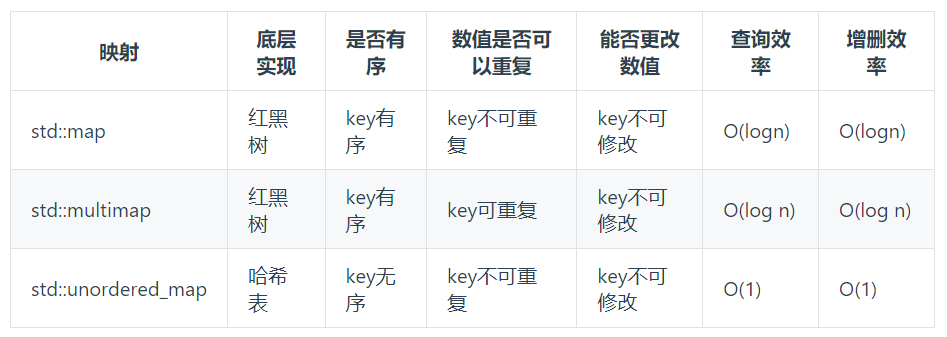

# cpp_data_structure 

* 代码随想录 https://programmercarl.com/

* 一个有非常简明例子的cpp网站：https://en.cppreference.com/w/
  <br> 例如，查看std::vector的assign的用法：https://en.cppreference.com/w/cpp/container/vector/assign
  <br> 三种方式通过一个例子完美解释了，还夹带lambda干货。

--------------------------------------------------------------------------------

```c++
// STL（标准模板库） 
#include <array>               // std::array                                    容器
#include <vector>              // std::vector                                   容器
#include <list>                // std::list                                     容器
#include <stack>               // std::stack                                    容器适配器
#include <queue>               // std::queue          std::priority_queue       容器适配器
#include <deque>               // std::deque                                    容器
#include <string>              // std::string                                   容器
#include <map>                 // std::map            std::multimap             容器   
#include <set>                 // std::set            std::multiset             容器
#include <unordered_map>       // std::unordered_map  std::unordered_multimap   容器
#include <unordered_set>       // std::unordered_set  std::unordered_multiset   容器

// 与STL 容器有关的头文件
// <algorithm>是标准模版库（STL）中最重要的头文件之一，提供了大量基于迭代器的非成员模板函数。
#include <algorithm>   // remove()、remove_if()、find_if()、sort、...
// https://blog.csdn.net/szplzx1314/article/details/120644640
```

--------------------------------------------------------------------------------

# STL container 容器

--------------------------------------------------------------------------------

## std::unordered_map  和  std::unordered_set 

## _7_STL_map_set.md

--------------------------------------------------------------------------------

#### 代码随想录

> 
> <font color="yellow">当我们想使用哈希法来解决问题的时候，我们一般会选择如下三种数据结构。</font>
> 
> * 数组(`vector`)
> * 集合(`set`)
> * 映射(`map`)
> 
> 这里数组就没啥可说的了，我们来看一下`set`。
> 
> 在C++中，`set` 和 `map` 分别提供以下三种数据结构，其底层实现以及优劣如下表所示：
> 
> <div align=center>
> 
> </div>
> 
>
> `std::unordered_set` 底层实现为哈希表，`std::set` 和`std::multiset` 的底层实现是红黑树，红黑树是一种平衡二叉搜索树，所以`key`值是有序的，但`key`不可以修改，改动`key`值会导致整棵树的错乱，所以**只能删除和增加**。
> 
> 
> <div align=center>
> 
> </div>
> 
>
> `std::unordered_map` 底层实现为哈希表，`std::map` 和`std::multimap` 的底层实现是红黑树。同理，`std::map` 和`std::multimap` 的`key`也是有序的（这个问题也经常作为面试题，考察对语言容器底层的理解）。
>
> <font color="yellow">
> 
> 当我们要使用集合`set`来解决哈希问题的时候，该如何选择？
> 
> * 优先使用`unordered_set`，因为它的查询和增删效率是最优的
> 
> * 如果需要集合是有序的，那么就用`set`
> 
> * 如果要求不仅有序还要有重复数据的话，那么就用`multiset`
> 
> </font>
> 
>
> 
> 那么再来看一下`map` ，在`map`中 是一个`(key，value)` 的数据结构，`map`中，对`key`是有限制，对`value`没有限制的，因为`key`的存储方式使用红黑树实现的。
>
> 其他语言例如：`java`里的`HashMap` ，`TreeMap` 都是一样的原理。可以灵活贯通。
> 
> <font color="green">虽然`std::set`、`std::multiset` 的底层实现是红黑树，不是哈希表（即`std::set`、`std::multiset` 使用红黑树来索引和存储），不过给我们的使用方式，还是哈希法的使用方式，即`key`和`value`。所以使用这些数据结构来解决映射问题的方法，我们依然称之为哈希法。 `map`也是一样的道理。</font>
>
> 
> 这里在说一下，一些`C++`的经典书籍上 例如`STL`源码剖析，说到了`hash_set`， `hash_map`，这个与`unordered_set`，`unordered_map`又有什么关系呢？
>
> 
> 实际上功能都是一样一样的， 但是`unordered_set`在`C++11`的时候被引入标准库了，而`hash_set`并没有，所以建议还是使用`unordered_set`比较好，这就好比一个是官方认证的，`hash_set`，`hash_map` 是`C++11`标准之前民间高手自发造的轮子。
>
> 
> <div align=center>
> 
> </div>
> 

> **总结**：
>
> <font color="green">注意：以下内容中，有`std::`前缀时，才指的是具体容器，否则都是抽象概念</font>
>
> `set` 和 `map` 的<font color="yellow">相同点</font>
> 
> * 都是 `key`和`value` 对应
> 
> * 都有三种容器 `std::xxx`、`std::multixxx`、`std::unordered_xxx` (`xxx` = `set`或`map`)
> 
> * <font color="yellow">都是优先使用`std::unordered_xxx` (`xxx` = `set`或`map`)</font>
>
> * <font color="yellow">如果需要`key`是有序的，则使用`std::multixxx` (`xxx` = `set`或`map`)</font>
>
> * <font color="yellow">如果要求不仅`key`有序还要有重复`value`的话，才需要使用`std::xxx`(`xxx` = `set`或`map`)</font>
>
> * 虽然`std::xxx`、`std::multixxx`的底层实现并不是哈希表，而是红黑树，但是从使用方式的角度来说，还是哈希法的使用方式，即`key`和`value`。所以使用这些数据结构来解决映射问题的方法，我们依然称之为哈希法
>
> * 都能通过迭代器进行遍历；
>
> 
> `set` 和 `map` 的<font color="yellow">不同点</font>
>
> * `set`是值`value`的集合；`map`是`(key，value)`键值对
> 
> * `set`因为只有值`value`，不能通过`get`方法取值；`map`可以通过`get`方法获取值
>
> * `set`的值是唯一的可以做数组去重，`map`由于没有格式限制，可以做数据存储
>
> * 由于`std::map`是`key_value`的形式，所以`std::map`里的所有元素都是`std::pair`类型。`std::pair`里面的`std::pair::first`被称为`key`(键），`std::pair::second`被称为`value`(值）。它可以通过关键字`key`查找映射关联信息`value`，同时根据`key`值进行排序。
> 
>
> 

> <font color="yellow">代码随想录的补充：</font>
> 
> 其中，除了上述的三种`std::xxx`、`std::multixxx`、`std::unordered_xxx` (`xxx` = `set`或`map`)
>
> 还有一种`std::unordered_multixxx` (`xxx` = `set`或`map`)
>
> 即 `std::unordered_multimap`、`std::unordered_multiset`
>
> 结合了`unordered`和`multimap`的两个前缀修饰词特点
>
> 

#### 最全的关联容器总结

> 
> `map`容器和`set`容器都属于**关联容器**。
> 
> 在关联容器中，对象的位置取决于和它关联的键值(`key`)。
> 
> **key（键值）可以是基本类型也可以是类类型**。
> 
> <font color="yellow">关联容器是与非关联容器（顺序容器）相对应的，顺序容器中元素的位置不依赖于元素的值，而是和该元素加入容器时的位置有关。</font>
> 
> 关联容器的类型有下面八种：
> 
> ```html
> 按关键字有序保存元素
> map                      关联数组；保存关键字-值对
> set                      关键字即值，只保存关键字的容器
> multimap                 关键字可以重复出现的map
> multiset                 关键字可以重复出现的set
>  
> 无序关联容器
> unordered_map            用哈希函数组织的map，无序
> unordered_set            用哈希函数组织的set，无序
> unordered_multimap       哈希组织的map；关键字可以重复
> unordered_multiset       哈希组织的set，关键字可以重复
> ```
>
> <font color="yellow">记忆方法
> 
> * 单独的`map`、`set`是`key`有序，内容不可重复的
>
> * 前缀`multi`，意思是可以重复的
>
> * 前缀`unordered`, 意思是无序的
>  
> </font>
>
> * `multi`前缀表明键值不必唯一，但是如果没有这个前缀，键值必须唯一。
> 
> * `unordered`前缀表明容器中元素的位置是通过其键值(`key`)所产生的哈希值(`hashCode(key)`或`hashCode(key) % tableSize`)来决定的，而不是通过比较键值(`key`)决定的，即容器中的元素是无序的。如果没有这个前缀，则容器中元素是由比较键值(`key`)决定的，即有序。
>
> 
> <font color="yellow">一般来说，我们只需要用到`unordered_map`和`unordered_set`</font>
>
> <font color="yellow">如果需要有序，那不如用`std::vector`了，或者`std::queue<pair<type1, type2>>`</font>
>
> 

> 头文件
> 
> ```c++
> #include <map>                 // std::map            std::multimap             容器   
> #include <set>                 // std::set            std::multiset             容器
> #include <unordered_map>       // std::unordered_map  std::unordered_multimap   容器
> #include <unordered_set>       // std::unordered_set  std::unordered_multiset   容器
> ```


####  map  

> 
> `CppReference`参考资料
> https://en.cppreference.com/w/cpp/container/map
> https://en.cppreference.com/w/cpp/container/multimap
> https://en.cppreference.com/w/cpp/container/unordered_map
> https://en.cppreference.com/w/cpp/container/unordered_multimap
> 

> 
> `CSDN`参考博客
> https://blog.csdn.net/qq_28584889/article/details/83855734 
> https://blog.csdn.net/qq_28584889/article/details/83833296
> 

##### map容器概述

> 
> `map`容器是**关联容器**的一种。
> 
> 在关联容器中，对象的位置取决于和它关联的键值(`key`)。
> 
> **key（键）可以是基本类型也可以是类类型**。
> 
> <font color="yellow">关联容器是与非关联容器（顺序容器）相对应的，顺序容器中元素的位置不依赖于元素的值，而是和该元素加入容器时的位置有关。</font>
> 
> `map`容器有四种，每一种都是由类模板定义的。所有类型的`map`容器保存的都是键值对象对`pair<const type_K key, type_T obj>`的元素。`map`容器的元素是`pair<const K, T>`类型的对象，这种对象封装了一个`T`类型的对象和一个与其关联的`K`类型的键。<font color="yellow">`pair`元素中的键是`const`，因为修改键会扰乱容器中元素的顺序</font>。
> 
> 每种`map`容器的模板都有不同的特性：
>
> 1. `map`容器：`map`的底层是由红黑树实现的，红黑树的每一个节点都代表着`map`的一个元素。该数据结构具有自动排序的功能，因此`map`内部的元素都是有序的，元素在容器中的顺序是通过比较键值确定的。默认使用` less<K> `对象比较。
>
> 2. `multimap`容器：与`map`容器类似，区别只在于`multimap`容器可以保存键值相同的元素，即`key`可以相同，但是不知道是**拉链法**还是**线性探测法**
> 
> 3. `unordered_map`容器：该容器的底层是由哈希(又名散列)函数组织实现的。<font color="yellow">元素的顺序并不是由键值(`key`)决定的，而是由键值(`key`)的哈希值(`hashCode(key)`)确定的，哈希值是由哈希函数生成的一个整数</font>。利用哈希函数，将关键字的哈希值都放在一个桶（`bucket`）里面，具有相同哈希值的放到同一个桶。`unordered_map`内部元素的存储是无序的，也不允许有重复键值的元素，相当于`java`中的`HashMap`。
>
> 4. `unordered_multimap`容器：也可以通过键值生成的哈希值(`hashCode(key)`)来确定对象的位置，但是它允许有重复的元素`obj`。
>
> 
> <font color="yellow">注意：</font>
> 
> 1. <font color="yellow">"有序"也是有不同的排序方法的，一般`map`和`multimap`都有四个参数</font>
>
> ```c++
> template<
>     class Key,
>     class T,
>     class Compare = std::less<Key>,
>     class Allocator = std::allocator<std::pair<const Key, T>>
> > class map;
> 
> template<
>     class Key,
>     class T,
>     class Compare = std::less<Key>,
>     class Allocator = std::allocator<std::pair<const Key, T>>
> > class multimap;
> ```
> <font color="green">"`有序`"的排序方式默认为`std::less<Key>`，即根据`key`来排序，显得"`有序`"</font>
> 
> 2. <font color="yellow">由于"无序"不是真正的无序，而是按照`hashCode(key)`进行排序，那么参数就有所不同</font>
> 
> ```c++
> template<
>     class Key,
>     class T,
>     class Hash = std::hash<Key>,
>     class KeyEqual = std::equal_to<Key>,
>     class Allocator = std::allocator< std::pair<const Key, T> >
> > class unordered_map;
> 
> template<
>     class Key,
>     class T,
>     class Hash = std::hash<Key>,
>     class KeyEqual = std::equal_to<Key>,
>     class Allocator = std::allocator< std::pair<const Key, T> >
> > class unordered_multimap;
> ```
> <font color="green">"`无序`"的排序方式默认为`std::hash<Key>`，即根据`hashCode(key)`或`hashCode(key) % tableSize`排序，显得"`无序`"</font>
> 
> 
> <div align=center>
> 
> </div>
> 
> 

#####  std::unordered_map 概述

> 从一个例子开始
>
> ```c++
> #include <iostream>
> #include <unordered_map>
> using namespace std;
> int main(void) {
>    unordered_map<char, int> um1 = {
>             {'a', 1},
>             {'b', 2},
>             {'c', 3},
>             {'d', 4},
>             {'e', 5}
>             };
>    unordered_map<char, int>um2(um1);
>    cout << "Unordered_map contains following elements" << endl;
>    for (auto it = um2.begin(); it != um2.end(); ++it)
>       cout << it->first << " = " << it->second << endl;
>    return 0;
> }
> ```
> 编译并运行，结果如下
> ```c++
> Unordered_map contains following elements
> e = 5
> a = 1
> b = 2
> c = 3
> d = 4
> ```
> 

> 
> `unordered_map`与`map`的区别在于：因为底层是由哈希表实现，所以查找速度非常快，查找时间以`O(1)`计。但是缺点是哈希表的建立比较耗费时间。所以当查找比较频繁的时候可以考虑`unordered_map`。
>
> `[unordered_map模板]`
> 
> ```c++
> template<
>     class Key,                                                   // unordered_map::key_type
>     class T,                                                     // unordered_map::mapped_type
>     class Hash = std::hash<Key>,                                 // unordered_map::hasher
>     class KeyEqual = std::equal_to<Key>,                         // unordered_map::key_equal
>     class Allocator = std::allocator< std::pair<const Key, T> >  // unordered_map::allocator_type
> > class unordered_map;
> ```
> 
> `[包含的头文件]`
> 
> ```c++
> #include<unordered_map>
> ```
>
> `[迭代器]`
>
> `unordered_map`的迭代器是一个指针，指向容器中的元素，通过迭代器可以访问元素。
>
> ```c++
> unordered_map<Key,T>::iterator it;
> (*it).first;             // the key value (of type Key)
> (*it).second;            // the mapped value (of type T)
> (*it);                   // the "element value" (of type pair<const Key,T>) 
> ```
> 
> `unordered_map`中元素的键值分别是迭代器的`first`和`second`的属性。上面是用迭代器的解引用的方式访问，也可以用指针访问运算符直接访问元素的键值。
>
> ```c++
> it->first;               // same as (*it).first   (the key value)
> it->second;              // same as (*it).second  (the mapped value) 
> ```
>
> `[成员函数]`
> 
> ```c++
> ===============================迭代器================================
> 
> begin         返回指向容器起始位置的迭代器（iterator）
> end           返回指向容器末尾的迭代器
> cbegin        返回指向容器起始位置的常迭代器（const_iterator）
> cend          返回指向容器末尾位置的常迭代器
> 
> ===============================Capacity==============================
>
> size          返回有效元素的个数
> max_size      返回unordered_map支持的最大元素个数
> empty         判断是否为空
>
> ===============================访问元素===============================
>
> operator[]    访问元素（不进行下标越界检查）
> at            访问元素（进行下标越界检查，增加了性能开销）
>
> ===============================修改元素===============================
>
> insert        插入元素
> erase         删除元素
> swap          交换内容
> clear         清空内容
> emplace       构造及插入一个元素
> emplace_hint  按照提示构造及插入一个元素
>
> ================================操作==================================
>
> find          通过给定主键查找元素,没找到：返回unordered_map::end
> count 　　　　 返回匹配给定主键的元素的个数 
> equal_range   返回值匹配给定搜索值的元素组成的范围 
>
> ==============================Buckets=================================
>
> bucket_count 　　　  返回槽（Bucket）数 
> max_bucket_count    返回最大槽数 
> bucket_size 　　　   返回槽大小 
> bucket 　　　　　　  返回元素所在槽的序号 
> load_factor　　　　  返回载入因子，即一个元素槽（Bucket）的最大元素数 
> max_load_factor 　  返回或设置最大载入因子 
> rehash　　　　　　   设置槽数 
> reserve 　　　　　   请求改变容器容量
>
> ======================================================================
>
> ```
> 

#####  std::map 讲解 + 例子

`map`的创建以及初始化列表
>
> `map`类模板有`5`个类型参数，但是一般只需要指定前`2`个模板参数的值。第一个是键值(`type_K key`)的类型，第二个是所保存对象的类型(`type_T obj`)。我们通常所用的一种构造一个map对象的方法是：
> 
> ```c++
> map<string, int> mapStudent;
> ```
>
> 当初始化一个`map`时，必须提供`关键字类型`和`值类型`。我们将每个`关键字-值对`包围在花括号中：` {key，value}` 来指出它们一起构成了`map`中的一个元素。**初始化列表**有两种方式：
>
> ```c++
> map<string, string> authors = { {"Joyce", "James"},
>                                 {"Austen", "Jane"},
>                                 {"Dickens", "Charles"} };
> ```
> 或者：
> ```c++
> map<string, string> authors { {"Joyce", "James"}, {"Austen", "Jane"}, {"Dickens", "Charles"} };
> ```
>
> <font color="gree">但是需要注意的是：初始化列表的方式是C++11的新特性，对版本比较早的编译器不支持这一特性</font>。
>


`map`的一般常用属性（方法）
>
> ```c++
> size         返回有效元素个数
> max_size     返回容器支持的最大元素个数
> empty        判断容器是否为空，为空是返回true，否则返回false
> clear        清空map容器
> ```
> 


`map`插入数据
>
> 在构造`map`容器后，我们就可以往里面插入数据了。这里讲`3`种常见的数据插入方法。
> 
> **第一种：用insert函数插入pair数据**
>
> ```c++

> ```


