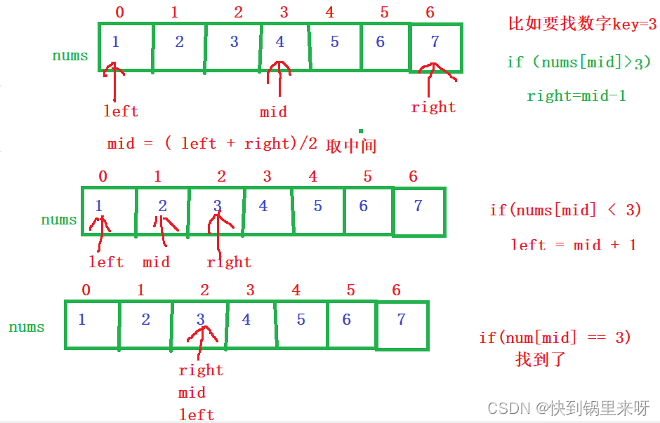
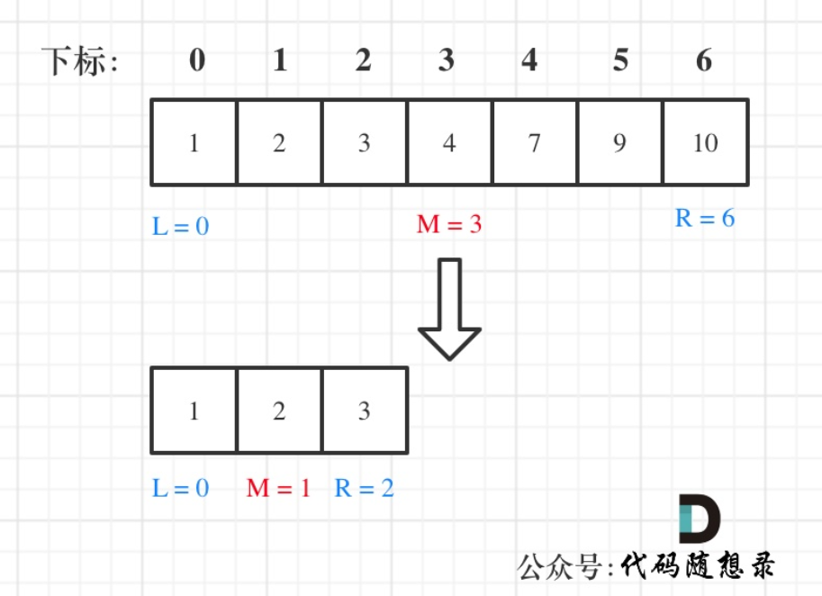
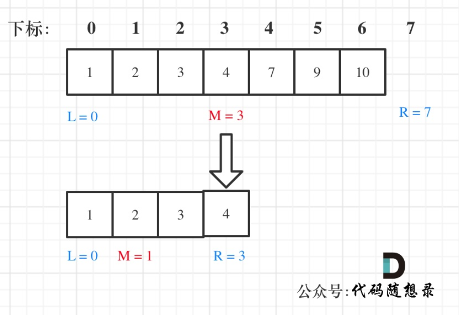

# cpp_data_structure 

* 代码随想录 https://programmercarl.com/

* 一个有非常简明例子的cpp网站：https://en.cppreference.com/w/

--------------------------------------------------------------------------------
> **大家不必太在意leetcode上执行用时，打败多少多少用户，这个就是一个玩具，非常不准确。**
> 
> 做题的时候自己能分析出来时间复杂度就可以了，至于leetcode上执行用时，大概看一下就行，只要达到最优的时间复杂度就可以了，
> 
> 一样的代码多提交几次可能就击败百分之百了....
--------------------------------------------------------------------------------

# 数组

--------------------------------------------------------------------------------

## 二分查找 binary search

## _1_binary_search.md

--------------------------------------------------------------------------------

### 704. 二分查找

> Leetcode链接: https://leetcode.cn/problems/binary-search/

> 
> 给定一个 `n` 个元素有序的（升序）整型数组 `nums` 和一个目标值 `target`  ，写一个函数搜索 `nums` 中的 `target`，如果目标值存在返回下标，否则返回 `-1`。
> 
> 示例 1:
> ```html
> 输入: nums = [-1,0,3,5,9,12], target = 9     
> 输出: 4       
> 解释: 9 出现在 nums 中并且下标为 4    
> ```
> 示例 2:
> ```html
> 输入: nums = [-1,0,3,5,9,12], target = 2      
> 输出: -1              
> 解释: 2 不存在 nums 中因此返回 -1     
> ```
> 提示：
> * 你可以假设 `nums` 中的所有元素是不重复的。
> * `n` 将在 [1, 10000]之间。
> * `nums` 的每个元素都将在 `[-9999, 9999]`之间。
> 
> ```c++
> class Solution {
> public:
>     int search(vector<int>& nums, int target) {
> 
>     }
> };
> ```

#### 我第一时间能想到的解法，一个个遍历， find函数本质上也是遍历
> * 我的第1种解法：for循环 下标
> ```c++
> class Solution {
> public:
>     int search(vector<int>& nums, int target) {
>         int xiabiao = -1;
>         for (int i=0; i < nums.size(); i++) {
>             if (nums[i] == target) {
>                 xiabiao = i;
>             } 
>         }
>         return xiabiao;
>     }
> };
> ```
> 
> * 我的第2种解法：for循环 迭代器
> ```c++
> class Solution {
> public:
>     int search(vector<int>& nums, int target) {
>         int xiabiao = -1;
>         vector<int>::iterator it;
>         for (it = nums.begin(); it != nums.end(); it++) {
>             if (*it == target) {
>                 xiabiao = it - nums.begin();
>             } 
>         }
>         return xiabiao;
>     }
> };
> ```
> 
> * 我的第3种解法：#include <algorithm> find()函数 本质上也是遍历
> ```c++
> // #include <algorithm> // Leetcode中不用include 库文件，都会自动包含，我们直接调用就可以
> class Solution {
> public:
>     int search(vector<int>& nums, int target) {
>         int xiabiao;
>         vector<int>::iterator it = find(nums.begin(), nums.end(), target);
>         if(it == nums.end()) {
>             xiabiao = -1;
>         } else {
>             xiabiao = it - nums.begin();
>         }
>         return xiabiao;
>     }
> };
> ```
> 
> <font color="yellow"> 上面都是顺序查找，时间复杂度都是$O(n)$, 空间复杂度都是$O(1)$ </font><br>
> 
> 

#### 二分查找、或者叫 二分搜索。 比顺序查找（遍历）搞笑

> **时间复杂度：O(log n)**   
> **空间复杂度：O(1)** 

> 二分查找是干啥的？
> 
> 二分查找（Binary Search）也叫作折半查找。在有序数组中，寻找一个数字，然后返回其对应要求的值
> 
> 二分查找相比于暴力求解（顺序查找），算法效率是比较高的。
> 
> 二分查找有两个要求，
> * 数列有序，且无重复元素
> * 数列使用顺序存储结构（比如数组），不能是链式存储。
>
> 由于每次查找都会将查找范围缩小一半，因此二分查找的时间复杂度是 `O(log⁡n)`，其中 `n` 是数组的长度。

> <font color="yellow"> 二分查找的算法思想是:</font>
> 以升序数列为例，比较一个元素与数列中间位置的元素的大小
> 如果比中间位置的元素大，则在后半部分的数列中进行二分查找；
> 如果比中间位置的元素大，则在前半部分的数列中进行二分查找；
> 如果相同，则找到了元素的位置；
> 每次比较的数列长度都会是之前数列的一半，直到找到目标元素的位置，或最终没找到。
> 
> <div align=center>
> 
> 
> </div>
>

> <font color="yellow"> 二分查找的步骤与实现 </font>
> <font color="yellow"> 有两种写法，分别是左闭右闭区间、左闭右开区间。主要不同在于边界处理方式。</font>
> * <font color="yellow"> 第一种写法， target 在左闭右闭区间 $[left, right]$ </font>
> 1. 设置查找区间
> 
> ```c++
> int left = 0;                  
> int right = nums.size() - 1;
> ```
> 2. 若查找区间 $[left, right]$ 存在，即left <= right，执行3. 否则查找失败，返回-1，
> 3. 取中间位 $mid = (left + right) / 2$, 比较 $target$ 与 $nums[mid]$, 有三种情况：
> > * 若 $nums[mid] = target$，则下标 $mid$ 即为要寻找的下标；查找成功，返回mid的值；
> > * 若 $nums[mid] > target$，则 target 只可能在左半区间（下标 mid 的左侧）；令right = mid - 1；转（2）；
> > * 若 $nums[mid] < target$，则 target 只可能在右半区间（下标 mid 的右侧）；令left = mid + 1；转（2）；
>
> * <font color="yellow">  第一种写法的具体实现 </font>
> 
> ```c++
> class Solution {
> public:
>     int search(vector<int>& nums, int target) {
>         int left = 0;
>         int right = nums.size() - 1; // 定义target在左闭右闭的区间里，[left, right]
>         int mid;
> 
>         while(left <= right) {  // 当left==right，区间[left, right]依然有效，所以用 <=
>             mid = left + ((right - left) / 2); // 防止溢出, 若溢出，leetcode可能超时 
>                                // 虽然等同于 (left + right) / 2; 但是left+right很容易超过int范围
>             if (nums[mid] == target) {
>                 return mid;   // 数组中找到目标值，直接返回下标       
>             } else if (nums[mid] > target) {
>                 right = mid -1; // target 在左区间，所以[left, middle - 1]
>             } else {  // nums[mid] < target  
>                 left = mid + 1;  // target 在右区间，所以[middle + 1, right]
>             }
>         }
>         // 未找到目标值
>         return -1;
>     }
> };
> ```
> * <font color="yellow">  第一种写法的注意点 </font>
> * **<font color="red"> 循环while结束的条件是什么  </font>**
>   while (left <= right) 要使用 <= ，因为left == right是有意义的，所以使用 <=
> * **<font color="red"> 给left和right赋什么值   </font>**
>   if ($nums[mid] > target$) right 要赋值为 mid - 1，因为当前这个nums[mid]不是target，那么接下来要查找的右闭区间结束位置的下标就是 mid - 1
>   if ($nums[mid] < target$) left 要赋值为 mid + 1，因为当前这个nums[mid]不是target，那么接下来要查找的左闭区间结束位置的下标就是 mid + 1
> * **<font color="red"> 求中间值mid的时候要注意</font>**
> ```c++
>   mid = left + ((right - left) / 2); 
>   // 可以防止溢出, 若溢出，leetcode可能超时 
>   // 虽然等同于 (left + right) / 2; 但是left+right很容易超过int范围，即溢出
> ```
>
> 例：在数组：1,2,3,4,7,9,10中查找元素2，如图所示：
> <div align=center>
> 
> </div>
> <br>
> <br>
>
> 
> * <font color="yellow"> 第二种写法， target 在左闭右开区间 $[left, right)$ </font>
> 1. 设置查找区间
> ```c++
> int left = 0;                  
> int right = nums.size() ;
> ```
> 2. 若查找区间 $[left, right)$ 存在，即left < right，执行3. 否则查找失败，返回-1，
> 3. 取中间位 $mid = (left + right) / 2$, 比较 $target$ 与 $nums[mid]$, 有三种情况：
> > * 若 $nums[mid] = target$，则下标 $mid$ 即为要寻找的下标；查找成功，返回mid的值；
> > * 若 $nums[mid] > target$，则 target 只可能在左半区间（下标 mid 的左侧）；令right = mid；转（2）；
> > * 若 $nums[mid] < target$，则 target 只可能在右半区间（下标 mid 的右侧）；令left = mid + 1；转（2）；
>
> * <font color="yellow">  第二种写法的具体实现 </font>
> 
> ```c++
> class Solution {
> public:
>     int search(vector<int>& nums, int target) {
>         int left = 0;
>         int right = nums.size(); // 定义target在左闭右开的区间里，即：[left, right)
>         int mid;
> 
>         while(left < right) {  // 当left == right时，[left, right)是无效的空间，所以使用 
>             mid = left + ((right - left) / 2); // 防止溢出, 若溢出，leetcode可能超时 
>                                // 虽然等同于 (left + right) / 2; 但是left+right很容易超过int范围
>             if (nums[mid] == target) {
>                 return mid;   // 数组中找到目标值，直接返回下标       
>             } else if (nums[mid] > target) {
>                 right = mid; // target 在左区间，在[left, middle)中
>             } else {  // nums[mid] < target  
>                 left = mid + 1;  // target 在右区间，在[middle + 1, right)中
>             }
>         }
>         // 未找到目标值
>         return -1;
>     }
> };
> ```
> * <font color="yellow">  第二种写法的注意点 </font>
> * **<font color="red"> 循环while结束的条件是什么  </font>**
>   while (left < right) 要使用 < ，因为left == right是没有意义的，所以使用 <
> * **<font color="red"> 给left和right赋什么值   </font>**
>   if ($nums[mid] > target$) right 要赋值为 mid，因为当前nums[mid]不是target，那么接下来要查找的右开区间结束位置的下标就是 mid
>   if ($nums[mid] < target$) left 要赋值为 mid + 1，因为当前这个nums[mid]不是target，那么接下来要查找的左闭区间结束位置的下标就是 mid + 1
> * **<font color="red"> 求中间值mid的时候要注意   </font>**
> ```c++
>   mid = left + ((right - left) / 2); 
>   // 可以防止溢出, 若溢出，leetcode可能超时 
>   // 虽然等同于 (left + right) / 2; 但是left+right很容易超过int范围，即溢出
> ```
> 
> 例：在数组：1,2,3,4,7,9,10中查找元素2，如图所示：
> <div align=center>
> 
> </div>
> <br>
>


> **循环不变量规则**
> <font color="yellow"> 大家写二分法经常写乱，主要是因为对区间的定义没有想清楚，区间的定义就是不变量。要在二分查找的过程中，保持不变量，就是在while寻找中每一次边界的处理都要坚持根据区间的定义来操作，这就是循环不变量规则。
> 就是说，要么一直保持左闭右闭，要么一直保持左闭右开，要么一直保持左开右闭合，不能一会左开右闭，一会左闭右闭，一会又来左闭右开。</font>
> 


#### 相关题目推荐
https://blog.csdn.net/m0_58761900/article/details/124664975
2.2 第一个错误的版本
2.3 搜索插入位置
2.4 在排序数组中查找元素第一个和最后一个位置
2.5 x的平方根
2.6 有效的完全平方数

https://programmercarl.com/0704.%E4%BA%8C%E5%88%86%E6%9F%A5%E6%89%BE.html#%E6%80%9D%E8%B7%AF

35.搜索插入位置(opens new window)
34.在排序数组中查找元素的第一个和最后一个位置(opens new window)
69.x 的平方根
367.有效的完全平方数


