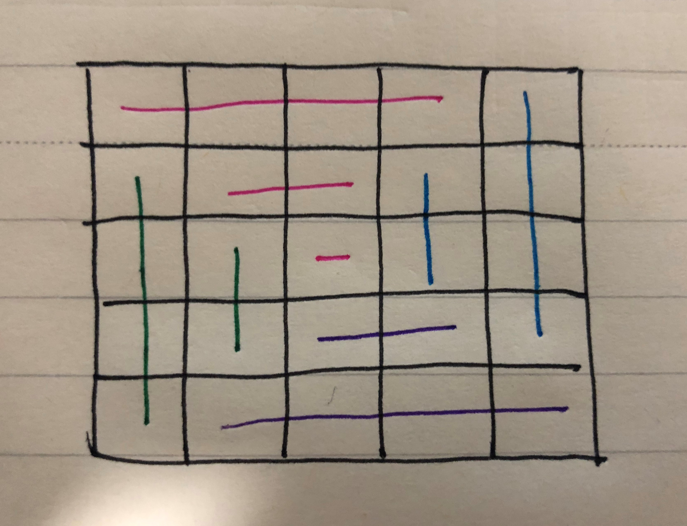
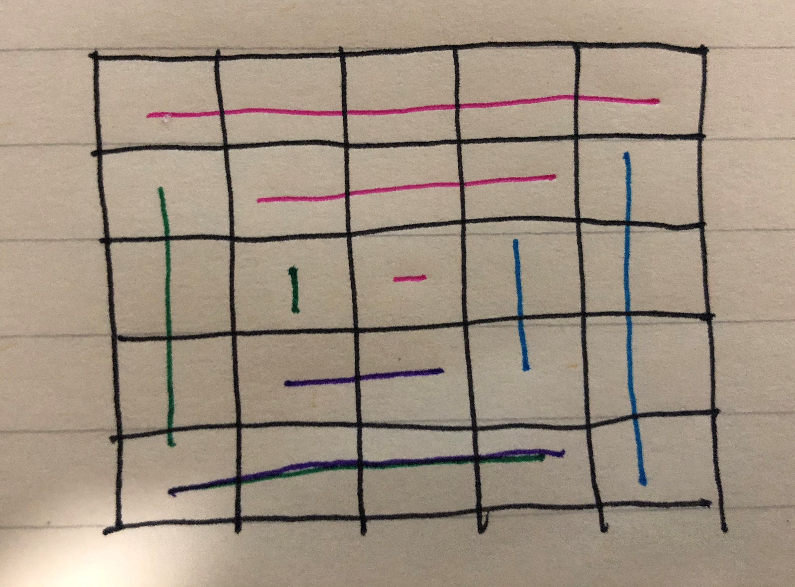

# cpp_data_structure 

* 代码随想录 https://programmercarl.com/

* 一个有非常简明例子的cpp网站：https://en.cppreference.com/w/

--------------------------------------------------------------------------------
> **大家不必太在意leetcode上执行用时，打败多少多少用户，这个就是一个玩具，非常不准确。**
> 
> 做题的时候自己能分析出来时间复杂度就可以了，至于leetcode上执行用时，大概看一下就行，只要达到最优的时间复杂度就可以了，
> 
> 一样的代码多提交几次可能就击败百分之百了....
--------------------------------------------------------------------------------

# 数组

--------------------------------------------------------------------------------

## 螺旋矩阵II spiral_matrix_ii

## _5_spiral_matrix_ii.md

--------------------------------------------------------------------------------

### 59.螺旋矩阵II

> Leetcode链接: https://leetcode.cn/problems/spiral-matrix-ii/

> 给你一个正整数 `n` ，生成一个包含 `1` 到 `n^2` 所有元素，且元素按顺时针顺序螺旋排列的 `n x n` 正方形矩阵 `matrix` 。
>
> 
> 示例 1：
> <div align=center>
> 
> </div>
> 
> ```html
> 输入：n = 3
> 输出：[[1,2,3],[8,9,4],[7,6,5]]
> ```
> 示例 2：
> ```html
> 输入：n = 1
> 输出：[[1]]
> ```
> 提示：
> * `1 <= n <= 20`
> 

### 本题的解法基本都是O(n^2)，即单纯的模拟矩阵的生成过程

> 本题并不涉及到什么算法，就是模拟过程，但却十分考察对代码的掌控能力。
> 
> 相信很多同学刚开始做这种题目的时候，上来就是一波判断猛如虎。
> 
> 结果运行的时候各种问题，然后开始各种修修补补，最后发现改了这里那里有问题，改了那里这里又跑不起来了。
> 
> 大家还记得我们在这篇文章数组：每次遇到二分法，都是一看就会，一写就废 (opens new window)中讲解了二分法，提到<font color="yellow">如果要写出正确的二分法,一定要坚持循环不变量原则。</font>
> 
> <font color="yellow">而求解本题依然是要坚持循环不变量原则。</font>
>
> **循环不变量规则**
> <font color="yellow"> 保持不变量，就是在while寻找中每一次边界的处理都要坚持根据区间的定义来操作。
> 
> 就是说，要么一直保持左闭右闭，要么一直保持左闭右开，要么一直保持左开右闭合，不能一会左开右闭，一会左闭右闭，一会又来左闭右开。</font>
>
> </font>
>
> **模拟顺时针画矩阵的过程:**
> 
> * 填充上行从左到右
> * 填充右列从上到下
> * 填充下行从右到左
> * 填充左列从下到上
>
> 由外向内一圈一圈这么画下去。
> 
> 这里的边界条件非常多，在一个循环中，如此多的边界条件，如果不按照固定规则来遍历，那就是一进循环深似海，从此offer是路人。
> 
> 一圈下来，我们要画每四条边，这四条边怎么画，**每画一条边都要坚持一致的左闭右开，或者左开右闭的原则，这样这一圈才能按照统一的规则画下来。**
> 
> <div align=center>
> 
> </div>
> 
>
> 这里每一种颜色，代表一条边，我们遍历的长度，可以看出**每一个拐角处的处理规则，拐角处让给新的一条边来继续画。***
> 
> 这也是**坚持了每条边左闭右开的原则**。
> 
> 一些同学做这道题目之所以一直写不好，代码越写越乱。
> 
> 就是因为在画每一条边的时候，一会左开右闭，一会左闭右闭，一会又来左闭右开，岂能不乱。
> 
> 代码如下，已经详细注释了每一步的目的，可以看出while循环里判断的情况是很多的，代码里处理的原则也是统一的左闭右开。
> 
> <div align=center>
> 
> </div>
> 
> ```c++
> class Solution {
> public:
>     vector<vector<int>> generateMatrix(int n) {
>         vector<vector<int>> v(n, vector<int>(n)); // 空
>         int num = 1;   // 要填入的数字, 填完一个，然后递增+1
>         int start = 0; // 每圈的开头位置
>         int end= n-1;  // 每圈的末尾位置，左闭右开
> 
>         while (start < end) {
>             for (int i = start; i < end;   i++) { // 左闭右开
>                v[start][i] = num;
>                num++;
>            }
>            for (int i = start; i < end;   i++) { // 左闭右开
>                v[i][end] = num;
>                num++;
>            }
>            for (int i = end;   i > start; i--) { // 左闭右开
>                v[end][i] = num;
>                num++;
>            }
>            for (int i = end;   i > start; i--) { // 左闭右开
>                v[i][start] = num;
>                num++;
>            }            
>            ++start; 
>            --end;
>        }
>        if (start == end) { // 走完发现起始点和终点重合，说明还有中间一个点没填
>           v[start][start] = num;
>        }
>        return v;
>    }
>};
> ```
>
>
> **上面这个是我自己的解法，和leetcode大佬的原理一样，只是没别人写的清楚，我们应该把一圈的四个部分区分得更明确些，用不同变量。**


> **优化后如下**
> ```c++
> class Solution {
> public:
>     vector<vector<int>> generateMatrix(int n) {
>         vector<vector<int>> v(n, vector<int>(n)); // 空
>         int num = 1;   // 要填入的数字, 填完一个，然后递增+1
> 
>         int left = 0, right = n-1; 
>         int top = 0, bottom = n-1;
>         //for循环中变量定义成i或j的细节：按照通常的思维，i代表行，j代表列
>         //这样，就可以很容易区分出来变化的量应该放在[][]的第一个还是第二个
>         //对于变量的边界怎么定义：
>             //从左向右填充：填充的列肯定在[left,right)区间，增
>             //从上向下填充：填充的行肯定在[top,bottom)区间，增
>             //从右向左填充：填充的列肯定在(left,right]区间，减
>             //从下向上填充：填充的行肯定在(top,bottom]区间，减
>         //通过上面的总结会发现边界的起始和结束与方向是对应的        
>         while (left < right) {
>             for (int j = left;   j < right;  j++) { // 左闭右开  
>                 v[top][j] = num;
>                 num++;
>             }
>             for (int i = top;    i < bottom; i++) { // 左闭右开  
>                 v[i][right] = num;
>                 num++;
>             }
>             for (int j = right;  j > left;   j--) { // 右闭左开，理解为左闭右开，也行
>                 v[bottom][j] = num;
>                 num++;
>             }
>             for (int i = bottom; i > top;    i--) { // 右闭左开，理解为左闭右开，也行
>                 v[i][left] = num;
>                 num++;
>             }     
>             ++left; 
>             --right;
>             ++top;
>             --bottom;
>         }
>         if (left == right) { // 走完发现起始点和终点重合，说明还有中间一个点没填
>            v[left][left] = num;
>         }
>         return v;
>     }
> };
> ```
>
> <div align=center>
> 
> </div>
>

> **或者，每填写完一层，就控制一下左、右、上、下**
> ```c++
> class Solution {
> public:
>     vector<vector<int>> generateMatrix(int n) {
>         int t = 0;      // top
>         int b = n-1;    // bottom
>         int l = 0;      // left
>         int r = n-1;    // right
>         vector<vector<int>> ans(n,vector<int>(n));
>         int k=1;
>         while(k<=n*n){
>             for(int i=l;i<=r;++i,++k) ans[t][i] = k;
>             ++t;
>             for(int i=t;i<=b;++i,++k) ans[i][r] = k;
>             --r;
>             for(int i=r;i>=l;--i,++k) ans[b][i] = k;
>             --b;
>             for(int i=b;i>=t;--i,++k) ans[i][l] = k;
>             ++l;
>         }
>         return ans;
>     }
> };
> ```
> <div align=center>
> 
> </div>
> 