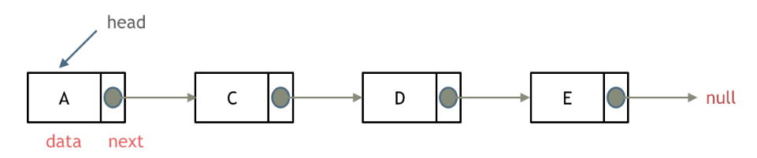
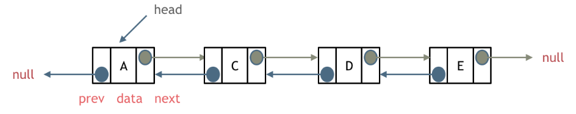
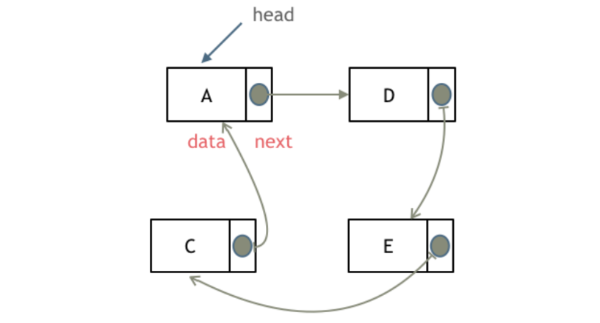
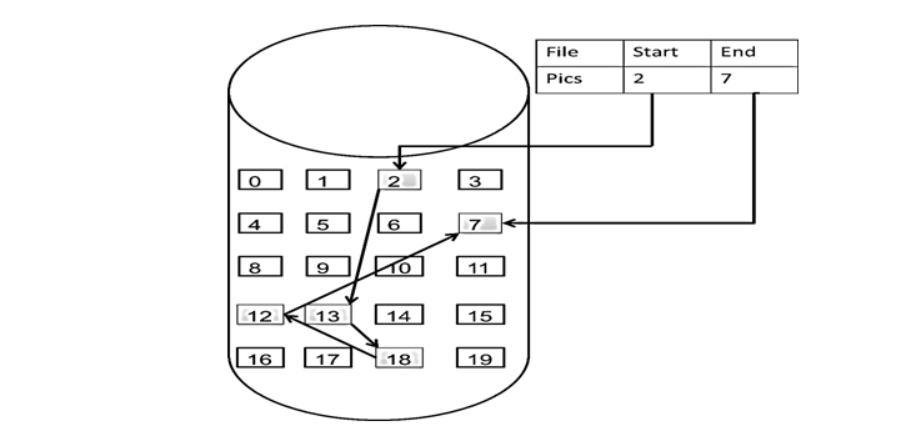
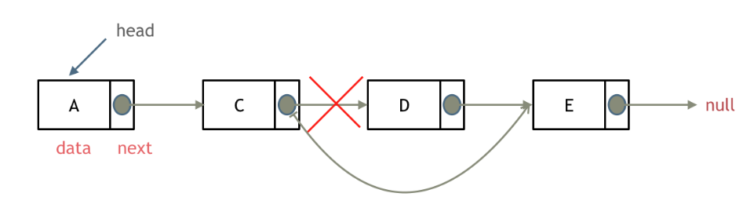
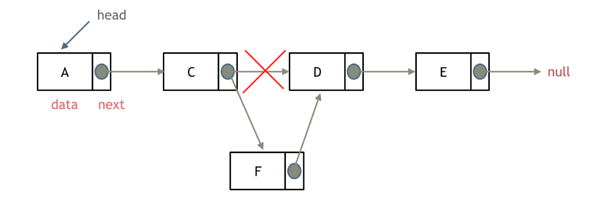
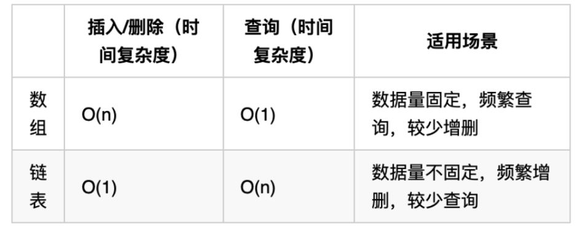

# cpp_data_structure 

* 代码随想录 https://programmercarl.com/

--------------------------------------------------------------------------------

# 链表

--------------------------------------------------------------------------------
## 链表理论基础

## Linked_List.md
--------------------------------------------------------------------------------

> 什么是链表？<br>
> 链表是一种通过指针串联在一起的线性结构。
> 每一个节点由两部分组成，数据域、指针域。
> 链表的入口节点称为链表的头结点（head）。<br>


### 链表的类型

#### 链表（单链表）
> 单链表，每一个节点由两部分组成，一个是数据域一个是指针域（存放指向下一个节点的指针）。
> 最后一个节点的指针域指向null（空指针的意思）。<br>
> 单链表只能向后查询<br>
> 如图所示：
> <br>  
> <div align=center>
> 
> </div>
> <br>

#### 双链表
> 单链表：每一个节点只有一个指针域，指向下一个节点。<br>
> 双链表：每一个节点有两个指针域，一个指向下一个节点，一个指向上一个节点。<br>
> 头结点（head）的prev指针，指向null，最后一个节点的next指针指向null。<br>
> 双链表 既可以向前查询也可以向后查询。<br>
> 如图所示：
> <br>  
> <div align=center>
> 
> </div>
> <br>

#### 循环链表
> 循环链表，顾名思义，就是链表首尾相连。<br>
> 最后一个节点的指针域指向header节点。<br>
> 循环链表可以用来解决约瑟夫环问题。<br>
> 如图所示：
> <br>  
> <div align=center>
> 
> </div>
> <br>


--------------------------------------------------------------------------------
### 链表的存储方式

> 数组是在内存中是连续分布的，但是链表在内存中可不是连续分布的。<br>
> 链表是通过指针域的指针链接在内存中各个节点。<br>
> 所以链表中的节点在内存中不是连续分布的 ，而是散乱分布在内存中的某地址上，分配机制取决于操作系统的内存管理。<br>
> 如图所示：
> <br>  
> <div align=center>
> 
> </div>
> <br>
> 这个链表起始节点为2， 终止节点为7， 各个节点分布在内存的不同地址空间上，通过指针串联在一起。
>


--------------------------------------------------------------------------------
### 链表的定义
> 链表节点的定义，很多同学在面试的时候都写不好。<br>
> 这是因为平时在刷leetcode的时候，链表的节点都默认定义好了，直接用就行了，所以同学们都没有注意到链表的节点是如何定义的。<br>
> 而在面试的时候，一旦要自己手写链表，就写的错漏百出。<br>
> 这里我给出C/C++的定义链表节点方式，如下所示：
> ```c++
> // 单链表
> struct ListNode {
>     int val;  // 节点上存储的元素
>     ListNode *next;  // 指向下一个节点的指针
>     ListNode(int x) : val(x), next(NULL) {}  // 节点的构造函数
> };
> // 注意struct默认是公有继承(public),class默认是私有继承(private)
> // 所以虽然构造函数默认把指针指向NULL，我们可以通过node_i->next = node_j;形成链表结构。
> ```
> 有同学说了，我不定义构造函数行不行，答案是可以的，C++默认生成一个构造函数。<br>
> 但是这个构造函数不会初始化任何成员变量，下面我来举两个例子：
> * 通过自己定义构造函数初始化节点：
> ```c++
> ListNode* head = new ListNode(5);
> ```
> * 使用默认构造函数初始化节点：
> ```c++
> ListNode* head = new ListNode();
> head->val = 5;
> ```
> 所以如果不定义构造函数使用默认构造函数的话，在初始化的时候就不能直接给变量赋值！
>
> 例：
> ```c++
> // 创建单链表 ListNode
> struct ListNode {
>     int val;  // 节点上存储的元素
>     ListNode *next;  // 指向下一个节点的指针
>     ListNode(int x) : val(x), next(NULL) {}  // 节点的构造函数
> };
> // 注意struct默认是公有继承(public),class默认是私有继承(private)
> // 所以虽然构造函数默认把指针指向NULL，我们可以通过node_i->next = node_j;形成链表结构。
>
> //创建链表节点
> ListNode* node_a = new ListNode(1); // 创建节点a
> ListNode* node_c = new ListNode(3); // 创建节点c
> ListNode* node_d = new ListNode(4); // 创建节点d
> ListNode* node_e = new ListNode(5); // 创建节点e
> // 形成节点之间的指针关系
> node_a->next = node_c;
> node_c->next = node_d;
> node_d->next = node_e;
> node_e->next = nullptr; 
> // 为解决NULL代指空指针存在的二义性问题，c++11 中引入了nullptr，可以保证在任何情况下都代表空指针
> // 参考：https://blog.csdn.net/qq_41861406/article/details/124651045
> 
> cout << node_a->val << " ";  // a的数据域
> cout << node_c->val << " ";  // c的数据域
> cout << node_d->val << " ";  // d的数据域
> cout << node_e->val << endl; // e的数据域
> cout << node_a->next->val << " "; // a指针指向c, 这里显示c的数据域
> cout << node_c->next->val << " "; // c指针指向d, 这里显示d的数据域
> cout << node_d->next->val << " "; // d指针指向e, 这里显示e的数据域
> cout << node_e->next << endl;     // e指针是空指针, cout会显示0
> // cout << node_e->next->val << endl;  // 报错Segmentation fault (core dumped)
> cout << endl; 
> ```
> 编译、运行
> ```c++
> 1 3 4 5
> 3 4 5 0
> ```

--------------------------------------------------------------------------------
### 链表的操作

#### 删除节点
> 删除D节点，如图所示：
> <br>  
> <div align=center>
> 
> </div>
> <br>
> 
> 两步：
> 1.将C节点的next指针 指向E节点
> 2.释放D节点的内存空间<br>
> 注：
> 在C++里需要手动释放这个D节点，释放这块内存
> 其他语言例如Java、Python，就有自己的内存回收机制，就不用自己手动释放了<br>
> 例：
> ```c++
> // 创建单链表 ListNode
> struct ListNode {
>     int val;  // 节点上存储的元素
>     ListNode *next;  // 指向下一个节点的指针
>     ListNode(int x) : val(x), next(NULL) {}  // 节点的构造函数
> };
>
> //创建链表节点
> ListNode* node_a = new ListNode(1); // 创建节点a
> ListNode* node_c = new ListNode(3); // 创建节点c
> ListNode* node_d = new ListNode(4); // 创建节点d
> ListNode* node_e = new ListNode(5); // 创建节点e
> // 形成节点之间的指针关系
> node_a->next = node_c;
> node_c->next = node_d;
> node_d->next = node_e;
> node_e->next = nullptr; 
> 
> cout << node_a->val << " ";  // a的数据域
> cout << node_c->val << " ";  // c的数据域
> cout << node_d->val << " ";  // d的数据域
> cout << node_e->val << endl; // e的数据域
> cout << node_a->next->val << " "; // a指针指向c, 这里显示c的数据域
> cout << node_c->next->val << " "; // c指针指向d, 这里显示d的数据域
> cout << node_d->next->val << " "; // d指针指向e, 这里显示e的数据域
> cout << node_e->next << endl;     // e指针是空指针
> // cout << node_e->next->val << endl;  // 报错Segmentation fault (core dumped)
> cout << endl; 
> 
> // 删除D节点,两步：
> // 1.将C节点的next指针 指向E节点
> node_c->next = node_e;
> // 2.释放D节点的内存空间<br>
> delete node_d;
> 
> cout << node_a->val << " ";   // a的数据域
> cout << node_c->val << " ";   // c的数据域
> cout << node_e->val << endl;  // e的数据域
> cout << node_a->next->val << " "; // a指针指向c, 这里显示c的数据域
> cout << node_c->next->val << " "; // c指针指向e, 这里显示e的数据域
> cout << node_e->next << endl;     // e指针是空指针
> cout << endl; 
> ```
> 编译、运行
> ```c++
> 1 3 4 5
> 3 4 5 0
>
> 1 3 5
> 3 5 0
> ```

#### 添加节点
> 添加F节点，如图所示：
> <br>  
> <div align=center>
> 
> </div>
> <br>
>
> 三步
> 1.新建F节点
> 2.将C节点的next指针 指向F节点
> 3.将F节点的next指针 指向D节点<br>
>
> 例：
> ```c++
> // 创建单链表 ListNode
> struct ListNode {
>     int val;  // 节点上存储的元素
>     ListNode *next;  // 指向下一个节点的指针
>     ListNode(int x) : val(x), next(NULL) {}  // 节点的构造函数
> };
>
> //创建链表节点
> ListNode* node_a = new ListNode(1); // 创建节点a
> ListNode* node_c = new ListNode(3); // 创建节点c
> ListNode* node_d = new ListNode(4); // 创建节点d
> ListNode* node_e = new ListNode(5); // 创建节点e
> // 形成节点之间的指针关系
> node_a->next = node_c;
> node_c->next = node_d;
> node_d->next = node_e;
> node_e->next = nullptr; 
> 
> cout << node_a->val << " ";  // a的数据域
> cout << node_c->val << " ";  // c的数据域
> cout << node_d->val << " ";  // d的数据域
> cout << node_e->val << endl; // e的数据域
> cout << node_a->next->val << " "; // a指针指向c, 这里显示c的数据域
> cout << node_c->next->val << " "; // c指针指向d, 这里显示d的数据域
> cout << node_d->next->val << " "; // d指针指向e, 这里显示e的数据域
> cout << node_e->next << endl;     // e指针是空指针
> // cout << node_e->next->val << endl;  // 报错Segmentation fault (core dumped)
> cout << endl; 
> 
> // 添加F节点, 三步
> // 1.新建F节点
> ListNode* node_f = new ListNode(6);
> // 2.将C节点的next指针 指向F节点
> node_c->next = node_f;
> // 3.将F节点的next指针 指向D节点<br>
> node_f->next = node_d;
> 
> cout << node_a->val << " ";   // a的数据域
> cout << node_c->val << " ";   // c的数据域
> cout << node_f->val << " ";   // d的数据域
> cout << node_d->val << " ";   // d的数据域
> cout << node_e->val << endl;  // e的数据域
> cout << node_a->next->val << " "; // a指针指向c, 这里显示c的数据域
> cout << node_c->next->val << " "; // c指针指向f, 这里显示f的数据域
> cout << node_f->next->val << " "; // f指针指向d, 这里显示d的数据域
> cout << node_d->next->val << " "; // d指针指向e, 这里显示e的数据域
> cout << node_e->next << endl;     // e指针是空指针
> cout << endl; 
> ```
> 编译、运行
> ```c++
> 1 3 4 5
> 3 4 5 0
>
> 1 3 6 4 5
> 3 6 4 5 0
> ```


#### 时间复杂度
> 两种情况：
> * 可以看出，对于指定节点，链表的增添和删除都是O(1)操作，也不会影响到其他节点。
> * 但是要注意，要是删除第五个节点（即不知道具体节点名，只知道是第几个）（本质上是查询），需要从头节点查找到第四个节点通过next指针进行删除操作，查找的时间复杂度是O(n)。


--------------------------------------------------------------------------------
### 性能对比分析

> 把链表的特性和数组的特性进行一个对比，如图所示：
> <br>  
> <div align=center>
> 
> </div>
> <br>
> 数组在定义的时候，长度就是固定的，如果想改动数组的长度，就需要重新定义一个新的数组。<br>
> 链表的长度可以是不固定的，并且可以动态增删， 适合数据量不固定，频繁增删，较少查询的场景。<br>
> 相信大家已经对链表足够的了解，后面我会讲解关于链表的高频面试题目，我们下期见！<br>
>


