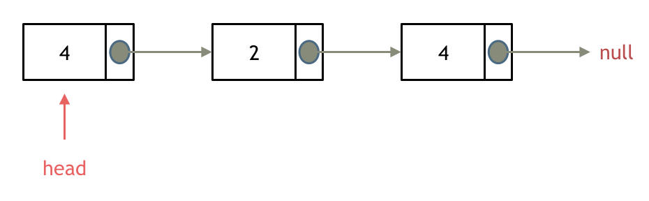

# cpp_data_structure 

* 代码随想录 https://programmercarl.com/

* 一个有非常简明例子的cpp网站：https://en.cppreference.com/w/

--------------------------------------------------------------------------------
> **大家不必太在意leetcode上执行用时，打败多少多少用户，这个就是一个玩具，非常不准确。**
> 
> 做题的时候自己能分析出来时间复杂度就可以了，至于leetcode上执行用时，大概看一下就行，只要达到最优的时间复杂度就可以了，
> 
> 一样的代码多提交几次可能就击败百分之百了....
--------------------------------------------------------------------------------

# 链表

--------------------------------------------------------------------------------

## 移除链表元素 remove elements

## _1_remove_elements.md
--------------------------------------------------------------------------------

### 203.移除链表元素

> Leetcode链接: https://leetcode.cn/problems/remove-linked-list-elements/

> 给你一个链表的头节点 `head` 和一个整数 `val` ，请你删除链表中所有满足 `Node.val == val` 的节点，并**返回 新的头节点 。**
>
> 示例 1：
> <div align=center>
> 
> </div>
> 
> ```html
> 输入：head = [1,2,6,3,4,5,6], val = 6
> 输出：[1,2,3,4,5]
> ```
> 示例 2：
> ```html
> 输入：head = [], val = 1
> 输出：[]
> ```
> 示例 3：
> ```html
> 输入：head = [7,7,7,7], val = 7
> 输出：[]
> ```
> 
> 提示：
> * 列表中的节点数目在范围 `[0, 10^4]` 内
> * `1 <= Node.val <= 50`
> * `0 <= val <= 50`


#### 我的解法: 双指针（左右指针）
> 头节点单独处理后：
> * left左指针，保存最新的非val节点
> * right右指针，负责遍历后续节点
> 
```c++
/**
 * Definition for singly-linked list.
 * struct ListNode {
 *     int val;
 *     ListNode *next;
 *     ListNode() : val(0), next(nullptr) {}
 *     ListNode(int x) : val(x), next(nullptr) {}
 *     ListNode(int x, ListNode *next) : val(x), next(next) {}
 * };
 */
class Solution {
public:
    ListNode* removeElements(ListNode* head, int val) {

        ListNode* tmp = nullptr; // tmp临时指针
        // 保证头节点的数据域不为val
        while ( head!=nullptr && head->val == val) {  // 若不加head != nullptr 会报错
           tmp = head;           // tmp临时指针暂存需要删除的头节点
           head = head->next;    // head指针更改为下一个节点
           delete tmp;           // 删除暂存的节点
        }

        if (head == nullptr) {
            return head;      // 头指针为空，直接返回  
        }   // 考虑了示例2和示例3，其中3在删除所有为val头节点后，也变成了空链表，直接返回

        ListNode* left = head;  // left左指针，保存最新的非val节点
        ListNode* right = head->next; // right右指针，负责遍历后续节点
        // 如果前面的预处理后，链表只有一个节点(肯定是非val)，则这里right = nullptr;
        // 不会进入下方的while，直接return；

        while ( right != nullptr ) { 
            if (right->val != val) {     // 若当前right右指针指向非val节点
                left->next = right;      // 则将上一个非val节点，链接到最新的非val节点
                left = left->next;            // left指针跳转到最新的非val节点

                right = right->next;     // right更新  // 走到最后一个节点时，更新后node = nullptr;
                left->next = nullptr;    // 将最新的非val节点的指针域置空，默认尾节点
            } 
            else { // 当前right右指针指向val节点
                tmp = right;          // 暂存需要删除的val节点
                right = right->next;  // right更新 // 走到最后一个节点时，更新后node = nullptr;
                left->next = nullptr; // 将最新的非val节点的指针域置空，默认尾节点
                delete tmp;           // 删除val节点
            }
            // 走到最后一个节点时，更新后node = nullptr; 不会再次进入循环
        }
        
        return head;
    }
};
```
#### 实机跑一下，代码如下
```c++
struct ListNode {
    int val;
    ListNode *next;
    ListNode() : val(0), next(nullptr) {}
    ListNode(int x) : val(x), next(nullptr) {}
    ListNode(int x, ListNode *next) : val(x), next(next) {}
};

int main()
{
    //创建链表1
    ListNode* list_1_node_1 = new ListNode(1); // 创建节点1
    ListNode* list_1_node_2 = new ListNode(2); // 创建节点2
    ListNode* list_1_node_3 = new ListNode(6); // 创建节点3
    ListNode* list_1_node_4 = new ListNode(3); // 创建节点4
    ListNode* list_1_node_5 = new ListNode(4); // 创建节点5
    ListNode* list_1_node_6 = new ListNode(5); // 创建节点6
    ListNode* list_1_node_7 = new ListNode(6); // 创建节点7
    // 形成节点之间的指针关系
    list_1_node_1->next = list_1_node_2;
    list_1_node_2->next = list_1_node_3;
    list_1_node_3->next = list_1_node_4;
    list_1_node_4->next = list_1_node_5;
    list_1_node_5->next = list_1_node_6;
    list_1_node_6->next = list_1_node_7;
    list_1_node_7->next = nullptr; 

    //创建链表2
    ListNode* list_2_node_1 = nullptr; // 创建节点1

    //创建链表3
    ListNode* list_3_node_1 = new ListNode(7); // 创建节点1
    ListNode* list_3_node_2 = new ListNode(7); // 创建节点2
    ListNode* list_3_node_3 = new ListNode(7); // 创建节点3
    ListNode* list_3_node_4 = new ListNode(7); // 创建节点4
    // 形成节点之间的指针关系
    list_3_node_1->next = list_3_node_2;
    list_3_node_2->next = list_3_node_3;
    list_3_node_3->next = list_3_node_4;
    list_3_node_4->next = nullptr;


    // ---------------------这里相当于函数的参数----------------------------
    int val = 6;
    ListNode* head = list_1_node_1;  // 链表1
    // ListNode* head = list_2_node_1;  // 链表2
    // ListNode* head = list_3_node_1;  // 链表3

    // --------------------------------------------------------------------

    // 显示链表
    ListNode* node = head;
    while ( node != nullptr ) {
        cout << node->val << " ";
        node = node->next; // 走到最后一个节点时，更新后node = nullptr;
    
    }
    cout << endl;


    // ---------------------以下相当于函数体----------------------------

    ListNode* tmp = nullptr; // tmp临时指针
        
    // 保证头节点的数据域不为val
    while ( head!=nullptr && head->val == val) {  // 若不加head != nullptr 会报错
        tmp = head;           // tmp临时指针暂存需要删除的头节点
        head = head->next;    // head指针更改为下一个节点, 走到最后一个节点时，head = nullptr;
        delete tmp;           // 删除暂存的节点
    }

    if (head == nullptr) {
        return 0;      // 头指针为空，直接返回. // 这里不能return head，因为不是在函数里，
    }  // 考虑了示例2和示例3，其中3在删除所有为val头节点后，也变成了空链表，直接返回
        

    ListNode* left = head;  // left左指针，保存最新的非val节点
    ListNode* right = head->next; // right右指针，负责遍历后续节点
    // 如果前面的预处理后，链表只有一个节点(肯定是非val)，则这里right = nullptr;
    // 不会进入下方的while，直接return；
        
    while ( right != nullptr ) { 
        if (right->val != val) {     // 若当前right右指针指向非val节点
            left->next = right;      // 则将上一个非val节点，链接到最新的非val节点
            left = left->next;            // left指针跳转到最新的非val节点

            right = right->next;     // right更新  // 走到最后一个节点时，更新后node = nullptr;
            left->next = nullptr;    // 将最新的非val节点的指针域置空，默认尾节点
        } 
        else { // 当前right右指针指向val节点
            tmp = right;          // 暂存需要删除的val节点
            right = right->next;  // right更新 // 走到最后一个节点时，更新后node = nullptr;
            left->next = nullptr; // 将最新的非val节点的指针域置空，默认尾节点
            delete tmp;           // 删除val节点
        }
            // 走到最后一个节点时，更新后node = nullptr; 不会再次进入循环
    }    
    // ----------------------------------------------------------------------


    // 显示链表
    node = head;
    while ( node != nullptr ) {
        cout << node->val << " ";
        node = node->next; // 走到最后一个节点时，更新后node = nullptr;
    
    }
    cout << endl;

    return 0;
}
```
> 运行结果
> ```c++
> 1 2 6 3 4 5 6 
> 1 2 3 4 5 
> ```

#### 我的解法: 双指针优化，加一个虚拟head node，这样不用单独处理head node
```c++
/**
 * Definition for singly-linked list.
 * struct ListNode {
 *     int val;
 *     ListNode *next;
 *     ListNode() : val(0), next(nullptr) {}
 *     ListNode(int x) : val(x), next(nullptr) {}
 *     ListNode(int x, ListNode *next) : val(x), next(next) {}
 * };
 */
class Solution {
public:
    ListNode* removeElements(ListNode* head, int val) {
        
        // 设置一个虚拟头结点(dummy node)
        ListNode* dummyHead = new ListNode();
        dummyHead->next = head;


        ListNode* tmp = nullptr; // tmp临时指针
        
        ListNode* left = dummyHead;        // left左指针，保存最新的非val节点
        ListNode* right = dummyHead->next; // right右指针，负责遍历后续节点

        while ( right != nullptr ) { 
            if (right->val != val) {     // 若当前right右指针指向非val节点
                left->next = right;      // 则将上一个非val节点，链接到最新的非val节点
                left = left->next;       // left指针跳转到最新的非val节点

                right = right->next;     // right更新  // 走到最后一个节点时，更新后node = nullptr;
                left->next = nullptr;    // 将最新的非val节点的指针域置空，默认尾节点
            } 
            else { // 当前right右指针指向val节点
                tmp = right;             // 暂存需要删除的val节点
                right = right->next;     // right更新 // 走到最后一个节点时，更新后node = nullptr;
                left->next = nullptr;    // 将最新的非val节点的指针域置空，默认尾节点
                delete tmp;              // 删除val节点
            }
            // 走到最后一个节点时，更新后node = nullptr; 不会再次进入循环
        }
        
        head = dummyHead->next;
        delete dummyHead;
        
        return head;
    }
};
```


#### 代码随想录  不用双指针，单指针就行

> **思路**
> 
> 这里以链表 1 4 2 4 来举例，移除元素4。
> 
> <div align=center>
> 
> </div>
> 
> 如果使用C，C++编程语言的话，不要忘了还要从内存中删除这两个移除的节点， 清理节点内存之后如图：
> 
> <div align=center>
> 
> </div>
>
> **当然如果使用java ，python的话就不用手动管理内存了。**
> 还要说明一下，就算使用C++来做leetcode，如果移除一个节点之后，没有手动在内存中删除这个节点，leetcode依然也是可以通过的，只不过，内存使用的空间大一些而已，但建议依然要养成手动清理内存的习惯。
> 
> 这种情况下的移除操作，就是让节点next指针直接指向下下一个节点就可以了，
> 
> 那么因为单链表的特殊性，只能指向下一个节点，刚刚删除的是链表的中第二个，和第四个节点，<font color="yellow">那么如果删除的是头结点又该怎么办呢？</font>
> 这里就涉及如下链表操作的两种方式：
> * **<font color="yellow">直接使用原来的链表来进行删除操作</font>**
> * **<font color="yellow">设置一个虚拟头结点在进行删除操作</font>**
> 
> 来看第一种操作：直接使用原来的链表来进行移除。
> 
> <div align=center>
> 
> </div>
> 
> 移除头结点和移除其他节点的操作是不一样的，因为链表的其他节点都是通过前一个节点来移除当前节点，而头结点没有前一个节点。
> 
> 所以头结点如何移除呢，其实只要将头结点向后移动一位就可以，这样就从链表中移除了一个头结点。
>
> <div align=center>
> 
> </div>
> 
> 依然别忘将原头结点从内存中删掉。
> 
> <div align=center>
> 
> </div>
>
> 这样移除了一个头结点，是不是发现，在单链表中移除头结点 和 移除其他节点的操作方式是不一样，其实在写代码的时候也会发现，需要单独写一段逻辑来处理移除头结点的情况。
> 
> 那么可不可以 以一种统一的逻辑来移除 链表的节点呢(不用单独处理头节点)。
>
> 其实可以**设置一个虚拟头结点**，这样原链表的所有节点就都可以按照统一的方式进行移除了。
>
> 来看看如何设置一个虚拟头。依然还是在这个链表中，移除元素1。
>
> <div align=center>
> 
> </div>
>
> 这里来给链表添加一个虚拟头结点为新的头结点，此时要移除这个旧头结点元素1。
>
> 这样是不是就可以使用和移除链表其他节点的方式统一了呢？
> 
> 来看一下，如何移除元素1 呢，还是熟悉的方式，然后从内存中删除元素1。
> 
> 最后呢在题目中，<font color="yellow">return 头结点的时候，别忘了 `return dummyNode->next;`， 这才是新的头结点</font>
> 

> * **<font color="yellow">直接使用原来的链表来进行删除操作</font>**
> ```c++
> // 不用双指针，但单指针就行
> class Solution {
> public:
>     ListNode* removeElements(ListNode* head, int val) {
>         // 删除头结点
>         while (head != NULL && head->val == val) { // 注意这里不是if
>             ListNode* tmp = head;
>             head = head->next;
>             delete tmp;
>         }
> 
>         // 删除非头结点
>         ListNode* cur = head;
>         while (cur != NULL && cur->next!= NULL) {  
>          // 这里多了cur != NULL &&，是因为考虑到示例2和示例3这两种情况，（预处理）头结点是NULL
>             if (cur->next->val == val) {
>                 ListNode* tmp = cur->next;
>                 cur->next = cur->next->next;
>                 delete tmp;
>             } else {
>                 cur = cur->next;
>             }
>         }
>         return head;
>     }
> };
> ```
> 或者 加一个判断，就不用while中多一个条件了
> ```c++
> class Solution {
> public:
>     ListNode* removeElements(ListNode* head, int val) {
>         // 删除头结点
>         while (head != NULL && head->val == val) { // 注意这里不是if
>             ListNode* tmp = head;
>             head = head->next;
>             delete tmp;
>         }
> 
>         if (head == NULL) {
>             return head;      // 头指针为空，直接返回  
>         }   // 考虑了示例2和示例3，其中3在删除所有为val头节点后，也变成了空链表，直接返回
> 
>         // 删除非头结点
>         ListNode* cur = head;
>         while (cur->next!= NULL) {  
>             if (cur->next->val == val) {
>                 ListNode* tmp = cur->next;
>                 cur->next = cur->next->next;
>                 delete tmp;
>             } else {
>                 cur = cur->next;
>             }
>         }
>         return head;
>     }
> };
> ```


> * **<font color="yellow">设置一个虚拟头结点在进行删除操作</font>**
> ```c++
> class Solution {
> public:
>     ListNode* removeElements(ListNode* head, int val) {
>         ListNode* dummyHead = new ListNode(0); // 设置一个虚拟头结点
>         dummyHead->next = head; // 将虚拟头结点指向head，这样方面后面做删除操作
> 
>         ListNode* cur = dummyHead;
>         while (cur->next != NULL) {
>             if(cur->next->val == val) {
>                 ListNode* tmp = cur->next;
>                 cur->next = cur->next->next;
>                 delete tmp;
>             } else {
>                 cur = cur->next;
>             }
>         }
>
>         head = dummyHead->next;
>         delete dummyHead;
>
>         return head;
>     }
> };
> ```
>


