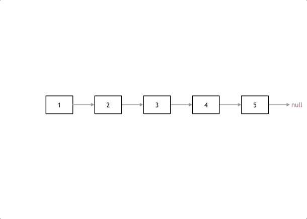

# cpp_data_structure 

* 代码随想录 https://programmercarl.com/

* 一个有非常简明例子的cpp网站：https://en.cppreference.com/w/

--------------------------------------------------------------------------------
> **大家不必太在意leetcode上执行用时，打败多少多少用户，这个就是一个玩具，非常不准确。**
> 
> 做题的时候自己能分析出来时间复杂度就可以了，至于leetcode上执行用时，大概看一下就行，只要达到最优的时间复杂度就可以了，
> 
> 一样的代码多提交几次可能就击败百分之百了....
--------------------------------------------------------------------------------

# 链表

--------------------------------------------------------------------------------

## 反转链表 reverse linked list

## _3_reverse_linked_list.md
--------------------------------------------------------------------------------

### 206.反转链表

> Leetcode链接: https://leetcode.cn/problems/reverse-linked-list/

> 给你单链表的头节点 `head` ，请你反转链表，并返回反转后的链表。
>
> **示例1：**
> 
> <div align=center>
> 
> </div>
> 
> ```html
> 输入：head = [1,2,3,4,5]
> 输出：[5,4,3,2,1]
> ```
> 
> **示例2：**
> 
> <div align=center>
> 
> </div>
> 
> ```html
> 输入：head = [1,2]
> 输出：[2,1]
> ```
>
> **示例3：**
> 
> ```html
> 输入：head = []
> 输出：[]
> ```
> 
> **提示：**
> * 链表中节点的数目范围是 `[0, 5000]`
> * `-5000 <= Node.val <= 5000`
> 
> ```c++
> /**
>  * Definition for singly-linked list.
>  * struct ListNode {
>  *     int val;
>  *     ListNode *next;
>  *     ListNode() : val(0), next(nullptr) {}
>  *     ListNode(int x) : val(x), next(nullptr) {}
>  *     ListNode(int x, ListNode *next) : val(x), next(next) {}
>  * };
>  */
> class Solution {
> public:
>     ListNode* reverseList(ListNode* head) {
> 
>     }
> };
> ```


#### 我的解法  头插法（与代码随想录的双指针逻辑相同，只不过我们这里加了个虚拟头节点，更好理解）
> <font color="yellow">逻辑1</font>
> 
> <div align=center>
> 
> </div>
> 
> ```c++
> class Solution {
> public:
>     ListNode* reverseList(ListNode* head) {
>         // 创建一个新的链表，设置虚节点_dummyHead
>         ListNode* _dummyHead = new ListNode();
> 
>         // 遍历链表
>         ListNode* cur = head;    // 游标
>         ListNode* tmp = nullptr; // 临时指针
>         while(cur != nullptr) {
>             // 临时指针
>             tmp = cur;
>             // 游标右移
>             cur = cur->next;
>             // 新链表递增
>             tmp->next = _dummyHead->next;
>             _dummyHead->next = tmp;
>         } 
>         // head指向翻转后的头节点
>         head = _dummyHead->next;
>         // 删除堆指针
>         delete _dummyHead;
> 
>         return head;
>     }
> };
> ```
> <font color="yellow">逻辑2</font>
> 
> <div align=center>
> 
> </div>
> 
> ```c++
> class Solution {
> public:
>     ListNode* reverseList(ListNode* head) {
>         // 创建一个新的链表，设置虚节点_dummyHead
>         ListNode* _dummyHead = new ListNode();
> 
>         // 遍历链表
>         ListNode* cur = head;    // 游标
>         ListNode* tmp = nullptr; // 临时指针
>         while(cur != nullptr) {
>             // 临时指针
>             tmp = cur->next;
>             // 头插法
>             cur->next = _dummyHead->next;
>             _dummyHead->next = cur;
>             // 游标右移
>             cur = tmp;
> 
>         } 
>         // head指向翻转后的头节点
>         head = _dummyHead->next;
>         // 删除堆指针
>         delete _dummyHead;
> 
>         return head;
>     }
> };
> ```
> 


#### 代码随想录  双指针法

> 如果再定义一个新的链表，实现链表元素的反转，其实这是对内存空间的浪费。
> 其实只需要改变链表的next指针的指向，直接将链表反转 ，而不用重新定义一个新的链表，如图所示:
> <div align=center>
> 
> </div>
> 
> 之前链表的头节点是元素1， 反转之后头结点就是元素5 ，这里并没有添加或者删除节点，仅仅是改变next指针的方向。
> 
> 那么接下来看一看是如何反转的呢？
> 
> 我们拿有示例中的链表来举例，如动画所示：（纠正：动画应该是先移动pre，在移动cur）
> <div align=center>
> 
> </div>
> 
> 
> 首先定义一个cur指针，指向头结点，再定义一个pre指针，初始化为null。
> 
> 然后就要开始反转了，首先要把 cur->next 节点用tmp指针保存一下，也就是保存一下这个节点。
> 
> 为什么要保存一下这个节点呢，因为接下来要改变 cur->next 的指向了，将cur->next 指向pre ，此时已经反转了第一个节点了。
> 
> 接下来，就是循环走如下代码逻辑了，继续移动pre和cur指针。
> 
> 最后，cur 指针已经指向了null，循环结束，链表也反转完毕了。 此时我们return pre指针就可以了，pre指针就指向了新的头结点。
> 
> ```c++
> class Solution {
> public:
>     ListNode* reverseList(ListNode* head) {
>         ListNode* temp; // 保存cur的下一个节点
>         ListNode* cur = head;
>         ListNode* pre = NULL;
>         while(cur) {
>             temp = cur->next;  // 保存一下 cur的下一个节点，因为接下来要改变cur->next
>             cur->next = pre;  // 翻转操作
>             // 更新pre 和 cur指针
>             pre = cur;
>             cur = temp;
>         }
>         return pre;
>     }
> };
> ```
> 


#### 代码随想录  递归法

> 递归法相对抽象一些，但是其实和双指针法是一样的逻辑，同样是当cur为空的时候循环结束，不断将cur指向pre的过程。
> 
> 关键是初始化的地方，可能有的同学会不理解， 可以看到双指针法中初始化 cur = head，pre = NULL，在递归法中可以从如下代码看出初始化的逻辑也是一样的，只不过写法变了。
> 
> 具体可以看代码（已经详细注释），双指针法写出来之后，理解如下递归写法就不难了，代码逻辑都是一样的。
> ```c++
> class Solution {
> public:
>     ListNode* reverse(ListNode* pre,ListNode* cur){
>         if(cur == NULL) return pre;
>         ListNode* temp = cur->next;
>         cur->next = pre;
>         // 可以和双指针法的代码进行对比，如下递归的写法，其实就是做了这两步
>         // pre = cur;
>         // cur = temp;
>         return reverse(cur,temp);
>     }
>     ListNode* reverseList(ListNode* head) {
>         // 和双指针法初始化是一样的逻辑
>         // ListNode* cur = head;
>         // ListNode* pre = NULL;
>         return reverse(NULL, head);
>     }
> 
> };
> ```
> 我们可以发现，上面的递归写法和双指针法实质上都是从前往后翻转指针指向，其实还有另外一种与双指针法不同思路的递归写法：从后往前翻转指针指向。
> 
> 具体代码如下（带详细注释）：
> ```c++
> class Solution {
> public:
>     ListNode* reverseList(ListNode* head) {
>         // 边缘条件判断
>         if(head == NULL) return NULL;
>         if (head->next == NULL) return head;
>         
>         // 递归调用，翻转第二个节点开始往后的链表
>         ListNode *last = reverseList(head->next);
>         // 翻转头节点与第二个节点的指向
>         head->next->next = head;
>         // 此时的 head 节点为尾节点，next 需要指向 NULL
>         head->next = NULL;
>         return last;
>     }
> }; 
> ```


#### 代码随想录  使用栈解决反转链表的问题（Java写的）

> * 首先将所有的结点入栈
> * 然后创建一个虚拟虚拟头结点，让cur指向虚拟头结点。然后开始循环出栈，每出来一个元素，就把它加入到以虚拟头结点为头结点的链表当中，最后返回即可。
> 
> <font color="yellow">Java语言如下</font>
> ```java
> public ListNode reverseList(ListNode head) {
>     // 如果链表为空，则返回空
>     if (head == null) return null;
>     // 如果链表中只有只有一个元素，则直接返回
>     if (head.next == null) return head;
>     // 创建栈 每一个结点都入栈
>     Stack<ListNode> stack = new Stack<>();
>     ListNode cur = head;
>     while (cur != null) {
>         stack.push(cur);
>         cur = cur.next;
>     }
>     // 创建一个虚拟头结点
>     ListNode pHead = new ListNode(0);
>     cur = pHead;
>     while (!stack.isEmpty()) {
>         ListNode node = stack.pop();
>         cur.next = node;
>         cur = cur.next;
>     }
>     // 最后一个元素的next要赋值为空
>     cur.next = null;
>     return pHead.next;
> }
> ```
> 采用这种方法需要注意一点。就是当整个出栈循环结束以后，cur正好指向原来链表的第一个结点，而此时结点1中的next指向的是结点2，因此最后还需要cur.next = null
> 
> <div align=center>
> 
> </div>
> 


