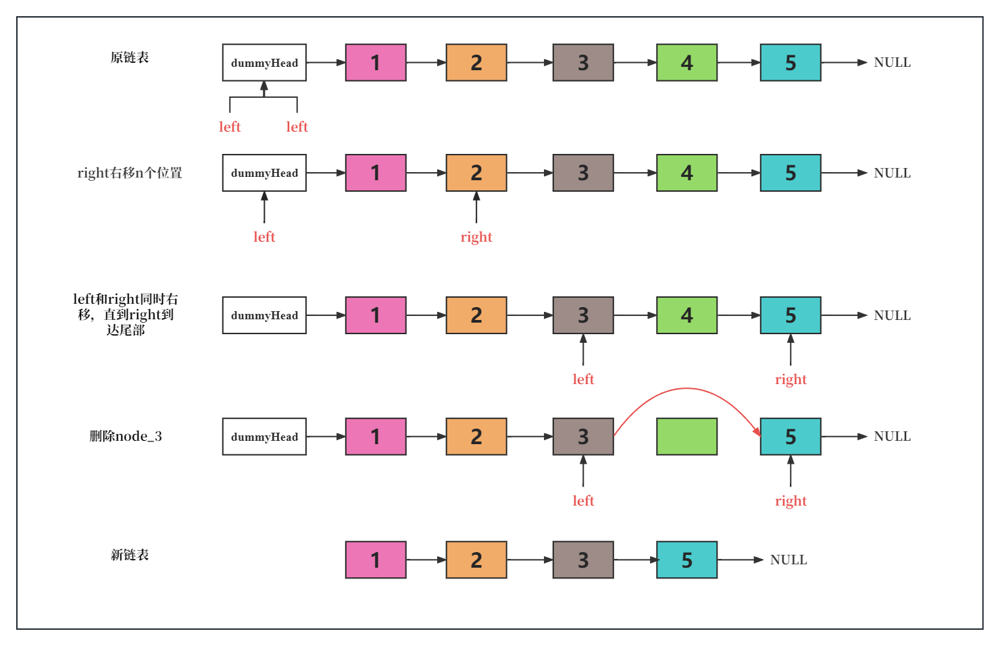
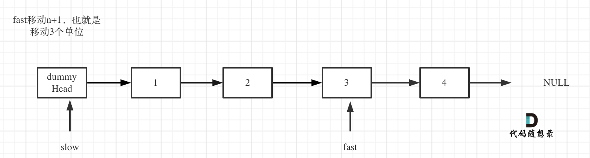

# cpp_data_structure 

* 代码随想录 https://programmercarl.com/

* 一个有非常简明例子的cpp网站：https://en.cppreference.com/w/

--------------------------------------------------------------------------------
> **大家不必太在意leetcode上执行用时，打败多少多少用户，这个就是一个玩具，非常不准确。**
> 
> 做题的时候自己能分析出来时间复杂度就可以了，至于leetcode上执行用时，大概看一下就行，只要达到最优的时间复杂度就可以了，
> 
> 一样的代码多提交几次可能就击败百分之百了....
--------------------------------------------------------------------------------

# 链表

--------------------------------------------------------------------------------

## 删除链表的倒数第N个节点 remove nth node from end of list

## _5_remove_nth_node_from_end.md
--------------------------------------------------------------------------------

### 19.删除链表的倒数第N个节点

> Leetcode链接: https://leetcode.cn/problems/remove-nth-node-from-end-of-list/

> 
> 给你一个链表，删除链表的倒数第 `n` 个结点，并且返回链表的头结点。
> **示例1：**
> 
> <div align=center>
> 
> </div>
> 
> ```html
> 输入：head = [1,2,3,4,5], n = 2
> 输出：[1,2,3,5]
> ```
> 
> **示例2：**
> 
> ```html
> 输入：head = [1], n = 1
> 输出：[]
> ```
>
> **示例3：**
> 
> ```html
> 输入：head = [1,2], n = 1
> 输出：[1]
> ```
> 
> **提示：**
> * 链表中结点的数目为 `sz`
> * `1 <= sz <= 30`
> * `0 <= Node.val <= 100`
> * `1 <= n <= sz`
> 

#### 我的解法一 遍历，然后正序删除

> 时间复杂度O(2n)。最坏情况下，需要遍历2遍

```c++
class Solution {
public:
    ListNode* removeNthFromEnd(ListNode* head, int n) {
        // 遍历得到链表长度size
        int size = 0;
        ListNode* cur = head;
        while (cur != nullptr) {
            ++size;
            cur = cur->next;
        } 
        
        // 建立虚拟头节点
        ListNode* dummyHead = new ListNode();
        dummyHead->next = head;
        cur = dummyHead;                   // 假设n=2，size=5
        for(int i=0; i < (size-n); i++) {  // 从第0个node，遍历到第size-n=3个node  (0<=n<=size,size=5)
           cur = cur->next;
        } // cur指向第size-n-1个节点

        // 删除第size-n个节点
        ListNode* temp = cur->next;
        cur->next = cur->next->next;
        delete temp;
        
        // 删除虚拟头节点
        head = dummyHead->next;
        delete dummyHead;
        return head;
    }
};
```

#### 我的解法二 双指针
> 时间复杂度O(n)。任何情况下，都需要遍历1遍

> <div align=center>
> 
> </div>
> 

```c++
class Solution {
public:
    ListNode* removeNthFromEnd(ListNode* head, int n) {
        // 建立虚拟头节点        
        ListNode* dummyHead = new ListNode();
        dummyHead->next = head;
        
        // 建立双指针，从虚拟头节点开始
        ListNode* left = dummyHead;
        ListNode* right = dummyHead;

        // 先让right指针右移n个位置，指向node_n-1.  // 假设有5个节点，从node_0，到node_4  
        for (int i=0; i<n; i++) {    
            right = right->next;
        } // n=2时，right指向第node_1

        // left和right同时右移，直到right到达尾部
        while (right->next != nullptr) {
            left = left->next;
            right = right->next;            
        } // right指向nodo_4，left指向node_2
         
        // 删除node_3,值为4
        ListNode* temp = left->next; // temp指向node_3
        left->next = left->next->next; 
        delete temp;

        // 删除虚拟头节点
        head = dummyHead->next;
        delete dummyHead;
        return head;
    }
};
```


#### 我的另一种思路 翻转链表，删除第n-1个节点，然后翻转回来？？？

> 感觉太麻烦了


#### 代码随想录 双指针法 思路真好

> 双指针的经典应用
> <font color="yellow">如果要删除倒数第n个节点，让fast移动n步，然后让fast和slow同时移动，直到fast指向链表末尾。删掉slow所指向的节点就可以了。</font>
> 
> 思路是这样的，但要注意一些细节。
>
> 分为如下几步：
> 
> 首先这里我推荐大家使用虚拟头结点，这样方便处理删除实际头结点的逻辑
>
> * 定义fast指针和slow指针，初始值为虚拟头结点，如图：
> <div align=center>
> 
> </div>
> 
> * fast首先走n + 1步 ，为什么是n+1呢，因为只有这样同时移动的时候slow才能指向删除节点的上一个节点（方便做删除操作），如图：
> <div align=center>
> 
> </div>
> 
> * fast和slow同时移动，直到fast指向末尾，如题：
> <div align=center>
> 
> </div>
> 
> * 删除slow指向的下一个节点，如图：
> <div align=center>
> 
> </div>
> 
> 此时不难写出如下C++代码：
> ```c++
> class Solution {
> public:
>     ListNode* removeNthFromEnd(ListNode* head, int n) {
>         ListNode* dummyHead = new ListNode(0);
>         dummyHead->next = head;
>         ListNode* slow = dummyHead;
>         ListNode* fast = dummyHead;
>         while(n-- && fast != NULL) {
>             fast = fast->next;
>         }
>         fast = fast->next; // fast再提前走一步，因为需要让slow指向删除节点的上一个节点
>         while (fast != NULL) {
>             fast = fast->next;
>             slow = slow->next;
>         }
>         slow->next = slow->next->next; 
>         
>         // ListNode *tmp = slow->next;  C++释放内存的逻辑
>         // slow->next = tmp->next;
>         // delete nth;
>         
>         return dummyHead->next;
>     }
> };
> ```
> 


