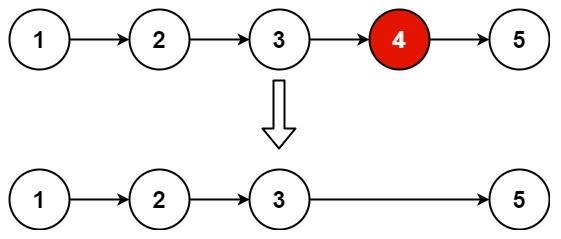

# cpp_data_structure 

* 代码随想录 https://programmercarl.com/

* 一个有非常简明例子的cpp网站：https://en.cppreference.com/w/

--------------------------------------------------------------------------------
> **大家不必太在意leetcode上执行用时，打败多少多少用户，这个就是一个玩具，非常不准确。**
> 
> 做题的时候自己能分析出来时间复杂度就可以了，至于leetcode上执行用时，大概看一下就行，只要达到最优的时间复杂度就可以了，
> 
> 一样的代码多提交几次可能就击败百分之百了....
--------------------------------------------------------------------------------

# 链表

--------------------------------------------------------------------------------

## 删除链表的倒数第N个节点 remove nth node from end of list

## _5_remove_nth_node_from_end.md
--------------------------------------------------------------------------------

### 19.删除链表的倒数第N个节点

> Leetcode链接: https://leetcode.cn/problems/remove-nth-node-from-end-of-list/

> 
> 给你一个链表，删除链表的倒数第 `n` 个结点，并且返回链表的头结点。
> **示例1：**
> 
> <div align=center>
> 
> </div>
> 
> ```html
> 输入：head = [1,2,3,4,5], n = 2
> 输出：[1,2,3,5]
> ```
> 
> **示例2：**
> 
> ```html
> 输入：head = [1], n = 1
> 输出：[]
> ```
>
> **示例3：**
> 
> ```html
> 输入：head = [1,2], n = 1
> 输出：[1]
> ```
> 
> **提示：**
> * 链表中结点的数目为 `sz`
> * `1 <= sz <= 30`
> * `0 <= Node.val <= 100`
> * `1 <= n <= sz`
> 


