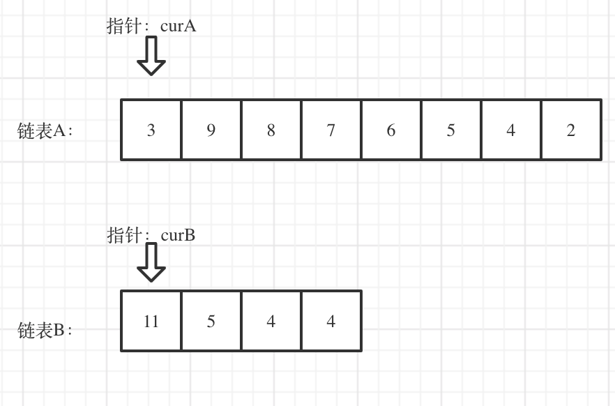

# cpp_data_structure 

* 代码随想录 https://programmercarl.com/

* 一个有非常简明例子的cpp网站：https://en.cppreference.com/w/

--------------------------------------------------------------------------------
> **大家不必太在意leetcode上执行用时，打败多少多少用户，这个就是一个玩具，非常不准确。**
> 
> 做题的时候自己能分析出来时间复杂度就可以了，至于leetcode上执行用时，大概看一下就行，只要达到最优的时间复杂度就可以了，
> 
> 一样的代码多提交几次可能就击败百分之百了....
--------------------------------------------------------------------------------

# 链表

--------------------------------------------------------------------------------

## 链表相交 intersection of two linked lists

## _6_intersection_of_two_linked_lists.md
--------------------------------------------------------------------------------

### 面试题 02.07. 链表相交

> Leetcode链接: https://leetcode.cn/problems/intersection-of-two-linked-lists-lcci/

> 给你两个单链表的头节点 `headA` 和 `headB` ，请你找出并返回两个单链表相交的起始节点。如果两个链表没有交点，返回 `null` 。
> 
> 图示两个链表在节点 `c1` 开始相交：
> <div align=center>
> 
> </div>
> 
> 题目数据 **保证** 整个链式结构中不存在环。
> 
> **注意**，函数返回结果后，链表必须 **保持其原始结构** 。
> 
> **示例1：**
> 
> <div align=center>
> 
> </div>
> 
> ```html
> 输入：
> intersectVal = 8, listA = [4,1,8,4,5], listB = [5,0,1,8,4,5], skipA = 2, skipB = 3
> 
> 输出：
> Intersected at '8'
> 
> 解释：
> 相交节点的值为 8 （注意，如果两个链表相交则不能为 0）。
> 从各自的表头开始算起，链表 A 为 [4,1,8,4,5]，链表 B 为 [5,0,1,8,4,5]。
> 在 A 中，相交节点前有 2 个节点；在 B 中，相交节点前有 3 个节点。
> ```
> 
> **示例2：**
> 
> <div align=center>
> 
> </div>
> 
> ```html
> 输入：
> intersectVal = 2, listA = [0,9,1,2,4], listB = [3,2,4], skipA = 3, skipB = 1
> 
> 输出：
> Intersected at '2'
> 
> 解释：
> 相交节点的值为 2 （注意，如果两个链表相交则不能为 0）。
> 从各自的表头开始算起，链表 A 为 [0,9,1,2,4]，链表 B 为 [3,2,4]。
> 在 A 中，相交节点前有 3 个节点；在 B 中，相交节点前有 1 个节点。
> ```
> 
> **示例3：**
> 
> <div align=center>
> 
> </div>
> 
> ```html
> 输入：
> intersectVal = 0, listA = [2,6,4], listB = [1,5], skipA = 3, skipB = 2
> 
> 输出：
> null
> 
> 解释：
> 从各自的表头开始算起，链表 A 为 [2,6,4]，链表 B 为 [1,5]。
> 由于这两个链表不相交，所以 intersectVal 必须为 0，而 skipA 和 skipB 可以是任意值。
> 这两个链表不相交，因此返回 null 。
> ```
> 
> **提示：**
> * `listA` 中节点数目为 `m`
> * `listB` 中节点数目为 `n`
> * `0 <= m, n <= 3 * 104`
> * `1 <= Node.val <= 105`
> * `0 <= skipA <= m`
> * `0 <= skipB <= n`
> * 如果 `listA` 和 `listB` 没有交点，`intersectVal` 为 `0`
> * 如果 `listA` 和 `listB` 有交点，`intersectVal == listA[skipA + 1] == listB[skipB + 1]`
> 
>
> **进阶**：你能否设计一个时间复杂度 `O(n)` 、仅用 `O(1)` 内存的解决方案？
> 


#### 我的解法一 嵌套循环遍历（超时） O(n^2)

```c++
class Solution {
public:
    ListNode *getIntersectionNode(ListNode *headA, ListNode *headB) {
        ListNode* result = nullptr;

        // 建立虚拟头节点
        ListNode* dummyHead_A = new ListNode(0);
        dummyHead_A->next = headA;
        ListNode* dummyHead_B = new ListNode(0);
        dummyHead_B->next = headB;  
            
        // 试一试O(n^2)嵌套循环遍历
        ListNode* cur_A = dummyHead_A;      
        while (cur_A != nullptr) {
            ListNode* cur_B = dummyHead_B;  // 每次都从头来
            while (cur_B != nullptr) {
                if (cur_B == cur_A) {
                    result = cur_B;
                }
            } 
        }

        return result;
    }
};
```

> 嵌套循环中只是判断了 

#### 我的解法二  双指针 O(2n+m)
> 设较长链表的长度为n，较短链表的长度为m
> `n+m` : 遍历两次，得到两个链表的长度
> `n-m` ：较长链表的指针移动，直到后续长度相同
> `m`：后续要移动的最坏情况是`m`，即没有相交
> 加起来是`2n+m`
> 
> <div align=center>
> 
> </div>
>
> 
```c++
class Solution {
public:
    ListNode *getIntersectionNode(ListNode *headA, ListNode *headB) {
        ListNode* result = nullptr;

        // 建立虚拟头节点
        ListNode* dummyHead_A = new ListNode(0);
        dummyHead_A->next = headA;
        ListNode* dummyHead_B = new ListNode(0);
        dummyHead_B->next = headB;  

        // 求出两个链表的长度
        size_t size_A = 0;
        size_t size_B = 0;
        ListNode* cur_A = dummyHead_A; 
        ListNode* cur_B = dummyHead_B;
        while (cur_A->next != nullptr) {
            ++size_A;
            cur_A = cur_A->next;
        }
        while (cur_B->next != nullptr) {
            ++size_B;
            cur_B = cur_B->next;
        }        

        // 较长的链表指针移动到距离末尾相同的位置，即保证后面的节点数相同
        cur_A = dummyHead_A; 
        cur_B = dummyHead_B;     
        size_t len = 0;  
        if (size_A > size_B) {
            len = size_A - size_B;
            while (len != 0) {
                cur_A = cur_A->next;
                --len;
            }
        }
        else {
            len = size_B - size_A;
            while (len != 0) {
                cur_B = cur_B->next;
                --len;
            }            
        }
        // 此时cur_A和cur_B与末尾有相同的距离

        // 双指针同时移动，进行比较
        while (cur_A != nullptr && cur_B != nullptr) {
            if (cur_A == cur_B) {
                result = cur_A;
                break;
            }  
            else {
                cur_A = cur_A->next;
                cur_B = cur_B->next;                
            }
        }

        return result;
    }
};
```

#### 代码随想录 

> 简单来说，就是求两个链表交点节点的指针。 这里同学们要注意，交点不是数值相等，而是指针相等。
> 
> 为了方便举例，假设节点元素数值相等，则节点指针相等。
> 
> 看如下两个链表，目前curA指向链表A的头结点，curB指向链表B的头结点：
> 
> <div align=center>
> 
> </div>
>
> 我们求出两个链表的长度，并求出两个链表长度的差值，然后让curA移动到，和curB 末尾对齐的位置，如图：
> 
> <div align=center>
> 
> </div>
>
> 此时我们就可以比较curA和curB是否相同，如果不相同，同时向后移动curA和curB，如果遇到curA == curB，则找到交点。
>
> 否则循环退出返回空指针。
>
> C++代码如下：
> > 时间复杂度：O(n + m)
> > 空间复杂度：O(1)
> 
```c++
class Solution {
public:
    ListNode *getIntersectionNode(ListNode *headA, ListNode *headB) {
        ListNode* curA = headA;
        ListNode* curB = headB;
        int lenA = 0, lenB = 0;
        while (curA != NULL) { // 求链表A的长度
            lenA++;
            curA = curA->next;
        }
        while (curB != NULL) { // 求链表B的长度
            lenB++;
            curB = curB->next;
        }
        curA = headA;
        curB = headB;
        // 让curA为最长链表的头，lenA为其长度
        if (lenB > lenA) {
            swap (lenA, lenB);
            swap (curA, curB);
        }
        // 求长度差
        int gap = lenA - lenB;
        // 让curA和curB在同一起点上（末尾位置对齐）
        while (gap--) {
            curA = curA->next;
        }
        // 遍历curA 和 curB，遇到相同则直接返回
        while (curA != NULL) {
            if (curA == curB) {
                return curA;
            }
            curA = curA->next;
            curB = curB->next;
        }
        return NULL;
    }
};
```


