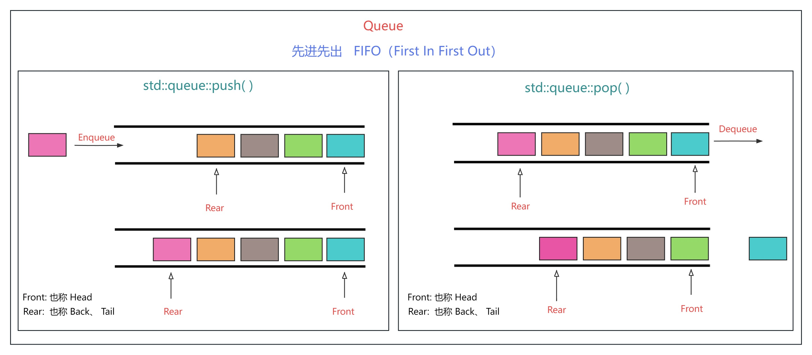

# cpp_data_structure 

* 代码随想录 https://programmercarl.com/

--------------------------------------------------------------------------------

# 栈与队列

--------------------------------------------------------------------------------

## 栈与队列理论基础

## Stack_and_Queue.md
--------------------------------------------------------------------------------


### 简介
> 栈和队列是STL（C++标准库）里面的两个数据结构。
> 如下图所示：
>  
> <div align=center>
> 
> 
> </div>
> 
> 

> <font color="yellow"> 栈（stack）：LIFO（后进先出） </font> <br>
> 图源：<https://blog.csdn.net/m0_73443478/article/details/128938695>
>  
> <div align=center>
> 
> 
> </div>
> 
>
> <font color="yellow"> 队列（queue）：FIFO（先进先出） </font> <br>
> 图源：<https://blog.csdn.net/m0_73443478/article/details/128938695>
>   
> <div align=center>
> 
> 
> </div>
> 
>


> <font color="yellow"> STL：</font> <br>
>
> <font color="yellow"> C++标准库是有多个版本的，知道使用的STL是哪个版本，才能知道对应的栈和队列的实现原理。三个最为普遍的STL版本：</font>
> * HP STL 其他版本的C++ STL，一般是以HP STL为蓝本实现出来的，HP STL是C++ STL的第一个实现版本，而且开放源代码。
> * P.J.Plauger STL 由P.J.Plauger参照HP STL实现出来的，被Visual C++编译器所采用，但是不开源。
> * SGI STL 由Silicon Graphics Computer Systems公司参照HP STL实现，被Linux的C++编译器GCC所采用，SGI STL是开源软件，源码可读性甚高。
> <font color="yellow"> 我们常用的也是Linux GCC。接下来介绍的栈和队列也是SGI STL里面的数据结构。</font> 
> 
> ```c++
> // container 容器
> #include <vector>            // std::vector 向量   
> #include <list>              // std::list   双向链表
> #include <deque>             // std::deque  双端队列
> // container adapter 容器适配器
> #include <queue>             // std::queue  队列, 有三种可选底层容器vector、list、deque
> #include <stack>             // std::stack  栈  , 有两种可选底层容器list、deque
> ```
> ```c++
> std::vector: 
> 一种模板类（向量），能够存放任意类型的动态数组。
> std::list：
> 一种模板类（链表），由双向链表来实现的，每个节点存储1个元素。支持前后两种移动方向。
> std::deque：
> 英文全称 double-ended queue，双端队列, 是一种具有队列和栈的性质的数据结构。双端队列中的元素可以从两端弹出，其限定插入和删除操作在表的两端进行。
> std::queue: 
> 一种模板类（队列），实现队列的功能——FIFO（先进先出）。缺省底层容器是std::deque。
> std::stack: 
> 一种模板类（栈），实现栈的功能——LIFO（后进先出）。缺省底层容器是std::deque。
> ```
>
> 栈、队列的初始化方式
> 
> ```c++
> stack<Type, Container> // (<数据类型，底层容器类型>） std::vector、std::list、std::deque
> queue<Type, Container> // (<数据类型，底层容器类型>） std::list、std::deque
> ``` 
> ```html
> 初始化时必须要有数据类型Type，底层容器Container可省略，缺省时默认为std::deque 
> ```
> <font color="yellow"> 如果我们在定义栈、队列时，不指定底层容器，则默认底层为std::deque </font>
> 
> <font color="yellow"> 当然也可以指定底层容器，虽然我们一般不这样做 </font>
> 
> ```c++
> #include<stack>
> std::stack<int, std::vector<int>> s1;    // 以vector为底层容器的栈stack
> std::stack<int, std::list<int>> s2;      // 以list为底层容器的栈stack
> std::stack<int> s3;                      // 默认以deque为底层容器的栈stack
> 
> #include<queue>
> // std::queue<int, std::vector<int>> q1; // 不能定义以vector为底层容器的队列queue
> std::queue<int, std::list<int>> q1;      // 以list为底层容器的队列queue
> std::queue<int> q2;                      // 默认以deque为底层容器的队列queue
> ```
> 
> 
> 下面是`std::stack`、`std::queue`、`std::deque`的对比.
> <div align=center>
> 
> 
> 
> </div>
> 
> <font color="yellow"> 可以看出来对 `std::deque` 做一些限制，就会变成`stack` 或 `queue` </font> 
> 


> <font color="yellow"> 为什么不能用`vector`容器初始化`queue`？ </font> 
> 
> 解释：
> 
> `queue`转换器要求容器支持`front()`、`back()`、`push_back()`及 `pop_front()`，
> 
> 说明`queue`的数据从容器后端入队列而从前端出队列。
> 
> 所以可以使用`deque`（双向链表）和`list`（双端队列）对`queue`初始化，
> 
> 而`vector`因其缺少`pop_front()`，不能用于`queue`。
>

> <font color="yellow"> 为什么 栈（stack）和 队列（queue）的缺省底层容器是 std::deque ? </font> 
> 
> <https://blog.csdn.net/qq_51845557/article/details/120807868>
> 
> <font color="green"> 栈（`stack`）的内部结构，底层实现可以是`std::vector`，`std::list`，`std::deque`三种。<br> 队列（`queue`）的内部结构，底层实现可以是`std::list`，`std::deque`两种。</font>  
> 
> 解释：
> 
> > 1. 由于`stack`与`queue`只需要进行两端的存取操作,所以只需要能实现一些基础方法如`push_back()`,`pop_back()`,`pop_front()`,`back()`,`front()`等就可以满足二者的实现.所以事实上无论是`list`,`vector`还是`deque`,都可以实现队列与栈的操作.那么为什么`STL`采用了`Deque`?
> > `deque::push_back()`,`deque::pop_back()`,`deque::pop_front()`,`deque::back()`,`deque::front()`
> 
> > 2. 首先是`vector`.由于其顺序表结构的局限性,`vector`在首端的插入操作时间复杂度就已经高到了`O(n)`的程度.此外,`stack`与`queue`只需要端结点的操作,使用`vector`实现必然会浪费`vector`本身随机存取的优势.最后,我个人认为在使用`vector`这种简单顺序结构实现`queue`时,是存在先天不足的.因为`queue`的特点决定了由于其弹出队头与插入队尾是同一个方向,在多次操作后必然会使数据整体位移导致越界.使用`vector`实现队列必然要考虑这个问题,解决的办法不论是循环队列还是频繁地释放与开辟空间都会导致代码的无谓复杂化.上面的原因导致`vector`根本不是合适的`stack/queue`基础容器.
> 
> > 3. 其次是`list`.作为双向循环列表的`list`满足`stack/queue`的端结点操作,并且其时间复杂度也能达到`O(1)`的程度,所以事实上也是不错的选择.但是在实践中其速度与内存占用依旧是没有`deque`优秀的,个人猜测是因为`list`的循环特性在`stack/queue`中没有得到利用,所以在实践中与`deque`相比产生了常数级别的实践复杂度劣势和空间复杂度劣势.
> 
> > 4. 阐明了上述两个容器在实现`stack/queue`时的不足,我们来介绍`deque`的特性.`deque`是一个双向队列,可以操作端结点,且这些操作具有`O(1)`级别的时间复杂度.但`deque`并非简单的链式或顺序结构,而是通过一个`map`索引表连接多个顺序表来存取数据的,它的具体实现今天不做具体讨论,改日补充.`deque`的缺陷在于虽然它支持随机访问和中间结点存取,但它的这些功能性能非常差.当然,这些并不会影响它作为`stack/queue`的基础容器的性能.
>


> <font color="yellow"> stack 与 queue 的 相同点：</font> <br>
> 
> > 1. `stack`与`queue`不能遍历,不能随机访问,不能查询中间结点,不能插入中间结点,只能做与其性质对应的两端结点的操作.都不提供迭代器`iterator`。
> > 因为栈或队列这种数据结构让你随便去遍历反而是不好的，如果随便遍历就保证不了`LIFO`或`FIFO`的功能了。
> 
> > 2. STL中栈（`stack`）和队列（`queue`），都不被归类为`container`（容器），而被归类为`container adapter`（容器适配器）。
> > 因为两者的底层是通过其他容器实现的。
> 
> > 3. 栈和队列以底层容器完成其所有的工作，对外提供统一的接口，底层容器是可插拔的。
> > 也就是说我们可以控制使用哪种容器来实现栈或队列的功能。
>
> <font color="yellow"> stack 与 queue 的 不同点：</font> <br>
> 
> 1. <font color="yellow"> 常用操作不同 </font>
> > <font color="green"> 栈（stack）的对外接口：</font>
> ```c++
> // 只能在栈顶(栈的尾部)进行插入和删除操作。
> #include<stack>
> stack<int> s;
> s.push();     //1. 入栈（压栈），栈顶(栈的尾部)插入元素。即 std::depue::push_back()
> s.pop();      //2. 出栈（弹栈），栈顶(栈的尾部)删除元素。即 std::depue::pop_back()
> s.size();     //3. 返回栈中元素个数，求栈的大小 ，
> s.empty();    //4. 判断栈是否为空，如果栈为空则返回 true, 否则返回 false;
> s.top();      //5. 返回栈顶(栈的尾部)元素的值
>               //   如果堆栈容器为空，则会导致未定义的行为
> ```
> 
> <div align=center>
> 
> </div>
> 
> 
> <font color="green"> 队列（queue）的对外接口: </font> <br>
> 
> ```c++
> #include<queue>
> queue<int> q;
> q.push()      //1. 入队列，队尾插入元素。即 std::depue::push_back()
> q.pop()       //2. 出队列，队头删除元素。即 std::depue::pop_front()
> q.size()      //3. 返回队列中元素个数，求队列的大小 ，
> q.empty()     //4. 判断队列是否为空，如果队列为空则返回 true, 否则返回 false;
> q.front()     //5. 返回队头元素的引用
> q.back()      //6. 返回队尾元素的引用
> ```
> <br>  
> <div align=center>
> 
> </div>
> 
> 
> 2. <font color="yellow"> 底层实现可选类型不同 </font>
> 
> <font color="green"> 栈（`stack`）的内部结构，底层实现可以是`std::vector`，`std::list`，`std::deque`三种。<br> 队列（`queue`）的内部结构，底层实现可以是`std::list`，`std::deque`两种。</font> <br> 
> 
> 栈（`stack`）的内部结构如下图所示：
>  
> <div align=center>
> 
> </div>
> 
>
> 队列（`queue`）的内部结构如下图所示：
>  
> <div align=center>
> 
> </div>
> 
>

> <font color="yellow"> 栈`stack` 和 队列`queue` 一种实现 </font> 
> 
> <https://blog.csdn.net/qq_51845557/article/details/120807868>
> 
> 由于引入`deque`后,`stack`与`queue`的实现就非常简单了.因此直接给出二者的实现:
> 
> 只是一种形式，不是<stack>和<queue>STL库里的的真实源码
>

> `MyStack`: 
> 
> ```c++
> #ifndef MYSTACK_H
> #define MYSTACK_H
> #include<deque> 
> using namespace std;
> template<typename T,class conatainer=deque<T>>
> class MyStack{
>     protected:			//受保护的的 
>     	deque<T> c;
>     public:
> 		void push(const T&val){
> 			c.push_back(val);
> 		}
>     	void pop(){
>     		c.pop_back();    // MyQueue中是 c.pop_front(); 
> 		}
> 		size_t size(){
> 			return c.size();
> 		}
> 		bool empty(){
> 			return c.empty();
> 		}
> 		T& top(){
> 			return c.back();
> 		}
> };
> #endif
> ```

> `MyQueue`:
> 
> ```c++
> #ifndef MYQUEUE_H
> #define MYQUEUE_H
> #include<deque> 
> using namespace std;
> template<typename T,class conatainer=deque<T>>
> class MyQueue{
>     protected:	
>     	deque<T> c;
>     public:
> 		void push(const T&val){
> 			c.push_back(val);
> 		}
>     	void pop(){
>     		c.pop_front();    // MyStack中是 c.pop_back(); 
> 		}
> 		size_t size(){
> 			return c.size();
> 		}
> 		bool empty(){
> 			return c.empty();
> 		}
> 		T& front(){
> 			return c.front();
> 		}
> 		T& back(){
> 			return c.back();
> 		}
> };
> #endif
> ```
> 二者只有`pop()`方法的删除位置区别.
> `protected` 声明的成员,其作用范围大于 `private` ,小于 `public` .即: `private < protected < public`. 与 `private` 内部的成员相比, `protected` 支持本类的派生类访问保护成员.
>
> 


### 不使用STL时，栈和队列的表示和实现

https://blog.csdn.net/weixin_37753215/article/details/98097796


https://blog.csdn.net/m0_63830846/article/details/126754999


https://blog.csdn.net/qq_50533529/article/details/124673008


