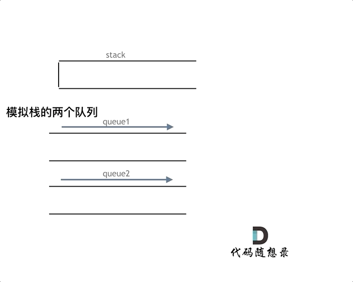

# cpp_data_structure 

* 代码随想录 https://programmercarl.com/

--------------------------------------------------------------------------------

# 栈与队列

--------------------------------------------------------------------------------

## 栈与队列理论基础

## Stack_and_Queue.md
--------------------------------------------------------------------------------

## 用队列实现栈 implement stack using queues

## _1_implement_stack_using_queues.md
--------------------------------------------------------------------------------

### 225. 用队列实现栈

> Leetcode链接: https://leetcode.cn/problems/implement-stack-using-queues/

> 请你仅使用<font color="yellow"> 两个队列 </font> 实现一个后入先出（`LIFO`）的栈，并支持普通栈的全部四种操作（`push`、`top`、`pop` 和 `empty`）。
> 
> 实现 `MyStack` 类：
> 
> * `void push(int x)` 将元素 `x` 压入栈顶。
> * `int pop()` 移除并返回栈顶元素。
> * `int top()` 返回栈顶元素。
> * `boolean empty()` 如果栈是空的，返回 `true` ；否则，返回 `false` 。
>
> **注意：**
> 
> * 你只能使用队列的基本操作 —— 也就是 `push to back`、`peek/pop from front`、`size` 和 `is empty` 这些操作。
> * 你所使用的语言也许不支持队列。 你可以使用 `list` （列表）或者 `deque`（双端队列）来模拟一个队列 , 只要是标准的队列操作即可。
>
> 
> **示例1：**
> 
> ```html
> 输入：
> ["MyStack", "push", "push", "top", "pop", "empty"]
> [[], [1], [2], [], [], []]
> 
> 输出：
> [null, null, null, 2, 2, false]
> 
> 解释：
> MyStack myStack = new MyStack();
> myStack.push(1);
> myStack.push(2);
> myStack.top(); // 返回 2
> myStack.pop(); // 返回 2
> myStack.empty(); // 返回 False
> ```
>
> **提示：**
> * `1 <= x <= 9`
> * 最多调用`100` 次 `push`、`pop`、`top` 和 `empty`
> * 每次调用 `pop` 和 `top` 都保证栈不为空
>
> ```c++
> class MyStack {
> public:
>     MyStack() {
> 
>     }
>     
>     void push(int x) {
> 
>     }
>     
>     int pop() {
> 
>     }
>     
>     int top() {
> 
>     }
>     
>     bool empty() {
> 
>     }
> };
> 
> /**
>  * Your MyStack object will be instantiated and called as such:
>  * MyStack* obj = new MyStack();
>  * obj->push(x);
>  * int param_2 = obj->pop();
>  * int param_3 = obj->top();
>  * bool param_4 = obj->empty();
>  */
> ```
>


#### （根据提示：两个队列）我的解法：一个队列存储现有栈元素，并负责输入；另一个负责输出时作为临时存储空间

#### 解法一： 先弹出len-1个，最后一个直接丢掉，然后弹回来

```c++
class MyStack {
protected:
    queue<int> Que;   // 存储现有栈元素，并负责输入
    queue<int> Temp;  // 负责输出时作为临时存储空间

public:
    MyStack() {

    }
    
    void push(int x) {
        Que.push(x);
    }
    
    int pop() {
        // 此解法包括只有一个元素的队列，适用于任何情况


        // 存储弹出前的计算队列长度len;
        int len = Que.size();


        // 将队列Que的前len-1个(第0个~~~第len-2个)，弹出到临时队列Temp中
        for (int i=0; i<len-1; i++) {
            Temp.push(Que.front());    // 临时队列Temp 存储 队列Que的 头部待弹出元素
            Que.pop();  
        }

        // 获取栈顶元素，即队列Que剩下的最后一个元素
        int result = Que.front();  
        // 移除队列的最后一个元素, 其实也是队列头部元素
        Que.pop();
        

        // 将临时队列Temp，重新回到队列Que中
        while (!Temp.empty()) {        // 当队列不为空时
            Que.push(Temp.front());    // 队列Que 存储 临时队列Temp的 顶部待弹出元素
            Temp.pop();                // 临时队列Temp 弹出 
        }
        

        return result;
    }
    
    int top() {
        return Que.back();
    }
    
    bool empty() {
        return Que.empty();
    }
};
```

##### 解法二： 先全部弹出，再弹回来n-1个，最后一个直接丢掉

```c++
class MyStack {
protected:
    queue<int> Que;   // 存储现有栈元素，并负责输入
    queue<int> Temp;  // 负责输出时作为临时存储空间

public:
    MyStack() {

    }
    
    void push(int x) {
        Que.push(x);
    }
    
    int pop() {
        // 此解法包括只有一个元素的队列，适用于任何情况


        // 存储弹出前的计算队列长度len;
        int len = Que.size();

        // 将队列Que的数据，弹出到临时队列Temp中
        while (!Que.empty()) {         // 当队列不为空时
            Temp.push(Que.front());    // 临时队列Temp 存储 队列Que的 头部待弹出元素
            Que.pop(); 
        }
        
        // 将临时队列Temp的前len-1个(第0个~~~第len-2个)，重新回到队列Que中
        for (int i=0; i<len-1; i++) {
            Que.push(Temp.front());    // 队列Que 存储 临时队列Temp的 顶部待弹出元素
            Temp.pop();                // 临时队列Temp 弹出 
        }

        // 获取栈顶元素，即存储临时队列Temp剩下的最后一个元素
        int result = Temp.front();  
        // 移除队列的最后一个元素, 其实也是队列头部元素
        Temp.pop();

        return result;
    }
    
    int top() {
        return Que.back();
    }
    
    bool empty() {
        return Que.empty();
    }
};

```


#### 可以只用一个队列实现

> 将头部弹出的，添加到尾部去，重复n-1次就行
```c++
class MyStack {
protected:
    queue<int> Que;   

public:
    MyStack() {

    }
    
    void push(int x) {
        Que.push(x);
    }
    
    int pop() {
        // 此解法包括只有一个元素的队列，适用于任何情况


        // 存储弹出前的计算队列长度len;
        int len = Que.size();

        // 将队列Que的前len-1个(第0个~~~第len-2个)，弹出，添加到尾部去
        for (int i=0; i<len-1; i++) {
            int num = Que.front();
            Que.pop();
            Que.push(num);      
        }

        // 获取栈顶元素，即队列Que的头部元素
        int result = Que.front();  
        // 移除队列头部元素
        Que.pop();
        
        return result;
    }
    
    int top() {
        return Que.back();
    }
    
    bool empty() {
        return Que.empty();
    }
};
```


#### 代码随想录 


>  这里要强调是单向队列
>
> <font color="yellow"> 有的同学可能疑惑这种题目有什么实际工程意义，其实很多算法题目主要是对知识点的考察和教学意义远大于其工程实践的意义，所以面试题也是这样！</font>
>
> 刚刚做过用 “栈来实现队列” 的同学可能依然想着用一个输入队列，一个输出队列，就可以模拟栈的功能，仔细想一下还真不行！
> 
> **队列模拟栈，其实一个队列就够了，那么我们先说一说两个队列来实现栈的思路**。
>
> **队列是先进先出的规则，把一个队列中的数据导入另一个队列中，数据的顺序并没有变，并没有变成先进后出的顺序**。
>
> 所以用栈实现队列， 和用队列实现栈的思路还是不一样的，这取决于这两个数据结构的性质。
> 
> 但是依然还是要用两个队列来模拟栈，只不过没有输入和输出的关系，而是另一个队列完全用来备份的！
>
> 如下面动画所示，用两个队列`que1`和`que2`实现队列的功能，`que2`其实完全就是一个备份的作用，把`que1`最后面的元素以外的元素都备份到`que2`，然后弹出最后面的元素，再把其他元素从`que2`导回`que1`。
>
> 模拟的队列执行语句如下：
>
> ```c++
> queue.push(1);        
> queue.push(2);        
> queue.pop();   // 注意弹出的操作       
> queue.push(3);        
> queue.push(4);       
> queue.pop();  // 注意弹出的操作    
> queue.pop();    
> queue.pop();    
> queue.empty();   
> ```
>
> <div align=center>
> 
> </div>
>
> 详细如代码注释所示：
> 
> ```c++
> class MyStack {
> public:
>     queue<int> que1;
>     queue<int> que2; // 辅助队列，用来备份
>     /** Initialize your data structure here. */
>     MyStack() {
> 
>     }
> 
>     /** Push element x onto stack. */
>     void push(int x) {
>         que1.push(x);
>     }
> 
>     /** Removes the element on top of the stack and returns that element. */
>     int pop() {
>         int size = que1.size();
>         size--;
>         while (size--) { // 将que1 导入que2，但要留下最后一个元素
>             que2.push(que1.front());
>             que1.pop();
>         }
> 
>         int result = que1.front(); // 留下的最后一个元素就是要返回的值
>         que1.pop();
>         que1 = que2;            // 再将que2赋值给que1
>         while (!que2.empty()) { // 清空que2
>             que2.pop();
>         }
>         return result;
>     }
> 
>     /** Get the top element. */
>     int top() {
>         return que1.back();
>     }
> 
>     /** Returns whether the stack is empty. */
>     bool empty() {
>         return que1.empty();
>     }
> };
> ```
>
> 


> **优化**
> 
> <font color="yellow"> 其实这道题目就是用一个队列就够了 </font>
> 
> **一个队列在模拟栈弹出元素的时候只要将队列头部的元素（除了最后一个元素外） 重新添加到队列尾部，此时再去弹出元素就是栈的顺序了**
> 
> C++优化代码
> ```c++
> class MyStack {
> public:
>     queue<int> que;
>     /** Initialize your data structure here. */
>     MyStack() {
> 
>     }
>     /** Push element x onto stack. */
>     void push(int x) {
>         que.push(x);
>     }
>     /** Removes the element on top of the stack and returns that element. */
>     int pop() {
>         int size = que.size();
>         size--;
>         while (size--) { // 将队列头部的元素（除了最后一个元素外） 重新添加到队列尾部
>             que.push(que.front());
>             que.pop();
>         }
>         int result = que.front(); // 此时弹出的元素顺序就是栈的顺序了
>         que.pop();
>         return result;
>     }
> 
>     /** Get the top element. */
>     int top() {
>         return que.back();
>     }
> 
>     /** Returns whether the stack is empty. */
>     bool empty() {
>         return que.empty();
>     }
> };
> ```
> 


