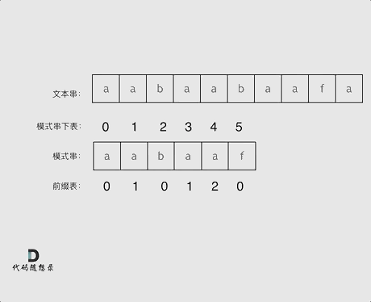

# cpp_data_structure 

* 代码随想录 https://programmercarl.com/

* 一个有非常简明例子的cpp网站：https://en.cppreference.com/w/

--------------------------------------------------------------------------------
> **大家不必太在意leetcode上执行用时，打败多少多少用户，这个就是一个玩具，非常不准确。**
> 
> 做题的时候自己能分析出来时间复杂度就可以了，至于leetcode上执行用时，大概看一下就行，只要达到最优的时间复杂度就可以了，
> 
> 一样的代码多提交几次可能就击败百分之百了....
--------------------------------------------------------------------------------

# 字符串

--------------------------------------------------------------------------------

## KMP 字符串匹配

## KMP.md

## _6_find_the_index_of_the_first_occurrence_in_a_string.md

## _7_repeated_substring_pattern.md

--------------------------------------------------------------------------------

> https://programmercarl.com/0028.%E5%AE%9E%E7%8E%B0strStr.html

>
> 以下文字如果看不进去，可以看我的B站视频：
>
> * 帮你把`KMP`算法学个通透！B站（理论篇）(`https://www.bilibili.com/video/BV1PD4y1o7nd/`)
> * 帮你把`KMP`算法学个通透！（`https://www.bilibili.com/video/BV1M5411j7Xx/`）
>
> `KMP`的经典思想就是:**当出现字符串不匹配时，可以记录一部分之前已经匹配的文本内容，利用这些信息避免从头再去做匹配**。
>
> 
> 
> 
> 本篇将以如下顺序来讲解`KMP`，
>
> * 什么是`KMP`
> * `KMP`有什么用
> * 什么是前缀表
> * 为什么一定要用前缀表
> * 如何计算前缀表
> * 前缀表与`next`数组
> * 使用`next`数组来匹配
> * 时间复杂度分析
> * 构造`next`数组
> * 使用`next`数组来做匹配
> * 前缀表统一减一 `C++`代码实现
> * 前缀表（不减一）`C++`实现
> * 总结
>
> 
> 
> 读完本篇可以顺便把leetcode上28.实现strStr()题目做了。
>
> 

### 什么是KMP

> 
> 说到`KMP`，先说一下`KMP`这个名字是怎么来的，为什么叫做`KMP`呢。
> 
> 因为是由这三位学者发明的：`Knuth`，`Morris`和`Pratt`，所以取了三位学者名字的首字母。所以叫做`KMP`
>
> 

### KMP有什么用

> 
> 
> 
> `KMP`主要应用在字符串匹配上。
>
> `KMP`的主要思想是**当出现字符串不匹配时，可以知道一部分之前已经匹配的文本内容，可以利用这些信息避免从头再去做匹配了**。
>
> 所以如何记录已经匹配的文本内容，是`KMP`的重点，也是`next`数组肩负的重任。
> 
> 其实`KMP`的代码不好理解，一些同学甚至直接把`KMP`代码的模板背下来。
> 
> 没有彻底搞懂，懵懵懂懂就把代码背下来太容易忘了。
> 
> 不仅面试的时候可能写不出来，如果面试官问：`next`数组里的数字表示的是什么，为什么这么表示？
> 
> 估计大多数候选人都是懵逼的。
> 
> 下面`Carl`就带大家把`KMP`的精髓，`next`数组弄清楚。
> 
> 
>
> 
> 

### 什么是前缀表

>
> 写过`KMP`的同学，一定都写过`next`数组，那么这个`next`数组究竟是个啥呢？
>
> `next`数组就是一个**前缀表**（`prefix table`）。
>
> 前缀表有什么作用呢？
>
> **前缀表是用来回退的，它记录了模式串与主串(文本串)不匹配的时候，模式串应该从哪里开始重新匹配。**
>
> 为了清楚地了解前缀表的来历，我们来举一个例子：
>
> 要在文本串：`aabaabaafa` 中查找是否出现过一个模式串：`aabaaf`。
> 
> 请记住文本串和模式串的作用，对于理解下文很重要，要不然容易看懵。所以说三遍：
> 
> 要在文本串：`aabaabaafa` 中查找是否出现过一个模式串：`aabaaf`。
> 
> 要在文本串：`aabaabaafa` 中查找是否出现过一个模式串：`aabaaf`。
> 
> 要在文本串：`aabaabaafa` 中查找是否出现过一个模式串：`aabaaf`。
> 
> 
> 如动画所示：
>
> 

> 
> 

>
> 动画里，我特意把 `子串aa` 标记上了，这是有原因的，大家先注意一下，后面还会说到。
>
> 可以看出，文本串中第六个字符`b` 和 模式串的第六个字符`f`，不匹配了。如果暴力匹配，发现不匹配，此时就要从头匹配了。
> 
> 但如果使用前缀表，就不会从头匹配，而是从上次已经匹配的内容开始匹配，找到了模式串中第三个字符`b`继续开始匹配。
>
> 
> 
> 此时就要问了**前缀表是如何记录的呢？**
> 
> 首先要知道前缀表的任务是当前位置匹配失败，找到之前已经匹配上的位置，再重新匹配，此也意味着在某个字符失配时，前缀表会告诉你下一步匹配中，模式串应该跳到哪个位置。
>
> 那么什么是前缀表：**记录下标`i`之前（包括i）的字符串中，有多大长度的相同前缀后缀**。
>
> 
>
> 

### 最长公共前后缀？

>
> 文章中字符串的前缀和后缀是什么？
> 
> **前缀是指 "不包含最后一个字符" 的所有 "以第一个字符开头"   的 "连续子串"**。
> 例如，`abcde`中的前缀，包括`abcd`、`abc`、`ab`、`a`
> 
> **后缀是指 "不包含第一个字符"   的所有 "以最后一个字符结尾" 的 "连续子串"**。
>
> 例如，`abcde`中的后缀，包括`bcde`、`cde`、`de`、`e`
> 
> 
> **正确理解什么是前缀什么是后缀很重要!**
> 
> 那么网上清一色都说 “`kmp` 最长公共前后缀” 又是什么回事呢？
>
> 我查了一遍 `算法导论` 和 `算法4里KMP的章节`，都没有提到 “最长公共前后缀”这个词，也不知道从哪里来了，我理解是用“最长相等前后缀” 更准确一些。
>
> **因为前缀表要求的就是相同前后缀的长度。** (例如，`aabaa`的最长相等前后缀就是`aa`。即`aa-b-aa`)
>
> 而最长公共前后缀里面的“公共”，更像是说前缀和后缀公共的长度。这其实并不是前缀表所需要的。
> 
> 所以字符串`a`的最长相等前后缀为`0`。 字符串`aa`的最长相等前后缀为`1`。 字符串`aaa`的最长相等前后缀为`2`（这里前缀`aa`和后缀`aa`有重叠）。 等等.....。
>
> 
>
> 

### 为什么一定要用前缀表

>
> 这就是前缀表，那为啥就能告诉我们 上次匹配的位置，并跳过去呢？
>
> 回顾一下，刚刚匹配的过程在下标`5`的地方遇到不匹配，模式串是指向`f`，如图：
>
> 

> 
> 

>
> 然后就找到了下标`2`，指向`b`，继续匹配：如图：
>
> 

> 
> 

>
> 以下这句话，对于理解为什么使用前缀表可以告诉我们匹配失败之后跳到哪里重新匹配 非常重要！
>
> **下标`5`之前这部分的字符串（也就是字符串`aabaa`）的最长相等的前缀 和 后缀字符串是 子字符串`aa` ，因为找到了最长相等的前缀和后缀，匹配失败的位置是后缀子串的后面，那么我们找到与其相同的前缀的后面重新匹配就可以了**。
>
> 所以前缀表具有告诉我们当前位置匹配失败，跳到之前已经匹配过的地方的能力。
>
> **很多介绍`KMP`的文章或者视频并没有把为什么要用前缀表？这个问题说清楚，而是直接默认使用前缀表。**
> 
> 

### 如何计算前缀表

>
> 接下来就要说一说怎么计算前缀表。
>
> 如图：
>
> 

> 
> 

>
> 长度为前`1`个字符的子串`a`，最长相同前后缀的长度为`0`。（ 注意: 字符串的前缀是指不包含最后一个字符的所有以第一个字符开头的连续子串；后缀是指不包含第一个字符的所有以最后一个字符结尾的连续子串。）
>
> 

> 
> 

>
> 长度为前`2`个字符的子串`aa`，最长相同前后缀的长度为`1`。
>
> 

> 
> 

>
> 长度为前`3`个字符的子串`aab`，最长相同前后缀的长度为0。
>
> 以此类推： 长度为前`4`个字符的子串`aaba`，最长相同前后缀的长度为`1`。 长度为前`5`个字符的子串`aabaa`，最长相同前后缀的长度为`2`。 长度为前`6`个字符的子串`aabaaf`，最长相同前后缀的长度为`0`。
> 
> 那么把求得的最长相同前后缀的长度就是对应前缀表的元素，如图：
>
> 

> 
> 

> 
> 可以看出模式串与前缀表对应位置的数字表示的就是：**下标`i`之前（包括`i`）的字符串中，有多大长度的相同前缀后缀**。
> 
> 再来看一下如何利用 前缀表找到 当字符不匹配的时候应该指针应该移动的位置。如动画所示：
>
> 

> 
> 

>
> 
>
> 找到的不匹配的位置， 那么此时我们要看它的前一个字符的前缀表的数值是多少。
> 
> 为什么要前一个字符的前缀表的数值呢，因为要找前面字符串的最长相同的前缀和后缀。
> 
> 所以要看前一位的 前缀表的数值。
> 
> 前一个字符的前缀表的数值是2， 所以把下标移动到下标2的位置继续比配。 可以再反复看一下上面的动画。
> 
> 最后就在文本串中找到了和模式串匹配的子串了。
> 
> 
>
> 
> 

### 前缀表与`next`数组

>
> 很多`KMP`算法的时间都是使用`next`数组来做回退操作，那么`next`数组与前缀表有什么关系呢？
>
> `next`数组就可以是前缀表，但是很多实现都是把前缀表统一减一（右移一位，初始位置为-1）之后作为`next`数组。
> 
> 为什么这么做呢，其实也是很多文章视频没有解释清楚的地方。
>
> 其实**这并不涉及到KMP的原理，而是具体实现，`next`数组既可以就是前缀表，也可以是前缀表统一减一（右移一位，初始位置为`-1`）**。
>
> 后面我会提供两种不同的实现代码，大家就明白了。
>
> 

### 使用`next`数组来匹配

>
> **以下我们以前缀表统一减一之后的`next`数组来做演示**。
>
> 有了`next`数组，就可以根据`next`数组来 匹配文本串`s`，和模式串`t`了。
>
> 注意`next`数组是新前缀表（旧前缀表统一减一了）。
>
> 匹配过程动画如下：
>
> 

> 
> 

>
> 
> 

### 时间复杂度分析

>
> 其中`n`为文本串长度，`m`为模式串长度，因为在匹配的过程中，根据前缀表不断调整匹配的位置，可以看出匹配的过程是`O(n)`，之前还要单独生成`next`数组，时间复杂度是`O(m)`。所以整个`KMP`算法的时间复杂度是`O(n+m)`的。
>
> 暴力的解法显而易见是`O(n × m)`，所以`KMP`在字符串匹配中极大地提高了搜索的效率。
>
> 为了和力扣题目28.实现strStr(`_6_find_the_index_of_the_first_occurrence_in_a_string.md`)保持一致，方便大家理解，以下文章统称`haystack`为文本串, `needle`为模式串。
>
> 都知道使用`KMP`算法，一定要构造`next`数组。
>
> 

### 构造`next`数组

> 
> 

