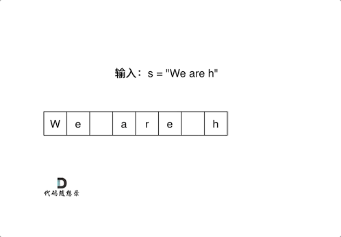

# cpp_data_structure 

* 代码随想录 https://programmercarl.com/

* 一个有非常简明例子的cpp网站：https://en.cppreference.com/w/

--------------------------------------------------------------------------------
> **大家不必太在意leetcode上执行用时，打败多少多少用户，这个就是一个玩具，非常不准确。**
> 
> 做题的时候自己能分析出来时间复杂度就可以了，至于leetcode上执行用时，大概看一下就行，只要达到最优的时间复杂度就可以了，
> 
> 一样的代码多提交几次可能就击败百分之百了....
--------------------------------------------------------------------------------

# 字符串

--------------------------------------------------------------------------------

## 替换空格  ti huan kong ge lcof

## _3_ti_huan_kong_ge_lcof.md

--------------------------------------------------------------------------------

### 剑指 Offer 05. 替换空格

> Leetcode链接: https://leetcode.cn/problems/ti-huan-kong-ge-lcof/

> 请实现一个函数，把字符串 `s` 中的每个空格替换成"`%20`"。
>
> 
> **示例1：**
> 
> ```html
> 输入：s = "We are happy."
> 输出："We%20are%20happy."
> ```
>
> 
> **限制：**
> 
> `0 <= s 的长度 <= 10000`
> 
> ```c++
> class Solution {
> public:
>     string replaceSpace(string s) {
> 
>     }
> };
> ```
> 
> 


#### string 内置 replace函数好用，但是会超时

```c++
class Solution {
public:
    string replaceSpace(string s) {
        string::iterator it = s.begin();
        while(it != s.end()) {
            // 遇到空格
            if (*it == ' ') { 
                s.replace(it - s.begin(), 1, "%20");                        
            }
        }

        return s;
    }
};
```


#### 我的解法1 队列中转站 或 std::string::push_back

```c++
class Solution {
public:
    string replaceSpace(string s) {
        queue<char> que;
        string::iterator it = s.begin();
        // 入队列
        while(it != s.end()) {
            // 遇到空格
            if (*it == ' ') { 
                que.push('%');
                que.push('2');  
                que.push('0');                               
            }
            // 非空格
            else {
                que.push(*it);
            }
            it++;  
        }
        // 清空队列
        s.clear();
        // 将队列中的字符导入s
        while(!que.empty()) {
            s.push_back(que.front());
            que.pop();
        }

        return s;
    }
};
```

> `string`本身就有`push_back`功能，可以直接用

```c++
class Solution {
public:
    string replaceSpace(string s) {
        string result;
        string::iterator it = s.begin();
        while(it != s.end()) {
            // 遇到空格
            if (*it == ' ') { 
                result.push_back('%');
                result.push_back('2');  
                result.push_back('0');                               
            }
            // 非空格
            else {
                result.push_back(*it);
            }
            it++;  
        }

        return result;
    }
};
```

> 或者直接用相加功能，不用一个个加`'%'` `'2'` `'0'`

```c++
class Solution {
public:
    string replaceSpace(string s) {
        string result;
        string::iterator it = s.begin();
        while(it != s.end()) {
            // 遇到空格
            if (*it == ' ') { 
                result += "%20";                         
            }
            // 非空格
            else {
                result.push_back(*it);
            }
            it++;  
        }

        return result;
    }
};
```


#### 我的解法2 `std::string::insert` 但是报错，没解决

> ```c++
> string &insert (size_type pos, const basic_string& str);
> // 在原串下标为pos的字符前插入字符串str
> 
> string &insert (size_type pos, size_type n, char c);
> // 在原串下标为pos的字符前插入n个字符c
> 
> string &insert (size_type pos, const basic_string& str, size_type pos1, size_type n);
> // str从下标为pos1开始数的n个字符插在原串下标为pos的字符前
> 
> iterator insert(iterator it, char c);
> // 在it处插入字符c，返回插入后迭代器的位置
> 
> ```

```c++
class Solution {
public:
    string replaceSpace(string s) {
        string::iterator it = s.begin();
        while(it != s.end()) {
            // 遇到空格
            if (*it == ' ') { 
                // 将空格处改成0
                *it = '%';
                // 0之前插入2和%
                s.insert(it+1, '2'); 
                s.insert(it+2, '0');
                it++;   
                it++;                
            }

            it++;  
        }

        return s;
    }
};
```
> 报错
> 
> <div align=center>
> 
> </div>
> 

> 实机测试
>
> ```c++
> #include <iostream>
> #include <string> 
> using namespace std;
> int main()
> {
> 
>         string s = "We are happy.";
>         
>         cout << s << endl;
> 
>         // insert (size_type pos, const basic_string& str);
>         // 在原串下标为pos的字符前插入字符串str
>         string::iterator it = s.begin();
>         while(it != s.end()) {
>             // 遇到空格
>             if (*it == ' ') { 
>                 // 将空格处改成%
>                 *it = '%';
>                 cout << "Before insert, it:" << it - s.begin() << " s: " << s << endl;
> 
>                 // %之后插入2和0
>                 s.insert(it+1, '2');
>                 // it++; 
>                 s.insert(it+2, '0');
>                 it++; 
>                 it++;
>                 cout << "After insert, it:" << it - s.begin() << " s: " << s << endl;
>                 cout << endl << s << endl ;
>             }
>             it++; 
>         }
> 
> 
>     cout << endl;
>     pause(); // system("pause"); 
> 
>     return 0;
> }
> ```
> 
> 
> 显示如下
> ```c++
> We are happy.
> Before insert, it:2 s: We%are happy.
> After insert, it:4 s: We%20are happy.
> 
> We%20are happy.
> Before insert, it:8 s: We%20are%happy.
> Segmentation fault (core dumped)
> ```
> 
> 


#### 我的解法3  数组方式

```c++
class Solution {
public:
    string replaceSpace(string s) {
        // 统计空格数
        int count = 0;
        for(int i=0; i < s.size(); i++){
            if(s[i] == ' ') {
                count++;
            }
        }
        // 计算最终字符串长度
        int length = s.size() + count * 2;
        // 新建符合长度的字符数组
        string result(length, 'c');// char result[length];  
        int pos = 0;
        // 用pos标识result的下标
        for(int i=0; i < s.size(); i++){
            if(s[i] == ' ') {
                result[pos] = '%';
                result[pos+1] = '2';
                result[pos+2] = '0'; 
                pos = pos + 2;               
            }
            else {
                result[pos] = s[i];
            }
            pos++;
        }        
        
        return result;
    }
};
```


#### 代码随想录

>
> 如果想把这道题目做到极致，就不要只用额外的辅助空间了！
> 
> 首先扩充数组到每个空格替换成`"%20"`之后的大小。
> 
> 然后从后向前替换空格，也就是双指针法，过程如下：
> 
> `i`指向新长度的末尾，`j`指向旧长度的末尾。
> 
> 
> <div align=center>
> 
> </div>
>
> 有同学问了，为什么要从后向前填充，从前向后填充不行么？
> 
> 从前向后填充就是`O(n^2)`的算法了，因为每次添加元素都要将添加元素之后的所有元素向后移动。
> 
> **其实很多数组填充类的问题，都可以先预先给数组扩容带填充后的大小，然后在从后向前进行操作。**
> 
> 这么做有两个好处：
> 
> * 不用申请新数组。
> * 从后向前填充元素，避免了从前向后填充元素时，每次添加元素都要将添加元素之后的所有元素向后移动的问题。
>
> C++代码如下：
>
> ```c++
> class Solution {
> public:
>     string replaceSpace(string s) {
>         int count = 0; // 统计空格的个数
>         int sOldSize = s.size();
>         for (int i = 0; i < s.size(); i++) {
>             if (s[i] == ' ') {
>                 count++;
>             }
>         }
>         // 扩充字符串s的大小，也就是每个空格替换成"%20"之后的大小
>         s.resize(s.size() + count * 2);
>         int sNewSize = s.size();
>         // 从后先前将空格替换为"%20"
>         for (int i = sNewSize - 1, j = sOldSize - 1; j < i; i--, j--) {
>             if (s[j] != ' ') {
>                 s[i] = s[j];
>             } else {
>                 s[i] = '0';
>                 s[i - 1] = '2';
>                 s[i - 2] = '%';
>                 i -= 2;
>             }
>         }
>         return s;
>     }
> };
> ```
>
> * 时间复杂度：`O(n)`
> * 空间复杂度：`O(1)`
>
> 
> 此时算上本题，我们已经做了七道双指针相关的题目了分别是：
> 
> * 27.移除元素(`../_2_1_Array/_2_remove_element.md`)
> * 15.三数之和(`../_2_5_Hash_Table/_7_3sum.md`)
> * 18.四数之和(`../_2_5_Hash_Table/_8_4sum.md`)
> * 206.翻转链表(`../_2_2_Linked_List/_3_reverse_linked_list.md`)
> * 142.环形链表II(`../_2_2_Linked_List/_7_linked_list_cycle_ii.md`)
> * 344.反转字符串(`./_1_reverse_string.md`)
> 


#### 拓展

> 
> 这里也给大家拓展一下字符串和数组有什么差别，
> 
> 字符串是若干字符组成的有限序列，也可以理解为是一个字符数组，但是很多语言对字符串做了特殊的规定，接下来我来说一说`C/C++`中的字符串。
> 
> 
> 
> 在`C`语言中，把一个字符串存入一个数组时，也把结束符 `'\0'`存入数组，并以此作为该字符串是否结束的标志。
>
> 例如这段代码：
>
> ```c++
> char a[5] = "asd";
> for (int i = 0; a[i] != '\0'; i++) {
> }
> ```
> 
> 在`C++`中，提供一个`string`类，`string`类会提供 `size`接口，可以用来判断`string`类字符串是否结束，就不用`'\0'`来判断是否结束。
>
> 例如这段代码：
>
> ```c++
> string a = "asd";
> for (int i = 0; i < a.size(); i++) {
> }
> ```
>
> <font color="yellow"> 
>
> 
> 那么`vector<char>` 和 `string` 又有什么区别呢？
>
> 其实在基本操作上没有区别，但是 `string`提供更多的字符串处理的相关接口，例如`string` 重载了`+`，而`vector`却没有。
>
> 所以想处理字符串，我们还是会定义一个`string`类型
>
> </font>
>
> 


