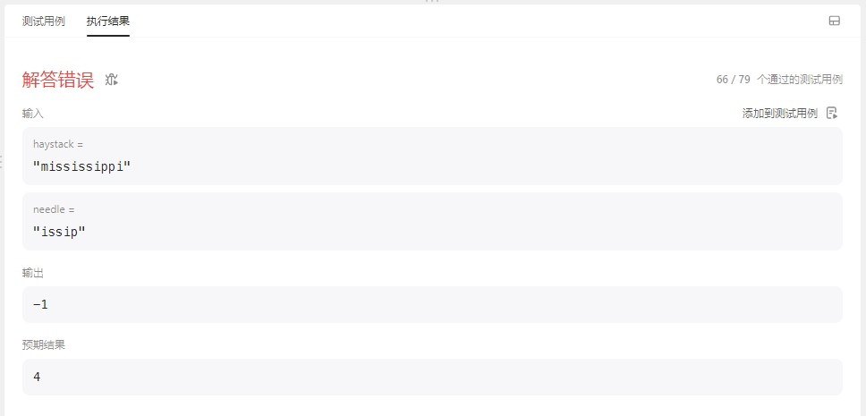

# cpp_data_structure 

* 代码随想录 https://programmercarl.com/

* 一个有非常简明例子的cpp网站：https://en.cppreference.com/w/

--------------------------------------------------------------------------------
> **大家不必太在意leetcode上执行用时，打败多少多少用户，这个就是一个玩具，非常不准确。**
> 
> 做题的时候自己能分析出来时间复杂度就可以了，至于leetcode上执行用时，大概看一下就行，只要达到最优的时间复杂度就可以了，
> 
> 一样的代码多提交几次可能就击败百分之百了....
--------------------------------------------------------------------------------

# 字符串

--------------------------------------------------------------------------------

## 找出字符串中第一个匹配项的下标  find the index of_the first occurrence in a string

## _6_find_the_index_of_the_first_occurrence_in_a_string.md

--------------------------------------------------------------------------------

### 28. 找出字符串中第一个匹配项的下标

> Leetcode链接: https://leetcode.cn/problems/find-the-index-of-the-first-occurrence-in-a-string/

> 给你两个字符串 `haystack` 和 `needle` ，请你在 `haystack` 字符串中找出 `needle` 字符串的第一个匹配项的下标（下标从 `0` 开始）。如果 `needle` 不是 `haystack` 的一部分，则返回  `-1` 。
>
> 
> **示例1：**
> 
> ```html
> 输入：haystack = "sadbutsad", needle = "sad"
> 输出：0
> 解释："sad" 在下标 0 和 6 处匹配。
> 第一个匹配项的下标是 0 ，所以返回 0 。
> ```
>
> **示例2：**
> 
> ```html
> 输入：haystack = "leetcode", needle = "leeto"
> 输出：-1
> 解释："leeto" 没有在 "leetcode" 中出现，所以返回 -1 。
> ```
>
> **提示：**
> * `1 <= haystack.length, needle.length <= 104`
> * `haystack` 和 `needle` 仅由小写英文字符组成
>
> ```c++
> class Solution {
> public:
>     int strStr(string haystack, string needle) {
> 
>     }
> };
> ```
> 
> 
>  


#### 我的解法 66 / 79 个通过的测试用例

```c++
class Solution {
public:
    int strStr(string haystack, string needle) {
        bool is_doing_match = false;      // 标识当前是否正在匹配
        vector<int> done;     // 存储暂时符合的连续下标
        int location = 0;     // needle中待匹配的字符下标

        for(int i=0; i < haystack.size(); i++) {
            // 判断是否完成
            if(done.size() == needle.size()) { // 连续下标的数量已经满足
                return done[0]; // 停止循环，返回下标值
            }
            // 如果未完成，则进行下面的检查

            // 1.若匹配未开始
            if(!is_doing_match) {
                // 当前字符与needle的首字符相同，开始进入匹配
                if(haystack[i] == needle[0]) {
                    is_doing_match = true; // 标识置true
                    done.push_back(i);     // 导入首字符对应的下标
                    location++;            // 首字符匹配完成，待匹配下一个字符
                }
            } 
            // 2.若匹配已开始，正在进行
            else {
                // 2.1. 若当前字符与needle的待匹配字符相同，
                if(haystack[i] == needle[location]) {
                    // 检查i是否和done中的最后一个字符保持连续
                    if(i == *(done.end() - 1) + 1) { // 连续
                        is_doing_match = true; 
                        done.push_back(i); // 导入字符对应的下标
                        location++;  // 字符匹配完成，匹配下一个字符
                    } 
                    else { // 不连续
                        is_doing_match = false; // 标识置false, 重新匹配
                        done.clear();          // 清理上一次匹配积累的下标
                        location = 0;          // needle中待匹配的字符下标。从头开始
                    } 
                }
                // 2.2. 若当前字符与needle的待匹配字符不同            
                else {
                    is_doing_match = false;
                    done.clear();          // 清理上一次匹配积累的下标
                    location = 0;          // needle中待匹配的字符下标。从头开始
                } 

            }            
        }

        // 全部遍历后，判断是否完成
        if(done.size() == needle.size()) { // 连续下标的数量已经满足
            return done[0]; // 停止循环，返回下标值
        }
        // 如果未完成
        return -1;
    }
};
```
> 报错信息如下
>
> <div align=center>
> 
> </div>
>


