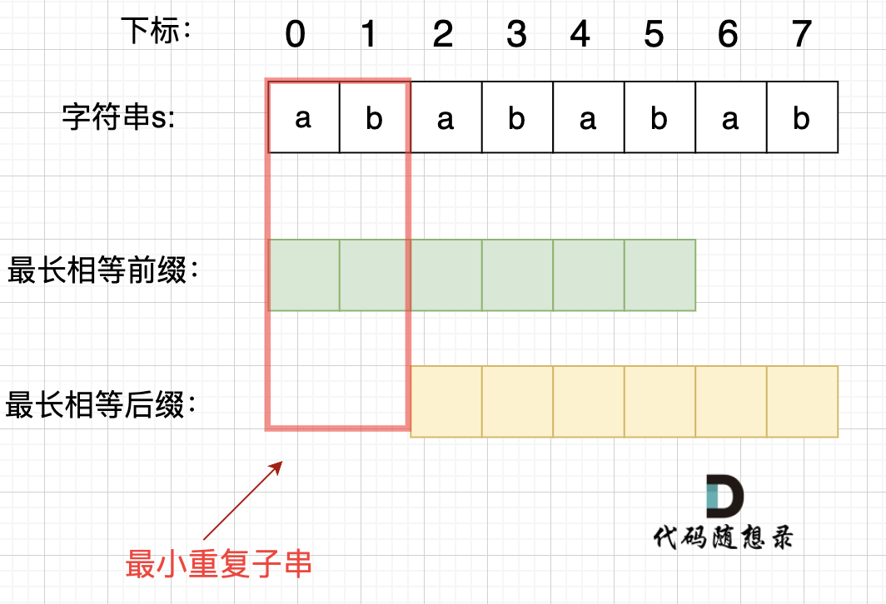
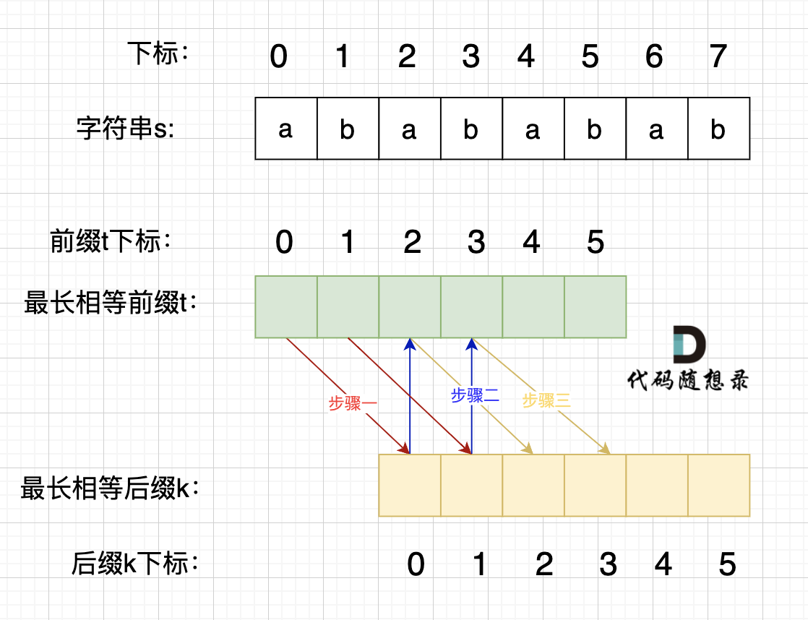

# cpp_data_structure 

* 代码随想录 https://programmercarl.com/

* 一个有非常简明例子的cpp网站：https://en.cppreference.com/w/

--------------------------------------------------------------------------------
> **大家不必太在意leetcode上执行用时，打败多少多少用户，这个就是一个玩具，非常不准确。**
> 
> 做题的时候自己能分析出来时间复杂度就可以了，至于leetcode上执行用时，大概看一下就行，只要达到最优的时间复杂度就可以了，
> 
> 一样的代码多提交几次可能就击败百分之百了....
--------------------------------------------------------------------------------

# 字符串

--------------------------------------------------------------------------------

## 重复的子字符串  repeated substring pattern

## _7_repeated_substring_pattern.md

--------------------------------------------------------------------------------

### 459. 重复的子字符串

> Leetcode链接: https://leetcode.cn/problems/repeated-substring-pattern/

>
> 给定一个非空的字符串 `s` ，检查是否可以通过由它的一个子串重复多次构成。
>
> 
> **示例1：**
> 
> ```html
> 输入: s = "abab"
> 输出: true
> 解释: 可由子串 "ab" 重复两次构成。
> ```
>
> **示例2：**
> 
> ```html
> 输入: s = "aba"
> 输出: false
> ```
>
> **示例3：**
> 
> ```html
> 输入: s = "abcabcabcabc"
> 输出: true
> 解释: 可由子串 "abc" 重复四次构成。 (或子串 "abcabc" 重复两次构成。)
> ```
>
> **提示：**
> * `1 <= s.length <= 104`
> * `s` 由小写英文字母组成
>
> ```c++
> class Solution {
> public:
>     bool repeatedSubstringPattern(string s) {
> 
>     }
> };
> ```
>  


#### 我的解法 暴力解法 时间复杂度`O(n^2)`

```c++
class Solution {
public:
    bool repeatedSubstringPattern(string s) {
        // 首先必须保证s.size() / str.size() 能够整除子串长度
        // 且子串长度不大于 k = str.size() <= s.size() / 2
        
        // 遍历各种可能的子串长度
        // 一级循环
        for(int str_len=1; str_len <= s.size() / 2; str_len++) { // 从1开始，子串长度不为0
            // 保证子串长度合理
            // 如果不能够整除子串长度（余数！= 0），当前子串长度不合理
            if(s.size() % str_len != 0) continue; 

            bool flags = false;  // 标志位

            // 二级循环
            int cycles = s.size() / str_len; // 子串可能的最多重复次数
            for(int i=1; i < cycles; i++) {  // 第i次循环. i = 1,2, ..., n-1

                // 从s[str_len]开始，与s[0]进行比较；s[str_len + 1]与s[1]进行比较; ...
                // 从s[str_len * 2]开始，与s[0]进行比较；s[str_len * 2 + 1]与s[1]进行比较; ...
                // ...
                int start = str_len * i; // 第i次循环中，进行比较的第一个下标

                // 三级循环
                for(int j=0; j < str_len; j++) {
                    if(s[start + j] != s[j]) { // 只要有一个比较结果不对
                        flags = false; // 标志位false
                        break;         // 停止三级循环
                    } 
                    else {   
                        flags = true;
                    }
                } 

                // 每次三级循环结束后，检查flags
                if(!flags) {
                    break; // 只要有一组子串比对错误，当前str_len就不合理，停止二级循环，
                }
            }       
            
            // 每次二级循环结束后，检查flags
            if(flags) { // 如果为true，说明重复子串的长度str_len正确
                return true;
            }
        }

        // str_len从1 ~ s.size() / 2都不对，说明不能由重复子串构成
        return false; 
    }
};
```


### 代码随想录

### 思路

> 
> 暴力的解法， 就是一个`for`循环获取 子串的终止位置， 然后判断子串是否能重复构成字符串，又嵌套一个`for`循环，所以是`O(n^2)`的时间复杂度。
> 
> 有的同学可以想，怎么一个`for`循环就可以获取子串吗？ 至少得一个`for`获取子串起始位置，一个`for`获取子串结束位置吧。
> 
> 其实我们只需要判断，以第一个字母为开始的子串就可以，所以一个`for`循环获取子串的终止位置就行了。 而且遍历的时候 都不用遍历结束，只需要遍历到中间位置，因为子串结束位置大于中间位置的话，一定不能重复组成字符串。
> 
> 暴力的解法，这里就不详细讲解了。
> 
> 
> 主要讲一讲 **移动匹配** 和 `KMP` 两种方法。
>
> 
> 


### 移动匹配 

> 
> 当一个字符串`s：abcabc`，内部由重复的子串组成，那么这个字符串的结构一定是这样的：
>
> <div align=center>
> 
> </div>
>
> 也就是由前后相同的子串组成。
> 
> 那么既然前面有相同的子串，后面有相同的子串，用 `s + s`，这样组成的字符串中，后面的子串做前串，前后的子串做后串，就一定还能组成一个`s`，如图：
>
> <div align=center>
> 
> </div>
> 
> 所以判断字符串`s`是否由重复子串组成，只要两个`s`拼接在一起，里面还出现一个`s`的话，就说明是由重复子串组成。
> 
> 当然，我们在判断 `s + s` 拼接的字符串里是否出现一个`s`的的时候，要刨除 `s + s` 的首字符和尾字符，这样避免在`s+s`中搜索出原来的`s`，我们要搜索的是中间拼接出来的`s`。
>
> 代码如下：
>
> ```c++
> class Solution {
> public:
>     bool repeatedSubstringPattern(string s) {
>         string t = s + s;
>         t.erase(t.begin()); t.erase(t.end() - 1); // 掐头去尾
>         if (t.find(s) != std::string::npos) return true; // r
>         return false;
>     }
> };
> ```
>
> 注意：`std::string::npos`是一个常数，它等于`size_type`类型可以表示的最大值，用来表示一个不存在的位置,类型一般是`std::container_type::size_type`。
> 
> 
> * 时间复杂度: `O(n)`
> * 空间复杂度: `O(1)`
> 
> 不过这种解法还有一个问题，就是 我们最终还是要判断 一个字符串（`s + s`）是否出现过 `s` 的过程，大家可能直接用`contains`，`find` 之类的库函数。 却忽略了实现这些函数的时间复杂度（暴力解法是`m * n`，一般库函数实现为` O(m + n)`）。
> 
> 如果我们做过 28.实现strStr (`_6_find_the_index_of_the_first_occurrence_in_a_string.md`)题目的话，其实就知道，**实现一个 高效的算法来判断 一个字符串中是否出现另一个字符串是很复杂的**，这里就涉及到了`KMP`算法。
>
> 


### `KMP`

#### 为什么会使用`KMP`

> 
> 以下使用KMP方式讲解，强烈建议大家先把以下两个视频看了，理解KMP算法，再来看下面讲解，否则会很懵。
>
> `./KMP`
>
> https://www.bilibili.com/video/BV1PD4y1o7nd/
>
> https://www.bilibili.com/video/BV1M5411j7Xx/
>
> https://programmercarl.com/0028.%E5%AE%9E%E7%8E%B0strStr.html
>
> 在一个串中查找是否出现过另一个串，这是`KMP`的看家本领。那么寻找重复子串怎么也涉及到`KMP`算法了呢？
> 
> `KMP`算法中`next`数组为什么遇到字符不匹配的时候可以找到上一个匹配过的位置继续匹配，靠的是有计算好的前缀表。 前缀表里，统计了各个位置为终点字符串的最长相同前后缀的长度。
>
> 那么 最长相同前后缀和重复子串的关系又有什么关系呢。
>
> 可能很多录友又忘了 前缀和后缀的定义，再回顾一下：
>
> * 前缀是指不包含最后一个字符的所有以第一个字符开头的连续子串；
> * 后缀是指不包含第一个字符的所有以最后一个字符结尾的连续子串
> 
> 在由重复子串组成的字符串中，最长相等前后缀不包含的子串就是最小重复子串，这里拿字符串`s：abababab` 来举例，`ab`就是最小重复单位，如图所示：
>
> <div align=center>
> 
> </div>
> 
> 
> 


#### 如何找到最小重复子串

> 
> 这里有同学就问了，为啥一定是开头的`ab`呢。 其实最关键还是要理解 最长相等前后缀，如图：
> <div align=center>
> 
> </div>
> 
> 步骤一：因为 这是相等的前缀和后缀，`t[0]` 与 `k[0]`相同， `t[1]` 与 `k[1]`相同，所以 `s[0]` 一定和 `s[2]`相同，`s[1]` 一定和 `s[3]`相同，即：，`s[0]s[1]`与`s[2]s[3]`相同 。
>
> 步骤二： 因为在同一个字符串位置，所以 `t[2]` 与 `k[0]` 相同，`t[3]` 与 `k[1]` 相同。
>
> 步骤三： 因为 这是相等的前缀和后缀，`t[2]` 与 `k[2]`相同 ，`t[3]`与`k[3]` 相同，所以，`s[2]`一定和`s[4]`相同，`s[3]`一定和`s[5]`相同，即：`s[2]s[3]` 与 `s[4]s[5]`相同。
>
> 步骤四：循环往复。
>
> 所以字符串`s`，`s[0]s[1]`与`s[2]s[3]`相同， `s[2]s[3]` 与 `s[4]s[5]`相同，`s[4]s[5]` 与 `s[6]s[7]` 相同。
>
> 正是因为 最长相等前后缀的规则，当一个字符串由重复子串组成的，最长相等前后缀不包含的子串就是最小重复子串。
>
> 


#### 简单推理

>
> 这里再给出一个数学推导，就容易理解很多。
>
> 假设字符串`s`使用多个重复子串构成（这个子串是最小重复单位），重复出现的子字符串长度是`x`，所以`s`是由`n * x`组成。
>
> 因为字符串`s`的最长相同前后缀的长度一定是不包含`s`本身，所以 最长相同前后缀长度必然是`m * x`，而且 `n - m = 1`，（这里如果不懂，看上面的推理）
>
> 所以如果 `nx % (n - m)x = 0`，就可以判定有重复出现的子字符串。
>
> `next` 数组记录的就是最长相同前后缀 字符串：`KMP`算法精讲 (`KMP.md`)这里介绍了什么是前缀，什么是后缀，什么又是最长相同前后缀)， 如果 `next[len - 1] != -1`，则说明字符串有最长相同的前后缀（就是字符串里的前缀子串和后缀子串相同的最长长度）。
>
> 最长相等前后缀的长度为：`next[len - 1] + 1`。(这里的`next`数组是以统一减一的方式计算的，因此需要+`1`，两种计算`next`数组的具体区别看这里：字符串：KMP算法精讲 (`KMP.md`))
>
> 数组长度为：`len`。
>
> 如果`len % (len - (next[len - 1] + 1)) == 0`，则说明数组的长度正好可以被 (数组长度-最长相等前后缀的长度) 整除 ，说明该字符串有重复的子字符串。
>
> **数组长度减去最长相同前后缀的长度相当于是第一个周期的长度，也就是一个周期的长度，如果这个周期可以被整除，就说明整个数组就是这个周期的循环。**
> 
> **强烈建议大家把next数组打印出来，看看next数组里的规律，有助于理解KMP算法**
>
> 如图：
>
> <div align=center>
> 
> </div>
> 
> `next[len - 1] = 7`，`next[len - 1] + 1 = 8`，`8`就是此时字符串`asdfasdfasdf`的最长相同前后缀的长度。
> 
> `(len - (next[len - 1] + 1)) `也就是： `12(字符串的长度) - 8(最长公共前后缀的长度) = 4`， `4`正好可以被 `12(字符串的长度)` 整除，所以说明有重复的子字符串（`asdf`）。
> 
> 
> 


#### C++代码如下：（这里使用了前缀表统一减一的实现方式）

```c++
class Solution {
public:
    void getNext (int* next, const string& s){
        next[0] = -1;
        int j = -1;
        for(int i = 1;i < s.size(); i++){
            while(j >= 0 && s[i] != s[j + 1]) {
                j = next[j];
            }
            if(s[i] == s[j + 1]) {
                j++;
            }
            next[i] = j;
        }
    }
    bool repeatedSubstringPattern (string s) {
        if (s.size() == 0) {
            return false;
        }
        int next[s.size()];
        getNext(next, s);
        int len = s.size();
        if (next[len - 1] != -1 && len % (len - (next[len - 1] + 1)) == 0) {
            return true;
        }
        return false;
    }
};
```
> 时间复杂度: `O(n)`
> 空间复杂度: `O(n)`

#### 前缀表（不减一）的C++代码实现：

```c++
class Solution {
public:
    void getNext (int* next, const string& s){
        next[0] = 0;
        int j = 0;
        for(int i = 1;i < s.size(); i++){
            while(j > 0 && s[i] != s[j]) {
                j = next[j - 1];
            }
            if(s[i] == s[j]) {
                j++;
            }
            next[i] = j;
        }
    }
    bool repeatedSubstringPattern (string s) {
        if (s.size() == 0) {
            return false;
        }
        int next[s.size()];
        getNext(next, s);
        int len = s.size();
        if (next[len - 1] != 0 && len % (len - (next[len - 1] )) == 0) {
            return true;
        }
        return false;
    }
};
```

> 时间复杂度: `O(n)`
> 空间复杂度: `O(n)`


