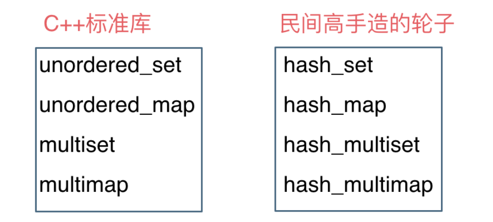

# cpp_data_structure 

* 代码随想录 https://programmercarl.com/

* 一个有非常简明例子的cpp网站：https://en.cppreference.com/w/

--------------------------------------------------------------------------------
> **大家不必太在意leetcode上执行用时，打败多少多少用户，这个就是一个玩具，非常不准确。**
> 
> 做题的时候自己能分析出来时间复杂度就可以了，至于leetcode上执行用时，大概看一下就行，只要达到最优的时间复杂度就可以了，
> 
> 一样的代码多提交几次可能就击败百分之百了....
--------------------------------------------------------------------------------

# 哈希表

--------------------------------------------------------------------------------

## 哈希表理论基础

## Hash_Table.md

--------------------------------------------------------------------------------

#### 哈希表(`hash table`)

> 哈希表是根据关键码的值而直接进行访问的数据结构。
> 
> 这么这官方的解释可能有点懵，其实直白来讲其实数组就是一张哈希表。
> 
> 哈希表中关键码就是数组的索引下标，然后通过下标直接访问数组中的元素，如下图所示：
> 
> 
> 

> 
> 

> 
> 
> 那么哈希表能解决什么问题呢，一般哈希表都是用来快速判断一个元素是否出现集合里。
> 
> 例如, 要查询一个名字是否在这所学校里
> 
> 要枚举的话时间复杂度是`O(n)`，但如果使用哈希表的话， 只需要`O(1)`就可以做到。
> 
> 我们只需要初始化把这所学校里学生的名字都存在哈希表里，在查询的时候通过索引直接就可以知道这位同学在不在这所学校里了。
> 
> 将学生姓名映射到哈希表上就涉及到了`hash function` ，也就是哈希函数。
> 

#### 哈希函数
> 哈希函数，把学生的姓名直接映射为哈希表上的索引，然后就可以通过查询索引下标快速知道这位同学是否在这所学校里了。
> 
> 哈希函数如下图所示，通过`hashCode`把名字转化为数值，一般`hashcode`是通过特定编码方式，可以将其他数据格式转化为不同的数值，这样就把学生名字映射为哈希表上的索引数字了。
> 
> 
> 

> 
> 

> 
> 
> 如果`hashCode`得到的数值大于 哈希表的大小了，也就是大于tableSize了，怎么办呢？
> （即若是`index=hashCode(name)`,可能会出现`index > tableSize`的情况，无法放入哈希表）
> 
> 此时为了保证映射出来的索引数值都落在哈希表上，我们会在再次对数值做一个取模的操作，就要我们就保证了学生姓名一定可以映射到哈希表上了。
> （即`index=hashCode(name) % tableSize`）
> 
> 此时问题又来了，哈希表我们刚刚说过，就是一个数组。
> 
> 如果学生的数量大于哈希表的大小怎么办，此时就算哈希函数计算的再均匀，也避免不了会有几位学生的名字同时映射到哈希表 同一个索引下标的位置。
> （即不同的`name`可能有相同的`index`，无法做到独一无二的`index`）
> 
> 接下来哈希碰撞登场
> 

#### 哈希碰撞
> 如图所示，小李和小王都映射到了索引下标 `1` 的位置，这一现象叫做哈希碰撞。
> 
> 

> 
> 

> 
> 
> 一般哈希碰撞有两种解决方法， 拉链法和线性探测法。

##### 哈希碰撞 : 拉链法
> 刚刚小李和小王在索引`1`的位置发生了冲突，发生冲突的元素都被存储在链表中。 这样我们就可以通过索引找到小李和小王了
> 
> 

> 
> 

> 
> （数据规模是`dataSize`， 哈希表的大小为`tableSize`）
> 其实拉链法就是要选择适当的哈希表的大小，这样既不会因为数组空值而浪费大量内存，也不会因为链表太长而在查找上浪费太多时间。
>

##### 哈希碰撞 : 线性探测法
> 使用线性探测法，一定要保证`tableSize`大于`dataSize`。 我们需要依靠哈希表中的空位来解决碰撞问题。
> 
> 例如冲突的位置，放了小李，那么就向下找一个空位放置小王的信息。所以要求`tableSize`一定要大于`dataSize` ，要不然哈希表上就没有空置的位置来存放 冲突的数据了。如图所示：
> 
> 

> 
> 

> 
>
> 其实关于哈希碰撞还有非常多的细节，感兴趣的同学可以再好好研究一下，这里就不再赘述了。
> 

### 常见的三种哈希结构
> 当我们想使用哈希法来解决问题的时候，我们一般会选择如下三种数据结构。
> * 数组
> * `set`(集合)
> * `map`(映射)
> 
> 这里数组就没啥可说的了，我们来看一下`set`。
> 在C++中，`set` 和 `map` 分别提供以下三种数据结构，其底层实现以及优劣如下表所示：
> 
> 

> 
> 

> 
>
> `std::unordered_set`底层实现为哈希表，`std::set` 和`std::multiset` 的底层实现是红黑树，红黑树是一种平衡二叉搜索树，所以`key`值是有序的，但`key`不可以修改，改动`key`值会导致整棵树的错乱，所以只能删除和增加。
> 
> 
> 

> 
> 

> 
>
> `std::unordered_map` 底层实现为哈希表，`std::map` 和`std::multimap` 的底层实现是红黑树。同理，`std::map` 和`std::multimap` 的`key`也是有序的（这个问题也经常作为面试题，考察对语言容器底层的理解）。
> 
> 当我们要使用集合`set`来解决哈希问题的时候，优先使用`unordered_set`，因为它的查询和增删效率是最优的，如果需要集合是有序的，那么就用`set`，如果要求不仅有序还要有重复数据的话，那么就用`multiset`。
> 
> 那么再来看一下`map` ，在`map`中 是一个`key value` 的数据结构，`map`中，对`key`是有限制，对`value`没有限制的，因为`key`的存储方式使用红黑树实现的。
> 
> 虽然`std::set`、`std::multiset` 的底层实现是红黑树，不是哈希表，`std::set`、`std::multiset` 使用红黑树来索引和存储，不过给我们的使用方式，还是哈希法的使用方式，即`key`和`value`。所以使用这些数据结构来解决映射问题的方法，我们依然称之为哈希法。 `map`也是一样的道理。
> 
> 这里在说一下，一些`C++`的经典书籍上 例如`STL`源码剖析，说到了`hash_set`， `hash_map`，这个与`unordered_set`，`unordered_map`又有什么关系呢？
> 
> 实际上功能都是一样一样的， 但是`unordered_set`在`C++11`的时候被引入标准库了，而`hash_set`并没有，所以建议还是使用`unordered_set`比较好，这就好比一个是官方认证的，`hash_set`，`hash_map` 是`C++11`标准之前民间高手自发造的轮子。
> 
> 

> 
> 

> 

### 总结
> 总结一下，当我们遇到了要快速判断一个元素是否出现集合里的时候，就要考虑哈希法。

> 但是哈希法也是牺牲了空间换取了时间，因为我们要使用额外的数组，set或者是map来存放数据，才能实现快速的查找。

> 如果在做面试题目的时候遇到需要判断一个元素是否出现过的场景也应该第一时间想到哈希法！

### 评论区
> 
> 
> 

> 
> 

> 
>