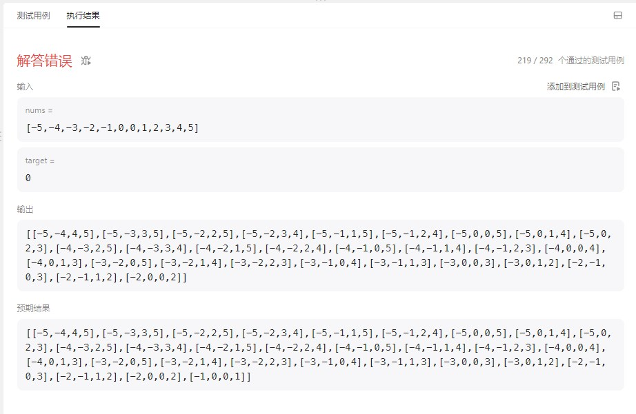
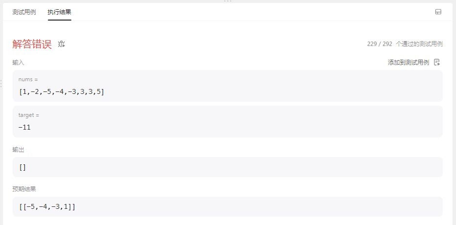
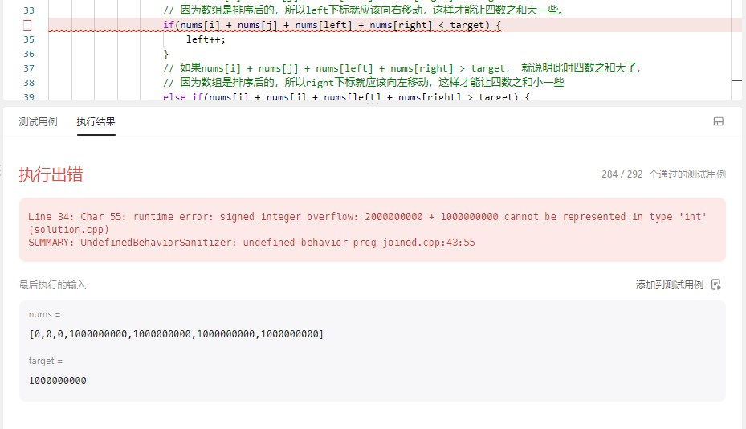

# cpp_data_structure 

* 代码随想录 https://programmercarl.com/

* 一个有非常简明例子的cpp网站：https://en.cppreference.com/w/

--------------------------------------------------------------------------------
> **大家不必太在意leetcode上执行用时，打败多少多少用户，这个就是一个玩具，非常不准确。**
> 
> 做题的时候自己能分析出来时间复杂度就可以了，至于leetcode上执行用时，大概看一下就行，只要达到最优的时间复杂度就可以了，
> 
> 一样的代码多提交几次可能就击败百分之百了....
--------------------------------------------------------------------------------

# 哈希表

--------------------------------------------------------------------------------

## 四数之和 4sum

## _8_4sum.md

--------------------------------------------------------------------------------

### 18. 四数之和

> Leetcode链接: https://leetcode.cn/problems/4sum/

> 给你一个由 `n` 个整数组成的数组 `nums` ，和一个目标值 `target` 。请你找出并返回满足下述全部条件且不重复的四元组 `[nums[a], nums[b], nums[c], nums[d]]` （若两个四元组元素一一对应，则认为两个四元组重复）：
>
> * `0 <= a, b, c, d < n`
> * `a`、`b`、`c` 和 `d` **互不相同**
> * `nums[a] + nums[b] + nums[c] + nums[d] == target`
>
> 你可以按 **任意顺序** 返回答案 。
>
>
> **示例1：**
> 
> ```html
> 输入：nums = [1,0,-1,0,-2,2], target = 0
> 输出：[[-2,-1,1,2],[-2,0,0,2],[-1,0,0,1]]
> ```
>
> **示例2：**
> 
> ```html
> 输入：nums = [2,2,2,2,2], target = 8
> 输出：[[2,2,2,2]]
> ```
>
>
> **提示：**
> * `1 <= nums.length <= 200`
> * `-109 <= nums[i] <= 109`
> * `-109 <= target <= 109`
>
> ```c++
> class Solution {
> public:
>     vector<vector<int>> fourSum(vector<int>& nums, int target) {
> 
>     }
> };
> ```
> 
> 
> 


#### 根据`_7_3sum.md`的双指针法，我有以下的解法（修改了几次，才全部通过）

```c++
class Solution {
public:
    vector<vector<int>> fourSum(vector<int>& nums, int target) {
        vector<vector<int>> result;
        sort(nums.begin(), nums.end());

        // 1 <= nums.length <= 200
        // 有输入为 nums = [0]的情况，需要考虑到
        if(nums.size() < 4)  return result;

        // 找出a + b + c + d = 0
        // a = nums[i], b = num[j], c = nums[left], d = nums[right]
        for(int i = 0; i < nums.size(); i++) {
            // 排序之后如果第一个元素nums[i]已经大于target，那么无论如何组合都不可能凑成四元组，直接返回结果就可以了
            if(nums[i] > target) return result;

            // 去重a
            if (i > 0 && nums[i] == nums[i - 1]) continue;

            for (int j = i+1; j < nums.size()-2; j++) {  // j 只能移动到倒数第三个位置
               // 排序之后如果nums[i] + nums[j]已经大于target，那么无论如何组合都不可能凑成三元组，直接返回结果就可以了
                if(nums[i] + nums[j] > target) return result;

               // 去重b  // 如果不加j > i+1，示例2的[2,2,2,2,2]输出为空
               if (j > i+1 && nums[j] == nums[j - 1]) continue; 

               int left = j + 1;
               int right = nums.size() - 1;
               
               // 直到left与right相遇为止
               while(right > left) {
                    // 如果nums[i] + nums[j] + nums[left] + nums[right] < target， 就说明此时四数之和小了，
                    // 因为数组是排序后的，所以left下标就应该向右移动，这样才能让四数之和大一些。
                    if(nums[i] + nums[j] + nums[left] + nums[right] < target) {
                        left++;
                    }
                    // 如果nums[i] + nums[j] + nums[left] + nums[right] > target， 就说明此时四数之和大了，
                    // 因为数组是排序后的，所以right下标就应该向左移动，这样才能让四数之和小一些                    
                    else if(nums[i] + nums[j] + nums[left] + nums[right] > target) {
                        right--;
                    }
                    // 如果nums[i] + nums[j] + nums[left] + nums[right] = target， 就说明此时四数之和正好
                    else {
                        result.push_back(vector<int>{nums[i], nums[j], nums[left], nums[right]});

                        // 对 c 和 d 去重
                        while((right > left) && (nums[left] == nums[left + 1])) {
                            left++;
                        }
                        while((right > left) && (nums[right] == nums[right - 1])) {
                            right--;
                        }

                        // 找到答案时，双指针同时收缩
                        left++;
                        right--;
                    }
               }
            }
        }
        
        return result;
    }
};
```

##### 第一个问题

> <font color="yellow">运行结果如下</font>
>
> 
> <div align=center>
> 
> </div>
>
> <font color="yellow">少了一个`[-1,0,0,1]`</font>
>

##### 第一个问题实机测试

> <font color="gree">实机测试一下看看</font>
> 
```c++
#include <iostream> 
#include <vector> 
using namespace std;


int main()
{

        vector<int> nums = {-5,-4,-3,-2,-1,0,0,1,2,3,4,5};
        int target = 0;
        vector<vector<int>> result;
        sort(nums.begin(), nums.end());

        cout << "After sort, vector<int> nums = {";
        for(size_t i=0; i < nums.size(); i++) {
            cout << nums[i] << ", ";
        }
        cout << "}" << endl << endl;  


        // 1 <= nums.length <= 200
        // 有输入为 nums = [0]的情况，需要考虑到
        if(nums.size() < 4)  return 0;

        // 找出a + b + c + d = 0
        // a = nums[i], b = num[j], c = nums[left], d = nums[right]
        int i=0;
        int j=0;
        int left=0;
        int right=0;
        for(i = 0; i < nums.size(); i++) {
            // 排序之后如果第一个元素nums[i]已经大于target，那么无论如何组合都不可能凑成四元组，直接返回结果就可以了
            if(nums[i] > target) goto stop;

            // 去重a
            if (i > 0 && nums[i] == nums[i - 1]) continue;

            for (j = i+1; j < nums.size()-2; j++) {  // j 只能移动到倒数第三个位置
               // 排序之后如果nums[i] + nums[j]已经大于target，那么无论如何组合都不可能凑成三元组，直接返回结果就可以了
               if(nums[i] + nums[j] > target) goto stop;

               // 去重b  // 如果不加j > i+1，示例2的[2,2,2,2,2]输出为空
               if (j > i+1 && nums[j] == nums[j - 1]) continue; 

               left = j + 1;
               right = nums.size() - 1;
               
               // 直到left与right相遇为止
               while(right > left) {
                    // 如果nums[i] + nums[j] + nums[left] + nums[right] < target， 就说明此时四数之和小了，
                    // 因为数组是排序后的，所以left下标就应该向右移动，这样才能让四数之和大一些。
                    if(nums[i] + nums[j] + nums[left] + nums[right] < target) {
                        left++;
                    }
                    // 如果nums[i] + nums[j] + nums[left] + nums[right] > target， 就说明此时四数之和大了，
                    // 因为数组是排序后的，所以right下标就应该向左移动，这样才能让四数之和小一些                    
                    else if(nums[i] + nums[j] + nums[left] + nums[right] > target) {
                        right--;
                    }
                    // 如果nums[i] + nums[j] + nums[left] + nums[right] = target， 就说明此时四数之和正好
                    else {
                        result.push_back(vector<int>{nums[i], nums[j], nums[left], nums[right]});

                        // 对 c 和 d 去重
                        while((right > left) && (nums[left] == nums[left + 1])) {
                            left++;
                        }
                        while((right > left) && (nums[right] == nums[right - 1])) {
                            right--;
                        }

                        // 找到答案时，双指针同时收缩
                        left++;
                        right--;
                    }
               }
            }
        }
        

        stop: cout << "stop: " << "i = " << i << ", j = " << j << ", left = " << left << ", right = " << right << endl;
              cout << "stop: " << "nums[i] = " << nums[i] << ", nums[j] = " << nums[j] << ", nums[left] = " << nums[left] << ", nums[right] = " << nums[right] << endl;
              cout << endl;
    
        vector<vector<int>>::iterator row;
        vector<int>::iterator col;
        cout << "四元组: {";
        for(row = result.begin(); row != result.end(); row++) {
            cout << "{";
            for(col = (*row).begin(); col != (*row).end(); col++) {
                cout << *col << ", ";
            }
            cout << "}, ";
        }
        cout << "}" << endl;


    cout << endl;
    pause(); // system("pause"); 
    return 0;
}
```
> <font color="gree">这里实机由于不能返回，将2处`return result;`我们改成了`goto stop`</font>
>
> 运行结果如下
> ```c++
> vector<int> nums = {-5, -4, -3, -2, -1, 0, 0, 1, 2, 3, 4, 5, }
> 
> stop: i = 3, j = 9, left = 9, right = 9
> stop: nums[i] = -2, nums[j] = 3, nums[left] = 3, nums[right] = 3
> 
> 四元组: {{-5, -4, 4, 5, }, {-5, -3, 3, 5, }, {-5, -2, 2, 5, }, {-5, -2, 3, 4, }, {-5, -1, 1, 5, }, {-5, -1, 2, 4, }, {-5, 0, 0, 5, }, {-5, 0, 1, 4, }, {-5, 0, 2, 3, }, {-4, -3, 2, 5, }, {-4, -3, 3, 4, }, {-4, -2, 1, 5, }, {-4, -2, 2, 4, }, {-4, -1, 0, 5, }, {-4, -1, 1, 4, }, {-4, -1, 2, 3, }, {-4, 0, 0, 4, }, {-4, 0, 1, 3, }, {-3, -2, 0, 5, }, {-3, -2, 1, 4, }, {-3, -2, 2, 3, }, {-3, -1, 0, 4, }, {-3, -1, 1, 3, }, {-3, 0, 0, 3, }, {-3, 0, 1, 2, }, {-2, -1, 0, 3, }, {-2, -1, 1, 2, }, {-2, 0, 0, 2, }, }
> 
> ```
> <font color="gree">
> 
> 可以看出，当`i = 3, j = 8, left = 9, right = 10`时，进行了一次
> ` else if(nums[i] + nums[j] + nums[left] + nums[right] > target) { right--;}`
>
> 变成了`i = 3, j = 8, left = 9, right = 9`, 不再满足`while(right > left)`
> 
> 于是进入下一次循环（`j++`）
>
> 变成了`i = 3, j = 9, left = 9, right = 9`
>
> 这时候，由于`if(nums[i] + nums[j] > target) goto stop;`（`leetcode`中是`if(nums[i] + nums[j] > target) return result;`）
>
> 直接就停止了遍历，没有进行下去
>
> </font>
>
> <font color="yellow">问题出在`if(nums[i] + nums[j] > target) goto stop;`（`leetcode`中是`if(nums[i] + nums[j] > target) return result;`）</font> 
>
> <font color="yellow">不应该停止遍历，而是跳出内循环或外循环，执行`i++`。</font> 
>
> 
> 
> 

##### 针对第一个问题的修改

> 
> 
> <font color="yellow">修改两处 </font>
>
> 
> 将`if(nums[i] > target) return result;`改成`if(nums[i] > target) break;`
>
> 
> 将`if(nums[i] + nums[j] > target) return result;`改成`if(nums[i] + nums[j] > target) break;`
>
> <font color="yellow">但是不知道为什么这样改可以包含`[-1,0,0,1]`</font>
>
> 
```c++
class Solution {
public:
    vector<vector<int>> fourSum(vector<int>& nums, int target) {
        vector<vector<int>> result;
        sort(nums.begin(), nums.end());

        // 1 <= nums.length <= 200
        // 有输入为 nums = [0]的情况，需要考虑到
        if(nums.size() < 4)  return result;

        // 找出a + b + c + d = 0
        // a = nums[i], b = num[j], c = nums[left], d = nums[right]
        for(int i = 0; i < nums.size(); i++) {
            // 排序之后如果第一个元素nums[i]已经大于target，那么无论如何组合都不可能凑成四元组，直接返回结果就可以了
            if(nums[i] > target) break;

            // 去重a
            if (i > 0 && nums[i] == nums[i - 1]) continue;

            for (int j = i+1; j < nums.size()-2; j++) {  // j 只能移动到倒数第三个位置
               // 排序之后如果nums[i] + nums[j]已经大于target，那么无论如何组合都不可能凑成三元组，直接返回结果就可以了
                if(nums[i] + nums[j] > target) break;

               // 去重b  // 如果不加j > i+1，示例2的[2,2,2,2,2]输出为空
               if (j > i+1 && nums[j] == nums[j - 1]) continue; 

               int left = j + 1;
               int right = nums.size() - 1;
               
               // 直到left与right相遇为止
               while(right > left) {
                    // 如果nums[i] + nums[j] + nums[left] + nums[right] < target， 就说明此时四数之和小了，
                    // 因为数组是排序后的，所以left下标就应该向右移动，这样才能让四数之和大一些。
                    if(nums[i] + nums[j] + nums[left] + nums[right] < target) {
                        left++;
                    }
                    // 如果nums[i] + nums[j] + nums[left] + nums[right] > target， 就说明此时四数之和大了，
                    // 因为数组是排序后的，所以right下标就应该向左移动，这样才能让四数之和小一些                    
                    else if(nums[i] + nums[j] + nums[left] + nums[right] > target) {
                        right--;
                    }
                    // 如果nums[i] + nums[j] + nums[left] + nums[right] = target， 就说明此时四数之和正好
                    else {
                        result.push_back(vector<int>{nums[i], nums[j], nums[left], nums[right]});

                        // 对 c 和 d 去重
                        while((right > left) && (nums[left] == nums[left + 1])) {
                            left++;
                        }
                        while((right > left) && (nums[right] == nums[right - 1])) {
                            right--;
                        }

                        // 找到答案时，双指针同时收缩
                        left++;
                        right--;
                    }
               }
            }
        }
        
        return result;
    }
};
```


##### 第二个问题

> <font color="yellow">修改后，第230个例子又出了问题</font>
> 
> <div align=center>
> 
> </div>
>
> 
>
> <font color="gree">实机测试一下看看</font>
>

##### 第二个问题实机测试

```c++
#include <iostream> 
#include <vector> 
using namespace std;


int main()
{

        vector<int> nums = {1,-2,-5,-4,-3,3,3,5};
        int target = -11;
        vector<vector<int>> result;
        sort(nums.begin(), nums.end());

        cout << "After sort, vector<int> nums = {";
        for(size_t i=0; i < nums.size(); i++) {
            cout << nums[i] << ", ";
        }
        cout << "}" << endl << endl;  


        // 1 <= nums.length <= 200
        // 有输入为 nums = [0]的情况，需要考虑到
        if(nums.size() < 4)  return 0;

        // 找出a + b + c + d = 0
        // a = nums[i], b = num[j], c = nums[left], d = nums[right]
        int i = 0;
        int j = 0;
        int left = 0;
        int right = 0;
        for(i = 0; i < nums.size(); i++) {
            // 排序之后如果第一个元素nums[i]已经大于target，那么无论如何组合都不可能凑成四元组，直接返回结果就可以了
            if(nums[i] > target) goto stop;

            // 去重a
            if (i > 0 && nums[i] == nums[i - 1]) continue;

            for (j = i+1; j < nums.size()-2; j++) {  // j 只能移动到倒数第三个位置
               // 排序之后如果nums[i] + nums[j]已经大于target，那么无论如何组合都不可能凑成三元组，直接返回结果就可以了
               if(nums[i] + nums[j] > target) goto stop;

               // 去重b  // 如果不加j > i+1，示例2的[2,2,2,2,2]输出为空
               if (j > i+1 && nums[j] == nums[j - 1]) continue; 

               left = j + 1;
               right = nums.size() - 1;
               
               // 直到left与right相遇为止
               while(right > left) {
                    // 如果nums[i] + nums[j] + nums[left] + nums[right] < target， 就说明此时四数之和小了，
                    // 因为数组是排序后的，所以left下标就应该向右移动，这样才能让四数之和大一些。
                    if(nums[i] + nums[j] + nums[left] + nums[right] < target) {
                        left++;
                    }
                    // 如果nums[i] + nums[j] + nums[left] + nums[right] > target， 就说明此时四数之和大了，
                    // 因为数组是排序后的，所以right下标就应该向左移动，这样才能让四数之和小一些                    
                    else if(nums[i] + nums[j] + nums[left] + nums[right] > target) {
                        right--;
                    }
                    // 如果nums[i] + nums[j] + nums[left] + nums[right] = target， 就说明此时四数之和正好
                    else {
                        result.push_back(vector<int>{nums[i], nums[j], nums[left], nums[right]});

                        // 对 c 和 d 去重
                        while((right > left) && (nums[left] == nums[left + 1])) {
                            left++;
                        }
                        while((right > left) && (nums[right] == nums[right - 1])) {
                            right--;
                        }

                        // 找到答案时，双指针同时收缩
                        left++;
                        right--;
                    }
               }
            }
        }
        

        stop: cout << "stop: " << "i = " << i << ", j = " << j << ", left = " << left << ", right = " << right << endl;
              cout << "stop: " << "nums[i] = " << nums[i] << ", nums[j] = " << nums[j] << ", nums[left] = " << nums[left] << ", nums[right] = " << nums[right] << endl;
              cout << endl;
    
        vector<vector<int>>::iterator row;
        vector<int>::iterator col;
        cout << "四元组: {";
        for(row = result.begin(); row != result.end(); row++) {
            cout << "{";
            for(col = (*row).begin(); col != (*row).end(); col++) {
                cout << *col << ", ";
            }
            cout << "}, ";
        }
        cout << "}" << endl;


    cout << endl;
    pause(); // system("pause"); 


    return 0;
}
```
>
> 运行结果如下
> ```c++
> After sort, vector<int> nums = {-5, -4, -3, -2, 1, 3, 3, 5, }
> 
> stop: i = 0, j = 0, left = 0, right = 0
> stop: nums[i] = -5, nums[j] = -5, nums[left] = -5, nums[right] = -5
> 
> 四元组: {}
> ```
> 
> 
>
> <font color="gree">可以看出，刚进入循环，遇到`if(nums[i] > target) goto stop;`就结束了</font>
> 
> 
> <font color="yellow">由于`_7_3sum.md`中是固定了`target = 0`, 所以只要第一个元素`>0`为正，后面的肯定都为正，当然可以`break`跳出</font>
>
> <font color="yellow">但是，在`_8_4sum.md`中要考虑`target ！= 0`的情况，其实就是`target < 0`的情况，因为`target > 0`时，和`target = 0`是一样的</font>
>
> <font color="yellow">对于`target < 0`的情况，只是`if(nums[i] > target)`无法说明没有四元组</font>
>

##### 针对第二个问题的修改

> <font color="yellow">修改两处 </font>
> 
> 将`if(nums[i] > target)  `改成`if((nums[i] > target) && (nums[i] >= 0))`
> 
> 将`if(nums[i] + nums[j] > target)`改成`if((nums[i] + nums[j] > target) && (nums[i] + nums[j] >= 0))`
> 
>
> 
```c++
class Solution {
public:
    vector<vector<int>> fourSum(vector<int>& nums, int target) {
        vector<vector<int>> result;
        sort(nums.begin(), nums.end());

        // 1 <= nums.length <= 200
        // 有输入为 nums = [0]的情况，需要考虑到
        if(nums.size() < 4)  return result;

        // 找出a + b + c + d = 0
        // a = nums[i], b = num[j], c = nums[left], d = nums[right]
        for(int i = 0; i < nums.size(); i++) {
            // 排序之后如果第一个元素nums[i]已经大于target，那么无论如何组合都不可能凑成四元组，直接返回结果就可以了
            // target < 0时，只是if(nums[i] > target)无法说明没有四元组， 需要加入&& (nums[i] >= 0)
            // target >= 0时, 加不加 && (nums[i] >= 0) 都一样， 不影响判断            
            if((nums[i] > target) && (nums[i] >= 0)) break;

            // 去重a
            if (i > 0 && nums[i] == nums[i - 1]) continue;

            for (int j = i+1; j < nums.size()-2; j++) {  // j 只能移动到倒数第三个位置
               // 排序之后如果nums[i] + nums[j]已经大于target，那么无论如何组合都不可能凑成四元组，直接返回结果就可以了
               // target < 0时，只是if(nums[i] + nums[j] > target)无法说明没有四元组， 需要加入 && (nums[i] + nums[j] >= 0)
               // target >= 0时, 加不加 && (nums[i] + nums[j] >= 0) 都一样， 不影响判断               
               if((nums[i] + nums[j] > target) && (nums[i] + nums[j] >= 0)) break;

               // 去重b  // 如果不加j > i+1，示例2的[2,2,2,2,2]输出为空
               if (j > i+1 && nums[j] == nums[j - 1]) continue; 

               int left = j + 1;
               int right = nums.size() - 1;
               
               // 直到left与right相遇为止
               while(right > left) {
                    // 如果nums[i] + nums[j] + nums[left] + nums[right] < target， 就说明此时四数之和小了，
                    // 因为数组是排序后的，所以left下标就应该向右移动，这样才能让四数之和大一些。
                    if(nums[i] + nums[j] + nums[left] + nums[right] < target) {
                        left++;
                    }
                    // 如果nums[i] + nums[j] + nums[left] + nums[right] > target， 就说明此时四数之和大了，
                    // 因为数组是排序后的，所以right下标就应该向左移动，这样才能让四数之和小一些                    
                    else if(nums[i] + nums[j] + nums[left] + nums[right] > target) {
                        right--;
                    }
                    // 如果nums[i] + nums[j] + nums[left] + nums[right] = target， 就说明此时四数之和正好
                    else {
                        result.push_back(vector<int>{nums[i], nums[j], nums[left], nums[right]});

                        // 对 c 和 d 去重
                        while((right > left) && (nums[left] == nums[left + 1])) {
                            left++;
                        }
                        while((right > left) && (nums[right] == nums[right - 1])) {
                            right--;
                        }

                        // 找到答案时，双指针同时收缩
                        left++;
                        right--;
                    }
               }
            }
        }
        
        return result;
    }
};
```

##### 第三个问题

> <font color="yellow">修改后，第285个例子又出了问题</font>
> 
> <div align=center>
> 
> </div>
>
> <font color="yellow">
> 
> 整数溢出(`Integer Overflow`)， 超过了`int`边界, 这四个数不能，需要给`target`
>

##### 针对第三个问题的修改


> 即使我们改成
> ```c++
> long foursum = nums[i] + nums[j] + nums[left] + nums[right];
> if(foursum < target) {
>     left++;
> }                  
> else if(foursum > target) {
>     right--;
> }
> else {
>     ...
> }
> ```
>
> 仍然报错，因为`int+int`的结果先放在`int`变量中，与前面的变量类型无关。
>
> 我们使用强制类型转换`(long)nums[i]`
>
> 改成
> ```c++
> long foursum = (long)nums[i] + (long)nums[j] + (long)nums[left] + (long)nums[right];
> if(foursum < target) {
>     left++;
> }                  
> else if(foursum > target) {
>     right--;
> }
> else {
>     ...
> }
> ```
>
> </font>
>
> 

```c++
class Solution {
public:
    vector<vector<int>> fourSum(vector<int>& nums, int target) {
        vector<vector<int>> result;
        sort(nums.begin(), nums.end());

        // 1 <= nums.length <= 200
        // 有输入为 nums = [0]的情况，需要考虑到
        if(nums.size() < 4)  return result;

        // 找出a + b + c + d = 0
        // a = nums[i], b = num[j], c = nums[left], d = nums[right]
        for(int i = 0; i < nums.size(); i++) {
            // 排序之后如果第一个元素nums[i]已经大于target，那么无论如何组合都不可能凑成四元组，直接返回结果就可以了
            // target < 0时，只是if(nums[i] > target)无法说明没有四元组， 需要加入&& (nums[i] >= 0)
            // target >= 0时, 加不加 && (nums[i] >= 0) 都一样， 不影响判断
            if((nums[i] > target) && (nums[i] >= 0)) break; 

            // 去重a
            if (i > 0 && nums[i] == nums[i - 1]) continue;

            for (int j = i+1; j < nums.size()-2; j++) {  // j 只能移动到倒数第三个位置
               // 排序之后如果nums[i] + nums[j]已经大于target，那么无论如何组合都不可能凑成四元组，直接返回结果就可以了
               // target < 0时，只是if(nums[i] + nums[j] > target)无法说明没有四元组， 需要加入 && (nums[i] + nums[j] >= 0)
               // target >= 0时, 加不加 && (nums[i] + nums[j] >= 0) 都一样， 不影响判断             
               if((nums[i] + nums[j] > target) && (nums[i] + nums[j] >= 0)) break; 

               // 去重b  // 如果不加j > i+1，示例2的[2,2,2,2,2]输出为空
               if (j > i+1 && nums[j] == nums[j - 1]) continue; 

               int left = j + 1;
               int right = nums.size() - 1;
               
               // 直到left与right相遇为止
               while(right > left) {
                    // 防止整数溢出（Integer Overflow）, 使用long
                    long foursum = (long)nums[i] + (long)nums[j] + (long)nums[left] + (long)nums[right];       

                    // 如果nums[i] + nums[j] + nums[left] + nums[right] < target， 就说明此时四数之和小了，
                    // 因为数组是排序后的，所以left下标就应该向右移动，这样才能让四数之和大一些。
                    if(foursum < target) {
                        left++;
                    }
                    // 如果nums[i] + nums[j] + nums[left] + nums[right] > target， 就说明此时四数之和大了，
                    // 因为数组是排序后的，所以right下标就应该向左移动，这样才能让四数之和小一些                    
                    else if(foursum > target) {
                        right--;
                    }
                    // 如果nums[i] + nums[j] + nums[left] + nums[right] = target， 就说明此时四数之和正好
                    else {
                        result.push_back(vector<int>{nums[i], nums[j], nums[left], nums[right]});

                        // 对 c 和 d 去重
                        while((right > left) && (nums[left] == nums[left + 1])) {
                            left++;
                        }
                        while((right > left) && (nums[right] == nums[right - 1])) {
                            right--;
                        }

                        // 找到答案时，双指针同时收缩
                        left++;
                        right--;
                    }
               }
            }
        }
        
        return result;
    }
};
```

##### 全部通过

> 
> <font color="yellow">已经可以全部通过了</font>
> 
> <div align=center>
> 
> </div>
> 
> <font color="yellow">最终版如下</font>
> 
```c++
class Solution {
public:
    vector<vector<int>> fourSum(vector<int>& nums, int target) {
        vector<vector<int>> result;
        sort(nums.begin(), nums.end());

        // 1 <= nums.length <= 200
        // 有输入为 nums = [0]的情况，需要考虑到
        if(nums.size() < 4)  return result;

        // 找出a + b + c + d = 0
        // a = nums[i], b = num[j], c = nums[left], d = nums[right]
        for(int i = 0; i < nums.size(); i++) {
            // 1级剪枝处理
            // 排序之后如果第一个元素nums[i]已经大于target，那么无论如何组合都不可能凑成四元组，直接返回结果就可以了
            // target < 0时，只是if(nums[i] > target)无法说明没有四元组， 需要加入&& (nums[i] >= 0)
            // target >= 0时, 加不加 && (nums[i] >= 0) 都一样， 不影响判断
            if((nums[i] > target) && (nums[i] >= 0)) break; 

            // 去重a
            if (i > 0 && nums[i] == nums[i - 1]) continue;

            for (int j = i+1; j < nums.size()-2; j++) {  // j 只能移动到倒数第三个位置
               // 2级剪枝处理
               // 排序之后如果nums[i] + nums[j]已经大于target，那么无论如何组合都不可能凑成四元组，直接返回结果就可以了
               // target < 0时，只是if(nums[i] + nums[j] > target)无法说明没有四元组， 需要加入 && (nums[i] + nums[j] >= 0)
               // target >= 0时, 加不加 && (nums[i] + nums[j] >= 0) 都一样， 不影响判断             
               if((nums[i] + nums[j] > target) && (nums[i] + nums[j] >= 0)) break; 

               // 去重b  // 如果不加j > i+1，示例2的[2,2,2,2,2]输出为空
               if (j > i+1 && nums[j] == nums[j - 1]) continue; 

               int left = j + 1;
               int right = nums.size() - 1;
               
               // 直到left与right相遇为止
               while(right > left) {
                    // 防止整数溢出（Integer Overflow）, 使用long
                    long foursum = (long)nums[i] + (long)nums[j] + (long)nums[left] + (long)nums[right];       

                    // 如果nums[i] + nums[j] + nums[left] + nums[right] < target， 就说明此时四数之和小了，
                    // 因为数组是排序后的，所以left下标就应该向右移动，这样才能让四数之和大一些。
                    if(foursum < target) {
                        left++;
                    }
                    // 如果nums[i] + nums[j] + nums[left] + nums[right] > target， 就说明此时四数之和大了，
                    // 因为数组是排序后的，所以right下标就应该向左移动，这样才能让四数之和小一些                    
                    else if(foursum > target) {
                        right--;
                    }
                    // 如果nums[i] + nums[j] + nums[left] + nums[right] = target， 就说明此时四数之和正好
                    else {
                        result.push_back(vector<int>{nums[i], nums[j], nums[left], nums[right]});

                        // 对 c 和 d 去重
                        while((right > left) && (nums[left] == nums[left + 1])) {
                            left++;
                        }
                        while((right > left) && (nums[right] == nums[right - 1])) {
                            right--;
                        }

                        // 找到答案时，双指针同时收缩
                        left++;
                        right--;
                    }
               }
            }
        }
        
        return result;
    }
};
```


#### 代码随想录

>
> 四数之和，和15.三数之和 (`_7_3sum.md`)是一个思路，都是使用双指针法, 基本解法就是在15.三数之和 (`_7_3sum.md`)的基础上再套一层for循环。
>
> 但是有一些细节需要注意，例如： 不要判断`nums[k] > target` 就返回了，三数之和 可以通过 `nums[i] > 0` 就返回了，因为 `0` 已经是确定的数了，四数之和这道题目 `target`是任意值。比如：数组是`[-4, -3, -2, -1]`，target是`-10`，不能因为`-4 > -10`而跳过。但是我们依旧可以去做剪枝，逻辑变成`nums[i] > target && (nums[i] >=0 || target >= 0)`就可以了。
> 
> <font color="yellow">我的理解：其实不用`(nums[i] >=0 || target >= 0)`, 用`(nums[i] >=0)`就够了</font>
>
> `_7_3sum.md`的双指针解法是一层`for`循环`num[i]`为确定值，然后循环内有`left`和`right`下标作为双指针，找到`nums[i] + nums[left] + nums[right] == 0`。
>
> 四数之和的双指针解法是两层`for`循环`nums[k] + nums[i]`为确定值，依然是循环内有`left`和`right`下标作为双指针，找出`nums[k] + nums[i] + nums[left] + nums[right] == target`的情况，三数之和的时间复杂度是`O(n^2)`，四数之和的时间复杂度是`O(n^3)` 。
>
> <font color="yellow">那么一样的道理，五数之和、六数之和等等都采用这种解法。</font>
>
> 对于15.三数之和 (`_7_3sum.md`)双指针法就是将原本暴力`O(n^3)`的解法，降为`O(n^2)`的解法，四数之和的双指针解法就是将原本暴力`O(n^4)`的解法，降为`O(n^3)`的解法。
>
> 之前我们讲过哈希表的经典题目：454.四数相加II (`_5_4sum_ii.md`)，相对于本题简单很多，因为本题是要求在一个集合中找出四个数相加等于target，同时四元组不能重复。
>
> 而454.四数相加II (`_5_4sum_ii.md`)是四个独立的数组，只要找到`A[i] + B[j] + C[k] + D[l] = 0`就可以，不用考虑有重复的四个元素相加等于0的情况，所以相对于本题还是简单了不少！
>
> 我们来回顾一下，几道题目使用了双指针法。
> 
> 双指针法将时间复杂度：`O(n^2)`的解法优化为`O(n)`的解法。也就是降一个数量级，题目如下：
> * 27.移除元素(`../_2_1_Array/_2_remove_element.md`)
> * 15.三数之和(`_7_3sum.md`)
> * 18.四数之和(`_8_4sum.md`)
> 
> 链表相关双指针题目：
> * 206.反转链表(`../_2_2_Linked_List/_3_reverse_linked_list.md`)
> * 19.删除链表的倒数第N个节点(`../_2_2_Linked_List/_5_remove_nth_node_from_end.md`)
> * 面试题 02.07. 链表相交(`../_2_2_Linked_List/_6_intersection_of_two_linked_lists.md`)
> * 142题.环形链表II(`../_2_2_Linked_List/_7_linked_list_cycle_ii.md`)
>
> 
> 双指针法在字符串题目中还有很多应用，后面还会介绍到。
> 
> C++代码
> 
> ```c++
> class Solution {
> public:
>     vector<vector<int>> fourSum(vector<int>& nums, int target) {
>         vector<vector<int>> result;
>         sort(nums.begin(), nums.end());
>         for (int k = 0; k < nums.size(); k++) {
>             // 剪枝处理
>             if (nums[k] > target && nums[k] >= 0) {
>             	break; // 这里使用break，统一通过最后的return返回
>             }
>             // 对nums[k]去重
>             if (k > 0 && nums[k] == nums[k - 1]) {
>                 continue;
>             }
>             for (int i = k + 1; i < nums.size(); i++) {
>                 // 2级剪枝处理
>                 if (nums[k] + nums[i] > target && nums[k] + nums[i] >= 0) {
>                     break;
>                 }
> 
>                 // 对nums[i]去重
>                 if (i > k + 1 && nums[i] == nums[i - 1]) {
>                     continue;
>                 }
>                 int left = i + 1;
>                 int right = nums.size() - 1;
>                 while (right > left) {
>                     // nums[k] + nums[i] + nums[left] + nums[right] > target 会溢出
>                     if ((long) nums[k] + nums[i] + nums[left] + nums[right] > target) {
>                         right--;
>                     // nums[k] + nums[i] + nums[left] + nums[right] < target 会溢出
>                     } else if ((long) nums[k] + nums[i] + nums[left] + nums[right]  < target) {
>                         left++;
>                     } else {
>                         result.push_back(vector<int>{nums[k], nums[i], nums[left], nums[right]});
>                         // 对nums[left]和nums[right]去重
>                         while (right > left && nums[right] == nums[right - 1]) right--;
>                         while (right > left && nums[left] == nums[left + 1]) left++;
> 
>                         // 找到答案时，双指针同时收缩
>                         right--;
>                         left++;
>                     }
>                 }
> 
>             }
>         }
>         return result;
>     }
> };
> ```
>
> * 时间复杂度: `O(n^3)`
> * 空间复杂度: `O(1)`
> 
> 
> 


#### 补充

> 
> 二级剪枝的部分：
> ```c++
> if (nums[k] + nums[i] > target && nums[k] + nums[i] >= 0) {
>     break;
> }
> ```
> 
> 可以优化为：
> ```c++
> if (nums[k] + nums[i] > target && nums[i] >= 0) {
>     break;
> }
> ```
> 
> 因为只要 `nums[k] + nums[i] > target`，那么 `nums[i]` 后面的数都是正数的话，就一定 不符合条件了。
>
> 不过这种剪枝 其实有点 小绕，大家能够理解 文章给的完整代码的剪枝 就够了
>
> 


