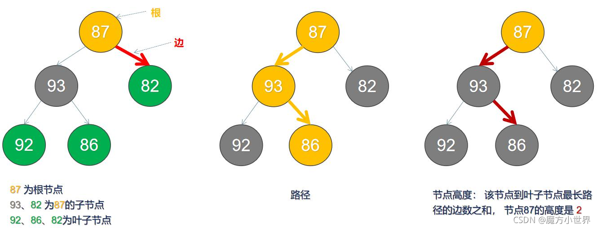

# cpp_data_structure 

* 代码随想录 https://programmercarl.com/

* 一个有非常简明例子的cpp网站：https://en.cppreference.com/w/

--------------------------------------------------------------------------------
> **大家不必太在意leetcode上执行用时，打败多少多少用户，这个就是一个玩具，非常不准确。**
> 
> 做题的时候自己能分析出来时间复杂度就可以了，至于leetcode上执行用时，大概看一下就行，只要达到最优的时间复杂度就可以了，
> 
> 一样的代码多提交几次可能就击败百分之百了....
--------------------------------------------------------------------------------

# 二叉树

--------------------------------------------------------------------------------

### 二叉树理论基础

## Binary_Tree.md

--------------------------------------------------------------------------------

<font color="yellow">当我们想保证查找效率时，可以用顺序表(数组)存储，当我们想保证插入和删除效率时，我们可以用链式表存储，有没有一种存储方法可以同时兼顾顺序表和链式表的优点？ 
使用二叉树 ，便可兼顾查找效率和插入删除效率~</font>


#### 树的基础知识概述
> 树状图是一种数据结构，它是由$n（n>=1$个有限结点组成一个具有层次关系的集合。把它叫做“树”是因为它看起来像一棵倒挂的树，也就是说它是根朝上，而叶朝下的。
> 它具有以下的特点：
每个结点有零个或多个子结点；没有父结点的结点称为根结点；每一个非根结点有且只有一个父结点；除了根结点外，每个子结点可以分为多个不相交的子树；
> <br>  
> <div align=center>
> 
> </div>
> <br>
>
> 注释：Height节点高度的定义需要修改：从当前节点到叶子节点最长路径的边数之和。注意是最长路径
> 如图所示：
> <br>  
> <div align=center>
> 
> 
> </div>
> <br>
> 

#### 二叉树
##### 1. 二叉树的理论定义
> 二叉树(Binary Tree) 是由$n$个结点构成的有限集$(n≥0)$，$n=0$时为空树，$n>0$时为非空树。对于非空树T：
> * 有且仅有一个根结点；
> * 除根结点外的其余结点又可分为两个不相交的子集$T_L$和$T_R$，分别称为$T$的左子树和右子树，且$T_L$和$T_R$本身又都是二叉树。
>
> <font color="yellow"> 很明显该定义属于递归定义，所以有关二叉树的操作使用递归往往更容易理解和实现。</font>
> 
> 简单来说，二叉树是一个每个结点最多只能有两个分支的树，左边的分支称之为左子树，右边的分支称之为右子树~
> <br>  
> <div align=center>
> 
> </div>
> <br>
> 
> <font color="yellow">二叉树与一般树的区别主要是两点:
> * 每个结点的度最多为2；
> * 结点的子树有左右之分，不能随意调换，调换后又是一棵新的二叉树。</font>
>

##### 2. 二叉树的性质
> * 第$i-1$层的结点总数不超过$2^{i-1},i≥1$
> * 深度为$h-1$的二叉树最多有$2^{h-1}$个结点，最少有h个结点, $h≥1$。

##### 3. 常见二叉树分类（五种）
**在我们解题过程中二叉树有两种主要的形式：满二叉树和完全二叉树。**
> 1. 满二叉树 
> > 定义1：除了叶结点外每一个结点都有左右子节点且叶子结点都处在最底层。
> > 定义2：只有度为0的结点和度为2的结点，并且度为0的结点在同一层上。
> >   
> > <div align=center>
> > 
> > </div>
> > 
> > 这棵二叉树为满二叉树，也可以说深度为$k$，有 $2^{k-1}$ 个节点的二叉树。
>

> 2. 完全二叉树 
> > 定义1：在完全二叉树中，除了最底层节点可能没填满外，其余每层节点数都达到最大值，并且**最下面一层的节点都集中在该层最左边的若干位置**。
> > 定义2：若设二叉树的高度为 h，除第 h 层外，其它各层 (1～h-1) 的结点数都达到最大个数，第 h 层有叶子节点，并且叶子结点都是从左到右依次排布，这就是完全二叉树。
> > 
> > <br>  
> > <div align=center>
> > 
> > </div>
> > <br>
>
> <font color="yellow">有一种数据结构"堆"（也叫优先队列） ,堆可以被看做一棵完全二叉树的数组对象</font>
> > 堆在物理层面上，表现为一组连续的数组区间：long[] array ；将整个数组看作是堆。
> > 堆在逻辑结构上，一般被视为是一颗完全二叉树。
> > 堆满足下列性质：
> > * 堆中某个节点的值总是**不大于或不小于**其父节点的值。
> > * 堆总是一棵完全二叉树。
> 

> 3. 二叉搜索树 ——又称二叉查找树、二叉排序树（Binary Sort Tree）
> 前面介绍的树，都没有数值的，而二叉搜索树是有数值的了，二叉搜索树是一个有序树。
> > 它是一颗空树或是满足下列性质的二叉树：
> > 2）若左子树不空，则左子树上所有节点的值均小于或等于它的根节点的值；
> > 3）若右子树不空，则右子树上所有节点的值均大于或等于它的根节点的值；
> > 4）左、右子树也分别为二叉排序树。 
> > 即 **左边<=根<=右边**
> > 
> > 下面这两棵树都是搜索树
> > 
> > <br>  
> > <div align=center>
> > 
> > </div>
> > <br>
>

> 4. 平衡二叉搜索树---又称 AVL 树（Adelson-Velsky and Landis）
> > 它是一颗空树或左右两个子树的高度差的绝对值不超过 1，并且左右两个子树都是一棵平衡二叉树。
> > <br>  
> > <div align=center>
> > 
> > </div>
> > <br>
> > 最后一棵 不是平衡二叉树，因为它的左右两个子树的高度差的绝对值超过了1。<br>
>

> 5. 红黑树---平衡二叉查找树（AVL树）+颜色属性
> > 每个节点都带有颜色属性（颜色为红色或黑色）的自平衡二叉查找树，满足下列性质：
> > 1）节点是红色或黑色；
> > 2）根节点是黑色；
> > 3）所有叶子节点都是黑色；
> > 4）每个红色节点必须有两个黑色的子节点。(从每个叶子到根的所有路径上不能有两个连续为红色的结点）；
> > 5）从任一节点到其每个叶子的所有简单路径都包含相同数目的黑色节点。 （没有度为1的结点）。
> > 以上规则可以保证左右子树结点数差距不超过两倍~
> > <br>  
> > <div align=center>
> > 
> > </div>
> > <br>
> > <font color="yellow">红黑树很难，我们不需要掌握</font>
>
> > C++中map、set、multimap，multiset的底层实现都是红黑树，所以map、set的增删操作时间时间复杂度是logn.注意我这里没有说unordered_map、unordered_set.因为unordered_map、unordered_set底层实现是哈希表。<br> C++ STL中的set, map底层实现是红黑树，而不是AVL，否则需要频繁旋转操作
> > <br>  
> > <div align=center>
> > 
> > > 
> > </div>
> > 注：红黑树是自平衡的二叉查找树，并不一定是完美的二叉查找树。
> >


##### 4. 二叉树的存储方式
> **二叉树可以链式存储，也可以顺序存储。**
> 那么链式存储方式就用指针， 顺序存储的方式就是用数组。
> 顾名思义就是顺序存储的元素在内存是连续分布的，而链式存储则是通过指针把分布在各个地址的节点串联一起。
> > 链式存储如图：
> >  
> > <div align=center>
> > 
> > </div>
> > 
> 
> > 链式存储是大家很熟悉的一种方式，那么我们来看看如何顺序存储呢？
> > 其实就是用数组来存储二叉树，顺序存储的方式如图：
> > 
> > <div align=center>
> > 
> > </div>
> > 
> > 用数组来存储二叉树如何遍历的呢？
> > 如果父节点的数组下标是 $i$，那么它的左孩子就是 $i * 2 + 1$，右孩子就是 $i * 2 + 2$。
> 
> <font color="yellow">用链式表示的二叉树，更有利于我们理解，所以一般我们都是用链式存储二叉树。但是大家要了解，用数组依然可以表示二叉树。</font>
>
##### 5. 二叉树的遍历方式
> 二叉树主要有两种遍历方式：
> > * 深度优先遍历：先往深走，遇到叶子节点再往回走。
> > * 广度优先遍历：一层一层的去遍历。
> 
> 这两种遍历是图论中最基本的两种遍历方式
> 
> 那么**从深度优先遍历和广度优先遍历进一步拓展，才有如下遍历方式：**
> <font color="green">
> > * 深度优先遍历
> >   * 前序遍历（递归法，迭代法）  --- 栈(stack)实现
> >   * 中序遍历（递归法，迭代法）  --- 栈(stack)实现
> >   * 后序遍历（递归法，迭代法）  --- 栈(stack)实现
> > * 广度优先遍历
> >   * 层次遍历（迭代法）  --- 队列(queue)实现
> </font>
> 
> <font color="green">有时候，前序遍历被称为先序遍历</font>
> 
> 以下是解释：
> > 
> > 在深度优先遍历中：有三个顺序，前中后序遍历，这里前中后，其实指的就是中间节点的遍历顺序.
> > **<font color="green">只要记住 前中后序指的就是中间节点的位置就可以了。</font>**
> > 
> > 看如下中间节点的顺序，就可以发现，中间节点的顺序就是所谓的遍历方式
> > * 前序遍历：中左右
> > * 中序遍历：左中右
> > * 后序遍历：左右中
> > 
> > <div align=center>
> > 
> > </div>
> > <br>
> >
>
> > 再举一个例子
> > <br>
> > <div align=center>
> > 
> > </div>
> > <br>
> > 先序：ABDEHCFIG<br>
> > 中序：DBHEAFICG<br>
> > 后序：DHEBIFGCA<br>
> > <div align=center>
> > 
> > </div>
>
> 
> > 最后再说一说二叉树中深度优先和广度优先遍历实现方式，我们做二叉树相关题目，经常会使用递归的方式来实现深度优先遍历，也就是实现前中后序遍历，使用递归是比较方便的。<br>
> > 之前我们讲栈与队列的时候，就说过栈其实就是递归的一种实现结构，也就说前中后序遍历的逻辑其实都是可以借助栈使用非递归的方式来实现的。<br>
> > 而广度优先遍历的实现一般使用队列来实现，这也是队列先进先出的特点所决定的，因为需要先进先出的结构，才能一层一层的来遍历二叉树。<br>
> 
> 这里其实我们又了解了栈与队列的一个应用场景了。<br>
> 具体的实现我们后面都会讲的，这里大家先要清楚这些理论基础。<br>
>


#### 二叉树的实现
> 之前我们说过了二叉树有两种存储方式顺序存储，和链式存储，顺序存储就是用数组来存，这个定义没啥可说的，我们来看看链式存储的二叉树节点的定义方式。<br>
> ```c++
> struct TreeNode {
>     int val;
>     TreeNode *left;
>     TreeNode *right;
>     TreeNode(int x) : val(x), left(NULL), right(NULL) {}
> };
> ```
> 大家会发现二叉树的定义 和 链表 是差不多的，相对于链表 ，二叉树的节点里多了一个指针，有两个指针，指向左右子节点。<br>
> 这里要提醒大家要注意二叉树节点定义的书写方式。
> **在现场面试的时候 面试官可能要求手写代码，所以数据结构的定义以及简单逻辑的代码一定要锻炼白纸写出来。**
> 因为我们在刷leetcode的时候，节点的定义默认都定义好了，真到面试的时候，需要自己写节点定义的时候，有时候会一脸懵逼！
> 

#### 二叉搜索树的实现，各种操作
<https://blog.csdn.net/qq_54169998/article/details/121108627>

