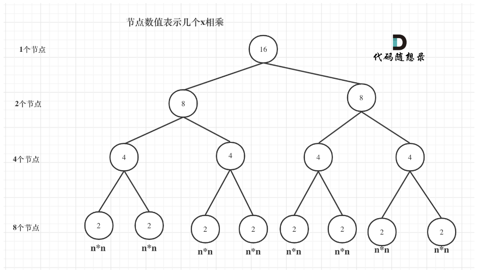
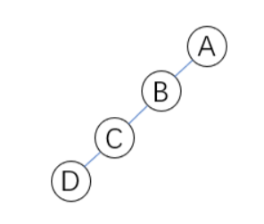
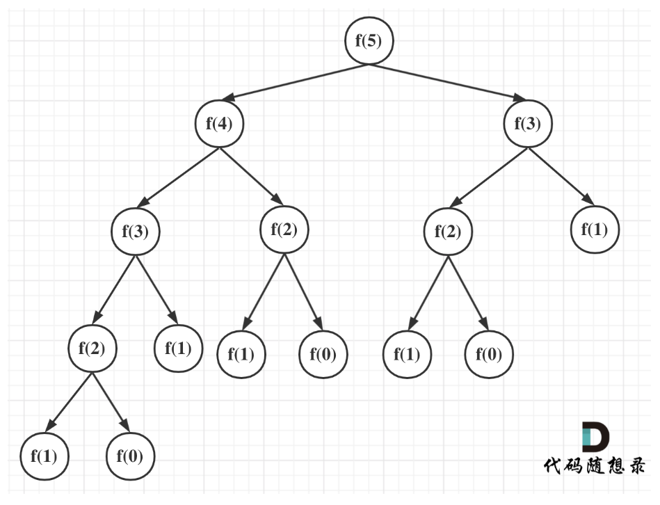
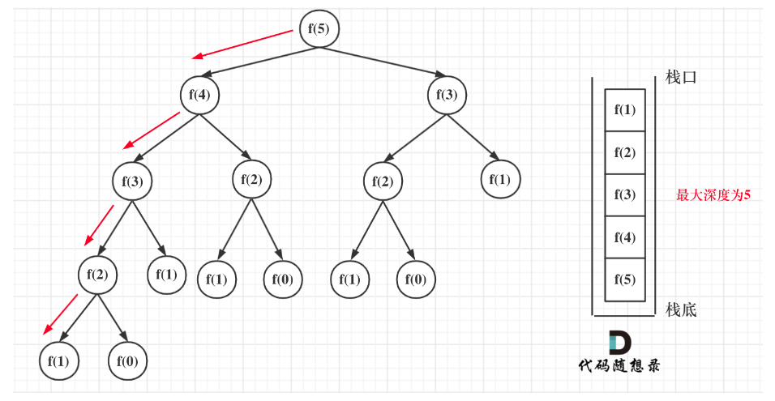
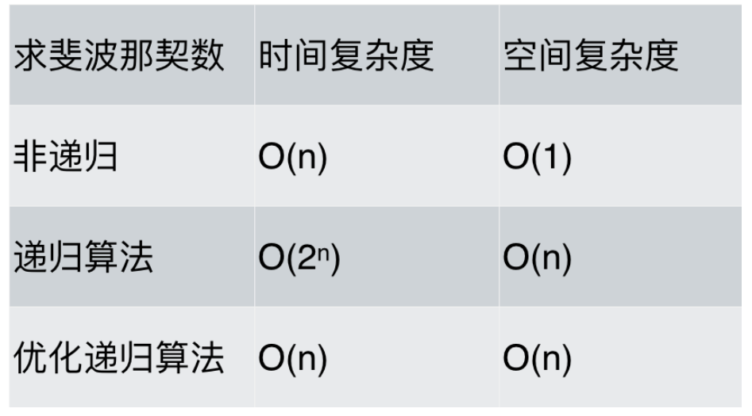

# cpp_data_structure 

* 代码随想录 https://programmercarl.com/

* 一个有非常简明例子的cpp网站：https://en.cppreference.com/w/

--------------------------------------------------------------------------------

# 算法性能分析

--------------------------------------------------------------------------------

## 递归算法的性能分析

## _3_recursion_algorithm.md
--------------------------------------------------------------------------------

### 1. 通过一道面试题目，讲一讲递归算法的时间复杂度！

> 我们通过一道简单的面试题，模拟面试的场景，来带大家逐步分析递归算法的时间复杂度，最后找出最优解
> 来看看同一道题目，同样使用递归算法，为什么有的同学会写出了O(n)的代码，有的同学就写出了O(logn)的代码。

> 面试题：求x的n次方

> 解法1：for循环
> ```c++
> // for循环. 时间复杂度 O(n)
> int recursion_algorithm_function1(int x, int n) {
>     int result = 1;  // 注意 任何数的0次方等于1
>     for (int i = 0; i < n; i++) {
>         result = result * x;
>     }
>     return result;
> }
> ```
> 时间复杂度为O(n)，此时面试官会说，有没有效率更好的算法呢。
> 面试官提示：“考虑一下递归算法”。

> 解法2：递归算法1
> ```html
> 设 函数 f(x，n) = x^n
> 当 n = 0 时, f(x，0) = 1;  
> 当 n > 0 时, f(x，n) = f(x，n-1) * x;
> ```
> ```c++
> // 递归算法1.  时间复杂度: 递归的次数 * 每次递归中的操作次数 = n * 1= O(n) 。时间复杂度没有减小
> int recursion_algorithm_function2(int x, int n) {
>     if (n == 0) {
>         return 1;   // 递归调用必须设置终止条件， 当n = 0时，不再递归调用，直接给result赋值1.
>     }
>     if(n > 0) {
>         return recursion_algorithm_function2(x, n - 1) * x;        
>     } 
>     return -1; //n为负数，则返回-1
> }
> ```
> 面试官问：“那么这个代码的时间复杂度是多少？”。
> 一些同学可能一看到递归就想到了$O(log n)$，
> 不要固定思维，并不是所有递归算法都是$O(log n)$，
>  **递归算法的时间复杂度本质上是要看:递归的次数 * 每次递归中的操作次数**。
> 每次n-1，递归了n次时间复杂度是O(n)，每次进行了一个乘法操作，乘法操作的时间复杂度一个常数项O(1)，所以这份代码的时间复杂度是 n × 1 = O(n)。
> 没有达到面试官的预期。
>

> 解法3：递归算法2
> ```html
> 设函数f(x，n) = x^n
> 当 n = 0 时 f(x，0) = 1;  
> 当 n 为非0 奇数 时, f(x，n)= x^n = f(x，n / 2) * f(x，n / 2) * x;
> 当 n 为非0 偶数 时, f(x，n)= x^n = f(x，n / 2) * f(x，n / 2);        
> ```
> ```c++
> // 递归算法2.  时间复杂度: 递归的次数 * 每次递归中的操作次数 = ？ * 1 。仍然是O(n)
> int recursion_algorithm_function3(int x, int n) {  
>     if (n == 0) {
>         return 1;   // 递归调用必须设置终止条件， 当n = 0时，不再调用本函数，给result赋值1.
>     }
>     if (n % 2 == 1) {
>         return recursion_algorithm_function3(x, n / 2) * recursion_algorithm_function3(x, n / 2) * x; 
>     }
>     if(n % 2 == 0){
>         return recursion_algorithm_function3(x, n / 2) * recursion_algorithm_function3(x, n / 2);
>     }
>     return -1; //n为负数，则返回-1
> }
> ```
> 我们来分析一下，首先看递归了多少次呢，可以把递归抽象出一棵"满二叉树"。刚刚同学写的这个算法，可以用一棵"满二叉树"来表示（为了方便表示，选择n为偶数16），如图：
> <div align=center>
> 
> </div>
> 
> 当前这棵二叉树就是求x的n次方，n为16的情况
> 这棵树上每一个节点就代表着一次递归并进行了一次相乘操作，所以进行了多少次递归的话，就是看这棵树上有多少个节点。
> 熟悉二叉树话应该知道如何求"满二叉树"节点数量，这棵满二叉树的节点数量就是$2^3 + 2^2 + 2^1 + 2^0 = 15$，可以发现：这其实是等比数列的求和公式，这个结论在二叉树相关的面试题里也经常出现。
> 
> 如果是求x的n次方，这个递归树有多少个节点呢，如下图所示：(m为深度，从0开始)
> 1. 深度 $m = \log_2{n} - 1$
> 2. 节点数 $2^m + 2^{m-1} + ... + 2^1 + 2^0 = 2^{m+1} - 1$
> 3. 公式1带入公式2 得到节点数为 $2^{m+1} - 1 = n -1$
> 4. 忽略常数项-1，时间复杂度为$O(n)$
>
> 对，你没看错，依然是O(n)的时间复杂度！很明显没有达到面试官的预期。
> 这里是有冗余的部分，即每次进行了两个递归调用recursion_algorithm_function3(x, n / 2)，如果我们只调用一次func3，暂存值后平方，就可以少一半的递归调用。
>

> 解法4：递归算法3
> ```html
> 设函数f(x，n) = x^n
> 当 n = 0 时 f(x，0) = 1;  
> 当 n 为非0 奇数 时, f(x，n)= x^n = f(x，n / 2) * f(x，n / 2) * x;
> 当 n 为非0 偶数 时, f(x，n)= x^n = f(x，n / 2) * f(x，n / 2);        
> ```
> ```c++
> int recursion_algorithm_function4(int x, int n) {
>     if (n == 0) {
>         return 1;   // 递归调用必须设置终止条件， 当n = 0时，不再调用本函数，给result赋值1.
>     }
>     int t = recursion_algorithm_function4(x, n / 2); // 这里相对于function3，是把这个递归操作抽取出来
>     if (n % 2 == 1) {
>         return t * t * x; 
>     }
>     if(n % 2 == 0){
>         return t * t; 
>     }
>     return -1; //n为负数，则返回-1
> }
> ```
> 这次就是"斜二叉树"了，
> <div align=center>
> 
> </div>
> 
> 如果是求x的n次方，这个递归树有多少个节点呢，如下图所示：(m为深度，从0开始)
> 1. 深度 $m = \log_2{n} - 1$
> 2. 节点数 $m + 1$
> 3. 公式1带入公式2 得到节点数为 $m + 1 = \log_2{n} - 1 + 1= \log_2{n}$
> 4. 时间复杂度为$O(logn)$
> 

实际运行比较一下
> * CMake组织文件结构
> ```cmake
> # .../cpp_data_structure/CMakeLists.txt
> 
> # 最小版本，可以通过cmake --version查看
> cmake_minimum_required(VERSION 3.5.1)
> 
> # 项目名称，建议大写
> project(CPP_DATA_STRUCTURE)
>
> # 支持c++11
> set(CMAKE_CXX_STANDARD 11)
>
> # 添加头文件路径
> include_directories(
>     ${PROJECT_SOURCE_DIR}/    # 使用绝对路径有好处, 不用担心当前CMakeLists.txt和include相对路径关系
>     ${PROJECT_SOURCE_DIR}/include/Algorithm_Performance_Analysis
> )
>
> # 生成可执行文件
> # 把./src目录下的所有源文件都添加到SRC_LIST源列表变量里面去
> aux_source_directory(./src SRC_LIST)                            
> # 把./src/Algorithm_Performance_Analysis目录下的所有源文件都添加到SRC_LIST_1源列表变量里面去
> aux_source_directory(./src/Algorithm_Performance_Analysis SRC_LIST_1)    
> # 生成可执行文件命令，第一个参数是生成可执行文件的名称main，后面的参数是源文件/源文件列表
> add_executable(main main.cpp ${SRC_LIST} ${SRC_LIST_1}) 
> 
> # 指定生成可执行文件的输出目录
> set(EXECUTABLE_OUTPUT_PATH ${PROJECT_SOURCE_DIR}/out)  # 使用绝对路径最好
>
> # 设置编译时的选项，如O2优化，开启警告,使用的C++标准等
> set(CMAKE_CXX_FLAGS "${CMAKE_CXX_FLAGS} -Wall")
> 
> # 调试时使用该项
> set(CMAKE_BUILD_TYPE Debug)
> ```
>
> * 头文件，声明函数
> ```c++
> // .../cpp_data_structure/include/Algorithm_Performance_Analysis/recursion_algorithm.h
>
> #ifndef RECURSION_ALGORITHM_H
> #define RECURSION_ALGORITHM_H
> 
> // 求x的n次方
> 
> // for循环. 时间复杂度 O(n)
> int recursion_algorithm_function1(int x, int n);
> // 递归算法1.  时间复杂度: 递归的次数 * 每次递归中的操作次数 = n * 1= O(n).  时间复杂度没有减小
> int recursion_algorithm_function2(int x, int n);
> // 递归算法2.  时间复杂度: 递归的次数 * 每次递归中的操作次数 = ？ * 1.  仍然是O(n)
> int recursion_algorithm_function3(int x, int n);
> // 递归算法3.  时间复杂度: 递归的次数 * 每次递归中的操作次数 = ？ * 1.  O(logn)
> int recursion_algorithm_function4(int x, int n);
> 
> #endif
> ```
>
> * 源文件，函数实现
> ```c++
> // .../cpp_data_structure/src/Algorithm_Performance_Analysis/recursion_algorithm.cpp
> 
> #include "recursion_algorithm.h"
> 
> // for循环. 时间复杂度 O(n)
> int recursion_algorithm_function1(int x, int n) {
>     int result = 1;  // 注意 任何数的0次方等于1
>     for (int i = 0; i < n; i++) {
>         result = result * x;
>     }
>     return result;
> }
> // 递归算法1.  时间复杂度: 递归的次数 * 每次递归中的操作次数 = n * 1= O(n) 。时间复杂度没有减小
> int recursion_algorithm_function2(int x, int n) {
>     if (n == 0) {
>         return 1;   // 递归调用必须设置终止条件， 当n = 0时，不再递归调用，直接给result赋值1.
>     }
>     if(n > 0) {
>         return recursion_algorithm_function2(x, n - 1) * x;        
>     } 
>     return -1; //n为负数，则返回-1
> }
> // 递归算法2.  时间复杂度: 递归的次数 * 每次递归中的操作次数 = ？ * 1 。仍然是O(n)
> int recursion_algorithm_function3(int x, int n) {
>     if (n == 0) {
>         return 1;   // 递归调用必须设置终止条件， 当n = 0时，不再调用本函数，给result赋值1.
>     }
>     if (n % 2 == 1) {
>         return recursion_algorithm_function3(x, n / 2) * recursion_algorithm_function3(x, n / 2) * x; 
>     }
>     if(n % 2 == 0){
>         return recursion_algorithm_function3(x, n / 2) * recursion_algorithm_function3(x, n / 2);
>     }
>     return -1; //n为负数，则返回-1
> }
> // 递归算法3.  时间复杂度: 递归的次数 * 每次递归中的操作次数 = ？ * 1.   O(logn)
> int recursion_algorithm_function4(int x, int n) {
>     if (n == 0) {
>         return 1;   // 递归调用必须设置终止条件， 当n = 0时，不再调用本函数，给result赋值1.
>     }
>     int t = recursion_algorithm_function4(x, n / 2);
>     if (n % 2 == 1) {
>         return t * t * x; 
>     }
>     if(n % 2 == 0){
>         return t * t; 
>     }
>     return -1; //n为负数，则返回-1
> }
> 
> ```
>
> * main.cpp
> ```c++
> // .../cpp_data_structure/main.cpp
> 
> #include <iostream>   
> using namespace std;
>
> #include <cstdlib>    // 在windows系统下，用语句system("pause"); ,控制台不会输出后马上消失。
> #include <unistd.h>   // 在Linux系统下，用语句pause(); ,控制台不会输出后马上消失。
> 
> #include <chrono>
> #include <thread>
> using namespace chrono;
> 
> #include "compare_time_complexity.h"
>
> 
> int main()
> {
>    int x, n; // 求x的n次方
>    while (1) {
>        cout << "for循环 ";
>        // cout << "递归算法1 ";
>        // cout << "递归算法2 ";
>        // cout << "递归算法3 ";
>
>        cout << "输入x, n：";
>        cin >> x >> n;
>
>        milliseconds start_time = duration_cast<milliseconds >(
>            system_clock::now().time_since_epoch()
>        );
>        
>        int result;
>        result = recursion_algorithm_function1(x, n);
>        // result = recursion_algorithm_function2(x, n);
>        // result = recursion_algorithm_function3(x, n);
>        // result = recursion_algorithm_function4(x, n);
>
>        cout << "x的n次方：" << result << endl;
>
>        milliseconds end_time = duration_cast<milliseconds >(
>            system_clock::now().time_since_epoch()
>        );
>
>        cout << "耗时:" << milliseconds(end_time).count() - milliseconds(start_time).count()
>            <<" ms"<< endl;
>    }    
> 
>     cout << endl;
>     pause(); // Linux中用pause(); Windows中用system("pause"); 
>     return 0;
> }
> ```
>
>  编译运行, 注释不同的函数调用，比较运行时间
> ```c++
> // 运行func1，注释func2和func3和fun4
> for循环 输入x, n：2 100000000
> x的n次方：0
> 耗时:259 ms
> for循环 输入x, n：2 1000000000
> x的n次方：0
> 耗时:2587 ms
> for循环 输入x, n：2 500000000
> x的n次方：0
> 耗时:1310 ms
> for循环 输入x, n：2 400000000
> x的n次方：0
> 耗时:1026 ms
> ```
> ```c++
> // 运行func2，注释func1和func3和fun4
> 递归算法1 输入x, n：2 100000
> x的n次方：0
> 耗时:3 ms
> 递归算法1 输入x, n：2 1000000
> Segmentation fault (core dumped)
> ```
> ```c++
> // 运行func3，注释func1和func2和fun4
> 递归算法2 输入x, n：2 10000000
> x的n次方：0
> 耗时:121 ms
> 递归算法2 输入x, n：2 100000000
> x的n次方：0
> 耗时:928 ms
> ```
> ```c++
> // 运行func4，注释func1和func2和fun3
> 递归算法3 输入x, n：2 100000000
> x的n次方：0
> 耗时:0 ms
> 递归算法3 输入x, n：2 1000000000
> x的n次方：0
> 耗时:0 ms
> ```
> ```c++
> for循环算法 O(n)，1s内大概计算机可以运行 4 * (10^8)次计算。
> 递归算法1 O(n)，不知道为什么报错Segmentation fault (core dumped)。
> 递归算法2 O(n)，1s内大概计算机可以运行 1 * (10^8)次计算。
> 递归算法3 O(logn)，基本很难超时。
> ```

--------------------------------------------------------------------------------

### 2. 深入分析一波递归算法的时间和空间复杂度

> 之前在通过一道面试题目，讲一讲递归算法的时间复杂度！ (opens new window)中详细讲解了递归算法的时间复杂度，但没有讲空间复杂度。
> 
> 本篇讲通过求斐波那契数列和二分法再来深入分析一波递归算法的时间和空间复杂度，细心看完，会刷新对递归的认知！
>

#### 2.1 求斐波那契数列的性能分析
> **<font color="yellow">递归算法的时间复杂度 = 递归的次数 * 每次递归的时间复杂度</font>**
> **<font color="yellow">递归算法的空间复杂度 = 递归深度 * 每次递归的空间复杂度</font>**

##### 2.1.1 时间复杂度分析
> 斐波那契数列：F(1)=1，F(2)=1, F(n)=F(n - 1)+F(n - 2)（n ≥ 3，n ∈ N*）

> 解法1：while循环
> ```c++
> // 时间复杂度O(n) 空间复杂度：O(1)
> int fibonacci (int n) {
>     int first = 1;
> 	int second = 1;
> 	int third = 1;   //n如果为1或者为2，直接返回Third=1.
> 	while (n > 2){
> 		third = first + second;
> 		first = second;
> 		second = third;
> 		n--;
> 	}
> 	return third;
> }
> ```
>

> 解法2：递归算法
> 
> 斐波那契数列：F(1)=1，F(2)=1, F(n)=F(n - 1)+F(n - 2)（n ≥ 3，n ∈ N*）
>
> **版本一: 逆向运算, 类似于数学归纳法的证明**
> 我们可以定义：F(0)=0，F(1)=1，F(2)=1, F(i)=F(i - 1)+F(i - 2)（i ≥ 2，n ∈ N*）
> ```c++
> // 时间复杂度O(2^n) 空间复杂度：O(n)
> int fibonacci_1(int n) {     // 我们可以定义为：F(0)=0，F(1)=1，F(2)=1, F(i)=F(i - 1)+F(i - 2)（i ≥ 2，n ∈ N*）
>     if (n <= 0) return 0;                     // F(0)=0
>     if (n == 1) return 1;                     // F(1)=1
>     return fibonacci_1(n-1) + fibonacci_1(n-2);   // F(n)=F(n - 1)+F(n - 2)（n ≥ 2，n ∈ N*）
> }
> ```
> **递归算法的时间复杂度 = 递归的次数 * 每次递归的时间复杂度。**
> 可以看出上面的代码每次递归都是O(1)的操作。再来看递归了多少次，这里将i为5作为输入的递归过程 抽象成一棵递归树，如图：
> <div align=center>
> 
> </div>
> 
> 在这棵二叉树中每一个节点都是一次递归，那么这棵树有多少个节点呢？
> 一棵深度为$k-1$的二叉树最多可以有 $2^k - 1$ 个节点。
> 所以该递归算法的时间复杂度为 $O(2^n)$，这个复杂度是非常大的，随着n的增大，耗时是指数上升的。
> 
> 这种求斐波那契数的算法看似简洁，其实时间复杂度非常高，一般不推荐这样来实现斐波那契。
> 其实罪魁祸首就是这里的两次递归，导致了时间复杂度以指数上升。
> ```c++
> return fibonacci(i-1) + fibonacci(i-2);
> ```
> **版本二: 正向运算(加法)**
> 我们可以定义：F(0)=0，F(1)=1，F(2)=1, F(i)=F(i - 1)+F(i - 2)（i ≥ 2，n ∈ N*）
> ```c++
> // 时间复杂度O(n) 空间复杂度：O(n)
> int fibonacci_2(int first, int second, int n) {     
>     // 用first和second来记录当前相加的两个数值; n递减, 用于控制加法的次数. 
>     if (n <= 0) {
>         return 0;
>     }
>     if (n < 3) {
>         return 1;
>     }
>     else if (n == 3) {
>         return first + second;
>     }
>     else {
>         return fibonacci_2(second, first + second, n - 1);    
>     }
> }
> ```
> 这里相当于用first和second来记录当前相加的两个数值，此时就不用两次递归了。
> 因为每次递归的时候n减1，即只是递归了n次，所以时间复杂度是 O(n)。
> 

> 计算运行时间的代码：
> ```c++
> void time_consumption_fibonacci() {
>     int n;
>     cout << "斐波那契数的非递归算法" << endl << "输入n：";
>     while (cin >> n) {
>         milliseconds start_time = duration_cast<milliseconds >(
>             system_clock::now().time_since_epoch()
>         );
> 
>         int result;
>         result = fibonacci(n);
>         // result = fibonacci_1(n);
>         // result = fibonacci_2(1, 1, n);
> 
>         milliseconds end_time = duration_cast<milliseconds >(
>             system_clock::now().time_since_epoch()
>         );
>         
>         cout << "fibonacci数列的第 " << n << " 个数为: " << result << endl;
> 
>         cout << "耗时:" ;
>         cout << milliseconds(end_time).count() - milliseconds(start_time).count()
>             <<" ms"<< endl;
>         
>         cout << "输入n：";
>     }    
> }
> 
> int main()
> {
>     time_consumption_fibonacci();
> 
>     cout << endl;
>     pause(); // system("pause"); 
>     return 0;
> }
> ```
>  编译运行, 注释不同的函数调用，比较运行时间
> ```c++
> // 运行func，注释func1和func2
> 斐波那契数的非递归算法
> 输入n：40
> fibonacci数列的第 40 个数为: 102334155
> 耗时:0 ms
> 输入n：50
> fibonacci数列的第 50 个数为: -298632863
> 耗时:0 ms
> ```
> ```c++
> // 运行func1，注释func和func2
> 斐波那契数的递归算法 版本1
> 输入n：40 
> fibonacci数列的第 40 个数为: 102334155
> 耗时:986 ms
> 输入n：50
> fibonacci数列的第 50 个数为: -298632863
> 耗时:115228 ms
> ```
> ```c++
> // 运行func2，注释func和func1
> 斐波那契数的递归算法 版本2
> 输入n：40 
> fibonacci数列的第 40 个数为: 102334155
> 耗时:0 ms
> 输入n：50
> fibonacci数列的第 50 个数为: -298632863
> 耗时:0 ms
> ```


##### 2.1.2 空间复杂度分析
> 递归算法的空间复杂度 = 每次递归的空间复杂度 * 递归深度

> 为什么要求递归的深度呢？
> 
> 因为每次递归所需的空间都被压到调用栈里（这是内存管理里面的数据结构，和算法里的栈原理是一样的），一次递归结束，这个栈就把本次递归的数据弹出去。所以这个栈最大的长度就是递归的深度。
> 
> 此时可以分析这段递归的空间复杂度，从代码中可以看出每次递归所需要的空间大小都是一样的，所以每次递归中需要的空间是一个常量，并不会随着n的变化而变化，每次递归的空间复杂度就是$O(1)$。
> 
> 在看递归的深度是多少呢？如图所示：
> <div align=center>
> 
> </div>
> 
> 递归第n个斐波那契数的话，递归调用栈的深度就是n。
> 那么每次递归的空间复杂度是O(1)， 调用栈深度为n，所以这段递归代码的空间复杂度就是O(n)。
>


##### 2.1.3 总结
> <div align=center>
> 
> </div>
>
> 可以看出，求斐波那契数的时候，使用递归算法并不一定是在性能上是最优的，但递归确实简化的代码层面的复杂度。
>


#### 2.2 二分法（递归实现）的性能分析
> **<font color="yellow">递归算法的时间复杂度 = 递归的次数 * 每次递归的时间复杂度</font>**
> **<font color="yellow">递归算法的空间复杂度 = 递归深度 * 每次递归的空间复杂度</font>**

> 带大家再分析一段二分查找的递归实现。
> ```c++
> int binary_search( int arr[], int l, int r, int x) {
>     if (r >= l) {
>         int mid = l + (r - l) / 2;
>         if (arr[mid] == x)
>             return mid;
>         if (arr[mid] > x)
>             return binary_search(arr, l, mid - 1, x);
>         return binary_search(arr, mid + 1, r, x);
>     }
>     return -1;
> }
> ```
> 都知道二分查找的时间复杂度是O(logn)，那么递归二分查找的空间复杂度是多少呢？
> 
> 我们依然看 **每次递归的空间复杂度和递归的深度**
> 
> 每次递归的空间复杂度可以看出主要就是参数里传入的这个arr数组，但需要注意的是在C/C++中函数传递数组参数，不是整个数组拷贝一份传入函数而是传入的数组首元素地址。
> 
> 也就是说每一层递归都是公用一块数组地址空间的，所以 每次递归的空间复杂度是常数即：O(1)。
>
> 再来看递归的深度，二分查找的递归深度是logn ，递归深度就是调用栈的长度，那么这段代码的空间复杂度为 1 * logn = O(logn)。
>
> 大家要注意自己所用的语言在传递函数参数的时，是拷贝整个数值还是拷贝地址，如果是拷贝整个数值那么该二分法的空间复杂度就是O(nlogn)。
> 


2.3 总结
> 本章我们详细分析了递归实现的求斐波那契和二分法的空间复杂度，同时也对时间复杂度做了分析。
> 特别是两种递归实现的求斐波那契数列，其时间复杂度截然不容，我们还做了实验，验证了时间复杂度为O(2^n)是非常耗时的。
> 


