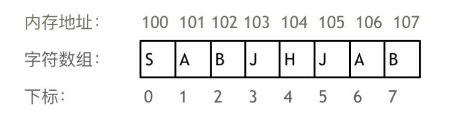
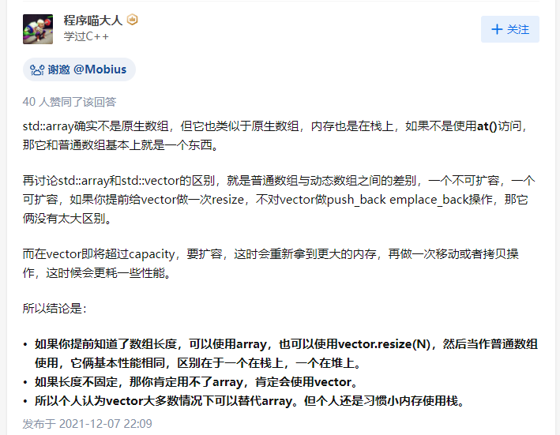
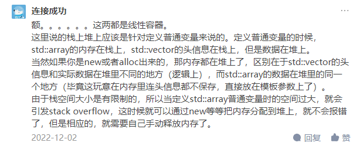
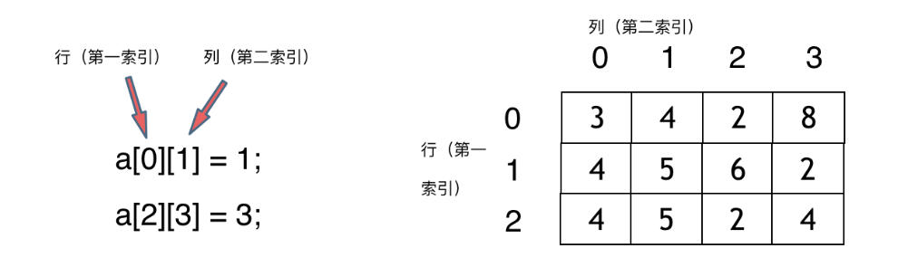
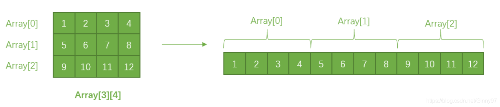
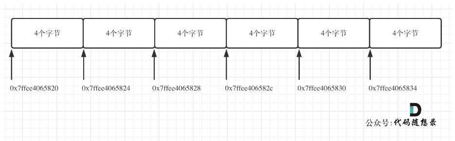

# cpp_data_structure 

* 代码随想录 https://programmercarl.com/

* 一个有非常简明例子的cpp网站：https://en.cppreference.com/w/

--------------------------------------------------------------------------------
> **大家不必太在意leetcode上执行用时，打败多少多少用户，这个就是一个玩具，非常不准确。**
> 
> 做题的时候自己能分析出来时间复杂度就可以了，至于leetcode上执行用时，大概看一下就行，只要达到最优的时间复杂度就可以了，
> 
> 一样的代码多提交几次可能就击败百分之百了....
--------------------------------------------------------------------------------

# 数组

--------------------------------------------------------------------------------

## 数组理论基础 ( 总结在845行 )

## Array.md

--------------------------------------------------------------------------------


> <font color="yellow">
> 
> 讲一讲，相对于传统的C风格数组，`std::vector`、`std::string`这种容器有什么优势？
>
> 为什么不用`int num[size] = {0,0,...,0};` 而用`vector<int> num(size, 0);`
>
> 为什么不用`char ch[size] = {'c','c',...,'c'};` 而用`string s(size,'c');`
> 
> </font>


> **对于C风格的数组，有一个经常要注意的**
>
> <font color="gree">在初始化时，`int`类型的数组在初始化时，必须赋值，不然会各种乱起八糟的值</font>
>
> <font color="gree">但是也不用给所有元素都赋值，只需要给第一个元素赋值，后面的元素会自动赋值为`0`</font>
>
> ```c++
> int size = 10;
> 
> int num1[size] = {0};
> for (int i = 0; i < size; i++) {
>    cout << num1[i] << ", ";
> }
> cout << endl;
> 
> int num2[size] = {1};
> for (int i = 0; i < size; i++) {
>    cout << num2[i] << ", ";
> }
> cout << endl;
> 
> int num3[size] = {1, 2, 3};
> for (int i = 0; i < size; i++) {
>    cout << num3[i] << ", ";
> }
> cout << endl;
> ```
>
> 编译并运行，结果如下
>
> ```c++
> 0, 0, 0, 0, 0, 0, 0, 0, 0, 0, 
> 1, 0, 0, 0, 0, 0, 0, 0, 0, 0, 
> 1, 2, 3, 0, 0, 0, 0, 0, 0, 0,
> ```
>
> <font color="gree">但是别的类型数组没有自动赋值的功能</font>
>
> <font color="gree">以字符数组为例</font>
>
> ```c++
> char size = 10;
> 
> char ch1[size] = {'a'};
> for (int i = 0; i < size; i++) {
>    cout << ch1[i] << ", ";
> }
> cout << endl;
> 
> char ch2[size] = {'b'};
> for (int i = 0; i < size; i++) {
>    cout << ch2[i] << ", ";
> }
> cout << endl;
> 
> char ch3[size] = {'a', 'b', 'c'};
> for (int i = 0; i < size; i++) {
>    cout << ch3[i] << ", ";
> }
> cout << endl;
> ```
>
> 编译并运行，结果如下
>
> ```c++
> a, , , , , , , , , , 
> b, , , , , , , , , , 
> a, b, c, , , , , , , , 
> ```
>
> <font color="yellow">所以，对于C风格的数组，没有统一的初始化的简单方式，总不能一个个赋初始值吧</font>
>
> <font color="yellow">如果我们用`std::vector`、`std::string`，都是有很方便的初始化函数</font>
>
> 例如
> 
> ```c++
> vector<T> v(n,val); //v中包含n个重复元素，每个元素的值都是val  
> 
> string s(n,'c'); // 将 s 初始化为字符 ‘c’ 的 n 个副本
> 
> ```
>
> <font color="yellow">当然容器还有更多的好操作，都是很方便我们使用的</font>
>
> 


--------------------------------------------------------------------------------

### （一维）数组

* 什么是数组(array)？

  > 数组(array)：存放在连续内存空间上的相同类型数据的集合。
  <div align=center>
  
  </div>

* 数组怎么实现？
  
  三种实现方式
  1. > 原始数组（C++内置）        [ ]<br>
     > STL容器（STL container）  std::array<br>
     > STL容器（STL container）  std::vector<br>

  2. > 声明和定义的方式不同
     >> declaration<br>
     ```c++ 
     type array_name[array_size];  // array[]静态，长度固定，所以一般要声明长度。
     std::array<type, array_size> array_name; // std::array静态，长度固定，所以一般要声明长度。
     std::vector<type> array_name;  // std::vector动态，长度不固定，灵活。
     ```
     >> initialization<br>
     ```c++ 
     type arrayname[arraysize] = {values};
     std::array<type, array_size> array_name={values};
     std::vector<type>array name={values};
     ```

  3. > 例子  
     ```c++ 
     #include <iostream> // 这个库中定义了命名空间td
     using namespace std; // 将命名空间std中的所有内容展开到全局中，很多关键词前面就不用加std::了。例如不用std::array<int, 3> a; 可以array<int, 3> a;

     #include <array>
     #include <vector>

     int arr_1[2] = {1, 2};   // 原始数组（C++内置）

     array<int, 2> arr_2 = {3, 4}; // 也可以 array<int, 2> arr_2{3, 4};

     vector<int> arr_3 = {5, 6};   // 也可以 vector<int> arr_3{5, 6};
     ```

  4. > 使用STL容器(container)的注意点<br>
     > 定义容器对象时，初始给一个个元素赋值, 要用列表{ }<br>      
     ```c++
     /* 
     定义STL容器(container)的对象时，大括号{}不能换成括号()。
     因为std::arrary、std::vector都是类模板。如果使用()，就是调用构造函数。
     而这两个STL的类模板中，其构造函数的定义，没有任何一个构造函数的形参表能够对应上。
     只有 缺省构造函数、包含重复元素的构造函数。
     */
     // std::array的类模板定义大致如下：
     // array.h
     template <class T>  
     class array
     {
        public:
        array();                  // 默认初始化,为空。
        array(int n, T val);      // 包含n个重复元素，每个元素的值都是val。
        array(const array &obj);  // 拷贝构造函数
        ~array();                 // 析构函数
        .....
     }

     template <class T>
     array<T>::array()
     {
        ......
     }

     template <class T>
     array<T>::array(int n, T val)
     {
        ......
     }   

     template <class T>
     array<T>::array(const array &obj)
     {
        ......
     }

     template <class T>
     array<T>::~array()            
     {
        ......
     }

     ```
  5. > 实际上，STL container容器都是类模板。<br>
     > 下面的语句，本质上就是实例化类模板。<br>
     ```c++ 
     #include <array>
     array<type, array_size> array_name;
     #include <vector>
     vector<type> array_name;
     ```


* 数组(array)的三种实现方式在英文上怎么说？
  1. > []<br>
     > 英文：“array”、“classic array []”、“raw arrays”。
  2. > std::array<br> 
     > 英文：“std::array”、“std::array container”
  3. > std::vector<br>
     > 英文：“std::vector”、“std::vector container”、“vector”

* 容器的英文怎么说？"container" ， "STL container"


* 三种实现方式有什么区别？（简要介绍）
  1. > []<br> 
     > C++内置数组，长度无法改变。
  2. > std::array<br>
     > 静态容器，长度无法改变。相比于 C++内置数组，有更多的类型检查和更多操作。
  3. > std::vector<br>
     > 动态容器，可以在运行时动态增加或减少容器的大小。


* 三种实现方式有什么联系？（简要介绍） 

  1. > 都可以通过下标（或索引）来访问和修改，下标（或索引）从0开始。

  2. > 其实，std::array 和 std::vector 的底层存储结构, 均使用原始数组array[]。


* Difference between array and std::array in C++？（内置array和std::array有什么区别呢？）
  1. > 是否能够拷贝、赋值？
     >> * array[]<br> 
     >> 不允许拷贝和赋值------不能将数组的内容拷贝给其他数组作为初始值，也不能用数组为其他数组赋值。
      ```c++ 
      int a[] = {1, 2, 3};    
      int a2[] = a;            // 错误
      a2 = a;                  // 错误
      ```
      ```c++
      // 还有一种特殊的情况：字符数组。当用字符串字面值去初始化数组时，要注意字符串字面值的后面还有一个空字符。也就是说，数组的大小要等于字面值的大小加1。
      ```
     >> * std::array<br>
     >> 允许拷贝和赋值。在使用上，它比普通数组更安全，且效率并没有因此变差。
      ```c++ 
      #include <array>
      array<int, 3> a{1, 2, 3};  
      array<int, 3> a2 = a;    // 正确
      a2 = a;                  // 正确
      ```
  2. > 声明和定义的方式不同
     >> declaration<br>
     ```c++ 
     type array_name[array_size];
     std::array<type, array_size> array_name;
     ```
     >> initialization<br>
     ```c++ 
     type arrayname[arraysize] = {values};
     std::array<type, array_size> array_name={values};
     ```

  3. > std::array 在 array[] 的基础上进行了升级，优点为：
     >> * size()：<br>
       提供了API来获取数组的大小。
     >> * 越界检查（编译时、运行时）：<br>
       std::array通过 get<> 和 at() 提供接口。原始数组array[]不检查越界。
     >> * 遵循值语义（value semantics）：<br>
       std::array可以传递给函数并从函数返回，而不会像 array[] 那样衰减为指针。<br> 
       然而，要在 std::array 下获取raw pointer，可以使用 std::array 提供的 data()。
      ```
      ```
  4. > 编译的内部细节 https://medium.com/@garg.aasma.08/std-array-vs-541960cc8cd0
     >> * 相比 array[] 使用 std::array 创建数组不会增加运行时成本 <br>
     >> * 两种数据类型都没有开销大小的区别。 sizeof() 为两者返回相同数量的字节。
     >> * 尽管存在与模板实例化相关的编译工作，这可能会导致更大的目标代码，但在编译器优化的速度和内存方面最终不会产生成本。 std::array 是高效的，最好用来代替 array[]。
      ```c++ 
      #include <array>
      array<int, 2> arr = {1,2};  // 或者 array<int, 2> arr{1,2};
      cout << "sizeof(arr) = " << sizeof(arr) << endl;
      // 输出：sizeof(arr) = 8

      int classicArray[2] = {1,2};
      cout << "sizeof(classicArray) = " << sizeof(classicArray) << endl;
      // 输出：sizeof(classicArray) = 8
      ```


* Difference between std::array and std::vector in C++？（std::array和std::vector有什么区别呢？）
  1. > 分配元素的区域不同
     >> std::array<br>
     >> 静态STL容器，长度无法改变。用于创建固定大小的数组，其大小在编译时已知。<br>
     >> 在栈（stack）或全局静态存储区（global static storage）上分配元素。<br>
     >><br>
     >> std::vector<br>
     >> 动态STL容器，长度可以改变。用于创建可变大小的数组。<br>
     >> 在堆（heap）上分配元素。<br>
    
  2. > 声明和定义的方式不同
     >> declaration<br>
     ```c++ 
     std::array<type, array_size> array_name;
     std::vector<type> array_name;
     ```
     >> initialization<br>
     ```c++ 
     std::array<type, array_size> array_name = {values};
     std::vector<type>array name = {values};
     ```
    
  3. > 访问效率不同。计算访问效率能的方式如下
     >> std::array
     ```c++ 
     #include <iostream>   
     using namespace std; 

     #include <chrono>
     #include <thread>
     using namespace chrono;
     
     #include <array> 
     #include <vector> 

     int main()
     {
         long long n;
         cout << "设置访问次数(尽量大，例如1000000000):";
         cin >> n;

         cout << " std::array ";
         array<int, 2> arr_1 = {1,2}; 
         // cout << " std::vector ";    
         // vector<int> arr_2 = {1,2}; 
    
         milliseconds start_time = duration_cast<milliseconds >(
             system_clock::now().time_since_epoch()
         );

         for (long long i=0; i<n; i++){
             arr_1[1];
             // arr_2[1];
         }

         milliseconds end_time = duration_cast<milliseconds >(
             system_clock::now().time_since_epoch()
         );
    
         cout << " 访问 " << n << " 次，";
         cout << " 耗时: " << milliseconds(end_time).count() - milliseconds(start_time).count()
            <<" ms"<< endl;

         return 0;
     }
     ```


     >> std::vector
     ```c++ 
     #include <iostream>   
     using namespace std; 

     #include <chrono>
     #include <thread>
     using namespace chrono;

     #include <array> 
     #include <vector> 

     int main()
     {
         long long n;
         cout << "设置访问次数(尽量大，例如1000000000):";
         cin >> n;

         // cout << " std::array ";
         // array<int, 2> arr_1 = {1,2}; 
         cout << " std::vector ";    
         vector<int> arr_2 = {1,2}; 
    
         milliseconds start_time = duration_cast<milliseconds >(
             system_clock::now().time_since_epoch()
         );

         for (long long i=0; i<n; i++){
             // arr_1[1];
             arr_2[1];
         }

         milliseconds end_time = duration_cast<milliseconds >(
             system_clock::now().time_since_epoch()
         );
    
         cout << " 访问 " << n << " 次，";
         cout << " 耗时: " << milliseconds(end_time).count() - milliseconds(start_time).count()
            <<" ms"<< endl;

         return 0;
     }
     ```

     >运行结果如下。仅看访问效率，std::vector 比 std::array 快了一倍。
     >> std::array
     ```c++
     设置访问次数(尽量大，例如1000000000):1000000000
     std::array  访问 1000000000 次， 耗时: 5676 ms
     ```
     >> std::vector
     ```c++
     设置访问次数(尽量大，例如1000000000):1000000000
     std::vector  访问 1000000000 次， 耗时: 2585 ms
     ```
     > 我的测量结果与一个博客的相反<br>
     > https://www.tutorialspoint.com/difference-between-std-vector-and-std-array-in-cplusplus<br>
     > “Array is memory efficient data structure. <br>
     > Vector takes more time in accessing elements.”<br>

     > 按理说栈比堆访问更快, 但是测试结果却显示vector访问更快。<br>
     > 看来是空间换时间了, 大部分牛逼的算法都是空间换时间。<br>
     > 没到内存上限的话，还是时间更重要一些。

     > 一般，说std::vector效率低，指的是当向vector中添加新元素的时候，内存空间不够，需要重新申请更大的空间，由于vector是连续内存空间的，因此其申请更多空间的时候，可能整个位置发生改变，需要将原来空间里的数据拷贝过去。拷贝过程比较花时间？
     > 并不意味着std::vector访问的效率低？


* 总结  
   > 知乎
   > 链接：https://www.zhihu.com/question/475070301/answer/2047112285?utm_id=0
     <div align=center>
     
     </div>  

   > 评论区
     <div align=center>
     
     </div>  


### 二维数组

* 什么是二维数组(array)？

  > 直接上图，大家应该就知道怎么回事了
  <div align=center>
  
  </div>
  
  > 实际上我们定义的二维数组在内存中仍然像是一维数组那样连续存储的。可以想象为把一个矩阵一层层伸展铺平。
  <div align=center>
  
  </div>  


* 二维数组在内存的空间地址是连续的么？
  > 不同编程语言的内存管理是不一样的:<br>
  > C++中, 二维数组是连续分布的<br>
  > Java中, 二维数组并不是连续分布的<br>
  >> C++测试代码如下：(Java测试代码也在代码随想录的教程中)<br>
  >> https://programmercarl.com/  数组理论基础
  ```c++
    int array[2][3] = {
        {0, 1, 2},
        {3, 4, 5}
    };
    cout << &array[0][0] << " " << &array[0][1] << " " 
         << &array[0][2] << endl;
    cout << &array[1][0] << " " << &array[1][1] << " " 
         << &array[1][2] << endl;
  ```
  >> 运行结果如下。
  ```c++
  0x7ffee4065820 0x7ffee4065824 0x7ffee4065828
  0x7ffee406582c 0x7ffee4065830 0x7ffee4065834
  ```
  >> 注意地址为16进制，可以看出二维数组地址是连续一条线的。<br>
  >> 0x7ffee4065820 与 0x7ffee4065824 差了一个4，即4个字节，因为这是int型数组，所以相邻元素地址差4个字节。<br>
  >> 0x7ffee4065828 与 0x7ffee406582c 也是差了4个字节，在16进制里8 + 4 = c，c就是12。
  <br>
  <div align=center>
  
  </div>


* 二维数组怎么实现？三种实现方式

  1. > 原始数组（C++内置）        [ ]<br>
     > STL容器（STL container）  std::array<br>
     > STL容器（STL container）  std::vector<br>

  2. > 声明和定义的方式不同
     >> declaration<br>
     ```c++ 
     type array_name[size_1][size_2]; 

     // 对于二维数组，std::array容器与普通数组的声明不同，行数和列数的声明顺序相反
     array<array<type, size_2>, size_1> array_name; 
     vector<vector<type>> array_name;  
     ```
     >> initialization<br>
     ```c++ 
     type arrayname[size_2][size_1] = { {}, {}, {},...,{} };
     
     // 使用容器std::array和std::ector进行 二维数组 初始化时，要多加一组大括号{}
     // 对于二维数组，std::array容器与普通数组的声明不同，行数和列数的声明顺序相反
     array<array<type, size_2>, size_1> array_name = { { {}, {}, {},...,{} } };
     vector<vector<type>> array_name = { { {}, {}, {},...,{} } };
     ```

  3. > 例子  
     ```c++ 
     #include <iostream> 
     using namespace std; 

     #include <array>
     #include <vector>
     
     int array[2][3] = { {1, 2, 3}, {4, 5, 6} };  //定长

     // 使用容器std::array和std::ector进行 二维数组 初始化时，要多加一组大括号{}
     // 对于二维数组，std::array容器与普通数组的声明不同，行数和列数的声明顺序相反

     array<array<int, 3>, 2> arr_2 = { { {1, 2, 3}, {4, 5, 6} } };   //定长
     // 也可以 array<array<int, 3>, 2> arr_2{ { {1, 2, 3}, {4, 5, 6} } };

     vector<vector<int>> arr_3 = { { {1, 2, 3}, {4, 5, 6} } };;     //不定长
     // 也可以 vector<vector<int>> arr_3{ { {1, 2, 3}, {4, 5, 6} } };    

     ```

  4. > 注意
     ```c++   
     // 注意：二维数组必须写明列数，行数可以不写明！
     int array[][3] = { {1, 2, 3}, {4, 5, 6} };
     // 但是如果想要不定下来长度，那不如就用vector好了
     ```
     ```c++
     // 以下具有相同效果，只是第一种更清晰
     int array_1[2][3] = { {1, 2, 3}, {4, 5, 6} };  
     int array_2[2][3] = {1, 2, 3, 4, 5, 6};         
     ```

   5. > 创建包含重复元素的数组
      ```c++     
      // 构造函数 template <class T>  array<T>::array(int n, T val)  // 包含n个重复元素，值都是val

      // 创建包含重复元素的一维数组。
      cout << "创建包含重复元素的一维数组:" << endl;
      vector<int> arr1(5, 10);   // 包含5个重复元素，值都是10
      for (size_t i=0; i < arr1.size(); i++){
          cout << arr1[i] << ", ";
      } 
      cout << endl;
     
      // 创建包含重复元素的二维数组。
      cout << "创建包含重复元素的二维数组:" << endl;
      vector<vector<int>> arr2(2, vector<int>(3, 20));
      for (size_t i=0; i < arr2.size(); i++)
      {
          for (size_t j=0; j < arr2[i].size(); j++)
          {
             cout << arr2[i][j] << ", ";
          }
          cout << endl;
      }
      ```
      > 运行结果
      ```c++
      创建包含重复元素的一维数组:
      10, 10, 10, 10, 10, 
      创建包含重复元素的二维数组:
      20, 20, 20, 
      20, 20, 20
      ```


### 访问数组元素（一维、二维）

> 注意点：
> **迭代器iterator类型 end()指向的是尾部位置的下一个位置，end()-1才是指向尾部位置，所以以!= v.end()作为遍历的终止条件**

* 原始数组（C++内置） [ ]<br>

  > * 一维数组遍历
  ```c++
  int arr[6] = { 1, 2, 3, 4, 5, 6 };
  
  cout << "一维数组遍历（array[]定义 arr, arr[i]访问）" << endl;
  for (size_t i = 0; i < 6; i++) {
      cout << arr[i]<<", " ;
	}
	cout << endl;
  ```

  > *  二维数组遍历
  ```c++
  int arr[2][3] = { {1, 2, 3}, {4, 5, 6} };

  // 循环遍历二维数组中的每个元素的程序通常使用嵌套循环
  cout << "二维数组遍历（array[][]定义 arr, arr[i][j]访问）" << endl;
  for (size_t i = 0; i < 2; i++) //输出2行
  {
		cout << "第" << i << "行"<<" ";
		for (size_t j = 0; j < 3; j++) //输出3列
		{
			cout << arr[i][j]<<"," ;
		}
		cout << endl;
	}
  ```


* STL容器（STL container）  std::array<br>

  > * 一维数组遍历  方法1<br>
  > 使用[ ]
  ```c++
  array<int, 6> arr = {1, 2, 3, 4, 5, 6};
  
  // size()是std::array的成员函数，可以获得数组的大小
  cout << "一维数组遍历（std::array定义 arr, arr[i]访问）" << endl;
  for (size_t i = 0; i < arr.size(); i++ ){
      cout << arr[i] << ",";
  }
  cout << endl;
  ```

  > * 一维数组遍历  方法2<br> 
  > 使用at()方法。会进行越界检查。如果产生越界，那么抛出异常out_of_range
  ```c++
  array<int, 6> arr = {1, 2, 3, 4, 5, 6}; 

  // 使用at()方法。会进行越界检查。如果产生越界，那么抛出异常out_of_range
  cout << "一维数组遍历（std::array定义 arr, arr.at(i)访问, 越界检查）" << endl;
  for (size_t i = 0; i < arr.size(); i++ ){
      cout << arr.at(i) << ",";
  }
  cout << endl;
  ```

  > * 一维数组遍历  方法3<br> 
  > 使用迭代器
  ```c++
  array<int, 6> arr = {1, 2, 3, 4, 5, 6};

  // 迭代器，本身类似指针，STL 提供的一种容器元素操作方法
  // 返回指向起始的迭代器，iterator 迭代器可读写，const_iterator 迭代器可读
  cout << "一维数组遍历（std::array定义 arr, 迭代器iterator访问，可读写）" << endl;
  array<int, arr.size()>::iterator it_1; // array<int, 6>::iterator it;
  // end()指向的是尾部位置的下一个位置，end()-1指向尾部位置，所以以!= v.end()作为控制条件
  for (it_1 = arr.begin(); it_1 != arr.end(); it_1++ ){
      cout << *it_1 << ",";
  }
  cout << endl;

  // const_iterator 迭代器只可读
  cout << "一维数组遍历（std::array定义 arr, 迭代器const_iterator访问, 只可读）" << endl;
  array<int, arr.size()>::const_iterator it_2;
  for (it_2 = arr.begin(); it_2 != arr.end(); it_2++ ){
      cout << *it_2 << ",";
  }
  cout << endl;

  // 迭代器定义时，可使用 auto 简化
  cout << "一维数组遍历（std::array定义 arr, 迭代器用auto简化定义）" << endl;
  auto it_3 = arr.begin();  // 疑问：自动判断为iterator，还是const_iterator？？？
  for (; it_3 != arr.end(); it_3++ ){
      cout << *it_3 << ",";
  }
  cout << endl;
  ```


  > *  二维数组遍历  方法1<br>
  > 使用[ ]  
  ```c++
  // 使用容器std::array和std::ector进行 二维数组 初始化时，要多加一组大括号{}
  // 对于二维数组，std::array容器与普通数组的声明不同，行数和列数的声明顺序相反
  array<array<int, 3>, 2> arr = { { {1, 2, 3}, {4, 5, 6} } };

  cout << "二维数组遍历（std::array<std::array>定义 arr, arr[i][j]访问）" << endl;
  for (size_t i = 0; i < arr.size(); i++)
  {
     cout << "第" << i << "行： ";
     for (size_t j = 0; j < arr[i].size(); j++)
     {
         cout << arr[i][j] << ",";
     }
     cout << endl;
  }
  ```


  > *  二维数组遍历  方法2<br> 
  > 使用at()方法。会进行越界检查。如果产生越界，那么抛出异常out_of_range
  ```c++
  array<array<int, 3>, 2> arr = { { {1, 2, 3}, {4, 5, 6} } };

  // 使用at()方法。会进行越界检查。如果产生越界，那么抛出异常out_of_range
  cout << "二维数组遍历（std::array<std::array>定义 arr, arr.at(i).at(j) 访问, 越界检查）" << endl;
  for (size_t i = 0; i < arr.size(); i++)
  {
     cout << "第" << i << "行： ";
     for (size_t j = 0; j < arr[i].size(); j++)
     {
         cout << arr.at(i).at(j)  << ",";
     }
     cout << endl;
  }
  ```


  > *  二维数组遍历  方法3<br> 
  > 使用迭代器
  ```c++
  array<array<int, 3>, 2> arr = { { {1, 2, 3}, {4, 5, 6} } };

  // 迭代器类似指针
  // iterator 迭代器可读写
  cout << "二维数组遍历（std::array<std::array>定义 arr, 迭代器iterator访问，可读写）" << endl;
  array<array<int, 3>, 2>::iterator it_row_1;
  array<int, 3>::iterator it_column_1;
  // end()指向的是尾部位置的下一个位置，end()-1指向尾部位置，所以以!= v.end()作为控制条件
  for (it_row_1 = arr.begin(); it_row_1 != arr.end(); it_row_1++)    // 返回指向起始的迭代器，
  {
     for (it_column_1 = (*it_row_1).begin(); it_column_1 != (*it_row_1).end(); it_column_1++)
     {
         cout << *it_column_1  << ",";
     }
     cout << endl;
  }


  // const_iterator 迭代器只可读
  cout << "二维数组遍历（std::array<std::array>定义 arr, 迭代器const_iterator访问，只可读）" << endl;
  array<array<int, 3>, 2>::const_iterator it_row_2;
  array<int, 3>::const_iterator it_column_2;
  for (it_row_2 = arr.begin(); it_row_2 != arr.end(); it_row_2++)    
  {
     for (it_column_2 = (*it_row_2).begin(); it_column_2 != (*it_row_2).end(); it_column_2++)
     {
         cout << *it_column_2  << ",";
     }
     cout << endl;
  }


  // 迭代器定义时，可使用 auto 简化
  cout << "二维数组遍历（std::array<std::array>定义 arr, 迭代器用auto简化定义）" << endl;
  auto it_row_3 = arr.begin();                // 疑问：自动判断为iterator，还是const_iterator？？？
  for (; it_row_3 != arr.end(); it_row_3++)    
  {
     auto it_column_3 = (*it_row_3).begin();  // 疑问：自动判断为iterator，还是const_iterator？？？
     for (; it_column_3 != (*it_row_3).end(); it_column_3++)
     {
         cout << *it_column_3  << ",";
     }
     cout << endl;
  }
  ```


* STL容器（STL container）  std::vector<br>
  > 非常好的博客：https://blog.csdn.net/weixin_42245449/article/details/106909406

  > * 一维数组遍历  方法1<br>
  > 使用[ ]
  ```c++
  vector<int> vec = {1, 2, 3, 4, 5, 6};
  
  // size()是std::vector的成员函数，可以获得数组的大小
  cout << "一维数组遍历（std::vector定义 vec, vec[i]访问）" << endl;
  for (size_t i = 0; i < vec.size(); i++ ){
      cout << vec[i] << ",";
  }
  cout << endl;
  ```

  > * 一维数组遍历  方法2<br> 
  > 使用at()方法。会进行越界检查。如果产生越界，那么抛出异常out_of_range
  ```c++
  vector<int> vec = {1, 2, 3, 4, 5, 6}; 

  // 使用at()方法。会进行越界检查。如果产生越界，那么抛出异常out_of_range
  cout << "一维数组遍历（std::vector定义 vec, vec.at(i)访问, 越界检查）" << endl;
  for (size_t i = 0; i < vec.size(); i++ ){
      cout << vec.at(i) << ",";
  }
  cout << endl;
  ```

  > * 一维数组遍历  方法3<br> 
  > 使用迭代器
  ```c++
  vector<int> vec = {1, 2, 3, 4, 5, 6};

  // 迭代器，本身类似指针
  // iterator 迭代器可读写
  cout << "一维数组遍历（std::vector定义 vec, 迭代器iterator访问，可读写）" << endl;
  vector<int>::iterator it_1; 
  // end()指向的是尾部位置的下一个位置，end()-1指向尾部位置，所以以!= v.end()作为控制条件
  for (it_1 = vec.begin(); it_1 != vec.end(); it_1++ ){
      cout << *it_1 << ",";
  }
  cout << endl;

  // const_iterator 迭代器只可读
  cout << "一维数组遍历（std::vector定义 vec, 迭代器const_iterator访问, 只可读）" << endl;
  vector<int>::const_iterator it_2;
  for (it_2 = vec.begin(); it_2 != vec.end(); it_2++ ){
      cout << *it_2 << ",";
  }
  cout << endl;

  // 迭代器定义时，可使用 auto 简化
  cout << "一维数组遍历（std::vector定义 vec, 迭代器用auto简化定义）" << endl;
  auto it_3 = vec.begin();  // 疑问：自动判断为iterator，还是const_iterator？？？
  for (; it_3 != vec.end(); it_3++ ){
      cout << *it_3 << ",";
  }
  cout << endl;
  ```


  > *  二维数组遍历  方法1<br>
  > 使用[ ]  
  ```c++
  // 使用容器std::array和std::ector进行 二维数组 初始化时，要多加一组大括号{}
  vector<vector<int>> vec = { { {1, 2, 3}, {4, 5, 6} } };

  cout << "二维数组遍历（std::vector<std::vector>定义 vec, vec[i][j]访问）" << endl;
  for (size_t i = 0; i < vec.size(); i++)
  {
     cout << "第" << i << "行： ";
     for (size_t j = 0; j < vec[i].size(); j++)
     {
         cout << vec[i][j] << ",";
     }
     cout << endl;
  }
  ```


  > *  二维数组遍历  方法2<br> 
  > 使用at()方法。会进行越界检查。如果产生越界，那么抛出异常out_of_range
  ```c++
  vector<vector<int>> vec = { { {1, 2, 3}, {4, 5, 6} } };

  // 使用at()方法。会进行越界检查。如果产生越界，那么抛出异常out_of_range
  cout << "二维数组遍历（std::vector<std::vector>定义 vec, vec.at(i).at(j) 访问, 越界检查）" << endl;
  for (size_t i = 0; i < vec.size(); i++)
  {
     cout << "第" << i << "行： ";
     for (size_t j = 0; j < vec[i].size(); j++)
     {
         cout << vec.at(i).at(j)  << ",";
     }
     cout << endl;
  }
  ```


  > *  二维数组遍历  方法3<br> 
  > 使用迭代器
  ```c++
  vector<vector<int>> vec = { { {1, 2, 3}, {4, 5, 6} } };

  // 迭代器类似指针
  // iterator 迭代器可读写
  cout << "二维数组遍历（std::vector<std::vector>定义 vec, 迭代器iterator访问，可读写）" << endl;
  vector<vector<int>>::iterator it_row_1;
  vector<int>::iterator it_column_1;
  // end()指向的是尾部位置的下一个位置，end()-1指向尾部位置，所以以!= v.end()作为控制条件
  for (it_row_1 = vec.begin(); it_row_1 != vec.end(); it_row_1++)    // 返回指向起始的迭代器，
  {
     for (it_column_1 = (*it_row_1).begin(); it_column_1 != (*it_row_1).end(); it_column_1++)
     {
         cout << *it_column_1  << ",";
     }
     cout << endl;
  }


  // const_iterator 迭代器只可读
  cout << "二维数组遍历（std::vector<std::vector>定义 vec, 迭代器const_iterator访问，只可读）" << endl;
  vector<vector<int>>::const_iterator it_row_2;
  vector<int>::const_iterator it_column_2;
  for (it_row_2 = vec.begin(); it_row_2 != vec.end(); it_row_2++)    
  {
     for (it_column_2 = (*it_row_2).begin(); it_column_2 != (*it_row_2).end(); it_column_2++)
     {
         cout << *it_column_2  << ",";
     }
     cout << endl;
  }


  // 迭代器定义时，可使用 auto 简化
  cout << "二维数组遍历（std::vector<std::vector>定义 vec, 迭代器用auto简化定义）" << endl;
  auto it_row_3 = vec.begin();                // 疑问：自动判断为iterator，还是const_iterator？？？
  for (; it_row_3 != vec.end(); it_row_3++)    
  {
     auto it_column_3 = (*it_row_3).begin();  // 疑问：自动判断为iterator，还是const_iterator？？？
     for (; it_column_3 != (*it_row_3).end(); it_column_3++)
     {
         cout << *it_column_3  << ",";
     }
     cout << endl;
  }
  ```


--------------------------------------------------------------------------------

## 总结

* std::vector和std::array的用法都一致，只是定义时有区别：<br>
  std::array需要给定行数、列数；std::vector不用给定。

* 一维数组的声明和定义
     > declaration<br>
     ```c++ 
     type array_name[array_size];  
     std::array<type, array_size> array_name; 
     std::vector<type> array_name;  
     ```
     > initialization<br>
     ```c++ 
     type arrayname[arraysize] = {values};
     std::array<type, array_size> array_name={values};
     std::vector<type>array name={values};
     ```
     > Example :<br>
     ```c++ 
     int arr_1[2] = {1, 2};   
     array<int, 2> arr_2 = {3, 4}; 
     vector<int> arr_3 = {5, 6}; 
     ```
* 二维数组的声明和定义
     > declaration<br>
     ```c++ 
     type array_name[size_1][size_2]; 
     array<array<type, size_2>, size_1> array_name;       // 注意行数和列数的声明顺序
     vector<vector<type>> array_name;   
     ```
     > initialization<br>
     ```c++ 
     type arrayname[size_2][size_1] = { {}, {}, {},...,{} };
     // 使用容器std::array和std::ector进行 二维数组 初始化时，要多加一组大括号{}
     array<array<type, size_2>, size_1> array_name = { { {}, {}, {},...,{} } };      
     vector<vector<type>> array_name = { { {}, {}, {},...,{} } };
     ```
     > Example :<br>
     ```c++ 
     int array[2][3] = { {1, 2, 3}, {4, 5, 6} };  
     array<array<int, 3>, 2> arr_2 = { { {1, 2, 3}, {4, 5, 6} } };   
     vector<vector<int>> arr_3 = { { {1, 2, 3}, {4, 5, 6} } };;       
     ```

* 一维数组访问方式

     ```c++ 
     int num[6] = { 1, 2, 3, 4, 5, 6 }; 
     array<int, 6> arr = {1, 2, 3, 4, 5, 6};
     vector<int> vec = {1, 2, 3, 4, 5, 6};
     ``` 
     > 访问方式
     ```c++     
     // 1 使用[ ]
     cout << num[i];
     cout << arr[i];
     cout << vec[i];
     // 2 at()方法
     cout << arr.at(i);
     cout << vec.at(i);
     // 3 使用迭代器
     array<int, 6>::iterator it_arr = arr.begin()+i;  //迭代器指向第i个位置
     cout << *it_arr;      // 相当于cout << *(arr.begin()+i)     

     vector<int>::iterator it_vec = vec.begin()+i;  //迭代器指向第i个位置
     cout << *it_vec;      // 相当于cout << *(vec.begin()+i)
     ```    


* 二维数组访问方式
    > 访问方式
     ```c++ 
     int num[2][3] = { {1, 2, 3}, {4, 5, 6} };
     array<array<int, 3>, 2> arr = { { {1, 2, 3}, {4, 5, 6} } };
     vector<vector<int>> vec = { { {1, 2, 3}, {4, 5, 6} } };
     ``` 
     > 访问方式1 使用[ ]
     ```c++     
     // 1 使用[ ]
     cout << num[i][j];  
     cout << arr[i][j];    
     cout << vec[i][j]; 
     // 2 at()方法
     arr.at(i).at(j);
     vec.at(i).at(j);
     // 3 使用迭代器
     array<array<int, 3>, 2>::iterator it_arr_row = arr.begin()+i;   // 行迭代器
     array<int, 3>::iterator it_arr_col = *(it_arr_row).begin()+j; // 列迭代器
     cout << *it_arr_col; // 

     vector<vector<int>>::iterator it_vec_row = vec.begin()+i;   // 行迭代器
     vector<int>::iterator it_vec_col = *(it_vec_row).begin()+j; // 列迭代器
     cout << *it_vec_col; // 
     ```   

> 注意点：
> **迭代器iterator类型 end()指向的是尾部位置的下一个位置，end()-1才是指向尾部位置，所以以!= v.end()作为遍历的终止条件**

* 一维数组遍历（只需要看std::array、std::vector。普通数组较为简单,不用看）
     > std::array  
     ```c++ 
     array<int, 6> arr = {1, 2, 3, 4, 5, 6};
     ```    
     ```c++     
     // 1 使用[ ]
     for (size_t i = 0; i < arr.size(); i++ ){
         cout << arr[i] << ",";
     }
     cout << endl;
     // 2 at()方法
     for (size_t i = 0; i < arr.size(); i++ ){
         cout << arr.at(i)  << ",";
     }
     cout << endl;

     // 3 iterator 迭代器, 可读写
     // end()指向的是尾部位置的下一个位置，end()-1指向尾部位置，所以以!= v.end()作为控制条件
     array<int, arr.size()>::iterator it_arr; 
     for (it_arr = arr.begin(); it_arr != arr.end(); it_arr ++) {
         cout << *it_arr << ",";
     }
     cout << endl;

     // 4 const_iterator 迭代器, 只可读
     array<int, arr.size()>::const_iterator it_arr; 
     for (it_arr = arr.begin(); it_arr != arr.end(); it_arr ++) { 
         cout << *it_arr << ",";
     }
     cout << endl;

     // 5 auto 自动判断迭代器
     auto it_arr = arr.begin();  // auto 必须初始化
     for (; it_arr != arr.end(); it_arr ++) {
         cout << *it_arr << ",";
     }  
     cout << endl;   
     ```    

     > std::vector
     ```c++ 
     vector<int> vec = {1, 2, 3, 4, 5, 6};
     ```  
     ```c++     
     // 1 使用[ ]
     for (size_t i = 0; i < vec.size(); i++) {
         cout << vec[i] << ",";
     }
     cout << endl;
     // 2 at()方法
     for (size_t i = 0; i < vec.size(); i++) {
         cout << vec.at(i)  << ",";
     }
     cout << endl;

     // 3 iterator 迭代器, 可读写
     // end()指向的是尾部位置的下一个位置，end()-1指向尾部位置，所以以!= v.end()作为控制条件
     vector<int>::iterator it_vec; 
     for (it_vec = vec.begin(); it_vec != vec.end(); it_vec ++) {
         cout << *it_vec << ",";
     }
     cout << endl;

     // 4 const_iterator 迭代器, 只可读
     vector<int>::const_iterator it_vec; 
     for (it_vec = vec.begin(); it_vec != vec.end(); it_vec ++) {
         cout << *it_vec << ",";
     }
     cout << endl;

     // 5 auto 自动判断迭代器
     auto it_vec = vec.begin();  // auto 必须初始化
     for (; it_vec != vec.end(); it_vec ++) {
         cout << *it_vec << ",";
     }     
     cout << endl;
     ``` 


* 二维数组遍历（只需要看std::array、std::vector。普通数组较为简单）

     > std::array  
     ```c++ 
     array<array<int, 3>, 2> arr = { { {1, 2, 3}, {4, 5, 6} } };
     ```   
     ```c++     
     // 1 使用[ ]
      for (size_t i = 0; i < arr.size(); i++)
      {
         for (size_t j = 0; j < arr[i].size(); j++)
         {
            cout << arr[i][j] << ",";
         }
         cout << endl;
      }

     // 2 at()方法
      for (size_t i = 0; i < arr.size(); i++)
      {
         for (size_t j = 0; j < arr[i].size(); j++)
         {
            cout << arr.at(i).at(j) << ",";
         }
         cout << endl;
      }     

     // 3 iterator 迭代器, 可读写
     // end()指向的是尾部位置的下一个位置，end()-1指向尾部位置，所以以!= v.end()作为控制条件
     array<array<int, 3>, 2>::iterator it_arr_row;
     array<int, 3>::iterator it_arr_col;
     for (it_arr_row = arr.begin(); it_arr_row != arr.end(); it_arr_row ++)
     {
         for (it_arr_col = (*it_arr_row).begin(); it_arr_col != (*it_arr_row).end(); it_arr_col ++)
         {
            cout << *it_arr_col << ",";
         }
         cout << endl;
     }

     // 4 const_iterator 迭代器, 只可读
     array<array<int, 3>, 2>::const_iterator it_arr_row;
     array<int, 3>::const_iterator it_arr_col;
     for (it_arr_row = arr.begin(); it_arr_row != arr.end(); it_arr_row ++)
     {
         for (it_arr_col = (*it_arr_row).begin(); it_arr_col != (*it_arr_row).end(); it_arr_col ++)
         {
            cout << *it_arr_col << ",";
         }
         cout << endl;
     }

     // 5 auto 自动判断迭代器
     // 疑问：自动判断为iterator，还是const_iterator？？？
     auto it_arr_row = arr.begin();
     for (; it_arr_row != arr.end(); it_arr_row ++)
     {
         auto it_arr_col = (*it_arr_row).begin();
         for (; it_arr_col != (*it_arr_row).end(); it_arr_col ++)
         {
            cout << *it_arr_col << ",";
         }
         cout << endl;
     }
     ```    

     > std::vector 
     ```c++ 
     vector<vector<int>> vec = { { {1, 2, 3}, {4, 5, 6} } };
     ```   
     ```c++     
     // 1 使用[ ]
      for (size_t i = 0; i < vec.size(); i++)
      {
         for (size_t j = 0; j < vec[i].size(); j++)
         {
            cout << vec[i][j] << ",";
         }
         cout << endl;
      }

     // 2 at()方法
      for (size_t i = 0; i < vec.size(); i++)
      {
         for (size_t j = 0; j < vec[i].size(); j++)
         {
            cout << vec.at(i).at(j) << ",";
         }
         cout << endl;
      }     

     // 3 iterator 迭代器, 可读写
     // end()指向的是尾部位置的下一个位置，end()-1指向尾部位置，所以以!= v.end()作为控制条件
     vector<vector<int>>::iterator it_vec_row;
     vector<int>::iterator it_vec_col;
     for (it_vec_row = vec.begin(); it_vec_row != vec.end(); it_vec_row ++)
     {
         for (it_vec_col = (*it_vec_row).begin(); it_vec_col != (*it_vec_row).end(); it_vec_col ++)
         {
            cout << *it_vec_col << ",";
         }
         cout << endl;
     }

     // 4 const_iterator 迭代器, 只可读
     vector<vector<int>>::const_iterator it_vec_row;
     vector<int>::const_iterator it_vec_col;
     for (it_vec_row = vec.begin(); it_vec_row != vec.end(); it_vec_row ++)
     {
         for (it_vec_col = (*it_vec_row).begin(); it_vec_col != (*it_vec_row).end(); it_vec_col ++)
         {
            cout << *it_vec_col << ",";
         }
         cout << endl;
     }

     // 5 auto 自动判断迭代器
     // 疑问：自动判断为iterator，还是const_iterator？？？
     auto it_vec_row = vec.begin();
     for (; it_vec_row != vec.end(); it_vec_row ++)
     {
         auto it_vec_col = (*it_vec_row).begin();
         for (; it_vec_col != (*it_vec_row).end(); it_vec_col ++)
         {
            cout << *it_vec_col << ",";
         }
         cout << endl;
     } 
     ```  


--------------------------------------------------------------------------------

## 接下来看../_2_0_STL_container/STL_stdvector.md

* 以后都用std::vector来实现数组结构


