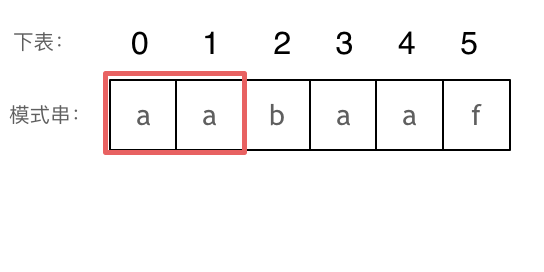

# cpp_data_structure 

* 代码随想录 https://programmercarl.com/

* 一个有非常简明例子的cpp网站：https://en.cppreference.com/w/

--------------------------------------------------------------------------------
> **大家不必太在意leetcode上执行用时，打败多少多少用户，这个就是一个玩具，非常不准确。**
> 
> 做题的时候自己能分析出来时间复杂度就可以了，至于leetcode上执行用时，大概看一下就行，只要达到最优的时间复杂度就可以了，
> 
> 一样的代码多提交几次可能就击败百分之百了....
--------------------------------------------------------------------------------

# 字符串

--------------------------------------------------------------------------------

## KMP 字符串匹配

## KMP.md

## _6_find_the_index_of_the_first_occurrence_in_a_string.md

## _7_repeated_substring_pattern.md

--------------------------------------------------------------------------------

> https://programmercarl.com/0028.%E5%AE%9E%E7%8E%B0strStr.html

>
> 以下文字如果看不进去，可以看我的B站视频：
>
> * 帮你把`KMP`算法学个通透！B站（理论篇）(`https://www.bilibili.com/video/BV1PD4y1o7nd/`)
> * 帮你把`KMP`算法学个通透！（`https://www.bilibili.com/video/BV1M5411j7Xx/`）
>
> `KMP`的经典思想就是:**当出现字符串不匹配时，可以记录一部分之前已经匹配的文本内容，利用这些信息避免从头再去做匹配**。
>
> 
> <font color="gree">
> 
> 本篇将以如下顺序来讲解`KMP`，
>
> * 什么是`KMP`
> * `KMP`有什么用
> * 什么是前缀表
> * 为什么一定要用前缀表
> * 如何计算前缀表
> * 前缀表与`next`数组
> * 使用`next`数组来匹配
> * 时间复杂度分析
> * 构造`next`数组
> * 使用`next`数组来做匹配
> * 前缀表统一减一 `C++`代码实现
> * 前缀表（不减一）`C++`实现
> * 总结
>
> </font>
> 
> <font color="yellow">读完本篇可以顺便把leetcode上28.实现strStr()题目做了。</font>
> (`_6_find_the_index_of_the_first_occurrence_in_a_string.md`)
>
> 


### 什么是KMP

> 
> 说到`KMP`，先说一下`KMP`这个名字是怎么来的，为什么叫做`KMP`呢。
> 
> 因为是由这三位学者发明的：`Knuth`，`Morris`和`Pratt`，所以取了三位学者名字的首字母。所以叫做`KMP`
>
> 


### KMP有什么用

> 
> <font color="yellow">
> 
> `KMP`主要应用在字符串匹配上。
>
> `KMP`的主要思想是**当出现字符串不匹配时，可以知道一部分之前已经匹配的文本内容，可以利用这些信息避免从头再去做匹配了**。
>
> 所以如何记录已经匹配的文本内容，是`KMP`的重点，也是`next`数组肩负的重任。
> 
> 其实`KMP`的代码不好理解，一些同学甚至直接把`KMP`代码的模板背下来。
> 
> 没有彻底搞懂，懵懵懂懂就把代码背下来太容易忘了。
> 
> 不仅面试的时候可能写不出来，如果面试官问：`next`数组里的数字表示的是什么，为什么这么表示？
> 
> 估计大多数候选人都是懵逼的。
> 
> 下面`Carl`就带大家把`KMP`的精髓，`next`数组弄清楚。
> 
> </font>
>
> 
> 


### 什么是前缀表

>
> 写过`KMP`的同学，一定都写过`next`数组，那么这个`next`数组究竟是个啥呢？
>
> `next`数组就是一个**前缀表**（`prefix table`）。
>
> 前缀表有什么作用呢？
>
> **前缀表是用来回退的，它记录了模式串与主串(文本串)不匹配的时候，模式串应该从哪里开始重新匹配。**
>
> 为了清楚地了解前缀表的来历，我们来举一个例子：
>
> 要在文本串：`aabaabaafa` 中查找是否出现过一个模式串：`aabaaf`。
> 
> 请记住文本串和模式串的作用，对于理解下文很重要，要不然容易看懵。所以说三遍：
> 
> 要在文本串：`aabaabaafa` 中查找是否出现过一个模式串：`aabaaf`。
> 
> 要在文本串：`aabaabaafa` 中查找是否出现过一个模式串：`aabaaf`。
> 
> 要在文本串：`aabaabaafa` 中查找是否出现过一个模式串：`aabaaf`。
> 
> 
> 如动画所示：
>
> <div align=center>
> 
> </div>
>
> 动画里，我特意把 `子串aa` 标记上了，这是有原因的，大家先注意一下，后面还会说到。
>
> 可以看出，文本串中第六个字符`b` 和 模式串的第六个字符`f`，不匹配了。如果暴力匹配，发现不匹配，此时就要从头匹配了。
> 
> 但如果使用前缀表，就不会从头匹配，而是从上次已经匹配的内容开始匹配，找到了模式串中第三个字符`b`继续开始匹配。
>
> <font color="yellow">
> 
> 此时就要问了**前缀表是如何记录的呢？**
> 
> 首先要知道前缀表的任务是当前位置匹配失败，找到之前已经匹配上的位置，再重新匹配，此也意味着在某个字符失配时，前缀表会告诉你下一步匹配中，模式串应该跳到哪个位置。
>
> 那么什么是前缀表：**记录下标`i`之前（包括i）的字符串中，有多大长度的相同前缀后缀**。
>
> </font>
>
> 


### 最长公共前后缀？ 最长相等前后缀！（公共指的是长度相同）

>
> 文章中字符串的前缀和后缀是什么？
> 
> **前缀是指 "不包含最后一个字符" 的所有 "以第一个字符开头"   的 "连续子串"**。
> 例如，`abcde`中的前缀，包括`abcd`、`abc`、`ab`、`a`
> 
> **后缀是指 "不包含第一个字符"   的所有 "以最后一个字符结尾" 的 "连续子串"**。
>
> 例如，`abcde`中的后缀，包括`bcde`、`cde`、`de`、`e`
> 
> 
> **正确理解什么是前缀什么是后缀很重要!**
> 
> 那么网上清一色都说 “`kmp` 最长公共前后缀” 又是什么回事呢？
>
> 我查了一遍 `算法导论` 和 `算法4里KMP的章节`，都没有提到 “最长公共前后缀”这个词，也不知道从哪里来了，我理解是用“最长相等前后缀” 更准确一些。
>
> **因为前缀表要求的就是相同前后缀的长度。** (例如，`aabaa`的最长相等前后缀就是`aa`。即`aa-b-aa`)
>
> 而最长公共前后缀里面的“公共”，更像是说前缀和后缀公共的长度。这其实并不是前缀表所需要的。
> 
> 所以字符串`a`的最长相等前后缀为`0`。 字符串`aa`的最长相等前后缀为`1`。 字符串`aaa`的最长相等前后缀为`2`（这里前缀`aa`和后缀`aa`有重叠）。 等等.....。
>
> 
>
> 


### 为什么一定要用前缀表

>
> 这就是前缀表，那为啥就能告诉我们 上次匹配的位置，并跳过去呢？
>
> 回顾一下，刚刚匹配的过程在下标`5`的地方遇到不匹配，模式串是指向`f`，如图：
>
> <div align=center>
> 
> </div>
>
> 然后就找到了下标`2`，指向`b`，继续匹配：如图：
>
> <div align=center>
> 
> </div>
>
> 以下这句话，对于理解为什么使用前缀表可以告诉我们匹配失败之后跳到哪里重新匹配 非常重要！
>
> **下标`5`之前这部分的字符串（也就是字符串`aabaa`）的最长相等的 前缀 和 后缀 字符串是 子字符串`aa` ，因为找到了最长相等的前缀和后缀，匹配失败的位置是后缀子串的后面，那么我们找到与其相同的前缀的后面重新匹配就可以了**。
>
> 所以前缀表具有告诉我们当前位置匹配失败，跳到之前已经匹配过的地方的能力。
>
> **很多介绍`KMP`的文章或者视频并没有把为什么要用前缀表？这个问题说清楚，而是直接默认使用前缀表。**
> 
> 


### 如何计算前缀表

>
> 接下来就要说一说怎么计算前缀表。
>
> 如图：
>
> <div align=center>
> 
> </div>
>
> 长度为前`1`个字符的子串`a`，最长相同前后缀的长度为`0`。（<font color="yellow"> 注意: 字符串的前缀是指不包含最后一个字符的所有以第一个字符开头的连续子串；后缀是指不包含第一个字符的所有以最后一个字符结尾的连续子串。</font>）
>
> <div align=center>
> 
> </div>
>
> 长度为前`2`个字符的子串`aa`，最长相同前后缀的长度为`1`。
>
> <div align=center>
> 
> </div>
>
> 长度为前`3`个字符的子串`aab`，最长相同前后缀的长度为`0`。
>
> 以此类推： 长度为前`4`个字符的子串`aaba`，最长相同前后缀的长度为`1`。 长度为前`5`个字符的子串`aabaa`，最长相同前后缀的长度为`2`。 长度为前`6`个字符的子串`aabaaf`，最长相同前后缀的长度为`0`。
> 
> 那么把求得的最长相同前后缀的长度就是对应前缀表的元素，如图：
>
> <div align=center>
> 
> </div>
> 
> 可以看出模式串与前缀表对应位置的数字表示的就是：**下标`i`之前（包括`i`）的字符串中，有多大长度的相同前缀后缀**。
> 
> 再来看一下如何利用 前缀表找到 当字符不匹配的时候应该指针应该移动的位置。如动画所示：
>
> <div align=center>
> 
> </div>
>
> <font color="gree">
>
> 找到的不匹配的位置， 那么此时我们要看它的前一个字符的前缀表的数值是多少。
> 
> 为什么要前一个字符的前缀表的数值呢，因为要找前面字符串的最长相同的前缀和后缀。
> 
> 所以要看前一位的 前缀表的数值。
> 
> 前一个字符的前缀表的数值是2， 所以把下标移动到下标2的位置继续比配。 可以再反复看一下上面的动画。
> 
> 最后就在文本串中找到了和模式串匹配的子串了。
> 
> </font>
>
> 
> 


### 前缀表与`next`数组

>
> 很多`KMP`算法的时间都是使用`next`数组来做回退操作，那么`next`数组与前缀表有什么关系呢？
>
> `next`数组就可以是前缀表，但是很多实现都是把前缀表统一减一（右移一位，初始位置为-1）之后作为`next`数组。
> 
> 为什么这么做呢，其实也是很多文章视频没有解释清楚的地方。
>
> 其实**这并不涉及到KMP的原理，而是具体实现，`next`数组既可以就是前缀表，也可以是前缀表统一减一（右移一位，初始位置为`-1`）**。
>
> 后面我会提供两种不同的实现代码，大家就明白了。
>
> 


### 使用`next`数组来匹配

>
> **以下我们以前缀表统一减一之后的`next`数组来做演示**。
>
> 有了`next`数组，就可以根据`next`数组来 匹配文本串`s`，和模式串`t`了。
>
> 注意`next`数组是新前缀表（旧前缀表统一减一了）。
>
> 匹配过程动画如下：
>
> <div align=center>
> 
> </div>
>
> 
> 


### 时间复杂度分析

>
> 其中`n`为文本串长度，`m`为模式串长度，因为在匹配的过程中，根据前缀表不断调整匹配的位置，可以看出匹配的过程是`O(n)`，之前还要单独生成`next`数组，时间复杂度是`O(m)`。所以整个`KMP`算法的时间复杂度是`O(n+m)`的。
>
> 暴力的解法显而易见是`O(n × m)`，所以`KMP`在字符串匹配中极大地提高了搜索的效率。
>
> <font color="gree">为了和力扣题目28.实现strStr(`_6_find_the_index_of_the_first_occurrence_in_a_string.md`)保持一致，方便大家理解，以下文章统称`haystack`为文本串, `needle`为模式串。</font>
>
> 都知道使用`KMP`算法，一定要构造`next`数组。
>
> 


### 构造`next`数组

> 
> 我们定义一个函数`getNext`来构建`next`数组，函数参数为指向`next`数组的指针，和一个字符串。 代码如下：
> 
> ```c++
> void getNext(int* next, const string& s)
> ``` 
>
> **构造`next`数组其实就是计算模式串`s`，前缀表的过程**。 主要有如下三步：
> 
> 1. 初始化
> 2. 处理前后缀不相同的情况
> 3. 处理前后缀相同的情况
> 
> 接下来我们详解一下。
>
> **1.初始化：**
> > 
> > 定义两个指针`i`和`j`，`j`指向前缀末尾位置(即前缀的长度)，`i`指向后缀末尾位置。
> > 
> >  然后还要对`next`数组进行初始化赋值，如下：
> > 
> > ```c++
> > int j = -1;
> > next[0] = j;
> > ``` 
> > 
> > `j` 为什么要初始化为 `-1` 呢，因为之前说过 前缀表要统一减一的操作仅仅是其中的一种实现，我们这里选择j初始化为 `-1` ，下文我还会给出 `j` 不初始化为 `-1` 的实现代码。
> > 
> > <font color="yellow">`next[i]` 表示 `i`（包括`i`）之前最长相等的前后缀长度（其实就是`j`）</font>
> >  
> > <font color="yellow">所以初始化`next[0] = j` 。</font>
> > 
> 
> **2.处理前后缀不相同的情况**
> > 
> > 因为`j`初始化为`-1`，那么`i`就从`1`开始，进行`s[i]` 与 `s[j+1]`的比较。
> > ( 如果`j`初始化为`0`，那么`i`就从`1`开始，进行`s[i]` 与 `s[j]`的比较 )
> > 
> > 所以遍历模式串`s`的循环下标 `i` 要从 `1` 开始，代码如下：
> > 
> > ```c++
> > for (int i = 1; i < s.size(); i++) {
> > ```
> > 
> > 如果 `s[i]` 与 `s[j+1]`不相同，也就是遇到 前后缀末尾不相同的情况，就要向前回退。
> > 
> > 怎么回退呢？
> > 
> > `next[j]`就是记录着`j`（包括`j`）之前的子串的相同前后缀的长度。
> > 
> > 那么 `s[i]` 与 `s[j+1]` 不相同，就要找 `j+1` 前一个元素在`next`数组里的值（就是`next[j]`）。
> > 
> > 所以，处理前后缀不相同的情况代码如下：
> > 
> > ```c++
> > while (j >= 0 && s[i] != s[j + 1]) { // 前后缀不相同了
> >     j = next[j]; // 向前回退
> > }
> > ```
> > 
> > 我的理解：
> > > 
> > > 上面的`j >= 0`是因为`j = -1` 已经考虑过了
> > > 
> > > `next[j]` 存储的是`j`（包括`j`）之前最长相等的前后缀长度, 也就是将j更新为最长相等的前缀末尾位置
> > > 
> > 
>
> ***3.处理前后缀相同的情况***
> > 
> > 如果 `s[i]` 与 `s[j + 1]` 相同，那么就同时向后移动 `i` 和 `j`, 说明找到了相同的前后缀，同时还要将`j`（前缀的长度）赋给`next[i]`, 因为`next[i]`要记录相同前后缀的长度。
> > 
> > 代码如下：
> > 
> > ```c++
> > if (s[i] == s[j + 1]) { // 找到相同的前后缀
> >     j++;
> > }
> > next[i] = j;
> > ```
> > 
>
> 最后整体构建`next`数组的函数代码如下：
>
> ```c++
> void getNext(int* next, const string& s){
>     int j = -1;
>     next[0] = j;
>     for(int i = 1; i < s.size(); i++) { // 注意i从1开始
>         while (j >= 0 && s[i] != s[j + 1]) { // 前后缀不相同了
>             j = next[j]; // 向前回退
>         }
>         if (s[i] == s[j + 1]) { // 找到相同的前后缀
>             j++;
>         }
>         next[i] = j; // 将j（前缀的长度）赋给next[i]
>     }
> }
> ```
> 
> 代码构造`next`数组的逻辑流程动画如下：
>
> <div align=center>
> 
> </div>
>
> 得到了`next`数组之后，就要用这个来做匹配了。
>
> 
> 


### 使用`next`数组来做匹配

>
> 在文本串`s`里 找是否出现过模式串`t`。
>
> 定义两个下标: `j` 指向模式串起始位置，`i`指向文本串起始位置。
> 
> 那么`j`初始值依然为`-1`，为什么呢？ 依然因为`next`数组里记录的起始位置为`-1`。
>
> `i`就从`0`开始，遍历文本串，代码如下：
>
> ```c++
> for (int i = 0; i < s.size(); i++) 
> ```
>
> 接下来就是 `s[i]` 与 `t[j + 1]` （因为`j`从`-1`开始的） 进行比较。
>
> 如果 `s[i]` 与 `t[j + 1]` 不相同，`j`就要从`next`数组里寻找下一个匹配的位置。
>
> 代码如下：
>
> ```c++
> // 我们此时已经生成了next数组，已有模式串t对应位置的最长相等前后缀长度值
> while(j >= 0 && s[i] != t[j + 1]) {
>     j = next[j];
> }
> ```
> 
> 如果 `s[i]` 与 `t[j + 1]` 相同，那么 `i` 和 `j` 同时向后移动， 代码如下：
> 
> ```c++
> if (s[i] == t[j + 1]) {
>     j++; // i的增加在for循环里
> }
> ```
> 
> 如何判断在文本串`s`里出现了模式串`t`呢，如果`j`指向了模式串`t`的末尾，那么就说明模式串`t`完全匹配文本串`s`里的某个子串了。
> 
> 本题要在文本串字符串中找出模式串出现的第一个位置 (从`0`开始)，所以返回当前在文本串匹配模式串的位置 `i` 减去 `模式串的长度`，就是文本串字符串中出现模式串的第一个位置。
> 
> 代码如下：
>
> ```c++
> if (j == (t.size() - 1) ) {
>     return (i - t.size() + 1);
> }
> ```
> 
> 那么使用`next`数组，用模式串匹配文本串的整体代码如下：
> 
> ```c++
> int j = -1; // 因为next数组里记录的起始位置为-1
> for (int i = 0; i < s.size(); i++) { // 注意i就从0开始
>     while(j >= 0 && s[i] != t[j + 1]) { // 不匹配
>         j = next[j]; // j 寻找之前匹配的位置
>     }
>     if (s[i] == t[j + 1]) { // 匹配，j和i同时向后移动
>         j++; // i的增加在for循环里
>     }
>     if (j == (t.size() - 1) ) { // 文本串s里出现了模式串t
>         return (i - t.size() + 1);
>     }
> }
> ```
> 
> 此时所有逻辑的代码都已经写出来了，力扣 28.实现strStr 题目(`_6_find_the_index_of_the_first_occurrence_in_a_string.md`)的整体代码如下：
>
> 
> 


### 前缀表统一减一 C++代码实现

```c++
class Solution {
public:
    void getNext(int* next, const string& s) {
        int j = -1;
        next[0] = j;
        for(int i = 1; i < s.size(); i++) { // 注意i从1开始
            while (j >= 0 && s[i] != s[j + 1]) { // 前后缀不相同了
                j = next[j]; // 向前回退
            }
            if (s[i] == s[j + 1]) { // 找到相同的前后缀
                j++;
            }
            next[i] = j; // 将j（前缀的长度）赋给next[i]
        }
    }

    int strStr(string haystack, string needle) {
        if (needle.size() == 0) {
            return 0;
        }

        int next[needle.size()]; // 创建next数组，长度为t.size()
        getNext(next, needle);   // 构造next数组

        int j = -1; // // 因为next数组里记录的起始位置为-1
        for (int i = 0; i < haystack.size(); i++) { // 注意i就从0开始
            while(j >= 0 && haystack[i] != needle[j + 1]) { // 不匹配
                j = next[j]; // j 寻找之前匹配的位置
            }
            if (haystack[i] == needle[j + 1]) { // 匹配，j和i同时向后移动
                j++; // i的增加在for循环里
            }
            if (j == (needle.size() - 1) ) { // 文本串s里出现了模式串t
                return (i - needle.size() + 1);
            }
        }

        return -1;
    }
};
```
> 时间复杂度: `O(n + m)`
> 空间复杂度: `O(m)`, 只需要保存字符串`needle`的前缀表


### 前缀表（不减一）C++实现 我喜欢这个，更容易理解

> 
> 那么前缀表就不减一了，也不右移的，到底行不行呢？
> 
> **行！**
> 
> 我之前说过，这仅仅是KMP算法实现上的问题，如果就直接使用前缀表可以换一种回退方式，找 `j=next[j-1]` 来进行回退。
>
> 主要就是`j=next[x]`这一步最为关键！
> 
> 我给出的`getNext`的实现为：（前缀表统一减一）
> 
> ```c++
> void getNext(int* next, const string& s) {
>     int j = -1;
>     next[0] = j;
>     for(int i = 1; i < s.size(); i++) { // 注意i从1开始
>         while (j >= 0 && s[i] != s[j + 1]) { // 前后缀不相同了
>             j = next[j]; // 向前回退
>         }
>         if (s[i] == s[j + 1]) { // 找到相同的前后缀
>             j++;
>         }
>         next[i] = j; // 将j（前缀的长度）赋给next[i]
>     }
> }
> ```
> 
> 此时如果输入的模式串为`aabaaf`，对应的`next`为`-1 0 -1 0 1 -1`。
> 
> 这里`j`和`next[0]`初始化为`-1`，整个`next`数组是以 前缀表减一之后的效果来构建的。
>
> 那么前缀表不减一来构建`next`数组，代码如下：
> 
> ```c++
> void getNext(int* next, const string& s) {
>     int j = 0;
>     next[0] = 0;
>     for(int i = 1; i < s.size(); i++) {
>         while (j > 0 && s[i] != s[j]) { // j要保证大于0，因为下面有取j-1作为数组下标的操作
>             j = next[j - 1]; // 注意这里，是要找前一位的对应的回退位置了
>         }
>         if (s[i] == s[j]) {
>             j++;
>         }
>         next[i] = j;
>     }
> }
> ```
> 
> 此时如果输入的模式串为`aabaaf`，对应的`next`为` 0 1 0 1 2 0`，（<font color="yellow">其实这就是前缀表的数值了</font>）。
> 
> 那么用这样的`next`数组也可以用来做匹配，代码要有所改动。
> 
> 实现代码如下：
> 

```c++
class Solution {
public:
    void getNext(int* next, const string& s) {
        int j = 0;
        next[0] = 0;
        for(int i = 1; i < s.size(); i++) {
            while (j > 0 && s[i] != s[j]) {
                j = next[j - 1];
            }
            if (s[i] == s[j]) {
                j++;
            }
            next[i] = j;
        }
    }
    int strStr(string haystack, string needle) {
        if (needle.size() == 0) {
            return 0;
        }
        int next[needle.size()];
        getNext(next, needle);
        int j = 0;
        for (int i = 0; i < haystack.size(); i++) {
            while(j > 0 && haystack[i] != needle[j]) {
                j = next[j - 1];
            }
            if (haystack[i] == needle[j]) {
                j++;
            }
            if (j == needle.size() ) {
                return (i - needle.size() + 1);
            }
        }
        return -1;
    }
};
```
> 时间复杂度: `O(n + m)`
> 空间复杂度: `O(m)`
> 


### 总结

>
> 我们介绍了什么是`KMP`，`KMP`可以解决什么问题，然后分析`KMP`算法里的`next`数组，知道了`next` 数组就是前缀表，再分析为什么要是前缀表而不是什么其他表。
>
> 接着从给出的模式串中，我们一步一步的推导出了前缀表，得出前缀表无论是统一减一还是不减一得到的`next`数组仅仅是`kmp`的实现方式的不同。
> 
> 其中还分析了`KMP`算法的时间复杂度，并且和暴力方法做了对比。
> 
> 然后先用前缀表统一减一得到的`next`数组，求得文本串`s`里是否出现过模式串`t`，并给出了具体分析代码。
>
> 又给出了直接用前缀表作为`next`数组，来做匹配的实现代码。
> 
> 可以说把`KMP`的每一个细微的细节都扣了出来，毫无遮掩的展示给大家了！
>
> 


#### _6_find_the_index_of_the_first_occurrence_in_a_string.md

#### _7_repeated_substring_pattern.md


