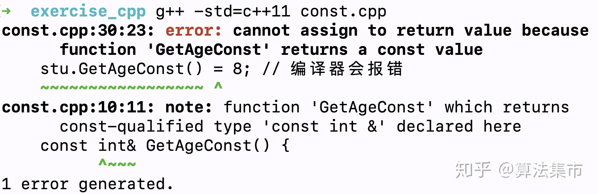
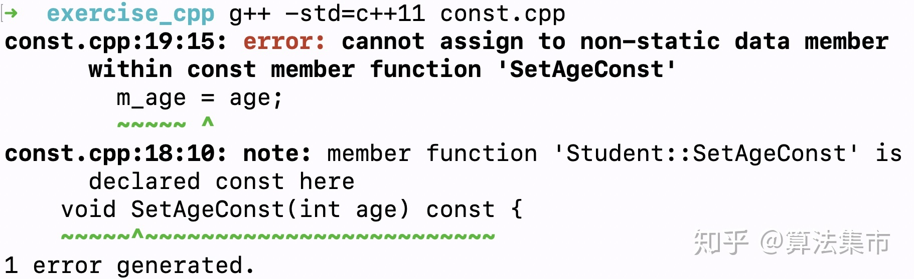

# cpp_const_static_extern_auto

>
> `const`: 
> 
> > * 声明常量；不影响生命周期，
> > 
> > * 和`static、extern`可以组合使用
>
> `static`：
> 
> > * 可以把块、函数内的变量的生命周期扩展到整个程序运行期间；
> > 
> > * 可以限制全局变量，不允许外部文件访问；
> > 
> > * `static`的变量初始化只有一次，但是有特殊情况，
> > > 见 https://blog.csdn.net/liujun3512159/article/details/126006802
> 
>
> `extern`:
> 
> > * 定义时一般暗含，例如全局变量定义、函数定义
> > 
> > * 声明时，告诉编译器，该变量或者函数是外部文件的，去别的地方找
>
> `auto`： 
> 
> > * 配合`C++ 11`的`新型for循环`使用
> > 
> > * 配合`lambda表达式`使用
> > 
> > * 定义时必须初始化，因为编译器会根据初始化的值，判断变量的类型
>
> 
> 


## static

>
> 总结来说，static关键字在C语言中用于创建静态变量、静态函数和静态全局变量，而在C++中还可以用于创建静态数据成员。这些用法都有助于控制变量和函数的作用域，并提供了一些特定的功能和限制。
> 
> 1. 静态变量（Static Variables）：当static修饰一个局部变量时，该变量将成为静态变量。静态变量在程序的整个执行过程中都存在，并且只会被初始化一次。它们在函数调用之间保持其值不变。
> 
> 
> 2. 静态函数（Static Functions）：当static修饰一个函数时，该函数将成为静态函数。静态函数只能在定义它的源文件中使用，无法被其他源文件调用。这种修饰符的主要作用是限制函数的作用域，使其只能在当前源文件中使用。
> 
> 3. 静态全局变量（Static Global Variables）：当static修饰一个全局变量时，该变量将成为静态全局变量。静态全局变量的作用域仅限于定义它的源文件，其他源文件无法访问该变量。这种修饰符的主要作用是限制全局变量的作用域，避免与其他源文件中的同名全局变量冲突。
>
> 4. 静态数据成员（Static Data Members）：在C++中，static关键字还可以用于类的数据成员。静态数据成员是类的所有对象共享的成员，它们在类的所有对象中只有一份副本。静态数据成员可以通过类名和作用域解析运算符来访问，而不需要创建类的对象。
> 
> 5. 静态成员函数（Static Member Function）：是属于类而不是类的实例的函数。它们不依赖于特定的对象，可以直接通过类名进行调用，而不需要创建对象实例。静态成员函数不能访问非静态成员变量，只能访问静态成员变量和其他静态成员函数。
> 
> 
> 
> 


### static 在类中可以修饰 成员变量 和 成员函数

>
> * 静态成员变量，无法在类中初始化，只能在类外用`::`范围解析运算符，来重新定义并初始化
>
> > ```c++
> > // box_class.cpp
> > Class Box {
> >     public:
> >         static int objectCount;
> >         ...
> > }
> > 
> > 
> > // main.cpp
> > 
> > int Box::objectCount = 0;
> > 
> > ...
> > 
> > int main() {
> > ...    
> > }
> > ```
> > 
>
> * 静态成员函数没有`this`指针，所以只能访问静态成员变量和其他静态成员函数（毕竟不需要`this`指针，用`::`就可以访问），无法访问其他成员
>
> * 普通成员函数在访问其他成员时，隐含式地使用了`this`指针，虽然没写出来，但是本质上是用了`this`的
>
> * 友元函数也没有this指针，需要在类中用`friend`关键词声明，只能访问`static`成员
>
> > https://blog.csdn.net/naibozhuan3744/article/details/94588554
> > 
> > 友元函数可以访问私有成员，但是不能直接在定义友元函数时调用私有成员，只能通过引用类对象的成员参数方式调用
> > 
> > 友元函数不是类的成员函数，不能用作用域解析运算符操作
> > 
> > 
> > 友元函数因为不是成员函数，不能被派生类继承
>
> 
> 
> 


## extern

> 
> 在C/C++中，extern关键字的作用与C语言中的作用类似，用于声明一个全局变量或函数，表示该变量或函数是在其他文件中定义的。
> 
> > extern关键字只是用于声明变量或函数，而不是定义它们。变量或函数的定义通常在其他文件中进行，而extern关键字的作用是告诉编译器该变量或函数的定义在其他地方，以便在链接阶段正确引用。
> 
> 具体来说，extern关键字有以下几种作用：
>
> 1. `声明全局变量`：当在一个文件中使用extern关键字声明一个全局变量时，表示该变量是在其他文件中定义的。这样可以在当前文件中引用其他文件中定义的全局变量，而无需重新定义它。例如：
>
> > ```c
> > extern int globalVariable; // 声明全局变量globalVariable
> > ```
> 
> 2. 声明全局函数：当在一个文件中使用extern关键字声明一个全局函数时，表示该函数是在其他文件中定义的。这样可以在当前文件中引用其他文件中定义的全局函数，而无需重新定义它。例如：
>
> > ```c
> > extern void globalFunction(); // 声明全局函数globalFunction
> > ```
> 
> 3. 解决多文件编译链接问题：在多个源文件组成的项目中，如果某个全局变量或函数需要在多个文件中使用，可以在一个文件中定义它，并在其他文件中使用extern关键字声明它。这样可以避免重复定义，同时确保所有文件都能正确引用该变量或函数。
>
> > 需要注意的有三点，
> > 
> > extern关键字只是用于声明变量或函数，而不是定义它们。变量或函数的定义通常在其他文件中进行，而extern关键字的作用是告诉编译器该变量或函数的定义在其他地方，以便在链接阶段正确引用。
> > 
> > C++中的extern关键字也可以用于声明静态数据成员，表示该静态数据成员是在其他文件中定义的。
> > 
> > 此外，C++中还可以使用extern "C"来声明C语言风格的函数，以便在C++代码中调用C语言函数。
> > 
> > 
>
> 
> 
> 


## const

>
> const关键字用于声明一个常量，表示该变量的值在程序执行期间不能被修改。
>
> > 需要注意的是，const关键字只能在变量的声明中使用，表示该变量是一个常量。一旦常量被声明并初始化，其值就不能再被修改。在函数参数中使用const关键字可以指定参数为只读，防止函数内部修改参数的值。
> 
> 具体来说，const关键字有以下几种作用：
>
> 1. 声明常量：当使用const关键字修饰一个变量时，表示该变量是一个常量，其值在初始化后不能被修改。例如：
>
> > ```c
> > const int MAX_VALUE = 100; // 声明一个常量MAX_VALUE，其值为100
> > ```
> 
> 2. 类型检查：使用const关键字可以帮助进行类型检查，防止对常量进行意外的修改。如果试图修改一个被声明为const的变量，编译器会报错。
>
> 3. 优化编译器：const关键字可以帮助编译器进行优化。由于常量的值在编译时就已经确定，编译器可以在编译过程中对常量进行优化，例如将常量直接替换为其具体的值，而不需要在运行时进行计算
>
> 4. 保护数据：通过将变量声明为const，可以防止意外的修改数据。这对于保护程序中的关键数据非常有用，确保其值不会被修改。
>
> 5. 常量表达式：在C++11及以后的版本中，const关键字还可以用于声明常量表达式。常量表达式是在编译时就可以计算出结果的表达式，可以用于数组大小、模板参数等需要在编译时确定大小的场景。
> 
> 
> 


### ChatGPT 3.5 搜索：C++ const关键词怎么用

<https://chat.openai.com/chat>

> 在 C++ 中，`const` 关键字用于指定变量或函数的只读属性，以确保在程序执行期间不会被修改 

#### 声明只读变量
* 
  > 可以使用 `const` 关键字来声明只读变量，这些变量不能被修改。声明格式为：
  > ```c++
  > const int MAX_VALUE = 100;
  > ```
  > 这里，MAX_VALUE 被声明为常量，其值在程序的运行过程中不会发生改变。
  > 

#### 函数参数中使用 const
*
  > 当将变量传递给函数时，可以使用 `const` 限定符，这样可以防止函数修改该变量的值。例如：
  > ```c++
  > void printValue(const int value){
  >     std::cout << "The value is " << value << std::endl;
  > }
  > void print(const std::string& message) {
  >     std::cout << message << std::endl;
  > }
  > ```
  > 这里，message 参数被声明为 `const`，这意味着函数不会修改该参数的值。这是一种很好的编程实践，因为它可以防止无意间修改参数的值。
  >   

#### 函数返回类型中使用 const
*
  > 可以将函数返回值指定为 `const`，这意味着函数返回的值不能被修改。例如：
  > ```c++
  > const int get_max_value() {
  >     return MAX_VALUE;
  > }
  > ```
  > 这里，函数 get_max_value() 返回一个常量值。这可以防止该函数返回的值被修改。
  >   

#### 类成员函数中使用 const
*
  > 可以在类成员函数的末尾使用 `const` 关键字，以指示该函数不会修改任何成员变量。例如：
  > ```c++
  > class MyClass
  > {
  > public:
  >     int getValue() const {
  >         return m_value;
  >     }
  > 
  > private:
  >     int m_value = 5;
  > };
  > ```
  > 这是一个简单的示例，其中 getValue() 函数声明为 const，以确保它不会修改 MyClass 类中的任何成员变量。
  > 


> 总之，使用 const 可以帮助编写更安全、更可靠的代码。


--------------------------------------------------------------------------------

### 博客：C++中const的强大用法：修饰函数参数/返回值/函数体

<https://zhuanlan.zhihu.com/p/256423512>

> 在C++中，`const` 常用于修饰常量，告诉编译器某值保持不变。需要注意的是，常量在定义之后就不能修改，因此定义时必须初始化。<br>
> ```c++
> const int HELLO = 6;  // 正确
> const int WORLD;  // 错误
> ```
> 除此之外，`const` 更强大的地方是修饰函数参数、函数返回值、函数体。<br>
> 被 `const` 修饰的东西都受到强制保护，可以防止意外改动，提高程序的健壮性。<br>
> 很多C++的书籍建议<font color="yellow"> “use const whenever you need” </font> <br>


#### 1、const 修饰函数参数
*
  > 对于函数的入参，不管是什么数据类型，也不管是 指针传递，还是 引用传递，只要加了 const 修饰，就可以防止函数内意外修改该参数，起到保护作用。
  > ```c++
  > void function(int* output, const classA& a, const classB* b) {
  >     // do something
  > }
  > ```
  > 比如上面的例子，给 a 和 b 加上const修饰后，如果函数内的语句试图修改 a 或 b，编辑器就会报出错误。
  > 

#### 2、const 修饰函数返回值
*
  > 用 const 修饰返回的指针或引用，保护指针或引用的内容不被修改。比如：
  > ```c++
  > int& GetAge()
  > const int& GetAgeConst()
  > ```
  > 两者的区别在于：前者返回的是一个左值，其引用的内容可以被修改；后者返回的是一个右值，其引用的内容不可被修改。
  > 
  > ```c++
  > class Student {
  > public:
  >     int& GetAge() {
  >         return m_age;
  >     }
  > 
  >     const int& GetAgeConst() {
  >         return m_age;
  >     }
  > 
  >     void ShowAge() {
  >         cout << "Age: " << m_age << endl;
  >     }
  > 
  > private:
  >     int m_age = 0;
  > };
  > 
  > int main()
  > {
  >     Student stu;
  >     stu.ShowAge();
  > 
  >     stu.GetAge() = 5; // 会修改成员变量的值
  >     stu.ShowAge();
  > 
  >     stu.GetAgeConst() = 8; // 编译器会报错
  >     stu.ShowAge();
  > 
  >     return 0;
  > }
  > ```
  > 编译的报错信息如下，为了安全起见，在函数的返回值加上 const，使得函数体不能作为左值。
  > <div align=center>
  > 
  > </div>


#### 3、const 修饰函数体
*
  > const 修饰函数体时，放到函数体的行尾处，表明在该函数体内，不能修改对象的数据成员，且不能调用非 const 成员函数。比如：
  > ```c++
  > void SetAge(int age)
  > void SetAgeConst(int age) const
  > ```
  > 两者的区别在于：前者可以修改类的数据成员，而后者不可以。
  > 
  > ```c++
  > class Student {
  > public:
  >     void SetAge(int age) {
  >         m_age = age;
  >     }
  > 
  >     void SetAgeConst(int age) const {
  >         m_age = age;
  >     }
  > 
  >     void ShowAge() {
  >         cout << "Age: " << m_age << endl;
  >     }
  > 
  > private:
  >     int m_age = 0;
  > };
  > 
  > int main()
  > {
  >     Student stu;
  >     stu.ShowAge();
  > 
  >     stu.SetAge(6); // 正确
  >     stu.ShowAge();
  > 
  >     stu.SetAgeConst(8); // 错误
  >     stu.ShowAge();
  > 
  >     return 0;
  > }
  > ```
  > 编译的报错信息如下：
  > <div align=center>
  > 
  > </div>


--------------------------------------------------------------------------------

### C++11中的 const常量表达式 `constexpr关键字`

> 
> 在`C++11`及以后的版本中，`const`关键字可以用于声明常量表达式。常量表达式是在编译时就可以计算出结果的表达式，可以用于需要在编译时确定大小的场景，例如数组大小、模板参数等。
> 
> 使用`const`关键字声明的常量表达式必须满足以下条件：
> 
> > 1. 常量表达式必须是一个编译时可计算的表达式，不能包含运行时的操作。
> > 
> > 2. 常量表达式的值必须在编译时就能确定，不能依赖于运行时的输入。
> > 
> > 3. 常量表达式的类型必须是可转换为整数类型的标量类型，例如整数、枚举、指针等。
> 
> 
> 在C++11中，可以使用`constexpr`关键字来声明`const常量表达式`。`constexpr`关键字用于指示编译器在编译时计算表达式的值，并将其作为常量使用。
>
> 以下是一个示例，展示了如何在C++11中使用const常量表达式：
> 
> > ```c++
> > #include <iostream>
> > 
> > constexpr int square(int x) {
> >     return x * x;
> > }
> > 
> > int main() {
> >     constexpr int num = 5;
> >     constexpr int result = square(num);
> > 
> >     std::cout << "Square of " << num << " is " << result << std::endl;
> > 
> >     return 0;
> > }
> > ```
> 
> 在上面的示例中，`square`函数被声明为`constexpr`，它接受一个整数参数并返回该参数的平方。在`main`函数中，`num`被声明为`constexpr常量`，并且`result`被初始化为`square(num)`的结果。由于`num`是一个`const常量表达式`，它的值在编译时就可以确定，因此`result`也是一个`const常量表达式`。
> 
> 请注意，C++11中的const常量表达式有一些限制，例如只能包含简单的计算和内置类型。如果表达式涉及到复杂的运算或自定义类型，可能无法在编译时确定其值。在这种情况下，可以考虑使用C++14或更高版本的特性来实现更复杂的常量表达式。
>
> 


--------------------------------------------------------------------------------

### char * 和 char []

>
> 按理说下面的两句代码是一样的
>
> ```c++
> char *p = "hello";
> 
> char a[] = "hello";
> ```
> 
> 但是实际上，这两种写法都不足以体现其本质，本质上是
>
> ```c++
> const char *p = "hello"; // char *p = "hello";
> 
> char *const a = "hello"; //char a[] = "hello";
> ```
>
> 一个是常量指针；一个是指针常量
> 
> `（指向）常量（的）指针pointers to constant`：指向的数据不可变，但是指针可以改变来指向别的地方
>
> 
> `指针常量constant pointer`：指向固定的内存位置，该位置的值可以更改
> 
> 所以，
> 
> `p指向的内容是不能修改的，但是p可以修改`
>
> `a指向的内容可以修改，但是a不可以修改`
>
> <br>
> <br>
> <br>
> 
> 
> 如果`char *s`出现在函数形参列表中，本质上是`const char *s`
>
> https://blog.csdn.net/Scofield971031/article/details/88421258
>
> 
> 
> ```c++
> int substring(char* s, char a) // 函数内，s指向的内容，只读
> 
> 最好改为
> 
> int substring(char s[], char a) // 函数内可以修改s指向的内容
> ```
>


