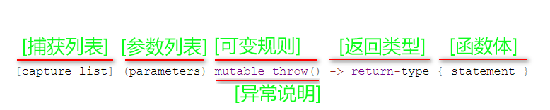

# cpp_lamdba 

<https://www.cnblogs.com/jimodetiantang/p/9016826.html>

--------------------------------------------------------------------------------

## ChatGPT 3.5 搜索：C++ lamdba表达式怎么用

<https://chat.openai.com/chat>

* Lambda简介
  > * `Lambda` 有很多叫法，有`Lambda表达式`、`Lambda函数`、`匿名函数`
  > 
  > * `Lambda` 用于`创建匿名函数对象`。
  > 
  > * `Lambda` 可以在需要函数对象的地方定义函数，通常可以替代函数指针的使用。
  > 
  > * `Lambda` 可以被用于任何接受函数指针的地方，并且可以捕获其所在作用域中的变量。
  > 
  > * `Lambda` 是在调用或作为函数参数传递的位置处定义匿名函数对象的便捷方法。
  > 
  > * 通常，`Lambda`用于`封装传递给算法或异步方法的几行代码`


* Lambda表达式的一般形式
  > ```c++
  > [capture list] (parameter list) -> return type { function body }
  > ```
  >> * capture list 捕获列表，用于捕获所在作用域中的变量；<br>
  >> *  parameter list 参数列表；<br>
  >> *  return type 返回类型；<br>
  >> *  function body 函数体。<br>


* 一个简单的Lambda表达式示例：
  > ```c++
  > #include <iostream>
  > #include <vector>
  > #include <algorithm>  // std::find_if、 std::distance
  > using namaspace std;
  > 
  > int main() {
  >     vector<int> vec = {1, 2, 3, 4, 5};
  > 
  >     // 使用Lambda表达式查找元素5
  >     auto it = find_if(vec.begin(), vec.end(), [](int i) { return i == 5; });
  > 
  >     if (it != vec.end()) {
  >         cout << "元素5的位置是：" << distance(vec.begin(), it) << endl;
  >     } else {
  >         cout << "元素5不存在" << endl; // 没找到的话，find_if返回v.end()
  >     }
  > 
  >     return 0;
  > }
  > ```
  > 输出结果为：
  > ```c++  
  > 元素5的位置是：4
  > ```
  > 示例中，
  > Lambda表达式被用于std::find_if算法中，用于查找vector中的元素5。
  > Lambda表达式的函数体使用了关键字return，表示返回i == 5的比较结果。
  > Lambda表达式可以在函数调用的地方直接定义，不需要单独的函数定义。
  > ```c++
  > /*
  > iterator findif(iterator first，iterator end，value)
  > findif函数有三个参数, 分别代表 (起点, 终点后一位, 要找的数);
  > 如果没有找到, 则返回终点后一位的地址 即v.end()
  > 如果找到了, 返回区间[first,end)中第一个值等于value的元素的地址
  > 
  > distance(iterator first，iterator last)
  > distanc函数有两个个参数, 分别代表 (迭代器1, 迭代器2);返回两个迭代器之间的距离。
  > */
  > ```
  > <br>


* 在捕获列表中，可以指定Lambda表达式所在作用域中的变量，如下所示：
  > ```c++
  > #include <iostream>
  > using namaspace std;
  > int main() {
  >     int x = 1, y = 2;
  > 
  >     // 捕获x和y
  >     auto f = [x, &y]() { return x + y; };
  > 
  >     std::cout << f() << std::endl;
  > 
  >     return 0;
  > }
  > ```
  > 输出结果为：
  > ```c++  
  > 3
  > ```
  > 示例中，<br>
  > Lambda表达式捕获了x的值，捕获y的引用。<br>
  > 因此，Lambda表达式中使用的x是一个值拷贝，y是一个引用。<br>
  > <br>

* Lambda表达式可以用于任何需要函数对象的地方，如下所示：
  > ```c++
  > #include <vector>
  > #include <algorithm> // std::sort、std::for_each
  >   
  > vector<int> v = {1, 2, 3, 4, 5};
  > 
  > // 使用Lambda表达式排序vector
  > sort(v.begin(), v.end(), [](int a, int b) { return a > b; }); 
  > // 此处lambda的返回值，编译器自动判定为bool
  > // sort只有前两个参数时，默认将[first, last)区间内元素升序排列；
  > // sort有第三个参数时，需要使用自定义函数，且该函数返回值为bool类型；
  > // 若返回true，则 num1 与 num2 交换顺序；
  > // 若返回false, 则 num1 与 num2 保持原有顺序；
  > 
  > // 使用Lambda表达式遍历vector
  > for_each(v.begin(), v.end(), [](int i) { cout << i << " "; });
  > // https://blog.csdn.net/weixin_43165135/article/details/125526408
  > 
  > 输出结果为：
  > ```c++  
  > 5 4 3 2 1
  > ```
  > 
  > `for_each`的用法： https://blog.csdn.net/weixin_43165135/article/details/125526408
  > 

--------------------------------------------------------------------------------

## 博客：C++ Lambda表达式详解

<https://blog.csdn.net/qq_37085158/article/details/124626913>


### Lambda表达式示例
*
  > ```c++
  > #include <algorithm>
  > #include <cmath>
  > 
  > void abssort(float* x, unsigned n) {
  >     std::sort(x, x + n,
  >         // Lambda expression begins
  >         [](float a, float b) {
  >             return (std::abs(a) < std::abs(b));
  >         } // end of lambda expression
  >     );
  > }
  > ```
  > 在上面的实例中, std : : sort 函数第三个参数应该是传递一个排序规则的函数，但是这个实例中直接将排序函数的实现写在应该传递函数的位置，省去了定义排序函数的过程，对于这种不需要复用，且短小的函数，直接传递函数体可以增加代码的可读性。
  > 

### Lambda表达式语法定义
* 
  > <br>
  > <div align=center>
  > 
  > </div>

  > ```c++
  > [capture list] (parameters) mutable throw() -> return type { statement }
  > ```
  >> *  <font color="yellow"> capture list 捕获列表 </font><br>
  >> 在C++规范中也称为Lambda导入器， 捕获列表总是出现在Lambda函数的开始处。实际上，[]是Lambda引出符。编译器根据该引出符判断接下来的代码是否是Lambda函数，捕获列表能够捕捉上下文中的变量以供Lambda函数使用。<br>
  >> *  <font color="yellow"> parameters 参数列表 </font><br>
  >> 与普通函数的参数列表一致。如果不需要参数传递，则可以连同括号“()”一起省略。  
  >> * <font color="yellow"> mutable 可变规则 </font><br>
  >> mutable修饰符， 默认情况下Lambda函数总是一个const函数，mutable可以取消其常量性。在使用该修饰符时，参数列表不可省略（即使参数为空）。  
  >> * <font color="yellow"> throw 异常说明 </font><br>
  >> 用于Lamdba表达式内部函数抛出异常。  
  >> * <font color="yellow"> return type 返回类型 </font><br>
  >> 追踪返回类型形式声明函数的返回类型。我们可以在不需要返回值的时候也可以连同符号”->”一起省略。<br> 此外，在返回类型明确的情况下，也可以省略该部分，让编译器对返回类型进行推导。
  >> * <font color="yellow"> statement 函数体 </font><br>
  >> 内容与普通函数一样，不过除了可以使用参数之外，还可以使用所有捕获的变量。


### Lambda表达式参数详解

#### <font color="yellow"> 1. Lambda捕获列表[ ] </font>
  >> Lambda表达式与普通函数最大的区别是，除了可以使用参数以外，Lambda函数还可以通过捕获列表访问一些上下文中的数据。<br>
  >> 具体地，`捕捉列表描述了上下文中哪些数据可以被Lambda使用，以及使用方式`（以值传递的方式或引用传递的方式）。<br>
  >> 语法上，在“[ ]”包括起来的是捕获列表，捕获列表由多个捕获项组成，并以逗号分隔。捕获列表有以下几种形式：<br>
  > * [ ]表示不捕获任何变量
  >> ```c++
  >> auto function = ([]{
  >> 		  cout << "Hello World!" << endl;
  >> 	}
  >> );
  >> 
  >> function();
  >> ```
  > * [var]表示值传递方式捕获变量var
  >> ```c++
  >> int num = 100;
  >> auto function = ([num]{
  >> 		  cout << num << endl;
  >> 	}
  >> );
  >> 
  >> function();
  >> ```
  > * [=]表示值传递方式捕获所有父作用域的变量（包括this）
  >> ```c++
  >> int index = 1;
  >> int num = 100;
  >> auto function = ([=]{
  >> 			cout << "index: "<< index << ", " 
  >>                  << "num: "<< num << endl;
  >> 	}
  >> );
  >> 
  >> function();
  >> ```
  > * [&var]表示引用传递捕捉变量var
  >> ```c++
  >> int num = 100;
  >> auto function = ([&num]{
  >> 		num = 1000;
  >> 		cout << "num: " << num << endl;
  >> 	}
  >> );
  >> 
  >> function();
  >> ```  
  > * [&]表示引用传递方式捕捉所有父作用域的变量（包括this）
  >> ```c++
  >> int index = 1;
  >> int num = 100;
  >> auto function = ([&]{
  >> 		num = 1000;
  >> 		index = 2;
  >> 		cout << "index: "<< index << ", " 
  >>              << "num: "<< num << endl;
  >> 	}
  >> );
  >> 
  >> function();
  >> ```  
  > * [this]表示值传递方式捕捉当前的this指针
  >> ```c++
  >> class Lambda
  >> {
  >>   public:
  >>         void sayHello() {
  >>              std::cout << "Hello" << std::endl;
  >>         }
  >> 
  >>         void lambda() {
  >>              auto function = [this]{ 
  >>                   this->sayHello(); 
  >>              };
  >>              function();
  >>         }
  >> };
  >>  
  >> int main()
  >> {
  >>     Lambda demo;
  >>     demo.lambda();
  >>     ...
  >> }
  >> ```  
  > * [=, &] 拷贝与引用混合
  >   * [=, &a, &b]表示以引用传递的方式捕捉变量a和b，以值传递方式捕捉其它所有变量。
  >> ```c++
  >> int test = 0;
  >> int index = 1;
  >> int num = 100;
  >> auto function = ([=, &index, &num]{  
  >> 		test = 6; // 值传递，只读，不能修改
  >> 		num = 1000;
  >> 		index = 2;
  >> 		std::cout << "index: "<< index << ", " 
  >>             << "num: "<< num << std::endl;
  >> 	}
  >> );
  >> 
  >> function();
  >> ```  
  >> 运行结果（报错）
  >> ```c++
  >> error: assignment of read-only variable ‘test’
  >> ```
  > * [&, a, this]表示以值传递的方式捕捉变量a和this，引用传递方式捕捉其它所有变量。
  > <br><br><br>
  > * 值得注意的是，捕捉列表不允许变量重复传递。下面一些例子就是典型的重复，会导致编译时期的错误。例如：
  >> ```c++
  >> [=,a] // 这里已经以值传递方式捕捉了所有变量，但是重复捕捉a了，会报错的；
  >> [&,&this] // 这里&已经以引用传递方式捕捉了所有变量，再捕捉this也是一种重复。
  >> ```  
  > * 如果Lambda主体total通过引用访问外部变量，并factor通过值访问外部变量，则以下捕获子句是等效的：
  >> ```c++
  >> [&total, factor]
  >> [factor, &total]
  >> [&, factor]
  >> [factor, &]
  >> [=, &total]
  >> [&total, =]
  >> ``` 

#### <font color="yellow"> 2. Lambda参数列表( ) </font>

  > * 除了捕获列表之外，Lambda还可以接受输入参数。参数列表是可选的，并且在大多数方面类似于函数的参数列表。
  >> ```c++
  >> auto function = [] (int first, int second){
  >>     return first + second;
  >> };
  >> 	
  >> cout << function(100, 200) << endl;
  >> ``` 

#### <font color="yellow"> 3. 可变规格mutable </font>
  > * mutable修饰符， 默认情况下Lambda函数总是一个const函数，mutable可以取消其常量性。在使用该修饰符时，参数列表不可省略（即使参数为空）。
  >> 例1：无mutable修饰符，则默认const修饰符<br>
  >> const 修饰函数体时，表明在该函数体内，不能修改捕获列表的值传递成员，即只读；引用传递不受影响，可读写
  >> ```c++
  >> int m = 0;
  >> int n = 0;
  >> auto function = [&, n] (int a) { a++; m = ++n + a; };  
  >> // 除了n采用值传递，其他都采用引用传递。
  >> // 由于默认修饰符为const，n只读。m是引用传递，不受const限制，可读写。
  >> function(4);
  >> cout << m << endl << n << endl;
  >> ``` 
  >> 编译不通过
  >> ```c++
  >> error: increment of read-only variable ‘n’
  >> ```  
  >> 例2：有mutable修饰符<br>
  >> const 修饰函数体时，表明在该函数体内，可以修改捕获列表的任何成员，可读写
  >> ```c++
  >> int m = 0;
  >> int n = 0;
  >> auto function = [&, n] (int a) mutable { a++; m = ++n + a; }; 
  >> // 除了n是值传递，其他都是引用传递
  >> // mutable“可变的”,是为了突破const的限制而设置的,所以这里n也可读写。
  >> function(4);
  >> cout << m << endl << n << endl;
  >> ``` 
  >> 编译通过，运行结果如下：
  >> ```c++
  >> 6
  >> 0
  >> ```  


#### <font color="yellow"> 4. 异常说明(不建议使用，C++11已经放弃) </font>
  > * 你可以使用 throw() 异常规范来指示 Lambda 表达式不会引发任何异常。与普通函数一样，如果 Lambda 表达式声明 C4297 异常规范且 Lambda 体引发异常，Visual C++ 编译器将生成警告 throw() 。
  >> ```c++
  >> int main() // C4297 expected 
  >> { 
  >>  	[]() throw() { throw 5; }(); 
  >> }
  >> ```
  > 在MSDN的异常规范中，明确指出<font color="yellow"> 异常规范是在C++11 中弃用的 C++ 语言功能。因此这里不建议不建议大家使用。</font>

#### <font color="yellow"> 5. 返回类型 </font>
  > * Lambda表达式的返回类型会自动推导。除非你指定了返回类型，否则不必使用关键字。
  > * 返回型类似于通常的方法或函数的返回型部分。但是，返回类型必须在参数列表之后，并且必须在返回类型->之前包含类型关键字。
  > * 如果Lambda主体仅包含一个return语句或该表达式未返回值，则可以省略Lambda表达式的return-type部分。
  > * 如果Lambda主体包含一个return语句，则编译器将从return表达式的类型中推断出return类型。否则，编译器将返回类型推导为void。
  >> ```c++
  >> #include <typeinfo>   // 查看变量类型 typeid(变量名).name()
  >> 
  >> auto x1 = [](int i) -> int { return i; };
  >> cout << "typeid(x1).name:  " << typeid(x1).name() <<"  表示x1的数据类型是???"<< endl;
  >> cout << "typeid(x1(4)).name:  " << typeid(x1(4)).name() <<"  表示函数返回值的类型为:int"<< endl;
  >> ``` 
  >> 编译通过，运行结果如下：
  >> ```c++
  >> typeid(x1).name:  Z4mainEUliE_  表示x1的数据类型是???
  >> typeid(x1(4)).name:  i  表示函数返回值的类型为:int
  >> ```  


#### <font color="yellow"> 6. Lambda函数体 </font>
  > * Lambda表达式的Lambda主体（标准语法中的复合语句）可以包含普通方法或函数的主体可以包含的任何内容。普通函数和Lambda表达式的主体都可以访问以下类型的变量：
  > * 捕获变量
  > * 形参变量
  > * 局部声明的变量
  > * 类数据成员，当在类内声明this并被捕获时
  > * 具有静态存储持续时间的任何变量，例如全局变量  
  >> ```c++
  >> int m = 0;
  >> int n = 0;
  >> auto function = [&, n] (int a) mutable { m = ++n + a; }; 
  >> function(4);
  >> cout << " m = " << m << " n = "<< n << endl;
  >> // cout << " a = " << a << endl; //  error: ‘a’ was not declared in this scope
  >> ``` 

### Lambda的优缺点
  > 优点<br>
  > * 可以直接在需要调用函数的位置定义短小精悍的函数，而不需要预先定义好函数
  > * 使用Lamdba表达式变得更加紧凑，结构层次更加明显、代码可读性更好
  > ```c++
  > std::find_if(v.begin(), v.end(), [](int& item){return item > 2});
  > ``` 

  > 缺点<br>
  > * Lamdba表达式语法比较灵活，增加了阅读代码的难度
  > * 对于函数复用无能为力


### Lambda工作原理
#### <font color="yellow"> 1. Lambda工作原理 </font>
  > * 编译器会把一个Lambda表达式生成一个匿名类的匿名对象，并在类中重载函数调用运算符，实现了一个operator()方法。
  >> ```c++
  >> auto print = []{cout << "Hello World!" << endl; };
  >> ```
  >> 编译器会把上面这一句翻译为下面的代码：
  >> ```c++  
  >> class print_class
  >> {
  >> public:
  >> 	void operator()(void) const
  >> 	{
  >> 		cout << "Hello World!" << endl;
  >> 	}
  >> };
  >> // 用构造的类创建对象，print此时就是一个函数对象
  >> auto print = print_class();
  >> ``` 
  >> 如果执行 print( ); 运行结果为 Hello World!

#### <font color="yellow"> 2. C++仿函数（与Lamdba表达式的作用一致） </font>

  > * 仿函数（functor）又称为函数对象（function object）是一个能行使函数功能的类。<font color="yellow">本质上是类 </font>。仿函数的语法几乎和我们普通的函数调用一样，不过`作为仿函数的类，都必须重载operator()运算符`，`仿函数与Lamdba表达式的作用是一致的`。举个例子：
  >> ```c++
  >> #include <string>
  >> class Functor
  >> {
  >> public:
  >>     void operator() (const string& str) const
  >>     {
  >>         cout << str << endl;
  >>     }
  >> };
  >>  
  >> int main()
  >> {
  >>     Functor myFunctor;
  >>     myFunctor("Hello world!");
  >>     return 0;
  >> }
  >> ``` 
  >> 运行结果
  >> ```c++
  >> Hello world!
  >> ``` 

### Lamdba表达式适用场景
#### <font color="yellow"> 1. Lamdba用于 STL算法库 </font>

  > * `for_each`应用实例
  >> ```c++
  >> int a[4] = {11, 2, 33, 4};
  >> sort(a, a+4, [](int x&, int& y) -> bool { return x < y; } );
  >> // 此处lambda的返回值，编译器自动判定为bool
  >> // sort只有前两个参数时，默认将[first, last)区间内元素升序排列；
  >> // sort有第三个参数时，需要使用自定义函数，且该函数返回值为bool类型；
  >> // 若返回true，则 num1 与 num2 保持原有顺序；
  >> // 若返回false, 则 num1 与 num2 交换顺序；
  >>   
  >> for_each(a, a+4, [](int& x) { cout << x << " ";} );
  >> // for_each(iterator first, iterator last, Function f)
  >> // for_each会把迭代器指向元素的值，作为参数，传给第三个参数（函数对象）
  >> // 可以替换为：
  >> // vector<int> :: iterator pr;
  >> // for(pr = v.begin(); pr != v.end(); pr++) f(*pr);
  >> ``` 
  >> 运行结果
  >> ```c++  
  >> 2 4 11 33 // lambda函数体{return x < y} 升序
  >> 33 11 4 2 // lambda函数体{return x > y} 降序
  >> 11 2 33 4 // lambda函数体{return x%10 < y%10}
  >> 2 4 33 11 // lambda函数体{return x%10 < y}  
  >> 11 2 33 4 // lambda函数体{return x < y%10}    
  >> ```
  >> 逻辑分析
  >> ```c++ 
  >> sort() 对 11, 2, 33, 4 排列时，会有两个迭代器指针；
  >> 第一次排序
  >> 前面的 ptr1 指向 11 ，后面的 ptr2 指向 2 ；
  >> 调用cmp函数时，将*ptr1赋值给第一个形参x, *ptr2赋值给第二个形参y (注意顺序)；
  >> reture x < y; 实际上是 return *ptr1 < *ptr2，返回值为false，交换顺序；
  >> 变成了2, 11, 33, 4. 所以是升序。
  >> 
  >> ```


  > * find_if应用实例 <font color="yellow">暂时不会 std : : deque、find_if() 后续再理解吧</font>
  >> ```c++
  >> int x = 5;
  >> int y = 10;
  >> deque<int> coll = { 1, 3, 19, 5, 13, 7, 11, 2, 17 };
  >> auto pos = find_if(coll.cbegin(), coll.cend(), [=](int i) {                 
  >>     return i > x && i < y;
  >> });
  >> ``` 
  >> 运行结果
  >> ```c++  
  >> 
  >> ```     
  > * remove_if应用实例
  >> ```c++
  >> #include <algorithm> 
  >> vector<int> v = {1, 2, 3, 4, 5, 6, 7, 8, 9};
  >> int x = 5;
  >> v.erase(remove_if(v.begin(), v.end(), [=](int i) { 
  >>     return i < x;}), v.end());
  >> // 显示每一个元素
  >> for_each(v.begin(), v.end(), [](int i) { 
  >>     cout << i << endl;});
  >> ``` 
  >> 运行结果
  >> ```c++  
  >> 5  
  >> 6 
  >> 7 
  >> 8 
  >> 9 
  >> ```  
  >> 分析
  >> ```c++ 
  >> remove_if(iterator first, iterator las, function f);  
  >> // 前两个参数表示迭代的起始位置和这个起始位置所对应的停止位置。
  >> // 最后一个参数：传入一个回调函数，如果回调函数返回为真，则将当前所指向的参数移到尾部。
  >> // 返回值是被移动区域的首个元素。  
  >>  
  >> v.erase(iterator first, iterator last); 
  >> //删除[first, last)范围内的所有元素。左闭右开区间
  >>   
  >> v.erase(remove_if(v.begin(), v.end(), 
  >>                 [=](int i) { return i < x;}), v.end());
  >> // remove_if先把小于5的值全部移动到尾部(5,6,7,8,9,1,2,3,4)，且返回迭代器指针指向1,
  >> // v.erase把从1到最后一个位置的元素全部删除
  >> ```

#### <font color="yellow"> 2. Lamdba用于 短小不需要复用函数的场景 </font>
  > * sort函数
  >> ```c++
  >> #include <algorithm>
  >> 
  >> int data[6] = { 3, 4, 12, 2, 1, 6 };
  >> vector<int> testdata;
  >> testdata.insert(testdata.begin(), data, data + 6);
  >> 
  >> // 降序
  >> sort(testdata.begin(), testdata.end(), [](int a, int b){ 
  >>     return a > b; });
  >>   
  >> for_each(testdata.begin(), testdata.end(), [](int i) { 
  >>     cout << i << endl;});
  >> ``` 
  >> 运行结果
  >> ```c++  
  >> 12
  >> 6
  >> 4
  >> 3
  >> 2
  >> 1 
  >> ```  

#### <font color="yellow"> 3. Lamdba用于 多线程场景 </font>
  > * https://blog.csdn.net/qq_37085158/article/details/124626913
  >> ```c++
  >> 没学，看不懂多线程
  >> 
  >> 
  >> 
  >> 
  >> 
  >> ``` 


#### <font color="yellow"> 4. Lamdba 用于 函数指针 与 std : : function </font>

  > * 
  >> ```c++
  >> #include <functional>
  >>   
  >> int x = 8, y = 9;
  >> auto add = [](int a, int b) { return a + b; };
  >> std::function<int(int, int)> Add = [=](int a, int b) { return a + b; };
  >> 
  >> cout << "add: " << add(x, y) << endl;
  >> cout << "Add: " << Add(x, y) << endl;
  >> ``` 
  >> 运行结果
  >> ```c++  
  >> add: 17
  >> Add: 17
  >> ```    


#### <font color="yellow"> 5. Lamdba 作为 函数的入参 </font>

  > * 
  >> ```c++
  >> #include <functional>
  >>   
  >> using FuncCallback = std::function<void(void)>;
  >> 
  >> void DataCallback(FuncCallback callback)
  >> {
  >> 	std::cout << "Start FuncCallback!" << std::endl;
  >> 	callback();
  >> 	std::cout << "End FuncCallback!" << std::endl;
  >> }
  >> 
  >> int main()
  >> {
  >>     auto callback_handler = [&](){
  >>          std::cout << "This is callback_handler";
  >>     };
  >>  
  >>     DataCallback(callback_handler);
  >> }
  >> ``` 
  >> 运行结果
  >> ```c++  
  >> Start FuncCallback!
  >> This is callback_handlerEnd FuncCallback!
  >> ```    

#### <font color="yellow"> 6. Lamdba 在QT中的应用 </font>

  > * 
  >> ```c++
  >> #include <QApplication>  //编译报错 fatal error: QApplication: No such file or directory
  >> #include <QWidget>
  >>   
  >> QTimer *timer=new QTimer;
  >> timer->start(1000);
  >> QObject::connect(timer, &QTimer::timeout, [&](){
  >>         qDebug() << "Lambda表达式";
  >> });
  >> ``` 
  >> ```c++
  >> int a = 10;
  >> QString str1 = "汉字博大精深";
  >> connect(pBtn4, &QPushButton::clicked, [=](bool checked){
  >> 	qDebug() << a <<str1;
  >> 	qDebug() << checked;
  >> 	qDebug() << "Hua Windows Lambda Button";
  >> });
  >> ``` 
  > <br>


