# cpp_return

--------------------------------------------------------------------------------
## 补充知识
* 
  > 两个概念:<br>
  > 常量指针：`int *const`，必须初始化，值不会改变<br>
  > 指向常量的常量指针： `const int *const` 指针始终指向一个常量对象，且指针不能被修改<br>

  > 两个操作符:<br>
  > 取地址 `&` 操作符 英文为：`reference`<br>
  > 解引用 `*` 操作符 英文为：`dereference`<br>

  > 引用和指针的底层区别：<br>
  > 引用不是定义一个新变量，而是给已存在的变量取了一个外号，编译器不会为引用变量开辟内存空间，它和它引用的变量共用同一块内存空间。<br>
  > 编译器会为指针会开辟内存空间，用于存放指针所指内容的地址。

  > 引用的注意事项：<br>
  > 引用必须初始化 `int &b =a; //正确`  `int &b; //错误`
  > 引用一旦引用了一个实体就不能再引用其他的实体. 例如，c是a的引用，那么就不能做b的引用了。
  > 一个变量可以有多个引用。例如，全名和小名。
  > 

* 引用的底层原理
  > <https://blog.csdn.net/weixin_59112191/article/details/121598709>
  > ```c++
  > int a;
  > int &b = a;
  > int *p = &a;
  > ```
  > 这里通过调试模式观看这段代码的反汇编: 
  > 
  > <div align=center>
  > 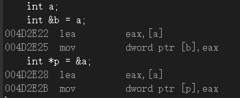
  > </div>
  > 
  > 这里的`lea`是取地址的意思。
  >   
  > 从汇编代码可以看出，在底成实现的时候，引用和指针的实现方式是一样的，所以说：
  >
  > <font color="yellow"> 引用的底层是通过指针实现的 </font> 
  >


--------------------------------------------------------------------------------
## C++ 引用的权限

<https://blog.csdn.net/weixin_59112191/article/details/121598709>

* 1.引用的权限可以缩小
  > ```c++
  > int a = 10;
  > const int &b = a;//权限的缩小
  > ```
  > 这里变量a是可读可写的，而b是a的引用，b只能对a这块内存空间进行读取，不能进行修改，这就是权限的缩小，这在C++中是可以的。
  > 

* 2.引用的权限不能放大
  > ```c++
  > const int a = 10;
  > int &b = a;          //权限不能放大
  > ```
  > 这里变量a指向的空间是只能读取的，不能进行修改，而a的引用b，是可以对a指向的这块空间进行修改的，使得权限得到了放大，这种语法在C++中是错误的。
  > 

> 总结：`引用可以进行权限的缩小，但是不能进行权限的放大`


--------------------------------------------------------------------------------
## C++ 引用经典笔试题

<https://blog.csdn.net/weixin_59112191/article/details/121598709>

* > 下图中的代码(1)和(2)是否能够正常运行？
  > ```c++
  > double d=11.1;
  > int a=d;(1)
  > int &ret=d;(2)
  > ```  
  > 答案:(1)可以运行通过，(2)不行。<br>
  > 代码(1)是普通的隐式类型转换。<br>

> 在了解代码(2)的错误原因之前，我们需要回顾一些知识：<br>

* 产生临时变量的情况
  > 1.类型转换
  > ```c++
  > double d=11.1;
  > int a=d;
  > ```  
  > d的类型是double，a的类型是int，类型不同，正如下图所示，`在发生隐式类型转换的时候，需要将d的值存到一个int类型的临时变量里，然后将这个临时变量的值赋予给a`。<br>
  > <br>  
  > <div align=center>
  > 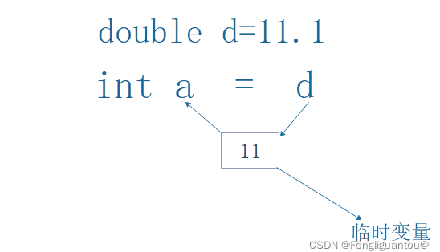
  > </div>
  > <br>

  > 2.整形提升
  > ```c++
  > int a=10;
  > char c='b';
  > if (a > c) {
  > }
  > ```  
  > 这里并不是拿c直接和a进行比较，而是将c赋值到一个int的临时变量里，通过这个临时变量去和a进行比较。<br>  

* 关于右值
  > __结论：右值是具有常性的，是不可修改的。__ <br> 
  > 这里的右值不能通过字面意思(处于式子右边的值)进行理解，以下的几种情况一般都是属于右值。<br> 
  > 1.表达式的计算结果： 如：5+3=8,这里的8就是右值。<br> 
  > 2.常量：如a=5，这里的5就是右值。<br> 
  > 3.一些隐式类型转换产生的临时变量。如int a；double d；d=a；这里隐式类型转换产生的临时变量也是一种右值。<br> 
  
> 在明白了这些基础原理以后，我们开始学习为什么代码`int &ret=d;(2)`是错误的。
* 
  > `这里引用的变量其实是一块临时空间，而临时空间是右值是不能修改的`，这种引用的方式本质上其实就是权限的放大，因此编译不能通过。  
  > <br>  
  > <div align=center>
  > 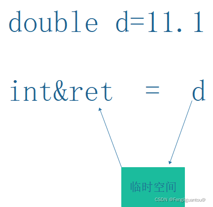
  > </div>
  > <br>


--------------------------------------------------------------------------------  
## C++函数传参类型：传值、传引用、传指针

* 1.传值
  > 下例实参传递了a，形参b对其进行了接收并修改，但是实参a最终并没有受到影响，这又是为什么呢？
  > ```c++
  > void func(int b) {
  >      b = 20;
  > }
  > int main() {
  >     int a = 10;
  >     func(a);
  >     cout << a << endl;
  >     ...
  > }
  > ```
  > 运行结果
  > ```c++
  > 10
  > ```
  > 原来，参数传值的时候，形参会生成一份实参数据的拷贝，也就是说实参和形参指向的不是同一块空间，所以形参的修改不会影响实参。<br> 
  > <br> 
  > <div align=center>
  > 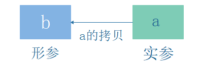
  > </div>
  > <br>


* 2.传引用
  > 下例进行了引用传参，形参的修改对实参产生了影响，我们可以大胆推测形参和实参是一块空间。
  > ```c++
  > void func(int &b) {
  >      b = 20;
  > }
  > int main() {
  >     int a = 10;
  >     func(a);
  >     cout << a << endl;
  >     ...
  > }
  > ```
  > 运行结果
  > ```c++
  > 20
  > ```
  > 原来，引用传参的时候，形参不再是实参的拷贝，而是实参的一个引用，也就是说实参和形参指向的是同一块内存空间，形参的改变会影响实参。<br> 
  > <br>
  > <div align=center>
  > 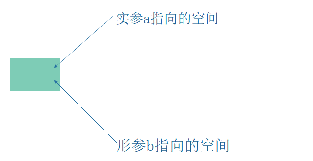
  > </div>
  > <br>  

* 3.传指针
  > 与传引用区别不大
  > ```c++
  > void func(int *b) {
  >      *b = 20;
  > }
  > int main() {
  >     int a = 10;
  >     func(&a);
  >     cout << a << endl;
  >     cout << &a << endl;
  >     ...
  > }
  > ```
  > 运行结果
  > ```c++
  > 20              // cout会自动打印指针对应的值
  > 0x7ffdde70c644
  > ```  

-------------------------------------------------------------------------------- 
## C++函数返回值类型：传值、传引用、传指针

<https://blog.csdn.net/weixin_59112191/article/details/121598709>


* 1.传值返回
  > ```c++
  > int add(int a, int b) {
  >     int c = a + b;
  >     return c;
  > }
  > 
  > int main() {
  >     int a = 1;
  >     int b = 2;
  >     int ret = add(a, b);
  >     cout << ret << endl;
  > }
  > ```
  > 运行结果
  > ```c++
  > 3
  > ```
  > 在返回c的时候，返回的不是c的本体，而是将c拷贝在一块临时空间里，所以返回的其实是这块临时空间。然后ret再次拷贝一个和这块临时空间一样数据的空间。<br> 
  > <br> 
  > <div align=center>
  > 
  > </div>
  > <br>
  > 但是问题又来了，这块临时拷贝空间又存储在哪里呢？<br> 
  > 当c比较小的时候（4字节或者8字节），一般是存储在寄存器中。<br> 
  > 当c比较大的时候，临时变量放在该函数的栈帧上面。<br> 
  > 接下来我们通过观察代码的反汇编进行证明：<br> 
  > <br>  
  > <div align=center>
  > 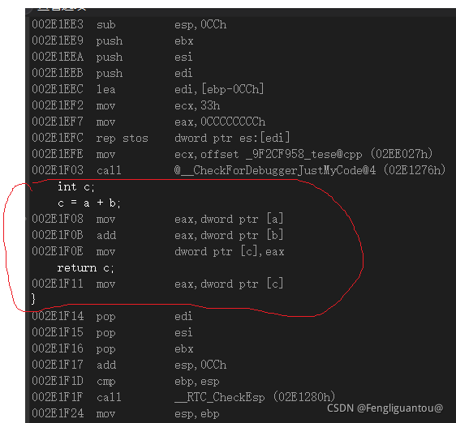
  > </div>
  > <br>
  > 分析这段代码的汇编，在进入add函数以后，先是将a的值给了eax，然后将b的值加上a，接着将eax里的值给了c。最后对c进行返回，在返回c的时候生成一个临时拷贝，c将自己的值又给到了寄存器eax中。
  > <br>  
  > <div align=center>
  > 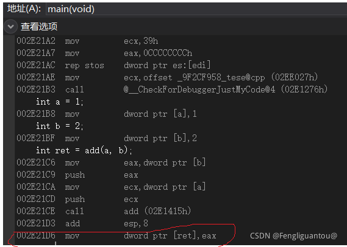
  > </div>
  > <br>
  > 最后回到主函数，eax将值给了ret。


* 2.传引用返回
  > 不需要临时对象保存其返回值。
  > ```c++
  > int& add(int a, int b) {
  >     int c = a + b;
  >     return c;
  > }
  > 
  > int main() {
  >     int a = 1;
  >     int b = 2;
  >     int &ret = add(a, b);
  >     cout << ret << endl;
  > }
  > ```
  > 编译报错
  > ```c++
  > warning: reference to local variable ‘c’ returned [-Wreturn-local-addr]
  > int c = a + b;
  > ```
  > 运行结果
  > ```c++
  > Segmentation fault (core dumped)
  > ``` 
  > 这里进行的是传引用返回，也就是说ret其实就是c的别名。传引用返回，返回的就是本体，而不是拷贝。因为这里c是一个局部变量，在函数结束以后，栈帧被销毁，局部变量的空间被系统回收了。这时ret再去访问c的内容就可能造成非法访问，并且c的值可能已经被修改了。<br>
  > 形象的来说：就是你原先买了一个房子，后面你又将其卖给了别人，后面你想再次进入这个房子，但是这间房子已经不属于你了，你进房子的操作就属于非法访问了。<br>
  > <font color="yellow">所以，传引用返回时，返回的对象不能是出函数就被系统回收的。也就是说 返回的变量不能是一个局部变量。</font> <br>


* 3.传指针返回
  > 与传引用返回区别不大，返回的对象不能是出函数就被系统回收的。也就是说 返回的变量不能是一个局部变量。
  > ```c++
  > int* add(int a, int b) {
  >     int c = a + b;
  >     return &c;
  > }
  > 
  > int main() {
  >     int a = 1;
  >     int b = 2;
  >     int *ret = add(a, b);
  >     cout << ret << endl;
  > }
  > ```
  > 编译报错
  > ```c++
  > warning: address of local variable ‘c’ returned [-Wreturn-local-addr]
  > int c = a + b;
  > ```
  > 运行结果
  > ```c++
  > 0
  > ``` 


--------------------------------------------------------------------------------
## C++ 函数返回引用 和 函数返回指针有什么区别？

* 
  > 函数返回引用 和 函数返回指针有什么区别？<br>
  > 引用和指针都可以用来返回函数内部创建的对象，但是它们有以下区别：<br>
  > 1. 操作符的不同：<br>
    函数返回指针使用 `*` 操作符来解引用指针获取指针所指向的对象，<br>
    而函数返回引用则直接返回对象的别名，使用时不需要解引用操作符 `*`。<br>
  > 2. 对象的生命周期：<br>
    函数返回指针可以返回一个指向堆上或栈上对象的指针，但是需要确保指针所指向的对象在函数返回后仍然存在，否则返回的指针会指向一个已经被销毁的对象。<br>
    而函数返回引用只能返回指向在函数外部已经存在的对象的引用，不能返回指向函数内部创建的局部变量或临时变量的引用。<br>
  > 3. 可修改性的不同：<br>
    函数返回引用可以用于修改对象的值，<br>
    而函数返回指针也可以用于修改对象的值，但是需要确保指针所指向的对象是可修改的。<br>
  > 
  > 例如，下面的代码展示了返回引用和指针的不同：<br>
  > ```c++
  > int& returnByRef(int& x) {
  >     x++;  // 修改参数的值
  >     return x;
  > }
  > 
  > int* returnByPtr(int* x) {
  >     (*x)++;  // 修改指针所指向的对象的值
  >     return x;
  > }
  > 
  > int main() {
  >     int a = 1;
  >     int b = 2;
  > 
  >     int& ref = returnByRef(a);
  >     int* ptr = returnByPtr(&b);
  > 
  >     cout << "a = " << a << endl;  // 输出 a = 2
  >     cout << "b = " << b << endl;  // 输出 b = 3
  > 
  >     ref = 3;
  >     (*ptr) = 4;
  > 
  >     cout << "a = " << a << endl;  // 输出 a = 3
  >     cout << "b = " << b << endl;  // 输出 b = 4
  > 
  >     return 0;
  > }
  > ```
  > 运行结果
  > ```c++
  > a = 2
  > b = 3
  > a = 3
  > b = 4
  > ```
  > 在这个例子中，returnByRef 返回一个对 `a` 的引用，而 returnByPtr 返回一个指向 `b` 的指针。我们可以看到，在引用 `ref` 和指针 `ptr` 中存储了 `a` 和 `b` 的地址，所以它们可以被用来修改 `a` 和 `b` 的值。<br>
  > <br>


--------------------------------------------------------------------------------
## 博客：C++函数返回值总结

<https://zhuanlan.zhihu.com/p/358177643>


* 目录的思维导图如下：
  > <div align=center>
  > 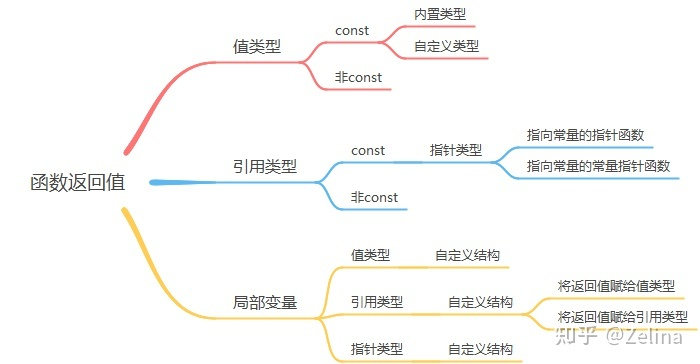
  > </div>
  > <br> 


### 1、值类型
> 使用临时对象（temporary object）来保存函数的返回值。函数的返回值用于初始化调用点的一个临时对象，该临时对象就是函数调用的结果。

> int i = func( ); 此时，有一个临时对象用来保存 func( ) 函数的返回值，之后将临时对象的值赋值给变量 i 。像其它任何对象一样，临时对象需要存储空间，并且能够构造和销毁。临时对象和其它对象的区别在于从来看不到它们，编译器负责决定他们的去留以及它们存在的细节。`编译器使得所有的临时量自动地成为 const` 。 所以，对于返回值为值类型的函数，其返回值为右值。

* 1.1 const 
  > 1.1.1 内置类型
    >> 返回值不能被修改，只能是右值 <br>

  > 1.1.2 自定义类型
    >> 返回值不能被修改，只能是右值 <br>

* 1.2 非const 
  > 1.2.1 内置类型
    >> 返回值不能被修改，只能是右值 <br>

  > 1.2.2 自定义类型
    >> 可以对其返回值进行赋值，即返回值是左值 <br>
    >> 虽然可以编译通过，但是实际上这么做没有意义。因为函数的返回值保存在临时对象中，我们无法访问该临时对象，在该行代码执行完毕后，临时对象就会被清除. <br>


### 2、引用
> 当函数的返回值是引用类型时，其返回值即为return的变量，所以不需要临时对象保存其返回值。所以，对于返回值为引用类型的函数，其返回值为左值. <br>

* 2.1 const 
  > const引用是指向const对象的引用。可以读取，但不能修改。将const变量赋值给非const引用是非法的。
  > <font color="yellow">我们不会在函数返回值使用 `const引用`, 这其实没有意义，我们要返回的一般是需要进行读写的变量。就算要使用，也是使用`非const引用`</font>

* 2.2 非const 
  > 非const引用是指向非const类型变量的引用，可读写，是左值。


* 2.4 如果非const引用指向了const对象。编译器报错，因为const对象是只读的，而非const引用是可读写的，只读--可读写，这样变化会引起严重后果。
  > ```c++
  > const int i = 10;
  > int & ref = i;
  > ```
  > 编译报错
  > ```c++
  > error: binding reference of type ‘int&’ to ‘const int’ discards qualifiers
  > ```


* 2.5 如果const引用指向了非const对象。那么我们也无法通过const引用名进行写操作，只能读。但是可以通过原对象名进行操作。
  > ```c++
  > int i = 10;
  > const int & ref = i;
  > ref = 20;
  > ```
  > 编译报错
  > ```c++
  > error: assignment of read-only reference ‘ref’        
  > ```
  > 修改一下
  > ```c++  
  > int i = 10;
  > const int & ref = i;
  > // ref = 20;
  > i = 30;
  > cout << "i = " << i << endl;
  > cout << "ref = " << ref << endl;
  > ```
  > 编译成功，运行
  > ```c++  
  > i = 30
  > ref = 30
  > ```

* 总结
  > 引用可以进行权限的缩小，但是不能进行权限的放大. <br>
  > 非const引用只能绑定到与该引用同类型的对象，“只能绑定同类型”是指非const引用不能绑定到const对象，因为const对象是只读的，而非const引用是可读写的，这样会引起严重后果。改变const的初衷。<br>
  > const引用则可以绑定到不同但相关的类型的对象或绑定到右值。const引用可以绑定到非const对象，因为非const对象是可读写的，而const引用是只读的，这样会不会引起严重后果。<br>


### 3、指针

* const与指针结合的三种情况
  > 常量指针：
  >> 被指向的对象是常量。即常量的指针，指向的内容不可改变 <br>
  >> 两种写法：const int *p或者int const *p <br>

  > 指针常量：
  >> 指针本身是常量。即指针是常量，不可以指向其他的地方 <br>
  >> 只有一种写法：int *const p  <br>
  >> 指针常量定义时必须初始化

  > 指向常量的指针常量
  >> 写法：const int *const p  <br>
  >> 第一个const修饰指针指向的内容，第二个const修饰指针。具有常量指针和指针常量的特点，指针内容不能改变，也不能指向其他地方，定义同时要进行初始化


* 3.1 const 
  > 3.1.1 常量指针 const int *p或者int const *p
    >> 返回值是右值，不能对其进行赋值，且不能为非const指针赋值。
    >> ```c++
    >> const char* get_string() {
    >>       return “12345”;
    >> }
    >> int main() {
    >>     get_string()[0] = 'a';//错误，表达式必须是可修改的左值
    >>     char* pstring = get_string();//错误，“const char*”类型不能用于初始化“char*”类型的实体
    >>     const char* cpstring = get_string();//正确
    >> }
    >> ```

  > 3.1.2 指向常量的指针常量
    >> 返回值为右值，不能对其进行赋值，也不能将其赋值给非const指针。也可以赋值给指向常量的非常量指针。
    >> ```c++
    >> const char* const get_string() {
    >>       return “12345”;
    >> }
    >> int main() {
    >>     const char* const ccpstring = get_string();//正确
    >>     const char* cpstring = get_string();//正确
    >> }
    >> ```

* 3.2 非const 
  > 左值。


### 4、局部变量（函数内定义的变量）

>由于内置类型的局部变量没有太多可以讨论的，我们就讨论自定义结构<br>
> 以自定义类型MyStruct为例：
>> ```c++
>> struct MyStruct {
>>     int x;
>>     int y;
>> };
>> ```

* 4.1 值类型
  > 返回值是自定义结构的值类型：<br>
  > ```c++
  > MyStruct MyProc1() {
  >      MyStruct l_mystruct;
  >      l_mystruct.x = 1;
  >      l_mystruct.y = 2;
  >      return l_mystruct;
  > }
  > //调用
  > MyStruct myStruct = MyProc1();
  > ```
  > 使用临时对象（temporary object）来保存函数的返回值。函数的返回值用于初始化调用点的一个临时对象，该临时对象就是函数调用的结果。所以，当函数返回值是自定义的值类型时，即使函数的返回值是局部变量，其返回值也是有效值。<br>
  > <div align=center>
  > 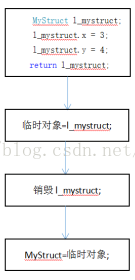
  > </div>
  > <br> 


* 4.2 指针类型 
  > 返回值是自定义结构的指针类型：
  > ```c++
  > MyStruct* MyProc2() {
  >      MyStruct* l_pMyStruct =new MyStruct();
  >      l_pMyStruct->x = 1;
  >      l_pMyStruct->y = 2;
  >      return l_pMyStruct;
  > }
  > //在main函数中调用它
  > MyStruct* pMyStruct = MyProc2();
  > ```
  > 在MyProc2()中，通过new关键字在堆（heap）上分配了内存，并且将该内存的地址保存到局部变量l_pMyStruct中，对内存进行赋值之后，返回该内存的地址。此时，pMyStruct的值是MyProc2()中在堆上分配的内存地址。因为<font color="yellow">当函数MyProc2()结束后，保存堆内存地址的局部变量l_pMyStruct被销毁，而堆内存本身不会被销毁。堆内存的销毁，必须要通过detele来释放，不会自动释放。</font>
  > <div align=center>
  > 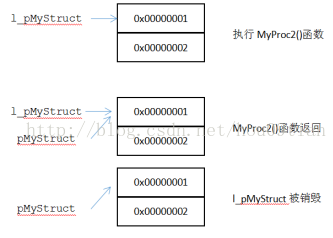
  > </div>
  > <br> 


* 4.3 引用类型 
  > 返回值是自定义结构的引用类型：
  > ```c++
  > MyStruct& MyProc3() {
  >      MyStruct l_myStruct_ref;
  >      l_myStruct_ref.x = 3;
  >      l_myStruct_ref.y = 4;
  >      return l_myStruct_ref;
  > }
  > ```
  > 4.3.1 将返回值赋值给值类型
  > ```c++
  > // 将返回值赋值给值类型
  > MyStruct myStruct3 = MyProc3();
  > ```
  > 当函数返回时，<font color="yellow">使用临时对象来保存局部变量 l_myStruct_ref 的</font> <font color="red">引用</font>，<font color="green">之后将临时对象（其实就是l_myStruct_ref ）的成员变量值 赋给 myStruct3 的成员变量 x 和 y  </font>。接下来<font color="yellow">虽然局部变量 l_myStruct_ref 被销毁（临时对象引用也没了），但是结构体成员的值却保留了下来</font>，所以 myStruct3 的 x 和 y 的值依然是 3 和4.<br>
  > <br>
  > 4.3.2 将返回值赋值给引用类型
  > ```c++
  > // 将返回值赋值给引用类型
  > MyStruct& myStruct_ref = MyProc3();
  > ```
  > 当函数返回时，<font color="yellow">使用临时对象来保存局部变量l_myStruct_ref 的</font> <font color="red"> 引用 </font>，<font color="green">而变量 myStruct_ref 中保存的是临时变量的引用，其实也就是局部变量 l_myStruct_ref 的引用</font>，<font color="yellow">当局部变量 l_myStruct_ref 被销毁，则 myStruct_ref 中的值同时被销毁</font>。虽然此时myStruct_ref的成员变量值依然是3和4，但是，该地址已经被标记为可修改，之后再执行其他代码时，这个地址可能就会被修改为其他值。
  > <div align=center>
  > 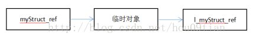
  > </div>
  > <br> 

> 所以，《C++Primer第5版中文版》中提到，`不要返回局部对象的引用`。


