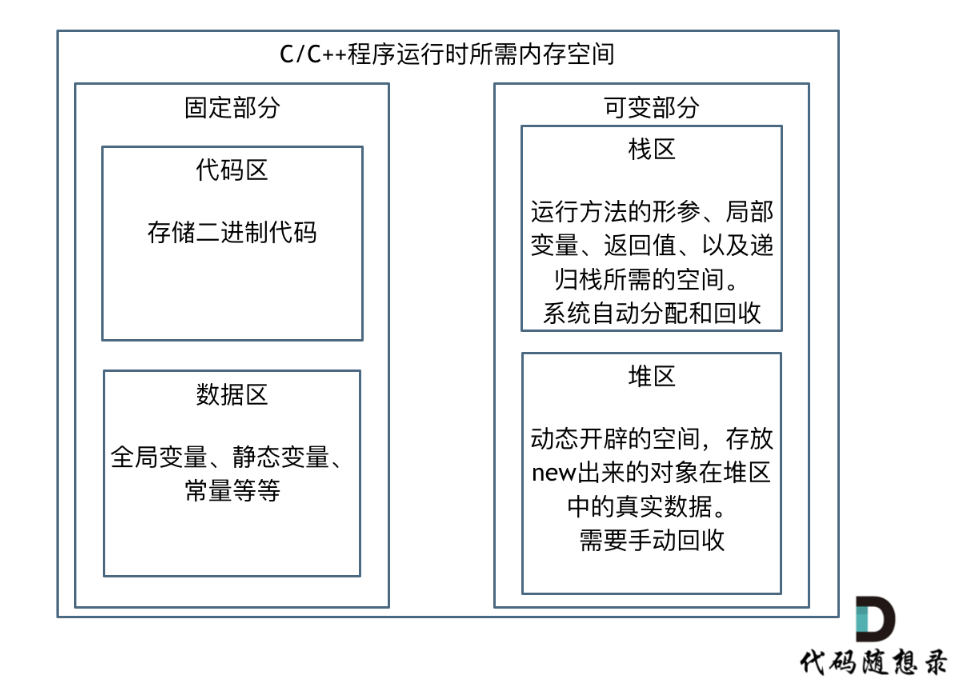
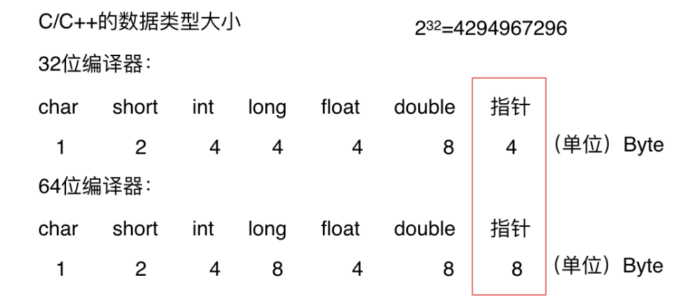
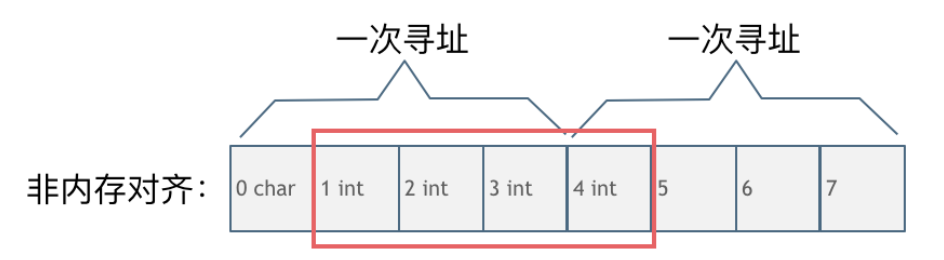

# cpp_data_structure 

* 代码随想录 https://programmercarl.com/

* 一个有非常简明例子的cpp网站：https://en.cppreference.com/w/

--------------------------------------------------------------------------------

# 算法性能分析

--------------------------------------------------------------------------------

## 内存管理

## _4_Memory_Management.md

--------------------------------------------------------------------------------

<font color="yellow">理解代码的内存消耗，最关键是要知道自己所用编程语言的内存管理。</font>

### 不同语言的内存管理

> 不同的编程语言各自的内存管理方式。
> * **C/C++这种内存堆空间的申请和释放完全靠自己管理**
> * Java 依赖JVM来做内存管理，不了解jvm内存管理的机制，很可能会因一些错误的代码写法而导致内存泄漏或内存溢出
> * Python内存管理是由私有堆空间管理的，所有的python对象和数据结构都存储在私有堆空间中。程序员没有访问堆的权限，只有解释器才能操作。
>
> 例如Python万物皆对象，并且将内存操作封装的很好，所以python的基本数据类型所用的内存会要远大于存放纯数据类型所占的内存，例如，我们都知道存储int型数据需要四个字节，但是使用Python 申请一个对象来存放数据的话，所用空间要远大于四个字节。


### C++的内存管理

> 以C++为例来介绍一下编程语言的内存管理。
> 
> 如果我们写C++的程序，就要知道栈和堆的概念，程序运行时所需的内存空间分为 固定部分，和可变部分，如下：
> > <div align=center>
> > 
> > </div>
> 
> 固定部分的内存消耗 是不会随着代码运行产生变化的， 可变部分则是会产生变化的
> 
> <font color="yellow">更具体一些，一个由C/C++编译的程序占用的内存分为以下几个部分：
> * 栈区(Stack) ：由编译器自动分配释放，存放函数的参数值，局部变量的值等，其操作方式类似于数据结构中的栈。
> * 堆区(Heap) ：一般由程序员分配释放，若程序员不释放，程序结束时可能由OS收回
> * 未初始化数据区(Uninitialized Data)： 存放未初始化的全局变量和静态变量
> * 初始化数据区(Initialized Data)：存放已经初始化的全局变量和静态变量程序代码区(Text)：存放函数体的二进制代码
> 
> 代码区和数据区所占空间都是固定的，而且占用的空间非常小，那么看运行时消耗的内存主要看可变部分。
> 
> 在可变部分中，栈区间的数据在代码块执行结束之后，系统会自动回收，而堆区间数据是需要程序员自己回收，所以也就是造成内存泄漏的发源地。</font>
> 
> 而Java、Python的话则不需要程序员去考虑内存泄漏的问题，虚拟机都做了这些事情。
>

> "内存中的栈"采用的就是"数据结构中的栈"的思想，即遵循后进先出的管理方法。好比数据结构中的栈是一项先进的技术，在内存管理中采用了该技术。
> 
> "内存中的堆"与"数据结构中的堆"是两个完全不同的概念。堆内存只是一块自由(随时申请、释放、大小块随意)的内存单元。
> > <font color="yellow">"数据结构中的堆"也叫优先队列, 可以被看做一棵完全二叉树的数组对象</font>
> > "数据结构中的堆"在物理层面上，表现为一组连续的数组区间：long[] array ；将整个数组看作是堆。
> > 堆在逻辑结构上，一般被视为是一颗完全二叉树。
> > 堆满足下列性质：
> > * 堆中某个节点的值总是**不大于或不小于**其父节点的值。
> > * 堆总是一棵完全二叉树。


#### 如何计算程序占用多大内存
> 想要算出自己程序会占用多少内存就一定要了解自己定义的数据类型的大小，如下：
> > <div align=center>
> > 
> > </div>
> 
> 注意图中有两个不一样的地方，为什么64位的指针就占用了8个字节，而32位的指针占用4个字节呢？
> 1个字节占8个比特，那么4个字节就是32个比特，可存放数据的大小为2^32，也就是4G空间的大小，即：可以寻找4G空间大小的内存地址。
> 大家现在使用的计算机一般都是64位了，所以编译器也都是64位的。
> 安装64位的操作系统的计算机内存都已经超过了4G，也就是指针大小如果还是4个字节的话，就已经不能寻址全部的内存地址，所以64位编译器使用8个字节的指针才能寻找所有的内存地址。
> 注意2^64是一个非常巨大的数，对于寻找地址来说已经足够用了。
>

#### 内存对齐

> 再介绍一下内存管理中另一个重要的知识点：内存对齐。
> 
> 不要以为只有C/C++才会有内存对齐，只要可以跨平台的编程语言都需要做内存对齐，Java、Python都是一样的。
>
> 而且这是面试中面试官非常喜欢问到的问题，就是：**为什么会有内存对齐？**
> 
> 主要是两个原因
> 
> * 平台原因：<font color="yellow">不是所有的硬件平台都能访问任意内存地址上的任意数据</font>，某些硬件平台只能在某些地址处取某些特定类型的数据，否则抛出硬件异常。为了同一个程序可以在多平台运行，需要内存对齐
> 
> * 硬件原因：<font color="yellow">经过内存对齐后，CPU访问内存的速度大大提升</font>
> 
>
> 看一下这段C++代码输出的各个数据类型大小是多少？
> ```c++
> struct node{
>    int num;
>    char cha;
> }st;
> int main() {
>     int a[100];
>     char b[100];
>     cout << sizeof(int) << endl;
>     cout << sizeof(char) << endl;
>     cout << sizeof(a) << endl;
>     cout << sizeof(b) << endl;
>     cout << sizeof(st) << endl;
> }
> ```
> 看一下和自己想的结果一样么， 我们来逐一分析一下。
> 其输出的结果依次为：
> ```html
> 4
> 1
> 400
> 100
> 8
> ```
> 此时会发现，和单纯计算字节数的话是有一些误差的。
> 
> 这就是因为内存对齐的原因。
> 
> 来看一下内存对齐和非内存对齐产生的效果区别。
> 
> **CPU读取内存不是一次读取单个字节，而是一块一块的来读取内存，块的大小可以是2，4，8，16个字节，具体取多少个字节取决于硬件。**
> 
> 假设CPU把内存划分为4字节大小的块，要读取一个4字节大小的int型数据，来看一下这两种情况下CPU的工作量：
> 
> 第一种就是内存对齐的情况，如图：
> > <div align=center>
> > 
> > </div>
> 一字节的char占用了四个字节，空了三个字节的内存地址，int数据从地址4开始。
> 
> 此时，直接将地址4，5，6，7处的四个字节数据读取到即可。
>
> 第二种是没有内存对齐的情况如图：
> > <div align=center>
> > 
> > </div>
> char型的数据和int型的数据挨在一起，该int数据从地址1开始，那么CPU想要读这个数据的话来看看需要几步操作：
> 1. 因为CPU是四个字节四个字节来寻址，首先CPU读取0，1，2，3处的四个字节数据
> 2. CPU读取4，5，6，7处的四个字节数据
> 3. 合并地址1，2，3，4处四个字节的数据才是本次操作需要的int数据
> 
> 此时一共需要两次寻址，一次合并的操作。
>
> **大家可能会发现内存对齐岂不是浪费的内存资源么？**
> 
> **是这样的，但事实上，相对来说计算机内存资源一般都是充足的，我们更希望的是提高运行速度。**
> 
> **编译器一般都会做内存对齐的优化操作，也就是说当考虑程序真正占用的内存大小的时候，也需要认识到内存对齐的影响。**
> 


