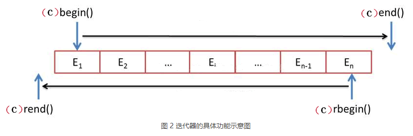

# cpp_data_structure 

* 代码随想录 https://programmercarl.com/

* 一个有非常简明例子的cpp网站：https://en.cppreference.com/w/
  <br> 例如，查看std::vector的assign的用法：https://en.cppreference.com/w/cpp/container/vector/assign
  <br> 三种方式通过一个例子完美解释了，还夹带lambda干货。

--------------------------------------------------------------------------------

```c++
// STL（标准模板库） 
#include <array>               // std::array                                    容器
#include <vector>              // std::vector                                   容器
#include <list>                // std::list                                     容器
#include <stack>               // std::stack                                    容器适配器
#include <queue>               // std::queue          std::priority_queue       容器适配器
#include <deque>               // std::deque                                    容器
#include <string>              // std::string                                   容器
#include <map>                 // std::map            std::multimap             容器   
#include <set>                 // std::set            std::multiset             容器
#include <unordered_map>       // std::unordered_map  std::unordered_multimap   容器
#include <unordered_set>       // std::unordered_set  std::unordered_multiset   容器

// 与STL 容器有关的头文件
// <algorithm>是标准模版库（STL）中最重要的头文件之一，提供了大量基于迭代器的非成员模板函数。
#include <algorithm>   // remove()、remove_if()、find_if()、sort、...
// https://blog.csdn.net/szplzx1314/article/details/120644640

#include <iterator> // next() prev() distance() advance()
```

--------------------------------------------------------------------------------

# STL container 容器 ( 总结在895行 )

--------------------------------------------------------------------------------

## std::vector 和 std::array

## _1_STL_vector_array.md

--------------------------------------------------------------------------------

> <font color="yellow">
> 
> 讲一讲，相对于传统的C风格数组，`std::vector`、`std::string`这种容器有什么优势？
>
> 为什么不用`int num[size] = {0,0,...,0};` 而用`vector<int> num(size, 0);`
>
> 为什么不用`char ch[size] = {'c','c',...,'c'};` 而用`string s(size,'c');`
> 
> </font>


> **对于C风格的数组，有一个经常要注意的**
>
> <font color="gree">在初始化时，`int`类型的数组在初始化时，必须赋值，不然会各种乱起八糟的值</font>
>
> <font color="gree">但是也不用给所有元素都赋值，只需要给第一个元素赋值，后面的元素会自动赋值为`0`</font>
>
> ```c++
> int size = 10;
> 
> int num1[size] = {0};
> for (int i = 0; i < size; i++) {
>    cout << num1[i] << ", ";
> }
> cout << endl;
> 
> int num2[size] = {1};
> for (int i = 0; i < size; i++) {
>    cout << num2[i] << ", ";
> }
> cout << endl;
> 
> int num3[size] = {1, 2, 3};
> for (int i = 0; i < size; i++) {
>    cout << num3[i] << ", ";
> }
> cout << endl;
> ```
>
> 编译并运行，结果如下
>
> ```c++
> 0, 0, 0, 0, 0, 0, 0, 0, 0, 0, 
> 1, 0, 0, 0, 0, 0, 0, 0, 0, 0, 
> 1, 2, 3, 0, 0, 0, 0, 0, 0, 0,
> ```
>
> <font color="gree">但是别的类型数组没有自动赋值的功能</font>
>
> <font color="gree">以字符数组为例</font>
>
> ```c++
> char size = 10;
> 
> char ch1[size] = {'a'};
> for (int i = 0; i < size; i++) {
>    cout << ch1[i] << ", ";
> }
> cout << endl;
> 
> char ch2[size] = {'b'};
> for (int i = 0; i < size; i++) {
>    cout << ch2[i] << ", ";
> }
> cout << endl;
> 
> char ch3[size] = {'a', 'b', 'c'};
> for (int i = 0; i < size; i++) {
>    cout << ch3[i] << ", ";
> }
> cout << endl;
> ```
>
> 编译并运行，结果如下
>
> ```c++
> a, , , , , , , , , , 
> b, , , , , , , , , , 
> a, b, c, , , , , , , , 
> ```
>
> <font color="yellow">所以，对于C风格的数组，没有统一的初始化的简单方式，总不能一个个赋初始值吧</font>
>
> <font color="yellow">如果我们用`std::vector`、`std::string`，都是有很方便的初始化函数</font>
>
> 例如
> 
> ```c++
> vector<T> v(n,val); //v中包含n个重复元素，每个元素的值都是val  
> 
> string s(n,'c'); // 将 s 初始化为字符 ‘c’ 的 n 个副本
> 
> ```
>
> <font color="yellow">当然容器还有更多的好操作，都是很方便我们使用的</font>
>
> 

--------------------------------------------------------------------------------

> <font color="yellow">能使用`std::vector`，就不用`std::array`, 更省事省心</font>
> 

### 定义和初始化vector对象

* 
  > 初始化的方式比较多，有如下几种：
  > ```c++
  > vector<T> v1;               //v1为空，执行默认初始化.                  缺省构造函数
  > vector<T> v2(v1);           //v2中包含v1所有元素的副本.                拷贝构造函数
  > vector<T> v2=v1;            //等价于v2(v1)                            拷贝构造函数
  > vector<T> v3(n,val);        //v3中包含n个重复元素，每个元素的值都是val  带参构造函数
  > vector<T> v4(n);            //v4包含n个重复执行了值初始化的对象         带参构造函数
  > vector<T> v5{a,b,c...};     //包含初始化元素个数，每个元素被对应的赋予相应的值
  > vector<T> v5={a,b,c...};    //等价v5{a,b,c...}
  > ```
  >  注意事项：
  >  * vector<T> v1，只用默认初始化时，不能通过下标进行添加元素。也就是说，当你将v1初始化为空时，假如你想向v1中添加10个元素，不能通过v1[2]=3;等形式添加，因为，别人为空，压根不知道v1[2]是什么东东。<br>
  >  * 注意vector<T> v4(n)和vector<T> v4{n}的区别。前者说的是，v4中有n个相同的元素，至于值为多少要看相应对象的初始化值；而后者，则是说v4中只有一个元素，其值为n。<br>
  >  * 不能使用包含着多个值的括号 ( ) 去初始化vector对象。注意和 { } 括号的区别
  >     ```c++
  >     vector<int> intV(1,2,3);        //错误 
  >     ```


### 数组转vector：使用vector的初始化构造函数
* 
  > ```c++
  > int arr[4] = {3,2,2,3};
  > size_t arr_len = sizeof(arr)/sizeof(arr[0]);
  > cout << "arr_len = sizeof(arr)/sizeof(arr[0]) = " << arr_len << endl;
  > 
  > // 打印地址
  > for (size_t i = 0; i < arr_len; i++) {
  >     cout << &arr[i] << " ";
  > }
  > cout << endl;
  > // 打印数值
  > for (size_t i = 0; i < arr_len; i++) {
  >     cout << arr[i] << " ";
  > }
  > cout << endl;
  > cout << endl;
  > 
  > 
  > // 将array[] 转化为 vector 方法是：vector<type> v(array, array+N)  (其中：N代表数组长度.)
  > vector<int> nums( arr, arr + sizeof(arr)/sizeof(arr[0]) ); 
  > cout << "nums.size() = " << nums.size() << endl;
  > 
  > // 打印地址
  > for (size_t i = 0; i < nums.size(); i++) {
  >     cout << &nums[i] << " ";
  > }
  > cout << endl;
  > // 打印数值
  > for (size_t i = 0; i < nums.size(); i++) {
  >     cout << nums[i] << " ";
  > }
  > cout << endl;
  > cout << endl;
  > ```
  > 运算结果
  > ```c++
  > arr_len = sizeof(arr)/sizeof(arr[0]) = 4
  > 0x7ffdf3eb5fe0 0x7ffdf3eb5fe4 0x7ffdf3eb5fe8 0x7ffdf3eb5fec 
  > 3 2 2 3 
  > 
  > nums.size() = 4
  > 0x5652dbcc6280 0x5652dbcc6284 0x5652dbcc6288 0x5652dbcc628c 
  > 3 2 2 3  
  > ```  
  > 注意，
  > ```html
  > sizeof() 和 vector::size(), 两个函数的返回值都是size_t类型，
  > size_t类 等价于 unsigned int 类型 或者 unsigned long 类型。
  > ```


### 访问vector对象的元素

*
  > <font color="yellow"> 使用[ ] </font><br>
  > 例1：<br>
  > ```c++
  > vector<int> v = {0,1,2,3,4,5,6,7,8,9};
  > cout << v[9] << "\n";
  > cout << v[10] << "\n";
  > ```  
  > 运行结果：
  > ```c++
  > 9
  > 1041 // 没报错，但是越界了
  > ```
  > 例2：<br>
  > ```c++
  > vector<int> v = {0,1,2,3,4,5,6,7,8,9};
  > cout << v[10] << "\n";
  > v[10] = 10; // 这样很危险，因为第10个位置并不是vector自动分配的堆内存，
  > cout << v[10] << "\n";
  > ```  
  > 运行结果：
  > ```c++
  > 61809 // 没报错，但是越界了
  > 10    // 这样很危险，因为第10个位置并不是vector自动分配的堆内存，
  > ```

*
  > <font color="yellow"> 使用at()方法. 带有越界检查</font><br>
  > 例1：<br>
  > ```c++
  > #include <stdexcept>  // 异常处理exception try throw catch
  >
  > vector<int> v = {0,1,2,3,4,5,6,7,8,9};
  > try{
  >     v.at(10) = 10;               // 如果产生越界，那么抛出异常out_of_range
  > } catch (out_of_range) {
  >     cout << "越界异常" << '\n';   // 保护代码
  > } catch (...) {
  >     cout << "未知异常" << '\n';   // catch 块的括号内使用省略号，能处理任何异常的代码
  > }
  > ```  
  > 运行结果：
  > ```c++
  > 越界异常
  > ```


--------------------------------------------------------------------------------

### vector定义结构体

*
  > <font color="yellow">  </font><br>
  > 例1：<br>
  > ```c++
  > struct Books
  > {
  >     int id;
  >     char  title[50];
  >     char  author[50];
  > };
  > 
  > int main(void)
  > {
  >     vector<Books> v;
  > 
  >     Books book;
  >     book.id = 1;
  >     // #include <cstring>
  >     strcpy(book.title,"C++");     // 数组无法直接赋值,不能book.title = "C++";
  >     strcpy(book.author,"Runoob"); // 不能book.author = "Runoob";
  >     
  >     v.push_back(book);
  > 
  >     vector<Books>::iterator it = v.begin();
  >     cout << (*it).id << endl;
  >     cout << (*it).title << endl;
  >     cout << (*it).author << endl;
  > }
  > ```  
  > 运行结果：
  > ```c++
  > 1
  > C++
  > Runoob
  > ``` 


--------------------------------------------------------------------------------


### vector对象的操作

*
  > <font color="yellow"> 判断是否为空：v.empty(); </font><br>
  > 例1：<br>
  > ```c++
  > vector<int> v1;
  > vector<int> v2 = {0,1,2,3,4,5,6,7,8,9};
  > // 判断是否为空：v.empty();
  > cout << "v1.empty() = " << v1.empty() <<endl;
  > if (v2.empty()) {
  >     cout << "v2 为空" << endl;
  > } else {
  >     cout << "v2 不为空" << endl;
  > }
  > ```  
  > 运行结果：
  > ```c++
  > v1.empty() = 1
  > v2 不为空  
  > ``` 


*
  > <font color="yellow">容量：v.capacity();</font><br>
  > <font color="yellow">大小：v.size();</font><br>
  > 例1：<br>
  > ```c++
  > vector<int> v = {0,1,2,3,4,5,6,7,8,9};
  > // 容量（最大存储个数）：v.capacity();
  > // 大小（当前存储个数）: v.size();
  > cout << "v.capacity() = " << v.capacity() <<endl;
  > cout << "v.size() = " << v.size() <<endl;
  > ```  
  > 运行结果：
  > ```c++
  > v.capacity() = 10
  > v.size() = 10   
  > ``` 
  > 例2：<br>
  > ```c++
  > vector<int> v;
  > // 尾部连续添加10个元素
  > for(int i = 0; i != 10; ++i){
  >     v.push_back(i);
  > }
  > cout << "v.capacity() = " << v.capacity() <<endl;
  > cout << "v.size() = " << v.size() <<endl;
  > ```  
  > 运行结果：
  > ```c++
  > v.capacity() = 16  //为什么capacity这里会变成16？？？
  > v.size() = 10   
  > ```

*
  > <font color="yellow"> 返回第一个元素：v.front() </font><br>
  > <font color="yellow"> 返回最后一个元素：v.back() </font><br>
  > 例1：<br>
  > ```c++
  > vector<int> v = {0,1,2,3,4,5,6,7,8,9};
  > // front()：返回 vector 中的第一个元素
  > // back()：返回 vector 中的最后一个元素 
  > cout << "v.front() = " << v.front() <<endl;
  > cout << "v.back() = " << v.back() <<endl;
  > ```  
  > 运行结果：
  > ```c++
  > v.front() = 0
  > v.back() = 9   
  > ``` 

*
  > <font color="yellow"> 获取起始位置：v.begin(); </font> // 返回类型为迭代器 vector< int > :: iterator <br>
  > <font color="yellow"> 获取结尾位置：v.end()-1; </font>// 返回类型为迭代器 vector< int > :: iterator <br>
  > <font color="yellow"> 获取结尾位置的下一个位置：v.end(); </font> // 返回类型为迭代器 vector< int > :: iterator<br>
  > 例1：<br>
  > ```c++
  > vector<int> v = {0,1,2,3,4,5,6,7,8,9};
  > // v.begin();   指向起始位置
  > // v.end()-1;   指向结尾位置:
  > // v.end();     指向结尾位置的下一个位置:
  > cout << "v.begin()   = " << *(v.begin()) <<endl;  
  > cout << "v.begin()+1 = " << *(v.begin()+1)  <<endl;
  > cout << "v.begin()+2 = " << *(v.begin()+2)  <<endl;
  > cout << "v.end()-2   = " << *(v.end()-2)  <<endl;  
  > cout << "v.end()-1   = " << *(v.end()-1)  <<endl;
  > cout << "v.end()     = " << *(v.end())  <<endl;
  > ```  
  > 运行结果：
  > ```c++
  > v.begin()   = 0
  > v.begin()+1 = 1
  > v.begin()+2 = 2
  > v.end()-2   = 8
  > v.end()-1   = 9
  > v.end()     = 1041  // 不同PC的结果不同
  > ``` 

*
  > <font color="yellow"> 尾部添加元素：v.push_back(a); </font> //在尾部添加一个元素，值为a<br>
  > 例1：<br>
  > ```c++
  > vector<int> v;
  > // 尾部连续添加10个元素
  > for(int i = 0; i != 10; ++i){
  >     v.push_back(i);
  > }
  > // 显示每一个元素
  > vector<int>::iterator iter_v;
  > for (iter_v = v.begin(); iter_v != v.end(); iter_v ++) {
  >     cout << *iter_v << ", ";
  > }
  > cout << endl;
  > ```  
  > 运行结果：
  > ```c++
  > 0, 1, 2, 3, 4, 5, 6, 7, 8, 9,    
  > ``` 

*
  > <font color="yellow"> 尾部删除元素: v.pop_back(); </font> //在尾部删除最后一个元素<br>
  > 例1：<br>
  > ```c++
  > vector<int> v = {0,1,2,3,4,5,6,7,8,9};
  > // 尾部连续删除3个元素
  > for(int i = 0; i != 3; ++i){
  >     v.pop_back();
  > }
  > // 显示每一个元素
  > vector<int>::iterator iter_v;
  > for (iter_v = v.begin(); iter_v != v.end(); iter_v ++) {
  >     cout << *iter_v << ", ";
  > }
  > cout << endl;
  > ``` 
  > 运行结果：
  > ```c++
  > 0, 1, 2, 3, 4, 5, 6,    
  > ``` 

*
  > <font color="yellow"> 插入单个元素：v.insert ( v.begin() + i, a ); </font> //在第i位置vec[i],插入a <br>
  > 例1：<br>
  > ```c++
  > vector<int> v = {0,1,2,3,4,5,6,7,8,9};
  > // （注意从0开始，）在第3位置vec[i],插入元素，值为300
  > v.insert(v.begin()+3, 300);
  > // 显示每一个元素
  > vector<int>::iterator iter_v;
  > for (iter_v = v.begin(); iter_v != v.end(); iter_v ++) {
  >     cout << *iter_v << ", ";
  > }
  > cout << endl;
  > ``` 
  > 运行结果：
  > ```c++
  > 0, 1, 2, 300, 3, 4, 5, 6, 7, 8, 9,   
  > ``` 

*
  > <font color="yellow"> 插入另一个向量 ：v.insert (v.begin(), iterator first, iterator last); </font> //将另一个vector的[first，last)段的元素，插入到v的开头 <br>
  > 例1：<br>
  > ```c++
  > vector<int> v1 = {0,1,2,3,4,5,6,7,8,9};
  > vector<int> v2;
  > v2.insert(v2.begin(), v1.begin(), v1.begin()+6);
  > // 显示每一个元素
  > vector<int>::iterator iter_v;
  > for (iter_v = v2.begin(); iter_v != v2.end(); iter_v ++) {
  >     cout << *iter_v << ", ";
  > }
  > cout << endl;
  > ``` 
  > 运行结果：
  > ```c++
  > 0, 1, 2, 3, 4, 5,    
  > ``` 


*
  > <font color="yellow"> 删除指定位置的元素：v.erase(v.begin()+i); </font> //删除第i位置元素vec[i]  <br>
  > 返回值是更新后的容器的被删除元素的后一个元素的迭代器，如果需要指向删除元素的前面一个元素的迭代器就要-1
  > 
  > 例1：<br>
  > ```c++
  > vector<int> v = {0,1,2,3,4,5,6,7,8,9};
  > // 删除第3位置元素vec[3]
  > v.erase(v.begin()+3);
  > // 显示每一个元素
  > vector<int>::iterator iter_v;
  > for (iter_v = v.begin(); iter_v != v.end(); iter_v ++) {
  >     cout << *iter_v << ", ";
  > }
  > cout << endl;
  > ``` 
  > 运行结果：
  > ```c++
  > 0, 1, 2, 4, 5, 6, 7, 8, 9,   
  > ``` 
  > <br>
  > <br>
  >   
  > 具体看下删除后是不是首位地址没变
  > ```c++  
  > // vector<int> nums = {3,2,2,3};
  > int arr[] = {3,2,2,3};
  > // 将array[] 转化为 vector 方法是：vector<type> v(array, array+N)  (其中：N代表数组长度.)
  > vector<int> nums( arr, arr + sizeof(arr)/sizeof(arr[0]) ); 
  > 
  > // 打印地址
  > for (size_t i = 0; i < nums.size(); i++) {
  >     cout << &nums[i] << " ";
  > }
  > cout << endl;
  > // 打印数值
  > for (size_t i = 0; i < nums.size(); i++) {
  >     cout << nums[i] << " ";
  > }
  > cout << endl;
  > 
  > int val = 3;
  > 
  > nums.erase(remove(nums.begin(), nums.end(), val), nums.end());
  > 
  > // 打印地址
  > for (size_t i = 0; i < nums.size(); i++) {
  >     cout << &nums[i] << " ";
  > }
  > cout << endl;
  > // 打印数值
  > for (size_t i = 0; i < nums.size(); i++) {
  >     cout << nums[i] << " ";
  > }
  > cout << endl;
  > ```
  > 运行结果：
  > ```c++
  > 0x559dc4e59e70 0x559dc4e59e74 0x559dc4e59e78 0x559dc4e59e7c 
  > 3 2 2 3 
  > 0x559dc4e59e70 0x559dc4e59e74 
  > 2 2 
  > ``` 
  > 删除对应元素之后，整个数组的开头地址保持不变


*
  > <font color="yellow"> 删除区间 ( 左闭右开 ) ：</font> <br> 
  > <font color="yellow"> v.erase(iterator first, iterator last); </font> //删除[first, last)范围内的所有元素。左闭右开区间 <br>
  > 例1：<br>
  > v.erase( v.begin() + i, v.begin() + j ); //删除区间[i, j),左闭右开区间 即[i, j-1] ( i < j ) <br> 
  > ```c++
  > vector<int> v = {0,1,2,3,4,5,6,7,8,9};  
  > // v.erase(iterator first, iterator last); 删除[first, last)范围内的所有元素。
  > // v.erase(v.begin()+i, v.begin()+j); 删除区间即[i,j)，左闭右开区间
  > v.erase(v.begin()+2, v.begin()+7);
  > // 显示每一个元素
  > vector<int>::iterator iter_v;
  > for (iter_v = v.begin(); iter_v != v.end(); iter_v ++) {
  >     cout << *iter_v << ", ";
  > }
  > cout << endl;
  > cout << *(v.begin()+10) << endl;
  > ``` 
  > 运行结果：
  > ```c++
  > 0, 1, 7, 8, 9, 
  > // erase(iterator first, iterator last); 删除[first, last)范围内的所有元素。左闭右开区间
  > 1041 
  > //超出范围后，具体数值看具体情况了
  > ``` 
  > 例2：<br> 
  > v.erase( v.begin() + i, v.end() - j );  //删除区间,只留下开头i个，结尾j个<br>
  > 这里之所以能剩下结尾j个，不是j-1个，是因为v.end()所指向的是结尾位置的下一个位置
  > 例1：<br>
  > ```c++
  > vector<int> v = {0,1,2,3,4,5,6,7,8,9};   
  >
  > // v.begin();   指向起始位置
  > // v.end()-1;   指向结尾位置:
  > // v.end();     指向结尾位置的下一个位置:
  > cout << "v.begin()   = " << *(v.begin()) <<endl;  
  > cout << "v.begin()+1 = " << *(v.begin()+1)  <<endl;
  > cout << "v.begin()+2 = " << *(v.begin()+2)  <<endl;
  > cout << "v.end()-2   = " << *(v.end()-2)  <<endl;  
  > cout << "v.end()-1   = " << *(v.end()-1)  <<endl;
  > cout << "v.end()     = " << *(v.end())  <<endl;
  >
  > // 删除区间，只留下开头的1个元素、结尾的1个元素
  > // 这里之所以能剩下结尾j个，不是j-1个，是因为v.end()所指向的是结尾位置的下一个位置
  > v.erase(v.begin()+1, v.end()-1);
  > // 显示每一个元素
  > vector<int>::iterator iter_v;
  > for (iter_v = v.begin(); iter_v != v.end(); iter_v ++) {
  >     cout << *iter_v << ", ";
  > }
  > cout << endl;
  > ``` 
  > 运行结果：
  > ```c++
  > v.begin()   = 0       // 指向起始位置
  > v.begin()+1 = 1
  > v.begin()+2 = 2
  > v.end()-2   = 8
  > v.end()-1   = 9       // 指向结尾位置:
  > v.end()     = 1041    // 指向结尾位置的下一个位置:
  > 0, 9, 
  > ``` 


*
  > <font color="yellow"> 清空: v.clear(); </font> <br>
  > 例1：<br>
  > ```c++
  > vector<int> v = {0,1,2,3,4,5,6,7,8,9}; 
  > // 显示每一个元素
  > vector<int>::iterator iter_v;
  > for (iter_v = v.begin(); iter_v != v.end(); iter_v ++) {
  >     cout << *iter_v << ", ";
  > }
  > cout << endl;
  > // 清空: v.clear();<br> 
  > v.clear();
  > // 显示每一个元素
  > for (iter_v = v.begin(); iter_v != v.end(); iter_v ++) {
  >     cout << *iter_v << ", ";
  > }
  > cout << endl;
  > ``` 
  > 运行结果：
  > ```c++
  > 0, 1, 2, 3, 4, 5, 6, 7, 8, 9, 
  >   //第二行为空 
  > ``` 

*
  > <font color="yellow"> 内容互换: v.swap(); </font> <br>
  > 例1：<br>
  > ```c++
  > vector<int> v1 = {0,1,2}; 
  > vector<int> v2 = {3,4,5}; 
  > // 显示每一个元素
  > vector<int>::iterator iter_v;
  > for (iter_v = v1.begin(); iter_v != v1.end(); iter_v ++) {
  >     cout << *iter_v << ", ";
  > }
  > cout << endl;  
  > for (iter_v = v2.begin(); iter_v != v2.end(); iter_v ++) {
  >     cout << *iter_v << ", ";
  > }
  > cout << endl;    
  > // 
  > v1.swap(v2);
  > // 显示每一个元素
  > for (iter_v = v1.begin(); iter_v != v1.end(); iter_v ++) {
  >     cout << *iter_v << ", ";
  > }
  > cout << endl;  
  > for (iter_v = v2.begin(); iter_v != v2.end(); iter_v ++) {
  >     cout << *iter_v << ", ";
  > }
  > cout << endl;  
  > ``` 
  > 运行结果：
  > ```c++
  > 0, 1, 2, 
  > 3, 4, 5,
  > 3, 4, 5,
  > 0, 1, 2,
  > ``` 


--------------------------------------------------------------------------------


### 不在 < vector > 头文件中的操作

*
  > <font color="yellow"> 删除对应指定值的元素：remove(); </font>   <br>
  > 注释：<br>
  > <font color="yellow">① remove由 algorithm 头文件中的模板生成，所以要用它需要加上 #include < algorithm >。</font> <br>
  > ② 调用remove()函数时，它会遍历整个vector，将与value相等的所有元素删除。<br>
  > <font color="yellow"> ③ 需要注意的是，remove()函数并不会改变vector的大小，而是将所有要删除的元素移动到vector的末尾，并返回一个指向新的末尾元素的迭代器。<br> 因此，如果想要删除所有与value相等的元素，必须再次调用erase()函数来删除这些元素。</font> <br>
  > 例1：<br>
  > ```c++
  > vector<int> v = {0,1,2,3,4,5,6,7,8,9};
  > // 删除对应指定值5的元素
  > v.erase(remove(v.begin(), v.end(), 5), v.end());  
  > // remove将值为5的唯一一个元素，移动到末尾，返回值为迭代器v.end()-1
  > // 则后续就相当于v.erase(v.end()-1, v.end())，即删除最后一个元素
  >   
  > // 显示每一个元素
  > vector<int>::iterator iter_v;
  > for (iter_v = v.begin(); iter_v != v.end(); iter_v ++) {
  >     cout << *iter_v << ", ";
  > }
  > cout << endl;
  > ``` 
  > 运行结果：
  > ```c++
  > 0, 1, 2, 3, 4, 6, 7, 8, 9,
  > ``` 
  > 
  > 例2：<br>
  > ```c++
  > vector<int> v = {0,1,5,3,4,5,6,5,8,9};
  > // 删除对应指定值5的元素
  > v.erase(remove(v.begin(), v.end(), 5), v.end());  
  > // remove将值为5的3个元素，全部移动到末尾，返回值为迭代器v.end()-3
  > // 则后续就相当于v.erase(v.end()-3, v.end())，即删除最后3个元素
  >   
  > // 显示每一个元素
  > vector<int>::iterator iter_v;
  > for (iter_v = v.begin(); iter_v != v.end(); iter_v ++) {
  >     cout << *iter_v << ", ";
  > }
  > cout << endl;
  > ``` 
  > 运行结果：
  > ```c++
  > 0, 1, 3, 4, 6, 8, 9, 
  > ``` 
  > * <font color="yellow"> remove函数本质上其实并没有完成元素的完全删除工作，</font>  因为容器的大小都没有改变，它只是将所有被删除的元素用下一个不被删除的元素进行覆盖，同时返回一个迭代器，在该迭代器之前的所有元素，保留原容器的顺序，并且不存在被删除的元素，也就是你想要的容器内容，而该迭代器到容器的末尾则不变，也就是说，原容器的大小没有发生变化，被删除的元素也确实没有了，但容器末尾的一些元素（个数等于被删除元素个数）又会多出来一份，这是我们不愿意看到的，因此需要借助上面提到的erase函数。所以说remove需要和erase搭配使用才能实现完整的删除功能。  <br>
  > * <font color="yellow">使用erase后v.size()随之变化，而使用remove后v.size()并没有变化，只有迭代器指向变了. 所以使用remove后不建议用size()遍历元素，容易出bug！！！</font> <br>
  > * <font color="yellow"> 我们要注意，有remove的地方，必须配合erase删除iter到end()的部分 </font> <br>
  > ```c++
  > v.erase(remove(v.begin(), v.end(), value), v.end());   // 删除值为value的所有元素
  > ```
  > <br>


--------------------------------------------------------------------------------


### vector的各种操作的底层逻辑
* <font color="yellow"> 扩容 </font>
  > * std : : vector和std : : array的底层数据结构,就是array[ ]数组。<br>
  > * array[ ]数组和std : : array容器，是静态分配空间，一旦分配了空间的大小，就不可以再改变了<br>
  > * <font color="green">vector容器的容量增长是按照容器现在容量的一倍进行增长。 先复制2倍的vector空间，再删除原来1倍的vector空间。空间复杂度增大。</font> <br>
  > * 当vector中的可用空间耗尽时，就要动态扩大内部数组的容量。直接在原有物理空间的基础上追加空间？这不现实。数组特定的地址方式要求，物理空间必须地址连续，而我们无法保证其尾部总是预留了足够空间可供拓展。一种方法是，申请一个容量更大的数组，并将原数组中的成员都搬迁至新空间，再在其后方进行插入操作。新数组的地址由OS分配，与原数据区没有直接的关系。新数组的容量总是取作原数组的两倍。<br>

* 插入和删除
  > * 插入给定值的过程是，先找到要插入的位置，然后将这个位置（包括这个位置）的元素向后整体移动一位，然后将该位置的元素复制为给定值。
  > * 删除过程则是将该位置以后的所有元素整体前移一位。<br>

* `vector`的`size`和`capacity`
  > * size指vector容器当前拥有的元素个数，<br>
  > * capacity指容器在必须分配新存储空间之前可以存储的元素总数，capacity总是大于或等于size的。<br>  


### array[]、std::array，std::vector 三者区别和联系

* 博客一
https://blog.csdn.net/alidada_blog/article/details/83029438

> * 共同点
  >> * 都可以使用array[]的方法来访问每个元素（std::array和std::vector都对下标运算符[ ]进行了重载）
  >> * 三者的存储都是连续的，可以进行随机访问

> * 不同点
  >> * array[]是不安全的，std::array和std::vecto是比较安全的（有效的避免越界等问题）
  >> * array[]和std::array对象存储在相同的内存区域（栈）中，vector对象存储在自由存储区（堆）
  >> * std::array可以将一个对象赋值给另一个std::array对象，但是数组array[]不行
  >> * std::vector属于变长的容器，即可以根据数据的插入和删除重新构造容器容量；但是std::array和array[]属于定长容器
  >> * std::vector和std::array提供了更好的数据访问机制，即可以使用front()和back()以及at()（at()可以避免a[-1]访问越界的问题）访问方式，使得访问更加安全。而array[]只能通过下标访问，在写程序中很容易出现越界的错误
  >> * std::vector和std::array提供了更好的遍历机制，即有正向迭代器和反向迭代器
  >> * std::vector和std::array提供了size()和Empty()，而array[]只能通过sizeof()/strlen()以及遍历计数来获取大小和是否为空
  >> * std::vector和std::array提供了两个容器对象的内容交换，即swap()的机制，而array[]对于交换只能通过遍历的方式逐个交换元素
  >> * std::array提供了初始化所有成员的方法fill（）
  >> * 由于std::vector的动态内存变化的机制，在插入和删除时，需要考虑迭代的是否有效问题
  >> * std::vector和std::array在声明变量后，在声明周期完成后，会自动地释放其所占用的内存。对于数组如果用new[ ]/malloc申请的空间，必须用对应的delete[ ]和free来释放内存

* 博客二
https://blog.csdn.net/alidada_blog/article/details/83029438

> * 共同点
  >> * 都能用下标来访问元素。
  >> * 都是顺序容器，采用的是顺序的存储空间。

> * 不同点
  >> * 创建方式上不同
    >>> * vector无需指定大小，只需指定类型，e.g. vector<int> a
    >>> * array需要同时指定类型和大小，e.g. array<int, 3> a
  >> * 内存使用上不同
    >>> * vector需要占据比array更多的内存，因为其内存空间大小是动态可变的。
    >>> * 内存高效的，用多少就申请多少
  >> * 效率上不同
    >>> * vector效率偏低，因为当向vector中添加新元素的时候，内存空间不够，需要重新申请更大的空间，由于vector是连续内存空间的，因此其申请更多空间的时候，可能整个位置发生改变，需要将原来空间里的数据拷贝过去。
  >> * 下标类型不同
    >>> * 在用下标访问元素时，vector 使用 vector::size_type 作为下标的类型，而数组下标的正确类型则是 size_t；
  >> * 创建方式上不同
    >>> * vector是将引用进行交换，效率高，其迭代器指向原来的容器（原来的容器中的元素指向的却是另一个容器的值），但是end的引用并没有发生交换，因此在输出的时候注意别用end作为迭代终止条件。
    >>> * array是进行值的交换，效率低，且迭代器仍指向原来的容器。


--------------------------------------------------------------------------------

### vector对象声明、定义、遍历

* 一维数组的声明和定义
     > declaration<br>
     ```c++ 
     std::vector<type> array_name;  
     ```
     > initialization<br>
     ```c++ 
     std::vector<type>array name={values};
     ```
     > Example :<br>
     ```c++ 
     vector<int> v = {5, 6}; 
     ```
* 二维数组的声明和定义
     > declaration<br>
     ```c++ 
     vector<vector<type>> array_name;   
     ```
     > initialization<br>
     ```c++ 
     // 使用容器std::array和std::vector进行 二维数组 初始化时，要多加一组大括号{}  
     vector<vector<type>> array_name = { { {}, {}, {},...,{} } };
     ```
     > Example :<br>
     ```c++  
     vector<vector<int>> v = { { {1, 2, 3}, {4, 5, 6} } };    
     ```

* 一维数组访问方式

     ```c++ 
     vector<int> v = {1, 2, 3, 4, 5, 6};
     ``` 
     > 访问方式
     ```c++     
     // 1 使用[ ]
     cout << v[i];
     // 2 at()方法
     cout << v.at(i);
     // 3 使用迭代器
     vector<int>::iterator it_v = v.begin()+i;  //迭代器指向第i个位置
     cout << *it_v;      // 相当于cout << *(v.begin()+i)
     ```    


* 二维数组访问方式
    > 访问方式
     ```c++ 
     vector<vector<int>> v = { { {1, 2, 3}, {4, 5, 6} } };
     ``` 
     > 访问方式1 使用[ ]
     ```c++     
     // 1 使用[ ]
     cout << vec[i][j]; 
     // 2 at()方法
     cout << vec.at(i).at(j);
     // 3 使用迭代器
     vector<vector<int>>::iterator it_v_row = v.begin()+i;   // 行迭代器
     vector<int>::iterator it_v_col = *(it_v_row).begin()+j; // 列迭代器
     cout << *it_v_col; 
     ```   


* 一维数组遍历
     ```c++ 
     vector<int> vec = {1, 2, 3, 4, 5, 6};
     ```  
     ```c++     
     // 1 使用[ ]
     for (size_t i = 0; i < vec.size(); i++) {
         cout << vec[i] << ",";
     }
     cout << endl;
     // 2 at()方法
     for (size_t i = 0; i < vec.size(); i++) {
         cout << vec.at(i)  << ",";
     }
     cout << endl;

     // 3 iterator 迭代器, 可读写
     vector<int>::iterator it_vec; 
     for (it_vec = vec.begin(); it_vec != vec.end(); it_vec ++) {
         cout << *it_vec << ",";
     }
     cout << endl;

     // 4 const_iterator 迭代器, 只可读
     vector<int>::const_iterator it_vec; 
     for (it_vec = vec.begin(); it_vec != vec.end(); it_vec ++) {
         cout << *it_vec << ",";
     }
     cout << endl;

     // 5 auto 自动判断迭代器
     auto it_vec = vec.begin();  // auto 必须初始化
     for (; it_vec != vec.end(); it_vec ++) {
         cout << *it_vec << ",";
     }     
     cout << endl;
     ``` 


* 二维数组遍历
     ```c++ 
     vector<vector<int>> vec = { { {1, 2, 3}, {4, 5, 6} } };
     ```   
     ```c++     
     // 1 使用[ ]
      for (size_t i = 0; i < vec.size(); i++)
      {
         for (size_t j = 0; j < vec[i].size(); j++)
         {
            cout << vec[i][j] << ",";
         }
         cout << endl;
      }

     // 2 at()方法
      for (size_t i = 0; i < vec.size(); i++)
      {
         for (size_t j = 0; j < vec[i].size(); j++)
         {
            cout << vec.at(i).at(j) << ",";
         }
         cout << endl;
      }     

     // 3 iterator 迭代器, 可读写
     vector<vector<int>>::iterator it_vec_row;
     vector<int>::iterator it_vec_col;
     for (it_vec_row = vec.begin(); it_vec_row != vec.end(); it_vec_row ++)
     {
         for (it_vec_col = (*it_vec_row).begin(); it_vec_col != (*it_vec_row).end(); it_vec_col ++)
         {
            cout << *it_vec_col << ",";
         }
         cout << endl;
     }

     // 4 const_iterator 迭代器, 只可读
     vector<vector<int>>::const_iterator it_vec_row;
     vector<int>::const_iterator it_vec_col;
     for (it_vec_row = vec.begin(); it_vec_row != vec.end(); it_vec_row ++)
     {
         for (it_vec_col = (*it_vec_row).begin(); it_vec_col != (*it_vec_row).end(); it_vec_col ++)
         {
            cout << *it_vec_col << ",";
         }
         cout << endl;
     }

     // 5 auto 自动判断迭代器
     // 疑问：自动判断为iterator，还是const_iterator？？？
     auto it_vec_row = vec.begin();
     for (; it_vec_row != vec.end(); it_vec_row ++)
     {
         auto it_vec_col = (*it_vec_row).begin();
         for (; it_vec_col != (*it_vec_row).end(); it_vec_col ++)
         {
            cout << *it_vec_col << ",";
         }
         cout << endl;
     } 
     ```  


--------------------------------------------------------------------------------

### * 注意事项：

* 上面的迭代器都是正向迭代器，实际上还有逆向迭代器
  <div align=center>
  
  </div>

  > 解释如下：
  > <style> table th:first-of-type { width: 100px; } </style>
  > |  成员函数	    | 功能      |
  > |  ----        | ----  |
  > | begin()  |  返回指向容器中第一个元素的正向迭代器；<br>如果是 const 类型容器，在该函数返回的是常量正向迭代器。 |
  > | end()    | 返回指向容器最后一个元素之后一个位置的正向迭代器；<br>如果是 const 类型容器，在该函数返回的是常量正向迭代器。此函数通常和 begin() 搭配使用。 |
  > | rbegin() | 返回指向最后一个元素的反向迭代器；<br>如果是 const 类型容器，在该函数返回的是常量反向迭代器。 |
  > | rend()   | 返回指向第一个元素之前一个位置的反向迭代器。<br>如果是 const 类型容器，在该函数返回的是常量反向迭代器。此函数通常和 rbegin() 搭配使用。 |

  > 注意：vector的成员函数中有begin() 和 end()；同时C++ 11也添加了同名的全局函数。<br>
  > C++ 11 新添加的 begin() 和 end() 全局函数也同样适用于 vector 容器。即当操作对象为 vector 容器时，其功能分别和上表 中的 begin()、end() 成员函数相同。<br>


--------------------------------------------------------------------------------


### 注意事项：

* **基于范围的for循环**的注意事项：<br>
  > <font color="yellow">若是循环体内包含向vector对象添加元素的语句，则不能使用基于范围的for循环，只能使用普通for循环</font> 。因为使用范围for语句时，不应改变其所遍历序列的大小。原因如下：
  > ```c++
  > vector<int> v={1,2,3,4,5,6,7,8,9};
  > for(auto &r: v)
  > {
  >     r*=2;
  > }
  > // 等价于
  > for(auto beg=v.begin(), end=v.end();beg !=end;++beg)
  > {
  >      auto &r=*beg;
  >      r*=2;
  > }
  > ```
  > <font color="yellow">在范围for语句中，预存了end()的值，一旦在序列中添加（删除）元素，end函数的值就可能变的无效了</font> 
  > 例如  <br>
  > ```c++
  > v.push_back(i) // 在尾部添加元素，值为i。这时候v.end()就会变化
  > ```
  > <br>
  > 
  > 例子：<br> 迭代器遍历数组的不同方式<br>
  > ```c++ 
  > vec<int> vec = {1, 2, 3, 4, 5, 6};
  > ``` 
  > ```c++ 
  > // 5 auto 自动判断迭代器
  > auto it_vec = vec.begin();  // auto 必须初始化
  > for (; it_vec != vec.end(); it_vec ++) {
  > cout << *it_vec << ",";
  > }  
  > cout << endl;   
  > // auto 另一种形式
  > auto beg = vec.begin(), end = vec.end();  // auto 必须初始化, 
  >                         // auto在同时定义多个变量时，这些变量必须是相同的类型
  > for (; beg != end; beg ++) {
  > cout << *beg << ",";
  > }   
  > cout << endl;     
  > // auto 放在for循环中（比较简短时可以，太长了就别放）
  > for (auto beg = vec.begin(), end = vec.end(); beg != end; beg ++) {
  >     cout << *beg << ",";
  > }   
  > cout << endl; 
  > ``` 
  >  <font color="yellow">以上三种迭代器遍历方式中，</font> <br>
  >  <font color="yellow"> 只有第一种最保险。因为在每次循环时，都会重新判断.end()的位置</font> <br>
  >  <font color="yellow"> 后两种迭代器遍历方式，开始就确定了.end()的位置，一旦循环体中进行了增删，暂存的尾部位置必然就发生变化，没办法在每次循环中同步.end()的位置。</font><br>
  >  <br>
  >  二维数组遍历也是一样的
  >  ```c++ 
  >  vector<vector<int>> vec = { { {1, 2, 3}, {4, 5, 6} } };
  >  ```  
  >  ```c++
  >  // 5 auto 自动判断迭代器
  >  // 疑问：自动判断为iterator，还是const_iterator？？？
  >  auto it_vec_row = vec.begin();
  >  for (; it_vec_row != vec.end(); it_vec_row ++)
  >  {
  >      auto it_vec_col = (*it_vec_row).begin();
  >      for (; it_vec_col != (*it_vec_row).end(); it_vec_col ++)
  >      {
  >         cout << *it_vec_col << ",";
  >      }
  >      cout << endl;
  >  }
  >  // auto 另一种形式
  >  auto row_ptr = vec.begin(), row_end = vec.end();
  >  for (; row_ptr != row_end; row_ptr ++)
  >  {
  >      auto col_ptr = (*row_ptr).begin(), col_end = (*row_ptr).end();    
  >      for (; col_ptr != col_end; col_ptr ++) 
  >      {
  >         cout << *col_ptr << ",";
  >      }
  >      cout << endl;  
  >  }  
  >  ```
  > <font color="yellow" size=3 face="">以上两种二维数组的遍历方式中，第一种最保险</font> <br>


--------------------------------------------------------------------------------

### 总结

> ```c++
> // ------------------在 #include <vector> 头文件中的操作-----------------
> #include <vector>
> vector<int> v1 = {1,2,3};
> 
> vector<int> v2 = {4,5,6,7,8,9};
> vector<int>::iterator it;
> int i=0 ,j = 0;
> int val = 4;
> 
> // 返回大小（当前存储个数）
> v1.size();     
> // 返回容量（最大存储个数）     
> v1.capacity();   
> // 判断是否为空，若为空，返回True，否则返回False   
> v1.empty();  
> // 返回第一个元素       
> v1.front();     
> // 返回最后一个元素    
> v1.back();     
> 
> // 尾部添加元素, 值为val      v1 = {1,2,3,4}
> v1.push_back(val);      
> // 尾部删除元素               v1 = {1,2,3}
> v1.pop_back();       
> 
> // begin()获取起始位置, 返回类型为迭代器vector<int>::iterator
> it = v1.begin(); 
> // end()-1获取结尾位置, 返回类型为迭代器vector<int>::iterator
> it = v1.end()-1; 
> // end()获取结尾位置的下一个位置, 返回类型为迭代器vector<int>::iterator
> it = v1.end();   
> 
> // 在第i位置vec[i],插入a, 后面的元素都后移一位  v1 = {1,2,3,4}   
> v1.insert (v1.begin()+i, val);  
> // 将另一个vector的[first，last)段的元素，插入到v的开头
> v1.insert (v1.end(), v1.begin()+1, v1.begin()+3); 
> // 这里将v2的[1，3)段的元素，插入到v的开头. v1 = {1,2,3,4,5,6} 注意左开右闭
> 
> //删除第i位置元素vec[i]
> v1.erase(v1.begin()+i);
> //删除[first, last)范围内的所有元素。左闭右开区间
> v1.erase(v1.begin()+i, v1.begin()+j); //这里删除区间[i, j),左闭右开区间 即[i, j-1] ( i < j )
> v1.erase(v1.begin()+i, v1.end()-j); //这里删除区间,只留下开头i个，结尾j个
> // 这里之所以能剩下结尾j个，不是j-1个，是因为v.end()所指向的是结尾位置的下一个位置
> 
> // 清空
> v1.clear();
> 
> // 内容互换
> v1.swap(v2);
> 
> // 设置大小size. 
> // 如果只是声明vector<int> v1; 没给值的话，是不能索引v1[99]的；
> // 但是如果我们vector<int> v1; v1.resize(100); 就可以能索引v1[99]；
> v1.resize(100); 
> // 设置容量capacity
> v1.reserve(1000);
> // size()是分配容器的内存大小，而capacity()只是设置容器容量大小，但并没有真正分配内存
> // 打个比方：正在建造的一辆公交车，车里面可以设置40个座椅（reserve(40);），这是它的容量，但并不是说它里面就有了40个座椅，只能说明这部车内部空间大小可以放得下40张座椅而已。而车里面安装了40个座椅(resize(40);)，这个时候车里面才真正有了40个座椅，这些座椅就可以使用了
> 
> ```

> ```c++
> //------------------不在 #include <vector> 头文件中的操作------------------
> #include <vector> 
> #include <algorithm>
> 
> 
> // 删除值为value的所有元素 remove
> // 删除对应指定值的元素：我们要注意，有remove的地方，必须配合erase删除iter到end()的部分
> vector<int> v = {1,2,3,4,5,4,6};
> int val = 4;
> v.erase(remove(v.begin(), v.end(), val), v.end());  
> // remove(v1.begin(),v1.end(),val);会遍历[begin,end)，将与val相等的元素,移动到末尾。
> // 即变成了{1,2,3,5,6,4,4}; 返回一个指向新的末尾元素的迭代器v.end()-2。
> // 后续就相当于v.erase(v.end()-2, v.end())，即删除最后2个元素
> 
> 
> // 搜索目标值下标 find(first, end, value);
> // 返回区间[first，end）中第一个值等于value的元素位置；若未找到，返回end。函数返回的是迭代器或指针，即位置信息。
> int val = 4;
> int xiabiao;
> vector<int>::iterator it = find(v.begin(), v.end(), val);
> xiabiao = it - v.begin();
> ```


