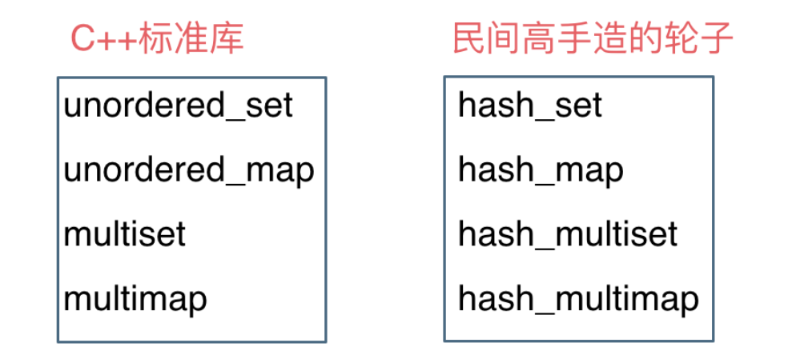

# cpp_data_structure 

* 代码随想录 https://programmercarl.com/

* 一个有非常简明例子的cpp网站：https://en.cppreference.com/w/
  <br> 例如，查看std::vector的assign的用法：https://en.cppreference.com/w/cpp/container/vector/assign
  <br> 三种方式通过一个例子完美解释了，还夹带lambda干货。

--------------------------------------------------------------------------------

```c++
// STL（标准模板库） 
#include <array>               // std::array                                    容器
#include <vector>              // std::vector                                   容器
#include <list>                // std::list                                     容器
#include <stack>               // std::stack                                    容器适配器
#include <queue>               // std::queue          std::priority_queue       容器适配器
#include <deque>               // std::deque                                    容器
#include <string>              // std::string                                   容器
#include <map>                 // std::map            std::multimap             容器   
#include <set>                 // std::set            std::multiset             容器
#include <unordered_map>       // std::unordered_map  std::unordered_multimap   容器
#include <unordered_set>       // std::unordered_set  std::unordered_multiset   容器

// 与STL 容器有关的头文件
// <algorithm>是标准模版库（STL）中最重要的头文件之一，提供了大量基于迭代器的非成员模板函数。
#include <algorithm>   // remove()、remove_if()、find_if()、sort、...
// https://blog.csdn.net/szplzx1314/article/details/120644640

#include <iterator> // next() prev() distance() advance()
```

--------------------------------------------------------------------------------

# STL container 容器

--------------------------------------------------------------------------------

## 映射std::unordered_map 
## 集合std::unordered_set 

## _7_STL_map_set.md

--------------------------------------------------------------------------------

> <font color="gree">几个模板类的对比</font>
> 
> | 模板类               | 查询效率   | 增删效率   | 备注   |
> | :-----               | :----     | :----     | :----  |
> | `std::array`         | `O(n)`    | `O(1)`    | 固定大小，不如`vector` |
> | `std::vector`        | `O(n)`    | `O(1)`    | 需要频繁增删时，用`vector` |
> | `std::unordered_set` | `O(1)`    | `O(1)`    | 只需要判断有没有时，用`unordered_set`就行。`key`存储元素值 |
> | `std::unordered_map` | `O(1)`    | `O(1)`    | 需要判断有没有，又需要判断出现的次数，就需要`map`。 `key`存储元素值，`value`存储元素出现次数 |
> 
> <font color="gree">当频繁查询时，优先用`std::set`或`std::map`</font>
>
> <font color="gree">当频繁增删时，优先用`std::vector`或`std::stack`或`std::queue`</font>
>

> 
> <font color="yellow">
> 
> 我们用`std::unordered_map<key, obj>`，很多时候都是为了判断每个`key`的个数
>
> 即，我们的`key`为一个元素，`obj`为这个值出现的次数
>
> 如果只需要判断有没有这个值，不需要判断个数，那么`std::unorder_set`足够了
>
> 因为`set`的元素不像`map`那样可以同时拥有实值(`value`)和键值(`key`), `set`元素的键值就是实值(`key = value`), 而且系统能根据元素的值自动进行排序，
> 
> </font>
> 

--------------------------------------------------------------------------------

### 代码随想录的内容

> 
> <font color="yellow">当我们想使用哈希法来解决问题的时候，我们一般会选择如下三种数据结构。</font>
> 
> * 数组(`vector`)
> * 集合(`set`)
> * 映射(`map`)
> 
> 这里数组就没啥可说的了，我们来看一下`set`。
> 
> 在C++中，`set` 和 `map` 分别提供以下三种数据结构，其底层实现以及优劣如下表所示：
> 
> <div align=center>
> 
> </div>
> 
>
> `std::unordered_set` 底层实现为哈希表，`std::set` 和`std::multiset` 的底层实现是红黑树，红黑树是一种平衡二叉搜索树，所以`key`值是有序的，但`key`不可以修改，改动`key`值会导致整棵树的错乱，所以**只能删除和增加**。
> 
> 
> <div align=center>
> 
> </div>
> 
>
> `std::unordered_map` 底层实现为哈希表，`std::map` 和`std::multimap` 的底层实现是红黑树。同理，`std::map` 和`std::multimap` 的`key`也是有序的（这个问题也经常作为面试题，考察对语言容器底层的理解）。
>
> <font color="yellow">
> 
> 当我们要使用集合`set`来解决哈希问题的时候，该如何选择？
> 
> * 优先使用`unordered_set`，因为它的查询和增删效率是最优的
> 
> * 如果需要集合是有序的，那么就用`set`
> 
> * 如果要求不仅有序还要有重复数据的话，那么就用`multiset`
> 
> </font>
> 
>
> 
> 那么再来看一下`map` ，在`map`中 是一个`(key，value)` 的数据结构，`map`中，对`key`是有限制，对`value`没有限制的，因为`key`的存储方式使用红黑树实现的。
>
> 其他语言例如：`java`里的`HashMap` ，`TreeMap` 都是一样的原理。可以灵活贯通。
> 
> <font color="green">虽然`std::set`、`std::multiset` 的底层实现是红黑树，不是哈希表（即`std::set`、`std::multiset` 使用红黑树来索引和存储），不过给我们的使用方式，还是哈希法的使用方式，即`key`和`value`。所以使用这些数据结构来解决映射问题的方法，我们依然称之为哈希法。 `map`也是一样的道理。</font>
>
> 
> 这里在说一下，一些`C++`的经典书籍上 例如`STL`源码剖析，说到了`hash_set`， `hash_map`，这个与`unordered_set`，`unordered_map`又有什么关系呢？
>
> 
> 实际上功能都是一样一样的， 但是`unordered_set`在`C++11`的时候被引入标准库了，而`hash_set`并没有，所以建议还是使用`unordered_set`比较好，这就好比一个是官方认证的，`hash_set`，`hash_map` 是`C++11`标准之前民间高手自发造的轮子。
>
> 
> <div align=center>
> 
> </div>
> 

> **总结**：
>
> <font color="green">注意：以下内容中，有`std::`前缀时，才指的是具体容器，否则都是抽象概念</font>
>
> `set` 和 `map` 的<font color="yellow">相同点</font>
> 
> * 都是 `key`和`value` 对应
> 
> * 都有三种容器 `std::xxx`、`std::multixxx`、`std::unordered_xxx` (`xxx` = `set`或`map`)
> 
> * <font color="yellow">都是优先使用`std::unordered_xxx` (`xxx` = `set`或`map`)</font>
>
> * <font color="yellow">如果需要`key`是有序的，则使用`std::multixxx` (`xxx` = `set`或`map`)</font>
>
> * <font color="yellow">如果要求不仅`key`有序还要有重复`value`的话，才需要使用`std::xxx`(`xxx` = `set`或`map`)</font>
>
> * 虽然`std::xxx`、`std::multixxx`的底层实现并不是哈希表，而是红黑树，但是从使用方式的角度来说，还是哈希法的使用方式，即`key`和`value`。所以使用这些数据结构来解决映射问题的方法，我们依然称之为哈希法
>
> * 都能通过迭代器进行遍历；
>
> 
> `set` 和 `map` 的<font color="yellow">不同点</font>
>
> * `set`是值`value`的集合；`map`是`(key，value)`键值对
> 
> * `set`因为只有值`value`，不能通过`get`方法取值；`map`可以通过`get`方法获取值
>
> * `set`的值是唯一的可以做数组去重，`map`由于没有格式限制，可以做数据存储
>
> * <font color="yellow">由于`std::map`是`key_value`的形式，所以`std::map`里的所有元素都是`std::pair`类型。`std::pair`里面的`std::pair::first`被称为`key`(键），`std::pair::second`被称为`value`(值）。它可以通过关键字`key`查找映射关联信息`value`，同时根据`key`值进行排序。</font>
> 
>
> 

> <font color="yellow">代码随想录的补充：</font>
> 
> 其中，除了上述的三种`std::xxx`、`std::multixxx`、`std::unordered_xxx` (`xxx` = `set`或`map`)
>
> 还有一种`std::unordered_multixxx` (`xxx` = `set`或`map`)
>
> 即 `std::unordered_multimap`、`std::unordered_multiset`
>
> 结合了`unordered`和`multimap`的两个前缀修饰词特点
>
> 


--------------------------------------------------------------------------------

### 别的博客的内容


#### 最全的关联容器总结

> 
> `map`容器和`set`容器都属于**关联容器**。
> 
> 在关联容器中，对象的位置取决于和它关联的键值(`key`)。
> 
> **key（键值）可以是基本类型也可以是类类型**。
> 
> <font color="yellow">关联容器是与非关联容器（顺序容器）相对应的，顺序容器中元素的位置不依赖于元素的值，而是和该元素加入容器时的位置有关。</font>
> 
> 关联容器的类型有下面八种：
> 
> ```html
> 按关键字有序保存元素
> map                      关联数组；保存关键字-值对
> set                      关键字即值，只保存关键字的容器
> multimap                 关键字可以重复出现的map
> multiset                 关键字可以重复出现的set
>  
> 无序关联容器
> unordered_map            用哈希函数组织的map，无序
> unordered_set            用哈希函数组织的set，无序
> unordered_multimap       哈希组织的map；关键字可以重复
> unordered_multiset       哈希组织的set，关键字可以重复
> ```
>
> <font color="yellow">记忆方法
> 
> * 单独的`map`、`set`是`key`有序，内容不可重复的
>
> * 前缀`multi`，意思是`key`可以重复的
>
> * 前缀`unordered`, 意思是`key`无序的
> 
> </font>
>
> 
>
> * `multi`前缀表明键值不必唯一，但是如果没有这个前缀，键值必须唯一。
> 
> * `unordered`前缀表明容器中元素的位置是通过其键值(`key`)所产生的哈希值(`hashCode(key)`或`hashCode(key) % tableSize`)来决定的，而不是通过比较键值(`key`)决定的，即容器中的元素是无序的。如果没有这个前缀，则容器中元素是由比较键值(`key`)决定的，即有序。
>
> 
> <font color="yellow">一般来说，我们只需要用到`unordered_map`和`unordered_set`</font>
>
> <font color="yellow">如果需要有序，那不如用`std::vector`了，或者`std::queue<pair<type1, type2>>`</font>
>
> 
> <font color="gree">注意：`value`是可以重复的，`key`却不是可以重复的，除非有前缀`multi`</font>
>


> 头文件
> 
> ```c++
> #include <map>                 // std::map            std::multimap             容器   
> #include <set>                 // std::set            std::multiset             容器
> #include <unordered_map>       // std::unordered_map  std::unordered_multimap   容器
> #include <unordered_set>       // std::unordered_set  std::unordered_multiset   容器
> ```

--------------------------------------------------------------------------------

> 
> <font color="yellow">
> 
> 我们用`std::unorder_maped<key, obj>`，很多时候都是为了判断每个`key`的个数
>
> 即，我们的`key`为一个元素，`obj`为这个值出现的次数
>
> 如果只需要判断有没有这个值，不需要判断个数，那么`std::unorder_set`足够了
>
> 因为`set`的元素不像`map`那样可以同时拥有实值(`value`)和键值(`key`), `set`元素的键值就是实值(`key = value`), 而且系统能根据元素的值自动进行排序，
> 
> </font>
>
> 
--------------------------------------------------------------------------------


####  map（集合）

> 
> `CppReference`参考资料
> https://en.cppreference.com/w/cpp/container/map
> https://en.cppreference.com/w/cpp/container/multimap
> https://en.cppreference.com/w/cpp/container/unordered_map
> https://en.cppreference.com/w/cpp/container/unordered_multimap
> 

> 
> `CSDN`参考博客
> https://blog.csdn.net/qq_28584889/article/details/83855734 
> https://blog.csdn.net/qq_28584889/article/details/83833296
> 

##### map容器概述

> 
> `map`容器是**关联容器**的一种。
> 
> 在关联容器中，对象的位置取决于和它关联的键值(`key`)。
> 
> **key（键）可以是基本类型也可以是类类型**。
> 
> <font color="yellow">关联容器是与非关联容器（顺序容器）相对应的，顺序容器中元素的位置不依赖于元素的值，而是和该元素加入容器时的位置有关。</font>
> 
> `map`容器有四种，每一种都是由类模板定义的。所有类型的`map`容器保存的都是键值对象对`pair<const type_K key, type_T obj>`的元素。`map`容器的元素是`pair<const K, T>`类型的对象，这种对象封装了一个`T`类型的对象和一个与其关联的`K`类型的键。<font color="yellow">`pair`元素中的键是`const`，因为修改键会扰乱容器中元素的顺序</font>。
> 
> 每种`map`容器的模板都有不同的特性：
>
> 1. `map`容器：`map`的底层是由红黑树实现的，红黑树的每一个节点都代表着`map`的一个元素。该数据结构具有自动排序的功能，因此`map`内部的元素都是有序的，元素在容器中的顺序是通过比较键值确定的。默认使用` less<K> `对象比较。
>
> 2. `multimap`容器：与`map`容器类似，区别只在于`multimap`容器可以保存键值相同的元素，即`key`可以相同，但是不知道是**拉链法**还是**线性探测法**
> 
> 3. `unordered_map`容器：该容器的底层是由哈希(又名散列)函数组织实现的。<font color="yellow">元素的顺序并不是由键值(`key`)决定的，而是由键值(`key`)的哈希值(`hashCode(key)`)确定的，哈希值是由哈希函数生成的一个整数</font>。利用哈希函数，将关键字的哈希值都放在一个桶（`bucket`）里面，具有相同哈希值的放到同一个桶。`unordered_map`内部元素的存储是无序的，也不允许有重复键值的元素，相当于`java`中的`HashMap`。
>
> 4. `unordered_multimap`容器：也可以通过键值生成的哈希值(`hashCode(key)`)来确定对象的位置，但是它允许有重复的元素`obj`。
>
> 
> <font color="yellow">注意：</font>
> 
> 1. <font color="yellow">"有序"也是有不同的排序方法的，一般`map`和`multimap`都有四个参数</font>
>
> ```c++
> template<
>     class Key,
>     class T,
>     class Compare = std::less<Key>,
>     class Allocator = std::allocator<std::pair<const Key, T>>
> > class map;
> 
> template<
>     class Key,
>     class T,
>     class Compare = std::less<Key>,
>     class Allocator = std::allocator<std::pair<const Key, T>>
> > class multimap;
> ```
> <font color="green">"`有序`"的排序方式默认为`std::less<Key>`，即根据`key`来排序，显得"`有序`"</font>
> 
> 2. <font color="yellow">由于"无序"不是真正的无序，而是按照`hashCode(key)`进行排序，那么参数就有所不同</font>
> 
> ```c++
> template<
>     class Key,
>     class T,
>     class Hash = std::hash<Key>,
>     class KeyEqual = std::equal_to<Key>,
>     class Allocator = std::allocator< std::pair<const Key, T> >
> > class unordered_map;
> 
> template<
>     class Key,
>     class T,
>     class Hash = std::hash<Key>,
>     class KeyEqual = std::equal_to<Key>,
>     class Allocator = std::allocator< std::pair<const Key, T> >
> > class unordered_multimap;
> ```
> <font color="green">"`无序`"的排序方式默认为`std::hash<Key>`，即根据`hashCode(key)`或`hashCode(key) % tableSize`排序，显得"`无序`"</font>
> 
> 
> <div align=center>
> 
> </div>
> 
> 
> **关于自定义排序方式**
> 
> <font color="yellow">
> 
> 如果要自定义排序方式，肯定是`std::map`或`std::multimap`，
> 
> 因为`std::unordered_map`和`std::unordered_multimap`, 本意就是无序的`map`，所以没有排序的说法，更不要说自定义排序方式
> 
> </font>
>


#####  std::unordered_map 概述

> 从一个例子开始
>
> ```c++
> #include <iostream>
> #include <unordered_map>
> using namespace std;
> int main(void) {
>    unordered_map<char, int> um1 = {
>             {'a', 1},
>             {'b', 2},
>             {'c', 3},
>             {'d', 4},
>             {'e', 5}
>             };
>    unordered_map<char, int>um2(um1);
>    cout << "Unordered_map contains following elements" << endl;
>    for (auto it = um2.begin(); it != um2.end(); ++it)
>       cout << it->first << " = " << it->second << endl;
>    return 0;
> }
> ```
> 编译并运行，结果如下
> ```c++
> Unordered_map contains following elements
> e = 5
> a = 1
> b = 2
> c = 3
> d = 4
> ```
> 

> 
> `unordered_map`与`map`的区别在于：因为底层是由哈希表实现，所以查找速度非常快，查找时间以`O(1)`计。但是缺点是哈希表的建立比较耗费时间。所以当查找比较频繁的时候可以考虑`unordered_map`。
>
> `[unordered_map模板]`
> 
> ```c++
> template<
>     class Key,                                                   // unordered_map::key_type
>     class T,                                                     // unordered_map::mapped_type
>     class Hash = std::hash<Key>,                                 // unordered_map::hasher
>     class KeyEqual = std::equal_to<Key>,                         // unordered_map::key_equal
>     class Allocator = std::allocator< std::pair<const Key, T> >  // unordered_map::allocator_type
> > class unordered_map;
> ```
> 
> `[包含的头文件]`
> 
> ```c++
> #include<unordered_map>
> ```
>
> `[迭代器]`
>
> `unordered_map`的迭代器是一个指针，指向容器中的元素，通过迭代器可以访问元素。
>
> ```c++
> unordered_map<Key,T>::iterator it;
> (*it).first;             // the key value (of type Key)
> (*it).second;            // the mapped value (of type T)
> (*it);                   // the "element value" (of type pair<const Key,T>) 
> ```
> 
> `unordered_map`中元素的键值分别是迭代器的`first`和`second`的属性。上面是用迭代器的解引用的方式访问，也可以用指针访问运算符直接访问元素的键值。
>
> ```c++
> it->first;               // same as (*it).first   (the key value)
> it->second;              // same as (*it).second  (the mapped value) 
> ```
>
> `[成员函数]`
> 
> ```c++
> ===============================迭代器================================
> 
> begin         返回指向容器起始位置的迭代器（iterator）
> end           返回指向容器末尾的迭代器
> cbegin        返回指向容器起始位置的常迭代器（const_iterator）
> cend          返回指向容器末尾位置的常迭代器
> 
> ===============================Capacity==============================
>
> size          返回有效元素的个数
> max_size      返回unordered_map支持的最大元素个数
> empty         判断是否为空
>
> ===============================访问元素===============================
>
> operator[]    访问元素（不进行下标越界检查）
> at            访问元素（进行下标越界检查，增加了性能开销）
>
> ===============================修改元素===============================
>
> insert        插入元素
> erase         删除元素
> swap          交换内容
> clear         清空内容
> emplace       构造及插入一个元素
> emplace_hint  按照提示构造及插入一个元素
>
> ================================操作==================================
>
> find          通过给定主键查找元素,没找到：返回unordered_map::end
> count 　　　　 返回匹配给定主键的元素的个数 
> equal_range   返回值匹配给定搜索值的元素组成的范围 
>
> ==============================Buckets=================================
>
> bucket_count 　　　  返回槽（Bucket）数 
> max_bucket_count    返回最大槽数 
> bucket_size 　　　   返回槽大小 
> bucket 　　　　　　  返回元素所在槽的序号 
> load_factor　　　　  返回载入因子，即一个元素槽（Bucket）的最大元素数 
> max_load_factor 　  返回或设置最大载入因子 
> rehash　　　　　　   设置槽数 
> reserve 　　　　　   请求改变容器容量
>
> ======================================================================
>
> ```
> 
> `[自定义排序方式]`
> 
> <font color="yellow">
>
> `std::unordered_map`不能自定义排序方式
> 
> 如果要自定义排序方式，肯定是`std::map`或`std::multimap`，
> 
> 因为`std::unordered_map`和`std::unordered_multimap`, 本意就是无序的`map`，所以没有排序的说法，更不要说自定义排序方式
> 
> </font>
>


##### std::map 讲解 + 例子

> https://blog.csdn.net/qq_28584889/article/details/83855734

1. `map`的创建以及初始化列表
>
> `map`类模板有`5`个类型参数，但是一般只需要指定前`2`个模板参数的值。第一个是键值(`type_K key`)的类型，第二个是所保存对象的类型(`type_T obj`)。我们通常所用的一种构造一个map对象的方法是：
> 
> ```c++
> map<string, int> mapStudent;
> ```
>
> 当初始化一个`map`时，必须提供`关键字类型`和`值类型`。我们将每个`关键字-值对`包围在花括号中：` {key，value}` 来指出它们一起构成了`map`中的一个元素。**初始化列表**有两种方式：
>
> ```c++
> map<string, string> authors = { {"Joyce", "James"},
>                                 {"Austen", "Jane"},
>                                 {"Dickens", "Charles"} };
> ```
> 或者：
> ```c++
> map<string, string> authors { {"Joyce", "James"}, {"Austen", "Jane"}, {"Dickens", "Charles"} };
> ```
>
> <font color="gree">但是需要注意的是：初始化列表的方式是C++11的新特性，对版本比较早的编译器不支持这一特性</font>。
>
>
> <font color="yellow">
> 
> 注意，当`map`内元素值为`int`类型或`常量`时，默认值为`0`。
>
> 即当`map<type_K, int>`时，`int`对象的默认值为`0`，如果不想初始化为`0`，记得手动设置初始值
> 
> </font>
>
> 1. `map`内元素值为`int`类型, 默认值为`0`
> 
> ```c++
> map<int,int> table;
> table[1]=1;
> 
> cout<<table[0]<<endl;
> cout<<table[1]<<endl;
> ```
> 编译并运行，结果如下：
>
> ```c++
> 0
> 1
> ```
>
> 2. `map`内元素值为`常量`类型, 默认值为`0`
>
> ```c++
> enum Symbols { //第一个枚举元素默认值为0，后续元素递增+1。
>     // 终结符号 Terminal symbols：TS
>     TS_I,           // i
>     TS_PLUS,        // +
>     TS_MULTIPLY,    // *
>     TS_L_PARENS,    // (
>     TS_R_PARENS,    // )
>     TS_EOS,         // #
>     TS_INVALID,     // 非法字符
>  
>     // 非终结符号 Non-terminal symbols：NS
>     NS_E,           // E
>     NS_T,           // T
>     NS_F            // F
> };
> 
> int main(){
>     ...
>     map<int, enum Symbols> table;
>  
>     table[1]=TS_PLUS;
>  
>     cout<<table[0]<<endl;
>     cout<<table[1]<<endl;
>     ...
> }
> ```
> 编译并运行，结果如下：
>
> ```c++
> 0
> 1
> ```
>
> 3. `map`内元素值为`string`类型, 默认值不明，不显示
>
> ```c++
> map<int,string> table;
> table[0]="abc";
> 
> table[2]="ghi";
> 
> cout<<table[0]<<endl;
> cout<<table[1]<<endl;
> cout<<table[2]<<endl;
> ```
> 编译并运行，结果如下：
>
> ```c++
> abc
> 
> ghi
> ```
>


2. `map`的一般常用属性（方法）
>
> ```c++
> size         返回有效元素个数
> max_size     返回容器支持的最大元素个数
> empty        判断容器是否为空，为空是返回true，否则返回false
> clear        清空map容器
> ```
> 


3. `map`插入数据
>
> 在构造`map`容器后，我们就可以往里面插入数据了。这里讲`4`种常见的数据插入方法。
>
> <font color="yellow">用`emplace`最简洁</font>
> 
> **第一种：用`insert`函数插入`pair`数据**
>
> ```c++
> map<string, int> mapStudent;//创建map
> mapStudent.insert(pair<string, int>("student_one", 22));
> mapStudent.insert(pair<string, int>("student_two", 25));
> mapStudent.insert(pair<string, int>("student_three", 21));
> ```
> 或者使用`make_pair`
> ```c++
> map<string, int> mapStudent;
> mapStudent.insert(make_pair("student_one", 22));
> mapStudent.insert(make_pair("student_two", 25));
> mapStudent.insert(make_pair("student_three", 21));
> ```
> 
> **第二种：用`insert`函数插入`value_type`数据**
>
> ```c++
> map<string, int> mapStudent;//创建map
> mapStudent.insert(map<string, int>::value_type("student_one", 22));
> mapStudent.insert(map<string, int>::value_type("student_two", 25));
> mapStudent.insert(map<string, int>::value_type("student_three", 21));
> ```
> 
> **第三种：用数组方式插入数据**
>
> ```c++
> map<string, int> mapStudent;//创建map
> mapStudent["student_one"] = 22;
> mapStudent["student_two"] = 25;
> mapStudent["student_three"] = 21;
> ```
> 
> **第四种：用`emplace`函数插入数据**
>
> ```c++
> map<string, int> mapStudent;
> mapStudent.emplace("student_one", 22);
> mapStudent.emplace("student_two", 25);
> mapStudent.emplace("student_three", 21);
> ```
> 
> 这几种插入方法的区别：
> 
> * 用`insert`函数的效果是一样的，在数据的插入上涉及到集合的唯一性这个概念，即<font color="yellow">当`map`中有某个关键字时，`insert`操作是失败的。</font>
> 
> * `emplace`插入效果跟`insert`效果一样。
> 
> * 用数组方式插入数据就不同，它可以覆盖以前该关键字对应的值。
>
> 

4. `map`数据的访问和遍历
>
> ```c++
> map访问和查找元素的常用方法有：
> ====================================================================
>
> operator[]    访问元素，也可以用于修改某个元素的value值；
>               不进行下标（关键字）是否存在的检查
>               （即如果关键字不存在，程序运行不会出错）
>               访问到某个元素时，如果该元素的键值不存在则直接创建该元素，返回是初始的值
>               （比如int型的初始为0，则返回0，string初始为NULL，则返回NULL）
> 
> at            访问元素，也可以用于修改某个元素的value值；
>               会进行下标（关键字）是否存在的检查，
>               如果关键字不存在，则会拋出 out_of_range 异常。
>
> ====================================================================
> 
> 利用迭代器访问元素
> 
> **********************************************************************
> map<K, T>::iterator it;
> (*it).first;             // the key value (of type Key)  
> (*it).second;            // the mapped value (of type T)
> (*it);                   // the "element value" (of type pair<const Key,T>) 
> 元素的键值和value值分别是迭代器的first和second属性。也可以用迭代器指针直接访问。
> it->first;               // same as (*it).first   (the key value)
> it->second;              // same as (*it).second  (the mapped value) 
>
> ********************************************************************
>
> 迭代器的成员函数：
> begin 　　 返回指向容器起始位置的迭代器（iterator） 
> end 　　   返回指向容器末尾位置的迭代器 
> cbegin　   返回指向容器起始位置的常迭代器（const_iterator） 
> cend 　　  返回指向容器末尾位置的常迭代器（当不需要对元素进行写访问时使用常迭代器）
> rbegin     返回指向容器起始位置的反向迭代器（reverse_iterator）
> rend       返回指向容器末尾位置的反向迭代器 
>
> ####################################################################
> 
> 查找某键值的元素是否存在：
> count      若存在，返回1；不存在返回0
> find       若存在返回指向元素的迭代器指针，不存在返回end()
> ====================================================================
> ```
> 
> **1. 使用前向迭代器遍历`map`**
>
> ```c++
> //使用前向迭代器遍历map
> map<string, int>::iterator iter;
> for (iter = mapStudent.begin(); iter != mapStudent.end(); iter++)
> 	cout << iter->first << " " << iter->second << endl;
>  
> //当然也可以使用迭代器指针解引用的形式访问
> for (map<string, int>::iterator iter = mapStudent.begin(); iter != mapStudent.end(); iter++)
> 	cout << (*iter).first << " " << (*iter).second << endl;
> ```
>
> <font color="yellow">当然，这两种形式的访问都是可以改变元素中的`value`值的，即可以进行写访问。例子如下：</font>
>
> ```c++
> map<string, int> mapStudent;      //创建map
> mapStudent["student_one"] = 22;   //mapStudent.emplace("student_one", 22);
> mapStudent["student_two"] = 25;   //mapStudent.emplace("student_two", 25);
> mapStudent["student_three"] = 21; //mapStudent.emplace("student_three", 21);
>  
> map<string, int>::iterator iter;
> for (iter = mapStudent.begin(); iter != mapStudent.end(); iter++)
> 	cout << iter->first << " " << iter->second << endl; //遍历
>
> cout << endl;
> 
> for (iter = mapStudent.begin(); iter != mapStudent.end(); iter++)
> 	 (*iter).second = 100; //将mapStudent中的元素value值全部改为100
>  
> for (iter = mapStudent.begin(); iter != mapStudent.end(); iter++)
> 	cout << iter->first << " " << iter->second << endl; //遍历
> ```
> 输出结果如下：
> ```c++
> student_one 22
> student_three 21
> student_two 25
> 
> student_one 100
> student_three 100
> student_two 100
> ```
>
> <font color="yellow">如果改用`const_iterator`，则两种方式都不能进行写访问。</font>
> 
> 
> **2. 使用反向迭代器遍历`map`**
>
> ```c++
> map<string, int>::reverse_iterator iter;
>  
> for (iter = mapStudent.rbegin(); iter != mapStudent.rend(); iter++)
> 	cout << iter->first << " " << iter->second << endl; //反向遍历
> ```
> 
> 反向迭代器，顾名思义，就是倒着访问容器中元素的。
>
> 
> **3. 使用`auto`关键字**
>
> `C++`中`auto`关键字具有自动进行类型检查的功能，可以少些不少代码。比如可以将`1.`中的代码直接改为：
> 
> ```c++
> for (auto it = mapStudent.begin(); it != mapStudent.end(); it++)
> 	cout << it->first << " " << it->second << endl; //遍历
> ```
> 
> <font color="yellow">当然你还可以使用范围`for`语句更简练的遍历`map`容器：</font>
>
> ```c++
> for (auto x : mapStudent){
> 	cout << x.first << " " << x.second << endl;
> }
> ```
>
> <font color="yellow">如果需要对元素进行写操作的话，循环变量`x`必须要声明成引用类型`&x`</font>。
>
> <font color="yellow">在`范围for语句`中，预存了`end()`的值，一旦在序列中添加（删除）元素，end函数的值就可能变的无效了, 所以如果要增删，就不要用`范围for语句`</font> 
> 
> **4. 使用数组的方式遍历（不具有普适性，key必须为int类型）**
> 
> <font color="yellow">
> 
> 用数字访问`vector`时，下标是从`0-（size-1）`，而用数字访问`map`，却是从`1~size`,这是有所不同的。
> 
> 而且`map`使用`[i]`遍历有一个非常重要的前提: `key`的类型为`int`，所以本质上还是根据`key`进行访问
> 
> </font> 
> 
> ```c++
> map<int,string> mapStudent;
> mapStudent[1] =  "student_one";
> mapStudent[2] =  "student_two";
> mapStudent[3] =  "student_three";
> //数组方式遍历，前提是key的类型为int
> for(size_t i = 1; i <= mapStudent.size(); i++){
>     cout << i << " " << mapStudent[i] << endl;
> } 
> 
> cout << endl;
> // 迭代器方式遍历，不用限定key的类型
> map<int,string>::iterator iter;
> for (iter = mapStudent.begin(); iter != mapStudent.end(); iter++)
> 	cout << iter->first << " " << iter->second << endl; //遍历
> ```
> 编译并运行，结果如下
> ```c++
> 1 student_one
> 2 student_two
> 3 student_three
> 
> 1 student_one
> 2 student_two
> 3 student_three
> ``` 


5. `map`数据的删除
>
> `map`容器中删除一个元素要使用`erase`函数，只要有以下几种用法。
> 
> ```c++
> //使用关键字删除
> int res = mapStudent.erase("student_one"); //删除成功返回1，失败返回0；只有使用关键字删除时才有返回值
> cout << "res=" << res << endl;
>  
> //使用迭代器删除
> map<string, int>::iterator iter;
> iter = mapStudent.find("student_two");
> mapStudent.erase(iter);
>  
> //使用迭代器删除一个范围的元素
> auto it = mapStudent.begin();
> mapStudent.erase(it, mapStudent.find("student_two"));
> ```
> 
> 


6. `map`中关键词的排序

> 
> <font color="yellow">
> 
> 如果要自定义排序方式，肯定是`std::map`或`std::multimap`，
> 
> 因为`std::unordered_map`和`std::unordered_multimap`, 本意就是无序的`map`，所以没有排序的说法
> 
> </font>
>

> 
> `STL map`中重载`operator()<`的运算符，默认是采用小于号来排序的，以上代码在排序上是不存在任何问题的，因为上面的关键字是`string`类型，它本身支持小于号运算。`string`类型的关键字排序是按照字符串中的字符的顺序，如果第一个字符相同就比较第二个，如果前两个都相同就比较第三个，以此类推..... 如果关键词是`int`型的话，就直接按照大小排序了。
>
> 在一些特殊情况，比如关键字是一个结构体，涉及到排序就会出现问题，因为它没有小于号操作，`insert`等函数在编译的时候过不去，下面给出两个方法解决这个问题。
>
>
> <font color="gree"> 
> 
> 两种情况：
> 
> * 如果对象是结构体或类，可以在结构体或类的定义中重载 `<` 和 `>` 运算符，也可以定义仿函数
> > 并不是一定要同时定义 `<` 和 `>` 运算符
> > `priority_queue`中
> > * 默认使用`less<T>`判断式比较元素大小，因此可以只定义 `<` 符号的重载以满足使用
> > 
> > * 如果使用`greater<T>`判断式比较元素大小，因此可以可以只定义 `>` 符号的重载以满足使用
> > 
>
> * 如果没有结构体或类，只能用仿函数
>
> 为了更具有普适性，一般我用仿函数
>
> </font>
>


> <font color="yellow"> 
> 
> 先看内置类型`int`的默认`less<int>`的具体效果
> 
> </font>
>
> ```c++
> #include<map>
> 
> int main()
> {
> 	map<int, string> mapNum;
> 	//等价于map<int, string, less<int>> mapNum;
> 	map<int, string>::iterator iter;
> 	//等价于map<int, string, less<int>>::iterator iter;
> 	int num;
> 	num = 1002;
> 	mapNum.insert(pair<int, string>(num, "number_one"));
> 	num = 1001;
> 	mapNum.insert(pair<int, string>(num, "number_two"));
> 	for (iter = mapNum.begin(); iter != mapNum.end(); iter++)
> 		cout << iter->first << ", " << iter->second << endl;
> 
> 
>     cout << endl;
>     pause();
> 
>     return 0;
> }        
> ```
> 编译并运行，结果如下
> ```c++
> 1001, number_two
> 1002, number_one
> ```
>
> 
> <font color="yellow"> 
> 
> 同理，再看内置类型`int`的`greater<int>`的具体效果
> 
> </font>
> 
> ```c++
> #include<queue>
> 
> int main()
> {
> 	map<int, string, greater<int>> mapNum;
> 	map<int, string, greater<int>>::iterator iter;
> 	int num;
> 	num = 1002;
> 	mapNum.insert(pair<int, string>(num, "number_one"));
> 	num = 1001;
> 	mapNum.insert(pair<int, string>(num, "number_two"));
> 	for (iter = mapNum.begin(); iter != mapNum.end(); iter++)
> 		cout << iter->first << ", " << iter->second << endl;
> 
>     cout << endl;
>     pause();
> 
>     return 0;
> }        
> ```
> 编译并运行，结果如下
> ```c++
> 1002, number_one
> 1001, number_two
> ```
>
> <font color="yellow"> 
> 
> 很奇怪
> 
> * 为什么`less<int>`时，`std::map<int, string>`的`begin()`的`key`是最小`min`?
> 
> * 为什么`greater<int>`时，`std::map<int, string, greater<int>>`的`begin()`的`key`是最大`max`?
>
> </font>
>
> 入队时，排序调整后，`key`的优先级最大的元素排在最前面，也就是队首指向的位置(`begin()`)，这时候队尾指向的位置(`end()-1`)是优先级最小的元素
>
>
> 如何用代码体会？
>
> ```c++
> // class int
> 
> struct int_num {
>     int num;
>     // 重载<运算符
>     bool operator<(const int &b) const {
>         return this->num < b.num ? true : false;
>     }
> };
>  
> // 当this->num 小于 b.num时
> // 返回true，交换位置； 返回false， 不交换位置
> // less的意思是越低，优先级越高
> // 即为后入队元素<先入队的元素时，后入队的元素优先级更高，交换位置; 
> // 即为后入队元素>=先入队的元素时，后入队的元素优先级更低，不交换位置; 
> // 最终，队头的元素最小，队尾的元素最大，
> ```
> 
> 对于`less<int>`, 对应`<`重载运算符。
> 
> 哪个小，哪个优先级高，哪个放在最前面，这样看`begin()`指向的队头元素是最小的， `end()-1`指向的队尾元素最大
>
>
> <font color="yellow"> 
> 
> 比较方式总结：
>
> `集合std::set`(`key`就是`value`)
>
> * `less`: `key`越小，优先级越高，越靠近队头（`begin()`）
>
> * `greater`: `key`越大，优先级越高，越靠近队头（`begin()`）
>
> `映射std::map`(`pair<key, value>`)
>
> * `less`: `key`越小，优先级越高，越靠近队头（`begin()`）
>
> * `greater`: `key`越大，优先级越高，越靠近队头（`begin()`）
>
> 
> `优先级队列std::priority_queue`
>
> * `less`: `key`越小，优先级越高，越靠近队头。对应大根堆(`top`指向的队尾元素最大`max`),
> * `greater`: `key`越大，优先级越高，越靠近队头。对应小根堆(`top`指向的队尾元素最小`min`)
>
> 
> 以上的`std::less`和`std::sort()函数`的`std::less`功能正好相反
> 以上的`std::greater`和`std::sort()函数`的`std::greater`功能正好相反
> </font>
>
> 


> **第一种：无重载，无仿函数，无法编译通过**，程序举例
```c++
#include <iostream>
#include <string>
#include <map>
 
using namespace std;
 
typedef struct tagStudentInfo
{
	int nID;
    string strName;
}StudentInfo, *PStudentInfo;  //学生信息
 
int main()
{
	int nSize;
	//用学生信息映射分数
	map<StudentInfo, int> mapStudent;
	map<StudentInfo, int>::iterator iter;
	StudentInfo studentInfo;
	studentInfo.nID = 1001;
	studentInfo.strName = "student_one";
	mapStudent.insert(pair<StudentInfo, int>(studentInfo, 90));
	studentInfo.nID = 1002;
	studentInfo.strName = "student_two";
	mapStudent.insert(pair<StudentInfo, int>(studentInfo, 80));
	for (iter=mapStudent.begin(); iter!=mapStudent.end(); iter++)
		cout<<iter->first.nID<<endl<<iter->first.strName<<endl<<iter->second<<endl;
  
	pause();
	return 0;
}
/****以上程序是无法编译通过的******/
```

> **第二种：小于号重载**，程序举例
```c++
#include <iostream>
#include <string>
#include <map>
 
using namespace std;
 
typedef struct tagStudentInfo
{
	int nID;
	string strName;
	bool operator < (tagStudentInfo const& _A) const
	{
		//这个函数指定排序策略，按nID排序，如果nID相等的话，按strName排序
		if(nID < _A.nID)  return true;
		if(nID == _A.nID) return strName.compare(_A.strName) < 0;
		return false;
	}
}StudentInfo, *PStudentInfo;  //学生信息

int main()
{
	int nSize;
	//用学生信息映射分数
	map<StudentInfo, int> mapStudent;
	//等价于map<StudentInfo, int, less<StudentInfo>> mapStudent;
	map<StudentInfo, int>::iterator iter; 
	//等价于map<StudentInfo, int, less<StudentInfo>>::iterator iter;
	StudentInfo studentInfo;
	studentInfo.nID = 1001;
	studentInfo.strName = "student_one";
	mapStudent.insert(pair<StudentInfo, int>(studentInfo, 90));
	studentInfo.nID = 1002;
	studentInfo.strName = "student_two";
	mapStudent.insert(pair<StudentInfo, int>(studentInfo, 80));
	for (iter=mapStudent.begin(); iter!=mapStudent.end(); iter++)
		cout<<iter->first.nID<<endl<<iter->first.strName<<endl<<iter->second<<endl;
  
	pause();
	return 0;
}

/****运行结果如下：******/
1001
student_one
90
1002
student_two
80
```

> **第三种：大于号重载**，程序举例
```c++
#include <iostream>
#include <string>
#include <map>
 
using namespace std;
 
typedef struct tagStudentInfo
{
	int nID;
	string strName;
	bool operator > (tagStudentInfo const& _A) const
	{
		//这个函数指定排序策略，按nID排序，如果nID相等的话，按strName排序
		if(nID > _A.nID)  return true;
		if(nID == _A.nID) return strName.compare(_A.strName) > 0;
		return false;
	}
}StudentInfo, *PStudentInfo;  //学生信息

int main()
{
	int nSize;
	//用学生信息映射分数
	map<StudentInfo, int, greater<StudentInfo>> mapStudent;
	map<StudentInfo, int, greater<StudentInfo>>::iterator iter;
	StudentInfo studentInfo;
	studentInfo.nID = 1001;
	studentInfo.strName = "student_one";
	mapStudent.insert(pair<StudentInfo, int>(studentInfo, 90));
	studentInfo.nID = 1002;
	studentInfo.strName = "student_two";
	mapStudent.insert(pair<StudentInfo, int>(studentInfo, 80));
	for (iter=mapStudent.begin(); iter!=mapStudent.end(); iter++)
		cout<<iter->first.nID<<endl<<iter->first.strName<<endl<<iter->second<<endl;
  
	pause();
	return 0;
}

/****运行结果如下：******/
1002
student_two
80
1001
student_one
90
```


>
> **第四种：仿函数的应用**，这个时候结构体中没有直接的小于号重载，定义一个比较函数，程序说明
>
> `仿函数（functor）`又称为`函数对象（function object）`是一个`能行使函数功能的类`。<font color="yellow">本质上是类 </font>。仿函数的语法几乎和我们普通的函数调用一样，不过`作为仿函数的类，都必须重载operator()运算符`，`仿函数与Lamdba表达式的作用是一致的`。
>
```c++
#include <iostream>
#include <string>
#include <map>
 
using namespace std;
 
typedef struct tagStudentInfo
{
	int nID;
    string strName;
}StudentInfo, *PStudentInfo;  //学生信息
 
class compare_nID_strName
{
public:
	bool operator() (StudentInfo const &_A, StudentInfo const &_B) const
	{
		if(_A.nID < _B.nID) return true;
		if(_A.nID == _B.nID) return _A.strName.compare(_B.strName) < 0;
		return false;
	}
};
 
int main()
{
	int nSize;
	//用学生信息映射分数
	map<StudentInfo, int, compare_nID_strName> mapStudent;
	map<StudentInfo, int, compare_nID_strName>::iterator iter;
	StudentInfo studentInfo;
	studentInfo.nID = 1001;
	studentInfo.strName = "student_one";
	mapStudent.insert(pair<StudentInfo, int>(studentInfo, 90));
	studentInfo.nID = 1002;
	studentInfo.strName = "student_two";
	mapStudent.insert(pair<StudentInfo, int>(studentInfo, 80));
	for (iter=mapStudent.begin(); iter!=mapStudent.end(); iter++)
		cout<<iter->first.nID<<endl<<iter->first.strName<<endl<<iter->second<<endl;
 
	pause();
	return 0;
}

/****运行结果如下：******/
1001
student_one
90
1002
student_two
80
```


##### 看懂 代码随想录 栈与队列 8. 前 K 个高频元素 中 `我的解法`和`代码随想录给的解法`中`std::unordered_map`的使用

> https://programmercarl.com/0347.%E5%89%8DK%E4%B8%AA%E9%AB%98%E9%A2%91%E5%85%83%E7%B4%A0.html
> 
>
> <font color="yellow"> 题目：见`_2_3_Stack_and_Queue`中`_7_top_k_frequent_elements.md`我的解法优化</font>
>
> 
> 可以把我的解法中“扫描每个数字的频次”，简化为用`std::unordered_map`统计频次，即代码随想录解法的大顶堆版本
>

> **我的解法如下**
```c++
class Solution {
public:
    class top_max {
    public:
        bool operator()(const pair<int, int>& front, const pair<int, int>& back) {
            return front.second < back.second; // top的second最大
            // return front.second > back.second; // top的second最小

            // 返回true时，交换位置，front排在back的后面
            // 这里是按照递增序列排序（top最小）
        }
    };

    vector<int> topKFrequent(vector<int>& nums, int k) {
        // ===============================扫描每个数字的频次=================================
        // 存储value，值
        vector<int> v; 
        // 存储frequency，出现频次
        vector<int> f; 

        v.push_back(nums[0]); // 先放进去第一个
        f.push_back(1);       // 第一个数的目前出现次数为1

        // 开始遍历，从nums[1]开始，计算出现次数
        for(size_t i=1; i < nums.size(); i++) {
            // 查看是否之前已经出现该值
            vector<int>::iterator it = find(v.begin(), v.end(), nums[i]);  // 返回[first，end）中第一个等于nums[i]的位置；若未找到，返回end。
            if(it != v.end()) { // num[i] 在前面已经出现了，已经存储到v中
                // 计算出数组v中的位置
                int location = it - v.begin();
                // 修改数组f中的对应位置的频次值，+1
                f[location] = f[location] + 1;
            }
            else { // it == v.end() num[i] 之前未出现
                v.push_back(nums[i]); // 第一次出现这个数，先放进去
                f.push_back(1);       // 对应的前出现次数为1            
            }
        }
        // 截止目前，时间复杂度为O(n)

        // ================================存入优先级队列，自动排序=============================
        // 优先级队列pair<value, frequency>
        priority_queue<pair<int,int>, vector<pair<int,int>>, top_max> pri_que; 
        for(size_t i=0; i < v.size(); i++) {
            pri_que.emplace(v[i], f[i]); 
            // priority_queue<pair<>>的比较规则：比较第二个元素，top.second最大
        } 
        // 截止目前，时间复杂度为O(n+k)，最坏是O(2n)

        // ==============================取出优先级队列中的前k个top元素==========================
        // 存储结果
        vector<int> result; 
        for(size_t i=0; i < k; i++) {  //前k个
           result.push_back(pri_que.top().first); 
           pri_que.pop();
        }
        // 截止目前，时间复杂度为O(n+2k)，最坏是O(3n)        

        return result;
    }
};
```

> **把我的解法中“扫描每个数字的频次”，简化为用`std::unordered_map`统计频次，即代码随想录解法的大顶堆版本**

```c++
class Solution {
public:
    class top_max {
    public:
        bool operator()(const pair<int, int>& front, const pair<int, int>& back) {
            return front.second < back.second; // top最大
            // return front.second > back.second; // top最小

            // 返回true时，交换位置，front排在back的后面
            // 这里是按照递增序列排序（top最小）
        }
    };

    vector<int> topKFrequent(vector<int>& nums, int k) {
        // ===============================扫描每个数字的频次=================================
        // 要统计元素出现频率
        // 如果要用到映射map, 则优先使用std::unordered_set，因为它的查询和增删效率是最优的
        unordered_map<int, int> map; // map<nums[i],对应出现的次数> , 
        // 即pair<key, obj>中key为数值：num[i], obj元素对象为数值：num[i]出现的次数
        // map[nums[i]] 即map(key)进行索引
        for (int i = 0; i < nums.size(); i++) {
            map[nums[i]]++;
        }
        // map[nums[i]]不需要初始化的原因为：当map内元素值为int类型或常量时，默认值为0。
        // 即当map<type_K, int>时，int对象的默认值为0，如果不想初始化为0，记得手动设置初始值

        // ================================存入优先级队列，自动排序=============================      
        // 对频率排序
        // 定义一个大顶堆
        priority_queue<pair<int, int>, vector<pair<int, int>>, top_max> pri_que;
        // 扫面所有频率的数值
        for (unordered_map<int, int>::iterator it = map.begin(); it != map.end(); it++) {
            // 三种添加方式都行
            pri_que.push(*it);
            // pri_que.emplace(it->first, it->second); 
            // pri_que.emplace((*it).first, (*it).second);             
        }

        // ==============================取出优先级队列中的前k个top元素==========================
        // 找出前K个高频元素，大顶堆先弹出的是最大的
        vector<int> result(k);
        for (int i = k - 1; i >= 0; i--) {
            result[i] = pri_que.top().first;
            pri_que.pop();
        }
        return result;

    }
};
```
> <font color="yellow">
> 
> 注意，当`map`内元素值为`int`类型或`常量`时，默认值为`0`。
>
> 如果不知道这一点，可以先手动置`0`
> 
> </font>
>
```c++
class Solution {
public:
    class top_max {
    public:
        bool operator()(const pair<int, int>& front, const pair<int, int>& back) {
            return front.second < back.second; // top最大
            // return front.second > back.second; // top最小

            // 返回true时，交换位置，front排在back的后面
            // 这里是按照递增序列排序（top最小）
        }
    };

    vector<int> topKFrequent(vector<int>& nums, int k) {
        // ===============================扫描每个数字的频次=================================
        // 要统计元素出现频率
        // 如果要用到映射map, 则优先使用std::unordered_set，因为它的查询和增删效率是最优的
        unordered_map<int, int> map; // map<nums[i],对应出现的次数> 
        // 即pair<key, obj>中key为数值：num[i], obj元素对象为数值：num[i]出现的次数
        // map[nums[i]] 即map(key)进行索引
        for (int i = 0; i < nums.size(); i++) {
            map[nums[i]] = 0; // map[nums[i]]初始化为0
        } // 其实这里初始化为0，是多余的，因为当map内元素值为int类型或常量时，默认值为0。

        for (int i = 0; i < nums.size(); i++) {
            map[nums[i]] = map[nums[i]] + 1;
        }
        // 其实map[nums[i]]不需要初始化
        // map[nums[i]]不需要初始化的原因为：当map内元素值为int类型或常量时，默认值为0。
        // 即当map<type_K, int>时，int对象的默认值为0，如果不想初始化为0，记得手动设置初始值

        // ================================存入优先级队列，自动排序=============================      
        // 对频率排序
        // 定义一个大顶堆
        priority_queue<pair<int, int>, vector<pair<int, int>>, top_max> pri_que;
        // 扫面所有频率的数值
        for (unordered_map<int, int>::iterator it = map.begin(); it != map.end(); it++) {
            // 三种添加方式都行
            pri_que.push(*it);
            // pri_que.emplace(it->first, it->second); 
            // pri_que.emplace((*it).first, (*it).second);             
        }

        // ==============================取出优先级队列中的前k个top元素==========================
        // 找出前K个高频元素，大顶堆先弹出的是最大的
        vector<int> result(k);
        for (int i = k - 1; i >= 0; i--) {
            result[i] = pri_que.top().first;
            pri_que.pop();
        }
        return result;

    }
};
```

> 
> <font color="yellow">
> 
> 我们用`std::unorder_maped<key, obj>`，很多时候都是为了判断每个`key`的个数
>
> 即，我们的`key`为一个元素，`obj`为这个值出现的次数
>
> 如果只需要判断有没有这个值，不需要判断个数，那么`std::unorder_set`足够了
>
> 因为`set`的元素不像`map`那样可以同时拥有实值(`value`)和键值(`key`), `set`元素的键值就是实值(`key = value`), 而且系统能根据元素的值自动进行排序，
> 
> </font>
> 


--------------------------------------------------------------------------------


--------------------------------------------------------------------------------


####  set（集合）

> `std::set`与`std::map`的区别：
> * 对于`std::set`，它的`key`就是`value`，`value`就`key`, `key`不能重复，所以不能通过`std::set`的迭代器来改变`std::set`中元素的值。
> 
> * 对于`std::map`，它的`key`和`value`是一一对应的，`pair<key, value>`不能重复
>

> 
> <font color="yellow">
> 
> 如果`set`的`key`就是`value`，那么我们不如就用`std::vector`好了，为什么要用到`std::set`呢？
> 
> * 一般存储对象时，我们用`std::vector`就可以，但是要**查询**一个值在不在`std::vector`中，就需要遍历，时间复杂度为`O(n)`；
> * 这时候，如果我们用`std::set`的，那么查询效率就是`O(logn)`; 
> * 更好的方式，如果我们用`std::unordered_set`的，那么查询效率就是`O(1)`
>
> </font>
>
> 所以
> 
> <font color="gree">当频繁查询时，优先用`std::set`或`std::map`</font>
>
> <font color="gree">当频繁增删时，优先用`std::vector`或`std::stack`或`std::queue`</font>
>

> 
> `CppReference`参考资料
> https://en.cppreference.com/w/cpp/container/set
> https://en.cppreference.com/w/cpp/container/multiset
> https://en.cppreference.com/w/cpp/container/unordered_set
> https://en.cppreference.com/w/cpp/container/unordered_multiset
>


> 
> <font color="yellow">注意：</font>
> 
> 1. <font color="yellow">"有序"也是有不同的排序方法的，一般`set`和`multiset`都有四个参数</font>
>
> ```c++
> template<
>     class Key,
>     class Compare = std::less<Key>,
>     class Allocator = std::allocator<Key>
> > class set;
> 
> template<
>     class Key,
>     class Compare = std::less<Key>,
>     class Allocator = std::allocator<Key>
> > class multiset;
> ```
> <font color="green">"`有序`"的排序方式默认为`std::less<Key>`，即根据`key`来排序，显得"`有序`"</font>
> 
> 2. <font color="yellow">由于"无序"不是真正的无序，而是按照`hashCode(key)`进行排序，那么参数就有所不同</font>
> 
> ```c++
> template<
>     class Key,
>     class Hash = std::hash<Key>,
>     class KeyEqual = std::equal_to<Key>,
>     class Allocator = std::allocator<Key>
> > class unordered_set;
> 
> template<
>     class Key,
>     class Hash = std::hash<Key>,
>     class KeyEqual = std::equal_to<Key>,
>     class Allocator = std::allocator<Key>
> > class unordered_multiset;
> ```
> <font color="green">"`无序`"的排序方式默认为`std::hash<Key>`，即根据`hashCode(key)`或`hashCode(key) % tableSize`排序，显得"`无序`"</font>
> 
> 

> **关于自定义排序方式**
> 
> <font color="yellow">
> 
> 如果要自定义排序方式，肯定是`std::map`或`std::multimap`，
> 
> 因为`std::unordered_map`和`std::unordered_multimap`, 本意就是无序的`map`，所以没有排序的说法，更不要说自定义排序方式
> 
> </font>
>

#####  std::set 

> 
> <font color="gree">我们构造`set`集合的目的是为了快速的检索，不可直接去修改键值。可以先删后插</font>
> 

> 
> 从一个例子开始
>
> ```c++
> #include <iostream>
> #include <set> 
> using namespace std;
>
> class Person
> {
> public:
>     Person(const std::string& name, const std::size_t nld){
>         Name = name;
>         Nid = nld;
>     }
>     const std::string& GetName() const{
>         return Name;
>     }
>     const std::size_t GetId() const{
>         return Nid;
>     }
>     const void SetId(){
>         Nid++;
>     }    
> private:
>     std::string Name;
>     std::size_t Nid;
> };
> //仿函数
> struct PersonIdComparer: public std::binary_function<Person, Person, bool>
> {
>     bool operator()(const Person& p1, const Person& p2) const{
>         return (p1.GetId() < p2.GetId()) ? true : false;       // top的Nid最大
>     } 
> };
> struct PersonNameComparer: public std::binary_function<Person, Person, bool>
> {
>     bool operator()(const Person& p1, const Person& p2) const{
>         return (p1.GetName() < p2.GetName()) ? true : false;   // top的Name最大
>     }
> };
> 
>  
> int main() {
> 
>     // 定义数组，存放Person类对象
>     const std::size_t nSize = 3;
>     const Person personArray[nSize] ={
>         Person("Tom", 1),
>         Person("Jason", 2),
>         Person("Alice", 3)
>     };
>     
>     // 取出数组中的一段，放到set中
>     std::set<Person,PersonIdComparer> ps1(personArray, personArray + nSize);
>     
>     // 设置迭代器
>     std::set<Person, PersonIdComparer>::iterator it = ps1.begin();
>     // 遍历
>     for(it = ps1.begin(); it != ps1.end(); ++it){
>         std::cout<<"Id:"<<(*it).GetId()<<"; Name:"<<(*it).GetName()<<std::endl;
>     }
>     cout << std::endl;
> 
>     // 插入元素
>     ps1.insert(Person("Bill",4));
>     // 遍历
>     for(it = ps1.begin(); it != ps1.end(); ++it){
>         std::cout<<"Id:"<<(*it).GetId()<<"; Name:"<<(*it).GetName()<<std::endl;
>     }
>     cout << std::endl;
> 
> 
>     // 删除元素
>     it = ps1.begin();
>     std::advance(it, 1);  // 增加迭代器`it` `1`个元素的步长, 新it指向 ps1的第2个key
>     ps1.erase(it);        // 删除当前it指向 ps1的第2个key
>     for(it = ps1.begin(); it != ps1.end(); ++it){
>         std::cout<<"Id:"<<(*it).GetId()<<"; Name:"<<(*it).GetName()<<std::endl;
>     }
>     cout << std::endl;
> 
>  
>     for(it = ps1.begin(); it != ps1.end(); ++it){
>         const_cast<Person&>(*it).SetId();  // Nid++;
>         std::cout<<"Id:"<<(*it).GetId()<<"; Name:"<<(*it).GetName()<<std::endl;
>     }
>     cout << std::endl;
> 
> 
>     cout << endl;
>     pause();
>     return 0;
> }
> ```
> 
> 编译并运行，结果如下
> ```c++
> Id:1; Name:Tom
> Id:2; Name:Jason
> Id:3; Name:Alice
> 
> Id:1; Name:Tom
> Id:2; Name:Jason
> Id:3; Name:Alice
> Id:4; Name:Bill
> 
> Id:1; Name:Tom
> Id:3; Name:Alice
> Id:4; Name:Bill
> 
> Id:2; Name:Tom
> Id:4; Name:Alice
> Id:5; Name:Bill
> 
> ```
> 


#### `set`中元素（即关键词）的排序

> 
> <font color="yellow">
> 
> 如果要自定义排序方式，肯定是`std::set`或`std::multiset`，
> 
> 因为`std::unordered_set`和`std::unordered_multiset`, 本意就是无序的`set`，所以没有排序的说法
> 
> </font>
>

> 
> `STL set`中重载`operator() < `的运算符，默认是采用小于号来排序的，一般代码在排序上是不存在任何问题的。例如，如果是关键字`key`是`string`类型，它本身支持小于号运算。`string`类型的关键字排序是按照字符串中的字符的顺序，如果第一个字符相同就比较第二个，如果前两个都相同就比较第三个，以此类推..... 如果关键词`key`是`int`型的话，就直接按照大小排序了。
>
> 在一些特殊情况，比如关键字是一个结构体，涉及到排序就会出现问题，因为它没有小于号操作，`insert`等函数在编译的时候过不去，下面给出两个方法解决这个问题。
>
>
> <font color="gree"> 
> 
> 两种情况：
> 
> * 如果对象是结构体或类，可以在结构体或类的定义中重载 `<` 和 `>` 运算符，也可以定义仿函数
> > 并不是一定要同时定义 `<` 和 `>` 运算符
> > `priority_queue`中
> > * 默认使用`less<T>`判断式比较元素大小，因此可以只定义 `<` 符号的重载以满足使用
> > 
> > * 如果使用`greater<T>`判断式比较元素大小，因此可以可以只定义 `>` 符号的重载以满足使用
> > 
>
> * 如果没有结构体或类，只能用仿函数
>
> 为了更具有普适性，一般我用仿函数
>
> </font>
>

> 
> <font color="yellow"> 
> 
> 注意： `std::priority_queue优先级队列`中也有`std::less`和`std::greater`
> 
> `std::priority_queue优先级队列`的`std::less`和`std::sort()函数`的`std::less`功能正好相反
>
> `less`对应大根堆(`top`最大`max`), `greater`对应小根堆(`top`最小`min`)
>
> </font>
>
> 


> <font color="yellow"> 
> 
> 先看内置类型`int`的默认`less<int>`的具体效果
> 
> </font>
>
> ```c++
> #include<set>
> 
> int main()
> {
> 	set<int> setNum;
> 	//等价于set<int, less<int>> setNum;
> 	set<int>::iterator iter;
> 	//等价于set<int, less<int>>::iterator iter;
> 	int num;
> 	num = 1002;
> 	setNum.insert(num);
> 	num = 1001;
> 	setNum.insert(num);
> 	for (iter = setNum.begin(); iter != setNum.end(); iter++)
> 		cout << *iter << endl;
> 
> 
>     cout << endl;
>     pause();
> 
>     return 0;
> }        
> ```
> 编译并运行，结果如下
> ```c++
> 1001
> 1002
> ```
>
> 
> <font color="yellow"> 
> 
> 同理，再看内置类型`int`的`greater<int>`的具体效果
> 
> </font>
> 
> ```c++
> #include<set>
> 
> int main()
> {
> 	set<int, greater<int>> setNum;
> 	set<int, greater<int>>::iterator iter;
> 	int num;
> 	num = 1002;
> 	setNum.insert(num);
> 	num = 1001;
> 	setNum.insert(num);
> 	for (iter = setNum.begin(); iter != setNum.end(); iter++)
> 		cout << *iter << endl;
> 
>     cout << endl;
>     pause();
> 
>     return 0;
> }        
> ```
> 编译并运行，结果如下
> ```c++
> 1002
> 1001
> ```
>
> <font color="yellow"> 
> 
> 很奇怪
> 
> * 为什么`less<int>`时，这`std::set<int>`的`begin()`是最小`min`?
> 
> * 为什么`greater<int>`时，这`std::set<int>`的`begin()`是最大`max`?
>
> </font>
>
> 入队时，排序调整后，优先级最大的元素排在最前面，也就是队首指向的位置(`begin()`)，这时候队尾指向的位置(`end()-1`)是优先级最小的元素
>
>
> 如何用代码体会？
>
> ```c++
> // class int
> 
> struct int_num {
>     int num;
>     // 重载<运算符
>     bool operator<(const int &b) const {
>         return this->num < b.num ? true : false;
>     }
> };
>  
> // 当this->num 小于 b.num时
> // 返回true，交换位置； 返回false， 不交换位置
> // less的意思是越低，优先级越高
> // 即为后入队元素<先入队的元素时，后入队的元素优先级更高，交换位置; 
> // 即为后入队元素>=先入队的元素时，后入队的元素优先级更低，不交换位置; 
> // 最终，队头的元素最小，队尾的元素最大，
> ```
> 
> 对于`less<int>`, 对应`<`重载运算符。
> 
> 哪个小，哪个优先级高，哪个放在最前面，这样看`begin()`指向的队头元素是最小的， `end()-1`指向的队尾元素最大
>
>
> <font color="yellow"> 
> 
> 总结：
>
> `集合std::set`(`key`就是`value`)
>
> * `less`: `key`越小，优先级越高，越靠近队头（`begin()`）
>
> * `greater`: `key`越大，优先级越高，越靠近队头（`begin()`）
>
> `映射std::map`(`pair<key, value>`)
>
> * `less`: `key`越小，优先级越高，越靠近队头（`begin()`）
>
> * `greater`: `key`越大，优先级越高，越靠近队头（`begin()`）
>
> 
> `优先级队列std::priority_queue`
>
> * `less`: `key`越小，优先级越高，越靠近队头。对应大根堆(`top`指向的队尾元素最大`max`),
> * `greater`: `key`越大，优先级越高，越靠近队头。对应小根堆(`top`指向的队尾元素最小`min`)
>
> 
> 以上的`std::less`和`std::sort()函数`的`std::less`功能正好相反
> 以上的`std::greater`和`std::sort()函数`的`std::greater`功能正好相反
> </font>
>
> 


> **第一种：无重载，无仿函数，无法编译通过**，程序举例
```c++
#include <iostream>
#include <string>
#include <set>
 
using namespace std;
 
typedef struct tagStudentInfo
{
	int nID;
    string strName;
}StudentInfo, *PStudentInfo;  //学生信息
 
int main()
{
	int nSize;
	//用学生信息映射分数
	set<StudentInfo> setStudent;
	set<StudentInfo>::iterator iter;
	StudentInfo studentInfo;
	studentInfo.nID = 1001;
	studentInfo.strName = "student_one";
	setStudent.insert(studentInfo);
	studentInfo.nID = 1002;
	studentInfo.strName = "student_two";
	setStudent.insert(studentInfo);
	for (iter = setStudent.begin(); iter != setStudent.end(); iter++)
		cout << (*iter).nID << endl << (*iter).strName << endl;
        // 或者 cout << iter->nID << endl << iter->strName << endl;  
	pause();
	return 0;
}
/****以上程序是无法编译通过的******/
```

> **第二种：小于号重载**，程序举例
```c++
#include <iostream>
#include <string>
#include <set>
 
using namespace std;
 
typedef struct tagStudentInfo
{
	int nID;
	string strName;
	bool operator < (tagStudentInfo const& _A) const
	{
		//这个函数指定排序策略，按nID排序，如果nID相等的话，按strName排序
		if(nID < _A.nID)  return true;
		if(nID == _A.nID) return strName.compare(_A.strName) < 0;
		return false;
	}
}StudentInfo, *PStudentInfo;  //学生信息

int main()
{
	int nSize;
	//用学生信息映射分数
	set<StudentInfo> setStudent;
	//等价于set<StudentInfo, less<StudentInfo>> setStudent;
	set<StudentInfo>::iterator iter;
	//等价于set<StudentInfo, less<StudentInfo>>::iterator iter;
	StudentInfo studentInfo;
	studentInfo.nID = 1001;
	studentInfo.strName = "student_one";
	setStudent.insert(studentInfo);
	studentInfo.nID = 1002;
	studentInfo.strName = "student_two";
	setStudent.insert(studentInfo);
	for (iter = setStudent.begin(); iter != setStudent.end(); iter++)
		cout << (*iter).nID << endl << (*iter).strName << endl;
        // 或者 cout << iter->nID << endl << iter->strName << endl;  

    
	pause();
	return 0;
}

/****运行结果如下：******/
1001
student_one
1002
student_two
```

> **第三种：大于号重载**，程序举例
```c++
#include <iostream>
#include <string>
#include <map>
 
using namespace std;
 
typedef struct tagStudentInfo
{
	int nID;
	string strName;
	bool operator > (tagStudentInfo const& _A) const
	{
		//这个函数指定排序策略，按nID排序，如果nID相等的话，按strName排序
		if(nID > _A.nID)  return true;
		if(nID == _A.nID) return strName.compare(_A.strName) > 0;
		return false;
	}
}StudentInfo, *PStudentInfo;  //学生信息

int main()
{
	int nSize;
	//用学生信息映射分数
	set<StudentInfo, greater<StudentInfo>> setStudent;
	set<StudentInfo, greater<StudentInfo>>::iterator iter;
	StudentInfo studentInfo;
	studentInfo.nID = 1001;
	studentInfo.strName = "student_one";
	setStudent.insert(studentInfo);
	studentInfo.nID = 1002;
	studentInfo.strName = "student_two";
	setStudent.insert(studentInfo);
	for (iter = setStudent.begin(); iter != setStudent.end(); iter++)
		cout << (*iter).nID << endl << (*iter).strName << endl;
        // 或者 cout << iter->nID << endl << iter->strName << endl;


	pause();
	return 0;
}

/****运行结果如下：******/
1002
student_two
1001
student_one
```


>
> **第四种：仿函数的应用**，这个时候结构体中没有直接的小于号重载，定义一个比较函数，程序说明
>
> `仿函数（functor）`又称为`函数对象（function object）`是一个`能行使函数功能的类`。<font color="yellow">本质上是类 </font>。仿函数的语法几乎和我们普通的函数调用一样，不过`作为仿函数的类，都必须重载operator()运算符`，`仿函数与Lamdba表达式的作用是一致的`。
> 
```c++
#include <iostream>
#include <string>
#include <map>
 
using namespace std;
 
typedef struct tagStudentInfo
{
	int nID;
    string strName;
}StudentInfo, *PStudentInfo;  //学生信息
 
class compare_nID_strName
{
public:
	bool operator() (StudentInfo const &_A, StudentInfo const &_B) const
	{
		if(_A.nID < _B.nID) return true;
		if(_A.nID == _B.nID) return _A.strName.compare(_B.strName) < 0;
		return false;
	}
};


int main()
{
	int nSize;
	//用学生信息映射分数
	set<StudentInfo, compare_nID_strName> setStudent;
	set<StudentInfo, compare_nID_strName>::iterator iter;
	StudentInfo studentInfo;
	studentInfo.nID = 1001;
	studentInfo.strName = "student_one";
	setStudent.insert(studentInfo);
	studentInfo.nID = 1002;
	studentInfo.strName = "student_two";
	setStudent.insert(studentInfo);
	for (iter = setStudent.begin(); iter != setStudent.end(); iter++)
		cout << (*iter).nID << endl << (*iter).strName << endl;
        // 或者 cout << iter->nID << endl << iter->strName << endl;
  
 
	pause();
	return 0;
}

/****运行结果如下：******/
1001
student_one
1002
student_two
```


--------------------------------------------------------------------------------


#### set(集合) 与 vector(动态数组) 之前的转换

> `std:set`和`std::vector`都可以在初始化时放入一整段
>
> 例如，如果想要数组去重，可以这样做
>
> ```c++
> vector<int> nums = {9,4,9,8,4};
> // 遍历
> vector<int>::iterator it_vec;
> for(it_vec= nums.begin(); it_vec != nums.end(); ++it_vec){
>     std::cout << *it_vec << ", ";
> }
> cout << endl;
> 
> 
> unordered_set<int> set_num(nums.begin(), nums.end());
> // 遍历
> unordered_set<int>::iterator it_set = set_num.begin();
> for(it_set = set_num.begin(); it_set != set_num.end(); ++it_set){
>     std::cout << *it_set << ", ";
> }
> cout << endl;
> 
> 
> vector<int> result(set_num.begin(), set_num.end());
> // 遍历
> for(it_vec= result.begin(); it_vec != result.end(); ++it_vec){
>     std::cout << *it_vec << ", ";
> }
> cout << endl;
> ```
> 
> 编译并运行，结果如下
>
> ```c++
> 9, 4, 9, 8, 4, 
> 8, 4, 9, 
> 8, 4, 9,
> ```
> 
> 


