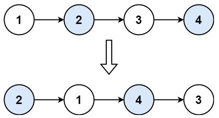
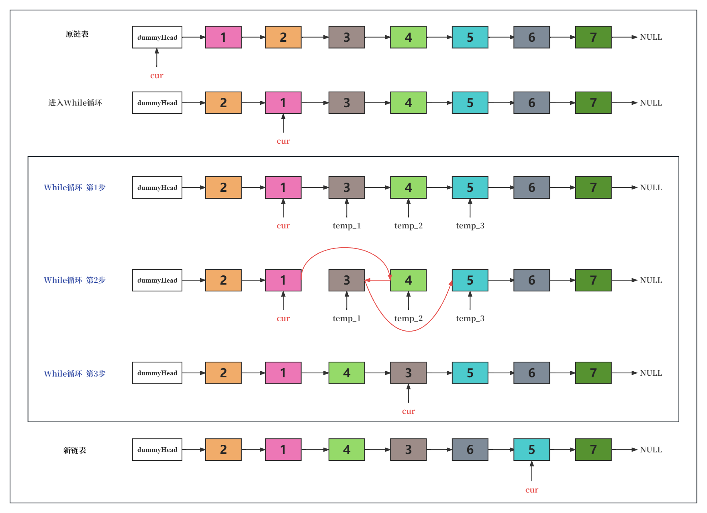

# cpp_data_structure 

* 代码随想录 https://programmercarl.com/

* 一个有非常简明例子的cpp网站：https://en.cppreference.com/w/

--------------------------------------------------------------------------------
> **大家不必太在意leetcode上执行用时，打败多少多少用户，这个就是一个玩具，非常不准确。**
> 
> 做题的时候自己能分析出来时间复杂度就可以了，至于leetcode上执行用时，大概看一下就行，只要达到最优的时间复杂度就可以了，
> 
> 一样的代码多提交几次可能就击败百分之百了....
--------------------------------------------------------------------------------

# 链表

--------------------------------------------------------------------------------

## 反转链表 swap nodes in pairs

## _4_swap_nodes_in_pairs.md

--------------------------------------------------------------------------------

### 24. 两两交换链表中的节点

> Leetcode链接: https://leetcode.cn/problems/swap-nodes-in-pairs/

> 给你一个链表，两两交换其中相邻的节点，并返回交换后链表的头节点。你必须在不修改节点内部的值的情况下完成本题（即，只能进行节点交换）。
> 
> **示例1：**
> 
> <div align=center>
> 
> </div>
> 
> ```html
> 输入：head = [1,2,3,4]
> 输出：[2,1,4,3]
> ```
> 
> **示例2：**
> 
> ```html
> 输入：head = []
> 输出：[]
> ```
>
> **示例3：**
> 
> ```html
> 输入：head = [1]
> 输出：[1]
> ```
> 
> **提示：**
> * 链表中节点的数目在范围 `[0, 100]` 内
> * `0 <= Node.val <= 100`
> 
> ```c++
> /**
>  * Definition for singly-linked list.
>  * struct ListNode {
>  *     int val;
>  *     ListNode *next;
>  *     ListNode() : val(0), next(nullptr) {}
>  *     ListNode(int x) : val(x), next(nullptr) {}
>  *     ListNode(int x, ListNode *next) : val(x), next(next) {}
>  * };
>  */
> class Solution {
> public:
>     ListNode* swapPairs(ListNode* head) {
> 
>     }
> };
> ```


#### 我的解法  头插法  

一定要画图，不画图，操作多个指针很容易乱，而且要操作的先后顺序

> <div align=center>
> 
> </div>
> 

```c++
/**
 * Definition for singly-linked list.
 * struct ListNode {
 *     int val;
 *     ListNode *next;
 *     ListNode() : val(0), next(nullptr) {}
 *     ListNode(int x) : val(x), next(nullptr) {}
 *     ListNode(int x, ListNode *next) : val(x), next(next) {}
 * };
 */
class Solution {
public:
    ListNode* swapPairs(ListNode* head) {
        // 虚拟头节点
        ListNode* dummyHead = new ListNode();
        dummyHead->next = head;
        
        ListNode* cur = dummyHead;
        ListNode* temp_1 = nullptr;
        ListNode* temp_2 = nullptr;
        ListNode* temp_3 = nullptr;
        while(cur->next != nullptr && cur->next->next != nullptr) {  // cur的后两位都有节点     
            // 若此时cur指向节点2
            temp_1 = cur->next;                  // temp_1指向节点3
            temp_2 = cur->next->next;            // temp_2指向节点4
            temp_3 = cur->next->next->next;      // temp_3指向节点5

            cur->next = temp_2;                  // 当前cur游标指向的节点2，指向节点4
            temp_2->next = temp_1;               // 节点4指向节点3
            temp_1->next = temp_3;               // 节点3指向节点5

            cur = cur->next->next;               // 当前cur游标右移两位，指向节点3
        }
        head = dummyHead->next;
        delete dummyHead;
        return head;
    }
};
```

#### 代码随想录  头插法  

> 建议使用虚拟头结点，这样会方便很多，要不然每次针对头结点（没有前一个指针指向头结点），还要单独处理。
> 
> 接下来就是交换相邻两个元素了，**此时一定要画图，不画图，操作多个指针很容易乱，而且要操作的先后顺序**
>
> 初始时，cur指向虚拟头结点，然后进行如下三步：
> <div align=center>
> 
> </div>
> 
> 操作之后，链表如下：
> 
> <div align=center>
> 
> </div>
> 
> 看这个可能就更直观一些了：
> <div align=center>
> 
> </div>
> 
> 对应的C++代码实现如下： （注释中详细和如上图中的三步做对应）
> 
> ```c++
> class Solution {
> public:
>     ListNode* swapPairs(ListNode* head) {
>         ListNode* dummyHead = new ListNode(0); // 设置一个虚拟头结点
>         dummyHead->next = head; // 将虚拟头结点指向head，这样方面后面做删除操作
>         ListNode* cur = dummyHead;
>         while(cur->next != nullptr && cur->next->next != nullptr) {
>             ListNode* tmp = cur->next; // 记录临时节点
>             ListNode* tmp1 = cur->next->next->next; // 记录临时节点
> 
>             cur->next = cur->next->next;    // 步骤一
>             cur->next->next = tmp;          // 步骤二
>             cur->next->next->next = tmp1;   // 步骤三
> 
>             cur = cur->next->next; // cur移动两位，准备下一轮交换
>         }
>         return dummyHead->next;
>     }
> };
> ```
> 时间复杂度：O(n)
> 空间复杂度：O(1)
> 


