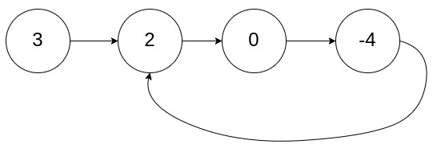
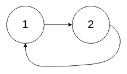
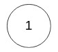
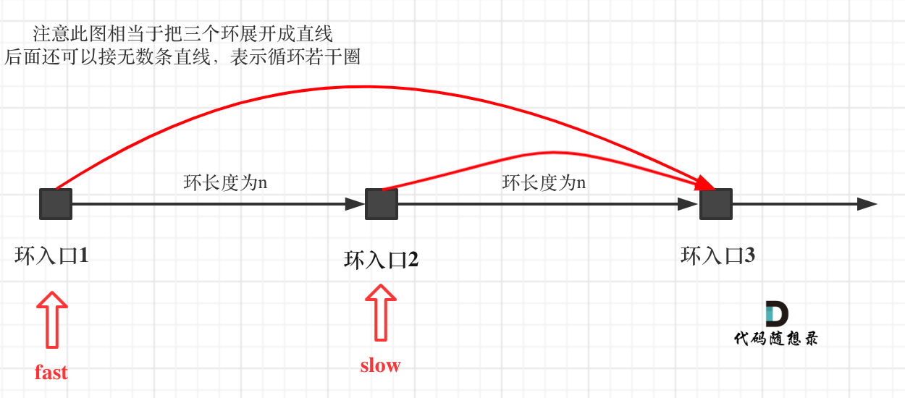

# cpp_data_structure 

* 代码随想录 https://programmercarl.com/

* 一个有非常简明例子的cpp网站：https://en.cppreference.com/w/

--------------------------------------------------------------------------------
> **大家不必太在意leetcode上执行用时，打败多少多少用户，这个就是一个玩具，非常不准确。**
> 
> 做题的时候自己能分析出来时间复杂度就可以了，至于leetcode上执行用时，大概看一下就行，只要达到最优的时间复杂度就可以了，
> 
> 一样的代码多提交几次可能就击败百分之百了....
--------------------------------------------------------------------------------

# 链表

--------------------------------------------------------------------------------

## 环形链表 II linked-list-cycle-ii

## _7_linked_list_cycle_ii.md

--------------------------------------------------------------------------------

### 142. 环形链表 II

> Leetcode链接: https://leetcode.cn/problems/linked-list-cycle-ii/

>
> 给定一个链表的头节点  `head` ，返回链表开始入环的第一个节点。 如果链表无环，则返回 `null`。
> 
> 如果链表中有某个节点，可以通过连续跟踪 `next` 指针再次到达，则链表中存在环。 为了表示给定链表中的环，评测系统内部使用整数 `pos` 来表示链表尾连接到链表中的位置（**索引从 `0` 开始**）。如果 `pos` 是 `-1`，则在该链表中没有环。**注意：`pos` 不作为参数进行传递**，仅仅是为了标识链表的实际情况。
> 
> **不允许修改** 链表。
>
> 
> **示例1：**
> 
> <div align=center>
> 
> </div>
> 
> ```html
> 输入：head = [3,2,0,-4], pos = 1
> 输出：返回索引为 1 的链表节点
> 解释：链表中有一个环，其尾部连接到第二个节点。
> ```
> 
> **示例2：**
> 
> <div align=center>
> 
> </div>
> 
> ```html
> 输入：head = [1,2], pos = 0
> 输出：返回索引为 0 的链表节点
> 解释：链表中有一个环，其尾部连接到第一个节点。
> ```
> 
> **示例3：**
> 
> <div align=center>
> 
> </div>
> 
> ```html
> 输入：head = [1], pos = -1
> 输出：返回 null
> 解释：链表中没有环。
> ```
>
> **提示：**
> * 链表中节点的数目范围在范围 `[0, 104]` 内
> * `-105 <= Node.val <= 105`
> * `pos` 的值为 `-1` 或者链表中的一个有效索引
>
> ```c++
> /**
>  * Definition for singly-linked list.
>  * struct ListNode {
>  *     int val;
>  *     ListNode *next;
>  *     ListNode(int x) : val(x), next(NULL) {}
>  * };
>  */
> class Solution {
> public:
>     ListNode *detectCycle(ListNode *head) {
>         
>     }
> };
> ```
>


#### 我的解法 有问题，陷入死循环

```c++
class Solution {
public:
    ListNode *detectCycle(ListNode *head) {
        // 建立虚拟头节点
        ListNode* dummyHead = new ListNode(0);
        dummyHead->next = head;
        // 一个一个节点试
        ListNode* cur_left = dummyHead;
        while (cur_left->next != nullptr) { // 只需要试到倒数第二个节点，因为到了最后一个节点时，肯定没有环
            // 从当前cur_left的下一个开始检测
            ListNode* cur_right = cur_left->next;
            // 回来，或者到了终点时，停止移动cur_right
            while (cur_right != cur_left || cur_right != nullptr) {
                cur_right = cur_right->next;
            }
            // 如果是回来了，说明存在环，返回当前cur_left
            if (cur_right == cur_left) {
                return cur_left;
            }

            cur_left = cur_left->next;
        }
        // 不存在环，返回NULL
        return nullptr;
    }
};
```

> 当我们从第一个节点开始试时，就有可能存在进入死循环的可能，即在链表的中间有环，永远也回不到第一个节点，但是也到不了NULL
>
> 

#### 代码随想录 

> 
> 这道题目，不仅考察对链表的操作，而且还需要一些数学运算。
> 
> 主要考察两知识点：
> 
> * 判断链表是否环
> * 如果有环，如何找到这个环的入口
>
> 

##### 1. 判断链表是否有环

> 可以使用快慢指针法，分别定义 `fast` 和 `slow` 指针，从头结点出发，**`fast`指针每次移动两个节点，`slow`指针每次移动一个节点**，如果 `fast` 和 `slow` 指针在途中相遇 ，说明这个链表有环。
> 
> 为什么 `fast` 走两个节点，`slow` 走一个节点，有环的话，一定会在环内相遇呢，而不是永远的错开呢
> 
> 首先第一点：**`fast`指针一定先进入环中，如果`fast`指针和`slow`指针相遇的话，一定是在环中相遇，这是毋庸置疑的**。
> 
> 那么来看一下，**为什么`fast`指针和`slow`指针一定会相遇呢**？
> 
> 可以画一个环，然后让 `fast` 指针在任意一个节点开始追赶 `slow` 指针。
> 
> 会发现最终都是这种情况， 如下图：
> 
> <div align=center>
> 
> </div>
>
> `fast`和`slow`各自再走一步， `fast`和`slow`就相遇了
> 
> 这是因为`fast`是走两步，`slow`是走一步，其实相对于`slow`来说，`fast`是一个节点一个节点的靠近`slow`的，所以`fast`一定可以和`slow`重合。
> 
> 动画如下：
> 
> <div align=center>
> 
> </div>
>
> 

##### 2. 如果有环，如何找到这个环的入口
>
> **此时已经可以判断链表是否有环了，那么接下来要找这个环的入口了**。
>
> 假设从头结点到环形入口节点 的节点数为`x`。 环形入口节点到 `fast` 指针与`slow` 指针相遇节点 节点数为`y`。 从相遇节点 再到环形入口节点节点数为 `z`。 如图所示：
> 
> <div align=center>
> 
> </div>
>
> 那么相遇时： `slow`指针走过的节点数为: `x + y`， `fast`指针走过的节点数：`x + y + n (y + z)`，`n`为`fast`指针在环内走了`n`圈才遇到`slow`指针， `（y+z）`为 一圈内节点的个数A。
> 
> 因为`fast`指针是一步走两个节点，`slow`指针一步走一个节点， 所以 `fast`指针走过的节点数 = `slow`指针走过的节点数 `* 2`：
>
> `(x + y) * 2 = x + y + n (y + z)`
>
> 两边消掉一个（x+y）:` x + y = n (y + z)`
>
> 因为要找环形的入口，那么要求的是`x`，因为`x`表示 头结点到 环形入口节点的的距离。
>
> 所以要求`x` ，将`x单`独放在左面：`x = n (y + z) - y `,
>
> 再从`n(y+z)`中提出一个 `（y+z）`来，整理公式之后为如下公式：`x = (n - 1) (y + z) + z` 注意这里`n`一定是大于等于`1`的，因为 `fast`指针至少要多走一圈才能相遇`slow`指针。
>
> 这个公式说明什么呢？
> 
> 先拿`n`为`1`的情况来举例，意味着`fast`指针在环形里转了一圈之后，就遇到了 `slow`指针了。
> 
> 当 `n`为`1`的时候，公式就化解为 `x = z`，
> 
> 这就意味着，**从头结点出发一个指针，从相遇节点 也出发一个指针，这两个指针每次只走一个节点， 那么当这两个指针相遇的时候就是 环形入口的节点**。
> 
> 也就是在相遇节点处，定义一个指针`index1`，在头结点处定一个指针`index2`。
>
> 让`index1`和`index2`同时移动，每次移动一个节点， 那么他们相遇的地方就是 环形入口的节点。
> 
> 动画如下：
>
> <div align=center>
> 
> </div>
>
> 那么 `n`如果大于`1`是什么情况呢，就是`fast`指针在环形转`n`圈之后才遇到 `slow`指针。
> 
> 其实这种情况和`n`为`1`的时候 效果是一样的，一样可以通过这个方法找到 环形的入口节点，只不过，`index1` 指针在环里 多转了`(n-1)`圈，然后再遇到`index2`，相遇点依然是环形的入口节点。
>
> 
```c++
class Solution {
public:
    ListNode *detectCycle(ListNode *head) {
        ListNode* fast = head;
        ListNode* slow = head;
        while(fast != NULL && fast->next != NULL) {
            // 如果是while (fast->next != nullptr && fast != nullptr) ，会报错
            // 因为与运算符当检测到第一个为false时，就不会检测第二个
            
            slow = slow->next;
            fast = fast->next->next;
            // 快慢指针相遇，此时从head 和 相遇点，同时查找直至相遇
            if (slow == fast) {
                ListNode* index1 = fast;
                ListNode* index2 = head;
                while (index1 != index2) {
                    index1 = index1->next;
                    index2 = index2->next;
                }
                return index2; // 返回环的入口
            }
        }
        return NULL;
    }
};
```


> 如果slow 和 fast 都从虚拟头节点开始走，也是一样的，不影响分析。
```c++
class Solution {
public:
    ListNode *detectCycle(ListNode *head) {
        // 建立虚拟头节点
        ListNode* dummyHead = new ListNode(0);
        dummyHead->next = head;

        // 快慢指针
        ListNode* slow = dummyHead; 
        ListNode* fast = dummyHead; //   

        //  判断是否有环
        while (fast != nullptr && fast->next != nullptr) {  
            // 如果是while (fast->next != nullptr && fast != nullptr) ，会报错
            // 因为与运算符当检测到第一个为false时，就不会检测第二个
            slow = slow->next;
            fast = fast->next->next;
            if (slow == fast) {
                ListNode* index_1 = slow;
                ListNode* index_2 = dummyHead; 
                while (index_1 != index_2) {
                    index_1 = index_1->next;
                    index_2 = index_2->next;
                }
                return index_2;
            }
        }

        // 1.无环
        // 2.只有一个节点（包括虚拟节点）
        return nullptr; // 返回NULL 
    }
};
```

##### 3.补充

> 在推理过程中，大家可能有一个疑问就是：为什么第一次在环中相遇，`slow`的 步数 是 `x+y` 而不是 `x + 若干环的长度 + y` 呢？
>
> 首先`slow`进环的时候，`fast`一定是先进环来了。
> 
> 如果`slow`进环入口，`fast`也在环入口，那么把这个环展开成直线，就是如下图的样子：
>
> <div align=center>
> 
> </div>
>
> 可以看出如果`slow` 和 `fast`同时在环入口开始走，一定会在`环入口3`相遇，`slow`走了一圈，`fast`走了两圈。
> 
> 重点来了，`slow`进环的时候，`fast`一定是在环的任意一个位置，如图：
>
> <div align=center>
> 
> </div>
>
> 那么`fast`指针走到`环入口3`的时候，已经走了`k + n` 个节点，`slow`相应的应该走了`(k + n) / 2 `个节点。
> 
> 因为`k`是小于`n`的（图中可以看出），所以`(k + n) / 2` 一定小于`n`。
> 
> **也就是说`slow`一定没有走到`环入口3`，而`fast`已经到`环入口3`了**。
> 
> 这说明什么呢？
> 
> **在`slow`开始走的那一环已经和`fast`相遇了**。
> 
> 那有同学又说了，为什么`fast`不能跳过去呢？ 在刚刚已经说过一次了，**`fast`相对于`slow`是一次移动一个节点，所以不可能跳过去**。
> 
> 好了，这次把为什么第一次在环中相遇，slow的 步数 是 `x+y` 而不是 `x + 若干环的长度 + y` ，用数学推理了一下
> 


