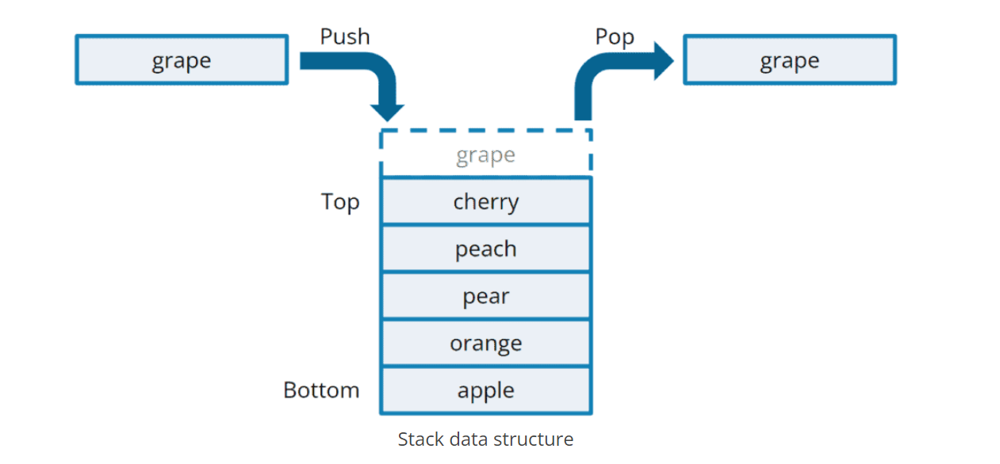

# cpp_data_structure 

* 代码随想录 https://programmercarl.com/

* 一个有非常简明例子的cpp网站：https://en.cppreference.com/w/

--------------------------------------------------------------------------------
> **大家不必太在意leetcode上执行用时，打败多少多少用户，这个就是一个玩具，非常不准确。**
> 
> 做题的时候自己能分析出来时间复杂度就可以了，至于leetcode上执行用时，大概看一下就行，只要达到最优的时间复杂度就可以了，
> 
> 一样的代码多提交几次可能就击败百分之百了....
--------------------------------------------------------------------------------

# 栈与队列

--------------------------------------------------------------------------------

## 栈与队列理论基础

## Stack_and_Queue_and_deque.md

--------------------------------------------------------------------------------

### 简介
> 栈和队列是STL（C++标准库）里面的两个数据结构。
> 如下图所示：
>  
> <div align=center>
> 
> 
> </div>
> 
> 

> <font color="yellow"> 栈（stack）：LIFO（后进先出） </font> <br>
> 图源：<https://blog.csdn.net/m0_73443478/article/details/128938695>
>  
> <div align=center>
> 
> 
> </div>
> 
>
> <font color="yellow"> 队列（queue）：FIFO（先进先出） </font> <br>
> 图源：<https://blog.csdn.net/m0_73443478/article/details/128938695>
>   
> <div align=center>
> 
> 
> </div>
> 
>


> <font color="yellow"> STL：</font> <br>
>
> <font color="yellow"> C++标准库是有多个版本的，知道使用的STL是哪个版本，才能知道对应的栈和队列的实现原理。三个最为普遍的STL版本：</font>
> * HP STL 其他版本的C++ STL，一般是以HP STL为蓝本实现出来的，HP STL是C++ STL的第一个实现版本，而且开放源代码。
> * P.J.Plauger STL 由P.J.Plauger参照HP STL实现出来的，被Visual C++编译器所采用，但是不开源。
> * SGI STL 由Silicon Graphics Computer Systems公司参照HP STL实现，被Linux的C++编译器GCC所采用，SGI STL是开源软件，源码可读性甚高。
> <font color="yellow"> 我们常用的也是Linux GCC。接下来介绍的栈和队列也是SGI STL里面的数据结构。</font> 
> 
> ```c++
> // container 容器
> #include <vector>            // std::vector 向量   
> #include <list>              // std::list   双向链表
> #include <deque>             // std::deque  双端队列
> // container adapter 容器适配器
> #include <queue>             // std::queue  队列, 有三种可选底层容器vector、list、deque
> #include <stack>             // std::stack  栈  , 有两种可选底层容器list、deque
> ```
> ```c++
> std::vector: 
> 一种模板类（向量），能够存放任意类型的动态数组。
> std::list：
> 一种模板类（链表），由双向链表来实现的，每个节点存储1个元素。支持前后两种移动方向。
> std::deque：
> 英文全称 double-ended queue，双端队列, 是一种具有队列和栈的性质的数据结构。双端队列中的元素可以从两端弹出，其限定插入和删除操作在表的两端进行。
> std::queue: 
> 一种模板类（队列），实现队列的功能——FIFO（先进先出）。缺省底层容器是std::deque。
> std::stack: 
> 一种模板类（栈），实现栈的功能——LIFO（后进先出）。缺省底层容器是std::deque。
> ```
>
> 栈、队列的初始化方式
> 
> ```c++
> stack<Type, Container> // (<数据类型，底层容器类型>） std::vector、std::list、std::deque
> queue<Type, Container> // (<数据类型，底层容器类型>） std::list、std::deque
> ``` 
> ```html
> 初始化时必须要有数据类型Type，底层容器Container可省略，缺省时默认为std::deque 
> ```
> <font color="yellow"> 如果我们在定义栈、队列时，不指定底层容器，则默认底层为std::deque </font>
> 
> <font color="yellow"> 当然也可以指定底层容器，虽然我们一般不这样做 </font>
> 
> ```c++
> #include<stack>
> std::stack<int, std::vector<int>> s1;    // 以vector为底层容器的栈stack
> std::stack<int, std::list<int>> s2;      // 以list为底层容器的栈stack
> std::stack<int> s3;                      // 默认以deque为底层容器的栈stack
> 
> #include<queue>
> // std::queue<int, std::vector<int>> q1; // 不能定义以vector为底层容器的队列queue
> std::queue<int, std::list<int>> q1;      // 以list为底层容器的队列queue
> std::queue<int> q2;                      // 默认以deque为底层容器的队列queue
> ```
> 
> 
> 下面是`std::stack`、`std::queue`、`std::deque`的对比.
> <div align=center>
> 
> 
> 
> </div>
> 
> <font color="yellow"> 可以看出来对 `std::deque` 做一些限制，就会变成`stack` 或 `queue` </font> 
> 


> <font color="yellow"> 为什么不能用`vector`容器初始化`queue`？ </font> 
> 
> 解释：
> 
> `queue`转换器要求容器支持`front()`、`back()`、`push_back()`及 `pop_front()`，
> 
> 说明`queue`的数据从容器后端入队列而从前端出队列。
> 
> 所以可以使用`deque`（双向链表）和`list`（双端队列）对`queue`初始化，
> 
> 而`vector`因其缺少`pop_front()`，不能用于`queue`。
>

> <font color="yellow"> 为什么 栈（stack）和 队列（queue）的缺省底层容器是 std::deque ? </font> 
> 
> <https://blog.csdn.net/qq_51845557/article/details/120807868>
> 
> <font color="green"> 栈（`stack`）的内部结构，底层实现可以是`std::vector`，`std::list`，`std::deque`三种。<br> 队列（`queue`）的内部结构，底层实现可以是`std::list`，`std::deque`两种。</font>  
> 
> 解释：
> 
> > 1. 由于`stack`与`queue`只需要进行两端的存取操作,所以只需要能实现一些基础方法如`push_back()`,`pop_back()`,`pop_front()`,`back()`,`front()`等就可以满足二者的实现.所以事实上无论是`list`,`vector`还是`deque`,都可以实现队列与栈的操作.那么为什么`STL`采用了`Deque`?
> > `deque::push_back()`,`deque::pop_back()`,`deque::pop_front()`,`deque::back()`,`deque::front()`
> 
> > 2. 首先是`vector`.由于其顺序表结构的局限性,`vector`在首端的插入操作时间复杂度就已经高到了`O(n)`的程度.此外,`stack`与`queue`只需要端结点的操作,使用`vector`实现必然会浪费`vector`本身随机存取的优势.最后,我个人认为在使用`vector`这种简单顺序结构实现`queue`时,是存在先天不足的.因为`queue`的特点决定了由于其弹出队头与插入队尾是同一个方向,在多次操作后必然会使数据整体位移导致越界.使用`vector`实现队列必然要考虑这个问题,解决的办法不论是循环队列还是频繁地释放与开辟空间都会导致代码的无谓复杂化.上面的原因导致`vector`根本不是合适的`stack/queue`基础容器.
> 
> > 3. 其次是`list`.作为双向循环列表的`list`满足`stack/queue`的端结点操作,并且其时间复杂度也能达到`O(1)`的程度,所以事实上也是不错的选择.但是在实践中其速度与内存占用依旧是没有`deque`优秀的,个人猜测是因为`list`的循环特性在`stack/queue`中没有得到利用,所以在实践中与`deque`相比产生了常数级别的实践复杂度劣势和空间复杂度劣势.
> 
> > 4. 阐明了上述两个容器在实现`stack/queue`时的不足,我们来介绍`deque`的特性.`deque`是一个双向队列,可以操作端结点,且这些操作具有`O(1)`级别的时间复杂度.但`deque`并非简单的链式或顺序结构,而是通过一个`map`索引表连接多个顺序表来存取数据的,它的具体实现今天不做具体讨论,改日补充.`deque`的缺陷在于虽然它支持随机访问和中间结点存取,但它的这些功能性能非常差.当然,这些并不会影响它作为`stack/queue`的基础容器的性能.
>


> <font color="yellow"> stack 与 queue 的 相同点：</font> <br>
> 
> > 1. `stack`与`queue`不能遍历,不能随机访问,不能查询中间结点,不能插入中间结点,只能做与其性质对应的两端结点的操作.都不提供迭代器`iterator`。
> > 因为栈或队列这种数据结构让你随便去遍历反而是不好的，如果随便遍历就保证不了`LIFO`或`FIFO`的功能了。
> 
> > 2. STL中栈（`stack`）和队列（`queue`），都不被归类为`container`（容器），而被归类为`container adapter`（容器适配器）。
> > 因为两者的底层是通过其他容器实现的。
> 
> > 3. 栈和队列以底层容器完成其所有的工作，对外提供统一的接口，底层容器是可插拔的。
> > 也就是说我们可以控制使用哪种容器来实现栈或队列的功能。
>
> <font color="yellow"> stack 与 queue 的 不同点：</font> <br>
> 
> 1. <font color="yellow"> 常用操作不同 </font>
> > <font color="green"> 栈（stack）的对外接口：</font>
> ```c++
> // 只能在栈顶(栈的尾部)进行插入和删除操作。
> #include<stack>
> stack<int> s;
> s.push();     //1. 入栈（压栈），栈顶(栈的尾部)插入元素。即 std::depue::push_back()
> s.pop();      //2. 出栈（弹栈），栈顶(栈的尾部)删除元素。即 std::depue::pop_back()
> s.size();     //3. 返回栈中元素个数，求栈的大小 ，
> s.empty();    //4. 判断栈是否为空，如果栈为空则返回 true, 否则返回 false;
> s.top();      //5. 返回栈顶(栈的尾部)元素的值
>               //   如果堆栈容器为空，则会导致未定义的行为
> ```
> 
> <div align=center>
> 
> </div>
> 
> 
> <font color="green"> 队列（queue）的对外接口: </font> <br>
> 
> ```c++
> #include<queue>
> queue<int> q;
> q.push()      //1. 入队列，队尾插入元素。即 std::depue::push_back()
> q.pop()       //2. 出队列，队头删除元素。即 std::depue::pop_front()
> q.size()      //3. 返回队列中元素个数，求队列的大小 ，
> q.empty()     //4. 判断队列是否为空，如果队列为空则返回 true, 否则返回 false;
> q.front()     //5. 返回队头元素的引用
> q.back()      //6. 返回队尾元素的引用
> ```
> <br>  
> <div align=center>
> 
> </div>
> 
> 
> 2. <font color="yellow"> 底层实现可选类型不同 </font>
> 
> <font color="green"> 栈（`stack`）的内部结构，底层实现可以是`std::vector`，`std::list`，`std::deque`三种。<br> 队列（`queue`）的内部结构，底层实现可以是`std::list`，`std::deque`两种。</font> <br> 
> 
> 栈（`stack`）的内部结构如下图所示：
>  
> <div align=center>
> 
> </div>
> 
>
> 队列（`queue`）的内部结构如下图所示：
>  
> <div align=center>
> 
> </div>
> 
>

> <font color="yellow"> 栈`stack` 和 队列`queue` 一种实现 </font> 
> 
> <https://blog.csdn.net/qq_51845557/article/details/120807868>
> 
> 由于引入`deque`后,`stack`与`queue`的实现就非常简单了.因此直接给出二者的实现:
> 
> 只是一种形式，不是<stack>和<queue>STL库里的的真实源码
>

> `MyStack`: 
> 
> ```c++
> #ifndef MYSTACK_H
> #define MYSTACK_H
> #include<deque> 
> using namespace std;
> template<typename T,class conatainer=deque<T>>
> class MyStack{
>     protected:			//受保护的的 
>     	deque<T> c;
>     public:
> 		void push(const T&val){
> 			c.push_back(val);
> 		}
>     	void pop(){
>     		c.pop_back();    // MyQueue中是 c.pop_front(); 
> 		}
> 		size_t size(){
> 			return c.size();
> 		}
> 		bool empty(){
> 			return c.empty();
> 		}
> 		T& top(){
> 			return c.back();
> 		}
> };
> #endif
> ```

> `MyQueue`:
> 
> ```c++
> #ifndef MYQUEUE_H
> #define MYQUEUE_H
> #include<deque> 
> using namespace std;
> template<typename T,class conatainer=deque<T>>
> class MyQueue{
>     protected:	
>     	deque<T> c;
>     public:
> 		void push(const T&val){
> 			c.push_back(val);
> 		}
>     	void pop(){
>     		c.pop_front();    // MyStack中是 c.pop_back(); 
> 		}
> 		size_t size(){
> 			return c.size();
> 		}
> 		bool empty(){
> 			return c.empty();
> 		}
> 		T& front(){
> 			return c.front();
> 		}
> 		T& back(){
> 			return c.back();
> 		}
> };
> #endif
> ```
> 二者只有`pop()`方法的删除位置区别.
> `protected` 声明的成员,其作用范围大于 `private` ,小于 `public` .即: `private < protected < public`. 与 `private` 内部的成员相比, `protected` 支持本类的派生类访问保护成员.
>
> 


#### 字符串类型`string` 也有类似栈的操作

> `string::empty()`
> `string::back()`
> `string::push_back()`
> `string::pop_back()`
> 
> 等等有很多，可以看看这些用法
> 


### 不使用STL时，栈和队列的表示和实现

https://blog.csdn.net/weixin_37753215/article/details/98097796


https://blog.csdn.net/m0_63830846/article/details/126754999


https://blog.csdn.net/qq_50533529/article/details/124673008


#### 优先级队列   std::priority_queue

> 
> `_6_sliding_window_maximum.md`
>
> https://blog.csdn.net/weixin_57761086/article/details/126802156
>
>
> 优先队列是一种容器适配器，采用了堆（`heap`, 本质上完全二叉树）这样的数据结构，保证了第一个元素总是整个优先队列中**最大的**(或**最小的**)元素。
> 
> 优先队列默认使用`vector`作为底层存储数据的容器，在`vector`上使用了堆算法将`vector`中的元素构造成堆的结构，所以其实我们就可以把它当作堆，**凡是需要用堆的位置，都可以考虑优先队列**。(所以需要先学习堆)
>
> 
> <font color="yellow"> 栈、队列、优先级的定义方式 </font>
> 
> ```c++
> stack<Type, Container> // (<数据类型，底层容器类型>） std::vector、std::list、std::deque
> queue<Type, Container> // (<数据类型，底层容器类型>） std::list、std::deque
> priority_queue<Type, Container, Compare> // (<数据类型，底层容器类型，比较方式类>）
> ``` 
>
>
> 什么是优先队列中元素的比较方式？
> 之前也提到了，优先队列其实就是堆，堆中元素都是有固定大小关系的。比如大堆：每个结点的值都不大于它的双亲结点，堆顶元素是最大的。堆中会存储各种各样的元素，所以它们的比较方式自然不会相同，**编译器中的比较方式类只能比较内置类型，所以自定义类的比较方式是需要用户自己给出的，并且需要手动填充到Compare 参数的位置**。
> 
>
> <font color="yellow"> 优先级队列`std::priority_queue`定义的举例 </font>
> 
> ```c++
> // container adapter 容器适配器
> #include <vector>  
> #include <queue>        
> // std::queue  队列, 有三种可选底层容器vector、list、deque
> // std::priority_queue  优先队列
> 
> std::queue<int> q;     
> // 默认以deque为底层容器
> 
> priority_queue<int> pq1; // 等价于priority_queue<int, vector<int>, less<int>> pq;
> // 默认以vector为底层容器；vector<int>是承载底层数据结构堆 （heap）的容器
> // 默认以less为比较方式，左边小于右边的时候返回true, 返回true则交换位置，所以排在top的最大，此时优先队列就是大堆，所以优先队列默认就是大堆。 
> // 如果以greater为比较方式，左边大于右边的时候返回true, 返回true则交换位置，所以排在top的最小，此时优先队列就是小堆，所以优先队列默认就是小堆。 
> 
> //大堆：每个结点的值都不大于它的双亲结点，堆顶元素是最大的。 又叫（大顶堆，大根堆）
> //小堆：每个结点的值都不小于它的双亲结点，堆顶元素是最小的。 
> 
> priority_queue<int,vector<int>,greater<int> > pq2;
> // less<int>表示数字大的优先级越大，greater<int>表示数字小的优先级越大。 
> ```
>
> <font color="green"> 优先级队列（priority_queue）的对外接口: </font> 
> ```c++
> #include<queue>
> priority_queue<int> pq;
> pq.push()      //1. 入队首元素（即堆顶元素），自动排序到对应位置
> pq.pop()       //2. 出队首元素（即堆顶元素）
> pq.size()      //3. 返回队列中元素个数，求队列的大小 ，
> pq.empty()     //4. 判断队列是否为空，如果队列为空则返回 true, 否则返回 false;
> pq.top()       //5. 返回优先级队列的队首元素（即堆顶元素）的引用
>
> pq.emplace(val)  //6. （构造并插入元素）功能与push()相同，只是多了调用构造函数的功能
> 
> std::priority_queue<int> pq1,pq2;
> pq1.swap(pq2);    //7. 交换内容，用x的内容交换容器适配器（* this）的内容，将一个优先级队列的内容与另一个相同类型（大小可以不同）的优先级队列进行交换。
> ```
>

> <font color="yellow">
> 
> 其实优先级队列`std::priority_queue`更像是`std::stack`，只有`top()`，没有`front()`，没有`back()`
>
> ``std::priority_queue``和`std::stack`都是可以看作 
>  “ 只能从队尾访问元素的队列`std::queue` ”
>
> </font>


##### 1. 看看比较方式的具体显示

> <font color="yellow"> 1. 看看比较方式的具体显示 </font>
>
> ```c++
> #include <iostream>   
> using namespace std; 
> #include <vector>      // C++ vector 容器
> #include <queue>       // C++ queue 容器适配器  priority_queue 容器适配器
> #include <stack>       // C++ stack 容器适配器
> int main()
> {
>     cout << "input: 1, 3, -1, -3, 5, 3, 6, 7";
>     vector<int> nums = {1,3,-1,-3,5,3,6,7};  
>     cout << endl << endl; 
> 
>     // stack
>     cout << "stack<int> s: "; 
>     stack<int> s;
>     for(size_t i=0; i<nums.size(); i++){
>         s.push(nums[i]);
>     }
>     while(!s.empty()){
>         cout << s.top() << ", ";   
>         s.pop();
>     }
>     cout << endl << endl; 
> 
>     // queue
>     cout << "queue<int> q: "; 
>     queue<int> q;
>     for(size_t i=0; i<nums.size(); i++){
>         q.push(nums[i]);
>     }
>     while(!q.empty()){
>         cout << q.front() << ", "; 
>         q.pop();
>     }
>     cout << endl << endl;     
> 
>     // priority_queue  default
>     cout << "priority_queue<int> pq1: "; 
>     priority_queue<int> pq1; 
>     for(size_t i=0; i<nums.size(); i++){
>         pq1.push(nums[i]);
>     }
>     while(!pq1.empty()){
>         cout << pq1.top() << ", "; 
>         pq1.pop();
>     }
>     cout << endl << endl;     
> 
>     // priority_queue less
>     cout << "priority_queue<int, vector<int>, less<int>> pq2: ";     
>     priority_queue<int, vector<int>, less<int>> pq2;
>     for(size_t i=0; i<nums.size(); i++){
>         pq2.push(nums[i]);
>     }
>     while(!pq2.empty()){
>         cout << pq2.top() << ", "; 
>         pq2.pop();
>     }
>     cout << endl << endl;   
> 
>     // priority_queue greater
>     cout << "priority_queue<int, vector<int>, greater<int>> pq3: "; 
>     priority_queue<int, vector<int>, greater<int>> pq3;
>     for(size_t i=0; i<nums.size(); i++){
>         pq3.push(nums[i]);
>     }
>     while(!pq3.empty()){
>         cout << pq3.top() << ", "; 
>         pq3.pop();
>     }
>     cout << endl << endl;   
> 
>     cout << endl;
>     pause();
> 
>     return 0;
> }        
> ```
> 编译并运行，结果如下
> ```html
> input: 1, 3, -1, -3, 5, 3, 6, 7
> 
> stack<int> s: 7, 6, 3, 5, -3, -1, 3, 1, 
> 
> queue<int> q: 1, 3, -1, -3, 5, 3, 6, 7, 
> 
> priority_queue<int> pq1: 7, 6, 5, 3, 3, 1, -1, -3, 
> 
> priority_queue<int, vector<int>, less<int>> pq2: 7, 6, 5, 3, 3, 1, -1, -3, 
> 
> priority_queue<int, vector<int>, greater<int>> pq3: -3, -1, 1, 3, 3, 5, 6, 7, 
>     
> ```
>
> 插入元素后自动排序了
>

#####  2. 结合`pair`使用

> <font color="yellow"> 2. 结合`pair`使用</font>
>
> ```c++
> #include <iostream>   
> using namespace std; 
> #include <vector>      // C++ vector 容器
> #include <queue>       // C++ queue 容器适配器  priority_queue 容器适配器
> #include <stack>       // C++ stack 容器适配器
> int main()
> {
>     cout << "input: 1, 3, -1, -3, 5, 3, 6, 7";
>     vector<int> nums = {1,3,-1,-3,5,3,6,7};  
>     cout << endl << endl; 
> 
>     // priority_queue  default
>     cout << "priority_queue<int> pq1: "; 
>     priority_queue<int> pq1; 
>     for(size_t i=0; i<nums.size(); i++){
>         pq1.push(nums[i]);
>     }
>     while(!pq1.empty()){
>         cout << pq1.top() << ", "; 
>         pq1.pop();
>     }
>     cout << endl << endl;     
> 
>     // pq1.emplace(0);
>     for(size_t i=0; i<nums.size(); i++){
>         pq1.push(nums[i]);
>     }
>     pq1.emplace(0);
>     cout << "After pq1.emplace(0): "; 
>     while(!pq1.empty()){
>         cout << pq1.top() << ", "; 
>         pq1.pop();
>     }
>     cout << endl << endl;        
> 
> 
>     // priority_queue  pair
>     cout << "priority_queue<pair<int, int>> pq2: "; 
>     priority_queue<pair<int, int>> pq2; 
>     for(size_t i=0; i<nums.size(); i++){
>         pq2.emplace(nums[i], i);
>     }
>     while(!pq2.empty()){
>         cout << pq2.top().first << "(i[" << pq2.top().second << "])" << ", "; 
>         pq2.pop();
>     }
>     cout << endl << endl;     
> 
>     // pq2.emplace(16, 8);
>     for(size_t i=0; i<nums.size(); i++){
>         pq2.emplace(nums[i], i);
>     }
>     pq2.emplace(16, 8);
>     cout << "After pq2.emplace(16, 8): "; 
>     while(!pq2.empty()){
>         cout << pq2.top().first << "(i[" << pq2.top().second << "])" << ", "; 
>         pq2.pop();
>     }
>     cout << endl << endl;        
> 
> 
> 
>     cout << endl;
>     pause();
> 
>     return 0;
> }        
> ```
> 
> 编译并运行，结果如下
> ```html
> input: 1, 3, -1, -3, 5, 3, 6, 7
> 
> priority_queue<int> pq1: 7, 6, 5, 3, 3, 1, -1, -3, 
> 
> After pq1.emplace(0): 7, 6, 5, 3, 3, 1, 0, -1, -3, 
> 
> priority_queue<pair<int, int>> pq2: 7(i[7]), 6(i[6]), 5(i[4]), 3(i[5]), 3(i[1]), 1(i[0]), -1(i[2]), -3(i[3]), 
> 
> After pq2.emplace(16, 8): 16(i[8]), 7(i[7]), 6(i[6]), 5(i[4]), 3(i[5]), 3(i[1]), 1(i[0]), -1(i[2]), -3(i[3]), 
> ```
>
>

#####  3. 自定义比较类

> <font color="yellow"> 其实自定义比较类的原理和内置比较类是一样的 </font>
> 
> 我们看一看内置比较类`std::less`、`std::greater`
> 
> 默认以`less`为比较方式，左边小于右边的时候返回`true`, 返回`true`则交换位置，所以排在`top`的最大`max`，此时优先队列就是大堆，所以优先队列默认就是大堆。 
> 
> 如果以`greater`为比较方式，左边大于右边的时候返回`true`, 返回`true`则交换位置，所以排在`top`的最小`min`，此时优先队列就是小堆，所以优先队列默认就是小堆。 
>
> <font color="yellow"> 注意重点：返回`true`则交换位置 </font>
> 

> <font color="yellow"> 3. 自定义比较类 </font>
>
> https://blog.csdn.net/Strengthennn/article/details/119078911
>
> <font color="gree"> 
> 
> 两种情况：
> 
> * 如果对象是结构体或类，可以在结构体或类的定义中重载 `<` 和 `>` 运算符，也可以定义仿函数
> > 并不是一定要同时定义 `<` 和 `>` 运算符
> > `priority_queue`中
> > * 默认使用`less<T>`判断式比较元素大小，因此可以只定义 `<` 符号的重载以满足使用
> > 
> > * 如果使用`greater<T>`判断式比较元素大小，因此可以可以只定义 `>` 符号的重载以满足使用
> > 
>
> * 如果没有结构体或类，只能用仿函数
>
> 为了更具有普适性，一般我用仿函数
>
> </font>
>


> <font color="yellow"> 
> 
> 先看内置类型`int`的默认`less<int>`的具体效果
> 
> </font>
>
> ```c++
> #include<queue>
> 
> int main()
> {
>     priority_queue<int> priorityQueue;
>     // 等价于priority_queue<int, vector<int>, less<int>> priorityQueue;
>     for (int i = 0; i < 5; i++) {
>         priorityQueue.push(i);
>     }
>     while (!priorityQueue.empty()) {
>         int top = priorityQueue.top();
>         cout << "top:" << top << endl;
>         priorityQueue.pop();
>     }
> 
>     cout << endl;
>     pause();
> 
>     return 0;
> }        
> ```
> 编译并运行，结果如下
> ```c++
> top:4
> top:3
> top:2
> top:1
> top:0
> ```
>
> 
> <font color="yellow"> 
> 
> 同理，再看内置类型`int`的`greater<int>`的具体效果
> 
> </font>
> 
> ```c++
> #include<queue>
> 
> int main()
> {
>     priority_queue<int, vector<int>, greater<int>> priorityQueue;
>     for (int i = 0; i < 5; i++) {
>         priorityQueue.push(i);
>     }
>     while (!priorityQueue.empty()) {
>         int top = priorityQueue.top();
>         cout << "top:" << top << endl;
>         priorityQueue.pop();
>     }
> 
>     cout << endl;
>     pause();
> 
>     return 0;
> }        
> ```
> 编译并运行，结果如下
> ```c++
> top:0
> top:1
> top:2
> top:3
> top:4
> ```
>
> <font color="yellow"> 
> 
> 
> * 为什么`less<int>`时，这`std::priority_queue<int>`的`top`是最大`max`?
> 
> * 为什么`greater<int>`时，这`std::priority_queue<int>`的`top`是最小`min`?
>
> </font>
>
> 入队时，排序调整后，优先级最大的元素排在最前面，也就是队首指向的位置，这时候队尾指向的位置(`top`)是优先级最小的元素
>
> 如何用代码体会？
>
> ```c++
> // class int
> 
> struct int_num {
>     int num;
>     // 重载<运算符
>     bool operator<(const int &b) const {
>         return this->num < b.num ? true : false;
>     }
> };
>  
> // 当this->num 小于 b.num时
> // 返回true，交换位置； 返回false， 不交换位置
> // less的意思是越低，优先级越高
> // 即为后入队元素<先入队的元素时，后入队的元素优先级更高，交换位置; 
> // 即为后入队元素>=先入队的元素时，后入队的元素优先级更低，不交换位置; 
> // 最终，队头的元素最小，队尾的元素最大，
> ```
> 
> 对于`less<int>`, 对应`<`重载运算符。
> 
> 哪个小，哪个优先级高，哪个放在最前面，这样看`top`指向的队尾元素是最大的
>
> 虽然按道理使用`less`比较应该默认是小根堆（即堆顶元素最小），但是`priority_queue<>`默认是大根堆的。每次入队元素进去经排序调整后，优先级最大的元素排在最前面，也就是队头指向的位置，这时候队尾指向优先级最小的元素！我们重载运算符的时候比较函数里面写`<`就相当于`>`排序方式，这点需要花点时间想想
>
> 
> 
> <font color="gree">之前，学习`优先级队列std::priority_queue`时，就说过大顶堆和小顶堆的事情</font>
> 
> <font color="yellow"> 
> 
> 总结：
>
> `C++`内置排序函数`std::sort()`
> 
> * `sort(arr.begin(), arr.end());` 不传入第三个参数，则默认升序
> * `sort(arr.begin(), arr.end(), less<int>());`为升序
> * `sort(arr.begin(), arr.end(), greater<int>());` 为降序
>
> `集合std::set`(`key`就是`value`)
>
> * `less`: `key`越小，优先级越高，越靠近队头（`begin()`）。即按`key`升序
>
> * `greater`: `key`越大，优先级越高，越靠近队头（`begin()`）。即按`key`降序
>
> `映射std::map`(`pair<key, value>`)
>
> * `less`: `key`越小，优先级越高，越靠近队头（`begin()`）。即按`key`升序
>
> * `greater`: `key`越大，优先级越高，越靠近队头（`begin()`）。即按`key`降序
>
> 
> `优先级队列std::priority_queue`
>
> * `less`: `key`越小，优先级越高，越靠近队头。对应大顶堆/大根堆(`top()`指向的队尾元素最大`max`). 取出的元素顺序为降序
> * `greater`: `key`越大，优先级越高，越靠近队头。对应小顶堆/小根堆(`top()`指向的队尾元素最小`min`). 取出的元素顺序为升序序
> 
> 注：
> 
> `优先级队列std::priority_queue`的`std::less`和`std::sort()函数`的`std::less`功能正好相反。
> > 其实`sort(vec.begin(), vec.end(), less<int>());`和`priority_queue<int, vector<int>, less<int>> vec;`都是升序，只不过`std::priority_queue`只有`top()`这个取值函数，只能从队尾取元素，导致元素取出后是降序。
> 
> `优先级队列std::priority_queue`的`std::greater`和`std::sort()函数`的`std::greater`功能正好相反
> > 其实`sort(vec.begin(), vec.end(), greater<int>());`和`priority_queue<int, vector<int>, greater<int>> vec;`都是降序，只不过`std::priority_queue`只有`top()`这个取值函数，只能从队尾取元素，导致元素取出后是升序。
> 
> </font>
>
> 


>
> **第一种：小于号重载**
> <font color="yellow"> 例子如下</font>
> ```c++
> #include<queue>
> 
> struct Node {
>     int size;
>     int price;
>     // 重载<运算符
>     bool operator<(const Node &b) const {
>         return this->size == b.size ? this->price > b.price : this->size < b.size;
>     }
> };
> 
> int main()
> {
>     priority_queue<Node> priorityQueue;
>     // 等价于priority_queue<Node, vector<Node>, less<Node>> priorityQueue;
>     for (int i = 0; i < 5; i++) {
>         priorityQueue.push(Node{i, 5 - i});
>     }
>     for (int i = 0; i < 5; i++) {
>         priorityQueue.push(Node{i, 10 - i});
>     }
>     while (!priorityQueue.empty()) {
>         Node top = priorityQueue.top();
>         cout << "size:" << top.size << " price:" << top.price << endl;
>         priorityQueue.pop();
>     }
> 
>     cout << endl;
>     pause();
> 
>     return 0;
> }        
> ```
> 编译并运行，结果如下
> ```c++
> size:4 price:1
> size:4 price:6
> size:3 price:2
> size:3 price:7
> size:2 price:3
> size:2 price:8
> size:1 price:4
> size:1 price:9
> size:0 price:5
> size:0 price:10
> ```
>

>
> **第二种：大于号重载**
> <font color="yellow"> 例子如下</font>
> ```c++
> #include<queue>
> 
> struct Node {
>     int size;
>     int price;
>     // 重载>运算符
>     bool operator>(const Node &b) const {
>         return this->size == b.size ? this->price < b.price : this->size > b.size;
>     }
> };
> 
> int main()
> {
>     priority_queue<Node, vector<Node>, greater<Node>> priorityQueue;
>     for (int i = 0; i < 5; i++) {
>         priorityQueue.push(Node{i, 5 - i});
>     }
>     for (int i = 0; i < 5; i++) {
>         priorityQueue.push(Node{i, 10 - i});
>     }
>     while (!priorityQueue.empty()) {
>         Node top = priorityQueue.top();
>         cout << "size:" << top.size << " price:" << top.price << endl;
>         priorityQueue.pop();
>     }
> 
>     cout << endl;
>     pause();
> 
>     return 0;
> }        
> ```
> 编译并运行，结果如下
> ```c++
> size:0 price:10
> size:0 price:5
> size:1 price:9
> size:1 price:4
> size:2 price:8
> size:2 price:3
> size:3 price:7
> size:3 price:2
> size:4 price:6
> size:4 price:1
> ```
>


>
> **第三种：仿函数的应用**
>
> `仿函数（functor）`又称为`函数对象（function object）`是一个`能行使函数功能的类`。<font color="yellow">本质上是类 </font>。仿函数的语法几乎和我们普通的函数调用一样，不过`作为仿函数的类，都必须重载operator()运算符`，`仿函数与Lamdba表达式的作用是一致的`。
>
> <font color="yellow"> "仿函数"比较类的定义方式如下（返回true时，前后交换位置）</font>
> 
> ```c++
> 
> // 返回true时，a的优先级低于b的优先级。即返回true时，交换位置，a排在b的后面)
> class Cmp {
> public:  
>     bool operator()(const Node &a, const Node &b) { // 条件运算符
>         return a.size == b.size ? a.price > b.price : a.size < b.size; // top的size最大, size相同时price小的排前面
>         return a.size == b.size ? a.price < b.price : a.size > b.size; // top的size最小, size相同时price大的排前面     
>         // priority_queue自定义函数的比较与sort正好是相反的
>         // 也就是说，如果你是把大于号作为第一关键字的比较方式，那么堆顶的元素就是第一关键字最小的
>    }
> };
> 
> 
> // top的size最大，price最小
> class top_sizemax_pricemin {
> public:
>     bool operator()(const Node &a, const Node &b) { // 条件运算符
>         return a.size == b.size ? a.price > b.price : a.size < b.size; // top的size最大, size相同时price小的排前面  
>         // 返回true时，交换位置，front排在back的后面
>    }
> };
> 
> 
> // top的size最小，price最大
> class top_sizemin_pricemax {
> public:
>     bool operator()(const Node &a, const Node &b) { // 条件运算符
>         return a.size == b.size ? a.price < b.price : a.size > b.size; // top的size最大, size相同时price小的排前面  
>         // 返回true时，交换位置，front排在back的后面
>    }
> };
> 
> ```
> 
> <font color="yellow"> 例1</font>
> ```c++
> #include<queue>
> 
> struct Node {
>     int size;
>     int price;
> };
> 
> // top的size最大，price最小
> class top_sizemax_pricemin {
> public:
>     bool operator()(const Node &a, const Node &b) { // 条件运算符
>         return a.size == b.size ? a.price > b.price : a.size < b.size; // top的size最大, size相同时price小的排前面  
>         // 返回true时，交换位置，front排在back的后面
>    }
> };
> 
> int main()
> {
>     priority_queue<Node, vector<Node>, top_sizemax_pricemin> priorityQueue;
>     for (int i = 0; i < 5; i++) {
>         priorityQueue.push(Node{i, 5 - i});
>     }
>     for (int i = 0; i < 5; i++) {
>         priorityQueue.push(Node{i, 10 - i});
>     }
>     while (!priorityQueue.empty()) {
>         Node top = priorityQueue.top();
>         cout << "size:" << top.size << " price:" << top.price << endl;
>         priorityQueue.pop();
>     }
> 
>     cout << endl;
>     pause();
> 
>     return 0;
> }        
> ```
> 编译并运行，结果如下
> ```c++
> size:4 price:1
> size:4 price:6
> size:3 price:2
> size:3 price:7
> size:2 price:3
> size:2 price:8
> size:1 price:4
> size:1 price:9
> size:0 price:5
> size:0 price:10
> ```
>
> <font color="yellow"> 例2</font>
> ```c++
> #include<queue>
> 
> struct Node {
>     int size;
>     int price;
> };
> 
> // top的size最小，price最大
> class top_sizemin_pricemax {
> public:
>     bool operator()(const Node &a, const Node &b) { // 条件运算符
>         return a.size == b.size ? a.price < b.price : a.size > b.size; // top的size最大, size相同时price小的排前面  
>         // 返回true时，交换位置，front排在back的后面
>    }
> };
> 
> int main()
> {
>     priority_queue<Node, vector<Node>, top_sizemin_pricemax> priorityQueue;
>     for (int i = 0; i < 5; i++) {
>         priorityQueue.push(Node{i, 5 - i});
>     }
>     for (int i = 0; i < 5; i++) {
>         priorityQueue.push(Node{i, 10 - i});
>     }
>     while (!priorityQueue.empty()) {
>         Node top = priorityQueue.top();
>         cout << "size:" << top.size << " price:" << top.price << endl;
>         priorityQueue.pop();
>     }
> 
>     cout << endl;
>     pause();
> 
>     return 0;
> }        
> ```
> 编译并运行，结果如下
> ```c++
> size:0 price:10
> size:0 price:5
> size:1 price:9
> size:1 price:4
> size:2 price:8
> size:2 price:3
> size:3 price:7
> size:3 price:2
> size:4 price:6
> size:4 price:1
> ```
>


> **对象非结构体或类定义时，只能使用仿函数**
> 
> <font color="yellow"> 需要注意的是：使用仿函数对优先队列进行自定义排序，需要在声明priority_queue对象时显式地定义Container类型和Compare类型，即: </font>
> ```c++
> priority_queue<pair<int, int>, vector<pair<int, int>>, mycomparison> pri_que
> // priority_queue<pair<int,int>> pri_que;
> ```
> <font color="yellow"> "仿函数"比较类的定义方式如下（返回true时，前后交换位置）</font>
> 
> ```c++
> // 返回true时，front的优先级低于back的优先级。即返回true时，交换位置，front排在back的后面)
> class Cmp {
> public:
>     bool operator()(const pair<string, int>& front, const pair<string, int>& back) {
>         return front.second > back.second; // 如果想要得到int递增序列（top最小） 
>         return front.second < back.second; // 如果想要得到int递减序列（top最大）      
>         // priority_queue自定义函数的比较与sort正好是相反的
>         // 也就是说，如果你是把大于号作为第一关键字的比较方式，那么堆顶的元素就是第一关键字最小的
>    }
> };
> 
> // 大顶堆，top最大
> class top_max {
> public:
>     bool operator()(const pair<string, int>& front, const pair<string, int>& back) {
>         return front.second < back.second; // top最大     
>         // 返回true时，交换位置，front排在back的后面
>         // 这里是按照递减序列排序（top最大）
>    }
> };
> 
> // 大小顶堆，top最小
> class top_min {
> public:
>     bool operator()(const pair<string, int>& front, const pair<string, int>& back) {
>         return front.second > back.second; // top最小
>         // 返回true时，交换位置，front排在back的后面
>         // 这里是按照递增序列排序（top最小）
>    }
> };
> ```
> <font color="yellow"> 例子如下</font>
> ```c++
> #include<queue>
> #include<vector>
> #include<string>
> 
> // 返回true时，交换位置，front排在back的后面
> class top_max {
> public:
>     bool operator()(const pair<string, int>& front, const pair<string, int>& back) {
>         return front.second < back.second; // top最小
>         // return front.second > back.second; // top最大
> 
>         // 返回true时，交换位置，front排在back的后面
>         // 这里是按照递减序列排序（top最大）
>    }
> };
> 
> int main()
> {
>     priority_queue<pair<string, int>, vector<pair<string, int>>, top_max> pri_que;
>
>     vector<string> name = {"wang", "zhang", "liu", "li", "zhao", "zhou"};
>     vector<int> grade = {78, 69, 97, 85, 100, 92};
> 
>     for(size_t i=0; i < name.size(); i++){
>         pri_que.emplace(name[i], grade[i]); // 不能是push
>     }
>     
>     while(!pri_que.empty()){
>         cout << "name:" << pri_que.top().first << ", grade:" << pri_que.top().second << endl; 
>         pri_que.pop();
>     }
> 
>     cout << endl;
>     pause();
> 
>     return 0;
> }        
> ```
> 编译并运行，结果如下
> ```c++
> name:zhao, grade:100
> name:liu, grade:97
> name:zhou, grade:92
> name:li, grade:85
> name:wang, grade:78
> name:zhang, grade:69
> ```
>
> <font color="yellow"> 题目：见`_7_top_k_frequent_elements.md`代码随想录的解法</font>
>
> <font color="yellow"> 代码随想录的讨论：</font>
> > https://leetcode.cn/problems/top-k-frequent-elements/description/
> > 
> > 大家对这个比较运算在建堆时是如何应用的，为什么左大于右就会建立小顶堆，反而建立大顶堆比较困惑。
> > 
> > <font color="yellow"> 例如我们在写快排的`cmp`函数的时候，`return left>right` 就是从大到小，`return left<right` 就是从小到大。</font>
> > 
> > <font color="yellow"> 优先级队列的定义正好反过来了，可能和优先级队列的源码实现有关（我没有仔细研究），我估计是底层实现上优先队列队首指向后面，队尾指向最前面的缘故！</font>
> > 
> 


#### 单调队列 注意这里指的不是优先级队列`std::priority_queue`（虽然也是单调的）

> 
> `_6_sliding_window_maximum.md`
>


#### 总结

##### 栈（std::stack）的对外接口
> <font color="green"> 栈（stack）的对外接口：</font>
>
> 函数原型
> ```c++
> void push(T)	
> void pop()
> int size()
> bool empty()
> T top()
> void emplace()    // 在堆栈顶部添加一个新元素。这个新元素是通过构造函数的参数传递参数构建的。该成员函数有效地调用底层容器的成员函数emplace_back，并转发参数。
> void swap(stack& s)   // 将本容器中的元素与参数容器中的元素互换。
> ```
>
> 举例
> ```c++
> // 只能在栈顶(栈的尾部)进行插入和删除操作。
> #include<stack>
> stack<int> s;
> s.push();       //1. 入栈（压栈），栈顶(栈的尾部)插入元素。即 std::depue::push_back()
> s.pop();        //2. 出栈（弹栈），栈顶(栈的尾部)删除元素。即 std::depue::pop_back()
> s.size();       //3. 返回栈中元素个数，求栈的大小 ，
> s.empty();      //4. 判断栈是否为空，如果栈为空则返回 true, 否则返回 false;
> s.top();        //5. 返回栈顶(栈的尾部)元素的值
>                 //   如果堆栈容器为空，则会导致未定义的行为
>
> s.emplace(val)  //6. 在堆栈顶部添加一个新元素, 功能与push()相同。std::deque::emplace_back()
> 
> std::stack<int> s1,s2;
> s1.swap(s2);    //7. 交换内容，用x的内容交换容器适配器（* this）的内容
> ```
> 
> `std::stack::emplace()` 和 `std::stack::push()`的区别
> ```c++
> stack::emplace()是stack::push()功能的扩展
> 
> stack::emplace()是C++11 才推出
> https://blog.csdn.net/u013271656/article/details/110493477
> 
> stack::push()  Insert element //插入元素
> stack::emplace()  Construct and insert element //构造并插入元素
> 
> stack::push()调用了底层容器deque的deque::push_back()
> stack::emplace()调用了底层容器deque的deque::emplace_back(), 其实deque::emplace_back()也是deque::push_back()实现的
> ```
> 
> 如何理解`emplace()`是构造并插入元素？
> https://blog.csdn.net/weixin_39564151/article/details/114020112
> ```c++
> //假设栈内的数据类型是data
> class data {
> private:
>    int a;
>    int b;
> public:
>    data(int x, int y):a(x), b(y) {}
> };
>
> 1. 直接传入对象(int, double 或者 构造好了的对象)
> 
> data d(1,2);
> S.push(d)  
> S.emplace(d); 都可以
> 
> 2. 在传入时候构造对象
> 
> S.push(data(1,2));
> S.emplce(data(1,2));
> 
> 3. emplace可以直接传入构造对象需要的元素，然后自己调用其构造函数！
>
> S.emplace(1,2)
> // S.push(1,2) 
> stack::emplace() 接受新对象的时候，自己会调用其构造函数生成对象然后放在容器内(比如这里传入了1，2，它则会自动调用一次data(1,2))
> stack::push()，只能让其构造函数构造好了对象之后，再使用复制构造函数！
> 相当于stack::emplace()直接把原料拿进家，造了一个。而stack::push()是造好了之后，再复制到自己家里，多了复制这一步。
> 所以emplace相对于push，使用第三种方法会更节省内存。
> 
> 


##### 队列（std::queue）的对外接口
> <font color="green"> 队列（queue）的对外接口: </font> 
>
> 函数原型
> ```c++
> void push(T)	
> void pop()
> int size()
> bool empty()
> T front()
> T back()
> void emplace()    // 在队列尾部添加一个新元素。这个新元素是通过构造函数的参数传递参数构建的。该成员函数有效地调用底层容器的成员函数emplace_back，并转发参数。
> void swap(queue& q)   // 将本容器中的元素与参数容器中的元素互换。
> ```
>
> 举例
> ```c++
> #include<queue>
> queue<int> q;
> q.push()      //1. 入队列，队尾插入元素。即 std::depue::push_back()
> q.pop()       //2. 出队列，队头删除元素。即 std::depue::pop_front()
> q.size()      //3. 返回队列中元素个数，求队列的大小 ，
> q.empty()     //4. 判断队列是否为空，如果队列为空则返回 true, 否则返回 false;
> q.front()     //5. 返回队头元素的引用
> q.back()      //6. 返回队尾元素的引用
>
> q.emplace(val)  //6. （构造并插入元素）在队列尾部添加一个新元素, 功能与push()相同。 std::deque::emplace_back()
> 
> std::stack<int> q1,q2;
> q1.swap(s2);    //7. 交换内容，用x的内容交换容器适配器（* this）的内容
> ```
> 
> 

##### 双端队列（std::deque）的对外接口

> <font color="green"> 双端队列（deque）的对外接口: </font>
> 
> https://zhuanlan.zhihu.com/p/364408441
>
> 函数原型
> ```c++
> void push_front(T)	
> void push_back(T)	
> void pop_front()
> void pop_back()
> int size()
> bool empty()
> T front()
> T back()
> 
> insert(iterator, T)        // 在队列中的某个位置添加一个新元素
> 
> void emplace(iterator, T)  // 在队列中的某个位置添加一个新元素, 功能与insert()相同
> void emplace_front(T)      // 在队列头部添加一个新元素, 功能与push_front()相同
> void emplace_back(T)       // 在队列尾部添加一个新元素, 功能与push_back()相同
> 
> void swap(queue& d)   // 将本容器中的元素与参数容器中的元素互换。
> ```
>
> 举例
> ```c++
> #include<deque>
> deque<int> d;
> d.push_front()     //1. 入队列，队头插入元素。
> d.push_back()      //2. 入队列，队尾插入元素。
> d.pop_front()      //3. 出队列，队头删除元素。
> d.pop_back()       //4. 出队列，队尾删除元素。 
> d.size()           //5. 返回队列中元素个数，求队列的大小 ，
> d.empty()          //6. 判断队列是否为空，如果队列为空则返回 true, 否则返回 false;
> d.front()          //7. 返回队头元素的引用
> d.back()           //8. 返回队尾元素的引用
>
> d.insert(iterator, value);  //9. 指定位置添加新元素
>
> d.emplace(iterator, value)  //10. （构造并插入元素）在队列中的某个位置添加一个新元素, 功能与insert()相同。
> d.emplace_front()  //11. （构造并插入元素）在队列头部添加一个新元素, 功能与push_front()相同。 
> d.emplace_back()   //12. （构造并插入元素）在队列尾部添加一个新元素, 功能与push_back()相同。 
> 
> std::deque<int> d1,d2;
> d1.swap(d2);    //13. 交换内容，用x的内容交换容器适配器（* this）的内容
> ```
>
> 注意
> ```c++
> 
> emplace_back(type) 对应 push_back(type)
> 
> emplace_front(type) 对应于 push_front()
> 
> emplace(i, type) 对应于 insert(iterator, value)
>
> 但是
> 对于stack 和 queue，只有push()操作，所以也只有emplace()操作，此时它们是相对应的。
> ```
> 
> <font color="yellow"> 注意使用 `top()`、`front()`、`back()` 函数之前，必须用` empty()` 判断是否为空。 </font>
>
> 


##### 优先级队列（std::priority_queue）的对外接口

> <font color="green"> 优先级队列（priority_queue）的对外接口: </font>
> 
> https://zhuanlan.zhihu.com/p/364408441
>
>
> 函数原型
> ```c++
> void push(T)	
> void pop()
> int size()
> bool empty()
> T top()
> void emplace()   //（构造并插入元素）功能与push()相同，只是多了调用构造函数的功能
> void swap(priority_queue& pq)   // 将本容器中的元素与参数容器中的元素互换。
> ```
>
> 举例
> 
> ```c++
> #include<queue>
> priority_queue<int> pq;
> pq.push()      //1. 入队首元素（即堆顶元素），自动排序到对应位置
> pq.pop()       //2. 出队首元素（即堆顶元素）
> pq.size()      //3. 返回队列中元素个数，求队列的大小 ，
> pq.empty()     //4. 判断队列是否为空，如果队列为空则返回 true, 否则返回 false;
> pq.top()       //5. 返回优先级队列的队首元素（即堆顶元素）的引用
>
> pq.emplace(val)  //6. （构造并插入元素）功能与push()相同，只是多了调用构造函数的功能
> 
> std::priority_queue<int> pq1,pq2;
> pq1.swap(pq2);    //7. 交换内容，用x的内容交换容器适配器（* this）的内容，将一个优先级队列的内容与另一个相同类型（大小可以不同）的优先级队列进行交换。
> ```
>


##### 比较stack、queue、deque、priority_queue

> <font color="green"> 栈（stack）的对外接口：</font>
> ```c++
> // 只能在栈顶(栈的尾部)进行插入和删除操作。
> #include<stack>
> stack<int> s;
> s.push();       //1. 入栈（压栈），栈顶(栈的尾部)插入元素。即 std::depue::push_back()
> s.pop();        //2. 出栈（弹栈），栈顶(栈的尾部)删除元素。即 std::depue::pop_back()
> s.size();       //3. 返回栈中元素个数，求栈的大小 ，
> s.empty();      //4. 判断栈是否为空，如果栈为空则返回 true, 否则返回 false;
> s.top();        //5. 返回栈顶(栈的尾部)元素的值
>                 //   如果堆栈容器为空，则会导致未定义的行为
>
> s.emplace(val)  //6. 在堆栈顶部添加一个新元素, 功能与push()相同。std::deque::emplace_back()
> 
> std::stack<int> s1,s2;
> s1.swap(s2);    //7. 交换内容，用x的内容交换容器适配器（* this）的内容
> ```
> 

> <font color="green"> 队列（queue）的对外接口: </font> 
> ```c++
> #include<queue>
> queue<int> q;
> q.push()      //1. 入队列，队尾插入元素。即 std::depue::push_back()
> q.pop()       //2. 出队列，队头删除元素。即 std::depue::pop_front()
> q.size()      //3. 返回队列中元素个数，求队列的大小 ，
> q.empty()     //4. 判断队列是否为空，如果队列为空则返回 true, 否则返回 false;
> q.front()     //5. 返回队头元素的引用
> q.back()      //6. 返回队尾元素的引用
>
> q.emplace(val)  //6. 在队列尾部添加一个新元素, 功能与push()相同。 std::deque::emplace_back()
> 
> std::stack<int> q1,q2;
> q1.swap(s2);    //7. 交换内容，用x的内容交换容器适配器（* this）的内容
> ```
>


> <font color="green"> 双端队列（deque）的对外接口: </font>
> ```c++
> #include<deque>
> deque<int> d;
> d.push_front()     //1. 入队列，队头插入元素。
> d.push_back()      //2. 入队列，队尾插入元素。
> d.pop_front()      //3. 出队列，队头删除元素。
> d.pop_back()       //4. 出队列，队尾删除元素。 
> d.size()           //5. 返回队列中元素个数，求队列的大小 ，
> d.empty()          //6. 判断队列是否为空，如果队列为空则返回 true, 否则返回 false;
> d.front()          //7. 返回队头元素的引用
> d.back()           //8. 返回队尾元素的引用
>
> d.insert(iterator, value);  //9. 指定位置添加新元素
>
> d.emplace(iterator, value)  //10. 在队列中的某个位置添加一个新元素, 功能与insert()相同。
> d.emplace_front()  //11. 在队列头部添加一个新元素, 功能与push_front()相同。 
> d.emplace_back()   //12. 在队列尾部添加一个新元素, 功能与push_back()相同。 
> 
> std::deque<int> d1,d2;
> d1.swap(d2);    //13. 交换内容，用x的内容交换容器适配器（* this）的内容
> ```
>


> <font color="green"> 优先级队列（priority_queue）的对外接口: </font> 
> ```c++
> #include<queue>
> priority_queue<int> pq;
> pq.push()      //1. 入队首元素（即堆顶元素），自动排序到对应位置
> pq.pop()       //2. 出队首元素（即堆顶元素）
> pq.size()      //3. 返回队列中元素个数，求队列的大小 ，
> pq.empty()     //4. 判断队列是否为空，如果队列为空则返回 true, 否则返回 false;
> pq.top()       //5. 返回优先级队列的队首元素（即堆顶元素）的引用
>
> pq.emplace(val)  //6. （构造并插入元素）功能与push()相同，只是多了调用构造函数的功能
> 
> std::priority_queue<int> pq1,pq2;
> pq1.swap(pq2);    //7. 交换内容，用x的内容交换容器适配器（* this）的内容，将一个优先级队列的内容与另一个相同类型（大小可以不同）的优先级队列进行交换。
> ```
>

> <font color="yellow">
> 
> 其实优先级队列`std::priority_queue`更像是`std::stack`，只有`top()`，没有`front()`，没有`back()`
>
> ``std::priority_queue``和`std::stack`都是可以看作 
>  “ 只能从队尾访问元素的队列`std::queue` ”
>
> </font>


