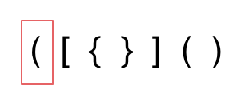
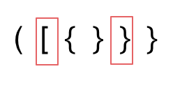

# cpp_data_structure 

* 代码随想录 https://programmercarl.com/

* 一个有非常简明例子的cpp网站：https://en.cppreference.com/w/

--------------------------------------------------------------------------------
> **大家不必太在意leetcode上执行用时，打败多少多少用户，这个就是一个玩具，非常不准确。**
> 
> 做题的时候自己能分析出来时间复杂度就可以了，至于leetcode上执行用时，大概看一下就行，只要达到最优的时间复杂度就可以了，
> 
> 一样的代码多提交几次可能就击败百分之百了....
--------------------------------------------------------------------------------

# 栈与队列

--------------------------------------------------------------------------------

## 有效的括号 valid parentheses

## _3_valid_parentheses.md

--------------------------------------------------------------------------------

### 20. 有效的括号

> Leetcode链接: https://leetcode.cn/problems/valid-parentheses/

> 给定一个只包括 `'('`，`')'`，`'{'`，`'}'`，`'['`，`']'` 的字符串 `s` ，判断字符串是否有效。
> 
> 有效字符串需满足：
> 
> * 左括号必须用相同类型的右括号闭合。
> * 左括号必须以正确的顺序闭合。
> * 每个右括号都有一个对应的相同类型的左括号。
>  
> **示例1：**
> 
> ```html
> 输入：s = "()"
> 输出：true
> ```
> 
> **示例2：**
>  
> ```html
> 输入：s = "()[]{}"
> 输出：true
> ```
> 
> **示例3：**
>  
> ```html
> 输入：s = "(]"
> 输出：false
> ```
>
> **提示：**
> * `1 <= s.length <= 104`
> * `s` 仅由括号 `'()[]{}'` 组成
>
> ```c++
> class Solution {
> public:
>     bool isValid(string s) {
> 
>     }
> };
> ```
>


#### 我的解法

> 对于`{[()]}`的情况，肯定要后入先出`LIFO`，所以要用到`Stack`
>
```c++
class Solution {
public:
    bool isValid(string s) {
        stack<char> sta;
        
        for(auto i = s.begin(); i != s.end(); i++) {
            // 如果是左括号，则压入栈中
            if ( *i == '(' || *i == '{' || *i == '[' ) {
                sta.push(*i);
            }
            // 如果是右括号，则判断栈顶（最近压入）的元素是否对应闭合
            if ( *i == ')' || *i == '}' || *i == ']' ) {
                // 先判断栈是否为空
                if (sta.empty()) {
                    return false;
                }
                // 然后依次判断
                if (*i == ')') {
                    if (sta.top() == '(') {
                        sta.pop();
                    } 
                    else {
                        return false; // 有一处对不上，直接就可以返回false了
                    }
                }
                if (*i == '}') {
                    if (sta.top() == '{') {
                        sta.pop();
                    } 
                    else {
                        return false; // 有一处对不上，直接就可以返回false了
                    }
                }
                if (*i == ']') {
                    if (sta.top() == '[') {
                        sta.pop();
                    } 
                    else {
                        return false; // 有一处对不上，直接就可以返回false了
                    }
                }                
                
            }
        }
        
        // 全部对的上
        if(sta.empty()) {
            return true;     
        }
        
        //后半段缺少闭合 如 s="({[]}"
        return false;   
    }
};
```


#### 我的解法 优化

> 
> <font color="yellow"> 在匹配左括号的时候，右括号入栈，就只需要比较当前元素和栈顶相不相等就可以了，比左括号先入栈代码实现要简单的多了！ </font>
>
```c++
class Solution {
public:
    bool isValid(string s) {
        stack<char> sta;
        
        // 在匹配左括号的时候，右括号入栈，就只需要比较当前元素和栈顶相不相等就可以了，比左括号先入栈代码实现要简单的多了
        for(auto i = s.begin(); i != s.end(); i++) {
            // 如果是左括号，则对应的右括号入栈
            if ( *i == '(' || *i == '{' || *i == '[' ) {
                if (*i == '(') {
                    sta.push(')');
                }
                if (*i == '{') {
                    sta.push('}');
                }                
                if (*i == '[') {
                    sta.push(']');
                }
            }
            // 如果是右括号，则判断栈顶（最近压入）的元素是否对应
            if ( *i == ')' || *i == '}' || *i == ']' ) {
                // 先判断栈是否为空
                if (sta.empty()) {
                    return false;
                }
                else {
                    if (*i == sta.top()) {
                        sta.pop();
                    }
                    else {
                        return false;
                    }
                }
                               
            }
        }
        
        // 全部对的上
        if(sta.empty()) {
            return true;     
        }
        
        //后半段缺少闭合 如 s="({[]}"
        return false;   
    }
};
```


#### 代码随想录 

##### 题外话

> **括号匹配是使用栈解决的经典问题**。
> 
> 题意其实就像我们在写代码的过程中，要求括号的顺序是一样的，有左括号，相应的位置必须要有右括号。
> 
> 如果还记得编译原理的话，编译器在 词法分析的过程中处理括号、花括号等这个符号的逻辑，也是使用了栈这种数据结构。
> 
> 再举个例子，`linux`系统中，`cd`这个进入目录的命令我们应该再熟悉不过了。
>
> ```bash
> cd a/b/c/../../
> ```
> 
> 这个命令最后进入`a`目录，系统是如何知道进入了`a`目录呢 ，这就是栈的应用（其实可以出一道相应的面试题了）
>
> 所以栈在计算机领域中应用是非常广泛的。
> 
> 有的同学经常会想学的这些数据结构有什么用，也开发不了什么软件，大多数同学说的软件应该都是**可视化的软件例如APP、网站之类的，那都是非常上层的应用了**，**底层很多功能的实现都是基础的数据结构和算法**。
> 
> **所以数据结构与算法的应用往往隐藏在我们看不到的地方！**
> 
> 这里我就不过多展开了，先来看题
> 

##### 进入正题

> **由于栈结构的特殊性，非常适合做对称匹配类的题目**。
> 
> <font color="yellow"> 首先要弄清楚，字符串里的括号不匹配有几种情况。</font>
> 
> <font color="yellow"> 一些同学，在面试中看到这种题目上来就开始写代码，然后就越写越乱。 </font>
>
> 建议在写代码之前要分析好有哪几种不匹配的情况，如果不在动手之前分析好，写出的代码也会有很多问题。
> 
> 先来分析一下 这里有三种不匹配的情况，
> 
> 1. 第一种情况，字符串里左方向的括号多余了 ，所以不匹配。
>
> <div align=center>
> 
> </div>
>
> 
> 2. 第二种情况，括号没有多余，但是 括号的类型没有匹配上
>
> <div align=center>
> 
> </div>
>
> 3. 第三种情况，字符串里右方向的括号多余了，所以不匹配。
>
> <div align=center>
> 
> </div>
>
> <font color="yellow"> 我们的代码只要覆盖了这三种不匹配的情况，就不会出问题，可以看出 动手之前分析好题目的重要性。 </font>
>
> 动画如下：
>
> <div align=center>
> 
> </div>
>
> * 第一种情况：已经遍历完了字符串，但是栈不为空，说明有相应的左括号没有右括号来匹配，所以return false
> 
> * 第二种情况：遍历字符串匹配的过程中，发现栈里没有要匹配的字符。所以return false
> 
> * 第三种情况：遍历字符串匹配的过程中，栈已经为空了，没有匹配的字符了，说明右括号没有找到对应的左括号return false
> 
> 那么什么时候说明左括号和右括号全都匹配了呢，就是字符串遍历完之后，栈是空的，就说明全都匹配了。
> 
> 分析完之后，代码其实就比较好写了，
> 
> <font color="yellow"> 但还有一些技巧，在匹配左括号的时候，右括号先入栈，就只需要比较当前元素和栈顶相不相等就可以了，比左括号先入栈代码实现要简单的多了！ </font>
>
> **技巧性的东西没有固定的学习方法，还是要多看多练，自己灵活运用了**。
>
> 实现C++代码如下：
> 
> ```c++
> class Solution {
> public:
>     bool isValid(string s) {
>         if (s.size() % 2 != 0) return false; // 如果s的长度为奇数，一定不符合要求
>         stack<char> st;
>         for (int i = 0; i < s.size(); i++) {
>             if (s[i] == '(') st.push(')');
>             else if (s[i] == '{') st.push('}');
>             else if (s[i] == '[') st.push(']');
>             // 第三种情况：遍历字符串匹配的过程中，栈已经为空了，没有匹配的字符了，说明右括号没有找到对应的左括号 return false
>             // 第二种情况：遍历字符串匹配的过程中，发现栈里没有我们要匹配的字符。所以return false
>             else if (st.empty() || st.top() != s[i]) return false;
>             else st.pop(); // st.top() 与 s[i]相等，栈弹出元素
>         }
>         // 第一种情况：此时我们已经遍历完了字符串，但是栈不为空，说明有相应的左括号没有右括号来匹配，所以return false，否则就return true
>         return st.empty();
>     }
> };
> ```
>
