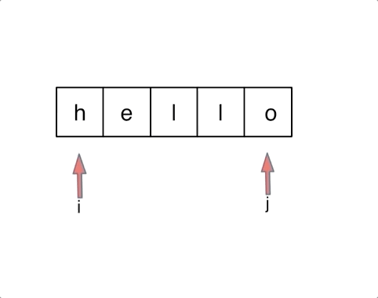

# cpp_data_structure 

* 代码随想录 https://programmercarl.com/

* 一个有非常简明例子的cpp网站：https://en.cppreference.com/w/

--------------------------------------------------------------------------------
> **大家不必太在意leetcode上执行用时，打败多少多少用户，这个就是一个玩具，非常不准确。**
> 
> 做题的时候自己能分析出来时间复杂度就可以了，至于leetcode上执行用时，大概看一下就行，只要达到最优的时间复杂度就可以了，
> 
> 一样的代码多提交几次可能就击败百分之百了....
--------------------------------------------------------------------------------

# 字符串

--------------------------------------------------------------------------------

## 反转字符串 reverse string

## _1_reverse_string.md

--------------------------------------------------------------------------------

### 344. 反转字符串

> Leetcode链接: https://leetcode.cn/problems/reverse-string/

> 编写一个函数，其作用是将输入的字符串反转过来。输入字符串以字符数组 `s` 的形式给出。
> 
> 不要给另外的数组分配额外的空间，你必须**原地修改输入数组**、使用 `O(1)` 的额外空间解决这一问题。
> 
> 
> **示例1：**
> 
> ```html
> 输入：s = ["h","e","l","l","o"]
> 输出：["o","l","l","e","h"]
> ```
>
> **示例2：**
> 
> ```html
> 输入：s = ["H","a","n","n","a","h"]
> 输出：["h","a","n","n","a","H"]
> ```
>
> **提示：**
> * `1 <= s.length <= 105`
> * `s[i]` 都是 `ASCII` 码表中的可打印字符
>
> ```c++
> class Solution {
> public:
>     void reverseString(vector<char>& s) {
> 
>     }
> };
> ```
> 
> 


#### 我的解法 (但是不满足空间复杂度: `O(1)`的要求)

```c++
class Solution {
public:
    void reverseString(vector<char>& s) {
        // 使用stack栈来反转顺序
        stack<char> sta;

        // 按顺序入栈
        for(int i=0; i < s.size(); i++) {
            sta.push(s[i]);
        }

        // 清空字符数组
        s.clear();

        // 从栈顶部推入字符数组
        while(!sta.empty()){
            s.push_back(sta.top());
            sta.pop();
        }

    }
};
```

#### 其实可以一句话解决

```c++
class Solution {
public:
    void reverseString(vector<char>& s) {
        reverse(s.begin(), s.end());
    }
};
```


#### 代码随想录

>
> 先说一说题外话：
>
> 对于这道题目一些同学直接用C++里的一个库函数 `reverse`，调一下直接完事了， 相信每一门编程语言都有这样的库函数。
>
> 如果这么做题的话，这样大家不会清楚反转字符串的实现原理了。
>
> 但是也不是说库函数就不能用，是要分场景的。
> 
> <font color="yellow">如果在现场面试中，我们什么时候使用库函数，什么时候不要用库函数呢？</font>
> 
> **如果题目关键的部分直接用库函数就可以解决，建议不要使用库函数。**
>
> 毕竟面试官一定不是考察你对库函数的熟悉程度， 如果使用`python`和`java` 的同学更需要注意这一点，因为`python`、`java`提供的库函数十分丰富。
>
> **如果库函数仅仅是 解题过程中的一小部分，并且你已经很清楚这个库函数的内部实现原理的话，可以考虑使用库函数。**
>
> 建议大家平时在`leetcode`上练习算法的时候本着这样的原则去练习，这样才有助于我们对算法的理解。
>
> 不要沉迷于使用库函数一行代码解决题目之类的技巧，不是说这些技巧不好，而是说这些技巧可以用来娱乐一下。
>
> 真正自己写的时候，要保证理解可以实现是相应的功能。
> 
> 接下来再来讲一下如何解决反转字符串的问题。
> 
> 大家应该还记得，我们已经讲过了206.反转链表 (`../_2_2_Linked_List/_3_reverse_linked_list.md`)。
> 
> 在反转链表中，使用了双指针的方法。
> 
> 那么反转字符串依然是使用双指针的方法，只不过对于字符串的反转，其实要比链表简单一些。
> 
> 因为字符串也是一种数组，所以元素在内存中是连续分布，这就决定了反转链表和反转字符串方式上还是有所差异的。
>
> 对于字符串，我们定义两个指针（也可以说是索引下标），一个从字符串前面，一个从字符串后面，两个指针同时向中间移动，并交换元素。
>
> 以字符串`hello`为例，过程如下：
>
> 
> <div align=center>
> 
> </div>
> 
> 不难写出如下C++代码:
>
> ```c++
> void reverseString(vector<char>& s) {
>     for (int i = 0, j = s.size() - 1; i < s.size()/2; i++, j--) {
>         swap(s[i],s[j]);
>     }
> }
> ```
> 循环里只要做交换`s[i]` 和`s[j]`操作就可以了，那么我这里使用了`swap` 这个库函数。大家可以使用。
>
> 因为相信大家都知道交换函数如何实现，而且这个库函数仅仅是解题中的一部分， 所以这里使用库函数也是可以的。
>
> `swap`可以有两种实现。
>
> 一种就是常见的交换数值：
> ```c++
> int tmp = s[i];
> s[i] = s[j];
> s[j] = tmp;
> ```
> 
> 一种就是通过位运算：
> ```c++
> s[i] ^= s[j];
> s[j] ^= s[i];
> s[i] ^= s[j];
> ```
> 
> 这道题目还是比较简单的，但是我正好可以通过这道题目说一说在刷题的时候，使用库函数的原则。
> 
> 如果题目关键的部分直接用库函数就可以解决，建议不要使用库函数。
> 
> 如果库函数仅仅是 解题过程中的一小部分，并且你已经很清楚这个库函数的内部实现原理的话，可以考虑使用库函数。
>
> 本着这样的原则，我没有使用`reverse`库函数，而使用`swap`库函数。
>
> **在字符串相关的题目中，库函数对大家的诱惑力是非常大的，因为会有各种反转，切割取词之类的操作**，这也是为什么字符串的库函数这么丰富的原因。
>
> 相信大家本着我所讲述的原则来做字符串相关的题目，在选择库函数的角度上会有所原则，也会有所收获。
>
> C++代码如下：
>
> ```c++
> class Solution {
> public:
>     void reverseString(vector<char>& s) {
>         for (int i = 0, j = s.size() - 1; i < s.size()/2; i++, j--) {
>             swap(s[i],s[j]);
>         }
>     }
> };
> ```
> 
> 时间复杂度: `O(n)`
> 空间复杂度: `O(1)`
>
> 


