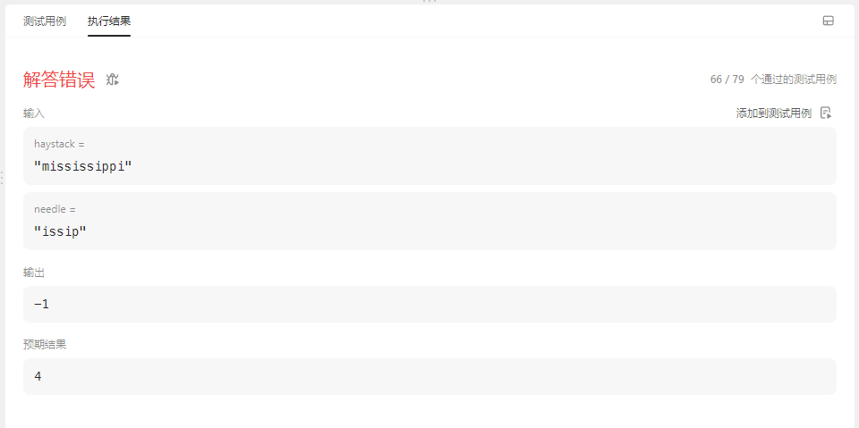

# cpp_data_structure 

* 代码随想录 https://programmercarl.com/

* 一个有非常简明例子的cpp网站：https://en.cppreference.com/w/

--------------------------------------------------------------------------------
> **大家不必太在意leetcode上执行用时，打败多少多少用户，这个就是一个玩具，非常不准确。**
> 
> 做题的时候自己能分析出来时间复杂度就可以了，至于leetcode上执行用时，大概看一下就行，只要达到最优的时间复杂度就可以了，
> 
> 一样的代码多提交几次可能就击败百分之百了....
--------------------------------------------------------------------------------

# 字符串

--------------------------------------------------------------------------------

## 找出字符串中第一个匹配项的下标  find the index of_the first occurrence in a string

## _6_find_the_index_of_the_first_occurrence_in_a_string.md

--------------------------------------------------------------------------------

### 28. 找出字符串中第一个匹配项的下标

> Leetcode链接: https://leetcode.cn/problems/find-the-index-of-the-first-occurrence-in-a-string/

> 给你两个字符串 `haystack` 和 `needle` ，请你在 `haystack` 字符串中找出 `needle` 字符串的第一个匹配项的下标（下标从 `0` 开始）。如果 `needle` 不是 `haystack` 的一部分，则返回  `-1` 。
>
> 
> **示例1：**
> 
> ```html
> 输入：haystack = "sadbutsad", needle = "sad"
> 输出：0
> 解释："sad" 在下标 0 和 6 处匹配。
> 第一个匹配项的下标是 0 ，所以返回 0 。
> ```
>
> **示例2：**
> 
> ```html
> 输入：haystack = "leetcode", needle = "leeto"
> 输出：-1
> 解释："leeto" 没有在 "leetcode" 中出现，所以返回 -1 。
> ```
>
> **提示：**
> * `1 <= haystack.length, needle.length <= 104`
> * `haystack` 和 `needle` 仅由小写英文字符组成
>
> ```c++
> class Solution {
> public:
>     int strStr(string haystack, string needle) {
> 
>     }
> };
> ```
> 
> 
>  


#### 我的解法1   66 / 79 通过 --- 78 / 79通过 --- 全部通过

```c++
class Solution {
public:
    int strStr(string haystack, string needle) {
        bool is_doing_match = false;      // 标识当前是否正在匹配
        vector<int> done;     // 存储暂时符合的连续下标
        int location = 0;     // needle中待匹配的字符下标

        for(int i=0; i < haystack.size(); i++) {
            // 判断是否完成
            if(done.size() == needle.size()) { // 连续下标的数量已经满足
                return done[0]; // 停止循环，返回下标值
            }
            // 如果未完成，则进行下面的检查

            // 1.若匹配未开始
            if(!is_doing_match) {
                // 当前字符与needle的首字符相同，开始进入匹配
                if(haystack[i] == needle[0]) {
                    is_doing_match = true; // 标识置true
                    done.push_back(i);     // 导入首字符对应的下标
                    location++;            // 首字符匹配完成，待匹配下一个字符
                }
            } 
            // 2.若匹配已开始，正在进行
            else {
                // 2.1. 若当前字符与needle的待匹配字符相同，
                if(haystack[i] == needle[location]) {
                    // 检查i是否和done中的最后一个字符保持连续
                    if(i == *(done.end() - 1) + 1) { // 连续
                        is_doing_match = true; 
                        done.push_back(i); // 导入字符对应的下标
                        location++;  // 字符匹配完成，匹配下一个字符
                    } 
                    else { // 不连续
                        is_doing_match = false; // 标识置false, 重新匹配
                        done.clear();          // 清理上一次匹配积累的下标
                        location = 0;          // needle中待匹配的字符下标。从头开始
                    } 
                }
                // 2.2. 若当前字符与needle的待匹配字符不同            
                else {
                    is_doing_match = false;
                    done.clear();          // 清理上一次匹配积累的下标
                    location = 0;          // needle中待匹配的字符下标。从头开始
                } 

            }            
        }

        // 全部遍历后，判断是否完成
        if(done.size() == needle.size()) { // 连续下标的数量已经满足
            return done[0]; // 停止循环，返回下标值
        }
        // 如果未完成
        return -1;
    }
};
```

> <font color="yellow">报错信息如下</font>
>
> <div align=center>
> 
> </div>
>
> <font color="yellow">
> 
> 分析可知
> 
> 当遍历完`'missi'`后，遍历到`haystack[5] = 's'`时判断不通过，导致错过了`haystack[4]`开头的`'issip'`
>
> 这说明我们的遍历并不完整
>
> 应该从每个元素开始都进行上面的这种匹配
> 
> </font>
>
> 
> 
> <font color="gree">修改前</font>
> 
> ```c++
> bool is_doing_match = false;      
> vector<int> done;     
> int location = 0;     
> 
> for(int i=0; i < haystack.size(); i++) {
>    ...
> } 
> 
> if(done.size() == needle.size()) { // 连续下标的数量已经满足
>     return done[0]; // 停止循环，返回下标值
> }    
> 
> return -1;
> ```
>
> <font color="gree">修改后</font>
>
> ```c++
> for(int k=0; k < haystack.size(); k++) {
>    bool is_doing_match = false;      
>    vector<int> done;     
>    int location = 0;    
> 
>    for(int i=k; i < haystack.size(); i++) {
>       ...
>    } 
>    if(done.size() == needle.size()) { // 连续下标的数量已经满足
>        return done[0]; // 停止循环，返回下标值
>    }    
> } 
> 
> return -1;
> ```
> 
> 
>
 
```c++
class Solution {
public:
    int strStr(string haystack, string needle) {
        for(int k=0; k < haystack.size(); k++) {
            bool is_doing_match = false;      // 标识当前是否正在匹配
            vector<int> done;     // 存储暂时符合的连续下标
            int location = 0;     // needle中待匹配的字符下标

            for(int i=k; i < haystack.size(); i++) {
                // 判断是否完成
                if(done.size() == needle.size()) { // 连续下标的数量已经满足
                    return done[0]; // 停止循环，返回下标值
                }
                // 如果未完成，则进行下面的检查
    
                // 1.若匹配未开始 is_doing_match = false;
                if(!is_doing_match) {
                    // 当前字符与needle的首字符相同，开始进入匹配
                    if(haystack[i] == needle[0]) {
                        is_doing_match = true; // 标识置true
                        done.push_back(i);     // 导入首字符对应的下标
                        location = 1;            // 首字符匹配完成，待匹配下一个字符
                    }
                } 
                // 2.若匹配已开始，正在进行 is_doing_match = true;
                else { 
                    // 2.1. 若当前字符与needle的待匹配字符相同，
                    if(haystack[i] == needle[location]) {
                        // 检查i是否和done中的最后一个字符保持连续
                        if(i == *(done.end() - 1) + 1) { // 连续
                            is_doing_match = true; 
                            done.push_back(i); // 导入字符对应的下标
                            location++;  // 字符匹配完成，匹配下一个字符
                        } 
                        else { // 不连续
                            is_doing_match = false; // 标识置false, 重新匹配
                            done.clear();          // 清理上一次匹配积累的下标
                            location = 0;          // needle中待匹配的字符下标。从头开始
                        } 
                    }
                    // 2.2. 若当前字符与needle的待匹配字符不同            
                    else {
                        is_doing_match = false;
                        done.clear();          // 清理上一次匹配积累的下标
                        location = 0;          // needle中待匹配的字符下标。从头开始
                    } 
    
                }            
            }
            // 全部遍历后，判断是否完成
            if(done.size() == needle.size()) { // 连续下标的数量已经满足
                return done[0]; // 停止循环，返回下标值
            }       
    
        }
    
        // 如果未完成
        return -1;
    }
};

```
> <font color="yellow">报错信息如下</font>
>
> <div align=center>
> 
> </div>
>
> <font color="yellow">
> 
> 没有检测到`haystack[1]`开头的匹配字符串，反而是检测到了后面的`haystack[14]`开头的匹配字符串
> 
> 这是因为: 当`k=0`时，`haystack[0]-[1]`的匹配不行后，会继续从`haystack[2]`向后遍历，错过了`haystack[1]`开头的匹配项（第一个匹配项，正确答案）
>
> 如果想要获取`haystack[1]`开头的匹配项，只有当循环进行到`k=1`时才会得到。
> 
> 由于我们在`k=0`时就得到了`haystack[14]`开头的匹配项，所以返回了`14`。没进入到下一次大循环
> 
> </font>
>
> <font color="gree">
>
> 这个问题难以解决
>
> 只能试试暴力解法，将`k=0, 1, 2, ..., haystack.size()-1`的所有遍历结果得到的匹配项开头下标进行比较，返回最小值
> 
> </font>
>
 
```c++
class Solution {
public:
    int strStr(string haystack, string needle) {
        // 存储k=0, 1, 2, ..., haystack.size()-1`的所有遍历结果
        // greater: key越大，优先级越高，越靠近队头。对应小根堆(top指向的队尾元素最小min)
        priority_queue<int, vector<int>, greater<int>> result; 

        for(int k=0; k < haystack.size(); k++) {
            bool is_doing_match = false;      // 标识当前是否正在匹配
            vector<int> done;     // 存储暂时符合的连续下标
            int location = 0;     // needle中待匹配的字符下标

            for(int i=k; i < haystack.size(); i++) {
                // 判断是否完成
                if(done.size() == needle.size()) { // 连续下标的数量已经满足
                    result.push(done[0]);  // 存储下标值
                    break;   // 停止循环，
                }
                // 如果未完成，则进行下面的检查
    
                // 1.若匹配未开始 is_doing_match = false;
                if(!is_doing_match) {
                    // 当前字符与needle的首字符相同，开始进入匹配
                    if(haystack[i] == needle[0]) {
                        is_doing_match = true; // 标识置true
                        done.push_back(i);     // 导入首字符对应的下标
                        location = 1;            // 首字符匹配完成，待匹配下一个字符
                    }
                } 
                // 2.若匹配已开始，正在进行 is_doing_match = true;
                else { 
                    // 2.1. 若当前字符与needle的待匹配字符相同，
                    if(haystack[i] == needle[location]) {
                        // 检查i是否和done中的最后一个字符保持连续
                        if(i == *(done.end() - 1) + 1) { // 连续
                            is_doing_match = true; 
                            done.push_back(i); // 导入字符对应的下标
                            location++;  // 字符匹配完成，匹配下一个字符
                        } 
                        else { // 不连续
                            is_doing_match = false; // 标识置false, 重新匹配
                            done.clear();          // 清理上一次匹配积累的下标
                            location = 0;          // needle中待匹配的字符下标。从头开始
                        } 
                    } 
                    // 2.2. 若当前字符与needle的待匹配字符不同            
                    else {
                        is_doing_match = false;
                        done.clear();          // 清理上一次匹配积累的下标
                        location = 0;          // needle中待匹配的字符下标。从头开始
                    } 
    
                }            
            }

            // 内循环遍历到最后，还需要最后判断一次是否完成
            if(done.size() == needle.size()) { // 连续下标的数量已经满足
                result.push(done[0]); // 存储下标值
            }       
    
        }
        
        // 返回所有匹配项的开头下标的最小值，即第一个匹配项的开头下标
        if(!result.empty()) {
            return result.top();
        } 
        // 如果所有遍历都没有匹配项
        return -1;
    }
};
```

> <font color="yellow">运行信息如下，成功了</font>
>
> <div align=center>
> 
> </div>
>


#### 我的解法2 暴力匹配

> 
> <font color="yellow">
> 
> 上面的代码逻辑不够清晰，太过复杂
>
> 我们应该这样暴力匹配
>
> </font>
>
> 

```c++
class Solution {
public:
    int strStr(string haystack, string needle) {
        // 外循环
        // k=0, 1, 2, ..., haystack.size()-1`的作为开头的所有遍历结果
        for(int k=0; k < haystack.size(); k++) {
            bool is_doing_match = false;      // 标识当前是否正在匹配
            // 内循环
            // 从k开头的，haystack[k] - [k+needle.size()-1] 子文本串
            // 长度为haystack.size()的子文本串与模式串needle逐位比较
            for(int i=k; i < k+needle.size(); i++) {
               if(haystack[i] == needle[i-k]) {
                   is_doing_match = true;
               }
               else {
                   is_doing_match = false; 
                   break; // 只要有一项不对，就跳出内循环                   
               }
            }
            // 内循环遍历到最后，需要判断匹配是否完成
            if(is_doing_match) { // 如果模式串匹配到最后都保持true
                return k; // 返回匹配项首字符的下标
            }       
        }
        
        // 如果遍历结束都没有匹配项
        return -1;
    }
};
```


#### 代码随想录

##### 思路

> 
> 本题是 `KMP` 经典题目。
>
> 以下文字如果看不进去，可以看我的B站视频：
>
> * 帮你把`KMP`算法学个通透！B站（理论篇）(`https://www.bilibili.com/video/BV1PD4y1o7nd/`)
> * 帮你把`KMP`算法学个通透！（`https://www.bilibili.com/video/BV1M5411j7Xx/`）
>
> `KMP`的经典思想就是:**当出现字符串不匹配时，可以记录一部分之前已经匹配的文本内容，利用这些信息避免从头再去做匹配**。
> 
> 具体看`./KMP.md`
> 
> 读完`./KMP.md`可以顺便把leetcode上28.实现strStr()题目做了。
>
> 
> 


