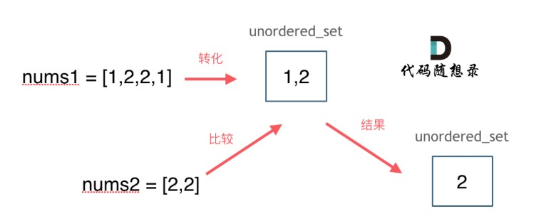

# cpp_data_structure 

* 代码随想录 https://programmercarl.com/

* 一个有非常简明例子的cpp网站：https://en.cppreference.com/w/

--------------------------------------------------------------------------------
> **大家不必太在意leetcode上执行用时，打败多少多少用户，这个就是一个玩具，非常不准确。**
> 
> 做题的时候自己能分析出来时间复杂度就可以了，至于leetcode上执行用时，大概看一下就行，只要达到最优的时间复杂度就可以了，
> 
> 一样的代码多提交几次可能就击败百分之百了....
--------------------------------------------------------------------------------

# 哈希表

--------------------------------------------------------------------------------

## 两个数组的交集 intersection of two arrays

## _2_intersection_of_two_arrays.md

--------------------------------------------------------------------------------

### 349. 两个数组的交集

> Leetcode链接: https://leetcode.cn/problems/intersection-of-two-arrays/

> 给定两个数组 `nums1` 和 `nums2` ，返回 它们的交集 。输出结果中的每个元素一定是 **唯一** 的。我们可以 **不考虑输出结果的顺序** 。
>
> 
> **示例1：**
> 
> ```html
> 输入：nums1 = [1,2,2,1], nums2 = [2,2]
> 输出：[2]
> ```
>
> **示例2：**
> 
> ```html
> 输入：nums1 = [4,9,5], nums2 = [9,4,9,8,4]
> 输出：[9,4]
> 解释：[4,9] 也是可通过的
> ```
>
> **提示：**
> * `1 <= nums1.length, nums2.length <= 1000`
> * `0 <= nums1[i], nums2[i] <= 1000`
>
> ```c++
> class Solution {
> public:
>     vector<int> intersection(vector<int>& nums1, vector<int>& nums2) {
> 
>     }
> };
> ```
> 
> 


#### 最简单的方法就是`o(n^2)`遍历，但是时间复杂度为`o(n^2)`的算法，经常是超时的，我们不能这样做


#### 我的解法 先去除重复元素值，即将元素`insert`进`unordered_set`，重复的不会进入`set`，然后再比较

```c++
class Solution {
public:
    vector<int> intersection(vector<int>& nums1, vector<int>& nums2) {
        // 因为不需要统计出现次数，所以不需要map, 用set就够了
        // 先分开统计出现的元素
        unordered_set<int> set_1; 
        for(size_t i=0; i < nums1.size(); i++) {
            set_1.insert(nums1[i]);
        }
        unordered_set<int> set_2;    
        for(size_t i=0; i < nums2.size(); i++) {
            set_2.insert(nums2[i]);
        }

        // 比较相同的元素
        vector<int> result;
        unordered_set<int>::iterator it_1;
        unordered_set<int>::iterator it_2;        
        for(it_1 = set_1.begin(); it_1 != set_1.end(); it_1++) {
            for(it_2 = set_2.begin(); it_2 != set_2.end(); it_2++) {
                if(*it_1 == *it_2) {
                    // 相同值放入result
                    result.push_back(*it_1);
                }
            }
        }

        // 返回
        return result;
    }
};
```

#### 代码结构优化 不用一个个insert，直接初始化放进去一段

```c++
class Solution {
public:
    vector<int> intersection(vector<int>& nums1, vector<int>& nums2) {
        // 因为不需要统计出现次数，所以不需要map, 用set就够了
        // 先分开统计出现的元素
        unordered_set<int> set_1(nums1.begin(), nums1.end());
        unordered_set<int> set_2(nums2.begin(), nums2.end());  

        // 比较相同的元素
        vector<int> result;
        unordered_set<int>::iterator it_1;
        unordered_set<int>::iterator it_2;        
        for(it_1 = set_1.begin(); it_1 != set_1.end(); it_1++) {
            for(it_2 = set_2.begin(); it_2 != set_2.end(); it_2++) {
                if(*it_1 == *it_2) {
                    // 相同值放入result
                    result.push_back(*it_1);
                }
            }
        }

        // 返回
        return result;
    }
};
```


#### 代码随想录

> 这道题目，主要要学会使用一种哈希数据结构：`unordered_set`，这个数据结构可以解决很多类似的问题。
>
> 注意题目特意说明：**输出结果中的每个元素一定是唯一的，也就是说输出的结果的去重的， 同时可以不考虑输出结果的顺序**
>
> 这道题用暴力的解法时间复杂度是`O(n^2)`，那来看看使用哈希法进一步优化。
>
> 那么用数组来做哈希表也是不错的选择，例如`_1_valid_anagram.md`
>
> 但是要注意，**`_1_valid_anagram.md`中可以使用数组来做哈希的题目，是因为题目都限制了数值的大小**。
>
> **而这道题目没有限制数值的大小，就无法使用数组来做哈希表了**。
>
> <font color="gree">
> 
> 因为数组实现哈希表，实际上是用数组的索引来作为`key`值，即对于出现的数值(`key`)对应的位置`置1`，没出现数值(`key`)对应的位置`置0`
> 
> 如果`key`值范围(数值范围)过大，数组长度(索引最大值)就需要很大，导致空间资源不可控
> 
> </font>
>
> **而且如果哈希值比较少、特别分散、跨度非常大，使用数组就造成空间的极大浪费**。
>
> 此时就要使用另一种结构体了，`set` ，关于`set`，`C++` 给提供了如下三种可用的数据结构：
>
> * `std::set`
> * `std::multiset`
> * `std::unordered_set`
>
> `std::set`和`std::multiset`底层实现都是红黑树，`std::unordered_set`的底层实现是哈希表， 使用`unordered_set` 读写效率是最高的，并不需要对数据进行排序，而且还不要让数据重复，所以选择`unordered_set`。
>
> 思路如图所示：
>
> 
> <div align=center>
> 
> </div>
>
> C++代码如下：
>
> ```c++
> class Solution {
> public:
>     vector<int> intersection(vector<int>& nums1, vector<int>& nums2) {
>         unordered_set<int> result_set; // 存放结果，之所以用set是为了给结果集去重
>         unordered_set<int> nums_set(nums1.begin(), nums1.end());
>         for (int num : nums2) {
>             // 发现nums2的元素 在nums_set里又出现过
>             if (nums_set.find(num) != nums_set.end()) {
>                 result_set.insert(num);
>             }
>         }
>         return vector<int>(result_set.begin(), result_set.end());
>     }
> };
> ```
> 
> 


##### 拓展

> 那有同学可能问了，遇到哈希问题我直接都用`set`不就得了，用什么数组啊。
> 
> 直接使用`set` 不仅占用空间比数组大，而且速度要比数组慢，`set`把数值映射到`key`上都要做`hash`计算的。
> 
> 不要小瞧 这个耗时，在数据量大的情况，差距是很明显的。


##### 后记

>
> 本题后面 `leetcode`改了 `题目描述` 和 `后台测试数据`，增添了 `数值范围`：
>
> * `1 <= nums1.length, nums2.length <= 1000`
> * `0 <= nums1[i], nums2[i] <= 1000`
>
> <font color="gree">
> 
> 数组实现哈希表，实际上是用数组的索引来作为`key`值，如果`key`值(数值)过大，数组长度(索引最大值)就需要很大，导致资源浪费
>
> 这里限制了数值范围，即限制了数组长度，不会导致很大的空间资源。是可以把控的
>
> </font>
> 
> 所以就可以 使用数组来做哈希表了， 因为数组都是 `1000`以内的。
> 
> 对应`C++`代码如下：
> 
> ```c++
> class Solution {
> public:
>     vector<int> intersection(vector<int>& nums1, vector<int>& nums2) {
>         unordered_set<int> result_set; // 存放结果，之所以用set是为了给结果集去重
>         int hash[1005] = {0}; // 默认数值为0
>         for (int num : nums1) { // nums1中出现的字母在hash数组中做记录
>             hash[num] = 1;      // 这里已经给nums1去重了
>         }
>         for (int num : nums2) { // nums2中出现话，result记录
>             if (hash[num] == 1) {
>                 result_set.insert(num);
>             }
>         }
>         return vector<int>(result_set.begin(), result_set.end());
>     }
> };
> ```
> 
> 
> 


