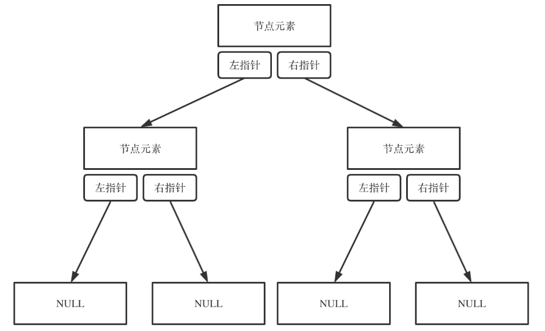
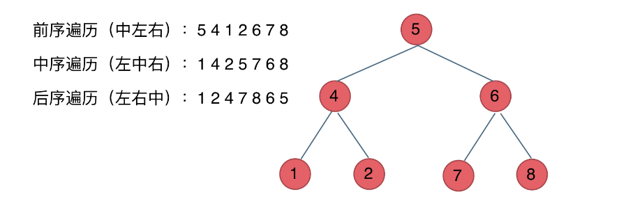

# cpp_data_structure 

* 代码随想录 https://programmercarl.com/

* 一个有非常简明例子的cpp网站：https://en.cppreference.com/w/

--------------------------------------------------------------------------------
> **大家不必太在意leetcode上执行用时，打败多少多少用户，这个就是一个玩具，非常不准确。**
> 
> 做题的时候自己能分析出来时间复杂度就可以了，至于leetcode上执行用时，大概看一下就行，只要达到最优的时间复杂度就可以了，
> 
> 一样的代码多提交几次可能就击败百分之百了....
--------------------------------------------------------------------------------

# 二叉树

--------------------------------------------------------------------------------

## 二叉树理论

## Binary_Tree.md

--------------------------------------------------------------------------------

<font color="yellow">当我们想保证查找效率时，可以用顺序表(数组)存储，当我们想保证插入和删除效率时，我们可以用链式表存储，有没有一种存储方法可以同时兼顾顺序表和链式表的优点？ 
使用二叉树 ，便可兼顾查找效率和插入删除效率~</font>

--------------------------------------------------------------------------------

### 二叉树理论基础 各种博客总结(包括 代码随想录)

#### 树的基础知识概述
> 树状图是一种数据结构，它是由 $n(n>=1)$ 个有限结点组成一个具有层次关系的集合。把它叫做“树”是因为它看起来像一棵倒挂的树，也就是说它是根朝上，而叶朝下的。
> 
> 它具有以下的特点：
> 
> 每个结点有零个或多个子结点；没有父结点的结点称为根结点；每一个非根结点有且只有一个父结点；除了根结点外，每个子结点可以分为多个不相交的子树；
> 
> <div align=center>
> 
> </div>
> 
> 
> **注释**：`Height`节点高度的定义需要修改：从当前节点到叶子节点最长路径的边数之和。注意是最长路径，
> 
> 
> **总结**：`Depth`、`Height`、`Level`都是与`edge`关联的概念
>
> `Depth` 深度： 根节点----当前节点               （自上到下称为计算深度）
> `Height`高度：          当前节点----叶子节点   （自下到上称为计算高度）
> `Level` 层级：从根开始定义起，根为第0层，根的子节点为第1层
>
> 
> **疑问**：
> 
> `Level`层级和`Depth`深度有区别吗？？？
>
> 一般来说，层级从`1`开始，深度从`0`开始，第`1`层的根节点深度为`0`，第`2`层的节点深度为`1`，第`3`层的节点深度`2`，...
>
> 
> 
>
> **补充定义：**
> 
> 节点的度：一个节点含有的子树的个数称为该节点的度（一个节点的孩子个数）
> 树的度：一棵树中，所有节点的度 求最大值，称为树的度（拥有最多孩子的节点的孩子个数）
> 森林：由$m（m>0）$棵互不相交的树的集合称为森林；
> 
> 
> 如图所示：
> 
> <div align=center>
> 
> 
> </div>
>
> 注意：上图中层级从`0`开始了，但是我们一般层级从`1`开始，即根节点为第`1`层
> 

#### 二叉树
##### 1. 二叉树的理论定义
> 二叉树(Binary Tree) 是由$n$个结点构成的有限集$(n≥0)$，$n=0$时为空树，$n>0$时为非空树。对于非空树T：
> 
> * 有且仅有一个根结点；
> * 除根结点外的其余结点又可分为两个不相交的子集$T_L$和$T_R$，分别称为$T$的左子树和右子树，且$T_L$和$T_R$本身又都是二叉树。
>
> <font color="yellow"> 很明显该定义属于递归定义，所以有关二叉树的操作使用递归往往更容易理解和实现。</font>
> 
> <font color="gree">简单来说，二叉树是一个每个结点最多只能有两个分支的树，左边的分支称之为左子树，右边的分支称之为右子树~</font>
> 
> <div align=center>
> 
> </div>
> 
> 
> <font color="yellow">二叉树与一般树的区别主要是两点:
> 
> * 每个结点的度(`Degree`)最多为`2`；
> * 结点的子树有左右之分，不能随意调换，调换后又是一棵新的二叉树。</font>
> 

##### 2. 二叉树的性质

> 
> * 第$i$层的结点总数不超过$2^{i-1},i≥0$
> 
> * 深度为$d$的二叉树最多有$2^{d+1}-1$个结点，最少有$d+1$个结点, $d≥1$。
>
> 性质一是针对一层节点，性质二是整个二叉树的结点总数
> 

> 
> 疑问：
> 
> `Level`层级和`Depth`深度有区别吗？？？
>
> 一般来说，层级从`1`开始，深度从`0`开始，第`1`层的根节点深度为`0`，第`2`层的节点深度为`1`，第`3`层的节点深度`2`，...
>
> 
> 

##### 3. 常见二叉树分类（五种）

**在我们解题过程中二叉树有两种主要的形式：满二叉树和完全二叉树。**

> 1. 满二叉树 
> 
> > 定义1：除了叶结点外每一个结点都有左右子节点且叶子结点都处在最底层。
> > 
> > 定义2：只有度为`0`的结点和度为`2`的结点，并且度为`0`的结点在同一层上。
> >   
> > <div align=center>
> > 
> > </div>
> > 
> > 这棵二叉树为满二叉树，也可以说深度为$k$（有$k+1$层），有 $2^{k+1}-1$ 个节点的二叉树。
>

> 2. 完全二叉树 
> 
> > 定义1：在完全二叉树中，除了最底层节点可能没填满外，其余每层节点数都达到最大值，并且**最下面一层的节点都集中在该层最左边的若干位置**。
> > 
> > 定义2：若设二叉树的高度为 $h$，除第 $h$ 层外，其它各层 ($1～h-1$) 的结点数都达到最大个数，第 $h$ 层有叶子节点，并且**叶子结点都是从左到右依次排布**，这就是完全二叉树。
> > 
> > 
> > <div align=center>
> > 
> > </div>
> > 
> 
> <font color="yellow">有一种数据结构"堆"（也叫优先队列）, 堆可以被看做一棵完全二叉树的数组对象</font>
> > 
> > 堆在物理层面上，表现为一组连续的数组区间：`long[] array` ；将整个数组看作是堆。
> > 
> > 堆在逻辑结构上，一般被视为是一颗完全二叉树。
> > 
> > 堆满足下列性质：
> > 
> > * 堆中某个节点的值总是**不大于或不小于**其父节点的值。
> > * 堆总是一棵完全二叉树。
> > 
> > 这样做是为了保证父子节点的顺序关系
> > 
> > 对应的STL模板类为`std::priority_queue`
> > 
> > ```c++
> > priority_queue<int> pq1; // 等价于priority_queue<int, vector<int>, less<int>> pq;
> > // 默认以vector为底层容器；vector<int>是承载底层数据结构堆 （heap）的容器
> > // 默认以less为比较方式，左边小于右边的时候返回true, 返回true则交换位置，所以排在top的最大，此时优先队列就是大堆，所以优先队列默认就是大堆。 
> > // 如果以greater为比较方式，左边大于右边的时候返回true, 返回true则交换位置，所以排在top的最小，此时优先队列就是小堆，所以优先队列默认就是小堆。 
> > 
> > //大堆：每个结点的值都不大于它的父结点，堆顶元素是最大的。 又叫（大顶堆，大根堆）
> > //小堆：每个结点的值都不小于它的父结点，堆顶元素是最小的。
> > 
> > // 优先级队列`std::priority_queue`更像是`std::stack`，只有`top()`，没有`front()`，没有`back()`
> > 
> > // ``std::priority_queue``和`std::stack`都是可以看作 “ 只能从队尾访问元素的队列`std::queue` ”
> > 
> > // less<int>使得队头元素最小，队尾元素最大，`top()`从队尾访问元素，所以是大顶堆
> > // greater<int>使得队头元素最大，队尾元素最小，`top()`从队尾访问元素，所以是小顶堆
> > ```
> > 
> 
> 


> 3. 二叉搜索树 ——又称二叉查找树、二叉排序树（Binary Sort Tree）
> 
> 二叉搜索树是一个有序树。
> 
> > 它是**一颗空树或是满足下列性质**的二叉树：
> > 
> > 1）若左子树不空，则左子树上所有节点的值均小于或等于它的根节点的值；
> > 
> > 2）若右子树不空，则右子树上所有节点的值均大于或等于它的根节点的值；
> > 
> > 3）左、右子树也分别为二叉排序树。 
> > 
> > 即 **左边<=根<=右边**
> > 
> > 下面这两棵树都是搜索树
> > 
> > 
> > <div align=center>
> > 
> > </div>
> > 
>

> 4. 平衡二叉搜索树---又称 AVL 树（Adelson-Velsky and Landis）
>
> <font color="gree">在 二叉搜索树 的基础上加入限制条件，定义 平衡二叉搜索树</font>
> 
> > 它是**一颗空树或左右两个子树的高度差的绝对值不超过 1**，并且左右两个子树都是一棵平衡二叉树。
> > 
> > <div align=center>
> > 
> > </div>
> > 
> > 最后一棵 不是平衡二叉树，因为它的左右两个子树的高度差的绝对值超过了1。
> > 
>

> 5. 红黑树---平衡二叉查找树（AVL树）+颜色属性
> 
> <font color="gree">在 平衡二叉搜索树 的基础上加入限制条件，定义 红黑树</font>
> 
> > 每个节点都带有颜色属性（颜色为红色或黑色）的自平衡二叉查找树，满足下列性质：
> > 
> > 1）节点是红色或黑色；
> > 
> > 2）根节点是黑色；
> > 
> > 3）所有叶子节点都是黑色；
> > 
> > 4）每个红色节点必须有两个黑色的子节点。(即，从每个叶子到根的所有路径上不能有两个连续为红色的结点)；
> > 
> > 5）从任一节点到其每个叶子的所有简单路径都包含相同数目的黑色节点。 （没有度为1的结点）。
> > 
> > 以上规则可以保证左右子树结点数差距不超过两倍~
> > 
> > <div align=center>
> > 
> > </div>
> > 
> > <font color="yellow">红黑树很难，我们不需要掌握</font>
> 
> > C++中`map`、`set`、`multimap`，`multiset`的底层实现都是红黑树，所以`map`、`set`的增删操作时间时间复杂度是`logn`.注意我这里没有说`unordered_map`、`unordered_set`.因为`unordered_map`、`unordered_set`底层实现是哈希表。
> > C++ STL中的`set`,`map`底层实现是红黑树，而不是`AVL`，否则需要频繁旋转操作
> > 
> > <div align=center>
> > 
> > 
> > </div>
> > 
> > 注：红黑树是自平衡的二叉查找树，并不一定是完美的二叉查找树。
> >
> 


##### 4. 二叉树的存储方式

> **二叉树可以链式存储，也可以顺序存储。**
> 
> 那么链式存储方式就用指针， 顺序存储的方式就是用数组。
> 
> 顾名思义就是顺序存储的元素在内存是连续分布的，而链式存储则是通过指针把分布在各个地址的节点串联一起。
> 
> > 链式存储如图：
> >  
> > <div align=center>
> > 
> > </div>
> > 
> 
> > 链式存储是大家很熟悉的一种方式，那么我们来看看如何顺序存储呢？
> > 
> > 其实就是用数组来存储二叉树，顺序存储的方式如图：
> > 
> > <div align=center>
> > 
> > </div>
> > 
> > 用数组来存储二叉树如何遍历的呢？
> > 
> > 如果父节点的数组下标是 $i$，那么它的左孩子就是 $i * 2 + 1$，右孩子就是 $i * 2 + 2$。
> 
> 
> <font color="yellow">用链式表示的二叉树，更有利于我们理解，所以一般我们都是用链式存储二叉树。但是大家要了解，用数组依然可以表示二叉树。</font>
>

##### 5. 二叉树的遍历方式

> 二叉树主要有两种遍历方式：
> 
> > * 深度优先遍历：先往深走，遇到叶子节点再往回走。
> > * 广度优先遍历：一层一层的去遍历。
> 
> 
> 这两种遍历是图论中最基本的两种遍历方式
> 
> 那么**从深度优先遍历和广度优先遍历进一步拓展，才有如下遍历方式：**
>
> > 
> > <font color="green">
> > 
> > * 深度优先遍历
> >   * 前序遍历（递归法，迭代法）  --- 栈(stack)实现
> >   * 中序遍历（递归法，迭代法）  --- 栈(stack)实现
> >   * 后序遍历（递归法，迭代法）  --- 栈(stack)实现
> > * 广度优先遍历
> >   * 层次遍历（迭代法）  --- 队列(queue)实现
> > </font>
> > 
> 
> <font color="green">有时候，前序遍历被称为先序遍历</font>
> 
> 以下是解释：
> > 
> > 在深度优先遍历中：有三个顺序，前中后序遍历，这里前中后，其实指的就是中间节点的遍历顺序.
> > **<font color="green">只要记住 前中后序指的就是中间节点的位置就可以了。</font>**
> > 
> > 看如下中间节点的顺序，就可以发现，中间节点的顺序就是所谓的遍历方式
> > * 前序遍历：中左右
> > * 中序遍历：左中右
> > * 后序遍历：左右中
> > 
> > <div align=center>
> > 
> > </div>
> > 
> >
>
> > 再举一个例子
> > 
> > <div align=center>
> > 
> > </div>
> > 
> > 先序：ABDEHCFIG
> > 中序：DBHEAFICG
> > 后序：DHEBIFGCA
> > 
> > <div align=center>
> > 
> > </div>
>
> 
> > 最后再说一说二叉树中深度优先和广度优先遍历实现方式，<font color="gree">我们做二叉树相关题目，经常会使用递归的方式来实现**深度优先遍历**，也就是实现前中后序遍历，使用递归是比较方便的。</font>
> 
> > 之前我们讲栈与队列的时候，就说过**栈其实就是递归的一种实现结构**，也就说前中后序遍历的逻辑其实都是可以借助栈使用非递归的方式来实现的。
> 
> > <font color="gree">而**广度优先遍历**的实现一般使用队列来实现，这也是队列先进先出的特点所决定的，因为需要先进先出的结构，才能一层一层的来遍历二叉树。</font>
> 
> 
> **这里其实我们又了解了栈与队列的一个应用场景了**。
> 
> 具体的实现我们后面都会讲的，这里大家先要清楚这些理论基础。
>


#### 二叉树的实现
> 之前我们说过了二叉树有两种存储方式顺序存储，和链式存储，顺序存储就是用数组来存，这个定义没啥可说的，我们来看看链式存储的二叉树节点的定义方式。<br>
> ```c++
> // 创建二叉树 TreeNode
> struct TreeNode {
>     int val;
>     TreeNode *left;
>     TreeNode *right;
>     TreeNode() : val(0), left(NULL), right(NULL) {}
>     TreeNode(int x) : val(x), left(NULL), right(NULL) {}
>     TreeNode(int x, TreeNode *left, TreeNode *right) : val(x), left(left), right(right) {}
> };
> 
> 
> // 创建单链表 ListNode
> struct ListNode {
>     int val;  // 节点上存储的元素
>     ListNode *next;  // 指向下一个节点的指针
>     ListNode() : val(0), next(NULL) {}  // 节点的构造函数
>     ListNode(int x) : val(x), next(NULL) {}  // 节点的构造函数
>     ListNode(int x, ListNode *next) : val(x), next(next) {}  // 节点的构造函数
> };
> 
> ```
> 
> <font color="yellow">大家会发现二叉树的定义 和 链表 是差不多的，相对于链表 ，二叉树的节点里多了一个指针，有两个指针，指向左右子节点。</font>
> 
> 这里要提醒大家要注意二叉树节点定义的书写方式。
> 
> **在现场面试的时候 面试官可能要求手写代码，所以数据结构的定义以及简单逻辑的代码一定要锻炼白纸写出来。**
> 
> 因为我们在刷`leetcode`的时候，节点的定义默认都定义好了，真到面试的时候，需要自己写节点定义的时候，有时候会一脸懵逼！
> 
> 


#### 总结

>
> 二叉树是一种基础数据结构，在算法面试中都是常客，也是众多数据结构的基石。
> 
> 本篇我们介绍了二叉树的种类、存储方式、遍历方式以及定义，比较全面的介绍了二叉树各个方面的重点，帮助大家扫一遍基础。
>
> **说到二叉树，就不得不说递归，很多同学对递归都是又熟悉又陌生，递归的代码一般很简短，但每次都是一看就会，一写就废**。
>
> 


#### 二叉搜索树的实现，各种操作
<https://blog.csdn.net/qq_54169998/article/details/121108627>


--------------------------------------------------------------------------------

### 二叉树的递归遍历

> 
> https://programmercarl.com/%E4%BA%8C%E5%8F%89%E6%A0%91%E7%9A%84%E9%80%92%E5%BD%92%E9%81%8D%E5%8E%86.html
> 

>
> https://www.bilibili.com/video/BV1Wh411S7xt
>
> 评论区：
>  
> 写递归靠直觉,这句话没毛病。其实关键的关键是递归终止条件，否则就会写入无限递归。
> 
> 至于递归层本身的处理代码，这个对于大多数人都是没有问题的。
> 
> 递归的难点是如何让递归下探到下一层然后再回归到本层，这也是大多数人没有把握的地方。
>
> 你要学习栈的原理，回过头来就能理解。因为栈`stack`的原理是：后进先出，也就是位于栈顶的元素会首先弹出，这是递归能实现的根本性计算机原理。每一层递归就是一个独立的栈，从栈顶逐步弹出，也就一层层回归到本层，直至回归到最初始的那一层。
> 
> 函数的调用也是栈结构，每次调用就是压栈，`return`就是出栈，顶层`return`之后自然回到上一次调用
>
> 
> 


>
> 一看就会，一写就废！
>
> 这次我们要好好谈一谈递归，为什么很多同学看递归算法都是“一看就会，一写就废”。
>
> 主要是对递归不成体系，没有方法论，每次写递归算法 ，都是靠玄学来写代码，代码能不能编过都靠运气。
>
> **本篇将介绍前后中序的递归写法，一些同学可能会感觉很简单，其实不然，我们要通过简单题目把方法论确定下来，有了方法论，后面才能应付复杂的递归。**
>
> 这里帮助大家确定下来递归算法的三个要素。**每次写递归，都按照这三要素来写，可以保证大家写出正确的递归算法！**
>
> 1. **确定递归函数的参数和返回值**： 确定哪些参数是递归的过程中需要处理的，那么就在递归函数里加上这个参数， 并且还要明确每次递归的返回值是什么进而确定递归函数的返回类型。
> 
> 2. **确定终止条件**： 写完了递归算法, 运行的时候，经常会遇到栈溢出的错误，就是没写终止条件或者终止条件写的不对，操作系统也是用一个栈的结构来保存每一层递归的信息，如果递归没有终止，操作系统的内存栈必然就会溢出。
> 
> 3. **确定单层递归的逻辑**： 确定每一层递归需要处理的信息。在这里也就会重复调用自己来实现递归的过程。
>
> 
> 好了，我们确认了递归的三要素，接下来就来练练手：
> 


> 
> <font color="yellow">先自己做一做`leetcode`上三道题目，分别是：</font>
> 
> 144.二叉树的前序遍历(https://leetcode.cn/problems/binary-tree-preorder-traversal/)
> 
> 94.二叉树的中序遍历(https://leetcode.cn/problems/binary-tree-inorder-traversal/)
>
> 145.二叉树的后序遍历(https://leetcode.cn/problems/binary-tree-postorder-traversal/)
> 
> 
> 
> **前序遍历**
> 
> https://leetcode.cn/problems/binary-tree-preorder-traversal/
> 
> <font color="yellow">我的递归解法为</font>
>
> ```c++
> /**
>  * Definition for a binary tree node.
>  * struct TreeNode {
>  *     int val;
>  *     TreeNode *left;
>  *     TreeNode *right;
>  *     TreeNode() : val(0), left(nullptr), right(nullptr) {}
>  *     TreeNode(int x) : val(x), left(nullptr), right(nullptr) {}
>  *     TreeNode(int x, TreeNode *left, TreeNode *right) : val(x), left(left), right(right) {}
>  * };
>  */
> class Solution {
> public:
>     // 递归函数
>     void recursion(TreeNode* node, vector<int>& vec) {
>         // 1. 确认递归函数的参数和返回值: 要处理的是节点和vector数组。注意传指针或传引用，不要传值
>         // 2. 确定终止条件：只要节点不为空，就往下探索
>         // 3. 确定单层递归的逻辑：先中，再左，最后右
>         if(node != nullptr) {
>             // 先中
>             vec.push_back(node->val);
>             // 再左
>             if(node->left != nullptr) {
>                 recursion(node->left, vec);
>             }
>             // 最后右
>             if(node->right != nullptr) {
>                 recursion(node->right, vec);
>             }            
>         } 
>         return; // void其实不用return
>     }
>     // 调用递归函数即可，不能在函数内定义函数，要在函数外定义递归函数
>     vector<int> preorderTraversal(TreeNode* root) {
>         vector<int> result;
>         recursion(root, result);
>         return result;
>     }
> };
> ```
> 
> 
> 
> 
> **中序遍历**
> 
> https://leetcode.cn/problems/binary-tree-inorder-traversal/
> 
> <font color="yellow">我的递归解法为</font>
>
> ```c++
> /**
>  * Definition for a binary tree node.
>  * struct TreeNode {
>  *     int val;
>  *     TreeNode *left;
>  *     TreeNode *right;
>  *     TreeNode() : val(0), left(nullptr), right(nullptr) {}
>  *     TreeNode(int x) : val(x), left(nullptr), right(nullptr) {}
>  *     TreeNode(int x, TreeNode *left, TreeNode *right) : val(x), left(left), right(right) {}
>  * };
>  */
> class Solution {
> public:
>     // 递归函数
>     void recursion(TreeNode* node, vector<int>& vec) {
>         // 1. 确认递归函数的参数和返回值: 要处理的是节点和vector数组。注意传指针或传引用，不要传值
>         // 2. 确定终止条件：只要节点不为空，就往下探索
>         // 3. 确定单层递归的逻辑：先左，再中，最后右
>         if(node != nullptr) {
>             // 先左
>             if(node->left != nullptr) {
>                 recursion(node->left, vec);
>             }
>             // 再中
>             vec.push_back(node->val);            
>             // 最后右
>             if(node->right != nullptr) {
>                 recursion(node->right, vec);
>             }            
>         } 
>         return; // void其实不用return
>     }
>     // 调用递归函数即可，不能在函数内定义函数，要在函数外定义递归函数
>     vector<int> inorderTraversal(TreeNode* root) {
>         vector<int> result;
>         recursion(root, result);
>         return result;
>     }
> };
> ```
> 
> 
> 
> 
> **后序遍历**
> 
> https://leetcode.cn/problems/binary-tree-postorder-traversal/
> 
> <font color="yellow">我的递归解法为</font>
>
> ```c++
> /**
>  * Definition for a binary tree node.
>  * struct TreeNode {
>  *     int val;
>  *     TreeNode *left;
>  *     TreeNode *right;
>  *     TreeNode() : val(0), left(nullptr), right(nullptr) {}
>  *     TreeNode(int x) : val(x), left(nullptr), right(nullptr) {}
>  *     TreeNode(int x, TreeNode *left, TreeNode *right) : val(x), left(left), right(right) {}
>  * };
>  */
> class Solution {
> public:
>     // 递归函数
>     void recursion(TreeNode* node, vector<int>& vec) {
>         // 1. 确认递归函数的参数和返回值: 要处理的是节点和vector数组。注意传指针或传引用，不要传值
>         // 2. 确定终止条件：只要节点不为空，就往下探索
>         // 3. 确定单层递归的逻辑：先左，再右，最后中
>         if(node != nullptr) {
>             // 先左
>             if(node->left != nullptr) {
>                 recursion(node->left, vec);
>             }         
>             // 再右
>             if(node->right != nullptr) {
>                 recursion(node->right, vec);
>             }      
>             // 最后中
>             vec.push_back(node->val);         
>         } 
>         return; // void其实不用return
>     }
>     // 调用递归函数即可，不能在函数内定义函数，要在函数外定义递归函数
>     vector<int> postorderTraversal(TreeNode* root) {
>         vector<int> result;
>         recursion(root, result);
>         return result;
>     }
> };
> ```
> 
> 
> 
>
> <font color="yellow"> 
> 
> 反思我的代码哪里有可以优化的 
>
> `if(node->left != nullptr)`和`if(node->right != nullptr)`完全没必要
>
> 因为`recursion(node->left, vec);`和`recursion(node->right, vec);`会进行检查
>
> 这样冗余了
> 
> 修改后的代码如下
> 
> </font>
> 
> 
> **前序遍历**
> 
> https://leetcode.cn/problems/binary-tree-preorder-traversal/
> 
> <font color="yellow">我的优化后的递归解法为</font>
>
> ```c++
> class Solution {
> public:
>     // 递归函数
>     void recursion(TreeNode* node, vector<int>& vec) {
>         // 1. 确认递归函数的参数和返回值: 要处理的是节点和vector数组。注意传指针或传引用，不要传值
>         // 2. 确定终止条件：只要节点不为空，就往下探索
>         // 3. 确定单层递归的逻辑：先中，再左，最后右
>         if(node != nullptr) {
>             vec.push_back(node->val);     // 先中
>             recursion(node->left, vec);   // 再左
>             recursion(node->right, vec);  // 最后右
>         }
>     }
>     // 调用递归函数即可，不能在函数内定义函数，要在函数外定义递归函数
>     vector<int> preorderTraversal(TreeNode* root) {
>         vector<int> result;
>         recursion(root, result);
>         return result;
>     }
> };
> ```
> 
> 
> **中序遍历**
> 
> https://leetcode.cn/problems/binary-tree-inorder-traversal/
> 
> <font color="yellow">我的优化后的递归解法为</font>
>
> ```c++
> class Solution {
> public:
>     // 递归函数
>     void recursion(TreeNode* node, vector<int>& vec) {
>         // 1. 确认递归函数的参数和返回值: 要处理的是节点和vector数组。注意传指针或传引用，不要传值
>         // 2. 确定终止条件：只要节点不为空，就往下探索
>         // 3. 确定单层递归的逻辑：先左，再中，最后右
>         if(node != nullptr) {
>             recursion(node->left, vec);   // 先左
>             vec.push_back(node->val);     // 再中            
>             recursion(node->right, vec);  // 最后右
>         }
>     }
>     // 调用递归函数即可，不能在函数内定义函数，要在函数外定义递归函数
>     vector<int> inorderTraversal(TreeNode* root) {
>         vector<int> result;
>         recursion(root, result);
>         return result;
>     }
> };
> ```
>
> 
> **后序遍历**
> 
> https://leetcode.cn/problems/binary-tree-postorder-traversal/
> 
> <font color="yellow">我的优化后的递归解法为</font>
>
> ```c++
> class Solution {
> public:
>     // 递归函数
>     void recursion(TreeNode* node, vector<int>& vec) {
>         // 1. 确认递归函数的参数和返回值: 要处理的是节点和vector数组。注意传指针或传引用，不要传值
>         // 2. 确定终止条件：只要节点不为空，就往下探索
>         // 3. 确定单层递归的逻辑：先左，再右，最后中
>         if(node != nullptr) {
>             recursion(node->left, vec);   // 先左           
>             recursion(node->right, vec);  // 再右
>             vec.push_back(node->val);     // 最后中             
>         }
>     }
>     // 调用递归函数即可，不能在函数内定义函数，要在函数外定义递归函数
>     vector<int> postorderTraversal(TreeNode* root) {
>         vector<int> result;
>         recursion(root, result);
>         return result;
>     }
> };
> ```
> 


> 
> <font color="gree">接下来是代码随想录的解析</font>
> 
> **以下以前序遍历为例：**
>
> 1. **确定递归函数的参数和返回值**：因为要打印出前序遍历节点的数值，所以参数里需要传入vector来放节点的数值，除了这一点就不需要再处理什么数据了也不需要有返回值，所以递归函数返回类型就是void，代码如下：
>
> ```c++ {.line-numbers}
> void traversal(TreeNode* cur, vector<int>& vec)
> ```
> 
> 2. **确定终止条件**：在递归的过程中，如何算是递归结束了呢，当然是当前遍历的节点是空了，那么本层递归就要结束了，所以如果当前遍历的这个节点是空，就直接`return`，代码如下：
>
> ```c++ {.line-numbers}
> if (cur == NULL) return;
> ```
>
> 3. 确定单层递归的逻辑：前序遍历是中左右的循序，所以在单层递归的逻辑，是要先取中节点的数值，代码如下：
>
> ```c++ {.line-numbers}
> vec.push_back(cur->val);    // 中
> traversal(cur->left, vec);  // 左
> traversal(cur->right, vec); // 右
> ```
> 
> 单层递归的逻辑就是按照中左右的顺序来处理的，这样二叉树的前序遍历，基本就写完了，再看一下完整代码：
>
> 前序遍历：
> 
> ```c++
> class Solution {
> public:
>     void traversal(TreeNode* cur, vector<int>& vec) {
>         if (cur == NULL) return;
>         vec.push_back(cur->val);    // 中
>         traversal(cur->left, vec);  // 左
>         traversal(cur->right, vec); // 右
>     }
>     vector<int> preorderTraversal(TreeNode* root) {
>         vector<int> result;
>         traversal(root, result);
>         return result;
>     }
> };
> ```
>
> 那么前序遍历写出来之后，中序和后序遍历就不难理解了，代码如下：
>
> 
> 中序遍历：
> 
> ```c++
> void traversal(TreeNode* cur, vector<int>& vec) {
>     if (cur == NULL) return;
>     traversal(cur->left, vec);  // 左
>     vec.push_back(cur->val);    // 中
>     traversal(cur->right, vec); // 右
> }
> ```
> 
> 后序遍历：
> 
> ```c++
> void traversal(TreeNode* cur, vector<int>& vec) {
>     if (cur == NULL) return;
>     traversal(cur->left, vec);  // 左
>     traversal(cur->right, vec); // 右
>     vec.push_back(cur->val);    // 中
> }
> ```
> 
> 
> 


>
> 可能有同学感觉前后中序遍历的递归太简单了，要打迭代法（非递归），别急，我们明天打迭代法，打个通透！
> 
> 


--------------------------------------------------------------------------------

### 二叉树的迭代遍历

> 
> https://programmercarl.com/%E4%BA%8C%E5%8F%89%E6%A0%91%E7%9A%84%E8%BF%AD%E4%BB%A3%E9%81%8D%E5%8E%86.html
>
> 

> 
> 为什么可以用迭代法（非递归的方式）来实现二叉树的前后中序遍历呢？
> 
> 我们在`栈与队列：匹配问题都是栈的强项` (`../_2_3_Stack_and_Queue/_4_remove_all_adjacent_duplicates_in_string.md`)中提到了，**递归的实现就是：每一次递归调用都会把函数的局部变量、参数值和返回地址等压入调用栈中**，然后递归返回的时候，从栈顶弹出上一次递归的各项参数，所以这就是递归为什么可以返回上一层位置的原因。
> 
> 此时大家应该知道我们迭代法（非递归）用栈也可以是实现二叉树的前后中序遍历了。
> 
> <font color="yellow">
>
> 递归法 隐式 使用栈存储参数和返回值
> 迭代法 明式 使用栈存储？？？
> 
> </font>
> 

> 
> <font color="yellow">先自己做一做`leetcode`上三道题目，分别是：</font>
> 
> 144.二叉树的前序遍历(https://leetcode.cn/problems/binary-tree-preorder-traversal/)
> 
> 94.二叉树的中序遍历(https://leetcode.cn/problems/binary-tree-inorder-traversal/)
>
> 145.二叉树的后序遍历(https://leetcode.cn/problems/binary-tree-postorder-traversal/)
> 
> 
> 
> **前序遍历**
> 
> https://leetcode.cn/problems/binary-tree-preorder-traversal/
> 
> <font color="yellow">我的迭代解法为</font>
>
> ```c++
> class Solution {
> public:
>     vector<int> preorderTraversal(TreeNode* root) {
>         vector<int> vec;
>         // 使用栈暂存右节点
>         stack<TreeNode*> sta;        
>         TreeNode* node = root;
>         while(node != nullptr) {
>             vec.push_back(node->val); // 先中
>             if(node->left != nullptr) { // 若左侧有节点
>                 if(node->right != nullptr) sta.push(node->right); // 如果有右节点，就暂存右节点地址           
>                 node = node->left;        // node更新为左节点
>             }  
>             else if(node->right != nullptr){ // 若左侧无节点，但是右侧有节点
>                 node = node->right;     // node更新为右节点
>             }
>             else { // 若两侧都无节点，查看栈
>                 if(!sta.empty()) {   // sta不为空，说明未遍历完
>                    node = sta.top(); // 向上返回，转向sta中暂存的右节点
>                    sta.pop();
>                 }
>                 else{  // sta为空，说明全部都遍历完了
>                     break;
>                 }
>             }
>         }
> 
>         return vec;
>     }
> };
> ```
> 
> 
> **中序遍历**
> 
> https://leetcode.cn/problems/binary-tree-inorder-traversal/
> 
> <font color="yellow">我的迭代解法为</font>
> 
> ```c++
> class Solution {
> public:
>     vector<int> inorderTraversal(TreeNode* root) {
>         vector<int> vec;
>         // 使用栈暂存中和右节点对
>         stack<pair<TreeNode*, TreeNode*>> sta;        
>         TreeNode* node = root;
>         while(node != nullptr) {
>             if(node->left != nullptr) { // 若左下有节点
>                 sta.push({node, node->right});  // 暂存<中，右>节点对                           
>                 node = node->left;      // node更新为左下节点
>             }  
>             else if(node->right != nullptr){ // 若左下无节点，但是右下有节点
>                 vec.push_back(node->val); // 存值
>                 node = node->right;     // node更新为右下节点
>             }
>             else { // 若两侧都无节点
>                 vec.push_back(node->val); // 存值 
>                 // 查看栈
>                 if(!sta.empty()) {
>                     // 节点对中second为空，那么存中节点的值即可，直到节点对中的second不为空
>                     while(!sta.empty() && sta.top().second == nullptr) { 
>                         vec.push_back(sta.top().first->val);  //
>                         sta.pop();
>                     } 
>                     // 此时只要sta不为空，则top().second必然不为空的
>                     if(!sta.empty()) {
>                         vec.push_back(sta.top().first->val);                     
>                         node = sta.top().second;  // 将指针指向sta中存储的右下节点
>                         sta.pop();                        
>                     } 
>                     else {
>                         break;
>                     }
>                 }
>                 else{
>                     break;
>                 }
>             }
>         }
> 
>         return vec;
>     }
> };
> ```
> 
> 
> 
> 
> **后序遍历（在先序遍历的基础上修改，左右互换， 最后再将vector反转顺序即可）**
> 
> https://leetcode.cn/problems/binary-tree-postorder-traversal/
> 
> <font color="yellow">我的迭代解法为</font>
> 
> ```c++
> class Solution {
> public:
>     vector<int> postorderTraversal(TreeNode* root) {
>         // 先序遍历是中左右
>         // 由于左右是对称的概念，我们镜像修改left和right，就可以得到中右左
>         // 反转后就可以得到左右中
>         // 先序遍历的代码将left改为right，right改为left，最后reverse
>         vector<int> vec;
>         // 使用栈暂存左节点
>         stack<TreeNode*> sta;        
>         TreeNode* node = root;
>         while(node != nullptr) {
>             vec.push_back(node->val); // 先中
>             if(node->right != nullptr) { // 若左侧有节点
>                 if(node->left != nullptr) sta.push(node->left); // 如果有左节点，就暂存左节点地址           
>                 node = node->right;        // node更新为右节点
>             }  
>             else if(node->left != nullptr){ // 若右侧无节点，但是左侧有节点
>                 node = node->left;     // node更新为左节点
>             }
>             else { // 若两侧都无节点，查看栈
>                 if(!sta.empty()) {   // sta不为空，说明未遍历完
>                    node = sta.top(); // 向上返回，转向sta中暂存的左节点
>                    sta.pop();
>                 }
>                 else{  // sta为空，说明全部都遍历完了
>                     break;
>                 }
>             }
>         }
>         // 以上得到中右左的顺序
>         reverse(vec.begin(), vec.end()); // 将结果反转之后就是左右中的顺序了
>         return vec;
>     }
> };
> ```
> 


>
> <font color="yellow"> 
> 
> 反思我的代码哪里有可以优化的 
>
> 栈只用来存储部分节点了，应该让其存储所有未处理节点，这样逻辑更加简洁
> 
> 修改后的代码如下
> 
> </font>
>
> 
> **前序遍历**
> 
> https://leetcode.cn/problems/binary-tree-preorder-traversal/
> 
> <font color="yellow">我的优化后的迭代解法为</font>
>
> ```c++
> class Solution {
> public:
>     vector<int> preorderTraversal(TreeNode* root) {
>         vector<int> vec;
>         // 使用栈暂存未处理的节点
>         stack<TreeNode*> sta;        
>         if(root != nullptr) sta.push(root);
>         TreeNode* node = nullptr;        
>         while (!sta.empty()) {
>             node = sta.top();                       // 中
>             sta.pop();
>             vec.push_back(node->val);
>             // 先入的后处理，所以先将右节点入栈
>             if (node->right) sta.push(node->right);  // 右（空节点不入栈）
>             if (node->left) sta.push(node->left);    // 左（空节点不入栈）
>         }
> 
>         return vec;
>     }
> };
> ``` 
> 
> 
> 
> **中序遍历**
> 
> https://leetcode.cn/problems/binary-tree-inorder-traversal/
> 
> <font color="yellow">我的优化后的迭代解法为</font>
>
> ```c++
> class Solution {
> public:
>     vector<int> inorderTraversal(TreeNode* root) {
>         vector<int> vec;
>         stack<TreeNode*> sta;
>         TreeNode* node = root;
>         while (node != NULL || !sta.empty()) {
>             if (node != NULL) { // 指针来访问节点，访问到最底层
>                 sta.push(node); // 将访问的节点放进栈
>                 node = node->left;                // 左
>             } else {
>                 node = sta.top(); // 从栈里弹出的数据，就是要处理的数据（放进result数组里的数据）
>                 sta.pop();
>                 vec.push_back(node->val);     // 中
>                 node = node->right;               // 右
>             }
>         }
>         return vec;
>     }
> };
> ``` 
> 
> 
> 
> **后序遍历（在先序遍历的基础上修改，左右互换， 最后再将vector反转顺序即可）**
> 
> https://leetcode.cn/problems/binary-tree-postorder-traversal/
> 
> <font color="yellow">我的优化后的迭代解法为</font>
> 
> ```c++
> class Solution {
> public:
>     vector<int> postorderTraversal(TreeNode* root) {
>         // 先序遍历是中左右
>         // 由于左右是对称的概念，我们镜像修改left和right，就可以得到中右左
>         // 反转后就可以得到左右中
>         // 先序遍历的代码将left改为right，right改为left，最后reverse
>         vector<int> vec;
>         // 使用栈暂存未处理的节点
>         stack<TreeNode*> sta;        
>         if(root != nullptr) sta.push(root);
>         TreeNode* node = nullptr;        
>         while (!sta.empty()) {
>             node = sta.top();                       // 中
>             sta.pop();
>             vec.push_back(node->val);
>             // 先入的后处理，所以先将左节点入栈
>             if (node->left) sta.push(node->left);    // 左（空节点不入栈）            
>             if (node->right) sta.push(node->right);  // 右（空节点不入栈）
>         }
>         // 以上得到中右左的顺序
>         reverse(vec.begin(), vec.end()); // 将结果反转之后就是左右中的顺序了
>         return vec;
>     }
> };
> ``` 
> 
> 
> 


