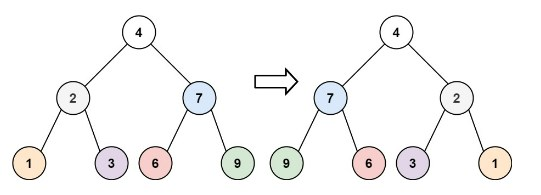
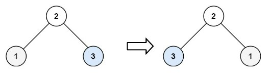

# cpp_data_structure 

* 代码随想录 https://programmercarl.com/

* 一个有非常简明例子的cpp网站：https://en.cppreference.com/w/

--------------------------------------------------------------------------------
> **大家不必太在意leetcode上执行用时，打败多少多少用户，这个就是一个玩具，非常不准确。**
> 
> 做题的时候自己能分析出来时间复杂度就可以了，至于leetcode上执行用时，大概看一下就行，只要达到最优的时间复杂度就可以了，
> 
> 一样的代码多提交几次可能就击败百分之百了....
--------------------------------------------------------------------------------

# 二叉树

--------------------------------------------------------------------------------

## 翻转二叉树 invert binary tree

## _1_invert_binary_tree.md

--------------------------------------------------------------------------------

### 226.翻转二叉树

> Leetcode链接: https://leetcode.cn/problems/invert-binary-tree/

>
> 给你一棵二叉树的根节点 `root` ，翻转这棵二叉树，并返回其根节点。
>
>
> **示例1：**
> > 
> > <div align=center>
> > 
> > </div>
> >  
> ```html
> 输入：root = [4,2,7,1,3,6,9]
> 输出：[4,7,2,9,6,3,1]
> ```
>
> **示例2：**
> > 
> > <div align=center>
> > 
> > </div>
> >  
> ```html
> 输入：root = [2,1,3]
> 输出：[2,3,1]
> ```
>
>
> **示例2：**
> 
> ```html
> 输入：root = []
> 输出：[]
> ```
>
>
> **提示：**
> * 树中节点数目范围在 `[0, 100]` 内
> * `-100 <= Node.val <= 100`
>
>
> ```c++
> /**
>  * Definition for a binary tree node.
>  * struct TreeNode {
>  *     int val;
>  *     TreeNode *left;
>  *     TreeNode *right;
>  *     TreeNode() : val(0), left(nullptr), right(nullptr) {}
>  *     TreeNode(int x) : val(x), left(nullptr), right(nullptr) {}
>  *     TreeNode(int x, TreeNode *left, TreeNode *right) : val(x), left(left), right(right) {}
>  * };
>  */
> class Solution {
> public:
>     TreeNode* invertTree(TreeNode* root) {
> 
>     }
> };
> ```
> 


