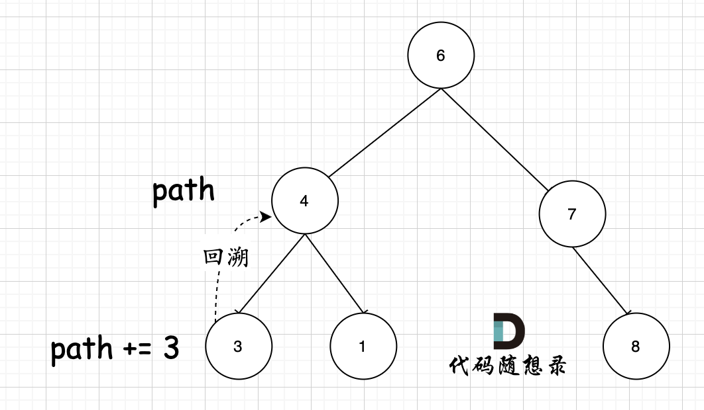

# cpp_data_structure 

* 代码随想录 https://programmercarl.com/

* 一个有非常简明例子的cpp网站：https://en.cppreference.com/w/

--------------------------------------------------------------------------------
> **大家不必太在意leetcode上执行用时，打败多少多少用户，这个就是一个玩具，非常不准确。**
> 
> 做题的时候自己能分析出来时间复杂度就可以了，至于leetcode上执行用时，大概看一下就行，只要达到最优的时间复杂度就可以了，
> 
> 一样的代码多提交几次可能就击败百分之百了....
--------------------------------------------------------------------------------

# 二叉树

--------------------------------------------------------------------------------

## 配套：回溯算法理论基础

## backtracking_algorithms.md

--------------------------------------------------------------------------------

## 二叉树的所有路径 binary tree paths

## _6_binary_tree_paths.md

--------------------------------------------------------------------------------

### 257. 二叉树的所有路径

> 
> Leetcode链接: https://leetcode.cn/problems/binary-tree-paths/
> 
> 给你一个二叉树的根节点 `root` ，按 **任意顺序** ，返回所有从根节点到叶子节点的路径。
>
> **叶子节点** 是指没有子节点的节点。
>
>
> **示例1：**
> > 
> > <div align=center>
> > 
> > </div>
> >  
> ```html
> 输入：root = [1,2,3,null,5]
> 输出：["1->2->5","1->3"]
> ```
>
> **示例2：**
> 
> ```html
> 输入：root = [1]
> 输出：["1"]
> ```
>
> **提示：**
> * 树中节点数目范围在 `[0, 100]` 内
> * `-100 <= Node.val <= 100`
> 
> ```c++
> /**
>  * Definition for a binary tree node.
>  * struct TreeNode {
>  *     int val;
>  *     TreeNode *left;
>  *     TreeNode *right;
>  *     TreeNode() : val(0), left(nullptr), right(nullptr) {}
>  *     TreeNode(int x) : val(x), left(nullptr), right(nullptr) {}
>  *     TreeNode(int x, TreeNode *left, TreeNode *right) : val(x), left(left), right(right) {}
>  * };
>  */
> class Solution {
> public:
>     vector<string> binaryTreePaths(TreeNode* root) {
> 
>     }
> };
> ```
>
> 


#### 我的思路, 代码实现

>
> **回溯和递归是一一对应的，有一个递归，就要有一个回溯**
>
> **回溯要和递归永远在一起，世界上最遥远的距离是你在花括号里，而我在花括号外！**
> 

 
> 我最开始的思路
> 
> 由于不一定是完整二叉树(叶子节点都在左侧)，无法通过`(2*i+1)`和`(2*i+2)`来定位左右孩子
> 
> 选取哪种遍历？也许前中后+层序都可？重点是回溯父节点
>
> 循环遍历所有节点，对于每个节点，检查`left`和`right`是否存在，如果为空，说明该节点是叶子节点
> 
> 然后就需要回溯，找到父节点，父节点的父节点，直到`root`
>
> 但是我们之前写过的遍历，无法帮助我们向上回溯父节点呀？
>
> 我的想法：递归函数需要返回值，来帮助我们回溯父节点
>
> 但是这个难以实现
>
> 我们还是每一步保存已溯路径吧
> 

> 
> <font color="gree">
> 
> 我的思路：
>
> * 建立路径容器：`vector<string> allpath`
> 
> * 从`root`开始，进行递归：
>
> > 先中：
> > > 
> > > 每到一个节点处，更新`root`到当前节点的路径`nodepath`
> > > 
> > > 如果没有子节点了，说明当前就是叶子，将`nodepath`存入`allpath`, 然后返回
> > > 
> > > 如果还有子节点，说明当前节点并非叶子节点，`nodepath`需要添加`->`
> > 
> > 再左：
> > > 如果存在左孩子，则执行递归函数
> > 
> > 最后右：
> > > 如果存在右孩子，则执行递归函数
> >
> > 返回
>
> </font>
>
> **代码如下**
> 
> ```c++
> class Solution {
> public:
>     // 整数转字符串
>     string itos(int i) {
>         stringstream ss;
>         ss << i;
>         return ss.str(); // 返回string类型
>     }    
>     
>     // 递归函数
>     // 结果集 vector<string>& allpath: 传引用，因为所有路径都需要存进去， 需要使用同一个路径容器
>     // 从root开始已走过的路径 string nodepath：传值，这样每次都会拷贝nodepath，将每条路径的分开，不会互相影响
>     void recursion(TreeNode* node, string nodepath, vector<string>& allpath) { 
>         // 若node为空则返回
>         if(node == nullptr) return;        
>         // 先中
>         nodepath += itos(node->val); // 当前路径加入节点, int值转为string值
>         // 如果当前节点node为叶子节点，则返回
>         if(node->left == nullptr && node->right == nullptr) {
>             allpath.push_back(nodepath);
>             return;
>         }   
>         // 如果是非叶子节点，则string加入值后，需要加入"->"
>         nodepath += "->";     
>         // 开始向下到左右孩子
>         // 再左
>         if(node->left != nullptr) recursion(node->left, nodepath, allpath);
>         // 最后右
>         if(node->right != nullptr) recursion(node->right, nodepath, allpath);
>         return;
>     }
> 
>     vector<string> binaryTreePaths(TreeNode* root) {
>         vector<string> allpath;
>         if(root == nullptr) return allpath; // 若root为空则返回空集
>         // 从root开始遍历
>         string nodepath; // 空路径
>         recursion(root, nodepath, allpath);
>         // 返回
>         return allpath;
>     } 
> };
> ```
>
> **非常需要注意的就是，每条路径递归时，必须使用传值，而不是传引用，传参时会拷贝，这样左孩子和有孩子的路径就会分开，不会互相影响。**
>
> 
> <font color="gree">注意在函数定义的时候`void recursion(TreeNode* node, string nodepath, vector<string>& allpath) ` ，定义的是`string nodepath`，每次都是复制赋值，不用使用引用，否则就无法做到回溯的效果。（这里涉及到`C++`语法知识）</font>
> 
>
 
##### 简化

>
> **简化**
> 
> **可以不用自己写`int`转换`string`函数，直接使用C++内置`to_string()`函数**
>
> **代码如下**
> 
> ```c++
> class Solution {
> public:  
>     // 递归函数
>     // 结果集 vector<string>& allpath: 传引用，因为所有路径都需要存进去， 需要使用同一个路径容器
>     // 从root开始已走过的路径 string nodepath：传值，这样每次都会拷贝nodepath，将每条路径的分开，不会互相影响
>     void recursion(TreeNode* node, string nodepath, vector<string>& allpath) { 
>         // 若node为空则返回
>         if(node == nullptr) return;        
>         // 先中
>         nodepath += to_string(node->val); // 当前路径加入节点, int值转为string值
>         // 如果当前节点node为叶子节点，则返回
>         if(node->left == nullptr && node->right == nullptr) {
>             allpath.push_back(nodepath);
>             return;
>         }   
>         // 如果是非叶子节点，则string加入值后，需要加入"->"
>         nodepath += "->";     
>         // 开始向下到左右孩子
>         // 再左
>         if(node->left != nullptr) recursion(node->left, nodepath, allpath);
>         // 最后右
>         if(node->right != nullptr) recursion(node->right, nodepath, allpath);
>         return;
>     }
> 
>     vector<string> binaryTreePaths(TreeNode* root) {
>         vector<string> allpath;
>         if(root == nullptr) return allpath; // 若root为空则返回空集
>         // 从root开始遍历
>         string nodepath; // 空路径
>         recursion(root, nodepath, allpath);
>         // 返回
>         return allpath;
>     } 
> };
> ```
>


##### 取出冗余逻辑
 

>
> **取出冗余逻辑**
>
> 如果`recursion()`一开始就会进行判断`if(node == nullptr) return;`, 那么最后递归时，不用判断
>
> ```c++
> // 再左
> if(node->left != nullptr) recursion(node->left, nodepath, allpath);
> // 最后右
> if(node->right != nullptr) recursion(node->right, nodepath, allpath);
> ```
>
> 改成
>
> ```c++
> // 再左
> recursion(node->left, nodepath, allpath);
> // 最后右
> recursion(node->right, nodepath, allpath);
> ```
>
> **代码如下**
> 
> ```c++
> class Solution {
> public:  
>     // 递归函数
>     // 结果集 vector<string>& allpath: 传引用，因为所有路径都需要存进去， 需要使用同一个路径容器
>     // 从root开始已走过的路径 string nodepath：传值，这样每次都会拷贝nodepath，将每条路径的分开，不会互相影响
>     void recursion(TreeNode* node, string nodepath, vector<string>& allpath) { 
>         // 若node为空则返回
>         if(node == nullptr) return;        
>         // 先中
>         nodepath += to_string(node->val); // 当前路径加入节点, int值转为string值
>         // 如果当前节点node为叶子节点，则返回
>         if(node->left == nullptr && node->right == nullptr) {
>             allpath.push_back(nodepath);
>             return;
>         }   
>         // 如果是非叶子节点，则string加入值后，需要加入"->"
>         nodepath += "->";     
>         // 开始向下到左右孩子
>         // 再左
>         recursion(node->left, nodepath, allpath);
>         // 最后右
>         recursion(node->right, nodepath, allpath);
>         return;
>     }
> 
>     vector<string> binaryTreePaths(TreeNode* root) {
>         vector<string> allpath;
>         if(root == nullptr) return allpath; // 若root为空则返回空集
>         // 从root开始遍历
>         string nodepath; // 空路径
>         recursion(root, nodepath, allpath);
>         // 返回
>         return allpath;
>     } 
> };
> ```
>
> 或者，`recursion()`一开始不判断`if(node == nullptr) return;`
>
> **代码如下**
> 
> 
> ```c++
> class Solution {
> public:  
>     // 递归函数
>     // 结果集 vector<string>& allpath: 传引用，因为所有路径都需要存进去， 需要使用同一个路径容器
>     // 从root开始已走过的路径 string nodepath：传值，这样每次都会拷贝nodepath，将每条路径的分开，不会互相影响
>     void recursion(TreeNode* node, string nodepath, vector<string>& allpath) {      
>         // 先中
>         nodepath += to_string(node->val); // 当前路径加入节点, int值转为string值
>         // 如果当前节点node为叶子节点，则返回
>         if(node->left == nullptr && node->right == nullptr) {
>             allpath.push_back(nodepath);
>             return;
>         }   
>         // 如果是非叶子节点，则string加入值后，需要加入"->"
>         nodepath += "->";     
>         // 开始向下到左右孩子
>         // 再左
>         if(node->left != nullptr) recursion(node->left, nodepath, allpath);
>         // 最后右
>         if(node->right != nullptr) recursion(node->right, nodepath, allpath);
>         return;
>     }
> 
>     vector<string> binaryTreePaths(TreeNode* root) {
>         vector<string> allpath;
>         if(root == nullptr) return allpath; // 若root为空则返回空集
>         // 从root开始遍历
>         string nodepath; // 空路径
>         recursion(root, nodepath, allpath);
>         // 返回
>         return allpath;
>     } 
> };
> ```
>
> 


##### 迭代法


> 
> **前序遍历迭代法的模板**
> 
> https://leetcode.cn/problems/binary-tree-preorder-traversal/
>
> ```c++
> class Solution {
> public:
>     vector<int> preorderTraversal(TreeNode* root) {
>         // 结果集
>         vector<int> result;
>         // 若root为空则返回空集
>         if(root == nullptr) return result; 
>         // 使用栈暂存未处理的节点
>         stack<TreeNode*> sta;     
>         // root节点入栈   
>         sta.push(root);   
>         // 遍历待处理的节点
>         while (!sta.empty()) {
>             // 取出待处理节点
>             TreeNode* node = sta.top();                       
>             sta.pop();
>             // 先中
>             result.push_back(node->val);
>             // 再左，最后右
>             // 先入的后处理，所以先将右节点入栈
>             if (node->right) sta.push(node->right);  // 右（空节点不入栈）
>             if (node->left) sta.push(node->left);    // 左（空节点不入栈）
>         }
> 
>         return result;
>     }
> };
> ``` 
> 
> **我的代码如下**
> 
> ```c++
> class Solution {
> public:  
>     vector<string> binaryTreePaths(TreeNode* root) {
>         // 结果集
>         vector<string> allpath;
>         // 若root为空则返回空集
>         if(root == nullptr) return allpath; 
>         // 使用栈暂存未处理的节点，root到对应节点的路径。两个栈保持同步
>         stack<TreeNode*> nodesta;   
>         stack<string> pathsta; 
>         // root节点入栈， 对应的路径也入栈。两个栈保持同步
>         nodesta.push(root);
>         pathsta.push(to_string(root->val));
> 
>         // 前序遍历：中左右。
>         // 待处理的节点先入栈，注意入栈顺序
>         while (!nodesta.empty()) {
>             // 取出待处理节点，对应路径
>             TreeNode* node = nodesta.top();                       
>             nodesta.pop();
>             string path = pathsta.top();
>             pathsta.pop();          
> 
>             // 先中
>             // 如果当前节点node为叶子节点，则不用再下探了，转而处理下一个待处理节点
>             if(node->left == nullptr && node->right == nullptr) {
>                 allpath.push_back(path);
>                 continue;
>             }   
> 
>             // 先入的后处理，所以先将右节点入栈
>             if (node->right != nullptr) {
>                 nodesta.push(node->right);  // 右节点入栈
>                 // 更新路径
>                 string right_path = path + "->" + to_string(node->right->val); 
>                 pathsta.push(right_path);   // 右节点对应路径入栈
>             }
>             if (node->left != nullptr) {
>                 nodesta.push(node->left);    // 左节点入栈
>                 // 更新路径
>                 string left_path = path + "->" + to_string(node->left->val); 
>                 pathsta.push(left_path);     // 左节点对应路径入栈       
>             }
>         }
> 
>         return allpath;
>     } 
> 
> };
> ```
> 


##### 如果不想频繁传值拷贝，想要传引用怎么办呢？

> <font color="gree">
> 
> 方法一： 
> 
> 使用`vector<TreeNode*>& nodeset`, 存放节点指针
>
> </font> 
> 
> ```c++
> class Solution {
> public:  
>     // 递归函数
>     // 结果集 vector<string>& allpath: 传引用，因为所有路径都需要存进去， 需要使用同一个路径容器
>     // root到当前节点路径上的节点集 vector<TreeNode*>& nodeset：传引用，方便回溯到上一层的父节点
>     void recursion(TreeNode* node, vector<string>& allpath, vector<TreeNode*>& nodeset) {      
>         // 先中
>         nodeset.push_back(node); // 当前节点，加入路径
>         // 如果当前节点node为叶子节点，则转化为字符串，返回到父节点
>         if(node->left == nullptr && node->right == nullptr) {
>             // 路径转化为string
>             string str;
>             for (int i = 0; i < nodeset.size() - 1; i++) {
>                 str += to_string(nodeset[i]->val);
>                 str += "->";
>             }
>             str += to_string(nodeset[nodeset.size() - 1]->val);
>             allpath.push_back(str);
>             return;
>         }   
>         // 再左
>         if(node->left != nullptr) {
>             recursion(node->left, allpath, nodeset); // 递归深入  
>             nodeset.pop_back(); // 回溯
>             // 恢复到进入左孩子之前，这样我们才能进入右孩子，正确建立路径数组
>         }
>         // 最后右
>         if(node->right != nullptr) {
>             recursion(node->right, allpath, nodeset); // 递归深入  
>             nodeset.pop_back(); // 回溯
>             // 恢复到进入左右孩子之前，这样我们才能返回父节点，保证路径数组正确
>         }
>     }
> 
>     vector<string> binaryTreePaths(TreeNode* root) {
>         vector<string> allpath;
>         if(root == nullptr) return allpath; // 若root为空则返回空集
>         // 从root开始遍历
>         vector<TreeNode*> nodeset; // 路径上的节点集
>         recursion(root, allpath, nodeset);
>         // 返回
>         return allpath;
>     } 
> };
> ```
> 
> <font color="gree">
> 
> 方法二： 
> 
> 使用`vector<int>& nodeValset`, 存放节点值
>
> </font> 
> 
> ```c++
> class Solution {
> public:  
>     // 递归函数
>     // 结果集 vector<string>& allpath: 传引用，因为所有路径都需要存进去， 需要使用同一个路径容器
>     // root到当前节点路径上的节点的值val的集合 vector<int>& nodeValset：传引用，方便回溯到上一层的父节点
>     void recursion(TreeNode* node, vector<string>& allpath, vector<int>& nodeValset) {       
>         // 先中
>         nodeValset.push_back(node->val); // 当前节点，加入路径
>         // 如果当前节点node为叶子节点，则转化为字符串，返回到父节点
>         if(node->left == nullptr && node->right == nullptr) {
>             // 路径转化为string
>             string str;
>             for (int i = 0; i < nodeValset.size() - 1; i++) {
>                 str += to_string(nodeValset[i]);
>                 str += "->";
>             }
>             str += to_string(nodeValset[nodeValset.size() - 1]);
>             allpath.push_back(str);
>             return;
>         }   
>         // 再左
>         if(node->left != nullptr) {
>             recursion(node->left, allpath, nodeValset);
>             // 恢复到进入左孩子之前，这样我们才能进入右孩子，正确建立路径数组
>             nodeValset.pop_back(); // 回溯
>         }
>         // 最后右
>         if(node->right != nullptr) {
>             recursion(node->right, allpath, nodeValset);
>             // 恢复到进入左右孩子之前，这样我们才能返回父节点，保证路径数组正确
>             nodeValset.pop_back(); // 回溯
>         }
>     }
> 
>     vector<string> binaryTreePaths(TreeNode* root) {
>         vector<string> allpath;
>         if(root == nullptr) return allpath; // 若root为空则返回空集
>         // 从root开始遍历
>         vector<int> nodeValset; // 路径上的节点集
>         recursion(root, allpath, nodeValset);
>         // 返回
>         return allpath;
>     } 
> };
> ```
> 
> 


#### 代码随想录

> 
> 这道题目要求从根节点到叶子的路径，所以需要前序遍历，这样才方便让父节点指向孩子节点，找到对应的路径。
>
> 在这道题目中将第一次涉及到回溯，因为我们要把路径记录下来，需要回溯来回退一个路径再进入另一个路径。
>
> 前序遍历以及回溯的过程如图：
> 
> <div align=center>
> 
> </div>
>  
> 
> 我们先使用递归的方式，来做前序遍历。**要知道递归和回溯就是一家的，本题也需要回溯**。
>
> 

##### 递归

>
> 1. 递归函数参数以及返回值
> 
> 要传入根节点，记录每一条路径的path，和存放结果集的result，这里递归不需要返回值，代码如下：
>
> ```c++
> void traversal(TreeNode* cur, vector<int>& path, vector<string>& result)
> ```
> 
> 2. 确定递归终止条件
> 
> 在写递归的时候都习惯了这么写：
>
> ```c++
> 
> if (cur == NULL) {
>     终止处理逻辑
> }
> ```
> 
> 但是本题的终止条件这样写会很麻烦，因为本题要找到叶子节点，就开始结束的处理逻辑了（把路径放进result里）。
>
> 那么什么时候算是找到了叶子节点？ 是当 `cur` 不为空，其左右孩子都为空的时候，就找到叶子节点。
>
> 所以本题的终止条件是：
>
> ```c++
> if (cur->left == NULL && cur->right == NULL) {
>     终止处理逻辑
> }
> ```
> 
> 为什么没有判断`cur`是否为空呢，因为下面的逻辑可以控制空节点不入循环。
>
> 再来看一下终止处理的逻辑。
>
> 这里使用 `vector` 结构`path`来记录路径，所以要把`vector` 结构的`path`转为`string`格式，再把这个`string` 放进 `result`里。
>
> **那么为什么使用了 `vector` 结构来记录路径呢？** 因为在下面处理单层递归逻辑的时候，要做回溯，使用`vector`方便来做回溯。
>
> 可能有的同学问了，我看有些人的代码也没有回溯啊。
>
> **其实是有回溯的，只不过隐藏在函数调用时的参数赋值里**，下文我还会提到。
>
> 这里我们先使用`vector`结构的`path`容器来记录路径，那么终止处理逻辑如下：
>
>
> ```c++
> if (cur->left == NULL && cur->right == NULL) { // 遇到叶子节点
>     string sPath;
>     for (int i = 0; i < path.size() - 1; i++) { // 将path里记录的路径转为string格式
>         sPath += to_string(path[i]);
>         sPath += "->";
>     }
>     sPath += to_string(path[path.size() - 1]); // 记录最后一个节点（叶子节点）
>     result.push_back(sPath); // 收集一个路径
>     return;
> }
> ```
>
> 3. 确定单层递归逻辑
>
> 因为是前序遍历，需要先处理中间节点，中间节点就是我们要记录路径上的节点，先放进`path`中。
> 
> `path.push_back(cur->val);`
>
> 然后是递归和回溯的过程，上面说过没有判断`cur`是否为空，那么在这里递归的时候，如果为空就不进行下一层递归了。
> 
> 所以递归前要加上判断语句，下面要递归的节点是否为空，如下
>
> ```c++
> if (cur->left) {
>     traversal(cur->left, path, result);
> }
> if (cur->right) {
>     traversal(cur->right, path, result);
> }
> ```
> 
> 此时还没完，**递归完，要做回溯**啊，因为 `path` 不能一直加入节点，它还要删节点，然后才能加入新的节点。
>
> 那么回溯要怎么回溯呢，一些同学会这么写，如下：
>
> ```c++
> if (cur->left) {
>     traversal(cur->left, path, result);
> }
> if (cur->right) {
>     traversal(cur->right, path, result);
> }
> path.pop_back();
> ```
> 
> 这个回溯就有很大的问题，我们知道，**回溯和递归是一一对应的，有一个递归，就要有一个回溯**，这么写的话相当于把递归和回溯拆开了， 一个在花括号里，一个在花括号外。
>
> 那么代码应该这么写：
>
> ```c++
> if (cur->left) {
>     traversal(cur->left, path, result);
>     path.pop_back(); // 回溯
> }
> if (cur->right) {
>     traversal(cur->right, path, result);
>     path.pop_back(); // 回溯
> }
> ```
> 
> **即需要将存储的左孩子节点的值`cur->left->val`弹出，恢复到进入左孩子之前，这样我们才能进入右孩子，正确建立路径**
>
> 
> **将存储的右孩子节点的值`cur->right->val`弹出，恢复到进入左右孩子之前，这样我们才能返回上一层，保证路径正确**
>
>
> **最终，从叶子节点生成`string`后`return`, 然后返回到叶子的父节点的递归中，弹出叶子节点值，转入右侧的兄弟节点，然后再返回到叶子的父节点递归中，弹出叶子兄弟节点值，返回到叶子的父节点的父节点的递归中**
> 
> 那么本题整体代码如下(版本一)：
>
> ```c++
> // 版本一
> class Solution {
> private:
> 
>     void traversal(TreeNode* cur, vector<int>& path, vector<string>& result) {
>         path.push_back(cur->val); // 中，中为什么写在这里，因为最后一个节点也要加入到path中 
>         // 这才到了叶子节点
>         if (cur->left == NULL && cur->right == NULL) {
>             string sPath;
>             for (int i = 0; i < path.size() - 1; i++) {
>                 sPath += to_string(path[i]);
>                 sPath += "->";
>             }
>             sPath += to_string(path[path.size() - 1]);
>             result.push_back(sPath);
>             return;
>         }
>         if (cur->left) { // 左 
>             traversal(cur->left, path, result);
>             path.pop_back(); // 回溯
>         }
>         if (cur->right) { // 右
>             traversal(cur->right, path, result);
>             path.pop_back(); // 回溯
>         }
>     }
> 
> public:
>     vector<string> binaryTreePaths(TreeNode* root) {
>         vector<string> result;
>         vector<int> path;
>         if (root == NULL) return result;
>         traversal(root, path, result);
>         return result;
>     }
> };
> ```
> 
> 如上的`C++`代码充分体现了回溯。
> 
> 那么如上代码可以精简成如下代码：
>
> ```c++
> // 版本一 精简
> class Solution {
> private:
> 
>     void traversal(TreeNode* cur, string path, vector<string>& result) {
>         path += to_string(cur->val); // 中
>         if (cur->left == NULL && cur->right == NULL) {
>             result.push_back(path);
>             return;
>         }
>         if (cur->left) traversal(cur->left, path + "->", result); // 左
>         if (cur->right) traversal(cur->right, path + "->", result); // 右
>     }
> 
> public:
>     vector<string> binaryTreePaths(TreeNode* root) {
>         vector<string> result;
>         string path;
>         if (root == NULL) return result;
>         traversal(root, path, result);
>         return result;
> 
>     }
> };
> ```
> 
> 如上代码精简了不少，也隐藏了不少东西。
> 
> <font color="gree">注意在函数定义的时候`void traversal(TreeNode* cur, string path, vector<string>& result)` ，定义的是`string path`，每次都是复制赋值，不用使用引用，否则就无法做到回溯的效果。（这里涉及到`C++`语法知识）</font>
>
> 那么在如上代码中，貌似没有看到回溯的逻辑，其实不然，回溯就隐藏在`traversal(cur->left, path + "->", result);`中的 `path + "->"`。 每次函数调用完，`path`依然是没有加上`"->"`的，这就是回溯了。
>
> 为了把这份精简代码的回溯过程展现出来，大家可以试一试把：
>
> ```c++
> if (cur->left) traversal(cur->left, path + "->", result); // 左  回溯就隐藏在这里
> ```
> 
> 改成如下代码：
>
> ```c++
> path += "->";
> traversal(cur->left, path, result); // 左
> ```
> 
> 即：
>
> ```c++
> if (cur->left) {
>     path += "->";
>     traversal(cur->left, path, result); // 左
> }
> if (cur->right) {
>     path += "->";
>     traversal(cur->right, path, result); // 右
> }
> ```
> 
> 此时就没有回溯了，这个代码就是通过不了的了。因为右节点路径中会出现两个`->`。例如`1->->3`
>
> 如果想把回溯加上，就要 在上面代码的基础上，加上回溯，就可以`AC`了。
>
> ```c++
> if (cur->left) {
>     path += "->";
>     traversal(cur->left, path, result); // 左
>     path.pop_back(); // 回溯 '>'
>     path.pop_back(); // 回溯 '-'
> }
> if (cur->right) {
>     path += "->";
>     traversal(cur->right, path, result); // 右
>     path.pop_back(); // 回溯 '>' 
>     path.pop_back(); //  回溯 '-' 
> }
> ```
>
> 或者进入判断前，先把`->`加上
>
> ```c++
> path += "->";
> if (cur->left) {
>     traversal(cur->left, path, result); // 左
> }
> if (cur->right) {
>     traversal(cur->right, path, result); // 右
> }
> ```
> 
> 
> 整体代码如下(版本二)：
>
> ```c++
> //版本二
> class Solution {
> private:
>     void traversal(TreeNode* cur, string path, vector<string>& result) {
>         path += to_string(cur->val); // 中，中为什么写在这里，因为最后一个节点也要加入到path中
>         if (cur->left == NULL && cur->right == NULL) {
>             result.push_back(path);
>             return;
>         }
>         if (cur->left) {
>             path += "->";
>             traversal(cur->left, path, result); // 左
>             path.pop_back(); // 回溯 '>'
>             path.pop_back(); // 回溯 '-'
>         }
>         if (cur->right) {
>             path += "->";
>             traversal(cur->right, path, result); // 右
>             path.pop_back(); // 回溯'>'
>             path.pop_back(); // 回溯 '-'
>         }
>     }
> 
> public:
>     vector<string> binaryTreePaths(TreeNode* root) {
>         vector<string> result;
>         string path;
>         if (root == NULL) return result;
>         traversal(root, path, result);
>         return result;
> 
>     }
> };
> ```
>
> **或者是这样**
>
> ```c++
> //版本二
> class Solution {
> private:
>     void traversal(TreeNode* cur, string path, vector<string>& result) {
>         path += to_string(cur->val); // 中，中为什么写在这里，因为最后一个节点也要加入到path中
>         if (cur->left == NULL && cur->right == NULL) {
>             result.push_back(path);
>             return;
>         }
>         path += "->";
>         if (cur->left) {
>             traversal(cur->left, path, result); // 左
>         }
>         if (cur->right) {
>             traversal(cur->right, path, result); // 右
>         }
>     }
> 
> public:
>     vector<string> binaryTreePaths(TreeNode* root) {
>         vector<string> result;
>         string path;
>         if (root == NULL) return result;
>         traversal(root, path, result);
>         return result;
> 
>     }
> };
> ```
>
> 
> **大家应该可以感受出来，如果把 `path + "->"` 作为函数参数就是可以的，因为并没有改变`path`的数值，执行完递归函数之后，`path`依然是之前的数值（相当于回溯了）**
>
> **综合以上，第二种递归的代码虽然精简但把很多重要的点隐藏在了代码细节里，第一种递归写法虽然代码多一些，但是把每一个逻辑处理都完整的展现出来了。**
>
> 
> 


##### 拓展

> 
> 这里讲解本题解的写法逻辑以及一些更具体的细节，下面的讲解中，涉及到`C++`语法特性，如果不是`C++`的录友，就可以不看了，避免越看越晕。
> 
> 如果是`C++`的录友，建议本题独立刷过两遍，再看下面的讲解，同样避免越看越晕，造成不必要的负担。
> 
> 在第二版本的代码中，其实仅仅是回溯了 `->` 部分（调用两次`pop_back`，一个`pop >` 一次`pop -`），大家应该疑惑那么 `path += to_string(cur->val);` 这一步为什么没有回溯呢？ 一条路径能持续加节点 不做回溯吗？
> 
> 其实关键还在于 参数，使用的是 `string path`，这里并没有加上引用`&` ，即本层递归中，`path + 该节点数值`，但该层递归结束，上一层`path`的数值并不会受到任何影响。 如图所示：
> 
> <div align=center>
> 
> </div>
>
> <font color="gree">
> 
> 节点`4` 的`path`，在遍历到节点`3`，`path+3`，遍历节点`3`的递归结束之后，返回节点`4`（回溯的过程），`path`并不会把3加上。
>
> 所以这是参数中，不带引用，不做地址拷贝，只做内容拷贝的效果。（这里涉及到`C++`引用方面的知识）
> 
> </font>
> 
> 在第一个版本中，函数参数我就使用了引用，即 `vector<int>& path` ，这是会拷贝地址的，所以 本层递归逻辑如果有`path.push_back(cur->val);` 就一定要有对应的 `path.pop_back()`
> 
> <font color="gree">
> 
> 那有同学可能想，为什么不去定义一个 `string& path` 这样的函数参数呢，然后也可能在递归函数中展现回溯的过程，但关键在于，`path += to_string(cur->val);` 每次是加上一个数字，这个数字如果是个位数，那好说，就调用一次`path.pop_back()`，但如果是 十位数，百位数，千位数呢？ 百位数就要调用三次`path.pop_back()`，才能实现对应的回溯操作，这样代码实现就太冗余了。
> 
> </font>
> 
> 所以，第一个代码版本中，我才使用 `vector` 类型的`path`，这样方便给大家演示代码中回溯的操作。 `vector`类型的`path`，不管 每次 路径收集的数字是几位数，总之一定是`int`，所以就一次 `pop_back` 就可以。
>
> 


#### 迭代法

>
> 至于非递归的方式，我们可以依然可以使用前序遍历的迭代方式来模拟遍历路径的过程
>
> 这里除了模拟递归需要一个栈，同时还需要一个栈来存放对应的遍历路径。
>
> C++代码如下：
>
> ```c++
> class Solution {
> public:
>     vector<string> binaryTreePaths(TreeNode* root) {
>         stack<TreeNode*> treeSt;// 保存树的遍历节点
>         stack<string> pathSt;   // 保存遍历路径的节点
>         vector<string> result;  // 保存最终路径集合
>         if (root == NULL) return result;
>         treeSt.push(root);
>         pathSt.push(to_string(root->val));
>         while (!treeSt.empty()) {
>             TreeNode* node = treeSt.top(); treeSt.pop(); // 取出节点 中
>             string path = pathSt.top();pathSt.pop();    // 取出该节点对应的路径
>             if (node->left == NULL && node->right == NULL) { // 遇到叶子节点
>                 result.push_back(path);
>             }
>             if (node->right) { // 右
>                 treeSt.push(node->right);
>                 pathSt.push(path + "->" + to_string(node->right->val));
>             }
>             if (node->left) { // 左
>                 treeSt.push(node->left);
>                 pathSt.push(path + "->" + to_string(node->left->val));
>             }
>         }
>         return result;
>     }
> };
> ```
> 
> 当然，使用`java`的同学，可以直接定义一个成员变量为`object`的栈`Stack<Object> stack = new Stack<>();`，这样就不用定义两个栈了，都放到一个栈里就可以了。
> 
> 


##### 总结

>
> **本文我们开始初步涉及到了回溯，很多同学过了这道题目，可能都不知道自己其实使用了回溯，回溯和递归都是相伴相生的。**
>
> 我在第一版递归代码中，把递归与回溯的细节都充分的展现了出来，大家可以自己感受一下。
>
> 第二版递归代码对于初学者其实非常不友好，代码看上去简单，但是隐藏细节于无形。
>
> 最后我依然给出了迭代法。
>
> 对于本题充分了解递归与回溯的过程之后，有精力的同学可以再去实现迭代法。
> 


