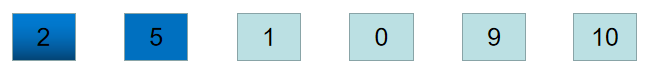
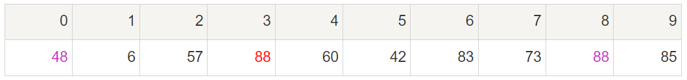
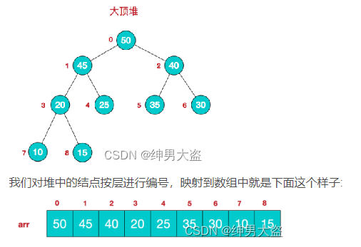
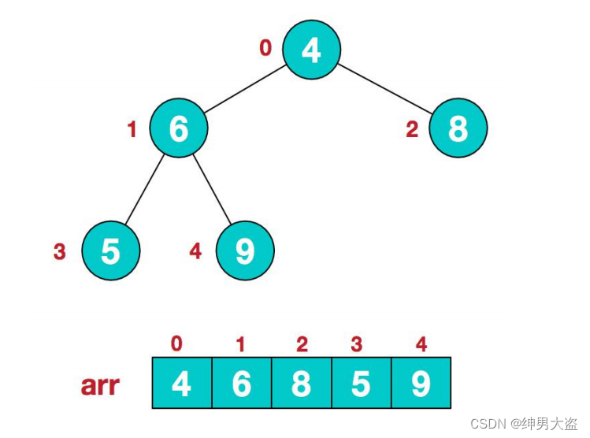

# cpp_algorithms

* geeksforgeeks https://www.geeksforgeeks.org

--------------------------------------------------------------------------------

# 排序算法 

https://www.geeksforgeeks.org/sorting-algorithms/

## sort_algorithms.md

--------------------------------------------------------------------------------

> <font color="gree">
>
> 
> `Top 10` 十大排序算法 
>
> 1. 插入排序 `Insertion Sort`
> 2. 希尔排序 `Shell Sort`
> 3. 冒泡排序 `Bubble Sort`
> 4. 选择排序 `Selection Sort`
> 5. 快速排序 `Quick Sort`
> 6. 归并排序 `Merge Sort`
> 7. 堆排序   `Heap Sort`
> 8. 计数排序 `Counting Sort`
> 9. 桶排序/箱排序   `Bucket Sort`
> 10. 基数排序 `Radix Sort`
>
> </font>


> 参考博客：
>
> https://blog.csdn.net/CltCj/article/details/122664204
>
> https://blog.csdn.net/zhoujiajie0521/article/details/122183332
> 


--------------------------------------------------------------------------------

### 前言

> 
> <font color="yellow">什么是排序？</font>
>
> 排序：将一组杂乱无章的数据按一定规律顺次排列起来。即，将无序序列排成一个有序序列（由小到大或由大到小）的运算。
>
> <font color="yellow">排序方法的分类</font>
>
> * 按数据存储介质：内部排序和外部排序
> 
> * 按比较器个数：串行排序和并行排序
> 
> * 按主要操作：比较排序和基数排序
> 
> * 按辅助空间：原地排序和非原地排序
> 
> * 按稳定性：稳定排序和非稳定排序
> 
> * 按自然性：自然排序和非自然排序
> 
> 

--------------------------------------------------------------------------------

验证排序是否正确的代码模板

```c++
#include<iostream>
#include<vector>
using namespace std;

void SortAlgorithms(vector<int>& nums)
{
    // 具体算法
}

void print(vector<int>& nums)
{
	/*for (auto i : nums)*/
	for (vector<int>::iterator it = nums.begin(); it != nums.end(); it++)
	{
		std::cout << *it << " ";
	}
	std::cout << std::endl;
}

int main()
{
	vector<int> nums = { 2, 5, 1, 0, 9, 10 };

	SortAlgorithms(nums);

	print(nums);

	pause(); // system("pause"); 

	return 0;
}
```

--------------------------------------------------------------------------------

### 插入排序 `Insertion Sort` 和 希尔排序 `Shell Sort` 

####  插入排序 `Insertion Sort`

> 
> **基本思想：**
> 
> 每步将一个**待排序的对象**，按其关键码的大小，**插入到前面已经排好序的一组对象的适当位置上**，直到对象全部循环为止。
>
> **插入排序：**
>    
> <div align=center>
> 
> </div>
>  
> 长度小于 `len < 2` 的数组，即只有 `1` 个或没有元素的数组是已经排好序的，不用处理。
> 
> **第一轮：**
>
> `2` 和 `5` 比，`2` 比 `5` 小，所以保持原序列，当前有序序列为`2`，`5`
>    
> <div align=center>
> 
> </div>
>  
> **第二轮：**
>
> `5` 和 `1` 比，`1` 比 `5` 小，元素 `5` 后移，然后 `2` 和 `1` 比，`1` 比 `2` 小，元素 `2` 也**后移**（这里要事先将待排序的元素保存下来，不然被后移的元素覆盖就找不到了）
>    
> <div align=center>
> 
> </div>
>
> **...**
> **重复上面的对比，最终得到排好序的有序序列**
> 
> <div align=center>
> 
> </div>
>
> **代码如下：**
>
> ```c++
> void insertSort(vector<int>& nums)
> {
>     // 插入排序 Insertion Sort
>     for(int i=1; i < nums.size(); i++) {       // 从第二个元素nums[1]开始处理
>         // 如果当前位置的值>=前一个位置的值，不用处理
>         if(i>0 && nums[i] >= nums[i-1]) continue;
>         // 暂存元素值
>         int temp = nums[i];
>         // 从i-1开始往前，找到应该插入的位置
>         int insert_location = 0;  // 初始化为0，是考虑到有可能nums[0] > temp
>         for(int j=i; j > 0; j--){
>             if(nums[j-1] <= temp && temp < nums[j]) {  // 当nums[j-1] <= temp < nums[j]时，说明应该插入位置是nums[j]
>                 insert_location = j;
>                 break;
>             }
>         }
>         // 将[insert_location, i-1]区间的元素全部后移一位, 注意是倒序覆盖
>         for(int k=i-1; k >= insert_location; k--) {
>             nums[k+1] = nums[k];   //元素后移
>         }
>         // 插入元素
>         nums[insert_location] = temp;
>     }    
> }
> ```
>
> **插排优化-折半插入排序**
>
> 折半插入排序是对直接插入排序的优化，利用了二分法的思想。
>
> **代码：**
>
> ```c++
> void BinsertSort(vector<int>& nums)
> {
>     // 优化插入排序 Insertion Sort
>     // 利用了二分法的思想, 折半插入排序
>     for(int i=1; i < nums.size(); i++) {       // 从第二个元素nums[1]开始处理
>         // 如果当前位置的值>=前一个位置的值，不用处理
>         if(i>0 && nums[i] >= nums[i-1]) continue;
>         // 暂存元素值
>         int temp = nums[i];
> 
>         // 二分法, 找到应该插入的位置. 
>         int left = 0, right = i - 1, mid;
> 		while (left <= right)
> 		{
> 			mid = left + (right - left) / 2;
> 			if (nums[i] < nums[mid]) right = mid - 1;
> 			else left = mid + 1;
> 		} 
>         int insert_location = right + 1;  //第i个元素插入的位置
> 
>         // 将[insert_location, i-1]区间的元素全部后移一位, 注意是倒序覆盖
>         for(int k=i-1; k >= insert_location; k--) {
>             nums[k+1] = nums[k];   //元素后移
>         }
>         // 插入元素
>         nums[insert_location] = temp;
>     }  
> }
> 
> ```
>


--------------------------------------------------------------------------------

#### 希尔排序 `Shell Sort` (本质上还是 插入排序 `Insertion Sort`)

> 
> **基本思想：**
> 
> 先将整个待排记录序列分割成若干子序列，分别进行直接插入排序，待整个序列中的记录“基本有序”时，再对全体记录进行一次直接插入排序。
> 
> 希尔排序（`shell sort`）这个排序方法又称为**缩小增量排序**，是`1959`年`D·L·Shell`提出来的。该方法的基本思想是：设待排序元素序列有`n`个元素，首先取一个整数`increment`（小于`n`）作为间隔将全部元素分为`increment`个子序列，所有距离为`increment`的元素放在同一个子序列中，在每一个子序列中分别实行直接插入排序。然后缩小间隔`increment`，重复上述子序列划分和排序工作。直到最后取`increment=1`，将所有元素放在同一个子序列中排序为止。
> 
> **特点：**
>
> 1. 缩小增量
> 2. 多遍插入排序
>
> **希尔排序优于插入排序，适用于中小规模数据量场景**
>
> **希尔排序，本质上还是直接插入排序，只要是增加了一个增量序列。**
>
> **代码如下：**
>
> ```c++
> // 希尔排序 Shell Sort (本质上还是 插入排序 Insertion Sort)
>    // 设待排序元素序列有n个元素
>    // 取一个整数gap（小于n）作为间隔将全部元素分为gap个子序列，所有距离为gap的元素放在同一个子序列中
>    // 在每一个子序列中分别实行直接插入排序。
>    // 然后缩小间隔gap，重复上述子序列划分和排序工作。直到最后取gap=1，将所有元素放在同一个子序列中排序为止。
> void shellSort(vector<int>& nums)
> {
>     for(int gap = nums.size() / 2; gap > 0; gap /=2)  // 缩小间隔gap, 直到最后取gap=1
>     {   
>         for(int start = 0; start < gap; start++) {  // 一共gap个子序列，分别从0、1、...、gap-1开始
> 
>             for(int i = start + gap; i < nums.size(); i += gap) {     // 从子序列的第二个元素nums[start + gap]开始处理
>                 // 如果当前位置的值>=前一个位置的值，不用处理
>                 if(i > start && nums[i] >= nums[i-gap]) continue;
>                 
>                 // 暂存元素值
>                 int temp = nums[i];
> 
>                 // 从i-gap开始往前，找到应该插入的位置
>                 int insert_location = 0;  // 初始化为0，是考虑到有可能nums[0] > temp, 
>                 for(int j=i; j > 0; j -= gap){
>                     if(nums[j-gap] <= temp && nums[j] > temp) {  // 当nums[j-gap] <= temp < nums[j]时，说明应该插入位置是nums[j]
>                         insert_location = j;   
>                         break;
>                     }
>                 }
> 
>                 // 将[insert_location, i-gap]区间的元素全部后移gap个位置, 注意是倒序覆盖
>                 for(int k=i-gap; k >= insert_location; k -= gap) {
>                     nums[k+gap] = nums[k];   //元素后移
>                 }
> 
>                 // 插入元素
>                 nums[insert_location] = temp;
> 
>             }  // for(int i = start + gap; i < nums.size(); i += gap)
> 
>         } // for(int start = 0; start < gap; start++) 
> 
>     } // for(int gap = nums.size() / 2; gap > 0; gap /=2)
> 
> }
> 
> ```
>
> 


#### 补充

>
> https://baike.baidu.com/item/%E5%B8%8C%E5%B0%94%E6%8E%92%E5%BA%8F/3229428?fr=aladdin
>
> **希尔排序的伪代码**
>
> ```code
> input: an array a of length n with array elements numbered > 0 to n − 1
> inc ← round(n/2)
> while inc > 0 do:
> for i = inc .. n − 1 do:
> temp ← a[i]
> j ← i
> while j ≥ inc and a[j − inc] > temp do:
> a[j] ← a[j − inc]
> j ← j − inc
> a[j] ← temp
> inc ← round(inc / 2.2)
> ```
> 
>
> **希尔排序的C++代码（模板类）**
>
> ```c++
>template <typename _RIter>
>void insert_sort(_RIter st, _RIter ed, int delta) {
>    for(_RIter i = st + delta; i < ed; i += delta) {
>        for(_RIter j = i; j > st; j -= delta)
>            if(*j < *(j - delta)) std::swap(*j, *(j - delta));
>            else break;
>    }
>}
> 
>template <typename _RIter>
>void shell_sort(_RIter st, _RIter ed) {
>    for(int delta = ed - st; delta; delta /= 2)
>        for(int i = 0; i < delta; i++)
>            insert_sort(st + i, ed, delta);
>}
> ```
>


--------------------------------------------------------------------------------

### 冒泡排序 `Bubble Sort`

>
> 冒泡排序，应该是我们最熟悉的排序算法了，下面我稍微剖解一下：
> 
> 冒泡排序就是从首位元素开始，依次对相邻元素进行比较，如果前面的数比后面的数要大，就使这两个数进行交换，否则就不需要操作。
> 
> > 我们预设一个较小的数组 `{5 , 2 , 3 , 1}` ，数组长度为 `4` 。
> > 算法开始执行：用首位`5`进行去和相邻元素 `2` 比较有：
> > `5 > 2`，交换 `5` 和 `2` 得到数组`{2 , 5 , 3 , 1}`，再用 `5` 和 `3` 比较：
> > `5 > 3`，交换得到`{2 , 3 , 5 , 1}`,再用 `5` 和 `1` 比较：
> > `5 > 1`，交换得到`{2 , 3 , 1 , 5}`,至此没有元素和 `5` 比较了，第一轮迭代结束
> > **现在数组为：**`{2 , 3 , 1 , 5}`
> > `2 < 3`，所以不做交换
> > `3 > 1`，交换得到`{2 , 1 , 3 , 5}`第二轮结束
> > **现在数组为：**`{2 , 1 , 3 , 5}`
> > `2 > 1`，交换得到`{1 , 2 , 3 , 5}`结束
> > 现在我们知道目前外循环为 `3` 层，即`nums.size() − 1`
> > 内循环则是依次递减：`nums.size() − 1 − i`层
> > 
>
> **代码如下：**
>
> ```c++
> // 冒泡排序 Bubble Sort 方法一
> // 从第一个元素开始，与后面的元素逐个比较，如果顺序不对就交换，直到没有可比较的元素为止。
> void bubbleSort(vector<int>& nums)
> {   
>     // 将所有相邻元素比较，小的放左侧，大的放右侧
>     // n次循环，将最大值冒泡到顶部（数组尾部），每次循环得到一个最大值
>     for(int i = 0; i < nums.size() - 1; i++) {
>         // 第1次循环已经将最大的值放在数组末尾nums.size()-1了
>         // 第2次循环只需要冒泡到倒数第2个位置，将第2大的值放在倒数第2位
>         // 第3次循环只需要冒泡到倒数第3个位置，将第3大的值放在倒数第3位
>         // ...
>         for(int j = 0; j < nums.size() - i - 1; j++) {
>             if(nums[j] > nums[j+1]) swap(nums[j], nums[j+1]);
>         }
>     }
> }    
> ```
> 
> **优化版本：**
>
> 冒泡排序的优点在于，不仅能把最大值挤到最后，还能同时部分理顺其他元素。
> 
> 怎么对它进行优化？
>
> 我们发现，一旦某一趟比较时不出现记录，则说明已排好序，这时就可以结束本轮算法。所以我们可以设置一个是否有元素交换的额标志`flag`。
>
> ```c++
> void bubbleSort(vector<int>& nums)
> {   
>     // 冒泡排序 Bubble Sort 方法一
>     // n次循环，将最大值冒泡到顶部（数组尾部），每次循环得到一个最大值
>     for(int i = 0; i < nums.size() - 1; i++) {
>         // 第1次循环已经将最大的值放在数组末尾nums.size()-1了
>         // 第2次循环只需要冒泡到倒数第2个位置，将第2大的值放在倒数第2位
>         // 第3次循环只需要冒泡到倒数第3个位置，将第3大的值放在倒数第3位
>         // ...
> 
>         bool flag = false; // 设置flag，一轮循环中未出现次序改变，直接停止算法
>         for(int j = 0; j < nums.size() - i - 1; j++) {
>             if(nums[j] > nums[j+1]) {
>                 swap(nums[j], nums[j+1]);
>                 flag = true; //当发生交换，false变为true，这时还不确定数组是否全部有序，应进行下一次循环
>             }
>         }
> 		//但若某一趟中一次元素交换都没有，即依然为flag = false
> 		//那么表明所剩待排序列已经有序
> 		//不必再进行趟数比较，外层循环应该结束，即此时if (!flag) break; 跳出循环
>         if(!flag) break;
>     }
> }  
> ```
> 
> **补充： 我第一次写冒泡排序是下面这样，不知道算不算冒泡**
>
> ```c++
> // 冒泡排序 Bubble Sort 方法二
> void bubbleSort(vector<int>& nums)
> {
>     for(int i=1; i < nums.size(); i++) {     // 从第二个元素nums[1]开始处理
>         // 暂存待处理元素下标
>         int loc = i; 
>         // 从i往前倒序比较, 一个个冒泡
>         while(loc > 0) {
>             // 只要不小于左侧元素，就不用动位置，停止比较
>             if(nums[loc-1] <= nums[loc]) break; 
>             // 否则交换左右元素值
>             swap(nums[loc-1], nums[loc]);
>             // 更新待处理元素下标
>             loc--;
>         }
>     }
> } 
> ```
> 


--------------------------------------------------------------------------------

### 选择排序 `Selection Sort`

> 
> 什么是选择排序？
>
> 选择排序是从头到尾扫描序列，找出最小/最大的一个元素，和第一个元素交换，接着从剩下的元素中继续这种选择和交换方式，最终得到一个有序序列。
>
> 选择排序是基于冒泡排序的优化，减少了交换的次数。
>
> <font color="yellow">
> 
> * 冒泡排序是每次将最大的元素放到最后
> * 选择排序是每次将最小的元素放到开头
> </font>
>
> **代码如下：**
> 
> ```c++
> // 选择排序 Selection Sort
> void selectSort(vector<int>& nums)
> {
>     // 从头到尾扫描序列，找出最小的一个元素的索引，将该元素与第一个元素交换位置
>     // n次循环，将最小值放到开头，每次循环得到一个最小值    
>     for(int i=0; i < nums.size(); i++) {
>         // 第1次循环已经将最小值放在数组开头
>         // 第2次循环只需要从nums[1]开始遍历，将最小的元素与nums[1]交换位置
>         // 第3次循环只需要从nums[2]开始遍历，将最小的元素与nums[2]交换位置
>         // ...    
>         // 找出最小的一个元素
>         int min_loc = i;
>         for(int j = i+1; j < nums.size(); j++) {
>             if(nums[j] < nums[min_loc]) min_loc = j;
>         } 
>         // 最小的元素和遍历的第一个元素nums[i]交换
>         swap(nums[i], nums[min_loc]);
>     }
> }
> ```
> 


--------------------------------------------------------------------------------

### 快速排序 `Quick Sort`

> 
> **快速排序**由于排序效率在同为`O(N*logN)`的几种排序方法中**效率较高**，因此**经常被采用**，再加上快速排序思想----分治法也确实实用，因此很多软件公司的笔试面试，包括像腾讯，微软等知名IT公司都喜欢考这个，还有大大小的程序方面的考试如软考，考研中也常常出现快速排序的身影。
> 
> 总的说来，要**直接默写出快速排序还是有一定难度的**，因为本人就自己的理解对快速排序作了下白话解释，希望对大家理解有帮助，达到快速排序，快速搞定。
>
> 

>
> 快速排序和冒泡排序都属于交换排序，利用元素之间的交换来进行排序。
>
> 快速排序是`C.R.A.Hoare`于`1962`年提出的一种划分交换排序。它采用了一种分治的策略，通常称其为分治法(`Divide-and-ConquerMethod`)。
>
> **基本思想：**
> 
> * 任取一个元素（如：第一个）为中心
> 
> * 所有比它小或等于的元素一律前放，比它大的元素一律后放，形成左右两个子表。
> 
> * 对各子表重新选择中心元素并依此规则调整。（递归思想）
> 
> * 直到每个子表的元素只剩一个
>
> 注： 有的书上是以中间的数作为基准数的，要实现这个方便非常方便，直接将中间的数和第一个数进行交换就可以了。
>
> 具体理论可以参考[王卓老师讲的快速排序](https://www.bilibili.com/video/BV1nJ411V7bd/?p=164&vd_source=048483965bec207cb2d804a53cf61534)
>


> 
> <font color="yellow">我们看这个博客 https://www.runoob.com/w3cnote/quick-sort.html </font>
>
> <font color="gree">
> 
> 虽然快速排序称为分治法，但分治法这三个字显然无法很好的概括快速排序的全部步骤。因此我的对快速排序作了进一步的说明：**挖坑填数+分治法**：
>
> 先来看实例吧，定义下面再给出（最好能用自己的话来总结定义，这样对实现代码会有帮助）。
>
> 以一个数组作为示例，取区间第一个数为基准数。
>    
> <div align=center>
> 
> </div>
>
> 初始时，`i = 0;  j = 9;   X = a[i] = 72`
>
> 由于已经将 `a[0]` 中的数保存到 `X` 中，可以理解成在数组 `a[0]` 上挖了个坑，可以将其它数据填充到这来。
>
> 从`j`开始向前找一个比`X`小或等于`X`的数。当`j=8`，符合条件，将`a[8]`挖出再填到上一个坑`a[0]`中。`a[0]=a[8]; i++;`  这样一个坑`a[0]`就被搞定了，但又形成了一个新坑`a[8]`，这怎么办了？简单，再找数字来填`a[8]`这个坑。这次从`i`开始向后找一个大于`X`的数，当`i=3`，符合条件，将`a[3]`挖出再填到上一个坑中`a[8]=a[3]; j--;`
> 
> 数组变为：
>    
> <div align=center>
> 
> </div>
>
> `i = 3;   j = 7;   X=72`
>
> 再重复上面的步骤，先从后向前找，再从前向后找。
>
> 从`j`开始向前找，当`j=5`，符合条件，将`a[5]`挖出填到上一个坑中，`a[3] = a[5]; i++;`
>
> 从`j`开始向前找，当`j=5`，符合条件，将`a[5]`挖出填到上一个坑中，`a[3] = a[5]; i++;`
>
> 此时，`i = j = 5`，而`a[5]`刚好又是上次挖的坑，因此将`X`填入`a[5]`。
>
> 数组变为：
>    
> <div align=center>
> 
> </div>
> 
> 可以看出`a[5]`前面的数字都小于它，`a[5]`后面的数字都大于它。因此再对`a[0…4]`和`a[6…9]`这二个子区间重复上述步骤就可以了。  
>
> 对挖坑填数进行总结:
>
> 1. `i =L; j = R;` 将基准数挖出形成第一个坑`a[i]`。
> 2. `j--`由后向前找比它小的数，找到后挖出此数填前一个坑`a[i]`中。
> 3. `i++`由前向后找比它大的数，找到后也挖出此数填到前一个`坑a[j]`中。
> 4. 再重复执行`2，3`二步，直到`i==j`，将基准数填入`a[i]`中。
>
> 照着这个总结很容易实现挖坑填数的代码：
>
> </font>
>
> **代码如下：**
> 
> ```c++
> void quickSort(vector<int>& nums,int cur_left,int cur_right)
> {
>     // 如果cur_left 和 cur_right 位置不合理，说明不需要排序了
>     if(cur_left >= cur_right) return;
>     
>     // 注1，有的书上是以中间的数作为基准数的，
>     // 要实现这个方便非常方便，直接将中间的数和第一个数进行交换就可以了。
>     // swap(nums[cur_left], nums[(cur_left + cur_right) / 2]); 
>     // 为了防止溢出，可以这样
>     // swap(nums[cur_left], nums[cur_left + (cur_right - cur_left) / 2]); 
> 
> 
>     // 基准
>     int base = nums[cur_left];
>     // 双指针法: 保证left指针左侧都是小于base的，right指针右侧都是大于base的
>     int left = cur_left;    // 左指针left  初始化为子表最左侧
>     int right = cur_right;  // 右指针right 初始化为子表最右侧
>     
>     // 开始处理子表
>     // 基准值已经暂存，left所指向的位置有一个坑
>     while(left < right) {
>         // 需要找出right指向的小于基准的值
>         while(left < right && nums[right] >= base) {
>             right--;
>         }
>         // 将右侧小于base的值挖出，填进left指向的坑，然后left指针右移
>         if (left < right) {
>             nums[left] = nums[right];
>             left++;
>         }
>         // 这时候右侧由于被挖出，right指向的位置出现一个坑
>         // 需要找出left指向的大于基准的值
>         while(left < right && nums[left] < base) {
>             left++;
>         }
>         // 将左侧大于base的值挖出，填进right指向的坑，然后right指针左移
>         if (left < right) {
>             nums[right] = nums[left];
>             right--;
>         }    
>     }
>     // while结束时，left == right, 还剩下一个中间坑
>     nums[left] = base;
>     
>     // 递归调用
>     quickSort(nums, cur_left, left - 1);
>     quickSort(nums, right + 1, cur_right);    
> 
> }
> ```
> 
> 


#### 比较我自己写的 快排代码 和 完美的快排代码 的 性能差距
> 
> 
> **我自己写的代码如下** 
> 
> ```c++
> void quickSort(vector<int>& nums) {
>     // 空集或只有1个元素的不处理
>     if(nums.size() <= 1) return;
>     // 暂存中心元素
>     int temp = nums[0];
>     // 分割成左右两个子表: 所有比它小的元素一律前放，比它大的元素一律后放
>     vector<int> left;
>     vector<int> right;
>     for(int i=1; i < nums.size(); i++) {
>         if(nums[i] < nums[0]) left.push_back(nums[i]);
>         if(nums[i] >= nums[0]) right.push_back(nums[i]);
>     }
>     // 分别依此规则调整（递归思想）
>     quickSort(left);
>     quickSort(right);
>     // 清空数组，将处理完成的左右子序列, 组合为左-中心-右
>     nums.clear();
>     for(int i=0; i < left.size(); i++) {
>         nums.push_back(left[i]);
>     }
>     nums.push_back(temp);
>     for(int i=0; i < right.size(); i++) {
>         nums.push_back(right[i]);
>     }        
> };
> ```
>
> **我自己写的代码 测一下时间复杂度**
>
> ```c++
> #include <iostream> 
> #include <vector>
> using namespace std;
> #include <chrono>
> #include <thread>
> using namespace chrono;
> 
> void quickSort(vector<int>& nums) {
>     ...
> } 
> 
> int main()
> {
>     vector<int> nums = {12, 7, 3, 2, 8, 9, 10, 21, 55, 15, 17};
> 
>     cout << "排序前: ";
>     for(int i=0; i < nums.size(); i++) {
>         cout << nums[i] << ", ";
>     }
>     cout << endl;
> 
>     quickSort(nums);
> 
>     cout << "排序后: ";
>     for(int i=0; i < nums.size(); i++) {
>         cout << nums[i] << ", ";
>     }
>     cout << endl;
>  
>
>     // 执行100000次, 测试运行时间
>     milliseconds start_time = duration_cast<milliseconds >(
>         system_clock::now().time_since_epoch()
>     );
> 
> 
>     for(int i=0 ; i < 100000; i++) {
>         vector<int> test = {12, 7, 3, 2, 8, 9, 10, 21, 55, 15, 17};
>         quickSort(test);
>     }
> 
>     milliseconds end_time = duration_cast<milliseconds >(
>         system_clock::now().time_since_epoch()
>     );
> 
> 
>     cout << "耗时:" << milliseconds(end_time).count() - milliseconds(start_time).count()
>         <<" ms"<< endl;
>    
>     cout << endl;
>     pause(); // system("pause"); 
> 
>     return 0;
> }
> ```
>
> **运行结果如下：**
>
> ```c++
> 排序前: 12, 7, 3, 2, 8, 9, 10, 21, 55, 15, 17, 
> 排序后: 2, 3, 7, 8, 9, 10, 12, 15, 17, 21, 55,
> 耗时:260 ms
> ```
> 
> 
> **博客中的代码 测一下时间复杂度：**
>
> ```c++
> #include <iostream> 
> #include <vector>
> using namespace std;
> #include <chrono>
> #include <thread>
> using namespace chrono;
> 
> void quickSort(vector<int>& nums,int cur_left,int cur_right) 
> {
>     ...
> } 
> 
> int main()
> {
>     vector<int> nums = {12, 7, 3, 2, 8, 9, 10, 21, 55, 15, 17};
> 
>     cout << "排序前: ";
>     for(int i=0; i < nums.size(); i++) {
>         cout << nums[i] << ", ";
>     }
>     cout << endl;
> 
> 
>     quickSort(nums, 0, nums.size()-1);
> 
>     cout << "排序后: ";
>     for(int i=0; i < nums.size(); i++) {
>         cout << nums[i] << ", ";
>     }
>     cout << endl;
>  
>
>     // 执行100000次, 测试运行时间
>     milliseconds start_time = duration_cast<milliseconds >(
>         system_clock::now().time_since_epoch()
>     );
> 
> 
>     for(int i=0 ; i < 100000; i++) {
>         vector<int> test = {12, 7, 3, 2, 8, 9, 10, 21, 55, 15, 17};
>         quickSort(test, 0, test.size()-1);
>     }
> 
>     milliseconds end_time = duration_cast<milliseconds >(
>         system_clock::now().time_since_epoch()
>     );
> 
> 
>     cout << "耗时:" << milliseconds(end_time).count() - milliseconds(start_time).count()
>         <<" ms"<< endl;
>     
>     cout << endl;
>     pause(); // system("pause"); 
> 
>     return 0;
> }
> ```
>
> **运行结果如下：**
>
> ```c++
> 排序前: 12, 7, 3, 2, 8, 9, 10, 21, 55, 15, 17, 
> 排序后: 2, 3, 7, 8, 9, 10, 12, 15, 17, 21, 55, 
> 耗时:20 ms
> ```
>
> <font color="yellow">我自己的写的代码，不仅时间复杂度非常高，空间复杂度也很高，不合适</font>
>
> <font color="gree">需要看懂快排的常规写法</font>
>
> 


--------------------------------------------------------------------------------

### 归并排序 `Merge Sort`

> 
> 归并排序是用分治的思想处理，通过递归不断将数组分割为两部分，直到最小单元只有1个元素，然后对两两最小单元进行比较合并。
>


> 
> <font color="yellow">我们看这个博客 https://www.runoob.com/w3cnote/merge-sort.html </font>
>
> <font color="gree">
>
> 归并排序（`Merge sort`）是建立在归并操作上的一种有效的排序算法。该算法是采用分治法（`Divide and Conquer`）的一个非常典型的应用。
>
> 作为一种典型的分而治之思想的算法应用，归并排序的实现由两种方法：
>
> * 自上而下的递归（**所有递归的方法都可以用迭代重写**，所以就有了第 2 种方法）；
> * 自下而上的迭代；
>
> 和选择排序一样，归并排序的性能不受输入数据的影响，但表现比选择排序好的多，因为始终都是 `O(nlogn)` 的时间复杂度。代价是需要额外的内存空间。
>
> 
> **算法步骤**
>
> 1. 申请空间，使其大小为两个已经排序序列之和，该空间用来存放合并后的序列；
> 
> 2. 设定两个指针，最初位置分别为两个已经排序序列的起始位置；
> 
> 3. 比较两个指针所指向的元素，选择相对小的元素放入到合并空间，并移动指针到下一位置；
> 
> 4. 重复步骤 `3` 直到某一指针达到序列尾；
> 
> 5. 将另一序列剩下的所有元素直接复制到合并序列尾。
>
> 
> **动图演示**
>    
> <div align=center>
> 
> </div>
> 

#### 递归法

> 
> **根据思路和动图，我的代码实现**
>
> ```c++
> void mergeSort(vector<int>& nums, vector<int>& space, int start, int end) {
> 
>     if (start >= end) return; //表示区间元素小于2个，递归终止
> 
>     // 申请空间长度
>     // 当长度为奇数时，让左子序列大一个。
>     // 例如，start = 0; end= 14; 一共15个元素时
>     // (end - start) / 2 = 7，让左子序列为8个(0~7)，右子序列为7个(8~14)
>     // 例如，start = 0; end= 15; 一共16个元素时
>     // (end - start) / 2 = 7，让左子序列为8个(0~7)，右子序列为7个(8~15) 
>     int left_start = start;
>     int left_end = start + (end - start)/2;  
>     int right_start = left_end + 1;
>     int right_end = end;
> 
>     // 先递归子序列
>     mergeSort(nums, space, left_start, left_end);    //对区间左半边元素递归排序
>     mergeSort(nums, space, right_start, right_end);  //对区间右半边元素递归排序
> 
>     // 双指针起始端
>     int left = left_start;
>     int right = right_start;
> 
>     // 对已排序的两序列进行归并处理
>     // 如果两个指针没到头
>     while(left <= left_end && right <= right_end) {
>         if(nums[left] <= nums[right]) {
>             space.push_back(nums[left]);
>             left++;
>         };
>         if(nums[left] > nums[right]) {
>             space.push_back(nums[right]);
>             right++;
>         };   
>     }    
>     // left指针超出序列尾, right未超出
>     // right指针剩下所有元素合并到space尾部
>     while(right <= right_end) {
>         space.push_back(nums[right]);
>         right++;
>     }
>     // right指针超出序列尾, left未超出
>     // left指针剩下所有元素合并到space尾部
>     while(left <= left_end) {
>         space.push_back(nums[left]);
>         left++;
>     }   
>     
>     // 将空间中的已排序数列放回
>     for(int i=start; i <= end; i++) {
>         nums[i] = space[i-start];
>     }
> 
>     // 空间清理
>     space.clear();
> }
> ```
> 
> **实机 测一下我的代码的时间复杂度：**
>
> ```c++
> #include <iostream> 
> #include <vector>
> using namespace std;
> #include <chrono>
> #include <thread>
> using namespace chrono;
> 
> void mergeSort(vector<int>& nums, vector<int>& space, int start, int end)  
> {
>     ...
> } 
> 
> int main()
> {
>     vector<int> nums = {12, 7, 3, 2, 8, 9, 10, 21, 55, 15, 17};
> 
>     cout << "排序前: ";
>     for(int i=0; i < nums.size(); i++) {
>         cout << nums[i] << ", ";
>     }
>     cout << endl;
> 
>     vector<int> space;
>     mergeSort(nums, space, 0, nums.size() - 1);
> 
>     cout << "排序后: ";
>     for(int i=0; i < nums.size(); i++) {
>         cout << nums[i] << ", ";
>     }
>     cout << endl;
> 
> 
>     // 执行100000次, 测试运行时间
>     milliseconds start_time = duration_cast<milliseconds >(
>         system_clock::now().time_since_epoch()
>     );
> 
>     
>     for(int i=0 ; i < 100000; i++) {
>         vector<int> test = {12, 7, 3, 2, 8, 9, 10, 21, 55, 15, 17};
>         vector<int> test_space;
>         mergeSort(test, test_space, 0, test.size() - 1);
>     }
> 
>     milliseconds end_time = duration_cast<milliseconds >(
>         system_clock::now().time_since_epoch()
>     );
> 
> 
>     cout << "耗时:" << milliseconds(end_time).count() - milliseconds(start_time).count()
>         <<" ms"<< endl;
> 
> 
>     
>     cout << endl;
>     pause(); // system("pause"); 
> 
>     return 0;
> }
> ```
>
> **运行结果如下：**
>
> ```c++
> 排序前: 12, 7, 3, 2, 8, 9, 10, 21, 55, 15, 17, 
> 排序后: 2, 3, 7, 8, 9, 10, 12, 15, 17, 21, 55, 
> 耗时:120 ms
> ```
> 

#### 递归法: 优化1

> 
> **优化1： 省去`space.clear();`, 直接索引覆盖，但是调用前需要设置好`space`的大小`space.resize(nums.size());`**
>
> https://blog.csdn.net/CltCj/article/details/122664204
> 
>
> ```c++
> void mergeSort(vector<int>& nums, vector<int>& space, int start, int end) {
> 
>     if (start >= end) return; //表示区间元素小于2个，递归终止
> 
>     // 申请空间长度
>     // 当长度为奇数时，让左子序列大一个。
>     // 例如，start = 0; end= 14; 一共15个元素时
>     // (end - start) / 2 = 7，让左子序列为8个(0~7)，右子序列为7个(8~14)
>     // 例如，start = 0; end= 15; 一共16个元素时
>     // (end - start) / 2 = 7，让左子序列为8个(0~7)，右子序列为7个(8~15) 
>     int left_start = start;
>     int left_end = start + (end - start)/2;  
>     int right_start = left_end + 1;
>     int right_end = end;
> 
>     // 先递归子序列
>     mergeSort(nums, space, left_start, left_end);    //对区间左半边元素递归排序
>     mergeSort(nums, space, right_start, right_end);  //对区间右半边元素递归排序
> 
>     // 双指针起始端
>     int left = left_start;
>     int right = right_start;
> 
> 
>     int index = 0; //已排序数组space的计数器
> 
>     // 对已排序的两序列进行归并处理
>     // 如果两个指针没到头
>     while(left <= left_end && right <= right_end) {
>         if(nums[left] <= nums[right]) {
>             space[index] = nums[left]; // space.push_back(nums[left]);
>             index++;
>             left++;
>         };
>         if(nums[left] > nums[right]) {
>             space[index] = nums[right]; // space.push_back(nums[right]);
>             index++;
>             right++;
>         };   
>     }    
>     // left指针超出序列尾, right未超出
>     // right指针剩下所有元素合并到space尾部
>     while(right <= right_end) {
>         space[index] = nums[right]; // space.push_back(nums[right]); 
>         index++;
>         right++;
>     }
>     // right指针超出序列尾, left未超出
>     // left指针剩下所有元素合并到space尾部
>     while(left <= left_end) {
>         space[index] = nums[left]; // space.push_back(nums[left]);
>         index++;
>         left++;
>     }   
>     
>     // 将空间中的已排序数列放回
>     for(int i=start; i <= end; i++) {
>         nums[i] = space[i-start];
>     }
> 
> }
> 
> 
> int main()
> {
>     vector<int> nums = {12, 7, 3, 2, 8, 9, 10, 21, 55, 15, 17};
>     ...
>     vector<int> space;
>     space.resize(nums.size());
>     mergeSort(nums, space, 0, nums.size() - 1);
>     ...
> }
> ```
>
> 
> **实机 测一下优化1 的时间复杂度：**
>
> ```c++
> #include <iostream> 
> #include <vector>
> using namespace std;
> #include <chrono>
> #include <thread>
> using namespace chrono;
> 
> void mergeSort(vector<int>& nums, vector<int>& space, int start, int end)  
> {
>     ...
> } 
> 
> int main()
> {
>     vector<int> nums = {12, 7, 3, 2, 8, 9, 10, 21, 55, 15, 17};
> 
>     cout << "排序前: ";
>     for(int i=0; i < nums.size(); i++) {
>         cout << nums[i] << ", ";
>     }
>     cout << endl;
> 
>     vector<int> space;
>     space.resize(nums.size());
>     mergeSort(nums, space, 0, nums.size() - 1);
> 
>     cout << "排序后: ";
>     for(int i=0; i < nums.size(); i++) {
>         cout << nums[i] << ", ";
>     }
>     cout << endl;
> 
> 
>     // 执行100000次, 测试运行时间
>     milliseconds start_time = duration_cast<milliseconds >(
>         system_clock::now().time_since_epoch()
>     );
> 
>     
>     for(int i=0 ; i < 100000; i++) {
>         vector<int> test = {12, 7, 3, 2, 8, 9, 10, 21, 55, 15, 17};
>         vector<int> test_space;
>         test_space.resize(test.size());
>         mergeSort(test, test_space, 0, test.size() - 1);
>     }
> 
>     milliseconds end_time = duration_cast<milliseconds >(
>         system_clock::now().time_since_epoch()
>     );
> 
> 
>     cout << "耗时:" << milliseconds(end_time).count() - milliseconds(start_time).count()
>         <<" ms"<< endl;
> 
> 
>     
>     cout << endl;
>     pause(); // system("pause"); 
> 
>     return 0;
> }
> ```
>
> **运行结果如下：**
>
> ```c++
> 排序前: 12, 7, 3, 2, 8, 9, 10, 21, 55, 15, 17, 
> 排序后: 2, 3, 7, 8, 9, 10, 12, 15, 17, 21, 55, 
> 耗时:60 ms
> ```
> 
> 
> <font color="yellow">节省了几乎`2`倍的时间，从`120ms`到`60ms` </font>
>


#### 递归法: 优化2


> 
> **优化2（不是很好理解）： `space`初始化和`nums`相同;  每次递归时，在子序列中调换`nums`和`space`的定位：主要数组？辅助数组？**
>
> ```c++
> // 先递归子序列
> mergeSort(space, nums, left_start, left_end);    //对区间左半边元素递归排序
> mergeSort(space, nums, right_start, right_end);  //对区间右半边元素递归排序
> ```
>
> **完整代码如下**
> 
> ```c++
> void mergeSort(vector<int>& nums, vector<int>& space, int start, int end) {
> 
>     if (start >= end) return; //表示区间元素小于2个，递归终止
> 
>     // 申请空间长度
>     // 当长度为奇数时，让左子序列大一个。
>     // 例如，start = 0; end= 14; 一共15个元素时
>     // (end - start) / 2 = 7，让左子序列为8个(0~7)，右子序列为7个(8~14)
>     // 例如，start = 0; end= 15; 一共16个元素时
>     // (end - start) / 2 = 7，让左子序列为8个(0~7)，右子序列为7个(8~15) 
>     int left_start = start;
>     int left_end = start + (end - start)/2;  
>     int right_start = left_end + 1;
>     int right_end = end;
> 
>     // 先递归子序列
>     mergeSort(space, nums, left_start, left_end);    //对区间左半边元素递归排序
>     mergeSort(space, nums, right_start, right_end);  //对区间右半边元素递归排序
> 
>     // 双指针起始端
>     int left = left_start;
>     int right = right_start;
> 
> 
>     int index = 0; //已排序数组space的计数器
> 
>     // 对已排序的两序列进行归并处理
>     // 如果两个指针没到头
>     while(left <= left_end && right <= right_end) {
>         if(nums[left] <= nums[right]) {
>             space[index] = nums[left]; // space.push_back(nums[left]);
>             index++;
>             left++;
>         };
>         if(nums[left] > nums[right]) {
>             space[index] = nums[right]; // space.push_back(nums[right]);
>             index++;
>             right++;
>         };   
>     }    
>     // left指针超出序列尾, right未超出
>     // right指针剩下所有元素合并到space尾部
>     while(right <= right_end) {
>         space[index] = nums[right]; // space.push_back(nums[right]); 
>         index++;
>         right++;
>     }
>     // right指针超出序列尾, left未超出
>     // left指针剩下所有元素合并到space尾部
>     while(left <= left_end) {
>         space[index] = nums[left]; // space.push_back(nums[left]);
>         index++;
>         left++;
>     }   
>     
>     // 将空间中的已排序数列放回
>     // for(int i=start; i <= end; i++) {
>         // nums[i] = space[i-start];
>     // }
> 
> }
> 
> 
> int main()
> {
>     vector<int> nums = {12, 7, 3, 2, 8, 9, 10, 21, 55, 15, 17};
>     ...
>     vector<int> space(nums);
>     mergeSort(nums, space, 0, nums.size() - 1);
>     ...
> }
> ```
>
> 
> **实机 测一下优化2 的时间复杂度：**
>
> ```c++
> #include <iostream> 
> #include <vector>
> using namespace std;
> #include <chrono>
> #include <thread>
> using namespace chrono;
> 
> void mergeSort(vector<int>& nums, vector<int>& space, int start, int end)  
> {
>     ...
> } 
> 
> int main()
> {
>     vector<int> nums = {12, 7, 3, 2, 8, 9, 10, 21, 55, 15, 17};
> 
>     cout << "排序前: ";
>     for(int i=0; i < nums.size(); i++) {
>         cout << nums[i] << ", ";
>     }
>     cout << endl;
> 
>     vector<int> space(nums);
>     mergeSort(nums, space, 0, nums.size() - 1);
> 
>     cout << "排序后: ";
>     for(int i=0; i < nums.size(); i++) {
>         cout << nums[i] << ", ";
>     }
>     cout << endl;
> 
> 
>     // 执行100000次, 测试运行时间
>     milliseconds start_time = duration_cast<milliseconds >(
>         system_clock::now().time_since_epoch()
>     );
> 
>     
>     for(int i=0 ; i < 100000; i++) {
>         vector<int> test = {12, 7, 3, 2, 8, 9, 10, 21, 55, 15, 17};
>         vector<int> test_space(test);
>         mergeSort(test, test_space, 0, test.size() - 1);
>     }
> 
>     milliseconds end_time = duration_cast<milliseconds >(
>         system_clock::now().time_since_epoch()
>     );
> 
> 
>     cout << "耗时:" << milliseconds(end_time).count() - milliseconds(start_time).count()
>         <<" ms"<< endl;
> 
> 
>     
>     cout << endl;
>     pause(); // system("pause"); 
> 
>     return 0;
> }
> ```
>
> **运行结果如下：**
>
> ```c++
> 排序前: 12, 7, 3, 2, 8, 9, 10, 21, 55, 15, 17, 
> 排序后: 2, 3, 7, 8, 9, 10, 12, 15, 17, 21, 55, 
> 耗时:40 ms
> ```
> 
> 
> <font color="yellow">节省了几乎`3`倍的时间，从`120ms`到`60ms`到`40ms` </font>
>
> 


#### 迭代法（递归法一定能转化为迭代法）


>
> **使用原版代码的递归法，转为迭代法**
>
> ```c++
> void mergeSort(vector<int>& nums, vector<int>& space) {
> 
>     if (nums.size() < 2) return; //区间元素小于2个，递归终止
> 
> 	int seg;//区间分段的计数器，1,2,4,8...
> 	int start;//区间起始的计时器
>     
> 	//排序的趟数的循环
> 	for (seg = 1; seg < nums.size(); seg = seg * 2){
> 
> 		//每趟排序选取区间的循环
> 		for (start = 0; start < nums.size(); start = start + seg * 2){
>                     
>             // 左右区间
>             // 例如，start = 0; seg= 2; 一共2个元素时
>             // 让左子序列为2个(0 1)，右子序列为2个(2~3)
>             int left_start = start;
>             int left_end = min(start + seg - 1, int(nums.size() - 1));      //考虑分段不均的情况，mid1不能超出len 
>             int right_start = min(left_end + 1, int(nums.size() - 1));      // 需要将size_t类型转换为Int类型，不然min()函数会报错
>             int right_end = min(start + seg * 2 - 1, int(nums.size() - 1));
> 
>             // 双指针
>             int left = left_start;
>             int right = right_start;
> 
> 
>             // 对已排序的两序列进行归并处理
>             // 如果两个指针没到头
>             while(left <= left_end && right <= right_end) {
>                 if(nums[left] <= nums[right]) {
>                     space.push_back(nums[left]);
>                     left++;
>                 };
>                 if(nums[left] > nums[right]) {
>                     space.push_back(nums[right]);
>                     right++;
>                 };   
>             }    
>             // left指针超出序列尾, right未超出
>             // right指针剩下所有元素合并到space尾部
>             while(right <= right_end) {
>                 space.push_back(nums[right]);
>                 right++;
>             }
>             // right指针超出序列尾, left未超出
>             // left指针剩下所有元素合并到space尾部
>             while(left <= left_end) {
>                 space.push_back(nums[left]);
>                 left++;
>             }   
>     
> 
>             // 将区间中的已排序数列放回
>             for(int i=left_start; i <= right_end; i++) {
>                 nums[i] = space[i-left_start];
>             }    
> 
>             // 空间清理
>             space.clear();            
> 
>         }
>     }
> }
> ```
> 
> 
> **实机 测一下原版迭代法的时间复杂度：**
>
> ```c++
> #include <iostream> 
> #include <vector>
> using namespace std;
> #include <chrono>
> #include <thread>
> using namespace chrono;
> 
> void mergeSort(vector<int>& nums, vector<int>& space)  
> {
>     ...
> } 
> 
> int main()
> {
>     vector<int> nums = {12, 7, 3, 2, 8, 9, 10, 21, 55, 15, 17};
> 
>     cout << "排序前: ";
>     for(int i=0; i < nums.size(); i++) {
>         cout << nums[i] << ", ";
>     }
>     cout << endl;
> 
>     vector<int> space;
>     mergeSort(nums, space);
> 
>     cout << "排序后: ";
>     for(int i=0; i < nums.size(); i++) {
>         cout << nums[i] << ", ";
>     }
>     cout << endl;
> 
> 
>     // 执行100000次, 测试运行时间
>     milliseconds start_time = duration_cast<milliseconds >(
>         system_clock::now().time_since_epoch()
>     );
> 
>     
>     for(int i=0 ; i < 100000; i++) {
>         vector<int> test = {12, 7, 3, 2, 8, 9, 10, 21, 55, 15, 17};
>         vector<int> test_space;
>         mergeSort(test, test_space);
>     }
> 
>     milliseconds end_time = duration_cast<milliseconds >(
>         system_clock::now().time_since_epoch()
>     );
> 
> 
>     cout << "耗时:" << milliseconds(end_time).count() - milliseconds(start_time).count()
>         <<" ms"<< endl;
> 
> 
>     
>     cout << endl;
>     pause(); // system("pause"); 
> 
>     return 0;
> }
> ```
>
> **运行结果如下：**
>
> ```c++
> 排序前: 12, 7, 3, 2, 8, 9, 10, 21, 55, 15, 17, 
> 排序后: 2, 3, 7, 8, 9, 10, 12, 15, 17, 21, 55, 
> 耗时:130 ms
> ```
> 
> 
> <font color="yellow">相同的思路：递归法`120ms`, 迭代法`130ms`</font>
>
> 


#### 迭代法: 优化1（递归法一定能转化为迭代法）


>
> **使用优化1的递归法，转为迭代法**
>
> ```c++
> void mergeSort(vector<int>& nums, vector<int>& space) {
> 
>     if (nums.size() < 2) return; //区间元素小于2个，递归终止
> 
> 	int seg;//区间分段的计数器，1,2,4,8...
> 	int start;//区间起始的计时器
>     
> 	//排序的趟数的循环
> 	for (seg = 1; seg < nums.size(); seg = seg * 2){
> 
> 		//每趟排序选取区间的循环
> 		for (start = 0; start < nums.size(); start = start + seg * 2){
>                     
>             // 左右区间
>             // 例如，start = 0; seg= 2; 一共2个元素时
>             // 让左子序列为2个(0 1)，右子序列为2个(2~3)
>             int left_start = start;
>             int left_end = min(start + seg - 1, int(nums.size() - 1));      //考虑分段不均的情况，mid1不能超出len 
>             int right_start = min(left_end + 1, int(nums.size() - 1));      // 需要将size_t类型转换为Int类型，不然min()函数会报错
>             int right_end = min(start + seg * 2 - 1, int(nums.size() - 1));
> 
>             // 双指针
>             int left = left_start;
>             int right = right_start;
> 
>             //已排序数组space的计数器
>             int index = 0; 
> 
>             // 对已排序的两序列进行归并处理
>             // 如果两个指针没到头
>             while(left <= left_end && right <= right_end) {
>                 if(nums[left] <= nums[right]) {
>                     space[index] = nums[left]; // space.push_back(nums[left]);
>                     index++;
>                     left++;
>                 };
>                 if(nums[left] > nums[right]) {
>                     space[index] = nums[right]; // space.push_back(nums[right]);
>                     index++;
>                     right++;
>                 };   
>             }    
>             // left指针超出序列尾, right未超出
>             // right指针剩下所有元素合并到space尾部
>             while(right <= right_end) {
>                 space[index] = nums[right]; // space.push_back(nums[right]); 
>                 index++;
>                 right++;
>             }
>             // right指针超出序列尾, left未超出
>             // left指针剩下所有元素合并到space尾部
>             while(left <= left_end) {
>                 space[index] = nums[left]; // space.push_back(nums[left]);
>                 index++;
>                 left++;
>             }   
> 
>             // 将区间中的已排序数列放回
>             for(int i=left_start; i <= right_end; i++) {
>                 nums[i] = space[i-left_start];
>             }    
> 
>         } // for (start = 0; start < nums.size(); start = start + seg * 2) 
>         
>     } // for (seg = 1; seg < nums.size(); seg = seg * 2)
> }
> ```
> 
> **实机 测一下优化1 的时间复杂度：**
>
> ```c++
> #include <iostream> 
> #include <vector>
> using namespace std;
> #include <chrono>
> #include <thread>
> using namespace chrono;
> 
> void mergeSort(vector<int>& nums, vector<int>& space)  
> {
>     ...
> } 
> 
> int main()
> {
>     vector<int> nums = {12, 7, 3, 2, 8, 9, 10, 21, 55, 15, 17};
> 
>     cout << "排序前: ";
>     for(int i=0; i < nums.size(); i++) {
>         cout << nums[i] << ", ";
>     }
>     cout << endl;
> 
>     vector<int> space;
>     space.resize(nums.size());
>     mergeSort(nums, space);
> 
>     cout << "排序后: ";
>     for(int i=0; i < nums.size(); i++) {
>         cout << nums[i] << ", ";
>     }
>     cout << endl;
> 
> 
>     // 执行100000次, 测试运行时间
>     milliseconds start_time = duration_cast<milliseconds >(
>         system_clock::now().time_since_epoch()
>     );
> 
>     
>     for(int i=0 ; i < 100000; i++) {
>         vector<int> test = {12, 7, 3, 2, 8, 9, 10, 21, 55, 15, 17};
>         vector<int> test_space;
>         test_space.resize(test.size());
>         mergeSort(test, test_space);
>     }
> 
>     milliseconds end_time = duration_cast<milliseconds >(
>         system_clock::now().time_since_epoch()
>     );
> 
> 
>     cout << "耗时:" << milliseconds(end_time).count() - milliseconds(start_time).count()
>         <<" ms"<< endl;
> 
> 
>     
>     cout << endl;
>     pause(); // system("pause"); 
> 
>     return 0;
> }
> ```
>
> **运行结果如下：**
>
> ```c++
> 排序前: 12, 7, 3, 2, 8, 9, 10, 21, 55, 15, 17, 
> 排序后: 2, 3, 7, 8, 9, 10, 12, 15, 17, 21, 55, 
> 耗时:80 ms
> ```
> 
> 
> <font color="yellow">相同的思路：递归法`60ms`, 迭代法`80ms`</font>
> 


> 
> **其实可以不用每一个长度为`seg`的小区间都取回，可以等一遍结束一起取回**
>
> 将`int index = 0; `改成`int index = left_start; `
>
> **代码如下**
> 
> ```c++
> void mergeSort(vector<int>& nums, vector<int>& space) {
> 
>     if (nums.size() < 2) return; //区间元素小于2个，递归终止
> 
> 	int seg;//区间分段的计数器，1,2,4,8...
> 	int start;//区间起始的计时器
>     
> 	//排序的趟数的循环
> 	for (seg = 1; seg < nums.size(); seg = seg * 2){
> 
> 		//每趟排序选取区间的循环
> 		for (start = 0; start < nums.size(); start = start + seg * 2){
>                     
>             // 左右区间
>             // 例如，start = 0; seg= 2; 一共2个元素时
>             // 让左子序列为2个(0 1)，右子序列为2个(2~3)
>             int left_start = start;
>             int left_end = min(start + seg - 1, int(nums.size() - 1));      //考虑分段不均的情况，mid1不能超出len 
>             int right_start = min(left_end + 1, int(nums.size() - 1));      // 需要将size_t类型转换为Int类型，不然min()函数会报错
>             int right_end = min(start + seg * 2 - 1, int(nums.size() - 1));
> 
>             // 双指针
>             int left = left_start;
>             int right = right_start;
> 
>             //已排序数组space的计数器
>             int index = left_start; 
> 
>             // 对已排序的两序列进行归并处理
>             // 如果两个指针没到头
>             while(left <= left_end && right <= right_end) {
>                 if(nums[left] <= nums[right]) {
>                     space[index] = nums[left]; // space.push_back(nums[left]);
>                     index++;
>                     left++;
>                 };
>                 if(nums[left] > nums[right]) {
>                     space[index] = nums[right]; // space.push_back(nums[right]);
>                     index++;
>                     right++;
>                 };   
>             }    
>             // left指针超出序列尾, right未超出
>             // right指针剩下所有元素合并到space尾部
>             while(right <= right_end) {
>                 space[index] = nums[right]; // space.push_back(nums[right]); 
>                 index++;
>                 right++;
>             }
>             // right指针超出序列尾, left未超出
>             // left指针剩下所有元素合并到space尾部
>             while(left <= left_end) {
>                 space[index] = nums[left]; // space.push_back(nums[left]);
>                 index++;
>                 left++;
>             }   
> 
>         } // for (start = 0; start < nums.size(); start = start + seg * 2)
>
>         // 可以只用一句话swap(nums, space);
>         // 将已排序数列放回
>         for(int i=0; i <= nums.size(); i++) {
>             nums[i] = space[i];
>         }   
> 
>     } // for (seg = 1; seg < nums.size(); seg = seg * 2) 
> }
> ```
> 
>
> **实机测试运行结果如下：**
>
> ```c++
> 排序前: 12, 7, 3, 2, 8, 9, 10, 21, 55, 15, 17, 
> 排序后: 2, 3, 7, 8, 9, 10, 12, 15, 17, 21, 55, 
> 耗时:90 ms
> ```
> 
> <font color="yellow">相同的思路：递归法`60ms`, 迭代法`80ms`, 修改后的迭代法`90ms`</font>
> 
> 

#### 迭代法: 优化2（不太会转化这个）


>
> **优化2的递归法，无法转为迭代法**
> 

#### 总结

> 
> <font color="gree">这样来看，递归法反而能节省一些时间，只是可能造成栈溢出，所以一般用迭代法</font>
> 


--------------------------------------------------------------------------------

### 堆排序 `Heap Sort`

>
> 堆排序是利用堆这种数据结构设计的排序算法，堆具备以下特点：
>
> 1）完全二叉树
> 
> 2）大顶堆：二叉树根结点值都大于或等于其左右子树结点的值
> 
> 3）小顶堆：根结点的值都小于或等于其左右子树结点的值。
> 
> **基本思想**
>
> 先把数组构造成一个大顶堆（父亲节点大于其子节点）, 然后把堆顶（数组最大值，数字第一个元素）和数组最后一个元素交换， 这样就把最大值放到了数组最后边。把数组长度`n-1`, 再进行构造堆，把剩余的第二大值放到堆顶，输出堆顶（放到剩余未排序数组最后面）。依次类推，直至数组排序完成。
>
> **二叉树的性质：**
>
> 在第一个元素的索引为 `0` 的情形中：
>
> **性质一：**
> 
>  索引为 `i` 的左孩子的索引是`( 2 ∗ i + 1 )`;
>
> **性质二：**
> 
>  索引为 `i` 的右孩子的索引是`( 2 ∗ i + 2 )`;
>
> **性质三：**
> 
>  索引为 `i` 的父结点的索引是`floor( (i−1) / 2 )` ;
> 
> **基本思路：**
>
> * `Step1：`建立大根堆,将`n`个元素组成的无序序列构建一个大顶堆。(第`1`层`1`个，第`2`层`2`个，第`3`层`4`个, ...)
>    
> <div align=center>
> 
> </div>
>
> 从最后一个叶子节点开始，从左到右，从下到上调整，将完全二叉树调整为大顶堆。
>
> > 1. 找到第一个**非叶子**结点`4`，由于`4`的左结点`7`比`4`大，所以交换`4`和`7`，交换后为大顶堆结构。
> >    
> > <div align=center>
> > 
> > </div>
> > 
> > 2.找到第二个**非叶子**结点`6`，由于`6`的右结点`8`比`6`大，所以交换`6`和`8`，交换后符合大顶堆结构。
> >    
> > <div align=center>
> > 
> > </div>
> > 
>
> * `Step2：`交换堆元素，交换堆尾元素和堆首元素，使堆尾元素为最大元素；
>    
> <div align=center>
> 
> </div>
>
> * `Step3：`重建大根堆，将前`n − 1`个元素组成的无序序列调整为大顶堆。
> 
> * `Step4：`重复执行步骤二和步骤三，直到整个序列有序
>
> **我的代码如下（迭代法）**
> 
> ```c++
> void heapSort(vector<int>& nums) {
>     // 堆排序
>     // 设置标志，当一轮遍历完成，flag未变成true，则停止
>     bool flag = false;
>     // 每轮都会将最大值放在数组最后，所以每轮遍历的结尾。将堆的长度缩短一个长度
>     for(int end = nums.size()-1; end >= 1; end--) {
>         // 标志位先置false
>         flag = false;
>         
>         // 1. 从右到左，从下到上检查，倒序遍历
>         // 将所有非叶子节点（父节点）的值，设置为父节点、左孩子、有孩子三者的最大值
>         for(int i=end; i >= 0; i--) {
>             // 检查是否为非叶子节点（父节点）: 如果是则将父节点、左孩子、有孩子的最大值放在父节点
>             if(2*i + 1 <= end || 2*i + 2 <= end) { // 存在左孩子或右孩子，即为非叶子节点（父节点）
>                 // 如果左孩子存在，且值大于父节点
>                 if(2*i + 1 <= end && nums[2*i + 1] > nums[i]) {
>                     swap(nums[i], nums[2*i + 1]); 
>                     flag = true;
>                 }
>                 // 如果右孩子存在，且值大于（左孩子和父节点的较大值）
>                 if(2*i + 2 <= end && nums[2*i + 2] > nums[i]) {
>                     swap(nums[i], nums[2*i + 2]); 
>                     flag = true;
>                 }
>                 // 上面两个步骤可以将三者的最大值放在父节点
>                 
>             }
>             // 如果左右孩子都存在，要让左孩子 >= 右孩子
>             if(2*i + 1 <= end && 2*i + 2 <= end) { 
>                 if(nums[2*i + 1] < nums[2*i + 2]) swap(nums[2*i + 1], nums[2*i + 2]);
>                 flag = true;
>             } 
>         }
> 
>         // 如果上面发生了数值的交换flag = true;，则说明堆排序未结束，执行
>         // 2. 交换堆尾元素和堆首元素，使堆尾元素为最大元素；
>         if(flag) swap(nums[0], nums[end]);
>         // 如果上面遍历完都没有发生变动，说明排序已完成
>         if(!flag) break;
> 
>     } // for(int end = nums.size()-1; end >= 1; end--) {
> 
> }
> // 注： 
> // 索引为 i 的父结点的索引是floor((i−1)/2);
> // 索引为 i 的左孩子的索引是( 2 ∗ i + 1 );
> // 索引为 i 的右孩子的索引是( 2 ∗ i + 2 );
> ```
> 
> **递归法（没看懂，还是我的迭代法好懂）**
>
> https://blog.csdn.net/CltCj/article/details/122664204
>
> ```c++
> /*
> 堆排序
> */
> 
> /*
>  * (最大)堆的向下调整算法
>  *
>  * 注：数组实现的堆中，第N个节点的左孩子的索引值是(2N+1)，右孩子的索引是(2N+2)。
>  *     其中，N为数组下标索引值，如数组中第1个数对应的N为0。
>  *
>  * 参数说明：
>  *     nums -- 待排序的数组
>  *     index -- 第一个非叶子点的下标
>  *	   
>  */
> 
> //构造大顶堆	
> void maxheap_down(vector<int>&nums,int len,int index)
> {
> 	int left = 2 * index + 1;//左(left)孩子的位置
> 	int right = 2 * index + 2;//右(right)孩子的位置
> 	
> 	int maxIdx = index;//默认当前结点为最大
> 	if (left<len && nums[left]>nums[maxIdx]) maxIdx = left;
> 	if (right<len && nums[right]>nums[maxIdx]) maxIdx = right;
> 
> 	if (maxIdx != index)
> 	{
> 		swap(nums[maxIdx], nums[index]);
> 		maxheap_down(nums,len, maxIdx);
> 	}
> }
> 
> void heapSort(vector<int>& nums,int size)
> {
> 	
> 	//构建大顶堆
> 	for (int i = size/2 - 1; i >= 0; i--)
> 	{
> 
> 		maxheap_down(nums, size,i);
> 	}
> 
> 	//调制大顶堆
> 	for (int i = size - 1; i >= 1; i--)
> 	{
> 		swap(nums[0], nums[i]);
> 		maxheap_down(nums, i, 0);
> 	}
> }
> ```
> 
> 


#### 补充

> 
> <font color="gree">之前，学习`优先级队列std::priority_queue`时，就说过大顶堆和小顶堆的事情</font>
> 
> <font color="yellow"> 
> 
> 总结：
>
> `C++`内置排序函数`std::sort()`
> 
> * `sort(arr.begin(), arr.end());` 不传入第三个参数，则默认升序
> * `sort(arr.begin(), arr.end(), less<int>());`为升序
> * `sort(arr.begin(), arr.end(), greater<int>());` 为降序
>
> `集合std::set`(`key`就是`value`)
>
> * `less`: `key`越小，优先级越高，越靠近队头（`begin()`）。即按`key`升序
>
> * `greater`: `key`越大，优先级越高，越靠近队头（`begin()`）。即按`key`降序
>
> `映射std::map`(`pair<key, value>`)
>
> * `less`: `key`越小，优先级越高，越靠近队头（`begin()`）。即按`key`升序
>
> * `greater`: `key`越大，优先级越高，越靠近队头（`begin()`）。即按`key`降序
>
> 
> `优先级队列std::priority_queue`
>
> * `less`: `key`越小，优先级越高，越靠近队头。对应大顶堆/大根堆(`top()`指向的队尾元素最大`max`). 取出的元素顺序为降序
> * `greater`: `key`越大，优先级越高，越靠近队头。对应小顶堆/小根堆(`top()`指向的队尾元素最小`min`). 取出的元素顺序为升序序
> 
> 注：
> 
> `优先级队列std::priority_queue`的`std::less`和`std::sort()函数`的`std::less`功能正好相反。
> > 其实`sort(vec.begin(), vec.end(), less<int>());`和`priority_queue<int, vector<int>, less<int>> vec;`都是升序，只不过`std::priority_queue`只有`top()`这个取值函数，只能从队尾取元素，导致元素取出后是降序。
> 
> `优先级队列std::priority_queue`的`std::greater`和`std::sort()函数`的`std::greater`功能正好相反
> > 其实`sort(vec.begin(), vec.end(), greater<int>());`和`priority_queue<int, vector<int>, greater<int>> vec;`都是降序，只不过`std::priority_queue`只有`top()`这个取值函数，只能从队尾取元素，导致元素取出后是升序。
> 
> </font>
>
> 


--------------------------------------------------------------------------------

### 计数排序 `Counting Sort`   对于数据有要求：必须全是非负数（自然数）， 但是可以通过修改，适用于整数
 
> 
> https://blog.csdn.net/zhoujiajie0521/article/details/122183332
>
> 根据这个博客
>
> 计数排序要求待排序的`n`个元素的大小在`[0, k]`之间，并且`k`与`n`在一个数量级上，即`k=O(n)`.对于每一个输入元素`x`, 确定小于等于`x`的个数为`i`。
>
> **对于数据有要求：必须全是非负数（自然数）**
>
> 
> 
> https://blog.csdn.net/CltCj/article/details/122664204
> 
> 计数排序就是对一个待排序的数组进行排序，将结果一个一个放在一个申请的空间内。
>
> **排序方法：**
> 
> 计数排序每次都将查询整个待排序数组，自第一位数到最后一位，每次找出整个待排序数组内大于（小于）当前待排数的个数 `count`。然后将当前待排数放入到新数组的第 `count+1` 位。
>
> **基本思想：**
>
> 以升序为例
>
> 1. 申请空间`space`
> 
> 2. 由待排序数组的第一个数开始
>
> 3. 如果待排序数组中有`count`个比第一个小，则把第一个放入申请空间`space`数组内的第`count+1`位, 即`space[count]`
>
> 4. 再由待排序数组的第二个数开始，重复步骤2
>
> 5. 以此类推，比较所有数，放入申请空间数组内
>
> 6. 将申请空间数组赋给待排序数组，输出待排序数组
>
> **代码如下**
>
> ```c++
> void countSort(vector<int>& nums) {
> 
> 	if (nums.size() < 2) return;
> 	//确定最大值
>     int maxValue = nums[0];
> 	for (int i = 1; i < nums.size(); ++i){
> 		if (nums[i] > maxValue) maxValue = nums[i];
> 	}
>     
> 	//确认统计数组长度并初始化
> 	vector<int>nums_temp(maxValue + 1, 0);
> 	for (int i = 0; i < nums.size(); i++)
> 	{
> 		++nums_temp[nums[i]];
> 	}
> 
> 	// 排序数组，某个数出现了几次，便在nums里累计输出几次
> 	int index = 0;
> 	for (int i = 0; i <= maxValue; ++i)
> 	{
> 		for (int j = 0; j < nums_temp[i]; ++j)
> 		{
> 			nums[index] = i;
> 			index++;
> 		}
> 	}
> 
> }
> ```
> 
> **实机测一下时间复杂度：**
>
> ```c++
> #include <iostream> 
> #include <vector>
> using namespace std;
> #include <chrono>
> #include <thread>
> using namespace chrono;
> 
> void countSort(vector<int>& nums)  
> {
>     ...
> } 
> 
> int main()
> {
>     vector<int> nums = {12, 7, 3, 2, 8, 9, 10, 21, 55, 15, 17, 7};
> 
>     cout << "排序前: ";
>     for(int i=0; i < nums.size(); i++) {
>         cout << nums[i] << ", ";
>     }
>     cout << endl;
> 
>     countSort(nums);
> 
>     cout << "排序后: ";
>     for(int i=0; i < nums.size(); i++) {
>         cout << nums[i] << ", ";
>     }
>     cout << endl;
> 
> 
>     // 执行100000次, 测试运行时间
>     milliseconds start_time = duration_cast<milliseconds >(
>         system_clock::now().time_since_epoch()
>     );
> 
>     
>     for(int i=0 ; i < 100000; i++) {
>         vector<int> test = {12, 7, 3, 2, 8, 9, 10, 21, 55, 15, 17, 7};
>         countSort(test);
>     }
> 
>     milliseconds end_time = duration_cast<milliseconds >(
>         system_clock::now().time_since_epoch()
>     );
> 
> 
>     cout << "耗时:" << milliseconds(end_time).count() - milliseconds(start_time).count()
>         <<" ms"<< endl;
> 
> 
>     
>     cout << endl;
>     pause(); // system("pause"); 
> 
>     return 0;
> }
> ```
>
> **运行结果如下：**
>
> ```c++
> 排序前: 12, 7, 3, 2, 8, 9, 10, 21, 55, 15, 17, 7, 
> 排序后: 2, 3, 7, 7, 8, 9, 10, 12, 15, 17, 21, 55, 
> 耗时:40 ms
> ```
>
> 


> 
> **如果我们将数据范围扩展到，全体整数，如何写呢？**
> 
> **我的代码如下（迭代法）**
> 
> ```c++
> void countSort(vector<int>& nums) {
>     vector<int> space;
>     space.resize(nums.size());
>     // 遍历数组
>     for(int i=0; i < nums.size(); i++) {
>         // 计算出数组中，小于nums[i]的元素数量
>         int count = 0;
>         for(int j=0; j < nums.size(); j++) {
>             if(nums[j] < nums[i]) count++;
>         }
>         // 将nums[i]，放入申请空间`space`数组内的第`count+1`位, 即`space[count]`
>         space[count] = nums[i];
>     }
>     // space放回nums
>     for(int i=0; i < nums.size(); i++){
>         nums[i] = space[i];
>     }
> }
> ```
> 
> **有问题：以上代码处理不了，有重复值的数组**
>
> 例如：
> 当`vector<int> nums = {12, 7, 3, 2, 8, 9, 10, 21, 55, 15, 17, 7};`时，运行会得到
>
> ```c++
> 排序前: 12, 7, 3, 2, 8, 9, 10, 21, 55, 15, 17, 7, 
> 排序后: 2, 3, 7, 0, 8, 9, 10, 12, 15, 17, 21, 55, 
> 耗时:70 ms
> ```
> 
> 分析：
> 因为小于`7`的数量是相同的，第一个`7`填充到`space[2]`后，第二个`7`的`count`会和第一个`7`一样，导致发生覆盖`space[2]`，没有填充到后面的位置`space[3]`
>
> 如何修改代码？
>
> 计算每种数组出现的次数，避免同样的数值的覆盖
>
> ```c++
> void countSort(vector<int>& nums) {
>     // 计算每个数值出现的次数
>     unordered_map<int, int> nums_map;  
>     for(int i=0; i < nums.size(); i++) {
>         nums_map[nums[i]] = nums_map[nums[i]] + 1;
>     }
> 
>     // 申请空间，存储排序结果
>     vector<int> space;            
>     space.resize(nums.size());
> 
>     // 遍历数组
>     for(int i=0; i < nums.size(); i++) {
>         // 计算出数组中，小于nums[i]的元素数量
>         int count = 0;
>         for(int j=0; j < nums.size(); j++) {
>             if(nums[j] < nums[i]) count++;
>         }
>         // 将nums[i]，放入申请空间`space`数组内的第`count+1`位, 即`space[count]`
>         // 对于多此出现的数值，要根据nums_map中记录的出现次数来放置
>         if(nums_map[nums[i]] > 0) {
>             int index = count + nums_map[nums[i]] - 1;
>             space[index] = nums[i];
>             // 更新nums_map，下一次再出现，放入space中的位置就会不一样
>             nums_map[nums[i]] = nums_map[nums[i]] - 1; 
>         }
>     }
> 
>     // space放回nums
>     for(int i=0; i < nums.size(); i++){
>         nums[i] = space[i];
>     }
> 
> }
> ```
> 
>
> **运行结果如下：**
>
> ```c++
> 排序前: 12, 7, 3, 2, 8, 9, 10, 21, 55, 15, 17, 7, 
> 排序后: 2, 3, 7, 7, 8, 9, 10, 12, 15, 17, 21, 55, 
> 耗时:500 ms
> ```
> 
> 
> <font color="yellow">`500ms`时间复杂度太高了</font>
>
> 
> 
> **修改我们的代码**
> 
> ```c++
> void countSort(vector<int>& nums) {
>     // 计算每个数值出现的次数
>     map<int, int, less<int>> nums_map;   // map根据key从小到大排列
>     for(int i=0; i < nums.size(); i++) {
>         nums_map[nums[i]] = nums_map[nums[i]] + 1;
>     }
> 
>     // 申请空间，存储排序结果
>     vector<int> space;            
> 
>     // 遍历map，某个数出现了几次，便在space里累计输出几次
>     map<int, int, less<int>>::iterator it;
>     for(it = nums_map.begin(); it != nums_map.end(); it++) {
>         int num = it->first;
>         int count = it->second;
>         while(count > 0) {
>             space.push_back(num);
>             count--;
>         }
>     }
> 
>     // space放回nums
>     for(int i=0; i < space.size(); i++){
>         nums[i] = space[i];
>     }
> }
> ```
>
> **运行结果如下：**
>
> ```c++
> 排序前: 12, 7, 3, 2, 8, 9, 10, 21, 55, 15, 17, 7, 
> 排序后: 2, 3, 7, 7, 8, 9, 10, 12, 15, 17, 21, 55, 
> 耗时:300 ms
> ```
> 
> <font color="yellow">`300ms`的时间复杂度太高了</font>
> 
> **优化我的代码**
>
> 我们不要用`std::map`来实现哈希表，用数组来实现哈希表，统计数值对应的出现次数
> 
> ```c++
> void countSort(vector<int>& nums) {
>     // ---------使用数组实现哈希表，统计数值出现的次数--------------
>     // 先确定最小值、最大值
>     int minValue = nums[0];
>     int maxValue = nums[0];
>     for(int i=0; i < nums.size(); i++) {
>         if(nums[i] < minValue) minValue = nums[i];
>         if(nums[i] > maxValue) maxValue = nums[i];
>     }
>     // 建立数组, 长度为数值最多的可能种类
>     vector<int> count(maxValue - minValue + 1, 0); // 初始化为0
>     // 计算每个数值出现的次数
>     for(int i=0; i < nums.size(); i++) {
>         count[nums[i] - minValue]++;  // 相对数值
>     }
>     
>     // -----------------在申请空间中存放排序结果--------------------
>     // 申请空间，存储排序结果
>     vector<int> space;            
>     // 遍历map，某个数出现了几次，便在space里累计输出几次
>     for(int i=0; i < count.size(); i++) {
>         int num = minValue + i;   // 真实数值 = 最小值 + 相对数值
>         int num_count = count[i]; 
>         for(int k=0; k < num_count; k++) {
>             space.push_back(num);
>         }
>     }
>      
>     // ---------------------space放回nums----------------
>     for(int i=0; i < space.size(); i++){
>         nums[i] = space[i];
>     }
> }
> ```
>
> **运行结果如下：**
>
> ```c++
> 排序前: 12, 7, 3, 2, 8, 9, 10, 21, 55, 15, 17, 7, 
> 排序后: 2, 3, 7, 7, 8, 9, 10, 12, 15, 17, 21, 55, 
> 耗时:100 ms
> ```
> 
> <font color="yellow">使用数组代替`map`实现哈希表，运行时间从`300ms`缩短到`100ms`</font>
>
> 
> **继续优化我的代码**
>
> 不申请额外的数组空间`space`
> 
> ```c++
> void countSort(vector<int>& nums) {
>     // ---------使用数组实现哈希表，统计数值出现的次数--------------
>     // 先确定最小值、最大值
>     int minValue = nums[0];
>     int maxValue = nums[0];
>     for(int i=0; i < nums.size(); i++) {
>         if(nums[i] < minValue) minValue = nums[i];
>         if(nums[i] > maxValue) maxValue = nums[i];
>     }
>     // 建立数组, 长度为数值最多的可能种类
>     vector<int> count(maxValue - minValue + 1, 0); // 初始化为0
>     // 计算每个数值出现的次数
>     for(int i=0; i < nums.size(); i++) {
>         count[nums[i] - minValue]++;  // 相对数值
>     }
>     
>     // -----------------在nums中存放排序结果, 覆盖原来的数组--------------------
>     int index = 0;          
>     // 遍历map，某个数出现了几次，便在nums里累计输出几次
>     for(int i=0; i < count.size(); i++) {
>         int num = minValue + i;   // 真实数值 = 最小值 + 相对数值
>         int num_count = count[i]; 
>         for(int k=0; k < num_count; k++) {
>             nums[index] = num;
>             index++;
>         }
>     }
>      
> }
> ```
>
> **运行结果如下：**
>
> ```c++
> 排序前: 12, 7, 3, 2, 8, 9, 10, 21, 55, 15, 17, 7, 
> 排序后: 2, 3, 7, 7, 8, 9, 10, 12, 15, 17, 21, 55, 
> 耗时:50 ms
> ```
> 
> <font color="yellow">使用数组代替`map`实现哈希表，运行时间从`300ms`缩短到`100ms`； 不申请额外空间，直接在`nums`上覆盖，运行时间从`100ms`缩短到`50ms`；</font>
> 
> 


--------------------------------------------------------------------------------

### 桶排序/箱排序  `Bucket Sort`  对于数据有要求：必须全是非负数（自然数）， 但是可以通过修改，适用于整数
 
> 
> 桶排序 (`Bucket sort`)或所谓的箱排序，是一个排序算法，工作的原理是将数组分到有限数量的桶子里。每个桶子再个别排序（有可能再使用别的排序算法或是以递归方式继续使用桶排序进行排序）。桶排序是鸽巢排序的一种归纳结果。当要被排序的数组内的数值是均匀分配的时候，桶排序使用线性时间`O(n)`。但桶排序并不是比较排序，他不受到`O(nlogn)`下限的影响。
> 
> 
> 桶排序是按一定规则分配`n`个桶，这`n`个桶是有序的。然后对桶内的数字再进行排序，最后依次合并桶内数据。
> 
> 需要注意三个点：
> 
> 1. 桶的数据结构可以用数组或者链表，用链表更加灵活，没有大小限制
> 
> 2. 桶的划分规则视具体业务而定，**以数据能均匀分布到各个桶内为基准**。
> 
> 3. 单个桶的排序算法不固定，一般用插入排序。
>
> **代码如下：**
> 
> ```c++
> // 数组， 桶的个数， 每个桶的宽度
> void bucketSort(vector<int>& nums, int bucket_count, int bucket_width) {
>     // 新建桶：桶的个数为bucket_count， 每个桶的宽度为bucket_width(用于分割数据范围)
>     vector<vector<int>> buckets;
>     for(int i=0; i < bucket_count; i++) {
>         vector<int> vec;
>         buckets.push_back(vec);
>     }
>     // 将元素放入桶中, 每个桶都会进行插入排序
>     vector<int> top(bucket_count, -1); // 每个桶内的顶部(无元素时，top为-1，有一个元素时，top为0)
>     for(int i=0 ; i < nums.size(); i++) {
>         // 若 bucket_width = 10， 则数值从0~9放第0个桶，10~19放第1个桶，... 
>         // 即更大的数，需要更大的宽度，就需要放后面的桶中
>         int temp = nums[i];
>         int k = temp / bucket_width;  // 第k个桶的宽度适合该元素
>         buckets[k].push_back(temp);   // 第k个桶内的顶部放入元素
>         top[k]++;  // 放入后顶部上升   
> 
>         // 插入排序
>         int loc = top[k]; // 从顶部开始检查, loc即location
>         // 当桶内超过1个元素时，需要排序
>         // 只要是大于temp的，全部向上移动一位，会覆盖掉temp
>         while(loc > 0 && temp < buckets[k][loc - 1]) {
>             buckets[k][loc] = buckets[k][loc - 1];
>             loc--;
>         }
>         // 将大于temp的元素全部后移之后，我们重新放入temp
>         buckets[k][loc] = temp;
>     }
> 
>     // 桶中元素依次放回nums    
>     int index = 0;
>     for(int k=0; k < bucket_count; k++) {
>         // 第k桶
>         for(int i=0; i <= top[k]; i++) {
>             nums[index] = buckets[k][i];
>             index++;
>         }
>     }
> 
> }
> ```
> 
> **实机测一下时间复杂度：**
>
> ```c++
> #include <iostream> 
> #include <vector>
> using namespace std;
> #include <chrono>
> #include <thread>
> using namespace chrono;
> 
> void bucketSort(vector<int>& nums, int bucket_count, int bucket_width) 
> {
>     ...
> } 
> 
> int main()
> {
>     vector<int> nums = {12, 7, 3, 2, 8, 9, 10, 21, 55, 15, 17, 7};
> 
>     cout << "排序前: ";
>     for(int i=0; i < nums.size(); i++) {
>         cout << nums[i] << ", ";
>     }
>     cout << endl;
> 
>     int bucket_count = 6;
>     int bucket_width = 10;
>     bucketSort(nums, bucket_count, bucket_width);
> 
>     cout << "排序后: ";
>     for(int i=0; i < nums.size(); i++) {
>         cout << nums[i] << ", ";
>     }
>     cout << endl;
> 
> 
>     // 执行100000次, 测试运行时间
>     milliseconds start_time = duration_cast<milliseconds >(
>         system_clock::now().time_since_epoch()
>     );
> 
>     
>     for(int i=0 ; i < 100000; i++) {
>         vector<int> test = {12, 7, 3, 2, 8, 9, 10, 21, 55, 15, 17, 7};
>         bucketSort(test, bucket_count, bucket_width);
>     }
> 
>     milliseconds end_time = duration_cast<milliseconds >(
>         system_clock::now().time_since_epoch()
>     );
> 
> 
>     cout << "耗时:" << milliseconds(end_time).count() - milliseconds(start_time).count()
>         <<" ms"<< endl;
> 
> 
>     
>     cout << endl;
>     pause(); // system("pause"); 
> 
>     return 0;
> }
> ```
>
> **运行结果如下：**
>
> ```c++
> 排序前: 12, 7, 3, 2, 8, 9, 10, 21, 55, 15, 17, 7, 
> 排序后: 2, 3, 7, 7, 8, 9, 10, 12, 15, 17, 21, 55, 
> 耗时:260 ms
> ```
>
> **换个分布均匀的数据**
>
> ```c++
> 排序前: 12, 7, 23, 32, 48, 39, 40, 21, 55, 15, 57, 7, 
> 排序后: 7, 7, 12, 15, 21, 23, 32, 39, 40, 48, 55, 57, 
> 耗时:252 ms
> ```
>
> **时间差不多，估计是因为数据量不够大的原因，显示不出来分配均匀的好处**
>
> 
>
> 


> 
> **如果我们将数据范围扩展到，全体整数，如何写呢？**
> 
> **我的代码如下（迭代法）**
> 
> ```c++
> // 数组， 桶的个数， 每个桶的宽度
> void bucketSort(vector<int>& nums, int bucket_count, int bucket_width) {
>     // 确定最小值
>     int minValue = nums[0];
>     for(int i=0; i < nums.size(); i++) {
>         if(nums[i] < minValue) minValue = nums[i];
>     }
> 
>     // 新建桶：桶的个数为bucket_count， 每个桶的宽度为bucket_width(用于分割数据范围)
>     vector<vector<int>> buckets;
>     for(int i=0; i < bucket_count; i++) {
>         vector<int> vec;
>         buckets.push_back(vec);
>     }
>     // 将元素放入桶中, 每个桶都会进行插入排序
>     vector<int> top(bucket_count, -1); // 每个桶内的顶部(无元素时，top为-1，有一个元素时，top为0)
>     for(int i=0 ; i < nums.size(); i++) {
>         // 若 bucket_width = 10， 则相对数值(temp-minValue)为0~9时放第0个桶，10~19时放第1个桶，... 
>         // 即更大的数，需要更大的宽度，就需要放后面的桶中
>         int temp = nums[i];
>         int k = (temp-minValue) / bucket_width;  // 第k个桶的宽度适合该元素
>         buckets[k].push_back(temp);   // 第k个桶内的顶部放入元素
>         top[k]++;  // 放入后顶部上升   
> 
>         // 插入排序
>         int loc = top[k]; // 从顶部开始检查, loc即location
>         // 当桶内超过1个元素时，需要排序
>         // 只要是大于temp的，全部向上移动一位，会覆盖掉temp
>         while(loc > 0 && temp < buckets[k][loc - 1]) {
>             buckets[k][loc] = buckets[k][loc - 1];
>             loc--;
>         }
>         // 将大于temp的元素全部后移之后，我们重新放入temp
>         buckets[k][loc] = temp;
>     }
> 
>     // 桶中元素依次放回nums    
>     int index = 0;
>     for(int k=0; k < bucket_count; k++) {
>         // 第k桶
>         for(int i=0; i <= top[k]; i++) {
>             nums[index] = buckets[k][i];
>             index++;
>         }
>     }
> 
> }
> ```
>
> ```c++
> 排序前: -12, -7, -23, -32, -48, -39, -40, -21, -55, -15, -57, -7, 
> 排序后: -57, -55, -48, -40, -39, -32, -23, -21, -15, -12, -7, -7, 
> 耗时:252 ms
> ```
> 
> 


> 
> **上面时间复杂度过高的原因之一，每次`push_back`,`vector`扩容耗费时间，如果能提前定好容量呢？**
>
> ```c++
> // 数组， 桶的个数， 每个桶的宽度, 每个桶的最大容量
> void bucketSort(vector<int>& nums, int bucket_count, int bucket_width, int bucket_capacity) {
>     // 确定最小值
>     int minValue = nums[0];
>     for(int i=0; i < nums.size(); i++) {
>         if(nums[i] < minValue) minValue = nums[i];
>     }
> 
>     // 新建桶：桶的个数为bucket_count， 每个桶的宽度为bucket_width(用于分割数据范围)
>     vector<vector<int>> buckets;
>     for(int i=0; i < bucket_count; i++) {
>         vector<int> vec;
>         vec.resize(bucket_capacity);
>         buckets.push_back(vec);
>     }
> 
>     // 将元素放入桶中, 每个桶都会进行插入排序
>     vector<int> top(bucket_count, -1); // 每个桶内的顶部(无元素时，top为-1，有一个元素时，top为0)
>     for(int i=0 ; i < nums.size(); i++) {
>         // 若 bucket_width = 10， 则相对数值(temp-minValue)为0~9时放第0个桶，10~19时放第1个桶，... 
>         // 即更大的数，需要更大的宽度，就需要放后面的桶中
>         int temp = nums[i];
>         int k = (temp-minValue) / bucket_width;  // 第k个桶的宽度适合该元素
> 
>         top[k]++;  // 放入后顶部上升   
>         buckets[k][top[k]] = temp;   // 第k个桶内的顶部放入元素        
> 
> 
>         // 插入排序
>         int loc = top[k]; // 从顶部开始检查, loc即location
>         // 当桶内超过1个元素时，需要排序
>         // 只要是大于temp的，全部向上移动一位，会覆盖掉temp
>         while(loc > 0 && temp < buckets[k][loc - 1]) {
>             buckets[k][loc] = buckets[k][loc - 1];
>             loc--;
>         }
>         // 将大于temp的元素全部后移之后，我们重新放入temp
>         buckets[k][loc] = temp;
>     }
> 
>     // 桶中元素依次放回nums    
>     int index = 0;
>     for(int k=0; k < bucket_count; k++) {
>         // 第k桶
>         for(int i=0; i <= top[k]; i++) {
>             nums[index] = buckets[k][i];
>             index++;
>         }
>     }
> 
> }
> ```
> 
> 
> **实机测一下时间复杂度：**
>
> ```c++
>     ...
>     // 执行100000次
>     int bucket_count = 6;
>     int bucket_width = 10;
>     bucketSort(nums, bucket_count, bucket_width);
>     ...
> ```
>
> **运行结果如下：**
>
> ```c++
> 排序前: -12, -7, -23, -32, -48, -39, -40, -21, -55, -15, -57, -7, 
> 排序后: -57, -55, -48, -40, -39, -32, -23, -21, -15, -12, -7, -7, 
> 耗时:200 ms
> ```
>
>
> **虽然有所改善，但还是太高**
>
> 


>
> **博客的代码时间复杂度很低，如何相应的修改我们的代码？**
>
> https://blog.csdn.net/CltCj/article/details/122664204
>
> ```c++
> void bucketSort(vector<int>& nums, int offset) 
> {
> 	int i, j;
> 	vector<int> buckets(offset);
> 
> 	for (i = 0; i < offset; i++) {// 清零
> 		buckets[i] = 0;
>     }
> 	// 1.计数,将数组arr中的元素放到桶中
> 	for (i = 0; i < nums.size(); i++) {
> 		buckets[nums[i]]++; // 将arr[i]的值对应buckets数组的下标，每有一个就加1
>     }
> 	// 2.排序
> 	for (i = 0, j = 0; i < offset; i++) {
> 		while (buckets[i] > 0) { // 说明存有元素,相同的整数，要重复输出
> 			nums[j] = i;
> 			buckets[i]--;
> 			j++;
> 		}
> 	}
> }
> ```
> 
> **实机测试一下**
>
> ```c++
>     ...
>     // 执行100000次
>     int offset = 10;
>     bucketSort(nums, offset);
>     ...
> ```
>
> **运行结果如下：**
>
> ```c++
> 排序前: 12, 7, 23, 32, 48, 39, 40, 21, 55, 15, 57, 7, 
> 排序后: 7, 7, 23, 32, 48, 39, 40, 21, 55, 15, 57, 7, 
> 耗时:22 ms
> ```
>
> 


--------------------------------------------------------------------------------

### 基数排序 `Radix Sort`
 


--------------------------------------------------------------------------------

### 测试用例中是否有负数，0， 整数；是否有重复值
 


