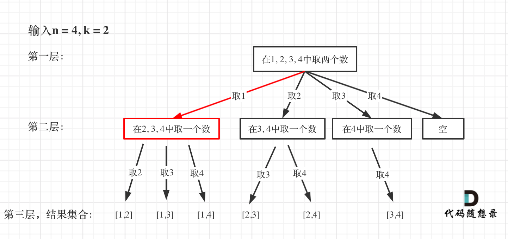

# cpp_algorithms

* 代码随想录 https://programmercarl.com/

* geeksforgeeks https://www.geeksforgeeks.org

--------------------------------------------------------------------------------
> **大家不必太在意leetcode上执行用时，打败多少多少用户，这个就是一个玩具，非常不准确。**
> 
> 做题的时候自己能分析出来时间复杂度就可以了，至于leetcode上执行用时，大概看一下就行，只要达到最优的时间复杂度就可以了，
> 
> 一样的代码多提交几次可能就击败百分之百了....
--------------------------------------------------------------------------------

# 回溯算法

https://www.geeksforgeeks.org/backtracking-algorithms/

--------------------------------------------------------------------------------

## 组合

## _1_combinations.md

--------------------------------------------------------------------------------

### 77. 组合

> 
> Leetcode链接: https://leetcode.cn/problems/combinations/
> 
> 给定两个整数 `n` 和 `k`，返回范围 `[1, n]` 中所有可能的 `k` 个数的组合。
>
> 你可以按 **任何顺序** 返回答案。
> 
> **示例1：**
> 
> ```html
> 输入：n = 4, k = 2
> 输出：
> [
>   [2,4],
>   [3,4],
>   [2,3],
>   [1,2],
>   [1,3],
>   [1,4],
> ]
> ```
> 
> **示例2：**
> 
> ```html
> 输入：n = 1, k = 1
> 输出：[[1]]
> ```
>
> **提示：**
> * `1 <= n <= 20`
> * `1 <= k <= n`
>
> ```c++
> class Solution {
> public:
>     vector<vector<int>> combine(int n, int k) {
> 
>     }
> };
> ```
> 


#### 我的思路及代码

> 
> 如果想暴力枚举，那么就需要`k`层`for`循环，但是用例那么多，`k`不是固定的，无法写出统一的代码
>
> **试一试递归**
> 
> <div align=center>
> 
> </div>
> 
> ```c++
> class Solution {
> public:
>     // 递归三要素：递归函数的参数和返回值、停止条件、遍历过程
>     /* 无返回值，参数如下：
>      * result：结果集
>      * numset:当前整数组合
>      * num：需要放入集合的整数    
>      * limit：整数的上限。
>      * length: 满足要求的集合元素个数
>      */
>     // 停止条件：numset组合长度满足k
>     /* 
>      * 遍历过程：(当组合长度不足k时，需要继续递归)
>      * 假设n = 10, k=4；
>      * 若当前组合为{1，2，3}，长度不足k
>      * 纵向遍历：
>          * 在组合当前最大数3的基础上，将3+1放入组合中，进入递归{1，2，3，4}；
>          * 递归返回后，丢掉3+1，长度回退，将3+1+1放入组合，进入递归{1，2，3，5}；
>          * ...
>          * 直到将n=10放入组合中，进入递归{1，2，3，10}；
>          * 
>      * 以上的纵向遍历结束后，进行横向遍历
>      * 丢掉2+1=3，组合回退到{1，2}
>      * 在组合当前最大数2的基础上，将2+2放入组合中，进入递归{1，2，4}；
>          * 再次开启纵向遍历
>          * 在组合当前最大数4的基础上，将4+1放入组合中，进入递归{1，2，4，5}；     
>          * ...
>      */
>     void recursion(vector<vector<int>>& result, vector<int>& numset, int num, int limit, int length) {
>         // 整数放入组合中
>         numset.push_back(num);
>         
>         // 何时停止？当组合中有length个整数时
>         if(numset.size() == length) {
>             result.push_back(numset);
>             return;
>         }
> 
>         // 若不足k个，则继续递归。寻找比当前整数更大的数
>         for(int next = num + 1; next <= limit; next++) {
>             recursion(result, numset, next, limit, length);
>             numset.pop_back(); // 回溯，使用更大的一个数加入组合
>         }
> 
>     }
> 
>     vector<vector<int>> combine(int n, int k) {
>         int limit = n;
>         int length = k;
>         vector<vector<int>> result;
>         /* 
>          * 从1、2、...、n-k+1开头进行回溯
>          * 只要起始值start不大于n-k+1，必然存在组合
>          * 按照从小到大的值，组成vector<int>
>          */
>         for(int start = 1; start <= n-k+1; start++) { 
>             vector<int> numset;            
>             recursion(result, numset, start, limit, length);
>         }
>         return result;
>     }
> };
> ```
> 
> 
> 


>
> **优化我的代码**
> 
> <font color="gree">
> 
> 1. 首先，`recursion()`只是`combine()`用来调用的，不向外提供接口，应该放在`private`中
> 2. 不同函数共用的`vector<vector<int>> result;` 和 `vector<numset>;`可以作为`class Solution`的私有数据成员. 避免函数里参数太多影响可读性
>
> </font>
>
> ```c++
> class Solution {
> private:
>     vector<vector<int>> result;
>     vector<int> numset;   
> 
>     void recursion(int num, int limit, int length) {
>         // 整数放入组合中
>         numset.push_back(num);
>         
>         // 何时停止？当组合中有length个整数时
>         if(numset.size() == length) {
>             result.push_back(numset);
>             return;
>         }
> 
>         // 若不足k个，则继续递归。寻找比当前整数更大的数
>         for(int next=num+1; next <= limit; next++) {
>             recursion(next, limit, length);
>             numset.pop_back(); // 回溯，使用更大的一个数加入组合
>         }
>     }
> 
> public:
>     vector<vector<int>> combine(int n, int k) {
>         int limit = n;
>         int length = k;
>         if(result.size() != 0) result.clear();
>         for(int start=1; start <= n-k+1; start++) { 
>             if(numset.size() != 0) numset.clear();        
>             recursion(start, limit, length);
>         }
>         return result;
>     }
> };
> ```
> 
> 

>
> <font color="gree">如果想要在`combine`中只调用一次`recursion()` 可以这样写</font>
>
> ```c++
> class Solution {
> private:
>     vector<vector<int>> result;
>     vector<int> numset;   
> 
>     void recursion(int num, int limit, int length) {
>         // 整数放入组合中. 这里加一个if判断，是为了初次进入递归函数时，避免0加入组合
>         if(num > 0) numset.push_back(num);
>         
>         // 何时停止？当组合中有length个整数时
>         if(numset.size() == length) {
>             result.push_back(numset);
>             return;
>         }
> 
>         // 若不足k个，则继续递归。寻找比当前整数更大的数
>         for(int next=num+1; next <= limit; next++) {
>             recursion(next, limit, length);
>             numset.pop_back(); // 回溯，使用更大的一个数加入组合
>         }
>     }
> 
> public:
>     vector<vector<int>> combine(int n, int k) {
>         int limit = n;
>         int length = k;
>         if(result.size() != 0) result.clear();
>         if(numset.size() != 0) numset.clear();
>         recursion(0, limit, length);
>         return result;
>     }
> };
> ```
> 
> 


>
> **降低时间复杂度**
>
> `for()`循环中，结束的位置，实际上不是limit，而是更低的数字
>
> 因为要保证`next`后续还有`k-numset.size()`个数字，所以应该是
>
> `for(int next = num+1; next <= n - (k - numset.size()) + 1; next++)`
>
> 当`next > n - (k - numset.size()) + 1`之后，递归是不可能满足`if(numset.size() == length)`的，不会有组合加入结果集`result`; 继续遍历完全是浪费时间了
>
> 在代码中是`for(int next=num+1; next <= limit - (length - numset.size()) + 1; next++)`
> 
> 
> ```c++
> class Solution {
> private:
>     vector<vector<int>> result;
>     vector<int> numset;   
> 
>     void recursion(int num, int limit, int length) {
>         // 整数放入组合中. 这里加一个if判断，是为了初次进入递归函数时，避免0加入组合
>         if(num > 0) numset.push_back(num);
>         
>         // 何时停止？当组合中有length个整数时
>         if(numset.size() == length) {
>             result.push_back(numset);
>             return;
>         }
> 
>         // 若不足k个，则继续递归。寻找比当前整数更大的数
>         for(int next=num+1; next <= limit - (length - numset.size()) + 1; next++) {
>             recursion(next, limit, length);
>             numset.pop_back(); // 回溯，使用更大的一个数加入组合
>         }
>     }
> 
> public:
>     vector<vector<int>> combine(int n, int k) {
>         int limit = n;
>         int length = k;
>         if(result.size() != 0) result.clear();
>         if(numset.size() != 0) numset.clear();
>         recursion(0, limit, length);
>         return result;
>     }
> };
> ```
> 
> 


> **根据代码随想录的逻辑优化代码**
> 
> <font color="gree">
> 
> 代码随想录中的递归处理跟我的有所不同, `numset.push_back`放在了`for`循环中，起始从`int next=num+1`改成`int next=num` 
>
> 但是结构更清晰，可以看到横向遍历，纵向深入
> 
> </font>
>
> 
> ```c++
> class Solution {
> private:
>     vector<vector<int>> result;
>     vector<int> numset;   
> 
>     void recursion(int num, int limit, int length) {
>         // 何时停止？当组合中有length个整数时
>         if(numset.size() == length) {
>             result.push_back(numset);
>             return;
>         }
> 
>         /* 若不足k个，则继续递归。寻找比当前整数更大的数
>          * 要保证next后续还有k-numset.size()个数字，
>          * 所以循环结束为next <= n - (k - numset.size()) + 1
>          * 当next > n - (k - numset.size()) + 1之后，
>          * 递归是不可能满足if(numset.size() == length)的，
>          * 不会有组合加入结果集result; 继续遍历完全是浪费时间了
>          */
>         for(int next=num; next <= limit - (length - numset.size()) + 1; next++) {
>             numset.push_back(next);
>             recursion(next + 1, limit, length);
>             numset.pop_back(); // 回溯，使用更大的一个数加入组合
>         }
>     }
> 
> public:
>     vector<vector<int>> combine(int n, int k) {
>         int limit = n;
>         int length = k;
>         if(result.size() != 0) result.clear();
>         if(numset.size() != 0) numset.clear();
>         recursion(1, limit, length);
>         return result;
>     }
> };
> ```
> 
> 
> **代码随想录的算法，看着更符合回溯法模板**
>
> ```c++ {.line-numbers}
> void backtracking(参数) {
>     if (终止条件) {
>         存放结果;
>         return;
>     }
> 
>     for (选择：本层集合中元素（树中节点孩子的数量就是集合的大小）) {
>         处理节点;
>         backtracking(路径，选择列表); // 递归
>         回溯，撤销处理结果
>     }
> }
> ```
> 
>
> 


#### 代码随想录

> 
> 本题是回溯法的经典题目。
>
> 直接的解法当然是使用`for`循环，例如示例中`k`为`2`，很容易想到 用两个`for`循环，这样就可以输出 和示例中一样的结果。
> 
> 代码如下：
>
> ```c++
> int n = 4;
> for (int i = 1; i <= n; i++) {
>     for (int j = i + 1; j <= n; j++) {
>         cout << i << " " << j << endl;
>     }
> }
> ```
> 
> 输入：`n = 100`, `k = 3` 那么就三层`for`循环，代码如下：
>
> ```c++
> int n = 100;
> for (int i = 1; i <= n; i++) {
>     for (int j = i + 1; j <= n; j++) {
>         for (int u = j + 1; u <= n; n++) {
>             cout << i << " " << j << " " << u << endl;
>         }
>     }
> }
> ```
> 
> 如果`n`为`100`，`k`为`50`呢，那就`50`层`for`循环，是不是开始窒息。
> 
> 此时就会发现虽然想暴力搜索，但是用`for`循环嵌套连暴力都写不出来！
>
> 咋整？
>
> 回溯搜索法来了，虽然回溯法也是暴力，但至少能写出来，不像`for`循环嵌套k层让人绝望。
>
> 那么回溯法怎么暴力搜呢？
>
> 上面我们说了**要解决 `n`为`100`，`k`为`50`的情况，暴力写法需要嵌套`50`层`for`循环，那么回溯法就用递归来解决嵌套层数的问题**。
>
> 递归来做层叠嵌套（可以理解是开`k`层`for`循环），**每一次的递归中嵌套一个`for`循环，那么递归就可以用于解决多层嵌套循环的问题了**。
>
> 此时递归的层数大家应该知道了，例如：`n`为`100`，`k`为`50`的情况下，就是递归`50`层。
> 
> 一些同学本来对递归就懵，回溯法中递归还要嵌套`for`循环，可能就直接晕倒了！
> 
> 如果脑洞模拟回溯搜索的过程，绝对可以让人窒息，所以需要抽象图形结构来进一步理解。
>
> **我们在关于回溯算法，你该了解这些！ (`backtracking_algorithms.md`)中说到回溯法解决的问题都可以抽象为树形结构（N叉树），用树形结构来理解回溯就容易多了。**
>
> 那么我把组合问题抽象为如下树形结构：
> 
> <div align=center>
> 
> </div>
> 
> 可以看出这棵树，一开始集合是 `1，2，3，4`， 从左向右取数，取过的数，不再重复取。
>
> 第一次取`1`，集合变为`2，3，4` ，因为`k`为`2`，我们只需要再取一个数就可以了，分别取`2`，`3`，`4`，得到集合`[1,2] [1,3] [1,4]`，以此类推。
>
> **每次从集合中选取元素，可选择的范围随着选择的进行而收缩，调整可选择的范围。**
>
> **图中可以发现`n`相当于树的宽度，`k`相当于树的深度。**
>
> 那么如何在这个树上遍历，然后收集到我们要的结果集呢？
>
> **图中每次搜索到了叶子节点，我们就找到了一个结果。**
>
> 相当于只需要把达到叶子节点的结果收集起来，就可以求得 `n`个数中`k`个数的组合集合。
>
> 在关于回溯算法，你该了解这些！ (`backtracking_algorithms.md`)中我们提到了回溯法三部曲，那么我们按照回溯法三部曲开始正式讲解代码了。
> 


##### 回溯法三部曲

> 
> **1. 递归函数的返回值以及参数**
> > 
> > 在这里要定义两个全局变量，一个用来存放符合条件单一结果，一个用来存放符合条件结果的集合。
> > 
> > 代码如下：
> > 
> > ```c++
> > vector<vector<int>> result; // 存放符合条件结果的集合
> > vector<int> path; // 用来存放符合条件结果
> > ```
> > 
> > 其实不定义这两个全局变量也是可以的，把这两个变量放进递归函数的参数里，但函数里参数太多影响可读性，所以我定义全局变量了。
> > 
> > 函数里一定有两个参数，既然是集合`n`里面取`k`个数，那么`n`和`k`是两个`int`型的参数。
> > 
> > 然后还需要一个参数，为`int`型变量`startIndex`，这个参数用来记录本层递归的中，集合从哪里开始遍历（集合就是`[1,...,n]` ）。
> > 
> > 为什么要有这个`startIndex`呢？
> > 
> > 建议在[77.组合视频讲解](https://www.bilibili.com/video/BV1ti4y1L7cv)中，`07:36`的时候开始听，`startIndex` 就是防止出现重复的组合。
> > 
> > 从下图中红线部分可以看出，在集合`[1,2,3,4]`取`1`之后，下一层递归，就要在`[2,3,4]`中取数了，那么下一层递归如何知道从`[2,3,4]`中取数呢，靠的就是`startIndex`。
> > 
> > <div align=center>
> > 
> > </div>
> > 
> > 所以需要`startIndex`来记录下一层递归，搜索的起始位置。
> > 
> > 那么整体代码如下：
> > 
> > ```c++
> > vector<vector<int>> result; // 存放符合条件结果的集合
> > vector<int> path; // 用来存放符合条件单一结果
> > void backtracking(int n, int k, int startIndex)
> > ```
> > 
> 
> **2. 回溯函数终止条件**
> > 
> > 什么时候到达所谓的叶子节点了呢？
> > 
> > `path`这个数组的大小如果达到`k`，说明我们找到了一个子集大小为`k`的组合了，在图中`path`存的就是根节点到叶子节点的路径。
> > 
> > 如图红色部分：
> > 
> > <div align=center>
> > 
> > </div>
> > 
> > 此时用`result`二维数组，把`path`保存起来，并终止本层递归。
> > 
> > 所以终止条件代码如下：
> > 
> > ```c++
> > if (path.size() == k) {
> >     result.push_back(path);
> >     return;
> > }
> > ```
> > 
> 
> **3. 单层搜索的过程**
> > 
> > 回溯法的搜索过程就是一个树型结构的遍历过程，在如下图中，可以看出`for`循环用来横向遍历，递归的过程是纵向遍历。
> > 
> > <div align=center>
> > 
> > </div>
> > 
> > 如此我们才遍历完图中的这棵树。
> > 
> > `for`循环每次从`startIndex`开始遍历，然后用`path`保存取到的节点`i`。
> > 
> > 代码如下：
> > 
> > ```c++
> > for (int i = startIndex; i <= n; i++) { // 控制树的横向遍历
> >     path.push_back(i); // 处理节点
> >     backtracking(n, k, i + 1); // 递归：控制树的纵向遍历，注意下一层搜索要从i+1开始
> >     path.pop_back(); // 回溯，撤销处理的节点
> > }
> > ```
> > 
> > 可以看出`backtracking`（递归函数）通过不断调用自己一直往深处遍历，总会遇到叶子节点，遇到了叶子节点就要返回。
> > 
> > `backtracking`的下面部分就是回溯的操作了，撤销本次处理的结果。
> > 
>
> **关键地方都讲完了，组合问题`C++`完整代码如下：**
>
> ```c++
> class Solution {
> private:
>     vector<vector<int>> result; // 存放符合条件结果的集合
>     vector<int> path; // 用来存放符合条件结果
>     void backtracking(int n, int k, int startIndex) {
>         if (path.size() == k) {
>             result.push_back(path);
>             return;
>         }
>         for (int i = startIndex; i <= n; i++) {
>             path.push_back(i); // 处理节点
>             backtracking(n, k, i + 1); // 递归
>             path.pop_back(); // 回溯，撤销处理的节点
>         }
>     }
> public:
>     vector<vector<int>> combine(int n, int k) {
>         result.clear(); // 可以不写
>         path.clear();   // 可以不写
>         backtracking(n, k, 1);
>         return result;
>     }
> };
> ```
> 
> * 时间复杂度: `O(n * 2^n)`
> * 空间复杂度: `O(n)`
> 
> 还记得我们在关于回溯算法，你该了解这些！ (`backtracking_algorithms.md`)中给出的回溯法模板么？
>
> 如下：
> 
> ```c++ {.line-numbers}
> void backtracking(参数) {
>     if (终止条件) {
>         存放结果;
>         return;
>     }
> 
>     for (选择：本层集合中元素（树中节点孩子的数量就是集合的大小）) {
>         处理节点;
>         backtracking(路径，选择列表); // 递归
>         回溯，撤销处理结果
>     }
> }
> ```
> 
>** 对比一下本题的代码，是不是发现有点像！** 所以有了这个模板，就有解题的大体方向，不至于毫无头绪。
>
> 


##### 总结

>
> 组合问题是回溯法解决的经典问题，我们开始的时候给大家列举一个很形象的例子，就是`n`为`100`，`k`为`50`的话，直接想法就需要`50`层`for`循环。
>
> 从而引出了回溯法就是解决这种`k`层`for`循环嵌套的问题。
>
> 然后进一步把回溯法的搜索过程抽象为树形结构，可以直观的看出搜索的过程。
>
> 接着用回溯法三部曲，逐步分析了函数参数、终止条件和单层搜索的过程。
> 


##### 剪枝优化

>
> 我们说过，回溯法虽然是暴力搜索，但也有时候可以有点剪枝优化一下的。
>
> 在遍历的过程中有如下代码：
>
> ```c++
> for (int i = startIndex; i <= n; i++) {
>     path.push_back(i);
>     backtracking(n, k, i + 1);
>     path.pop_back();
> }
> ```
>
> 这个遍历的范围是可以剪枝优化的，怎么优化呢？
> 
> 来举一个例子，`n = 4，k = 4`的话，那么第一层`for`循环的时候，从元素`2`开始的遍历都没有意义了。 在第二层`for`循环，从元素`3`开始的遍历都没有意义了。
>
> 这么说有点抽象，如图所示：
> 
> <div align=center>
> 
> </div>
>
> 图中每一个节点（图中为矩形），就代表本层的一个`for`循环，那么每一层的`for`循环从第二个数开始遍历的话，都没有意义，都是无效遍历。
>
> **所以，可以剪枝的地方就在递归中每一层的`for`循环所选择的起始位置。**
>
> **如果`for`循环选择的起始位置之后的元素个数 已经不足 我们需要的元素个数了，那么就没有必要搜索了。**
>
> 注意代码中`i`，就是`for`循环里选择的起始位置。
> 
> ```c++
> for (int i = startIndex; i <= n; i++) {
> ```
> 
> 接下来看一下优化过程如下：
> 
> 1. 已经选择的元素个数：`path.size();`
> 
> 2. 还需要的元素个数为: `k - path.size();`
> 
> 3. 在集合n中至多要从该起始位置 : `n - (k - path.size()) + 1`，开始遍历
> 
> 为什么有个`+1`呢，因为包括起始位置，我们要是一个左闭的集合。
>
> 举个例子，`n = 4，k = 3`， 目前已经选取的元素为`0`（`path.size`为`0`），`n - (k - 0) + 1` 即 `4 - ( 3 - 0) + 1 = 2`。
>
> 从`2`开始搜索都是合理的，可以是组合`[2, 3, 4]`。
>
> 这里大家想不懂的话，建议也举一个例子，就知道是不是要`+1`了。
>
> 所以优化之后的`for`循环是：
> 
> ```c++
> for (int i = startIndex; i <= n - (k - path.size()) + 1; i++) // i为本次搜索的起始位置
> ```
> 
> 优化后整体代码如下：
>
> ```c++
> class Solution {
> private:
>     vector<vector<int>> result;
>     vector<int> path;
>     void backtracking(int n, int k, int startIndex) {
>         if (path.size() == k) {
>             result.push_back(path);
>             return;
>         }
>         for (int i = startIndex; i <= n - (k - path.size()) + 1; i++) { // 优化的地方
>             path.push_back(i); // 处理节点
>             backtracking(n, k, i + 1);
>             path.pop_back(); // 回溯，撤销处理的节点
>         }
>     }
> public:
> 
>     vector<vector<int>> combine(int n, int k) {
>         backtracking(n, k, 1);
>         return result;
>     }
> };
> ```
>
> 

##### 剪枝总结

>
> 本篇我们准对求组合问题的回溯法代码做了剪枝优化，这个优化如果不画图的话，其实不好理解，也不好讲清楚。
> 
> 所以我依然是把整个回溯过程抽象为一棵树形结构，然后可以直观的看出，剪枝究竟是剪的哪里。
>
> 


