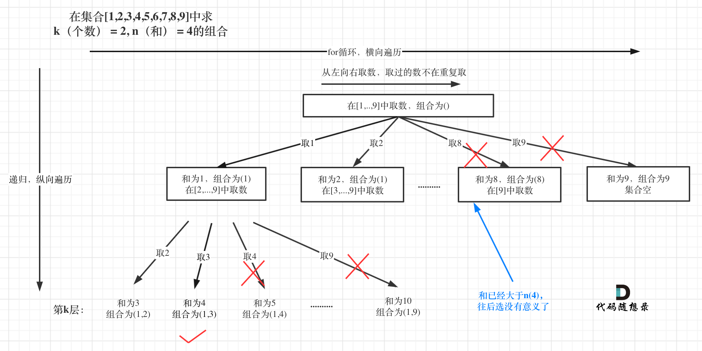

# cpp_algorithms

* 代码随想录 https://programmercarl.com/

* geeksforgeeks https://www.geeksforgeeks.org

--------------------------------------------------------------------------------
> **大家不必太在意leetcode上执行用时，打败多少多少用户，这个就是一个玩具，非常不准确。**
> 
> 做题的时候自己能分析出来时间复杂度就可以了，至于leetcode上执行用时，大概看一下就行，只要达到最优的时间复杂度就可以了，
> 
> 一样的代码多提交几次可能就击败百分之百了....
--------------------------------------------------------------------------------

# 回溯算法

https://www.geeksforgeeks.org/backtracking-algorithms/

--------------------------------------------------------------------------------

## 组合总和 III

## _2_combination_sum_iii.md

--------------------------------------------------------------------------------

216. 组合总和 III

> 
> Leetcode链接: https://leetcode.cn/problems/combination-sum-iii/
>
> 找出所有相加之和为 `n` 的 `k` 个数的组合，且满足下列条件：
> 
> * 只使用数字`1`到`9`
> * 每个数字 **最多使用一次**
> 
> 返回 *所有可能的有效组合的列表* 。该列表不能包含相同的组合两次，组合可以以任何顺序返回。
> 
> 
> **示例1：**
> 
> ```html
> 输入: k = 3, n = 7
> 输出: [[1,2,4]]
> 解释:
> 1 + 2 + 4 = 7
> 没有其他符合的组合了。
> ```
> 
> **示例2：**
> 
> ```html
> 输入: k = 3, n = 9
> 输出: [[1,2,6], [1,3,5], [2,3,4]]
> 解释:
> 1 + 2 + 6 = 9
> 1 + 3 + 5 = 9
> 2 + 3 + 4 = 9
> 没有其他符合的组合了。
> ```
> 
> **示例3：**
> 
> ```html
> 输入: k = 4, n = 1
> 输出: []
> 解释: 不存在有效的组合。
> 在[1,9]范围内使用4个不同的数字，我们可以得到的最小和是1+2+3+4 = 10，因为10 > 1，没有有效的组合。
> ```
>
> **提示：**
> * `2 <= k <= 9`
> * `1 <= n <= 60`
>
> ```c++
> class Solution {
> public:
>     vector<vector<int>> combinationSum3(int k, int n) {
> 
>     }
> };
> ```
> 


#### 我的思路及代码

> <font color="yellow">
> 
> 为何会想到用到回溯法（递归）？
>
> 因为这是组合问题，常用回溯法？
> 
> </font>
> 
> <font color="gree">
> 
> 回溯法，一般可以解决如下几种问题：
>
> * 组合问题：`N`个数里面按一定规则找出`k`个数的集合
> * 切割问题：一个字符串按一定规则有几种切割方式
> * 子集问题：一个`N`个数的集合里有多少符合条件的子集
> * 排列问题：`N`个数按一定规则全排列，有几种排列方式
> * 棋盘问题：`N`皇后，解数独等等
>
> </font>
>
> 
> 
> **代码随想录的回溯法模板**
>
> ```c++ {.line-numbers}
> void backtracking(参数) {
>     if (终止条件) {
>         存放结果;
>         return;
>     }
> 
>     for (选择：本层集合中元素（树中节点孩子的数量就是集合的大小）) {
>         处理节点;
>         backtracking(路径，选择列表); // 递归
>         回溯，撤销处理结果
>     }
> }
> ```
> 
> <font color="yellow">
> 
> 为了更清晰地说明问题，如何把组合问题抽象为如下树形结构：？？？
>
> 我们笔试时，要学会在纸上用笔画出树形结构
> 
> </font>
>
> 
> **问题分析：**
> > 
> > 首先, `n`和`k`的取值范围都是正整数
> > 
> > > * `2 <= k <= 9`
> > > * `1 <= n <= 60`
> > 
> > 其次，用于加法的数字只有`1 ~ 9`，而且不能重复使用同一个数字
> > 
> > 如果是不写代码，手动计算，思路是怎样的?
> > 
> > 举例:`n=30, k = 5`
> > 
> > 加法的第一个数字：可以是`1`, 可以是`2`, ..., 可以是`9`. 但是如果`sum < 9`，则只能到`n`。
> > 
> > 所以加法的第一个数字遍历范围是`1 ~ min(9, n - 当前总和)`,即`for(int i=1; i < min(9, n - sum); i++) {}`, 即加数上限只能是`n - sum`与`9`的较小值
> > 
> > 我们采用递归，每次选取一个加数`num`后，就更新`sum += num；`, 然后才能调用递归。
> > 
> 
> 
> **回溯法三部曲**
> 
> > **1. 递归函数的返回值以及参数**
> > 
> > ```c++
> > // sum为当前numset中的所有数的求和
> > // num为刚刚使用的数字，不能重复用了，必须用更大的数
> > void recursion(int sum, int num,int k, int n){}
> > ```
> > 
> > 我们将`vector<vector<int>> result;`和`vector<int> numset;`作为`class Solution`的私有数据成员，不用在回溯(递归)函数中放那么多参数，影响代码理解
> > 
> > 
> 
> > **2. 回溯函数终止条件**
> > 
> > 两个条件都满足`numset.size() == k && sum == n`，则`result.push_back(numset); return;`
> > 
> > 如果这两个不同时满足，还需要查看是否存在`numset.size() < k && sum >= n`的情况，如果出现，直接`return`
> > 
> > 所以是这样
> >
> > ```c++
> > if(sum == n) {
> >     if(numset.size() == k) {  // 同时满足两个条件，说明得到一个正确的组合
> >         result.push_back(numset); 
> >         return;
> >     }
> >     if(numset.size() < k) {   // 还没有k个数，就达到了n，不能继续遍历了
> >         return;
> >     }
> > }
> > ```
> > 
> 
> > **3. 单层搜索的过程**
> > 
> > 把组合问题抽象为树形结构：只要我们能画出来，单层搜索就可以写出来了
> > 
> > ```c++
> > // next <= min(9, n - sum) 保证了不会出现sum > n的情况
> > for(int next=num+1; next <= min(9, n - sum); next++) {
> >     numset.push_back(next);  // 更新numset
> >     sum += next;  // 更新numset中的总和
> >     recursion(sum, next, n, k);  // 递归
> >     numset.pop_back(); // 回溯numset
> >     sum -= next;  // 回溯numset中的总和
> > }
> > ```
> 
> 
> **代码如下：**
> 
> ```c++
> class Solution {
> private:
>     vector<vector<int>> result;
>     vector<int> numset;
> 
>     // sum为当前numset中的所有数的求和
>     // num为刚刚使用的数字，不能重复用了，必须用更大的数
>     void recursion(int sum, int num, int n, int k) {
>         if(sum == n) {
>             if(numset.size() == k) {  // 同时满足两个条件，说明得到一个正确的组合
>                 result.push_back(numset); 
>                 return;
>             }
>             if(numset.size() < k) {   // 还没有k个数，就达到了n，不能继续遍历了
>                 return;
>             }
>         }
>                 
>         // next <= min(9, n - sum) 保证了不会出现sum > n的情况
>         for(int next=num+1; next <= min(9, n - sum); next++) {
>             numset.push_back(next);  // 更新numset
>             sum += next;  // 更新numset中的总和
>             recursion(sum, next, n, k);  // 递归
>             numset.pop_back(); // 回溯numset
>             sum -= next;  // 回溯numset中的总和
>             // sum和numset的一个属性，保持同步，所以也要回溯
>         }
>         
>     }
> 
> public:
>     vector<vector<int>> combinationSum3(int k, int n) {
>         if(result.size() != 0) result.clear();
>         if(numset.size() != 0) numset.clear();
>         recursion(0, 0, n, k);
>         return result;
>     }
> };
> ```
> 
> 

>
> **优化代码结构**
>
> ```c++
>         if(sum == n) {
>             if(numset.size() == k) {  // 同时满足两个条件，说明得到一个正确的组合
>                 result.push_back(numset); 
>                 return;
>             }
>             if(numset.size() < k) {   // 还没有k个数，就达到了n，不能继续遍历了
>                 return;
>             }
>         }
>  
> ```
>
> 改为
>
> ```c++
>         // 出现sum == n就返回，如果满足k个数，才能加入结果集
>         if(sum == n) {
>             if(numset.size() == k) result.push_back(numset); 
>             return; 
>         }
>  
> ```
>
> **优化后的代码如下：**
> 
> ```c++
> class Solution {
> private:
>     vector<vector<int>> result;
>     vector<int> numset;
> 
>     // sum为当前numset中的所有数的求和
>     // num为刚刚使用的数字，不能重复用了，必须用更大的数
>     void recursion(int sum, int num, int n, int k) {
>         // 出现sum == n就返回，如果满足k个数，才能加入结果集
>         if(sum == n) {
>             if(numset.size() == k) result.push_back(numset); 
>             return; 
>         }
>                 
>         // next <= min(9, n - sum) 保证了不会出现sum > n的情况
>         for(int next=num+1; next <= min(9, n - sum); next++) {
>             numset.push_back(next);  // 更新numset
>             sum += next;  // 更新numset中的总和
>             recursion(sum, next, n, k);  // 递归
>             numset.pop_back(); // 回溯numset
>             sum -= next;  // 回溯numset中的总和
>             // sum和numset的一个属性，保持同步，所以也要回溯
>         }
>         
>     }
> 
> public:
>     vector<vector<int>> combinationSum3(int k, int n) {
>         if(result.size() != 0) result.clear();
>         if(numset.size() != 0) numset.clear();
>         recursion(0, 0, n, k);
>         return result;
>     }
> };
> ```
> 
>  


>
> **另一种遍历逻辑**
>
> 上面是通过`next <= min(9, n - sum)`保证了`sum不会超过n0`， 然后在递归的开始，判断是否`sum == n`，进一步判断是否`if(numset.size() == k)`
>
> 我们可以改成`next <= 9`, 不限制`next`的最大值，然后在递归的开始，判断是否`if(numset.size() == k)`，进一步判断是否`sum == n`
>
> ```c++
> class Solution {
> private:
>     vector<vector<int>> result;
>     vector<int> numset;
> 
>     // sum为当前numset中的所有数的求和
>     // num为刚刚使用的数字，不能重复用了，必须用更大的数
>     void recursion(int sum, int num, int n, int k) {
>         // 只要有了k个数就返回，如果满足总和sum == n，才能加入结果集
>         if(numset.size() == k) {
>             if(sum == n) result.push_back(numset); 
>             return; 
>         }
>                 
>         // next <= min(9, n - sum) 保证了不会出现sum > n的情况
>         for(int next=num+1; next <= 9; next++) {
>             numset.push_back(next);  // 更新numset
>             sum += next;  // 更新numset中的总和
>             recursion(sum, next, n, k);  // 递归
>             numset.pop_back(); // 回溯numset
>             sum -= next;  // 回溯numset中的总和
>             // sum和numset的一个属性，保持同步，所以也要回溯
>         }
>         
>     }
> 
> public:
>     vector<vector<int>> combinationSum3(int k, int n) {
>         if(result.size() != 0) result.clear();
>         if(numset.size() != 0) numset.clear();
>         recursion(0, 0, n, k);
>         return result;
>     }
> };
> ```
> 
> 


>
> **如果想改成从`1`进行遍历，可以这样**
>
> `recursion(0, 1, n, k);`
>
> ```c++
> class Solution {
> private:
>     vector<vector<int>> result;
>     vector<int> numset;
> 
>     // sum为当前numset中的所有数的求和
>     // nextStart为下一层递归开始的数字
>     void recursion(int sum, int nextStart, int n, int k) {
>         // 只要有了k个数就返回，如果满足总和sum == n，才能加入结果集
>         if(numset.size() == k) {
>             if(sum == n) result.push_back(numset); 
>             return; 
>         }
>                 
>         // next <= min(9, n - sum) 保证了不会出现sum > n的情况
>         for(int next=nextStart; next <= 9; next++) {
>             numset.push_back(next);  // 更新numset
>             sum += next;  // 更新numset中的总和
>             recursion(sum, next + 1, n, k);  // 递归, 下一个必须用更大的数
>             numset.pop_back(); // 回溯numset
>             sum -= next;  // 回溯numset中的总和
>             // sum和numset的一个属性，保持同步，所以也要回溯
>         }
>         
>     }
> 
> public:
>     vector<vector<int>> combinationSum3(int k, int n) {
>         if(result.size() != 0) result.clear();
>         if(numset.size() != 0) numset.clear();
>         recursion(0, 1, n, k);
>         return result;
>     }
> };
> ```
> 
> 


>
> **还可以减小时间复杂度**
>
> 在递归函数开始时，检查当前`numset`中的所有数的求和`sum`，如果此时有`if (sum > n)`, 则直接返回.
>
>
> ```c++
> class Solution {
> private:
>     vector<vector<int>> result;
>     vector<int> numset;
> 
>     // sum为当前numset中的所有数的求和
>     // nextStart为下一层递归开始的数字
>     void recursion(int sum, int nextStart, int n, int k) {
>         // 剪枝
>         if (sum > n) { 
>             return; 
>         }
>         // 只要有了k个数就返回，如果满足总和sum == n，才能加入结果集
>         if(numset.size() == k) {
>             if(sum == n) result.push_back(numset); 
>             return; 
>         }
>                 
>         // next <= min(9, n - sum) 保证了不会出现sum > n的情况
>         for(int next=nextStart; next <= 9; next++) {
>             numset.push_back(next);  // 更新numset
>             sum += next;  // 更新numset中的总和
>             recursion(sum, next + 1, n, k);  // 递归, 下一个必须用更大的数
>             numset.pop_back(); // 回溯numset
>             sum -= next;  // 回溯numset中的总和
>             // sum和numset的一个属性，保持同步，所以也要回溯
>         }
>         
>     }
> 
> public:
>     vector<vector<int>> combinationSum3(int k, int n) {
>         if(result.size() != 0) result.clear();
>         if(numset.size() != 0) numset.clear();
>         recursion(0, 1, n, k);
>         return result;
>     }
> };
> ```
> 
> **图形化表示在代码随想录中有**
> 
> <div align=center>
> 
> </div>
>
> 
>


#### 代码随想录

>
> 本题就是在`[1,2,3,4,5,6,7,8,9]`这个集合中找到和为`n`的`k`个数的组合。
> 
> 相对于[77. 组合](https://leetcode.cn/problems/combinations/)，无非就是多了一个限制，本题是要找到和为`n`的`k`个数的组合，而整个集合已经是固定的了`[1,...,9]`。
>
> 想到这一点了，做过[77. 组合](https://leetcode.cn/problems/combinations/)之后，本题是简单一些了。
>
> 本题`k`相当于树的深度，`9`（因为整个集合就是`9`个数）就是树的宽度。
>
> 例如 `k = 2，n = 4` 的话，就是在集合`[1,2,3,4,5,6,7,8,9]`中求 `k（个数） = 2, n（和） = 4`的组合。
> 
> 选取过程如图：
> 
> <div align=center>
> 
> </div>
> 
> 图中，可以看出，只有最后取到集合`（1，3）`和为 `4` 符合条件。
>
> 

##### 回溯三部曲

>
> **1. 确定递归函数参数**
>
> 和[77. 组合](https://leetcode.cn/problems/combinations/)一样，依然需要一维数组`path`来存放符合条件的结果，二维数组`result`来存放结果集。
>
> 这里我依然定义`path` 和 `result`为全局变量。
> 
> 至于为什么取名为`path`？从上面树形结构中，可以看出，结果其实就是一条根节点到叶子节点的路径。
>
> ```c++
> vector<vector<int>> result; // 存放结果集
> vector<int> path; // 符合条件的结果
> ```
> 
> 接下来还需要如下参数：
>
> * `targetSum（int）`目标和，也就是题目中的`n`。
> * `k（int）`就是题目中要求`k`个数的集合。
> * `sum（int）`为已经收集的元素的总和，也就是`path`里元素的总和。
> * `startIndex（int`）为下一层`for`循环搜索的起始位置。
>
> 所以代码如下：
> 
> ```
> vector<vector<int>> result;
> vector<int> path;
> void backtracking(int targetSum, int k, int sum, int startIndex)
> ```
> 
> 其实这里`sum`这个参数也可以省略，每次`targetSum`减去选取的元素数值，然后判断如果`targetSum`为`0`了，说明收集到符合条件的结果了，我这里为了直观便于理解，还是加一个`sum`参数。
>
> <font color="gree">还要强调一下，回溯法中递归函数参数很难一次性确定下来，一般先写逻辑，需要啥参数了，填什么参数。</font>
>
> 
> 
> **2. 确定终止条件**
> 
> 什么时候终止呢？
>
> 在上面已经说了，`k`其实就已经限制树的深度，因为就取`k`个元素，树再往下深了没有意义。
>
> 如果此时`path`里收集到的元素和（`sum`） 和`targetSum`（就是题目描述的`n`）相同了，就用`result`收集当前的结果。
>
> 所以 终止代码如下：
>
> ```c++
> if (path.size() == k) {
>     if (sum == targetSum) result.push_back(path);
>     return; // 如果path.size() == k 但sum != targetSum 直接返回
> }
> ```
>
> 
> 
> **3. 单层搜索过程**
> 
> 本题和[77. 组合](https://leetcode.cn/problems/combinations/)区别之一就是集合固定的就是`9`个数`[1,...,9]`，所以`for`循环固定`i<=9`
>
> 如图：
> 
> <div align=center>
> 
> </div>
> 
> 处理过程就是 `path`收集每次选取的元素，相当于树型结构里的边，`sum`来统计`path`里元素的总和。
>
> 代码如下：
>
> ```c++
> for (int i = startIndex; i <= 9; i++) {
>     sum += i;
>     path.push_back(i);
>     backtracking(targetSum, k, sum, i + 1); // 注意i+1调整startIndex
>     sum -= i; // 回溯
>     path.pop_back(); // 回溯
> }
> ```
> 
> **别忘了处理过程 和 回溯过程是一一对应的，处理有加，回溯就要有减！**
>
> 参照关于回溯算法的模板，不难写出如下C++代码：
>
> ```c++
> class Solution {
> private:
>     vector<vector<int>> result; // 存放结果集
>     vector<int> path; // 符合条件的结果
>     // targetSum：目标和，也就是题目中的n。
>     // k：题目中要求k个数的集合。
>     // sum：已经收集的元素的总和，也就是path里元素的总和。
>     // startIndex：下一层for循环搜索的起始位置。
>     void backtracking(int targetSum, int k, int sum, int startIndex) {
>         if (path.size() == k) {
>             if (sum == targetSum) result.push_back(path);
>             return; // 如果path.size() == k 但sum != targetSum 直接返回
>         }
>         for (int i = startIndex; i <= 9; i++) {
>             sum += i; // 处理
>             path.push_back(i); // 处理
>             backtracking(targetSum, k, sum, i + 1); // 注意i+1调整startIndex
>             sum -= i; // 回溯
>             path.pop_back(); // 回溯
>         }
>     }
> 
> public:
>     vector<vector<int>> combinationSum3(int k, int n) {
>         result.clear(); // 可以不加
>         path.clear();   // 可以不加
>         backtracking(n, k, 0, 1);
>         return result;
>     }
> };
> ```
> 
> 


##### 剪枝

> 
> 这道题目，剪枝操作其实是很容易想到了，想必大家看上面的树形图的时候已经想到了。
> 
> <div align=center>
> 
> </div>
>
> 已选元素总和如果已经大于`n`（图中数值为`4`）了，那么往后遍历就没有意义了，直接剪掉。
>
> 那么剪枝的地方可以放在递归函数开始的地方，剪枝代码如下：
>
> ```c++
> if (sum > targetSum) { // 剪枝操作
>     return;
> }
> ```
>  
> 当然这个剪枝也可以放在 调用递归之前，即放在这里，只不过要记得 要回溯操作给做了。
>
> ```c++
> for (int i = startIndex; i <= 9 - (k - path.size()) + 1; i++) { // 剪枝
>     sum += i; // 处理
>     path.push_back(i); // 处理
>     if (sum > targetSum) { // 剪枝操作
>         sum -= i; // 剪枝之前先把回溯做了
>         path.pop_back(); // 剪枝之前先把回溯做了
>         return;
>     }
>     backtracking(targetSum, k, sum, i + 1); // 注意i+1调整startIndex
>     sum -= i; // 回溯
>     path.pop_back(); // 回溯
> }
> ```
> 
> 和`_1_combinations.md`一样，`for`循环的范围也可以剪枝，`i <= 9 - (k - path.size()) + 1`就可以了。
>
> 最后`C++`代码如下：
> 
> ```c++
> class Solution {
> private:
>     vector<vector<int>> result; // 存放结果集
>     vector<int> path; // 符合条件的结果
>     void backtracking(int targetSum, int k, int sum, int startIndex) {
>         if (sum > targetSum) { // 剪枝操作
>             return; // 如果path.size() == k 但sum != targetSum 直接返回
>         }
>         if (path.size() == k) {
>             if (sum == targetSum) result.push_back(path);
>             return;
>         }
>         for (int i = startIndex; i <= 9 - (k - path.size()) + 1; i++) { // 剪枝
>             sum += i; // 处理
>             path.push_back(i); // 处理
>             backtracking(targetSum, k, sum, i + 1); // 注意i+1调整startIndex
>             sum -= i; // 回溯
>             path.pop_back(); // 回溯
>         }
>     }
> 
> public:
>     vector<vector<int>> combinationSum3(int k, int n) {
>         result.clear(); // 可以不加
>         path.clear();   // 可以不加
>         backtracking(n, k, 0, 1);
>         return result;
>     }
> };
> ```
> 
> 时间复杂度: `O(n * 2^n)`
> 空间复杂度: `O(n)`
>
> 
> 

##### 总结

>
> 开篇就介绍了本题与77.组合 (`_1_combinations.md`)的区别，相对来说加了元素总和的限制，如果做完77.组合 (`_1_combinations.md`)再做本题在合适不过。
>
> 分析完区别，依然把问题抽象为树形结构，按照回溯三部曲进行讲解，最后给出剪枝的优化。
>
> 相信做完本题，大家对组合问题应该有初步了解了。
> 


