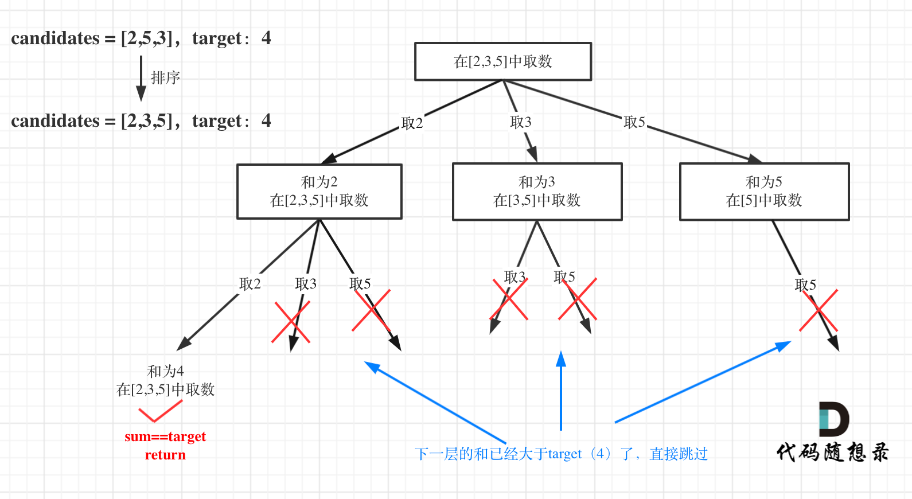

# cpp_algorithms

* 代码随想录 https://programmercarl.com/

* geeksforgeeks https://www.geeksforgeeks.org

--------------------------------------------------------------------------------
> **大家不必太在意leetcode上执行用时，打败多少多少用户，这个就是一个玩具，非常不准确。**
> 
> 做题的时候自己能分析出来时间复杂度就可以了，至于leetcode上执行用时，大概看一下就行，只要达到最优的时间复杂度就可以了，
> 
> 一样的代码多提交几次可能就击败百分之百了....
--------------------------------------------------------------------------------

# 回溯算法

https://www.geeksforgeeks.org/backtracking-algorithms/

--------------------------------------------------------------------------------

## 组合总和

## _5_combination_sum.md

--------------------------------------------------------------------------------

### 39. 组合总和

> 
> Leetcode链接: https://leetcode.cn/problems/combination-sum/
>
> 给你一个 **无重复元素** 的整数数组 `candidates` 和一个目标整数 `target` ，找出 `candidates` 中可以使数字和为目标数 `target` 的 所有 **不同组合** ，并以列表形式返回。你可以按 **任意顺序** 返回这些组合。
>
> `candidates` 中的 **同一个** 数字可以 **无限制重复被选取** 。如果至少一个数字的被选数量不同，则两种组合是不同的。 
>
> 对于给定的输入，保证和为 `target` 的不同组合数少于 `150` 个。
>
> 
> **示例1：**
> 
> ```html
> 输入：candidates = [2,3,6,7], target = 7
> 输出：[[2,2,3],[7]]
> 解释：
> 2 和 3 可以形成一组候选，2 + 2 + 3 = 7 。注意 2 可以使用多次。
> 7 也是一个候选， 7 = 7 。
> 仅有这两种组合。
> ```
> 
> **示例2：**
> 
> ```html
> 输入: candidates = [2,3,5], target = 8
> 输出: [[2,2,2,2],[2,3,3],[3,5]]
> ```
> 
> **示例3：**
> 
> ```html
> 输入: candidates = [2], target = 1
> 输出: []
> ```
>
> **提示：**
> * `1 <= candidates.length <= 30`
> * `2 <= candidates[i] <= 40`
> * `candidates` 的所有元素 **互不相同**
> * `1 <= target <= 40`
>
> ```c++
> class Solution {
> public:
>     vector<vector<int>> combinationSum(vector<int>& candidates, int target) {
> 
>     }
> };
> ```
> 


#### 我的思路及解法


>
> 由于`同一个 数字可以 无限制重复被选取`， 那么每个节点的子节点数量都相同，都是`candidates.size()`个可选节点
>
> 例如下图所示
> 
> <div align=center>
> 
> </div>
>
> <font color="yellow">
> 
> 有几个要注意的点，
> 
> 1. 为了遍历的方便，我们先把`candidate`重新排列`sort(candidates.begin(), candidates.end());`，之后再进行回溯枚举
>
> 2. 保证暂存组合的数组`nums`中的元素是非递减的，这样才能完整的得到所有答案
> 
> </font>
> 

```c++
class Solution {
public:
    // 递归回溯三要素：返回值和参数、停止条件、遍历过程
    // 参数：原始数组candidates, 目标综合target, 当前组合nums, 当前组合的总和sum、结果集result
    // 停止条件： sum = target
    // 遍历过程：横向遍历candidates，纵向深入时, 不限制范围. 
    // 例如，candidates = [2,3,6,7] 即使nums[0] = 2; nums[1]也仍然可选2, 3, 6, 7， sum + nums[1]不超过target就行
    void recursion(vector<int>& candidates, int target, vector<int>& nums, int sum, vector<vector<int>>& result) {
        // 停止条件
        if(sum == target) {
            result.push_back(nums);
            return;
        }
        
        // 当前总和sum < target, 继续遍历，向nums中添加内容
        for(int i=0; i < candidates.size(); i++) {
            // 如果当前sum + candidates[i] > target, 则跳过，且由于后面的数更大，更不可能，直接break就行
            if(sum + candidates[i] > target) break;
            
            // 如果当前组合nums不为空，则需要保证nums中的元素非递减，避免重复现象：如[[2,2,3],[2,3,2],[3,2,2],[7]]
            // 只要是candidates[i] 小于 nums中的最后一个元素，就不能放入
            if(nums.size() != 0 && candidates[i] < nums[nums.size()-1]) continue;
            
            // 第一个if保证了：sum + candidates[i] <= target, 就可以继续深入递归
            // 第二个if保证了：如果当前组合nums为空，或者candidates[i] 大于等于 nums中的最后一个元素，就放入
            nums.push_back(candidates[i]);   // 处理节点
            sum += candidates[i];            // 处理节点
            recursion(candidates, target, nums, sum, result);  // 深入递归
            nums.pop_back();      // 回溯
            sum -= candidates[i]; // 回溯          
        }

    }

    vector<vector<int>> combinationSum(vector<int>& candidates, int target) {
        // 注意，不是一定要把所有情况都给出，每种输入，输出不同组合数少于 150 个就行。
        // 但是我们还是要全部列出，最完美

        // 先将candidates按照从小到大的顺序排列
        sort(candidates.begin(), candidates.end());

        // 组合问题，首选回溯算法
        vector<vector<int>> result;
        vector<int> nums;
        recursion(candidates, target, nums, 0, result);

        // 返回
        return result;
    }
};
```

>
> 当然，由于我们已经排序了`candidates`，可以通过`int startIndex`参数，来控制每一层从哪个元素开始放入
>
> 
```c++
class Solution {
public:
    // 递归回溯三要素：返回值和参数、停止条件、遍历过程
    // 参数：原始数组candidates, 目标综合target, 当前组合nums, 当前组合的总和sum、递归下一层的开始索引、结果集result
    // 停止条件： sum = target
    // 遍历过程：横向遍历candidates，纵向深入时, 不限制范围. 
    // 例如，candidates = [2,3,6,7] 即使nums[0] = 2; nums[1]也仍然可选2, 3, 6, 7， sum + nums[1]不超过target就行
    void recursion(vector<int>& candidates, int target, vector<int>& nums, int sum,  int startIndex, vector<vector<int>>& result) {
        // 停止条件
        if(sum == target) {
            result.push_back(nums);
            return;
        }
        
        // 当前总和sum < target, 继续遍历，向nums中添加内容
        for(int i=startIndex; i < candidates.size(); i++) {
            // 如果当前sum + candidates[i] > target, 则跳过，且由于后面的数更大，更不可能，直接break就行
            if(sum + candidates[i] > target) break;
            // if保证了：sum + candidates[i] <= target, 就可以继续深入递归

            // startIndex保证了candidates[i] 一定大于等于 nums中的最后一个元素，避免重复现象：如[[2,2,3],[2,3,2],[3,2,2],[7]]
            
            // 处理节点
            nums.push_back(candidates[i]);   
            sum += candidates[i];            // 总和
            // 深入递归  关键点:不用i+1了，表示可以重复读取当前的数
            recursion(candidates, target, nums, sum, i, result);   
            // 回溯节点
            nums.pop_back();      
            sum -= candidates[i]; // 总和          
        }

    }

    vector<vector<int>> combinationSum(vector<int>& candidates, int target) {
        // 注意，不是一定要把所有情况都给出，每种输入，输出不同组合数少于 150 个就行。
        // 但是我们还是要全部列出，最完美
        
        // 先将candidates按照从小到大的顺序排列
        sort(candidates.begin(), candidates.end());

        // 组合问题，首选回溯算法
        vector<vector<int>> result;
        vector<int> nums;
        recursion(candidates, target, nums, 0, 0, result);

        // 返回
        return result;
    }
};
```

>
> 优化代码风格，将`公共变量作为类的成员`; `递归函数放入private`
>
> 

```c++
class Solution {
private:
    vector<vector<int>> result;
    vector<int> nums;    

    // 递归回溯三要素：返回值和参数、停止条件、遍历过程
    // 参数：原始数组candidates, 目标综合target, 当前组合nums, 当前组合的总和sum、递归下一层的开始索引、结果集result
    // 停止条件： sum = target
    // 遍历过程：横向遍历candidates，纵向深入时, 不限制范围. 
    // 例如，candidates = [2,3,6,7] 即使nums[0] = 2; nums[1]也仍然可选2, 3, 6, 7， sum + nums[1]不超过target就行
    void recursion(vector<int>& candidates, int target, int sum,  int startIndex) {
        // 停止条件
        if(sum == target) {
            result.push_back(nums);
            return;
        }
        
        // 当前总和sum < target, 继续遍历，向nums中添加内容
        for(int i=startIndex; i < candidates.size(); i++) {
            // 如果当前sum + candidates[i] > target, 则跳过，且由于后面的数更大，更不可能，直接break就行
            if(sum + candidates[i] > target) break;
            // if保证了：sum + candidates[i] <= target, 就可以继续深入递归

            // startIndex保证了candidates[i] 一定大于等于 nums中的最后一个元素，避免重复现象：如[[2,2,3],[2,3,2],[3,2,2],[7]]
            
            // 处理节点
            nums.push_back(candidates[i]);   
            sum += candidates[i];            // 总和
            // 深入递归  
            recursion(candidates, target, sum, i);   // 关键点:不用i+1了，表示可以重复读取当前的数
            // 回溯节点
            nums.pop_back();      
            sum -= candidates[i]; // 总和          
        }

    }

public:
    vector<vector<int>> combinationSum(vector<int>& candidates, int target) {
        // 注意，不是一定要把所有情况都给出，每种输入，输出不同组合数少于 150 个就行。
        // 但是我们还是要全部列出，最完美
        
        // 先将candidates按照从小到大的顺序排列
        sort(candidates.begin(), candidates.end());

        if(result.size() != 0) result.clear();
        if(nums.size() != 0) nums.clear();

        // 组合问题，首选回溯算法
        recursion(candidates, target, 0, 0);

        // 返回
        return result;
    }
};
```


#### 代码随想录

##### 思路


>
> 题目中的**无限制重复被选取，吓得我赶紧想想 出现`0` 可咋办**，然后看到下面提示：`1 <= candidates[i] <= 200`，我就放心了。
>
> 本题和77.组合 (`_1_combinations.md`)，216.组合总和III (`_2_combination_sum_iii.md`)的区别是：本题没有数量要求，可以无限重复，但是有总和的限制，所以间接的也是有个数的限制。
>
> 本题搜索的过程抽象成树形结构如下：
> 
> <div align=center>
> 
> </div>
>
> 注意图中叶子节点的返回条件，因为本题没有组合数量要求，仅仅是总和的限制，所以递归没有层数的限制，只要选取的元素总和超过`target`，就返回！'
>
> 而在77.组合 (`_1_combinations.md`)和216.组合总和III (`_2_combination_sum_iii.md`)都可以知道要递归K层，因为要取k个元素的组合。
> 
> 
> 

##### 回溯三部曲

> 
> * 递归函数参数
>
> 这里依然是定义两个全局变量，二维数组`result`存放结果集，数组`path`存放符合条件的结果。（这两个变量可以作为函数参数传入）
>
> 首先是题目中给出的参数，集合`candidates`, 和目标值`target`。
>
> 此外我还定义了`int`型的`sum`变量来统计单一结果`path`里的总和，其实这个`sum`也可以不用，用`target`做相应的减法就可以了，最后如何`target==0`就说明找到符合的结果了，但为了代码逻辑清晰，我依然用了`sum`。
> 
> **本题还需要`startIndex`来控制`for`循环的起始位置，对于组合问题，什么时候需要`startIndex`呢？**
>
> <font color="pink">
>
> 我举过例子，如果是一个集合来求组合的话，就需要`startIndex`，例如：77.组合 (`_1_combinations.md`)和216.组合总和III (`_2_combination_sum_iii.md`)
>
> 如果是多个集合取组合，各个集合之间相互不影响，那么就不用`startIndex`，例如：17.电话号码的字母组合(`_3_letter_combinations_of_a_phone_number.md`)
>
> </font>
> 
> **<font color="gree">注意以上我只是说求组合的情况，如果是排列问题，又是另一套分析的套路，后面我再讲解排列的时候就重点介绍。</font>**
>
> 代码如下：
>
> ```c++
> vector<vector<int>> result;
> vector<int> path;
> void backtracking(vector<int>& candidates, int target, int sum, int startIndex)
> ```
> 
> * 递归终止条件
>
> 在如下树形结构中：
> 
> <div align=center>
> 
> </div>
>
> 从叶子节点可以清晰看到，终止只有两种情况，`sum`大于`target`和`sum`等于`target`。
>
> `sum`等于`target`的时候，需要收集结果，代码如下：
>
> ```c++
> if (sum > target) {
>     return;
> }
> if (sum == target) {
>     result.push_back(path);
>     return;
> }
> ```
>
> * 单层搜索的逻辑
> 
> 单层`for`循环依然是从`startIndex`开始，搜索`candidates`集合。
>
> **注意本题和77.组合 (`_1_combinations.md`)、216.组合总和III (`_2_combination_sum_iii.md`)的一个区别是：本题元素为可重复选取的。**
>
> 如何重复选取呢，看代码，注释部分：
> 
> ```c++
> for (int i = startIndex; i < candidates.size(); i++) {
>     sum += candidates[i];
>     path.push_back(candidates[i]);
>     backtracking(candidates, target, sum, i); // 关键点:不用i+1了，表示可以重复读取当前的数
>     sum -= candidates[i];   // 回溯
>     path.pop_back();        // 回溯
> }
> ```
> 
> 按照关于回溯算法，你该了解这些！ (`_5_combination_sum.md`)中给出的模板，不难写出如下C++完整代码：
>
> ```c++
> // 版本一
> class Solution {
> private:
>     vector<vector<int>> result;
>     vector<int> path;
>     void backtracking(vector<int>& candidates, int target, int sum, int startIndex) {
>         if (sum > target) {
>             return;
>         }
>         if (sum == target) {
>             result.push_back(path);
>             return;
>         }
> 
>         for (int i = startIndex; i < candidates.size(); i++) {
>             sum += candidates[i];
>             path.push_back(candidates[i]);
>             backtracking(candidates, target, sum, i); // 不用i+1了，表示可以重复读取当前的数
>             sum -= candidates[i];
>             path.pop_back();
>         }
>     }
> public:
>     vector<vector<int>> combinationSum(vector<int>& candidates, int target) {
>         result.clear();
>         path.clear();
>         backtracking(candidates, target, 0, 0);
>         return result;
>     }
> };
> ```
>  
> 


##### 剪枝优化

> 
> 在这个树形结构中：
> 
> <div align=center>
> 
> </div>
>
> 以及上面的版本一的代码大家可以看到，对于`sum`已经大于`target`的情况，其实是依然进入了下一层递归，只是下一层递归结束判断的时候，会判断`sum > target`的话就返回。
>
> 其实如果已经知道下一层的`sum`会大于`target`，就没有必要进入下一层递归了。
>
> 那么可以在for循环的搜索范围上做做文章了。
> 
> **对总集合排序之后，如果下一层的`sum`（就是`本层的 sum + candidates[i]`）已经大于`target`，就可以结束本轮`for`循环的遍历。**
>
> 如图：
> 
> <div align=center>
> 
> </div>
>
> for循环剪枝代码如下：
>
> ```c++
> for (int i = startIndex; i < candidates.size() && sum + candidates[i] <= target; i++)
> ```
> 
> 整体代码如下：（注意注释的部分）
>
> ```c++
> class Solution {
> private:
>     vector<vector<int>> result;
>     vector<int> path;
>     void backtracking(vector<int>& candidates, int target, int sum, int startIndex) {
>         if (sum == target) {
>             result.push_back(path);
>             return;
>         }
> 
>         // 如果 sum + candidates[i] > target 就终止遍历
>         for (int i = startIndex; i < candidates.size() && sum + candidates[i] <= target; i++) {
>             sum += candidates[i];
>             path.push_back(candidates[i]);
>             backtracking(candidates, target, sum, i);
>             sum -= candidates[i];
>             path.pop_back();
> 
>         }
>     }
> public:
>     vector<vector<int>> combinationSum(vector<int>& candidates, int target) {
>         result.clear();
>         path.clear();
>         sort(candidates.begin(), candidates.end()); // 需要排序
>         backtracking(candidates, target, 0, 0);
>         return result;
>     }
> };
> ```
> 
> * 时间复杂度: `O(n * 2^n)`，注意这只是复杂度的上界，因为剪枝的存在，真实的时间复杂度远小于此
>
> * 空间复杂度: `O(target)`
>
> 
> 


##### 总结

> 
> 本题和我们之前讲过的77.组合 (`_1_combinations.md`)、216.组合总和III (`_2_combination_sum_iii.md`)有两点不同：
>
> * 组合没有数量要求
> * 元素可无限重复选取
> 
> 针对这两个问题，我都做了详细的分析。
> 
> 并且给出了对于组合问题，什么时候用`startIndex`，什么时候不用，并用17.电话号码的字母组合 (`_3_letter_combinations_of_a_phone_numbermd`)做了对比。
>
> 最后还给出了本题的剪枝优化，这个优化如果是初学者的话并不容易想到。
>
> **在求和问题中，排序之后加剪枝是常见的套路！**
>
> 可以看出我写的文章都会大量引用之前的文章，就是要不断作对比，分析其差异，然后给出代码解决的方法，这样才能彻底理解题目的本质与难点。
> 


