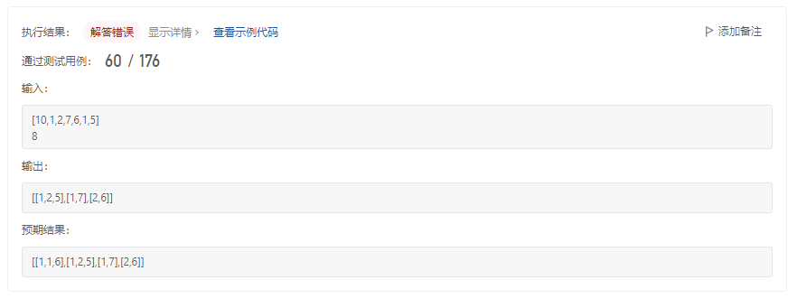
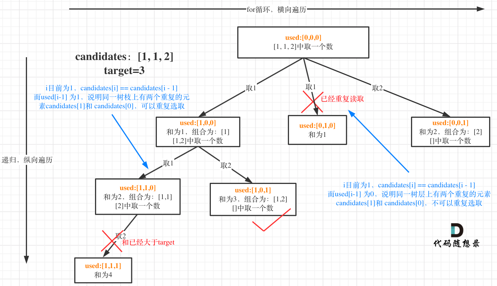

# cpp_algorithms

* 代码随想录 https://programmercarl.com/

* geeksforgeeks https://www.geeksforgeeks.org

--------------------------------------------------------------------------------
> **大家不必太在意leetcode上执行用时，打败多少多少用户，这个就是一个玩具，非常不准确。**
> 
> 做题的时候自己能分析出来时间复杂度就可以了，至于leetcode上执行用时，大概看一下就行，只要达到最优的时间复杂度就可以了，
> 
> 一样的代码多提交几次可能就击败百分之百了....
--------------------------------------------------------------------------------

# 回溯算法

https://www.geeksforgeeks.org/backtracking-algorithms/

--------------------------------------------------------------------------------

## 组合总和 II

## _6_combination_sum_ii.md

--------------------------------------------------------------------------------

### 40. 组合总和 II

> 
> Leetcode链接: https://leetcode.cn/problems/combination-sum-ii/
>
> 给定一个候选人编号的集合 `candidates` 和一个目标数 `target` ，找出 `candidates` 中所有可以使数字和为 `target` 的组合。
>
> `candidates` 中的每个数字在每个组合中只能使用 一次 。
>
> **注意**：解集不能包含重复的组合。 
> 
> 
> **示例1：**
> 
> ```html
> 输入: candidates = [10,1,2,7,6,1,5], target = 8,
> 输出:
> [
> [1,1,6],
> [1,2,5],
> [1,7],
> [2,6]
> ]
> ```
> 
> **示例2：**
> 
> ```html
> 输入: candidates = [2,5,2,1,2], target = 5,
> 输出:
> [
> [1,2,2],
> [5]
> ]
> ```
> 
> **提示：**
> * `1 <= candidates.length <= 100`
> * `1 <= candidates[i] <= 50`
> * `1 <= target <= 30`
>
> ```c++
> class Solution {
> public:
>     vector<vector<int>> combinationSum2(vector<int>& candidates, int target) {
> 
>     }
> };
> ```
> 


#### 我的思路及解法

>
> 刚开始是这样
>
> ```c++
> class Solution {
> private:
>     vector<vector<int>> result;
>     vector<int> nums;
>     
>     // 回溯函数三要素
>     // 返回值和参数：候选人集合candidats, 目标和target，当前树节点遍历的开始索引startIndex, 当前组合nums的总和sum
>     // 停止条件：sum == target则nums入result，然后返回；sum > target则直接返回，不处理
>     // 遍历过程，从startIndex ~ candidats.size() - 1 范围内按索引顺序遍历
>     void recursion(vector<int>& candidates, int target, int startIndex, int sum) {
>         // sum == target满足要求，加入结果集
>         if(sum == target) {
>             result.push_back(nums);
>             return;
>         }
>         // sum > target超过目标，不继续处理，因为后面的索引对应值更大，直接返回
>         if (sum > target) {
>             return;
>         }
> 
>         // sum < target
>         for(int i=startIndex; i < candidates.size(); i++) {
>             // 处理当前节点
>             nums.push_back(candidates[i]);
>             sum += candidates[i];
>             // 深入递归
>             recursion(candidates, target, i+1, sum);
>             // 回溯
>             nums.pop_back();
>             sum -= candidates[i];            
>         }
> 
>     }
> 
> public:
>     vector<vector<int>> combinationSum2(vector<int>& candidates, int target) {
>         // 注意点：candidates种有重复的数字出现
>         // 但是根据例1来看，及时数值相同，只要下标索引不同，也算不同的数字，只是一个下标只能出现一次
>         // 要找到所有为target的组合，就好找了
>         
>         if(result.size() != 0) result.clear();
>         if(nums.size() != 0) nums.clear();
> 
>         // 先排序，保证数值从小到大，递增
>         // 这样可以将数值相同的放在一起，例如[10,1,2,7,6,1,5]变成[1,1,2,5,6,7,10]
>         sort(candidates.begin(), candidates.end());
> 
>         // 每次递归深入的起始索引startIndex只能是上一层索引index+1, 保证不出现重复的索引
>         recursion(candidates, target, 0, 0);
> 
>         // 返回结果集
>         return result;
>     }
> }; 
> ```
> 
> 
> 
> <font color="yellow">但是报错了</font>
> 
> <div align=center>
> 
> </div>
>
> 为什么遍历到`[1,7]`后，又出现了`[1,2,5]`？
>
> 以下是分析
>
> 在`sort(candidates.begin(), candidates.end());`之后`[10,1,2,7,6,1,5]变成[1,1,2,5,6,7,10]`
>
> 当我们的`nums`中是这样时`[candidates[0]、...]`和`[candidates[1]、...]`就会出现重复的组合，因为`candidates[0] = candidates[1] = 1`
>
> 所以为了避免出现重复的组合，已经用过的值，不能再用（相同的值都相邻）
>
> `同一个for循环中，需要跳过重复的值`
>
> ```c++
> // sum < target
> for(int i=startIndex; i < candidates.size(); i++) {
>     // 跳过重复集合: 同一个for循环中，需要跳过重复的值
>     if(i > 0 && candidates[i] == candidates[i-1]) continue;
>     ...
> }
> ```
> 
> 代码应该改为如下这样
>
>
> ```c++
> class Solution {
> private:
>     vector<vector<int>> result;
>     vector<int> nums;
>     
>     // 回溯函数三要素
>     // 返回值和参数：候选人集合candidats, 目标和target，当前树节点遍历的开始索引startIndex, 当前组合nums的总和sum
>     // 停止条件：sum == target则nums入result，然后返回；sum > target则直接返回，不处理
>     // 遍历过程，从startIndex ~ candidats.size() - 1 范围内按索引顺序遍历
>     void recursion(vector<int>& candidates, int target, int startIndex, int sum) {
>         // sum == target满足要求，加入结果集
>         if(sum == target) {
>             result.push_back(nums);
>             return;
>         }
>         // sum > target超过目标，不继续处理，因为后面的索引对应值更大，直接返回
>         if (sum > target) {
>             return;
>         }
> 
>         // sum < target
>         for(int i=startIndex; i < candidates.size(); i++) {
>             // 跳过重复集合: 同一个for循环中，需要跳过重复的值
>             if(i > 0 && candidates[i] == candidates[i-1]) continue;
> 
>             // 处理当前节点
>             nums.push_back(candidates[i]);
>             sum += candidates[i];
>             // 深入递归
>             recursion(candidates, target, i+1, sum);
>             // 回溯
>             nums.pop_back();
>             sum -= candidates[i];            
>         }
> 
>     }
> 
> public:
>     vector<vector<int>> combinationSum2(vector<int>& candidates, int target) {
>         // 注意点：candidates种有重复的数字出现
>         // 但是根据例1来看，及时数值相同，只要下标索引不同，也算不同的数字，只是一个下标只能出现一次
>         // 要找到所有为target的组合，就好找了
>         
>         if(result.size() != 0) result.clear();
>         if(nums.size() != 0) nums.clear();
> 
>         // 先排序，保证数值从小到大，递增
>         // 这样可以将数值相同的放在一起，例如[10,1,2,7,6,1,5]变成[1,1,2,5,6,7,10]
>         sort(candidates.begin(), candidates.end());
> 
>         // 每次递归深入的起始索引startIndex只能是上一层索引index+1, 保证不出现重复的索引
>         recursion(candidates, target, 0, 0);
> 
>         // 返回结果集
>         return result;
>     }
> }; 
> ```
> 
> 
> 
> 
> <font color="yellow">但是依旧报错</font>
> 
> <div align=center>
> 
> </div>
>
> 错失了`[1,1,6]`的情况
>
> 我们的避免重复的代码，应该`i > 0 && `改为`i > startIndex &&`
>
> ```c++
> // sum < target
> for(int i=startIndex; i < candidates.size(); i++) {
>     // 跳过重复集合: 同一个for循环中，需要跳过重复的值
>     if(i > startIndex && candidates[i] == candidates[i-1]) continue;
>     ...
> }
> ```
> 
> 
> 

>
> <font color="yellow">最终代码如下：</font>
>
>
> ```c++
> class Solution {
> private:
>     vector<vector<int>> result;
>     vector<int> nums;
>     
>     // 回溯函数三要素
>     // 返回值和参数：候选人集合candidats, 目标和target，当前树节点遍历的开始索引startIndex, 当前组合nums的总和sum
>     // 停止条件：sum == target则nums入result，然后返回；sum > target则直接返回，不处理
>     // 遍历过程，从startIndex ~ candidats.size() - 1 范围内按索引顺序遍历
>     void recursion(vector<int>& candidates, int target, int startIndex, int sum) {
>         // sum == target满足要求，加入结果集
>         if(sum == target) {
>             result.push_back(nums);
>             return;
>         }
>         // sum > target超过目标，不继续处理，因为后面的索引对应值更大，直接返回
>         if (sum > target) {
>             return;
>         }
> 
>         // sum < target
>         for(int i=startIndex; i < candidates.size(); i++) {
>             // 跳过重复集合: 同一个for循环中，需要跳过重复的值
>             if(i > startIndex && candidates[i] == candidates[i-1]) continue;
> 
>             // 处理当前节点
>             nums.push_back(candidates[i]);
>             sum += candidates[i];
>             // 深入递归
>             recursion(candidates, target, i+1, sum);
>             // 回溯
>             nums.pop_back();
>             sum -= candidates[i];            
>         }
> 
>     }
> 
> public:
>     vector<vector<int>> combinationSum2(vector<int>& candidates, int target) {
>         // 注意点：candidates种有重复的数字出现
>         // 但是根据例1来看，及时数值相同，只要下标索引不同，也算不同的数字，只是一个下标只能出现一次
>         // 要找到所有为target的组合，就好找了
>         
>         if(result.size() != 0) result.clear();
>         if(nums.size() != 0) nums.clear();
> 
>         // 先排序，保证数值从小到大，递增
>         // 这样可以将数值相同的放在一起，例如[10,1,2,7,6,1,5]变成[1,1,2,5,6,7,10]
>         sort(candidates.begin(), candidates.end());
> 
>         // 每次递归深入的起始索引startIndex只能是上一层索引index+1, 保证不出现重复的索引
>         recursion(candidates, target, 0, 0);
> 
>         // 返回结果集
>         return result;
>     }
> }; 
> ```
> 


>
> <font color="yellow">可以将`if(sum > target)`换成`if(sum + candidates[i] > target) break;`，这样剪枝，时间复杂度更小</font>
>
> ```c++
> class Solution {
> private:
>     vector<vector<int>> result;
>     vector<int> nums;
>     
>     // 回溯函数三要素
>     // 返回值和参数：候选人集合candidats, 目标和target，当前树节点遍历的开始索引startIndex, 当前组合nums的总和sum
>     // 停止条件：sum == target则nums入result，然后返回；sum > target则直接返回，不处理
>     // 遍历过程，从startIndex ~ candidats.size() - 1 范围内按索引顺序遍历
>     void recursion(vector<int>& candidates, int target, int startIndex, int sum) {
>         // sum == target满足要求，加入结果集
>         if(sum == target) {
>             result.push_back(nums);
>             return;
>         }
> 
>         for(int i=startIndex; i < candidates.size(); i++) {
>             // 如果当前sum + candidates[i] > target, 则跳过，且由于后面的数更大，更不可能，直接break就行
>             if(sum + candidates[i] > target) break;
>             // if保证了：sum + candidates[i] <= target, 就可以继续深入递归
> 
>             // 跳过重复集合: 同一个for循环中，需要跳过重复的值
>             if(i > startIndex && candidates[i] == candidates[i-1]) continue;
> 
>             // 处理当前节点
>             nums.push_back(candidates[i]);
>             sum += candidates[i];
>             // 深入递归
>             recursion(candidates, target, i+1, sum);
>             // 回溯
>             nums.pop_back();
>             sum -= candidates[i];            
>         }
> 
>     }
> 
> public:
>     vector<vector<int>> combinationSum2(vector<int>& candidates, int target) {
>         // 注意点：candidates种有重复的数字出现
>         // 但是根据例1来看，及时数值相同，只要下标索引不同，也算不同的数字，只是一个下标只能出现一次
>         // 要找到所有为target的组合，就好找了
>         
>         if(result.size() != 0) result.clear();
>         if(nums.size() != 0) nums.clear();
> 
>         // 先排序，保证数值从小到大，递增
>         // 这样可以将数值相同的放在一起，例如[10,1,2,7,6,1,5]变成[1,1,2,5,6,7,10]
>         sort(candidates.begin(), candidates.end());
> 
>         // 每次递归深入的起始索引startIndex只能是上一层索引index+1, 保证不出现重复的索引
>         recursion(candidates, target, 0, 0);
> 
>         // 返回结果集
>         return result;
>     }
> }; 
> ```
> 
> 
> 


#### 代码随想录

##### 思路

> 
> 这道题目和39.组合总和 (`_5_combination_sum.md`)如下区别：
>
> 1. 本题`candidates` 中的每个数字在每个组合中只能使用一次。
> 2. 本题数组`candidates`的元素是有重复的，而39.组合总和 (`_5_combination_sum.md`)是无重复元素的数组`candidates`
>
> 最后本题和39.组合总和 (`_5_combination_sum.md`)要求一样，解集不能包含重复的组合。
>
> **本题的难点在于区别2中：集合（数组`candidates`）有重复元素，但还不能有重复的组合。**
>
> 一些同学可能想了：我把所有组合求出来，再用`set`或者`map`去重，这么做很容易超时！
>
> 所以要在搜索的过程中就去掉重复组合。
>
> 很多同学在去重的问题上想不明白，其实很多题解也没有讲清楚，反正代码是能过的，感觉是那么回事，稀里糊涂的先把题目过了。
>
> 这个去重为什么很难理解呢，`所谓去重，其实就是使用过的元素不能重复选取`。 这么一说好像很简单！
>
> 都知道组合问题可以抽象为树形结构，那么“使用过”在这个树形结构上是有两个维度的，一个维度是同一树枝上使用过，一个维度是同一树层上使用过。**没有理解这两个层面上的“使用过” 是造成大家没有彻底理解去重的根本原因。**
>
> 那么问题来了，我们是要同一树层上使用过，还是同一树枝上使用过呢？
>
> <font color="yellow">回看一下题目，元素在同一个组合内是可以重复的，怎么重复都没事，但两个组合不能相同。</font>
>
> **所以我们要去重的是同一树层上的“使用过”，同一树枝上的都是一个组合里的元素，不用去重。**
>
> 为了理解去重我们来举一个例子，`candidates = [1, 1, 2], target = 3`，（方便起见`candidates`已经排序了）
>
> **强调一下，树层去重的话，需要对数组排序！**
>
> 选择过程树形结构如图所示：
> 
> <div align=center>
> 
> </div>
>
> 
> 可以看到图中，每个节点相对于 39.组合总和 (`_5_combination_sum.md`)我多加了`use`d数组，这个`used`数组下面会重点介绍。
>
> 


##### 回溯三部曲

>
> * 递归函数参数
>
> 与39.组合总和 (`_5_combination_sum.md`)套路相同，此题还需要加一个`bool`型数组`used`，用来记录同一树枝上的元素是否使用过。
>
> 这个集合去重的重任就是`used`来完成的。
>
> 代码如下：
>
> ```c++
> vector<vector<int>> result; // 存放组合集合
> vector<int> path;           // 符合条件的组合
> void backtracking(vector<int>& candidates, int target, int sum, int startIndex, vector<bool>& used) {
> ```
>
> 
> * 递归终止条件
>
> 与39.组合总和 (`_5_combination_sum.md`)相同，终止条件为 `sum > target` 和 `sum == target`。
>
> 代码如下：
>
> ```c++
> if (sum > target) { // 这个条件其实可以省略
>     return;
> }
> if (sum == target) {
>     result.push_back(path);
>     return;
> }
> ```
> 
> `sum > target` 这个条件其实可以省略，因为在递归单层遍历的时候，会有剪枝的操作，下面会介绍到。
> 
>
> * 单层搜索的逻辑
>
> 这里与39.组合总和 (`_5_combination_sum.md`)最大的不同就是要去重了。
>
> 前面我们提到：要去重的是“同一树层上的使用过”，如何判断同一树层上元素（相同的元素）是否使用过了呢。
>
> **如果`candidates[i] == candidates[i - 1]` 并且 `used[i - 1] == false`，就说明：前一个树枝，使用了`candidates[i - 1]`，也就是说同一树层使用过`candidates[i - 1]`。**
> 
> 此时`for`循环里就应该做`continue`的操作。
>
> 这块比较抽象，如图：
> 
> <div align=center>
> 
> </div>
> 
> 我在图中将`used`的变化用橘黄色标注上，可以看出在`candidates[i] == candidates[i - 1]`相同的情况下：
> 
> * `used[i - 1] == true`，说明同一树枝`candidates[i - 1]`使用过
> * `used[i - 1] == false`，说明同一树层`candidates[i - 1]`使用过
>
> 可能有的录友想，为什么 u`sed[i - 1] == false` 就是同一树层呢，因为同一树层，`used[i - 1] == false` 才能表示，当前取的 `candidates[i]` 是从 `candidates[i - 1]` 回溯而来的。
>
> 而 `used[i - 1] == true`，说明是进入下一层递归，去下一个数，所以是树枝上，如图所示：
> 
> <div align=center>
> 
> </div>
>
> **这块去重的逻辑很抽象，网上搜的题解基本没有能讲清楚的，如果大家之前思考过这个问题或者刷过这道题目，看到这里一定会感觉通透了很多！**
>
> 那么单层搜索的逻辑代码如下：
>
> ```c++
> for (int i = startIndex; i < candidates.size() && sum + candidates[i] <= target; i++) {
>     // used[i - 1] == true，说明同一树枝candidates[i - 1]使用过
>     // used[i - 1] == false，说明同一树层candidates[i - 1]使用过
>     // 要对同一树层使用过的元素进行跳过
>     if (i > 0 && candidates[i] == candidates[i - 1] && used[i - 1] == false) {
>         continue;
>     }
>     sum += candidates[i];
>     path.push_back(candidates[i]);
>     used[i] = true;
>     backtracking(candidates, target, sum, i + 1, used); // 和39.组合总和的区别1：这里是i+1，每个数字在每个组合中只能使用一次
>     used[i] = false;
>     sum -= candidates[i];
>     path.pop_back();
> }
> ```
> 
> 注意`sum + candidates[i] <= target`为剪枝操作，在39.组合总和 (`_5_combination_sum.md`)有讲解过！
>
> 回溯三部曲分析完了，整体C++代码如下：
>
> ```c++
> class Solution {
> private:
>     vector<vector<int>> result;
>     vector<int> path;
>     void backtracking(vector<int>& candidates, int target, int sum, int startIndex, vector<bool>& used) {
>         if (sum == target) {
>             result.push_back(path);
>             return;
>         }
>         for (int i = startIndex; i < candidates.size() && sum + candidates[i] <= target; i++) {
>             // used[i - 1] == true，说明同一树枝candidates[i - 1]使用过
>             // used[i - 1] == false，说明同一树层candidates[i - 1]使用过
>             // 要对同一树层使用过的元素进行跳过
>             if (i > 0 && candidates[i] == candidates[i - 1] && used[i - 1] == false) {
>                 continue;
>             }
>             sum += candidates[i];
>             path.push_back(candidates[i]);
>             used[i] = true;
>             backtracking(candidates, target, sum, i + 1, used); // 和39.组合总和的区别1，这里是i+1，每个数字在每个组合中只能使用一次
>             used[i] = false;
>             sum -= candidates[i];
>             path.pop_back();
>         }
>     }
> 
> public:
>     vector<vector<int>> combinationSum2(vector<int>& candidates, int target) {
>         vector<bool> used(candidates.size(), false);
>         path.clear();
>         result.clear();
>         // 首先把给candidates排序，让其相同的元素都挨在一起。
>         sort(candidates.begin(), candidates.end());
>         backtracking(candidates, target, 0, 0, used);
>         return result;
>     }
> };
> ```
> 
> * 时间复杂度: `O(n * 2^n)`
> * 空间复杂度: `O(n)`
>
> 
> 
> 


##### 补充

> 
> 这里直接用`startIndex`来去重也是可以的， 就不用`used`数组了。
>
> ```c++
> class Solution {
> private:
>     vector<vector<int>> result;
>     vector<int> path;
>     void backtracking(vector<int>& candidates, int target, int sum, int startIndex) {
>         if (sum == target) {
>             result.push_back(path);
>             return;
>         }
>         for (int i = startIndex; i < candidates.size() && sum + candidates[i] <= target; i++) {
>             // 要对同一树层使用过的元素进行跳过
>             if (i > startIndex && candidates[i] == candidates[i - 1]) {
>                 continue;
>             }
>             sum += candidates[i];
>             path.push_back(candidates[i]);
>             backtracking(candidates, target, sum, i + 1); // 和39.组合总和的区别1，这里是i+1，每个数字在每个组合中只能使用一次
>             sum -= candidates[i];
>             path.pop_back();
>         }
>     }
> 
> public:
>     vector<vector<int>> combinationSum2(vector<int>& candidates, int target) {
>         path.clear();
>         result.clear();
>         // 首先把给candidates排序，让其相同的元素都挨在一起。
>         sort(candidates.begin(), candidates.end());
>         backtracking(candidates, target, 0, 0);
>         return result;
>     }
> };
> ```
> 
> 
> 


##### 总结

>
> 本题同样是求组合总和，但就是因为其数组`candidates`有重复元素，而要求不能有重复的组合，所以相对于39.组合总和 (`_5_combination_sum.md`)难度提升了不少。
>
> **关键是去重的逻辑，代码很简单，网上一搜一大把，但几乎没有能把这块代码含义讲明白的，基本都是给出代码，然后说这就是去重了，究竟怎么个去重法也是模棱两可。**
>
> 所以`Carl`有必要把去重的这块彻彻底底的给大家讲清楚，**就连 "树层去重" 和 "树枝去重" 都是我自创的词汇，希望对大家理解有帮助！**
>
> 


