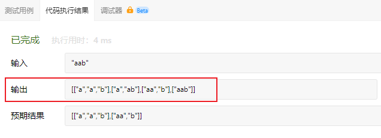

# cpp_algorithms

* 代码随想录 https://programmercarl.com/

* geeksforgeeks https://www.geeksforgeeks.org

--------------------------------------------------------------------------------
> **大家不必太在意leetcode上执行用时，打败多少多少用户，这个就是一个玩具，非常不准确。**
> 
> 做题的时候自己能分析出来时间复杂度就可以了，至于leetcode上执行用时，大概看一下就行，只要达到最优的时间复杂度就可以了，
> 
> 一样的代码多提交几次可能就击败百分之百了....
--------------------------------------------------------------------------------

# 回溯算法

https://www.geeksforgeeks.org/backtracking-algorithms/

--------------------------------------------------------------------------------

## 分割回文串

## _7_palindrome_partitioning.md

--------------------------------------------------------------------------------

### 131. 分割回文串

> 
> Leetcode链接: https://leetcode.cn/problems/palindrome-partitioning/
>
> 给你一个字符串 `s`，请你将 `s` 分割成一些子串，使每个子串都是 回文串 。返回 `s` 所有可能的分割方案。
> 
> 
> **示例1：**
> 
> ```html
> 输入：s = "aab"
> 输出：[["a","a","b"],["aa","b"]]
> ```
> 
> **示例2：**
> 
> ```html
> 输入：s = "a"
> 输出：[["a"]]
> ```
> 
> **提示：**
> * `1 <= s.length <= 16`
> * `s` 仅由小写英文字母组成
>
> ```c++
> class Solution {
> public:
>     vector<vector<string>> partition(string s) {
> 
>     }
> };
> ```
> 
> 
> 


#### 我的思路及代码


> <font color="yellow">
> 
> 为何会想到用到回溯法（递归）？
>
> 因为这是`切割`问题，常用回溯法？ ()
> 
> </font>
>
> <font color="pink">切割问题 可以抽象为 组合问题</font>
> 
> <font color="gree">
> 
> 回溯法，一般可以解决如下几种问题：
>
> * 组合问题：`N`个数里面按一定规则找出`k`个数的集合
> * 切割问题：一个字符串按一定规则有几种切割方式
> * 子集问题：一个`N`个数的集合里有多少符合条件的子集
> * 排列问题：`N`个数按一定规则全排列，有几种排列方式
> * 棋盘问题：`N`皇后，解数独等等
>
> </font>
>
> 


> 
> <font color="pink">
> 
> 如果笔试的时候写不出来，可以暴力拿一些分：
> 
> 假定没有回文，全部切割成长度为`1`的子串
>
> 估计可以拿一些分
> 
> </font>
> 


>
>
> <font color="gree">1. 先不想着回文，先单纯地给出所有切割方案</font>
> 
> <div align=center>
> 
> </div>
>
> ```c++
> class Solution {
> private:
>     vector<vector<string>> result;
>     vector<string> path; // 树上遍历的路径
>     
>     // 递归回溯三要素：参数和返回值，停止条件，遍历过程
>     // 参数：原始字符串s，递归深入下一层开始的索引
>     // 停止条件：startIndex == s.size(), 无法再分割
>     // 遍历过程：从startIndex开始的子串长度为 1 ~ s.size()-startIndex
>     void recursion(string& s, int startIndex) {
>         // 停止条件
>         if (startIndex == s.size()) {
>             result.push_back(path);
>             return;
>         }
> 
>         // 横向遍历，同一层的节点中，不同的是sublength
>         for(int sublength = 1; sublength <= s.size() - startIndex; sublength++) {
>             // 处理节点 
>             string substr; // 创建空子串
>             for(int i = startIndex; i < startIndex + sublength; i++) {
>                 substr = substr + s[i];
>             }
>             path.push_back(substr);// 截取子串，放入path
>             // 递归深入
>             recursion(s, startIndex + sublength);  // 下一层从startIndex + sublength索引开始
> 
>             // 回溯节点
>             path.pop_back();
>         }
> 
>     }
> 
> public:
>     vector<vector<string>> partition(string s) {
>         if(result.size() == 0) result.clear();
>         if(path.size() == 0) path.clear();       
>         recursion(s, 0);
>         return result;
>     }
> };
> ```
> 
> <font color="yellow">执行用例试试</font>
>
> 
> <div align=center>
> 
> </div>
>
> <font color="yellow">确实把所有的情况都遍历出来了</font>
> 
> <br>
> <br>
> <br>
>
> 
>
> 
> 
> <font color="gree">2. 单纯切割的代码写出来后，再加入回文判断, 只有`substr`属于回文序列时，才可以`path.push_back(substr)`</font>
>
> <font color="yellow">判断方法如下：</font>
> 
> ```c++
> class Solution {
> private:
>     
>     ...
>     
>     // 判断是否回文：双指针法
>     bool huiwen(string str) {
>         // 如果长度为1，直接返回true
>         if(str.size() == 1) return true;
> 
>         // 双指针法
>         int left = 0;
>         int right = str.size() - 1;
>         for(; left <= right; left++, right--) {
>             if(str[left] != str[right]) return false;
>         }
>         
>         // 双指针法遍历结束，未检查到异常
>         return true;
>     }
> 
>     
>     ...
> 
> public:
>     
>     ...
>     
> }
> ```
> 
> 
> <br>
> <br>
> <br>
>
> 
>
> <font color="gree">3. 完整代码如下</font>
>
> ```c++
> class Solution {
> private:
>     vector<vector<string>> result;
>     vector<string> path; // 树上遍历的路径
>     
>     // 判断是否回文：双指针法
>     bool huiwen(string str) {
>         // 如果长度为1，直接返回true
>         if(str.size() == 1) return true;
> 
>         // 双指针法
>         int left = 0;
>         int right = str.size() - 1;
>         for(; left <= right; left++, right--) {
>             if(str[left] != str[right]) return false;
>         }
>         
>         // 双指针法遍历结束，未检查到异常
>         return true;
>     }
> 
>     // 递归回溯三要素：参数和返回值，停止条件，遍历过程
>     // 参数：原始字符串s，递归深入下一层开始的索引
>     // 停止条件：startIndex == s.size(), 无法再分割
>     // 遍历过程：从startIndex开始的子串长度为 1 ~ s.size()-startIndex
>     void recursion(string& s, int startIndex) {
>         // 停止条件
>         if (startIndex == s.size()) {
>             result.push_back(path);
>             return;
>         }
> 
>         // 横向遍历，同一层的节点中，不同的是sublength
>         for(int sublength = 1; sublength <= s.size() - startIndex; sublength++) {
>             // 处理节点，截取子串
>             string substr; // 创建空子串
>             for(int i = startIndex; i < startIndex + sublength; i++) {
>                 substr = substr + s[i];
>             }
>             // 判断当前分割出来的子串，是否是回文
>             if(huiwen(substr)) {
>                 path.push_back(substr);// 若是回文，放入path
>             }
>             else {
>                 continue; // 若不是回文，进入到下一轮循环
>             }
> 
>             // 递归深入
>             recursion(s, startIndex + sublength);  // 下一层从startIndex + sublength索引开始
> 
>             // 回溯节点
>             path.pop_back();
>         }
> 
>     }
> 
> public:
>     vector<vector<string>> partition(string s) {
>         if(result.size() == 0) result.clear();
>         if(path.size() == 0) path.clear();       
>         recursion(s, 0);
>         return result;
>     }
> };
> ```
> 
> 
> 
> 
> <br>
> <br>
> <br>
>
> 
>
> <font color="gree">3. 优化</font>
>
> 其实，我们不用一个个地`substr = substr + s[i];`。`std::string`中有内置函数`substr()`可以直接截取
>
> ```c++
> string str.substr(pos)	//默认从str字符串pos位置开始截取到str结束为止
> 
> string str.substr(pos, n)  // 若pos的值超过了string的大小，则substr函数会抛出一个out_of_range异常；
> 						   //若pos+n的值超过了string的大小，则substr会调整n的值，只拷贝到string的末尾
> ```
>
> <font color="pink">优化后的代码如下</font>
> 
> ```c++
> class Solution {
> private:
>     vector<vector<string>> result;
>     vector<string> path; // 树上遍历的路径
>     
>     // 判断是否回文：双指针法
>     bool huiwen(string str) {
>         // 如果长度为1，直接返回true
>         if(str.size() == 1) return true;
> 
>         // 双指针法
>         int left = 0;
>         int right = str.size() - 1;
>         for(; left <= right; left++, right--) {
>             if(str[left] != str[right]) return false;
>         }
>         
>         // 双指针法遍历结束，未检查到异常
>         return true;
>     }
> 
>     // 递归回溯三要素：参数和返回值，停止条件，遍历过程
>     // 参数：原始字符串s，递归深入下一层开始的索引
>     // 停止条件：startIndex == s.size(), 无法再分割
>     // 遍历过程：从startIndex开始的子串长度为 1 ~ s.size()-startIndex
>     void recursion(string& s, int startIndex) {
>         // 停止条件
>         if (startIndex == s.size()) {
>             result.push_back(path);
>             return;
>         }
> 
>         // 横向遍历，同一层的节点中，不同的是sublength
>         for(int sublength = 1; sublength <= s.size() - startIndex; sublength++) {
>             // 处理节点，截取子串
>             string substr = s.substr(startIndex, sublength); // std::string::substr(pos, n)函数
>             // 判断当前分割出来的子串，是否是回文
>             if(huiwen(substr)) {
>                 path.push_back(substr);// 若是回文，放入path
>             }
>             else {
>                 continue; // 若不是回文，进入到下一轮循环
>             }
> 
>             // 递归深入
>             recursion(s, startIndex + sublength);  // 下一层从startIndex + sublength索引开始
> 
>             // 回溯节点
>             path.pop_back();
>         }
> 
>     }
> 
> public:
>     vector<vector<string>> partition(string s) {
>         if(result.size() == 0) result.clear();
>         if(path.size() == 0) path.clear();       
>         recursion(s, 0);
>         return result;
>     }
> };
> ```
> 


#### 代码随想录


##### 思路


> 
> 本题这涉及到两个关键问题：
>
> > 1. 切割问题，有不同的切割方式
> > 
> > 2. 判断回文
> 
> 相信这里不同的切割方式可以搞懵很多同学了。
>
> 这种题目，想用`for`循环暴力解法，可能都不那么容易写出来，所以要换一种暴力的方式，就是回溯。
> 
> 一些同学可能想不清楚 回溯究竟是如何切割字符串呢？
>
> 我们来分析一下切割，**其实切割问题类似组合问题**。
> 
> 
> 例如对于字符串`abcdef`：
> > 
> > <font color="pink">
> > 
> > 组合问题：选取一个`a`之后，在`bcdef`中再去选取第二`个`，选取`b`之后在`cdef`中再选取第三`个`.....。
> > 
> > 切割问题：切割一个`a`之后，在`bcdef`中再去切割第二`段`，切割`b`之后在`cdef`中再切割第三`段`.....。
> > 
> > </font>
> > 
> 
> 感受出来了不？
>
> 所以切割问题，也可以抽象为一棵树形结构，如图：
>
> 
> 
> <div align=center>
> 
> </div>
> 
> 递`归用来纵向遍历，for循环用来横向遍历`，切割线（就是图中的红线）切割到字符串的结尾位置，说明找到了一个切割方法。
>
> 此时可以发现，`切割问题的回溯搜索的过程和组合问题的回溯搜索的过程是差不多的`。
>
> 
> 
> 


##### 回溯三部曲


> 
> * <font color="pink">递归函数参数</font>
>
> 全局变量数组`path`存放切割后回文的子串，二维数组`result`存放结果集。 （这两个参数可以放到函数参数里）
>
> 本题递归函数参数还需要`startIndex`，因为切割过的地方，不能重复切割，和组合问题也是保持一致的。
> 
> 在回溯算法：求组合总和（二） (`_5_combination_sum.md`)中我们深入探讨了组合问题什么时候需要`startIndex`，什么时候不需要`startIndex`。
>
>
> <font color="pink">
>
> 如果是一个集合来求组合的话，就需要`startIndex`，例如：77.组合 (`_1_combinations.md`)和216.组合总和III (`_2_combination_sum_iii.md`)
>
> 如果是多个集合取组合，各个集合之间相互不影响，那么就不用`startIndex`，例如：17.电话号码的字母组合(`_3_letter_combinations_of_a_phone_number.md`)
> 
> </font>
>
> **<font color="gree">注意以上我只是说求`组合`的情况，如果是`排列问题`，又是另一套分析的套路，后面我再讲解排列的时候就重点介绍。</font>**
>
> 
>
> 代码如下：
> 
> ```c++
> vector<vector<string>> result;
> vector<string> path; // 放已经回文的子串
> void backtracking (const string& s, int startIndex) {
> ```
> 
> * <font color="pink">递归函数终止条件</font>
> 
> <div align=center>
> 
> </div>
> 
> 从树形结构的图中可以看出：切割线切到了字符串最后面，说明找到了一种切割方法，此时就是本层递归的终止条件。
>
> **那么在代码里什么是切割线呢？**
>
> 在处理组合问题的时候，递归参数需要传入`startIndex`，表示下一轮递归遍历的起始位置，这个`startIndex`就是切割线。
>
> 所以终止条件代码如下：
> 
> ```c++
> void backtracking (const string& s, int startIndex) {
>     // 如果起始位置已经大于s的大小，说明已经找到了一组分割方案了
>     if (startIndex >= s.size()) {
>         result.push_back(path);
>         return;
>     }
> }
> ```
> 
> * <font color="pink">单层搜索的逻辑</font>
>
> **来看看在递归循环中如何截取子串呢？**
>
> 在`for (int i = startIndex; i < s.size(); i++)`循环中，我们 定义了起始位置`startIndex`，那么 `[startIndex, i]` 就是要截取的子串。
>
> 首先判断这个子串是不是回文，如果是回文，就加入在`vector<string> path`中，`path`用来记录切割过的回文子串。
>
> 代码如下：
>
> ```c++
> for (int i = startIndex; i < s.size(); i++) {
>     if (isPalindrome(s, startIndex, i)) { // 是回文子串
>         // 获取[startIndex,i]在s中的子串
>         string str = s.substr(startIndex, i - startIndex + 1);
>         path.push_back(str);
>     } else {                // 如果不是则直接跳过
>         continue;
>     }
>     backtracking(s, i + 1); // 寻找i+1为起始位置的子串
>     path.pop_back();        // 回溯过程，弹出本次已经添加的子串
> }
> ```
> 
> **注意切割过的位置，不能重复切割，所以，`backtracking(s, i + 1)`; 传入下一层的起始位置为`i + 1`。**
>
> 


##### 判断回文子串

>
> 最后我们看一下回文子串要如何判断了，判断一个字符串是否是回文。
>
> 可以使用双指针法，一个指针从前向后，一个指针从后向前，如果前后指针所指向的元素是相等的，就是回文字符串了。
>
> 那么判断回文的C++代码如下：
>
> ```c++
> bool isPalindrome(const string& s, int start, int end) {
>     for (int i = start, j = end; i < j; i++, j--) {
>         if (s[i] != s[j]) {
>             return false;
>         }
>     }
>     return true;
> }
> ```
> 
> 如果大家对双指针法有生疏了，传送门：双指针法：总结篇！
>
> 此时关键代码已经讲解完毕，整体代码如下（详细注释了）
> 


##### C++整体代码

> 
> 根据Carl给出的回溯算法模板：
>
> ```c++
> void backtracking(参数) {
>     if (终止条件) {
>         存放结果;
>         return;
>     }
> 
>     for (选择：本层集合中元素（树中节点孩子的数量就是集合的大小）) {
>         处理节点;
>         backtracking(路径，选择列表); // 递归
>         回溯，撤销处理结果
>     }
> }
> ```
> 
> 不难写出如下代码：
>
> ```c++
> class Solution {
> private:
>     vector<vector<string>> result;
>     vector<string> path; // 放已经回文的子串
>     void backtracking (const string& s, int startIndex) {
>         // 如果起始位置已经大于s的大小，说明已经找到了一组分割方案了
>         if (startIndex >= s.size()) {
>             result.push_back(path);
>             return;
>         }
>         for (int i = startIndex; i < s.size(); i++) {
>             if (isPalindrome(s, startIndex, i)) {   // 是回文子串
>                 // 获取[startIndex,i]在s中的子串
>                 string str = s.substr(startIndex, i - startIndex + 1);
>                 path.push_back(str);
>             } else {                                // 不是回文，跳过
>                 continue;
>             }
>             backtracking(s, i + 1); // 寻找i+1为起始位置的子串
>             path.pop_back(); // 回溯过程，弹出本次已经添加的子串
>         }
>     }
>     bool isPalindrome(const string& s, int start, int end) {
>         for (int i = start, j = end; i < j; i++, j--) {
>             if (s[i] != s[j]) {
>                 return false;
>             }
>         }
>         return true;
>     }
> public:
>     vector<vector<string>> partition(string s) {
>         result.clear();
>         path.clear();
>         backtracking(s, 0);
>         return result;
>     }
> };
> ```
> 
> * 时间复杂度: `O(n * 2^n)`
> * 空间复杂度: `O(n^2)`
> 
> 
> 


##### 优化: 动态规划 判断是否回文

>
> 上面的代码还存在一定的优化空间, 在于如何更高效的计算一个子字符串是否是回文字串。上述代码`isPalindrome`函数运用双指针的方法来判定对于一个字符串`s, 给定起始下标和终止下标, 截取出的子字符串是否是回文字串。但是其中有一定的重复计算存在:
>
> 例如给定字符串"`abcde`", 在已知"`bcd`"不是回文字串时, 不再需要去双指针操作"`abcde`"而可以直接判定它一定不是回文字串。
>
> 具体来说, 给定一个字符串`s`, 长度为`n`, 它成为回文字串的充分必要条件是`s[0] == s[n-1]`且`s[1:n-1]`是回文字串。
>
> 大家如果熟悉`动态规划`这种算法的话, 我们可以高效地事先一次性计算出, 针对一个字符串`s`, 它的任何子串是否是回文字串, 然后在我们的回溯函数中直接查询即可, 省去了双指针移动判定这一步骤.
>
> 具体参考代码如下:
>
> ```c++
> class Solution {
> private:
>     vector<vector<string>> result;
>     vector<string> path; // 放已经回文的子串
>     vector<vector<bool>> isPalindrome; // 放事先计算好的是否回文子串的结果
> 
>     void backtracking (const string& s, int startIndex) {
>         ...    
>         for (int i = startIndex; i < s.size(); i++) {
>             if (isPalindrome[startIndex][i]) {   // 是回文子串
>                 // 获取[startIndex,i]在s中的子串
>                 string str = s.substr(startIndex, i - startIndex + 1);
>                 path.push_back(str);
>             } else {                                // 不是回文，跳过
>                 continue;
>             }
>         ...
>     }
> 
>     void computePalindrome(const string& s) {
>         // isPalindrome[i][j] 代表 s[i:j](双边包括)是否是回文字串 
>         isPalindrome.resize(s.size(), vector<bool>(s.size(), false)); // 根据字符串s, 刷新布尔矩阵的大小
>         for (int i = s.size() - 1; i >= 0; i--) { 
>             // 需要倒序计算, 保证在i行时, i+1行已经计算好了
>             for (int j = i; j < s.size(); j++) {
>                 if (j == i) {isPalindrome[i][j] = true;}
>                 else if (j - i == 1) {isPalindrome[i][j] = (s[i] == s[j]);}
>                 else {isPalindrome[i][j] = (s[i] == s[j] && isPalindrome[i+1]> [j-1]);}
>             }
>         }
>     }
> 
> public:
>     vector<vector<string>> partition(string s) {
>         ...
>     }
> 
> };
> ```
> 
> 


#### 总结

>
> 这道题目在`leetcode`上是中等，但可以说是`hard`的题目了，但是代码其实就是按照模板的样子来的。
>
> 那么难究竟难在什么地方呢？
>
> **我列出如下几个难点：**
>
> * 切割问题可以抽象为组合问题
> * 如何模拟那些切割线
> * 切割问题中递归如何终止
> * 在递归循环中如何截取子串
> * 如何判断回文
> 
> **我们平时在做难题的时候，总结出来难究竟难在哪里也是一种需要锻炼的能力。**
>
> 一些同学可能遇到题目比较难，但是不知道题目难在哪里，反正就是很难。其实这样还是思维不够清晰，这种总结的能力需要多接触多锻炼。
>
> **本题我相信很多同学主要卡在了第一个难点上：就是不知道如何切割，甚至知道要用回溯法，也不知道如何用。也就是没有体会到按照求组合问题的套路就可以解决切割。**
>
> 如果意识到这一点，算是重大突破了。接下来就可以对着模板照葫芦画瓢。
>
> **但接下来如何模拟切割线，如何终止，如何截取子串，其实都不好想，最后判断回文算是最简单的了。**
>
> 关于模拟切割线，其实就是`index`是上一层已经确定了的分割线，`i`是这一层试图寻找的新分割线
>
> 除了这些难点，**本题还有细节，例如：切割过的地方不能重复切割所以递归函数需要传入`i + 1`。**
> 
> 所以本题应该是一道`hard`题目了。
>
> **可能刷过这道题目的录友都没感受到自己原来克服了这么多难点，就把这道题目`AC`了**，这应该叫做无招胜有招，人码合一，哈哈哈。
> 
> 


