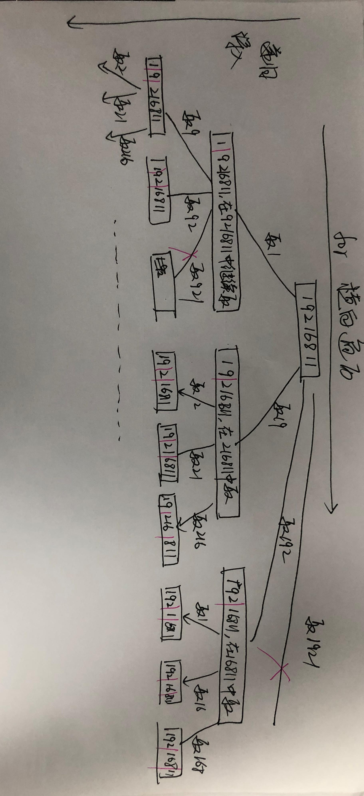
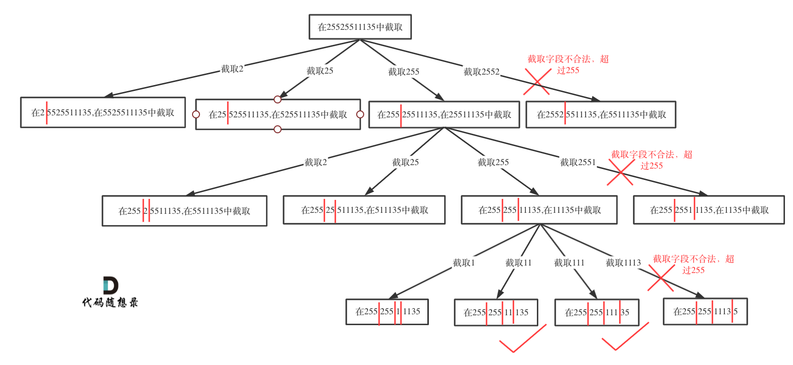

# cpp_algorithms

* 代码随想录 https://programmercarl.com/

* geeksforgeeks https://www.geeksforgeeks.org

--------------------------------------------------------------------------------
> **大家不必太在意leetcode上执行用时，打败多少多少用户，这个就是一个玩具，非常不准确。**
> 
> 做题的时候自己能分析出来时间复杂度就可以了，至于leetcode上执行用时，大概看一下就行，只要达到最优的时间复杂度就可以了，
> 
> 一样的代码多提交几次可能就击败百分之百了....
--------------------------------------------------------------------------------

# 回溯算法

https://www.geeksforgeeks.org/backtracking-algorithms/

--------------------------------------------------------------------------------

## 复原 IP 地址

## _8_restore_ip_addresses.md

--------------------------------------------------------------------------------

### 93. 复原 IP 地址

> 
> Leetcode链接: https://leetcode.cn/problems/restore-ip-addresses/
>
> **有效 `IP` 地址** 正好由四个整数（每个整数位于 `0` 到 `255` 之间组成，且不能含有前导 `0`），整数之间用 `'.'` 分隔。
> 
> > 例如：`"0.1.2.201"` 和 `"192.168.1.1"` 是 `有效 IP 地址`，但是 `"0.011.255.245"`、`"192.168.1.312"` 和 `"192.168@1.1"` 是 `无效 IP 地址`。
> 
> 给定一个只包含数字的字符串 `s` ，用以表示一个 `IP` 地址，返回所有可能的有效 `IP` 地址，这些地址可以通过在 `s` 中插入 `'.'` 来形成。你 **不能** 重新排序或删除 `s` 中的任何数字。你可以按 **任何** 顺序返回答案。
> 
> 
> **示例1：**
> 
> ```html
> 输入：s = "25525511135"
> 输出：["255.255.11.135","255.255.111.35"]
> ```
> 
> **示例2：**
> 
> ```html
> 输入：s = "0000"
> 输出：["0.0.0.0"]
> ```
> 
> **示例3：**
> 
> ```html
> 输入：s = "101023"
> 输出：["1.0.10.23","1.0.102.3","10.1.0.23","10.10.2.3","101.0.2.3"]
> ```
> 
> **提示：**
> * `1 <= s.length <= 16`
> * `s` 仅由小写英文字母组成
>
> ```c++
> class Solution {
> public:
>     vector<vector<string>> partition(string s) {
> 
>     }
> };
> ```
> 
> 
> 


#### 我的思路及代码


> <font color="yellow">
> 
> 为何会想到用到回溯法（递归）？
>
> 因为这是`切割`问题，常用回溯法？ 
> 
> </font>
>
> <font color="pink">切割问题 可以抽象为 组合问题</font>
> 
> <font color="gree">
> 
> 回溯法，一般可以解决如下几种问题：
>
> * 组合问题：`N`个数里面按一定规则找出`k`个数的集合
> * 切割问题：一个字符串按一定规则有几种切割方式
> * 子集问题：一个`N`个数的集合里有多少符合条件的子集
> * 排列问题：`N`个数按一定规则全排列，有几种排列方式
> * 棋盘问题：`N`皇后，解数独等等
>
> </font>
>
> 


>
> <font color="yellow">思路</font>
>
> <font color="pink">
> 
> 不能重新排序、也不能删除，只能是通过插入 `'.'`的方法，来切割字符串（只含有数字）
>
> 然后判断是否正确
>
> 先简化：
>
> 1. 先不管任何限制，写出来`单纯切割`, 然后放入`vector<string> path`, 
>
> 2. 在单纯切割的代码基础上，加以`判断`，`不能有前导0`，`不能超过255`
>
> 3. 最终`path`进行处理，之前加上`"."`，然后放入`vector<string>`
>
> > 
> > 如何把`string`类型判断`int`数值？`int stoi(string&)`函数可以将内容解释为整形数值. 然后判断大小
> 
> 
> </font>
> 
> 
> <div align=center>
> 
> </div>
>


```c++
class Solution {
private:
    vector<string> result;
    vector<string> path;
    

    // 返回值和参数：原始字符串s，下一层的子串的起始索引startIndex
    // 停止条件：path.size() == 4 && startIndex = s.size(), 当前已经分割为4个了，且已经分完了
    // 遍历过程：横向遍历string[startIndex]、string[startIndex, startIndex + 1]、string[startIndex, startIndex + 2]三种情况，长度不能超过3
    void recursion(string& s, int startIndex) {
        //已经分割出了4部分，但是没分完了，不允许
        if(path.size() == 4 && startIndex < s.size()) return; 
        //已经分割出了4部分，且分完了
        if(path.size() == 4 && startIndex == s.size()) { 
            string str;
            for(int i=0; i <= 2; i++) {
                str += path[i];
                str += ".";
            }
            str += path[3]; 
            result.push_back(str); // 存储
            return;            // 返回
        }
        
        // 先判断第一个是否为0, 若为0，只能将0单独作为一部分
        if(s[startIndex] == '0') {
            string substr = "0";
            path.push_back(substr);  // 处理节点
            recursion(s, startIndex + 1); // 深入递归
            path.pop_back(); // 回溯
        }
        // 剩下的就是无前导0的情况，即1~255之间
        else {
            // 子串长度最多为3，再多肯定超过255；所以子串的末尾索引 <= 子串的起始索引 + 2
            for(int endIndex = startIndex; endIndex <= startIndex + 2 && endIndex < s.size(); endIndex++) {  
                string substr;
                for(int i = startIndex; i <= endIndex; i++) {
                    substr += s[i];
                }
                
                if(stoi(substr) > 255) break; // 如果数值> 255，则抛弃这个选项，而且后面再延长长度，更不可能了

                path.push_back(substr); // 处理节点
                recursion(s, endIndex + 1); // 深入递归
                path.pop_back(); // 回溯
            }

        }

    }


public:
    vector<string> restoreIpAddresses(string s) {
        if(!result.empty()) result.clear();
        if(!result.empty()) result.clear();  
        if(s.size() == 0) return result;     
        recursion(s, 0);
        return result;
    }
};
```


#### 代码随想录


##### 思路

>
> 做这道题目之前，最好先把131.分割回文串 (`_7_palindrome_partitioning.md`)这个做了。
>
> 这道题目相信大家刚看的时候，应该会一脸茫然。
>
> 其实只要意识到这是切割问题，切割问题就可以使用回溯搜索法把所有可能性搜出来，和刚做过的131.分割回文串 (`_7_palindrome_partitioning.md`)就十分类似了。
>
> 切割问题可以抽象为树型结构，如图：
>
> 
> <div align=center>
> 
> </div>
>
> 
> 


##### 回溯三部曲

>
> * 递归参数
> 
> 在131.分割回文串 (`_7_palindrome_partitioning.md`)中我们就提到切割问题类似组合问题。
>
> `startIndex`一定是需要的，因为不能重复分割，记录下一层递归分割的起始位置。
>
> 本题我们还需要一个变量`pointNum`，记录添加逗点的数量。
>
> 所以代码如下：
>
> ```c++
> vector<string> result;// 记录结果
> // startIndex: 搜索的起始位置，pointNum:添加逗点的数量
> void backtracking(string& s, int startIndex, int pointNum) {
> ```
> 
> * 递归终止条件
>
> 终止条件和131.分割回文串 (`_7_palindrome_partitioning.md`)情况就不同了，本题明确要求只会分成4段，所以不能用切割线切到最后作为终止条件，而是分割的段数作为终止条件。
>
> `pointNum`表示逗点数量，`pointNum`为3说明字符串分成了4段了。
>
> 然后验证一下第四段是否合法，如果合法就加入到结果集里
>
> 代码如下：
>
> ```c++
> if (pointNum == 3) { // 逗点数量为3时，分隔结束
>     // 判断第四段子字符串是否合法，如果合法就放进result中
>     if (isValid(s, startIndex, s.size() - 1)) {
>         result.push_back(s);
>     }
>     return;
> }
> ```
> 
> * 单层搜索的逻辑
>
> 在131.分割回文串(`_7_palindrome_partitioning.md`)中已经讲过在循环遍历中如何截取子串。
>
> 在`for (int i = startIndex; i < s.size(); i++)`循环中 `[startIndex, i]` 这个区间就是截取的子串，需要判断这个子串是否合法。
>
> 如果合法就在字符串后面加上符号`"."`表示已经分割。
>
> 如果不合法就结束本层循环，如图中剪掉的分支：
> 
> <div align=center>
> 
> </div>
>
> 然后就是递归和回溯的过程：
> 
> 递归调用时，下一层递归的`startIndex`要从i+2开始（因为需要在字符串中加入了分隔符`.`），同时记录分割符的数量`pointNum` 要 `+1`。
>
> 代码如下：
>
> ```c++
> for (int i = startIndex; i < s.size(); i++) {
>     if (isValid(s, startIndex, i)) { // 判断 [startIndex,i] 这个区间的子串是否合法
>         s.insert(s.begin() + i + 1 , '.');  // 在i的后面插入一个逗点
>         pointNum++;
>         backtracking(s, i + 2, pointNum);   // 插入逗点之后下一个子串的起始位置为i+2
>         pointNum--;                         // 回溯
>         s.erase(s.begin() + i + 1);         // 回溯删掉逗点
>     } else break; // 不合法，直接结束本层循环
> }
> ```
> 
> 
> 
> 


##### 判断子串是否合法

>
> 最后就是在写一个判断段位是否是有效段位了。
> 
> 主要考虑到如下三点：
>
> ```c++
> 段位以0为开头的数字不合法
> 段位里有非正整数字符不合法
> 段位如果大于255了不合法
> ```
> 
> 
> 代码如下：
>
> ```c++
> // 判断字符串s在左闭又闭区间[start, end]所组成的数字是否合法
> bool isValid(const string& s, int start, int end) {
>     if (start > end) {
>         return false;
>     }
>     if (s[start] == '0' && start != end) { // 0开头的数字不合法
>             return false;
>     }
>     int num = 0;
>     for (int i = start; i <= end; i++) {
>         if (s[i] > '9' || s[i] < '0') { // 遇到非数字字符不合法
>             return false;
>         }
>         num = num * 10 + (s[i] - '0');
>         if (num > 255) { // 如果大于255了不合法
>             return false;
>         }
>     }
>     return true;
> }
> ```
> 
> 
> 
> 


##### C++代码

> 
> 
> 根据关于回溯算法，你该了解这些！ (`backtracking_algorithms.md`)给出的回溯算法模板：
>
> ```c++
> void backtracking(参数) {
>     if (终止条件) {
>         存放结果;
>         return;
>     }
> 
>     for (选择：本层集合中元素（树中节点孩子的数量就是集合的大小）) {
>         处理节点;
>         backtracking(路径，选择列表); // 递归
>         回溯，撤销处理结果
>     }
> }
> ```
> 
> 可以写出如下回溯算法C++代码：
>
```c++
class Solution {
private:
    vector<string> result;// 记录结果
    // startIndex: 搜索的起始位置，pointNum:添加逗点的数量
    void backtracking(string& s, int startIndex, int pointNum) {
        if (pointNum == 3) { // 逗点数量为3时，分隔结束
            // 判断第四段子字符串是否合法，如果合法就放进result中
            if (isValid(s, startIndex, s.size() - 1)) {
                result.push_back(s);
            }
            return;
        }
        for (int i = startIndex; i < s.size(); i++) {
            if (isValid(s, startIndex, i)) { // 判断 [startIndex,i] 这个区间的子串是否合法
                s.insert(s.begin() + i + 1 , '.');  // 在i的后面插入一个逗点
                pointNum++;
                backtracking(s, i + 2, pointNum);   // 插入逗点之后下一个子串的起始位置为i+2
                pointNum--;                         // 回溯
                s.erase(s.begin() + i + 1);         // 回溯删掉逗点
            } else break; // 不合法，直接结束本层循环
        }
    }
    // 判断字符串s在左闭又闭区间[start, end]所组成的数字是否合法
    bool isValid(const string& s, int start, int end) {
        if (start > end) {
            return false;
        }
        if (s[start] == '0' && start != end) { // 0开头的数字不合法
                return false;
        }
        int num = 0;
        for (int i = start; i <= end; i++) {
            if (s[i] > '9' || s[i] < '0') { // 遇到非数字字符不合法
                return false;
            }
            num = num * 10 + (s[i] - '0');
            if (num > 255) { // 如果大于255了不合法
                return false;
            }
        }
        return true;
    }
public:
    vector<string> restoreIpAddresses(string s) {
        result.clear();
        if (s.size() < 4 || s.size() > 12) return result; // 算是剪枝了
        backtracking(s, 0, 0);
        return result;
    }
};

```

>
> * 时间复杂度: `O(3^4)`，IP地址最多包含`4`个数字，每个数字最多有`3`种可能的分割方式，则搜索树的最大深度为`4`，每个节点最多有`3`个子节点。
>
> * 空间复杂度: `O(n)`
>
> 
> 
> 

#### 总结

>
> 在131.分割回文串 (`_7_palindrome_partitioning.md`)中我列举的分割字符串的难点，本题都覆盖了。
>
> 而且本题还需要操作字符串添加逗号作为分隔符，并验证区间的合法性。
>
> 可以说是131.分割回文串(`_7_palindrome_partitioning.md`)的加强版。
>
> 在本文的树形结构图中，我已经把详细的分析思路都画了出来，相信大家看了之后一定会思路清晰不少！
> 


