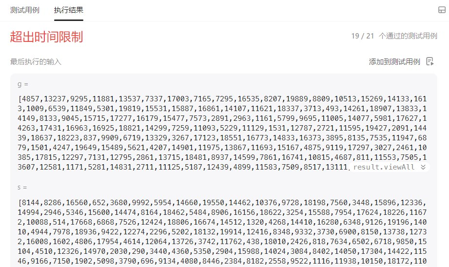
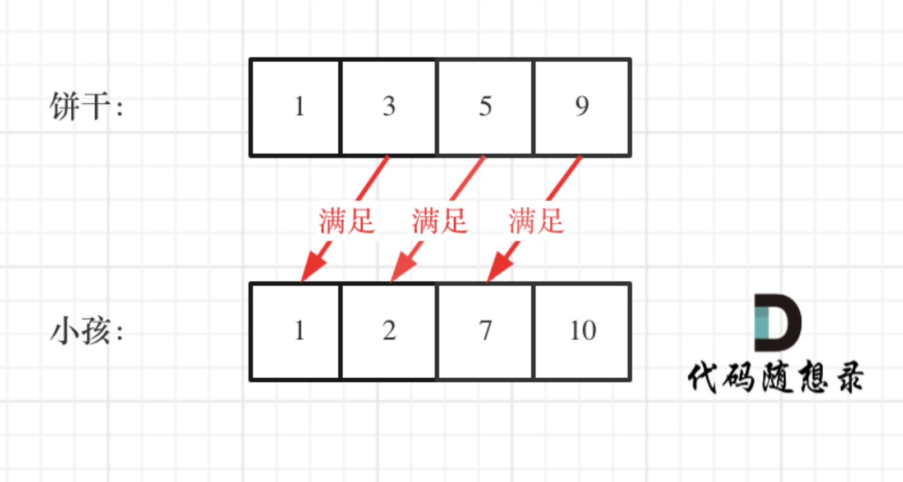

# cpp_algorithms

* 代码随想录 https://programmercarl.com/

* geeksforgeeks https://www.geeksforgeeks.org

--------------------------------------------------------------------------------
> **大家不必太在意leetcode上执行用时，打败多少多少用户，这个就是一个玩具，非常不准确。**
> 
> 做题的时候自己能分析出来时间复杂度就可以了，至于leetcode上执行用时，大概看一下就行，只要达到最优的时间复杂度就可以了，
> 
> 一样的代码多提交几次可能就击败百分之百了....
--------------------------------------------------------------------------------

# 贪心算法

https://www.geeksforgeeks.org/greedy-algorithms/

--------------------------------------------------------------------------------

## 分发饼干

## _1_assign_cookies.md

--------------------------------------------------------------------------------

### 455. 分发饼干

> 
> Leetcode链接: https://leetcode.cn/problems/assign-cookies/
> 
> 假设你是一位很棒的家长，想要给你的孩子们一些小饼干。但是，每个孩子最多只能给一块饼干。
>
> 对每个孩子 `i`，都有一个胃口值 `g[i]`，这是能让孩子们满足胃口的饼干的最小尺寸；并且每块饼干 `j`，都有一个尺寸 `s[j]` 。如果 `s[j] >= g[i]`，我们可以将这个饼干 `j` 分配给孩子 `i` ，这个孩子会得到满足。你的目标是尽可能满足越多数量的孩子，并输出这个最大数值。
>
> 
> **示例1：**
> 
> ```html
> 输入: g = [1,2,3], s = [1,1]
> 输出: 1
> 解释: 
> 你有三个孩子和两块小饼干，3个孩子的胃口值分别是：1,2,3。
> 虽然你有两块小饼干，由于他们的尺寸都是1，你只能让胃口值是1的孩子满足。
> 所以你应该输出1。
> ```
> 
> **示例2：**
> 
> ```html
> 输入: g = [1,2], s = [1,2,3]
> 输出: 2
> 解释: 
> 你有两个孩子和三块小饼干，2个孩子的胃口值分别是1,2。
> 你拥有的饼干数量和尺寸都足以让所有孩子满足。
> 所以你应该输出2.
> ```
>
> **提示：**
> * `1 <= g.length <= 3 * 10^4`
> * `0 <= s.length <= 3 * 10^4`
> * `1 <= g[i], s[j] <= 2^31 - 1`
>
>
> ```c++
> class Solution {
> public:
>     int findContentChildren(vector<int>& g, vector<int>& s) {
> 
>     }
> };
> ```
> 


#### 我的解法

>
> 对于每个孩子，根据胃口值从小到大排序 `vector<int> g;`
>
> 对于每块饼干，根据尺寸从小到大排序 `vector<int> s;`
> 
> 外循环遍历饼干，内循环遍历孩子
>
> 每次饼干能满足一个孩子的胃口，则将结果值++，然后退出内循环，分发下一块饼干
>
> 但是我们需要添加一个标记，记录上一块饼干分给了哪个孩子`index`，这样下一次的内循环从下一个孩子`index+1`开始
>
> ```c++
> class Solution {
> public:
>     int findContentChildren(vector<int>& g, vector<int>& s) {
>         // 冒泡排序
>         // 对于每块饼干，根据尺寸从小到大排序
>         for(int i=0; i < s.size(); i++) {
>             for(int j=0; j < s.size() - i - 1; j++) {
>                 if(s[j] > s[j+1]) swap(s[j], s[j+1]);
>             }
>         }
>         // 对于每个孩子，根据胃口值从小到大排序
>         for(int i=0; i < g.size(); i++) {
>             for(int j=0; j < g.size() - i - 1; j++) {
>                 if(g[j] > g[j+1]) swap(g[j], g[j+1]);
>             }
>         }        
>         
>         int result = 0;
>         // 标记上一次成功分配的孩子是哪一个
>         int index = -1; 
>         // 从最小的饼干开始
>         for(int i=0; i < s.size(); i++) {
>             // 对于当前饼干，从上次一成功分配的孩子的下一个开始遍历
>             for(int j = index + 1; j < g.size(); j++) {
>                 // 如果满足胃口值，则result+1， 停止内循环，准备分发下一块饼干
>                 if(s[i] >= g[j]) {
>                     result++;
>                     index = j;
>                     break; 
>                 }
>             }
>         }
> 
>         return result;
>     }
> };
> ```
>
> 只通过了`19/21`个测试用例
> 
> <div align=center>
> 
> </div>
> 
> 我们试一试直接用`sort`排序
>
> ```c++
> class Solution {
> public:
>     int findContentChildren(vector<int>& g, vector<int>& s) {
>         // 冒泡排序
>         // 对于每块饼干，根据尺寸从小到大排序
>         sort(s.begin(), s.end()) ;
>         // 对于每个孩子，根据胃口值从小到大排序
>         sort(g.begin(), g.end()) ;       
>         
>         int result = 0;
>         // 标记上一次成功分配的孩子是哪一个
>         int index = -1; 
>         // 从最小的饼干开始
>         for(int i=0; i < s.size(); i++) {
>             // 对于当前饼干，从上次一成功分配的孩子的下一个开始遍历
>             for(int j = index + 1; j < g.size(); j++) {
>                 // 如果满足胃口值，则result+1， 停止内循环，准备分发下一块饼干
>                 if(s[i] >= g[j]) {
>                     result++;
>                     index = j;
>                     break; 
>                 }
>             }
>         }
> 
>         return result;
>     }
> };
> ```
>
> **通过了，这说明冒泡排序的时间复杂度过高**
> 
> 

>
> **优化代码**
>
> 可以不用两个`for`循环
>
> 对于每个孩子，根据胃口值从小到大排序 `vector<int> g;`
>
> 对于每块饼干，根据尺寸从小到大排序 `vector<int> s;`
>
> 设置`result = 0;`
>
> 设置待分配的孩子标记`index = 0`从第一个孩子开始， 只有当分配成功时，`index`才能`++`
>
> 循环遍历饼干，
>
> 如果当前饼干可以满足胃口，则`result++;`, 且换成下一个孩子待分配`index++`
>
> ```c++
> class Solution {
> public:
>     int findContentChildren(vector<int>& g, vector<int>& s) {
>         // 冒泡排序
>         // 对于每块饼干，根据尺寸从小到大排序
>         sort(s.begin(), s.end()) ;
>         // 对于每个孩子，根据胃口值从小到大排序
>         sort(g.begin(), g.end()) ; 
>         
>         int result = 0;
>         // 标记待分配的孩子
>         int index = 0; 
>         // 从最小的饼干开始
>         for(int i=0; i < s.size(); i++) {
>             // 对于当前饼干，是否能待分配的孩子
>             if(index < g.size() && s[i] >= g[index]){ 
>                 result++;
>                 index++;
>             }
>             // 如果当前饼干，无法满足待分配中胃口最小的孩子，换下一个更大的饼干
>         }
> 
>         return result;
>     }
> };
> ```
>
> 可以看到`result`和`index`是同步的，所以可以不用`result`，最后返回`return index`就可以
>
> 


>
> <font color="gree">
> 
> 贪心算法一般分为如下四步：
>
> * 将问题分解为若干个子问题
> * 找出适合的贪心策略
> * 求解每一个子问题的最优解
> * 将局部最优解堆叠成全局最优解
>
> </font>
>
> **那么我们这里是如何分解成这四步的呢？**
>
> * 如何分解成子问题的？子问题是什么？
>
> * 贪心策略是什么？
>
> * 每一个子问题的最优解是什么？ **局部最优就是小饼干优先喂给胃口小的，充分利用饼干尺寸喂饱一个**
>
> * 局部最优解能得到全局最优解？？？这个只需要我们感觉可以就行，不用证明
>
> 


>
> **如果是大饼干优先喂给胃口大的呢？**
>
> 对于每个孩子，根据胃口值从小到大排序 `vector<int> g;`
>
> 对于每块饼干，根据尺寸从小到大排序 `vector<int> s;`
>
> 设置`result = 0;`
>
> 设置待分配的饼干标记`index = s.size() - 1`从最大饼干开始， 只有当分配成功时，`index`才能`--`
>
> 循环遍历饼干，
>
> 如果当前饼干可以满足胃口，则`result++;`, 且换成下一个饼干待分配`index--`
> 
> ```c++
> class Solution {
> public:
>     int findContentChildren(vector<int>& g, vector<int>& s) {
>         // 冒泡排序
>         // 对于每块饼干，根据尺寸从小到大排序
>         sort(s.begin(), s.end()) ;
>         // 对于每个孩子，根据胃口值从小到大排序
>         sort(g.begin(), g.end()) ; 
>         
>         int result = 0;
>         // 标记待分配的饼干
>         int index = s.size() - 1;  
>         // 从胃口最大的孩子开始
>         for(int i = g.size() - 1; i < g.size(); i--) {
>             // 对于当前饼干，是否能待分配的孩子
>             if(index >= 0 && s[index] >= g[i]){ 
>                 result++;
>                 index--; 
>             }
>             // 如果剩下饼干中最大的，都无法满足当前的孩子，换下一个胃口更小的孩子
>         }
> 
>         return result;
>     }
> };
> ```
> 
> 


#### 代码随想录


>
> 为了满足更多的小孩，就不要造成饼干尺寸的浪费。
>
> 大尺寸的饼干既可以满足胃口大的孩子也可以满足胃口小的孩子，那么就应该优先满足胃口大的。
> 
> **这里的局部最优就是大饼干喂给胃口大的，充分利用饼干尺寸喂饱一个，全局最优就是喂饱尽可能多的小孩。**
>
> 可以尝试使用贪心策略，先将饼干数组和小孩数组排序。
> 
> 然后从后向前遍历小孩数组，用大饼干优先满足胃口大的，并统计满足小孩数量。
>
> 如图：
> 
> <div align=center>
> 
> </div>
> 
> 这个例子可以看出饼干 9 只有喂给胃口为 7 的小孩，这样才是整体最优解，并想不出反例，那么就可以撸代码了。
>
> C++代码整体如下：
>
> ```c++
> // 版本一
> class Solution {
> public:
>     int findContentChildren(vector<int>& g, vector<int>& s) {
>         sort(g.begin(), g.end());
>         sort(s.begin(), s.end());
>         int index = s.size() - 1; // 饼干数组的下标
>         int result = 0;
>         for (int i = g.size() - 1; i >= 0; i--) { // 遍历胃口
>             if (index >= 0 && s[index] >= g[i]) { // 遍历饼干
>                 result++;
>                 index--;
>             }
>         }
>         return result;
>     }
> };
> ```
> 
> * 时间复杂度：`O(nlogn)`
> * 空间复杂度：`O(1)`
> 
> <font color="gree">
> 
> 从代码中可以看出我用了一个 `index` 来控制饼干数组的遍历，遍历饼干并没有再起一个 `for` 循环，而是采用自减的方式，这也是常用的技巧。
>
> 有的同学看到要遍历两个数组，就想到用两个 `for` 循环，那样逻辑其实就复杂了。
>
> </font>
>
> 

##### 注意事项

> 
> 注意版本一的代码中，可以看出来，是先遍历的胃口，在遍历的饼干，那么可不可以 先遍历 饼干，在遍历胃口呢？
> 
> 其实是不可以的。
> 
> 外面的 `for` 是里的下标 `i` 是固定移动的，而 `if` 里面的下标 `index` 是符合条件才移动的。
> 
> 如果 `for` 控制的是饼干， `if` 控制胃口，就是出现如下情况 ：
> 
> <div align=center>
> 
> </div>
> 
> `if` 里的 `index` 指向 胃口 `10`， `for` 里的 `i` 指向饼干 `9`，因为 饼干 `9` 满足不了 胃口 `10`，所以 `i` 持续向前移动，而 `index` 走不到`s[index] >= g[i]` 的逻辑，所以 `index` 不会移动，那么当 `i` 持续向前移动，最后所有的饼干都匹配不上。
>
> 所以 一定要 `for` 控制 胃口，里面的 `if` 控制饼干。
>
> 
> 

##### 其他思路

>
> **也可以换一个思路，小饼干先喂饱小胃口**
>
> 代码如下：
>
> ```c++
> class Solution {
> public:
>     int findContentChildren(vector<int>& g, vector<int>& s) {
>         sort(g.begin(),g.end());
>         sort(s.begin(),s.end());
>         int index = 0;
>         for(int i = 0; i < s.size(); i++) { // 饼干
>             if(index < g.size() && g[index] <= s[i]){ // 胃口
>                 index++;
>             }
>         }
>         return index;
>     }
> };
> ```
> 
> 时间复杂度：`O(nlogn)`
> 空间复杂度：`O(1)`
>
> 细心的录友可以发现，**这种写法，两个循环的顺序改变了，先遍历的饼干，在遍历的胃口，这是因为遍历顺序变了，我们是从小到大遍历**。
>
> 理由在上面 “注意事项”中 已经讲过。
>
> 


##### 总结

> 
> 这道题是贪心很好的一道入门题目，思路还是比较容易想到的。
>
> 文中详细介绍了思考的过程，**想清楚局部最优，想清楚全局最优，感觉局部最优是可以推出全局最优，并想不出反例，那么就试一试贪心。**
>
> 


