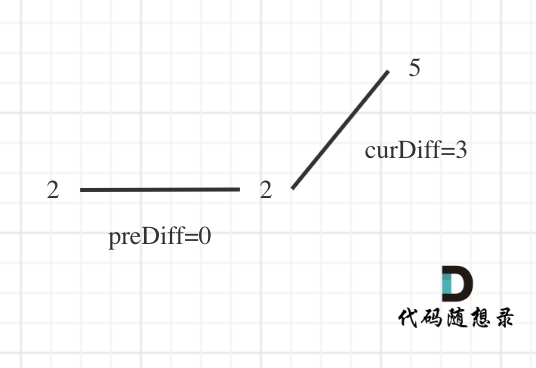

# cpp_algorithms

* 代码随想录 https://programmercarl.com/

* geeksforgeeks https://www.geeksforgeeks.org

--------------------------------------------------------------------------------
> **大家不必太在意leetcode上执行用时，打败多少多少用户，这个就是一个玩具，非常不准确。**
> 
> 做题的时候自己能分析出来时间复杂度就可以了，至于leetcode上执行用时，大概看一下就行，只要达到最优的时间复杂度就可以了，
> 
> 一样的代码多提交几次可能就击败百分之百了....
--------------------------------------------------------------------------------

# 贪心算法

https://www.geeksforgeeks.org/greedy-algorithms/

--------------------------------------------------------------------------------

## 摆动序列

## _2_wiggle_subsequence.md

--------------------------------------------------------------------------------

### 376. 摆动序列

> 
> Leetcode链接: https://leetcode.cn/problems/wiggle-subsequence/
>
> 如果连续数字之间的差严格地在正数和负数之间交替，则数字序列称为 **摆动序列** 。第一个差（如果存在的话）可能是正数或负数。仅有一个元素或者含两个不等元素的序列也视作摆动序列。
> 
> * 例如， `[1, 7, 4, 9, 2, 5]` 是一个 摆动序列 ，因为差值` (6, -3, 5, -7, 3) `是正负交替出现的。
>
> * 相反，`[1, 4, 7, 2, 5]` 和 `[1, 7, 4, 5, 5]` 不是摆动序列，第一个序列是因为它的前两个差值都是正数，第二个序列是因为它的最后一个差值为零。
>
> <font color="yellow">**子序列** 可以通过从原始序列中删除一些（也可以不删除）元素来获得，剩下的元素保持其原始顺序。</font>
>
> 给你一个整数数组 `nums` ，返回 `nums` 中作为 **摆动序列** 的 **最长子序列的长度** 。
> 
> 
> **示例1：**
> 
> ```html
> 输入：nums = [1,7,4,9,2,5]
> 输出：6
> 解释：整个序列均为摆动序列，各元素之间的差值为 (6, -3, 5, -7, 3) 。
> ```
> 
> **示例2：**
> 
> ```html
> 输入：nums = [1,17,5,10,13,15,10,5,16,8]
> 输出：7
> 解释：这个序列包含几个长度为 7 摆动序列。
> 其中一个是 [1, 17, 10, 13, 10, 16, 8] ，各元素之间的差值为 (16, -7, 3, -3, 6, -8) 。
> ```
> 
> **示例3：**
> 
> ```html
> 输入：nums = [1,2,3,4,5,6,7,8,9]
> 输出：2
> ```
>
>
> **提示：**
> * `1 <= nums.length <= 1000`
> * `0 <= nums[i] <= 1000`
>
>
> ```c++
> class Solution {
> public:
>     int wiggleMaxLength(vector<int>& nums) {
> 
>     }
> };
> ```
>
> 


#### 我的思路 一般就是这三种方法，挨个试试

##### 回溯法 暴力枚举，时间复杂度太高

> 
> 正确理解摆动序列：从第一个元素开始，先大后小地变化，或者先小后大地变化，总之不能出现连续连续数字都是变大，不能出现连续两个数字变小，不能出现数字不变化（差值`0`）
>
> <font color="yellow">考虑是否使用回溯法，递归搜索？</font>
>
>
> <font color="gree">
> 
> 回溯法三步：
>
> 1. 递归函数的返回值以及参数
> 2. 回溯函数终止条件
> 3. 单层搜索的过程
>
> </font>
>
>
> **回溯法三部曲**
> 
> > **1. 递归函数的返回值以及参数**
> > 
> > ```c++
> > // nums: 原始数组序列
> > // indexset: 满足摆动的nums索引值的集合
> > // nextindex: 下一个需要检查的元素的索引值
> > // bigger: bigger和smaller指的是下一个元素需要更小还是更大
> > // smaller：bigger和smaller必须有一个为false，一个为true
> > // result：满足摆动要求的子序列长度
> > void recursion(vector<int>& nums, vector<int>& indexset, int nextindex, bool bigger，bool smaller，int result){}
> > ```
> > 
> > 这个参数列表只是最开始定下的，后续可以根据代码实现的需要，进行修改
> > 
> 
> > **2. 回溯函数终止条件**
> > 
> > 到数组结尾停止，更新
> >
> > ```c++
> > // 递归停止
> > if(index >= nums.size()) {
> >     // 满足要求的子序列，如果比上一个更长，则更新result
> >     if(indexset.size() > result) result = indexset.size(); 
> >     return;
> > }
> > ```
> > 
> 
> > **3. 单层搜索的过程**
> > 
> > 比较啰嗦，直接看代码吧
> > 
> 
> ```c++
> class Solution {
> private:
>     // nums: 原始数组序列
>     // subseq: 满足摆动的nums索引值的集合
>     // result：满足摆动要求的最长子序列的长度    
>     // nextindex: 下一个需要检查的元素的索引值
>     // bigger: bigger和smaller指的是下一个元素需要更小还是更大
>     // smaller：bigger和smaller必须有一个为false，一个为true
>     void recursion(vector<int>& nums, vector<int>& subseq, int& result, int nextindex, bool bigger, bool smaller) {
>         // nextindex超出原始数组长度，递归停止
>         if(nextindex >= nums.size()) {
>             // 满足要求的子序列，如果比上一个更长，则更新result
>             if(subseq.size() > result) result = subseq.size(); 
>             return;
>         }        
>         
>         for(int next = nextindex; next < nums.size(); next++) {
>             // 如果当前子序列为空，则直接将索引对应的值加入subseq就行
>             if(subseq.size() == 0) {
>                 subseq.push_back(nums[next]);
>                 recursion(nums, subseq, result, next + 1, false, false);
>                 subseq.pop_back(); // 回溯
>             } 
>             // 如果当前子序列只有一个元素，
>             else if(subseq.size() == 1) {
>                 // 如果当前子序列的唯一元素和next指向的值相同，不考虑，检查下一个
>                 if(subseq[0] == nums[next]) {
>                     continue;
>                 }
>                 // 如果当前子序列的唯一元素 小于 next指向的值相同，开始递归
>                 else if(subseq[0] < nums[next]) {
>                     subseq.push_back(nums[next]);
>                     recursion(nums, subseq, result, next + 1, false, true); // 第三个要变小
>                     subseq.pop_back(); // 回溯
>                 }
>                 // 如果当前子序列的唯一元素 大于 next指向的值相同，开始递归
>                 // (subseq[0] > nums[next])
>                 else {
>                     subseq.push_back(nums[next]);
>                     recursion(nums, subseq, result, next + 1, true, false); // 第三个要变大
>                     subseq.pop_back(); // 回溯
>                 }
>             }
>             // 如果当前子序列有两个及以上的元素时，开始判断
>             else {
>                 // 如果是需要变大
>                 if(bigger && !smaller) {
>                     // 如果next指向的元素满足要求，大于当前子序列的最后一个元素，更新子序列索引集
>                     if(nums[next] > subseq[subseq.size()-1]) {
>                         subseq.push_back(nums[next]); 
>                         recursion(nums, subseq, result, next + 1, false, true); 
>                         subseq.pop_back(); // 回溯
>                     }
>                     // 如果不是，则检查下一个
>                     else {
>                         continue;
>                     }
>                 }
>                 // 如果是需要变小
>                 else if(!bigger && smaller) {
>                     // 如果next指向的元素满足要求，大于当前子序列的最后一个元素，更新子序列索引集
>                     if(nums[next] < subseq[subseq.size()-1]) {
>                         subseq.push_back(nums[next]); 
>                         recursion(nums, subseq, result, next + 1, true, false); 
>                         subseq.pop_back(); // 回溯
>                     }
>                     // 如果不是，则检查下一个
>                     else {
>                         continue;
>                     }
>                 } 
>                 else {break;}
>             }
>         } // for(int next = nextindex; i <= nums.size(); next++)
>     } // void recursion
> 
> public:
>     int wiggleMaxLength(vector<int>& nums) {
>         if(nums.size() < 2) return nums.size();
>         if(nums.size() == 2) {
>             if(nums[0] == nums[1]) return 1;
>             if(nums[0] != nums[1]) return 2;
>         }
> 
>         vector<int> subseq;
>         int result = 0;
>         int nextindex = 0;
>         recursion(nums, subseq, result, nextindex, false, false); 
>         return result;
>     }
> };
> ```
> 
> **超出时间限制**
>
> **实际测试一下试试:**
>
> **先用简单的数组（用第8个例子的话，要运行很久）**
> 
> ```c++
> #include <iostream>
> #include <vector>
> using namespace std;
> 
> void recursion(vector<int>& nums, vector<int>& subseq, int& result, int nextindex, bool bigger, bool smaller) {
>     // 显示当前子序列
>     for(int i=0; i < subseq.size(); i++) {
>         cout << subseq[i] << ", ";
>     }
>     cout << endl;    
>     ...
> }
> 
> int main()
> {
>     // vector<int> nums = {33,53,12,64,50,41,45,21,97,35,47,92,39,0,93,55
>     //                     ,40,46,69,42,6,95,51,68,72,9,32,84,34,64,6,2,26
>     //                     ,98,3,43,30,60,3,68,82,9,97,19,27,98,99,4,30,96
>     //                     ,37,9,78,43,64,4,65,30,84,90,87,64,18,50,60,1,40
>     //                     ,32,48,50,76,100,57,29,63,53,46,57,93,98,42,80,82
>     //                     ,9,41,55,69,84,82,79,30,79,18,97,67,23,52,38,74,15};
> 
>     vector<int> nums = {1,7,4,9,2,5};
> 
>     vector<int> subseq;
>     int result = 0;
>     int nextindex = 0;
>     recursion(nums, subseq, result, nextindex, false, false); 
> 
>     cout << "------------------------------------" << endl;
>     cout << "result = " << result << endl;
>     cout << "------------------------------------" << endl;
> 
>     cout << endl;
>     pause(); // system("pause"); 
>     return 0;
> }
> ```
>
> **运行结果如下**
>
> ```c++ {.line-numbers}
> 1, 
> 1, 7, 
> 1, 7, 4, 
> 1, 7, 4, 9, 
> 1, 7, 4, 9, 2, 
> 1, 7, 4, 9, 2, 5, 
> 1, 7, 4, 9, 5, 
> 1, 7, 4, 5, 
> 1, 7, 2, 
> 1, 7, 2, 5, 
> 1, 7, 5, 
> 1, 4, 
> 1, 4, 2, 
> 1, 4, 2, 5, 
> 1, 9, 
> 1, 9, 2, 
> 1, 9, 2, 5, 
> 1, 9, 5, 
> 1, 2, 
> 1, 5, 
> 7, 
> 7, 4, 
> 7, 4, 9, 
> 7, 4, 9, 2, 
> 7, 4, 9, 2, 5, 
> 7, 4, 9, 5, 
> 7, 4, 5, 
> 7, 9, 
> 7, 9, 2, 
> 7, 9, 2, 5, 
> 7, 9, 5, 
> 7, 2, 
> 7, 2, 5, 
> 7, 5, 
> 4, 
> 4, 9, 
> 4, 9, 2, 
> 4, 9, 2, 5, 
> 4, 9, 5, 
> 4, 2, 
> 4, 2, 5, 
> 4, 5, 
> 9, 
> 9, 2, 
> 9, 2, 5, 
> 9, 5, 
> 2, 
> 2, 5, 
> 5, 
> ------------------------------------
> result = 6
> ------------------------------------
> ```
> 
> **可以看到，有很多重复的部分**
>
> <font color="gree">
> 
> 分析如下：
>
> * 如果`nums[i] < nums[j] > nums[k], i < j < k`
> > 例如：
> > `1 < 7 > 4`，只要完成了`1`开头的遍历，就没必要以`7`开头进行遍历了
> > 因为`7`开头的所有摆动序列，都会在`1`开头的摆动序列中出现
> 
> * 如果`nums[i] > nums[j] < nums[j], i < j < k`
> > 例如：
> > `7 > 4 < 9`，只要完成了`7`开头的遍历，完全没必要以`nums[4]`开头进行遍历了
> > 因为`4`开头的所有摆动序列，都会在`7`开头的摆动序列中出现
> > 
> > 
>
> 如何能够通过剪枝，避免这个问题？？？
>
> </font>
>
> 
> 
> 


##### 贪心算法 想不出来

> 
>
> <font color="gree">
> 
> 贪心算法一般分为如下四部曲：
>
> 1. 将问题分解为若干个子问题
> 2. 找出适合的贪心策略
> 3. 求解每一个子问题的最优解
> 4. 将局部最优解堆叠成全局最优解
>
> </font>
>
> **如何分解问题？？？**
>
> 第一步就卡住了
> 
> 
> 


##### 动态规划


> 
> <font color="gree">
>
> 动态规划五部曲
> 
> 1. 确定`dp`数组（`dp table`）以及下标的含义: 即`dp[i]`代表什么？
> 2. 确定递推公式（状态转移公式）
> 3. `dp`数组如何初始化
> 4. 确定遍历顺序
> 5. 举例推导`dp`数组（举例是为了搞清楚状态转移）
>
> </font>
>
> 
> 
> 


#### 代码随想录

##### 思路 1（贪心解法）

> 
> 本题要求通过从原始序列中删除一些（也可以不删除）元素来获得子序列，剩下的元素保持其原始顺序。
> 
> 相信这么一说吓退不少同学，这要求最大摆动序列又可以修改数组，这得如何修改呢？
> 
> 来分析一下，要求删除元素使其达到最大摆动序列，应该删除什么元素呢？
>
> 用示例二来举例，如图所示：
> 
> <div align=center>
> 
> </div>
>
> **局部最优：删除单调坡度上的节点（不包括单调坡度两端的节点），那么这个坡度就可以有两个局部峰值。**
>
> **整体最优：整个序列有最多的局部峰值，从而达到最长摆动序列。**
>
> 局部最优推出全局最优，并举不出反例，那么试试贪心！
>
> （为方便表述，以下说的峰值都是指局部峰值）
>
> **实际操作上，其实连删除的操作都不用做，因为题目要求的是最长摆动子序列的长度，所以只需要统计数组的峰值数量就可以了（相当于是删除单一坡度上的节点，然后统计长度）**
>
> **这就是贪心所贪的地方，让峰值尽可能的保持峰值，然后删除单一坡度上的节点**
>
> 在计算是否有峰值的时候，大家知道遍历的下标 `i` ，计算 `prediff（nums[i] - nums[i-1]）` 和 `curdiff（nums[i+1] - nums[i]）`，如果 `prediff < 0 && curdiff > 0` 或者 `prediff > 0 && curdiff < 0` 此时就有波动就需要统计。
> 
> 这是我们思考本题的一个大题思路，但本题要考虑三种情况：
> 
> <font color="gree">
> 
> 1. 情况一：上下坡中有平坡
> 2. 情况二：数组首尾两端
> 3. 情况三：单调坡中有平坡
>
> </font>
>


> 
> **情况一：上下坡中有平坡**
>
> 例如 `[1,2,2,2,1]` 这样的数组，如图：
> 
> <div align=center>
> 
> </div>
> 
> 它的摇摆序列长度是多少呢？ 其实是长度是 `3`，也就是我们在删除的时候 要不删除左面的三个 `2`，要不就删除右边的三个 `2`。
> 
> 如图，可以统一规则，删除左边的三个 `2`：
> 
> <div align=center>
> 
> </div>
> 
> 在图中，当 `i` 指向第一个 `2` 的时候，`prediff > 0 && curdiff = 0` ，当 `i` 指向最后一个 `2` 的时候 `prediff = 0 && curdiff < 0`。
>
> 如果我们采用，删左面三个 `2` 的规则，那么 当 `prediff = 0 && curdiff < 0` 也要记录一个峰值，因为他是把之前相同的元素都删掉留下的峰值。
>
> 所以我们记录峰值的条件应该是：` (preDiff <= 0 && curDiff > 0) || (preDiff >= 0 && curDiff < 0)`，为什么这里允许 `prediff == 0` ，就是为了 上面我说的这种情况。
> 
> 
> 


> 
> **情况二：数组首尾两端**
> 
> 所以本题统计峰值的时候，数组最左面和最右面如何统计呢？
>
> 题目中说了，如果只有两个不同的元素，那摆动序列也是 `2`。
>
> 例如序列`[2,5]`，如果靠统计差值来计算峰值个数就需要考虑数组最左面和最右面的特殊情况。
> 
> 因为我们在计算 `prediff（nums[i] - nums[i-1]）` 和 `curdiff（nums[i+1] - nums[i]）`的时候，至少需要三个数字才能计算，而数组只有两个数字。
>
> 这里我们可以写死，就是 如果只有两个元素，且元素不同，那么结果为 `2`。
> 
> 不写死的话，如何和我们的判断规则结合在一起呢？
>
> 可以假设，数组最前面还有一个数字，那这个数字应该是什么呢？
>
> 之前我们在 讨论 情况一：相同数字连续 的时候， `prediff = 0` ，`curdiff < 0` 或者 `>0` 也记为波谷。
>
> 那么为了规则统一，针对序列`[2,5]`，可以假设为`[2,2,5]`，这样它就有坡度了即 `preDiff = 0`，如图：
> 
> <div align=center>
> 
> </div>
>
> 针对以上情形，`result` 初始为 `1`（**默认最右面有一个峰值**），此时 `curDiff > 0 && preDiff <= 0`，那么 `result++`（计算了左面的峰值），最后得到的 `result` 就是 `2`（峰值个数为 `2` 即摆动序列长度为 `2`）
> 
> 经过以上分析后，我们可以写出如下代码：
>
> ```c++
> // 版本一
> class Solution {
> public:
>     int wiggleMaxLength(vector<int>& nums) {
>         if (nums.size() <= 1) return nums.size();
>         int curDiff = 0; // 当前一对差值
>         int preDiff = 0; // 前一对差值
>         int result = 1;  // 记录峰值个数，序列默认序列最右边有一个峰值
>         for (int i = 0; i < nums.size() - 1; i++) {
>             curDiff = nums[i + 1] - nums[i];
>             // 出现峰值
>             if ((preDiff <= 0 && curDiff > 0) || (preDiff >= 0 && curDiff < 0)) {
>                 result++;
>             }
>             preDiff = curDiff;
>         }
>         return result;
>     }
> };
> ```
> 
> * 时间复杂度：`O(n)`
> * 空间复杂度：`O(1)`
> 
> 此时大家是不是发现 以上代码提交也不能通过本题？
>
> 所以此时我们要讨论情况三！
>
> 
> 


> 
> **情况三：单调坡度有平坡**
> 
> 在版本一中，我们忽略了一种情况，即 如果在一个单调坡度上有平坡，例如`[1,2,2,2,3,4]`，如图：
> 
> <div align=center>
> 
> </div>
> 
> 图中，我们可以看出，版本一的代码在三个地方记录峰值，但其实结果是 `2`，因为 单调中的平坡 不能算峰值（即摆动）。
>
> 之所以版本一会出问题，是因为我们实时更新了 `prediff`。
>
> 那么我们应该什么时候更新 `prediff` 呢？
>
> 我们只需要在 这个坡度 摆动变化的时候，更新 `prediff` 就行，这样 `prediff` 在 单调区间有平坡的时候 就不会发生变化，造成我们的误判。
>
> 所以本题的最终代码为：
> 
> ```c++
> // 版本二
> class Solution {
> public:
>     int wiggleMaxLength(vector<int>& nums) {
>         if (nums.size() <= 1) return nums.size();
>         int curDiff = 0; // 当前一对差值
>         int preDiff = 0; // 前一对差值
>         int result = 1;  // 记录峰值个数，序列默认序列最右边有一个峰值
>         for (int i = 0; i < nums.size() - 1; i++) {
>             curDiff = nums[i + 1] - nums[i];
>             // 出现峰值
>             if ((preDiff <= 0 && curDiff > 0) || (preDiff >= 0 && curDiff < 0)) {
>                 result++;
>                 preDiff = curDiff; // 注意这里，只在摆动变化的时候更新prediff
>             }
>         }
>         return result;
>     }
> };
> ```
>
> <font color="yellow">其实本题看起来好像简单，但需要考虑的情况还是很复杂的，而且很难一次性想到位。</font>
>
> **本题异常情况的本质，就是要考虑平坡**， 平坡分两种，一个是 上下中间有平坡，一个是单调有平坡，如图：
> 
> <div align=center>
> 
> </div>
> 
> 
> 
> 
> 


##### 思路 2（动态规划）

> 
> 考虑用动态规划的思想来解决这个问题。
>
> 
> <font color="yellow">
>
> 动态规划五部曲
> 
> 1. 确定`dp`数组（`dp table`）以及下标的含义: 即`dp[i]`代表什么？
> 2. 确定递推公式（状态转移公式）
> 3. `dp`数组如何初始化
> 4. 确定遍历顺序
> 5. 举例推导`dp`数组（举例是为了搞清楚状态转移）
>
> </font>
>
> 
> <font color="gree">
>
> 怎么实现动态规划的`5`步？
> 
> 1. 确定`dp`数组（`dp table`）以及下标的含义: 即`dp[i]`代表什么？
> > 
> > 对于我们当前考虑的这个数`i`，要么是作为山峰（即 `nums[i] > nums[i+1]`），要么是作为山谷（即 `nums[i] < nums[i+1]`）。所以必须分开情况来进行递归。
> > 
> > * 设 `dp` 状态 `dp[i][0]`，表示<font color="gree">只考虑前 `i` 个数时</font>，第 `i` 个数（序列末尾）作为`山峰`的摆动子序列的最长长度
> > 即假定序列末尾`nums[i+1] - nums[i] = curDiff < 0`
> > 
> > * 设 `dp` 状态 `dp[i][1]`，表示<font color="gree">只考虑前 `i` 个数时</font>，第 `i` 个数（序列末尾）作为`山谷`的摆动子序列的最长长度
> > 即假定序列末尾`nums[i+1] - nums[i] = curDiff > 0`
> > 
> > `i = 1, 2, ..., num.size() - 1`. 
> > 
> > 
> > 最终比较`nums[nums.size() - 1]`作为山峰和山谷的较大值，才是`result`
> > 
> > 注意：
> > 
> > 当`i = num.size() -1`时，`curDiff = num[nums.size()] - num[nums.size() - 1]`.序列末尾的`nums[num.size()]`只是我们算法中的，不会在代码中体现，不用担心报错
> > 
> 
> 2. 确定递推公式（状态转移方程）
> > 
> > * `dp[i][0] = max(dp[i][0], dp[j][1] + 1)`，其中`0 < j < i`且`nums[j] < nums[i]`，表示将 `nums[i]` 接到前面某个山谷后面，作为山峰。
> > > 
> > > 因为是子序列，所以我们可以将`nums[i]` 和前面的任何一个节点连接，将`nums[i]`作为山峰，则前面的节点要满足`nums[j] < nums[i]`。
> > > 即遍历前面的所有满足要求（要求：`使nums[i]`称为山峰）的节点，求`dp[j][1]`的最大值. `dp[j][1]`的最大值`+1`就是`dp[i][0]`的最大值
> > > ```c++
> > > // 遍历前面的所有满足要求（要求：使nums[i]称为山峰）
> > > // 求dp[j][1]的最大值. dp[j][1]的最大值 + 1 就是山峰dp[i][0]的最大值
> > > int maxValue1 = 0;
> > > for (int j = 0; j < i; ++j) {
> > >     if (nums[j] < nums[i]) { // 构成山峰才能加入子序列
> > >         if (dp[j][1] > maxValue1) maxValue1 = dp[j][1];
> > >     }
> > > }
> > > dp[i][0] = maxValue1 + 1;  
> > > 
> > > // 简化代码
> > > for (int j = 0; j < i; ++j) {
> > >     // dp[i][0]暂存上一次dp[j][1]+1的值    
> > >     if (nums[j] > nums[i]) dp[i][0] = max(dp[i][0], dp[j][1] + 1);
> > > }
> > > 
> > > ```
> > 
> > 
> > * `dp[i][1] = max(dp[i][1], dp[j][0] + 1)`，其中`0 < j < i`且`nums[j] > nums[i]`，表示将 `nums[i]` 接到前面某个山峰后面，作为山谷。
> > > 
> > > 因为是子序列，所以我们可以将`nums[i]` 和前面的任何一个节点连接，将`nums[i]`作为山谷，则前面的节点要满足`nums[j] > nums[i]`。
> > > 即遍历前面的所有满足要求（要求：使`nums[i]`称为山谷）的节点，求`dp[j][0]`的最大值. `dp[j][0]`的最大值`+1`就是`dp[i][1]`的最大值
> > > ```c++
> > > // 遍历前面的所有满足要求（要求：使nums[i]称为山谷）
> > > // 求dp[j][0]的最大值. dp[j][0]的最大值 + 1 就是山谷dp[i][1]的最大值
> > > int maxValue0 = 0;
> > > for (int j = 0; j < i; ++j) {
> > >     if (nums[j] > nums[i]) { // 构成山谷才能加入子序列
> > >         if (dp[j][0] > maxValue0) maxValue0 = dp[j][0];
> > >     }
> > > } 
> > > dp[i][1] = maxValue0 + 1; 
> > > 
> > > // 简化代码
> > > for (int j = 0; j < i; ++j) {
> > >     // dp[i][1]暂存上一次dp[j][0]+1的值    
> > >     if (nums[j] > nums[i]) dp[i][1] = max(dp[i][1], dp[j][0] + 1);
> > > }
> > > ```
> > 
> > 
> 
> 3. `dp`数组如何初始化
> > 
> > 由于一个数可以接到前面的某个数后面，也可以以自身为子序列的起点，所以初始状态为：`dp[0][0] = dp[0][1] = 1`。
> > 
> > 
> 
> 4. 确定遍历顺序
> > 
> > 从前到后
> > 
> 
> 5. 举例推导`dp`数组（举例是为了搞清楚状态转移）
> > 
> > 
> > 
> 
> </font>
>
> `C++`代码如下：
> 
> ```c++
> class Solution {
> public:
>     int dp[1005][2];
>     int wiggleMaxLength(vector<int>& nums) {
>         memset(dp, 0, sizeof dp);
>         dp[0][0] = dp[0][1] = 1;
>         for (int i = 1; i < nums.size(); ++i) {
>             dp[i][0] = dp[i][1] = 1;
>             for (int j = 0; j < i; ++j) {
>                 if (nums[j] < nums[i]) dp[i][0] = max(dp[i][0], dp[j][1] + 1);
>             }
>             for (int j = 0; j < i; ++j) {
>                 if (nums[j] > nums[i]) dp[i][1] = max(dp[i][1], dp[j][0] + 1);
>             }
>         }
>         return max(dp[nums.size() - 1][0], dp[nums.size() - 1][1]);
>     }
> };
> ```
> 
> 注释如下：
> 
> ```c++
> class Solution {
> public:
>     // dp[i][0]，表示只考虑前 i 个数时，第 i 个数作为山峰的摆动子序列的最长长度. 
>     // dp[i][1]，表示只考虑前 i 个数时，第 i 个数作为山谷的摆动子序列的最长长度. 
>     int dp[1005][2]; // 因为题目给了范围1 <= nums.length <= 1000
> 
>     int wiggleMaxLength(vector<int>& nums) {
>         // void *memset(void *s, int ch, size_t n);
>         // 将s中当前位置后面的n个字节用 ch 替换并返回 s 。
>         memset(dp, 0, sizeof dp);
>         // 考虑到序列长度为1的情况
>         dp[0][0] = dp[0][1] = 1;
>         // 动态规划，递推
>         for (int i = 1; i < nums.size(); ++i) {
>             // 这里初始化不能为0，因为要考虑{0,0}这种情况，nums[j] = nums[i]，for循环求最大值无效
>             dp[i][0] = dp[i][1] = 1; 
>             // 遍历前面的所有满足要求的节点（要求：使nums[i]称为山峰，即nums[j] < nums[i]）
>             // 求dp[j][1]的最大值. dp[j][1]的最大值 + 1 就是山峰dp[i][0]的最大值
>             for (int j = 0; j < i; ++j) {
>                 if (nums[j] < nums[i]) dp[i][0] = max(dp[i][0], dp[j][1] + 1);
>             }       
>             // 遍历前面的所有满足要求的节点（要求：使nums[i]称为山谷，即nums[j] > nums[i]）
>             // 求dp[j][0]的最大值. dp[j][0]的最大值 + 1 就是山谷dp[i][1]的最大值
>             for (int j = 0; j < i; ++j) {
>                 if (nums[j] > nums[i]) dp[i][1] = max(dp[i][1], dp[j][0] + 1);
>             }
>         }
>         // 最后一个数作为山峰或山谷可能有不同的计算长度
>         return max(dp[nums.size() - 1][0], dp[nums.size() - 1][1]);
>     }
> };
> ```
>
> * 时间复杂度：`O(n^2)`
> * 空间复杂度：`O(n)`
> 
> 注：`memset`是计算机中`C/C++`语言初始化函数。作用是将某一块内存中的内容全部设置为指定的值， 这个函数通常为新申请的内存做初始化工作。
>
> `void *memset(void *s, int ch, size_t n);`
>
> 函数解释：将`s`中当前位置后面的`n`个字节 （`typedef unsigned int size_t`）用 `ch` 替换并返回 `s` 。
>
> `memset`：作用是在一段内存块中填充某个给定的值，它是**对较大的结构体或数组进行清零操作的一种最快方法**
> 
> 

>
> **进阶：我没看懂**
> 
> 可以用两棵线段树来维护区间的最大值
>
> * 每次更新`dp[i][0]`，则在`tree1`的`nums[i]`位置值更新为`dp[i][0]`
> * 每次更新`dp[i][1]`，则在`tree2`的`nums[i]`位置值更新为`dp[i][1]`
> * 则 `dp` 转移方程中就没有必要 `j` 从 `0` 遍历到 `i-1`，可以直接在线段树中查询指定区间的值即可。
>
> * 时间复杂度：`O(nlog n)`
> * 空间复杂度：`O(n)`
> 
> <font color="gree">没看懂</font>
> 
> 


