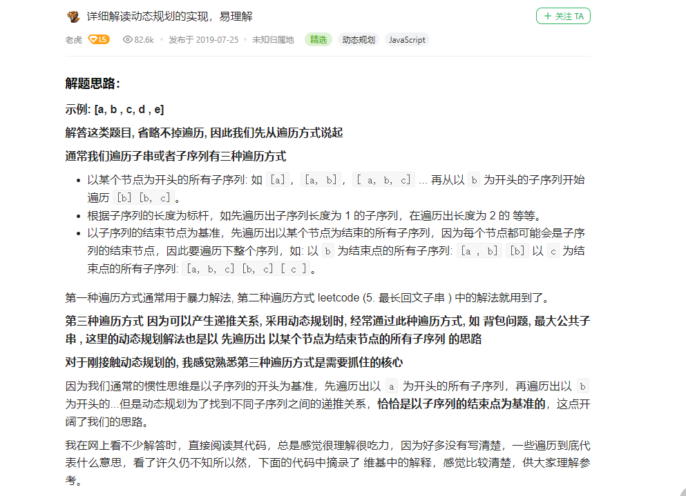

# cpp_algorithms

* 代码随想录 https://programmercarl.com/

* geeksforgeeks https://www.geeksforgeeks.org

--------------------------------------------------------------------------------
> **大家不必太在意leetcode上执行用时，打败多少多少用户，这个就是一个玩具，非常不准确。**
> 
> 做题的时候自己能分析出来时间复杂度就可以了，至于leetcode上执行用时，大概看一下就行，只要达到最优的时间复杂度就可以了，
> 
> 一样的代码多提交几次可能就击败百分之百了....
--------------------------------------------------------------------------------

# 贪心算法

https://www.geeksforgeeks.org/greedy-algorithms/

--------------------------------------------------------------------------------

## 最大子数组和

## `../_3_3_Greedy_Algorithms/_3_maximum_subarray.md` && `../_3_4_Dynamic_Programming/_38_maximum_subarray.md`

--------------------------------------------------------------------------------

### 53. 最大子数组和

> 
> Leetcode链接: https://leetcode.cn/problems/maximum-subarray/
>
> 给你一个整数数组 `nums` ，请你找出一个具有最大和的连续子数组（子数组最少包含一个元素），返回其最大和。
>
> **子数组** 是数组中的一个连续部分。
>
> 
> 
> **示例1：**
> 
> ```html
> 输入：nums = [-2,1,-3,4,-1,2,1,-5,4]
> 输出：6
> 解释：连续子数组 [4,-1,2,1] 的和最大，为 6 。
> ```
> 
> **示例2：**
> 
> ```html
> 输入：nums = [1]
> 输出：1
> ```
> 
> **示例3：**
> 
> ```html
> 输入：nums = [5,4,-1,7,8]
> 输出：23
> ```
>
> **提示：**
> * `1 <= nums.length <= 105`
> * `-104 <= nums[i] <= 104`
>
> ```c++
> class Solution {
> public:
>     int maxSubArray(vector<int>& nums) {
> 
>     }
> };
> ```
> 


#### 我的解法

##### 看过题目之后应该有的思路

> 
> <font color="yellow">回溯法（递归）？这并不是几种常规的回溯问题</font>
> 
> <font color="gree">
> 
> 回溯法，一般可以解决如下几种问题：
>
> * 组合问题：`N`个数里面按一定规则找出`k`个数的集合
> * 切割问题：一个字符串按一定规则有几种切割方式
> * 子集问题：一个`N`个数的集合里有多少符合条件的子集
> * 排列问题：`N`个数按一定规则全排列，有几种排列方式
> * 棋盘问题：`N`皇后，解数独等等
>
> </font>
>

> 
> <font color="yellow">贪心？`num[0:i]`的最大子数组和 怎么求？ 即局部最优解怎么求？ 怎么能推导出全局最优解</font>
> 
> <font color="gree">
> 
> </font>
>


> 
> <font color="yellow">动态规划？ `num[0:i]`的最大子数组和 应该与 `num[0:i-1]、num[0:i-2]、...`有关吧？ 怎么递推？</font>
> 
> <font color="gree">
> 
> </font>
>

>
> <font color="yellow">都不太想得出来，只能试试暴力遍历求解了</font>
> 


##### 暴力解法

> ```c++
> class Solution {
> public:
>     int maxSubArray(vector<int>& nums) {
>         // 遍历，求取最大值
>         int result = nums[0];
>         
>         for(int sublen=1; sublen <= nums.size(); sublen++) { // sublen为连续子数组的长度
>             for(int start=0; start <= nums.size() - sublen; start++) { // start为连续子数组的第一个元素的下标
>                 int sum = 0;
>                 for(int index=start; index < start + sublen; index++) { // index为连续子数组的元素下标
>                     sum += nums[index];
>                 }
>                 if(sum > result) result = sum;
>             }
>         }
>         return result;
>     }
> };
> ```
>
> 这样三层`for`循环会超时
>
> 修改代码
>
> ```c++
> class Solution {
> public:
>     int maxSubArray(vector<int>& nums) {
>         // 遍历，求取最大值
>         int result = nums[0];
>         
>         for(int start = 0; start < nums.size(); start++) { // start为起始位置，即连续子数组的第一个元素的下标
>             int sum = 0;
>             for(int index = start; index < nums.size(); index++) { // index为连续子数组的元素下标
>                 sum += nums[index];
>                 if(sum > result) result = sum;
>             }
> 
>         }
>        
>         return result;
>     }
> };
> ```
> 
> 还是会超时
>
> 


##### 动态规划

> 
> <font color="yellow">动态规划？</font>
> 
> <font color="gree">
>
> 动态规划的`5`步曲
> 
> 1. 确定`dp`数组（`dp table`）以及下标的含义: 即`dp[i]`代表什么？
> > 
> > `dp[i]`的定义为：以第`i`个元素为结束点的子数列的最大和（正数和）。
> > 或者说：包括下标`i`（以`nums[i]`为结尾）的最大连续子序列和为`dp[i]`
> >  
> > > 
> > > 解释：
> > > 
> > > 以子序列的结束节点为基准，先遍历出以某个节点为结束的所有子序列，因为每个节点都可能会是子序列的结束节点，因此要遍历下整个序列，如: 以 `b` 为结束点的所有子序列: `[a, b] [b]`; 以 `c` 为结束点的所有子序列: `[a, b, c] [b, c] [c]`。
> > > 
> > > 
> > > 
> > 
> 2. 确定递推公式（状态转移方程）
> > 
> > 对于`dp[i]`： 以`nums[i]`为结束点的所有子数列分别求和，其中的最大值赋值给`dp[i]`
> > 
> > 则有：`dp[i] = max(dp[i - 1] + nums[i], nums[i]);`
> > 
> > > 
> > > <font color="yellow">解释：</font>
> > > 
> > > 对于以`nums[i]`为结束点的子序列，只是在以`nums[i-1]`为结束点的子序列`{..., num[i-1]}`的基础上扩展了一位, 变成`{..., num[i-1], nums[i]}`； 
> > > 
> > > 当然还有最特殊的长度为`1`的子序列`nums[i]`
> > >  
> > > 除去最特殊的`{nums[i]}`，其他子序列都是在以`num[i-1]`为结束点的子序列`{..., num[i-1]}`基础上扩展为`{..., num[i-1], nums[i]}`
> > > 
> > > 则所有子序列的和，要么是`nums[i]`；要么就是以`num[i-1]`为结束点的子序列和加上`nums[i]`, 即`sum {..., num[i-1]} + nums[i]`
> > > 
> > > 这里面要求出和最大的子序列，
> > > 
> > > 要么是最特殊的子序列`{nums[i]}`, 对应和为`nums[i]`
> > > 
> > > 要么是`dp[i-1]`对应的子序列扩展一位, 和就是`dp[i-1] + nums[i]`
> > > 
> > > 两个比较，最大值就是`dp[i]`
> > > 
> > >
> > > <font color="yellow">举例： </font>
> > > 
> > > 原始数组 `nums[9] = {9, 1, 40, -32, 16, -5, 19, 0, 7}`
> > > 
> > > 当`i = 4`时
> > > 
> > > 以`nums[4]`为结束点的子序列有`{9, 1, 40，-32}、{1, 40，-32}、{40，-32}，{-32}`
> > > 
> > > 以`nums[3]`为结束点的子序列有`{9, 1, 40}、{1, 40}、{40]`
> > > 
> > > 除去最特殊的`{nums[4]}`，其他子序列都是在以`num[4-1]`为结束点的子序列`{..., num[3]}`基础上扩展为`{..., num[3], nums[4]}`
> > > 
> > > 则所有子序列的和，要么是`nums[4]`；要么就是以`num[3]`为结束点的子序列和加上`nums[4]`, 即`sum {..., num[3} + nums[4]`
> > > 
> > > 这里面要求出和最大的子序列，
> > > 
> > > 要么是最特殊的子序列`{nums[4]}`, 对应和为`nums[4]`
> > > 
> > > 要么是`dp[3]`对应的子序列扩展一位, 和就是`dp[3] + nums[4]`
> > > 
> > > 两个比较，最大值就是`dp[4]`
> > > 
> > 
> > 
> 3. `dp`数组如何初始化
> > 
> > 很明显`dp[0] = nums[0]`
> > 
> 4. 确定遍历顺序
> > 
> > 从`nums[0]`结尾的子序列，到`nums[nums.size() - 1]`结尾的子序列
> > 
> 5. 举例推导`dp`数组（举例是为了搞清楚状态转移）
> > 
> > 上面就有例子
> > 
> 
> </font>
> 
> 代码如下
>
> ```c++
> class Solution {
> public:
>     int maxSubArray(vector<int>& nums) {
>         // 构建dp数组
>         // dp[i]: 以nums[i]为结束点的所有子数列分别求和，其中的最大值赋值给dp[i]
>         vector<int> dp(nums.size());
>         
>         // 初始化
>         dp[0] = nums[0];
>         
>         // 遍历
>         for(int i=1; i < nums.size(); i++) {
>             dp[i] = max(dp[i-1]+nums[i], nums[i]);
>         }
> 
>         // 以上只是计算了所有`dp[i]`，但是对于nums，最大和的子数组未必以`nums[nums.size() - 1]`结尾，所以求最大值
>         int result = dp[0];
>         for(int i=0; i < dp.size(); i++) {
>             if(dp[i] > result) result = dp[i];
>         }
>        
>         return result;
>     }
> };
> ```
> 

>
> <font color="red">有一个非常重要的点</font>
>
> https://leetcode.cn/problems/maximum-subarray/solution/xiang-xi-jie-du-dong-tai-gui-hua-de-shi-xian-yi-li/
> 
> <div align=center>
> 
> </div>
> 
> <font color="gree">
> 
> 通常我们遍历`子串或者子序列`有`三种遍历方式`
>
> * `以某个节点为开头的所有子序列`: 如 `[a]，[a, b]，[ a, b, c] ...` 再从以 `b` 为开头的子序列开始遍历 `[b] [b, c]`。
> 
> * `根据子序列的长度为标杆`，如先遍历出子序列长度为 `1` 的子序列，在遍历出长度为 `2` 的 等等。
> 
> * `以某个节点为结束的所有子序列（以子序列的结束节点为基准）`，先遍历出以某个节点为结束的所有子序列，因为每个节点都可能会是子序列的结束节点，因此要遍历下整个序列，如: 以 `b` 为结束点的所有子序列: `[a , b] [b]`; 以 `c` 为结束点的所有子序列: `[a, b, c] [b, c] [ c ]`。
>
> 
> 第一种遍历方式通常用于暴力解法, 
> 
> 第二种遍历方式 `leetcode` (5. 最长回文子串 ) 中的解法就用到了。
> 
> 本题，我们就是采用了第三种遍历方式
>
>
> </font>
> 
> <font color="yellow">
> 
> **第三种遍历方式 因为可以产生递推关系, 采用动态规划时, 经常通过此种遍历方式, 如 背包问题, 最大公共子串 , 这里的动态规划解法也是以 先遍历出 以某个节点为结束节点的所有子序列 的思路**
> 
> **对于刚接触动态规划的, 我感觉熟悉第三种遍历方式是需要抓住的核心**
>
> 因为`我们通常的惯性思维是以子序列的开头为基准`，先遍历出以 `a` 为开头的所有子序列，再遍历出以 `b` 为开头的...但是`动态规划为了找到不同子序列之间的递推关系，恰恰是以子序列的结束点为基准的，这点开阔了我们的思路。`
>
> 
> </font>
> 


#### 代码随想录

##### 暴力解法

> 
> https://programmercarl.com/0053.%E6%9C%80%E5%A4%A7%E5%AD%90%E5%BA%8F%E5%92%8C.html
> 
>
> 暴力解法的思路，第一层 `for` 就是设置起始位置，第二层 `for` 循环遍历数组寻找最大值
>
> ```c++
> class Solution {
> public:
>     int maxSubArray(vector<int>& nums) {
>         int result = INT32_MIN;
>         int count = 0;
>         for (int i = 0; i < nums.size(); i++) { // 设置起始位置
>             count = 0;
>             for (int j = i; j < nums.size(); j++) { // 每次从起始位置i开始遍历寻找最大值
>                 count += nums[j];
>                 result = count > result ? count : result;
>             }
>         }
>         return result;
>     }
> };
> ```
> 
> * 时间复杂度：`O(n^2)`
> * 空间复杂度：`O(1)`
>
> 以上暴力的解法 `C++`勉强可以过，其他语言就不确定了。
>
> 但是我实际运行，也过不了
> 

#### 贪心算法 (难以理解，不知道如何证明这样做的合理性)

>
> https://programmercarl.com/0053.%E6%9C%80%E5%A4%A7%E5%AD%90%E5%BA%8F%E5%92%8C.html
>
> <font color="yellow"> 
> 
> 本题的贪心思路其实并不好想，这也进一步验证了，别看贪心理论很直白，有时候看似是常识，但贪心的题目一点都不简单！
>
> 后续将介绍的贪心题目都挺难的，所以贪心很有意思，别小看贪心！
>
> </font>
>
> **贪心贪的是哪里呢？**
>
> 如果 `-2 1` 在一起，计算起点的时候，一定是从 `1` 开始计算，因为负数只会拉低总和，这就是贪心贪的地方！
>
> 局部最优：当前“连续和”为负数的时候立刻放弃，从下一个元素重新计算“连续和”，因为负数加上下一个元素 “连续和”只会越来越小。
>
> 全局最优：选取最大“连续和”
>
> **局部最优的情况下，并记录最大的“连续和”，可以推出全局最优。**
>
> 从代码角度上来讲：遍历 `nums`，从头开始用 `count` 累积，如果 `count` 一旦加上 `nums[i]`变为负数，那么就应该从 `nums[i+1]`开始从 0` 累积 `count` 了，因为已经变为负数的 `count`，只会拖累总和。
>
> **这相当于是暴力解法中的不断调整最大子序和区间的起始位置。**
>
> **那有同学问了，区间终止位置不用调整么？ 如何才能得到最大“连续和”呢？**
>
> 区间的终止位置，其实就是如果 `count` 取到最大值了，及时记录下来了。例如如下代码：
> 
> ```c++
> if (count > result) result = count;
> ```
>
> **这样相当于是用 `result` 记录最大子序和区间和（变相的算是调整了终止位置）。**
>
> 如动画所示：
> 
> <div align=center>
> 
> </div>
> 
> 红色的起始位置就是贪心每次取 `count` 为正数的时候，开始一个区间的统计。
>
> 那么不难写出如下 C++代码（关键地方已经注释）
>
> ```c++
> class Solution {
> public:
>     int maxSubArray(vector<int>& nums) {
>         int result = INT32_MIN;
>         int count = 0;
>         for (int i = 0; i < nums.size(); i++) {
>             count += nums[i];
>             if (count > result) { // 取区间累计的最大值（相当于不断确定最大子序终止位置）
>                 result = count;
>             }
>             if (count <= 0) count = 0; // 相当于重置最大子序起始位置，因为遇到负数一定是拉低总和
>         }
>         return result;
>     }
> };
> ```
> 
> * 时间复杂度：`O(n)`
> * 空间复杂度：`O(1)`
>
> 当然题目没有说如果数组为空，应该返回什么，所以数组为空的话返回啥都可以了。
> 

>
> **常见误区**
>
> 误区一：
> 
> 不少同学认为 如果输入用例都是`-1`，或者 都是负数，这个贪心算法跑出来的结果是 `0`， 这是又一次证明脑洞模拟不靠谱的经典案例，建议大家把代码运行一下试一试，就知道了，也会理解 为什么 `result` 要初始化为最小负数了。
>
> 误区二：
> 
> 大家在使用贪心算法求解本题，经常陷入的误区，就是分不清，是遇到 负数就选择起始位置，还是连续和为负选择起始位置。
>
> 在动画演示用，大家可以发现， `4`，遇到 `-1` 的时候，我们依然累加了，为什么呢？
> 
> 因为和为 `3`，只要连续和还是正数就会 对后面的元素 起到增大总和的作用。 所以只要连续和为正数我们就保留。
>
> 这里也会有录友疑惑，那 `4 + -1` 之后 不就变小了吗？ 会不会错过 `4` 成为最大连续和的可能性？
>
> 其实并不会，因为还有一个变量 `result` 一直在更新 最大的连续和，只要有更大的连续和出现，`result` 就更新了，那么 `result` 已经把 `4` 更新了，后面 连续和变成 `3`，也不会对最后结果有影响。
> 
> 


##### 动态规划

>
> https://programmercarl.com/0053.%E6%9C%80%E5%A4%A7%E5%AD%90%E5%BA%8F%E5%92%8C%EF%BC%88%E5%8A%A8%E6%80%81%E8%A7%84%E5%88%92%EF%BC%89.html
>
> 


