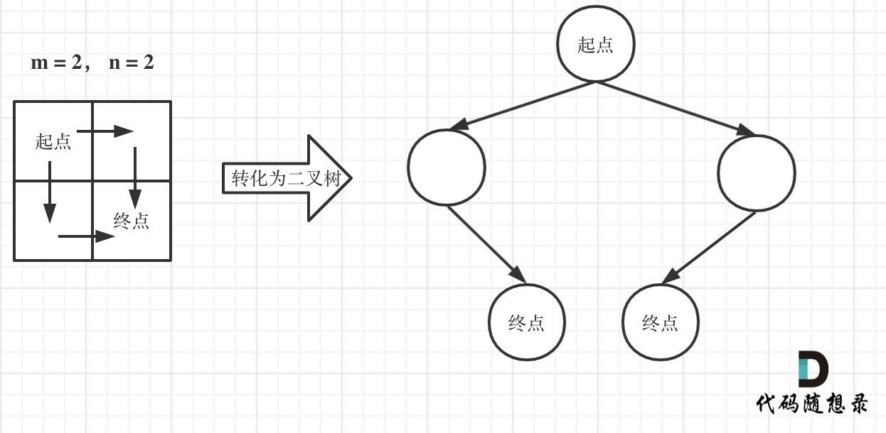
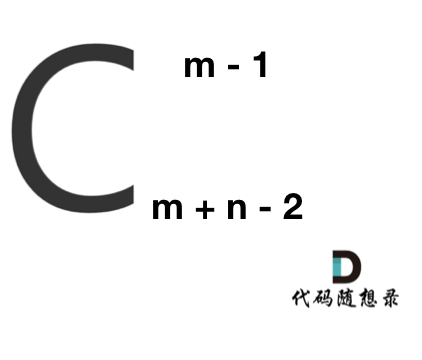
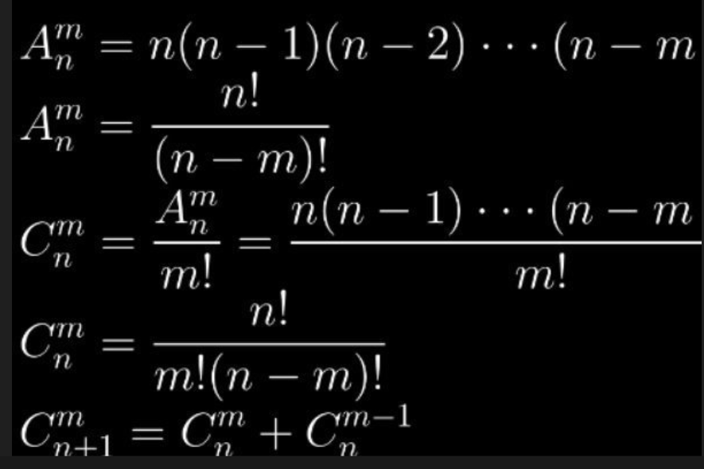

# cpp_algorithms

* 代码随想录 https://programmercarl.com/

* geeksforgeeks https://www.geeksforgeeks.org

--------------------------------------------------------------------------------
> **大家不必太在意leetcode上执行用时，打败多少多少用户，这个就是一个玩具，非常不准确。**
> 
> 做题的时候自己能分析出来时间复杂度就可以了，至于leetcode上执行用时，大概看一下就行，只要达到最优的时间复杂度就可以了，
> 
> 一样的代码多提交几次可能就击败百分之百了....
--------------------------------------------------------------------------------

# 动态规划

https://www.geeksforgeeks.org/dynamic-programming/

--------------------------------------------------------------------------------

## 不同路径

## _5_unique_paths.md

--------------------------------------------------------------------------------

### 62. 不同路径

> 
> Leetcode链接: https://leetcode.cn/problems/unique-paths/
>
> 一个机器人位于一个 `m x n` 网格的左上角 （起始点在下图中标记为 “`Start`” ）。
>
> 机器人每次只能向下或者向右移动一步。机器人试图达到网格的右下角（在下图中标记为 “`Finish`” ）。
>
> 问总共有多少条不同的路径？
>
>
> **示例1：**
> > 
> > <div align=center>
> > 
> > </div>
> >  
> ```html
> 输入：m = 3, n = 7
> 输出：28
> ```
>
> **示例2：**
> 
> ```html
> 输入：m = 3, n = 2
> 输出：3
> 解释：
> 从左上角开始，总共有 3 条路径可以到达右下角。
> 1. 向右 -> 向下 -> 向下
> 2. 向下 -> 向下 -> 向右
> 3. 向下 -> 向右 -> 向下
> ```
>
> **示例3：**
> 
> ```html
> 输入：m = 7, n = 3DD
> 输出：28
> ```
>
> **示例4：**
> 
> ```html
> 输入：m = 3, n = 3
> 输出：6
> ```
> 
>
> **提示：**
> * `1 <= m, n <= 100`
> * 题目数据保证答案小于等于 `2 * 10^9`
>
>
> ```c++
> class Solution {
> public:
>     int uniquePaths(int m, int n) {
> 
>     }
> };
> ```
> 


#### 我的思路(注释中) 及代码如下

```c++
class Solution {
public:
    int uniquePaths(int m, int n) {
        // 分析如下：
        // 如果设置向下为-1，向右为1； 则要满足向下的累积和为-m, 向右的累计和为n
        // 这样遍历感觉很难算？

        // 考虑三大算法：
        // 1. 这并不是回溯算法的相关问题
        // 2. 贪心感觉也想不出来 
        // 3. 如果使用动态规划呢？

        // 设置二维数组dp[i, j]： 指的是从左上角到坐标(i, j)的路径总数
        vector<vector<int>> dp(m, vector<int>(n)); // 初始化时，记得设置长宽，不然添加元素时一次次resize很费时间
        
        // 那么递推公式是什么呢？
        // dp[i ,j] = dp[i, j-1]+ dp[i-1,j], 
        // 即只能从左侧(i-1, j)或者上侧(i, j-1)的两个网格点到达(i, j)

        // 初始化？dp[0, 0] = 0;
        // 第一排、第一列（最上侧、最左侧） 全部初始化为1，因为路径都是只有一条
        // dp[0, 0], dp[0, 1], dp[0, 2], ..., dp[0, n-1]; dp[0, 0], dp[1, 0], dp[2,0], ..., dp[m-1, 0]
        dp[0][0] = 0;
        for(int i=0; i < n; i++) {
            dp[0][i] = 1;
        }
        for(int i=0; i < m; i++) {
            dp[i][0] = 1;
        }        

        // 遍历方式？
        // 不太好想，先具体写一遍，再抽象为循环代码
        // 初始化时，已经遍历完第一排、第一列
        // dp[0, 0], dp[0, 1], dp[0, 2], ..., dp[0, n-1]; dp[0, 0], dp[1, 0], dp[2,0], ..., dp[m-1, 0]
        // 第二排、第二列（从dp[1, 1]开始，已经遍历过的不再检索）
        // dp[1, 1], dp[1, 2], dp[1, 3], ..., dp[1, n-1]; dp[1, 1], dp[2, 1], dp[3,1], ..., dp[m-1, 1]
        // 第三排、第三列（从dp[2, 2]开始，已经遍历过的不再检索）
        // dp[2, 2], dp[2, 3], dp[2, 4], ..., dp[2, n-1]; dp[2, 2], dp[3, 2], dp[4,2], ..., dp[m-1, 2]
        // ...
        // 取min(m, n) = k
        // 第k-1排、第k-1列
        // dp[k-2, k-2], dp[k-2, k-1], ..., dp[k-2, n-1]; dp[k-2, k-2], dp[k-1, k-2], ..., dp[m-1, k-2]
        // 第k排、第k列        
        // dp[k-1, k-1], ..., dp[k-1, n-1]; dp[k-1, k-1], ..., dp[m-1, k-1]
        
        // 从第二排第二列开始，a=1
        for(int a=1; a < min(m, n); a++) {
            int row = a;
            for(int i=row; i < n; i++) {
                dp[row][i] =  dp[row][i-1] + dp[row-1][i] ;
            }
            int col = a;
            for(int j=col; j < m; j++) {
                dp[j][col] =  dp[j][col-1] + dp[j-1][col];
            }
        }
        
        // 返回(m, n),即dp[m-1, n-1]
        return dp[m-1][n-1];
    }
};
```


#### 代码随想录（三种方法：深搜、动规、数论）

##### 思路

>
> **深搜**
>
> 这道题目，刚一看最直观的想法就是用图论里的深搜，来枚举出来有多少种路径。
>
> 注意题目中说机器人每次只能向下或者向右移动一步，那么其实**机器人走过的路径可以抽象为一棵二叉树，而叶子节点就是终点！**
> 
> > 
> > <div align=center>
> > 
> > </div>
> >  
> 
> 此时问题就可以转化为求二叉树叶子节点的个数，代码如下：
>
> ```c++
> class Solution {
> private:
>     int dfs(int i, int j, int m, int n) {
>         if (i > m || j > n) return 0; // 越界了
>         if (i == m && j == n) return 1; // 找到一种方法，相当于找到了叶子节点
>         return dfs(i + 1, j, m, n) + dfs(i, j + 1, m, n);
>     }
> public:
>     int uniquePaths(int m, int n) {
>         return dfs(1, 1, m, n);
>     }
> };
> ```
>
> **大家如果提交了代码就会发现超时了！**
>
> 来分析一下时间复杂度，这个深搜的算法，其实就是要遍历整个二叉树。
> 
> 这棵树的深度其实就是`m+n-`1（深度按从`1`开始计算）。
>
> 那二叉树的节点个数就是 `2^(m + n - 1) - 1`。可以理解深搜的算法就是遍历了整个满二叉树（其实没有遍历整个满二叉树，只是近似而已）
>
> 所以上面深搜代码的时间复杂度为`O(2^(m + n - 1) - 1)`，可以看出，这是指数级别的时间复杂度，是非常大的。
>
> 

>
> **动态规划**
>
> 机器人从`(0 , 0)` 位置出发，到`(m - 1, n - 1)`终点。
>
> 按照动规五部曲来分析：
>
> 1. 确定`dp`数组（`dp table`）以及下标的含义
>
> `dp[i][j]` ：表示从`（0 ，0）`出发，到`(i, j) `有`dp[i][j]`条不同的路径。
>
> 2. 确定递推公式
>
> 想要求`dp[i][j]，`只能有两个方向来推导出来，即`dp[i - 1][j]` 和 `dp[i][j - 1]`。
>
> 此时在回顾一下 `dp[i - 1][j]` 表示啥，是从`(0, 0)`的位置到`(i - 1, j)`有几条路径，`dp[i][j - 1]`同理。
>
> 那么很自然，`dp[i][j] = dp[i - 1][j] + dp[i][j - 1]`，因为`dp[i][j]`只有这两个方向过来。
>
> 3. `dp`数组的初始化
>
> 如何初始化呢，首先`dp[i][0]`一定都是`1`，因为从`(0, 0)`的位置到`(i, 0)`的路径只有一条，那么`dp[0][j]`也同理。
>
> 所以初始化代码为：
> 
> ```c++
> for (int i = 0; i < m; i++) dp[i][0] = 1;
> for (int j = 0; j < n; j++) dp[0][j] = 1;
> ```
> 
> 4. 确定遍历顺序
>
> 这里要看一下递推公式`dp[i][j] = dp[i - 1][j] + dp[i][j - 1]`，`dp[i][j]`都是从其上方和左方推导而来，那么从左到右一层一层遍历就可以了。
>
> 这样就可以保证推导`dp[i][j]`的时候，`dp[i - 1][j]` 和 `dp[i][j - 1]`一定是有数值的。
> 
> 5. 举例推导`dp`数组
>
> 如图所示：
> 
> > 
> > <div align=center>
> > 
> > </div>
> >  
> 
> 以上动规五部曲分析完毕，`C++`代码如下：
>
> ```c++
> class Solution {
> public:
>     int uniquePaths(int m, int n) {
>         vector<vector<int>> dp(m, vector<int>(n, 0));
>         for (int i = 0; i < m; i++) dp[i][0] = 1;
>         for (int j = 0; j < n; j++) dp[0][j] = 1;
>         for (int i = 1; i < m; i++) {
>             for (int j = 1; j < n; j++) {
>                 dp[i][j] = dp[i - 1][j] + dp[i][j - 1];
>             }
>         }
>         return dp[m - 1][n - 1];
>     }
> };
> ```
> 
> * 时间复杂度：`O(m × n)`
> * 空间复杂度：`O(m × n)`
> 
> 其实用一个一维数组（也可以理解是滚动数组）就可以了，但是不利于理解，可以优化点空间，建议先理解了二维，在理解一维，C++代码如下：
>
> ```c++
> class Solution {
> public:
>     int uniquePaths(int m, int n) {
>         vector<int> dp(n);
>         for (int i = 0; i < n; i++) dp[i] = 1;
>         for (int j = 1; j < m; j++) {
>             for (int i = 1; i < n; i++) {
>                 dp[i] += dp[i - 1];
>             }
>         }
>         return dp[n - 1];
>     }
> };
> ```
> 
> 
> * 时间复杂度：`O(m × n)`
> * 空间复杂度：`O(n)`
>
> 
> 

>
> **数论方法**
>
> 在这个图中，可以看出一共`m，n`的话，无论怎么走，走到终点都需要` m + n - 2` 步。
> 
> > 
> > <div align=center>
> > 
> > </div>
> >  
> 
> 在这`m + n - 2` 步中，一定有 `m - 1` 步是要向下走的，不用管什么时候向下走。
>
> 那么有几种走法呢？ 可以转化为，给你`m + n - 2`个不同的数，随便取`m - 1`个数，有几种取法。
>
> 那么这就是一个组合问题了。
>
> 那么答案，如图所示：
> 
> > 
> > <div align=center>
> > 
> > 
> > </div>
> >  
>
> $C_{m}^{n}$计算方式如下:
> 
> $C_{m}^{n} = \frac{A_{m}^{n}}{m!} = \frac{n!}{m!(n-m)!} = \frac{n(n-1)...(n-m+1)}{m!}$
> 
> 我们用$C_{m}^{n} = \frac{n(n-1)...(n-m+1)}{m!}$
> 
> **求组合的时候，要防止两个int相乘溢出！** 所以不能把算式的分子都算出来，分母都算出来再做除法。
> 
> 例如如下代码是不行的。
>
> ```c++
> class Solution {
> public:
>     int uniquePaths(int m, int n) {
>         int numerator = 1, denominator = 1;
>         int count = m - 1;
>         int t = m + n - 2;
>         while (count--) numerator *= (t--); // 计算分子，此时分子就会溢出
>         for (int i = 1; i <= m - 1; i++) denominator *= i; // 计算分母
>         return numerator / denominator;
>     }
> };
> ```
> 
> 需要在计算分子的时候，不断除以分母，代码如下：
>
> ```c++
> class Solution {
> public:
>     int uniquePaths(int m, int n) {
>         long long numerator = 1; // 分子
>         int denominator = m - 1; // 分母
>         int count = m - 1;
>         int t = m + n - 2;
>         while (count--) {
>             numerator *= (t--);
>             while (denominator != 0 && numerator % denominator == 0) {
>                 numerator /= denominator;
>                 denominator--;
>             }
>         }
>         return numerator;
>     }
> };
> ```
> 
> 
> * 时间复杂度：`O(m)`
> * 空间复杂度：`O(1)`
>
> **计算组合问题的代码还是有难度的，特别是处理溢出的情况！**
>
> 


##### 总结

>
> 本文分别给出了深搜，动规，数论三种方法。
>
> 深搜当然是超时了，顺便分析了一下使用深搜的时间复杂度，就可以看出为什么超时了。
>
> 然后在给出动规的方法，依然是使用动规五部曲，这次我们就要考虑如何正确的初始化了，初始化和遍历顺序其实也很重要！
>
> 


